# API Reference

<cite>
**Referenced Files in This Document**   
- [IRelay.cs](file://src/Relay.Core/Contracts/Core/IRelay.cs)
- [RelayServiceCollectionExtensions.cs](file://src/Relay/RelayServiceCollectionExtensions.cs)
- [HandleAttribute.cs](file://src/Relay.Core/Attributes/HandleAttribute.cs)
- [NotificationAttribute.cs](file://src/Relay.Core/Attributes/NotificationAttribute.cs)
- [PipelineAttribute.cs](file://src/Relay.Core/Attributes/PipelineAttribute.cs)
- [IRequest.cs](file://src/Relay.Core/Contracts/Requests/IRequest.cs)
- [IStreamRequest.cs](file://src/Relay.Core/Contracts/Requests/IStreamRequest.cs)
- [RelayOptions.cs](file://src/Relay.Core/Configuration/Options/Core/RelayOptions.cs)
- [AuthorizationOptions.cs](file://src/Relay.Core/Configuration/Options/Authorization/AuthorizationOptions.cs)
- [CachingOptions.cs](file://src/Relay.Core/Configuration/Options/Caching/CachingOptions.cs)
- [ContractValidationOptions.cs](file://src/Relay.Core/Configuration/Options/ContractValidation/ContractValidationOptions.cs)
- [DistributedTracingOptions.cs](file://src/Relay.Core/Configuration/Options/DistributedTracing/DistributedTracingOptions.cs)
- [EndpointOptions.cs](file://src/Relay.Core/Configuration/Options/Endpoints/EndpointOptions.cs)
- [EventSourcingOptions.cs](file://src/Relay.Core/Configuration/Options/EventSourcing/EventSourcingOptions.cs)
- [HandlerOptions.cs](file://src/Relay.Core/Configuration/Options/Handlers/HandlerOptions.cs)
- [HandlerVersioningOptions.cs](file://src/Relay.Core/Configuration/Options/Handlers/HandlerVersioningOptions.cs)
- [MessageQueueOptions.cs](file://src/Relay.Core/Configuration/Options/MessageQueue/MessageQueueOptions.cs)
- [NotificationOptions.cs](file://src/Relay.Core/Configuration/Options/Notifications/NotificationOptions.cs)
- [PerformanceOptions.cs](file://src/Relay.Core/Configuration/Options/Performance/PerformanceOptions.cs)
- [RateLimitingOptions.cs](file://src/Relay.Core/Configuration/Options/RateLimiting/RateLimitingOptions.cs)
- [RetryOptions.cs](file://src/Relay.Core/Configuration/Options/Retry/RetryOptions.cs)
- [ValidationOptions.cs](file://src/Relay.Core/Configuration/Options/Core/ValidationOptions.cs)
</cite>

## Table of Contents
1. [Introduction](#introduction)
2. [Core Functionality](#core-functionality)
3. [Service Collection Extensions](#service-collection-extensions)
4. [Configuration Options](#configuration-options)
5. [Attributes](#attributes)
6. [Pipeline Behaviors](#pipeline-behaviors)
7. [Message Brokering](#message-brokering)
8. [Advanced Features](#advanced-features)
9. [Cross-References](#cross-references)

## Introduction
The Relay framework is a high-performance mediator and messaging framework for .NET that enables efficient request/response patterns, command handling, and event publishing with minimal performance impact. The framework uses source generators to eliminate runtime reflection overhead, providing compile-time code generation for optimized dispatchers. This API reference documents the public interfaces, classes, methods, properties, and events in the core library, organized by functional areas.

## Core Functionality

### IRelay Interface
The primary interface for the Relay mediator framework provides methods for sending requests, streaming data, and publishing notifications.

```mermaid
classDiagram
class IRelay {
<<interface>>
+SendAsync<TResponse>(IRequest<TResponse>, CancellationToken) ValueTask<TResponse>
+SendAsync(IRequest, CancellationToken) ValueTask
+StreamAsync<TResponse>(IStreamRequest<TResponse>, CancellationToken) IAsyncEnumerable<TResponse>
+PublishAsync<TNotification>(TNotification, CancellationToken) ValueTask
}
class IRequest {
<<interface>>
}
class IRequest<TResponse> {
<<interface>>
}
class IStreamRequest<TResponse> {
<<interface>>
}
class INotification {
<<interface>>
}
IRelay --> IRequest : "sends"
IRelay --> IRequest<TResponse> : "sends"
IRelay --> IStreamRequest<TResponse> : "streams"
IRelay --> INotification : "publishes"
```

**Diagram sources**
- [IRelay.cs](file://src/Relay.Core/Contracts/Core/IRelay.cs#L12-L49)
- [IRequest.cs](file://src/Relay.Core/Contracts/Requests/IRequest.cs#L7-L16)
- [IStreamRequest.cs](file://src/Relay.Core/Contracts/Requests/IStreamRequest.cs#L7-L9)

**Section sources**
- [IRelay.cs](file://src/Relay.Core/Contracts/Core/IRelay.cs#L12-L49)

### Request Contracts
The framework defines marker interfaces for different types of requests.

**IRequest** - Marker interface for requests that do not return a response.
**IRequest<TResponse>** - Marker interface for requests that return a response of type TResponse.
**IStreamRequest<TResponse>** - Marker interface for streaming requests that return multiple responses of type TResponse.

**Section sources**
- [IRequest.cs](file://src/Relay.Core/Contracts/Requests/IRequest.cs#L1-L17)
- [IStreamRequest.cs](file://src/Relay.Core/Contracts/Requests/IStreamRequest.cs#L1-L9)

## Service Collection Extensions

### RelayServiceCollectionExtensions
Provides centralized extension methods for configuring the Relay framework in dependency injection containers.

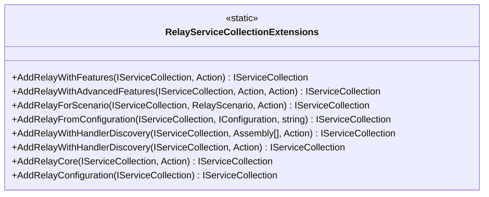

**Diagram sources**
- [RelayServiceCollectionExtensions.cs](file://src/Relay/RelayServiceCollectionExtensions.cs#L26-L255)

**Section sources**
- [RelayServiceCollectionExtensions.cs](file://src/Relay/RelayServiceCollectionExtensions.cs#L26-L255)

## Configuration Options

### RelayOptions
Global configuration options for the Relay framework that control default behavior across all functional areas.

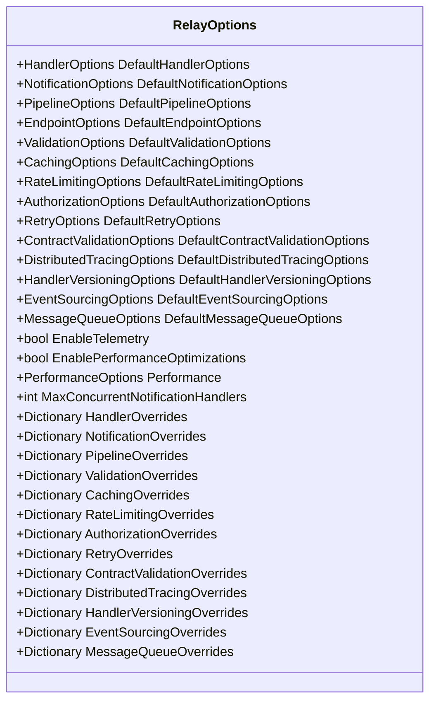

**Diagram sources**
- [RelayOptions.cs](file://src/Relay.Core/Configuration/Options/Core/RelayOptions.cs#L21-L177)

**Section sources**
- [RelayOptions.cs](file://src/Relay.Core/Configuration/Options/Core/RelayOptions.cs#L21-L177)

### AuthorizationOptions
Configuration options for authorization behavior in the Relay framework.

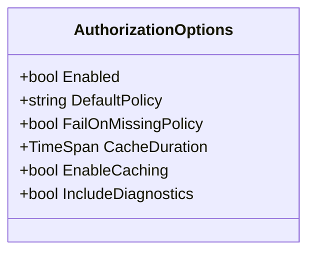

**Diagram sources**
- [AuthorizationOptions.cs](file://src/Relay.Core/Configuration/Options/Authorization/AuthorizationOptions.cs)

**Section sources**
- [AuthorizationOptions.cs](file://src/Relay.Core/Configuration/Options/Authorization/AuthorizationOptions.cs)

### CachingOptions
Configuration options for caching behavior in the Relay framework.

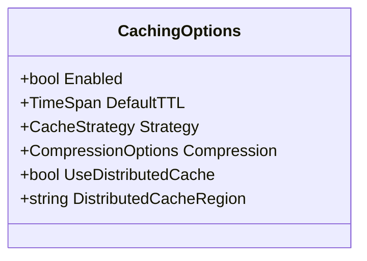

**Diagram sources**
- [CachingOptions.cs](file://src/Relay.Core/Configuration/Options/Caching/CachingOptions.cs)

**Section sources**
- [CachingOptions.cs](file://src/Relay.Core/Configuration/Options/Caching/CachingOptions.cs)

### ContractValidationOptions
Configuration options for contract validation behavior in the Relay framework.

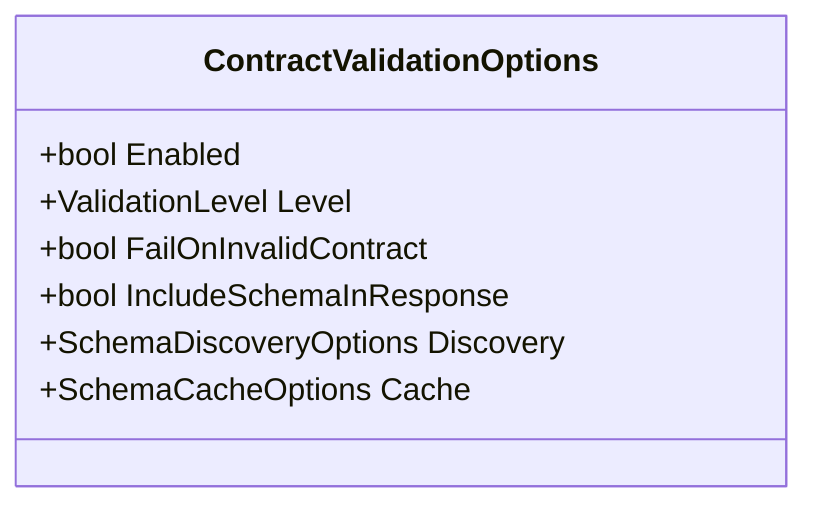

**Diagram sources**
- [ContractValidationOptions.cs](file://src/Relay.Core/Configuration/Options/ContractValidation/ContractValidationOptions.cs)

**Section sources**
- [ContractValidationOptions.cs](file://src/Relay.Core/Configuration/Options/ContractValidation/ContractValidationOptions.cs)

### DistributedTracingOptions
Configuration options for distributed tracing behavior in the Relay framework.

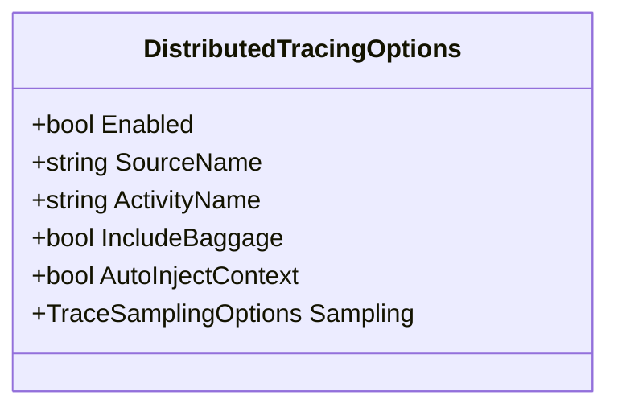

**Diagram sources**
- [DistributedTracingOptions.cs](file://src/Relay.Core/Configuration/Options/DistributedTracing/DistributedTracingOptions.cs)

**Section sources**
- [DistributedTracingOptions.cs](file://src/Relay.Core/Configuration/Options/DistributedTracing/DistributedTracingOptions.cs)

### EndpointOptions
Configuration options for endpoint generation in the Relay framework.

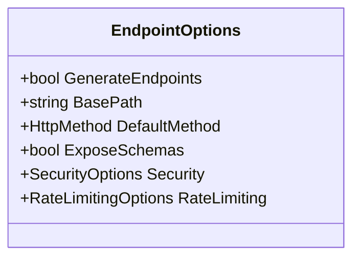

**Diagram sources**
- [EndpointOptions.cs](file://src/Relay.Core/Configuration/Options/Endpoints/EndpointOptions.cs)

**Section sources**
- [EndpointOptions.cs](file://src/Relay.Core/Configuration/Options/Endpoints/EndpointOptions.cs)

### EventSourcingOptions
Configuration options for event sourcing behavior in the Relay framework.

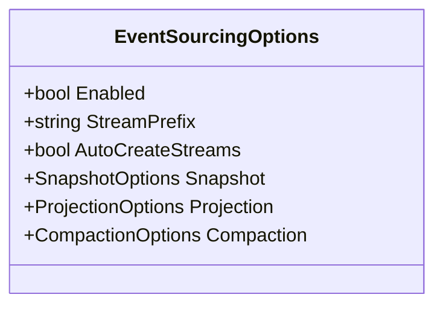

**Diagram sources**
- [EventSourcingOptions.cs](file://src/Relay.Core/Configuration/Options/EventSourcing/EventSourcingOptions.cs)

**Section sources**
- [EventSourcingOptions.cs](file://src/Relay.Core/Configuration/Options/EventSourcing/EventSourcingOptions.cs)

### HandlerOptions
Configuration options for request handler behavior in the Relay framework.

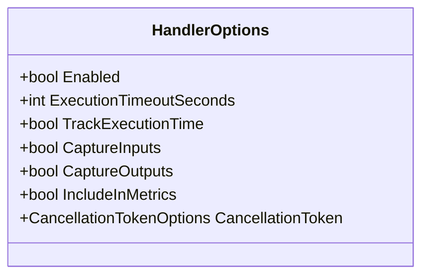

**Diagram sources**
- [HandlerOptions.cs](file://src/Relay.Core/Configuration/Options/Handlers/HandlerOptions.cs)

**Section sources**
- [HandlerOptions.cs](file://src/Relay.Core/Configuration/Options/Handlers/HandlerOptions.cs)

### HandlerVersioningOptions
Configuration options for handler versioning behavior in the Relay framework.

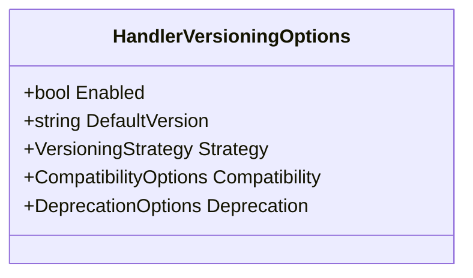

**Diagram sources**
- [HandlerVersioningOptions.cs](file://src/Relay.Core/Configuration/Options/Handlers/HandlerVersioningOptions.cs)

**Section sources**
- [HandlerVersioningOptions.cs](file://src/Relay.Core/Configuration/Options/Handlers/HandlerVersioningOptions.cs)

### MessageQueueOptions
Configuration options for message queue integration in the Relay framework.

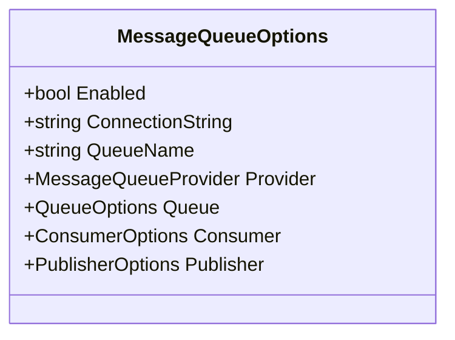

**Diagram sources**
- [MessageQueueOptions.cs](file://src/Relay.Core/Configuration/Options/MessageQueue/MessageQueueOptions.cs)

**Section sources**
- [MessageQueueOptions.cs](file://src/Relay.Core/Configuration/Options/MessageQueue/MessageQueueOptions.cs)

### NotificationOptions
Configuration options for notification handler behavior in the Relay framework.

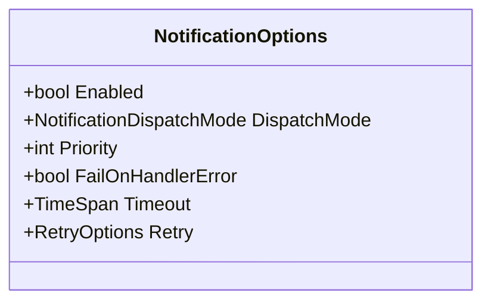

**Diagram sources**
- [NotificationOptions.cs](file://src/Relay.Core/Configuration/Options/Notifications/NotificationOptions.cs)

**Section sources**
- [NotificationOptions.cs](file://src/Relay.Core/Configuration/Options/Notifications/NotificationOptions.cs)

### PerformanceOptions
Configuration options for performance optimizations in the Relay framework.

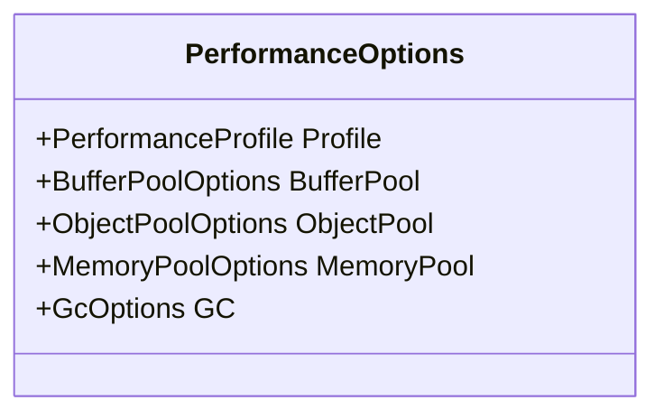

**Diagram sources**
- [PerformanceOptions.cs](file://src/Relay.Core/Configuration/Options/Performance/PerformanceOptions.cs)

**Section sources**
- [PerformanceOptions.cs](file://src/Relay.Core/Configuration/Options/Performance/PerformanceOptions.cs)

### RateLimitingOptions
Configuration options for rate limiting behavior in the Relay framework.

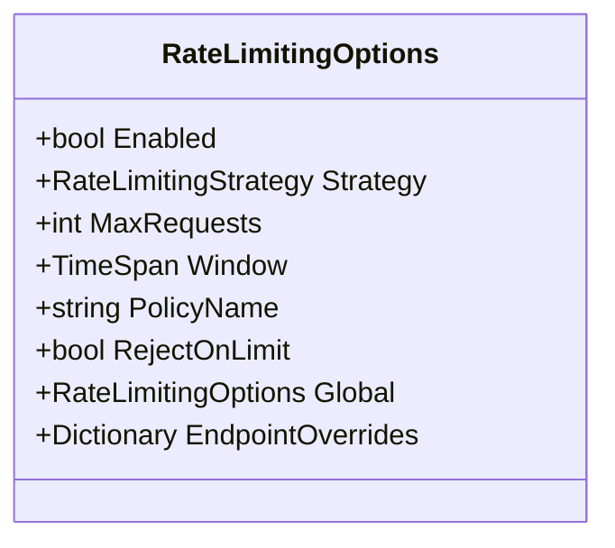

**Diagram sources**
- [RateLimitingOptions.cs](file://src/Relay.Core/Configuration/Options/RateLimiting/RateLimitingOptions.cs)

**Section sources**
- [RateLimitingOptions.cs](file://src/Relay.Core/Configuration/Options/RateLimiting/RateLimitingOptions.cs)

### RetryOptions
Configuration options for retry behavior in the Relay framework.

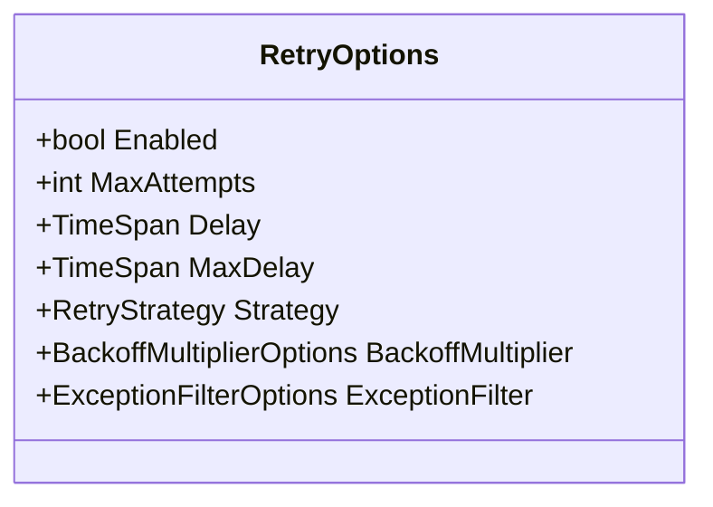

**Diagram sources**
- [RetryOptions.cs](file://src/Relay.Core/Configuration/Options/Retry/RetryOptions.cs)

**Section sources**
- [RetryOptions.cs](file://src/Relay.Core/Configuration/Options/Retry/RetryOptions.cs)

### ValidationOptions
Configuration options for validation behavior in the Relay framework.

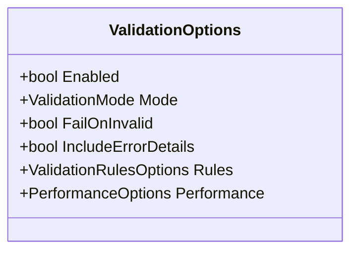

**Diagram sources**
- [ValidationOptions.cs](file://src/Relay.Core/Configuration/Options/Core/ValidationOptions.cs)

**Section sources**
- [ValidationOptions.cs](file://src/Relay.Core/Configuration/Options/Core/ValidationOptions.cs)

## Attributes

### HandleAttribute
Attribute to mark methods as request handlers.

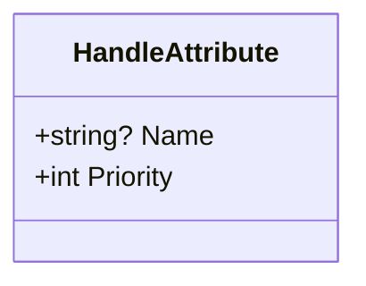

**Diagram sources**
- [HandleAttribute.cs](file://src/Relay.Core/Attributes/HandleAttribute.cs#L9-L21)

**Section sources**
- [HandleAttribute.cs](file://src/Relay.Core/Attributes/HandleAttribute.cs#L9-L21)

### NotificationAttribute
Attribute to mark methods as notification handlers.

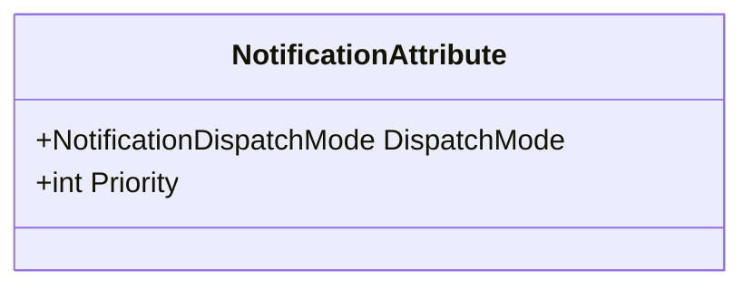

**Diagram sources**
- [NotificationAttribute.cs](file://src/Relay.Core/Attributes/NotificationAttribute.cs#L9-L21)

**Section sources**
- [NotificationAttribute.cs](file://src/Relay.Core/Attributes/NotificationAttribute.cs#L9-L21)

### PipelineAttribute
Attribute to mark methods as pipeline behaviors.

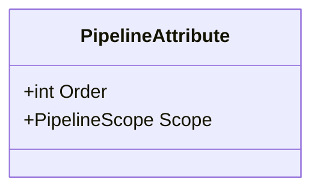

**Diagram sources**
- [PipelineAttribute.cs](file://src/Relay.Core/Attributes/PipelineAttribute.cs#L9-L21)

**Section sources**
- [PipelineAttribute.cs](file://src/Relay.Core/Attributes/PipelineAttribute.cs#L9-L21)

## Pipeline Behaviors
The Relay framework supports pipeline behaviors that can be applied to requests and notifications. These behaviors are executed in a specific order and can perform cross-cutting concerns such as logging, validation, authorization, and error handling.

Pipeline behaviors are configured using the PipelineAttribute, which specifies the execution order and scope. The framework provides built-in pipeline behaviors for common scenarios:

- **AuthorizationPipelineBehavior**: Handles authorization checks for requests
- **ContractValidationPipelineBehavior**: Validates request contracts against schemas
- **DistributedTracingPipelineBehavior**: Adds distributed tracing context to requests
- **RetryPipelineBehavior**: Implements retry logic for failed requests
- **TransactionBehavior**: Manages transaction boundaries for requests

Custom pipeline behaviors can be implemented by creating classes that implement the appropriate behavior interfaces and registering them in the service collection.

**Section sources**
- [PipelineAttribute.cs](file://src/Relay.Core/Attributes/PipelineAttribute.cs#L9-L21)
- [RelayOptions.cs](file://src/Relay.Core/Configuration/Options/Core/RelayOptions.cs#L36-L37)

## Message Brokering
The Relay framework provides integration with various message brokers through the Relay.MessageBroker package. This enables publishing and consuming messages from external messaging systems such as RabbitMQ, Kafka, Azure Service Bus, AWS SQS/SNS, and Redis Streams.

Message brokering functionality is configured through the MessageQueueOptions class, which specifies the connection details, queue configuration, and consumer/publisher settings. The framework supports both point-to-point and publish-subscribe messaging patterns.

Key features of the message brokering system include:
- Automatic message serialization and deserialization
- Connection pooling and health monitoring
- Dead letter queue support for failed messages
- Message deduplication to prevent duplicate processing
- Backpressure handling to prevent overwhelming consumers
- Saga support for distributed transaction management

**Section sources**
- [MessageQueueOptions.cs](file://src/Relay.Core/Configuration/Options/MessageQueue/MessageQueueOptions.cs#L21-L177)
- [RelayOptions.cs](file://src/Relay.Core/Configuration/Options/Core/RelayOptions.cs#L91-L92)

## Advanced Features

### Handler Versioning
The framework supports handler versioning through the HandlerVersioningOptions configuration and HandlerVersionAttribute. This allows multiple versions of the same handler to coexist, enabling gradual migration and backward compatibility.

```mermaid
classDiagram
class IVersionedRelay {
<<interface>>
+SendAsync<TResponse>(IRequest<TResponse>, string version, CancellationToken) ValueTask<TResponse>
+SendAsync(IRequest, string version, CancellationToken) ValueTask
+StreamAsync<TResponse>(IStreamRequest<TResponse>, string version, CancellationToken) IAsyncEnumerable<TResponse>
}
class HandlerVersionAttribute {
+string Version
+string[] SupportedVersions
+bool IsDeprecated
+string DeprecationMessage
+DateTime? DeprecationDate
}
class HandlerVersionInfo {
+string HandlerName
+string CurrentVersion
+string[] AvailableVersions
+Dictionary<string, bool> DeprecatedVersions
}
```

**Diagram sources**
- [HandlerVersioningOptions.cs](file://src/Relay.Core/Configuration/Options/Handlers/HandlerVersioningOptions.cs)
- [HandlerVersionAttribute.cs](file://src/Relay.Core/Attributes/HandlerVersionAttribute.cs)
- [IVersionedRelay.cs](file://src/Relay.Core/HandlerVersioning/IVersionedRelay.cs)
- [HandlerVersionInfo.cs](file://src/Relay.Core/HandlerVersioning/HandlerVersionInfo.cs)

**Section sources**
- [HandlerVersioningOptions.cs](file://src/Relay.Core/Configuration/Options/Handlers/HandlerVersioningOptions.cs)
- [HandlerVersionAttribute.cs](file://src/Relay.Core/Attributes/HandlerVersionAttribute.cs)

### Workflows
The framework includes a workflow engine that allows defining and executing complex business processes as sequences of steps. Workflows can include conditional logic, parallel execution, error handling, and compensation actions.

```mermaid
classDiagram
class IWorkflowEngine {
<<interface>>
+ExecuteAsync(WorkflowDefinition, Dictionary<string, object>, CancellationToken) WorkflowExecution
+GetStatusAsync(string executionId, CancellationToken) WorkflowStatus
+CancelAsync(string executionId, CancellationToken) ValueTask
+ResumeAsync(string executionId, CancellationToken) ValueTask
}
class WorkflowDefinition {
+string Id
+string Name
+string Description
+WorkflowStep[] Steps
+Dictionary<string, object> Parameters
+ErrorHandlingOptions ErrorHandling
}
class WorkflowStep {
+string Id
+string Name
+StepType Type
+string Action
+Dictionary<string, object> Configuration
+string[] NextSteps
+string[] ErrorSteps
}
class WorkflowExecution {
+string Id
+string WorkflowId
+WorkflowStatus Status
+DateTime StartedAt
+DateTime? CompletedAt
+Dictionary<string, object> Outputs
+WorkflowStepExecution[] StepExecutions
}
```

**Diagram sources**
- [IWorkflowEngine.cs](file://src/Relay.Core/Workflows/IWorkflowEngine.cs)
- [WorkflowDefinition.cs](file://src/Relay.Core/Workflows/WorkflowDefinition.cs)
- [WorkflowStep.cs](file://src/Relay.Core/Workflows/WorkflowStep.cs)
- [WorkflowExecution.cs](file://src/Relay.Core/Workflows/WorkflowExecution.cs)

**Section sources**
- [IWorkflowEngine.cs](file://src/Relay.Core/Workflows/IWorkflowEngine.cs)
- [WorkflowDefinition.cs](file://src/Relay.Core/Workflows/WorkflowDefinition.cs)
- [WorkflowStep.cs](file://src/Relay.Core/Workflows/WorkflowStep.cs)
- [WorkflowExecution.cs](file://src/Relay.Core/Workflows/WorkflowExecution.cs)

### Event Sourcing
The framework provides event sourcing capabilities through the Relay.Core.EventSourcing package. This allows building applications based on the principle of storing state changes as events rather than current state.

```mermaid
classDiagram
class IEventStore {
<<interface>>
+AppendAsync(string streamId, IEnumerable<Event> events, CancellationToken) ValueTask
+ReadAsync(string streamId, long start, long end, CancellationToken) IAsyncEnumerable<Event>
+ReadStreamAsync(string streamId, CancellationToken) IAsyncEnumerable<Event>
+ReadStreamBackwardsAsync(string streamId, long start, int count, CancellationToken) IAsyncEnumerable<Event>
}
class Event {
+Guid Id
+string Type
+DateTime Timestamp
+string AggregateId
+long Version
+object Data
+Dictionary<string, object> Metadata
}
class IEventPublisher {
<<interface>>
+PublishAsync(Event @event, CancellationToken) ValueTask
+PublishAsync(IEnumerable<Event> events, CancellationToken) ValueTask
}
class IEventHandler {
<<interface>>
+HandleAsync(Event @event, CancellationToken) ValueTask
}
```

**Diagram sources**
- [IEventStore.cs](file://src/Relay.Core.EventSourcing/EventSourcing/IEventStore.cs)
- [Event.cs](file://src/Relay.Core.EventSourcing/EventSourcing/Event.cs)
- [IEventPublisher.cs](file://src/Relay.Core.EventSourcing/EventSourcing/IEventPublisher.cs)
- [IEventHandler.cs](file://src/Relay.Core.EventSourcing/EventSourcing/IEventHandler.cs)

**Section sources**
- [IEventStore.cs](file://src/Relay.Core.EventSourcing/EventSourcing/IEventStore.cs)
- [Event.cs](file://src/Relay.Core.EventSourcing/EventSourcing/Event.cs)
- [IEventPublisher.cs](file://src/Relay.Core.EventSourcing/EventSourcing/IEventPublisher.cs)
- [IEventHandler.cs](file://src/Relay.Core.EventSourcing/EventSourcing/IEventHandler.cs)

## Cross-References
The Relay framework components are interconnected through dependency injection and configuration. The following diagram illustrates the key relationships between major components:

```mermaid
graph TD
A[IRelay] --> B[Request Handlers]
A --> C[Notification Handlers]
A --> D[Pipeline Behaviors]
B --> E[Authorization]
B --> F[Validation]
B --> G[Caching]
B --> H[Retry]
B --> I[Transactions]
C --> J[Message Broker]
D --> K[Telemetry]
D --> L[Distributed Tracing]
M[RelayOptions] --> N[All Components]
O[HandleAttribute] --> B
P[NotificationAttribute] --> C
Q[PipelineAttribute] --> D
R[ServiceCollectionExtensions] --> S[Dependency Injection]
S --> A
T[Configuration] --> M
```

**Diagram sources**
- [IRelay.cs](file://src/Relay.Core/Contracts/Core/IRelay.cs)
- [RelayServiceCollectionExtensions.cs](file://src/Relay/RelayServiceCollectionExtensions.cs)
- [RelayOptions.cs](file://src/Relay.Core/Configuration/Options/Core/RelayOptions.cs)
- [HandleAttribute.cs](file://src/Relay.Core/Attributes/HandleAttribute.cs)
- [NotificationAttribute.cs](file://src/Relay.Core/Attributes/NotificationAttribute.cs)
- [PipelineAttribute.cs](file://src/Relay.Core/Attributes/PipelineAttribute.cs)

**Section sources**
- [IRelay.cs](file://src/Relay.Core/Contracts/Core/IRelay.cs)
- [RelayServiceCollectionExtensions.cs](file://src/Relay/RelayServiceCollectionExtensions.cs)
- [RelayOptions.cs](file://src/Relay.Core/Configuration/Options/Core/RelayOptions.cs)
- [HandleAttribute.cs](file://src/Relay.Core/Attributes/HandleAttribute.cs)
- [NotificationAttribute.cs](file://src/Relay.Core/Attributes/NotificationAttribute.cs)
- [PipelineAttribute.cs](file://src/Relay.Core/Attributes/PipelineAttribute.cs)