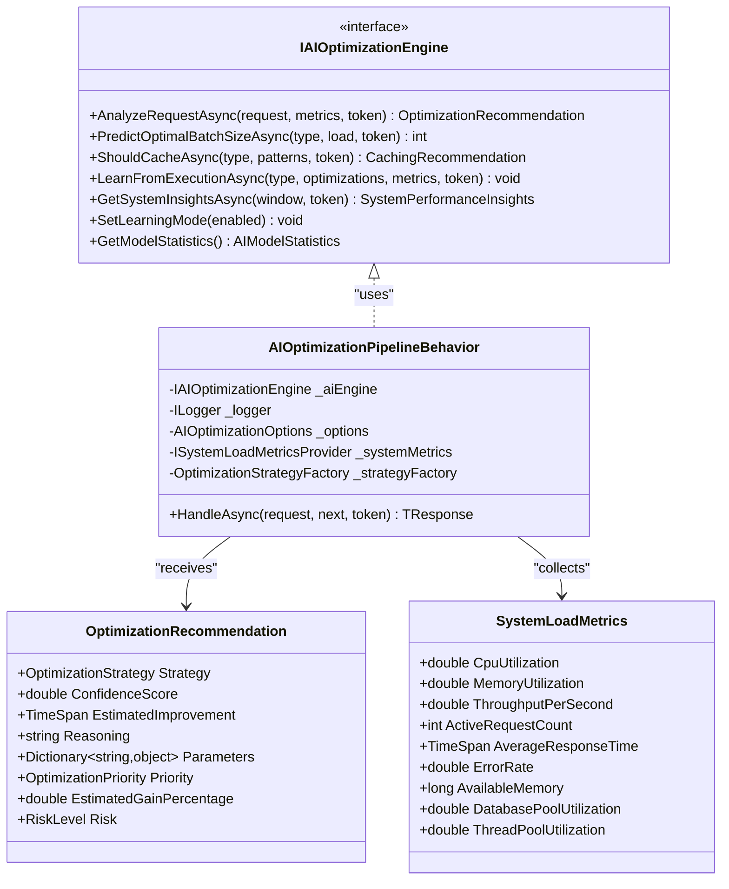
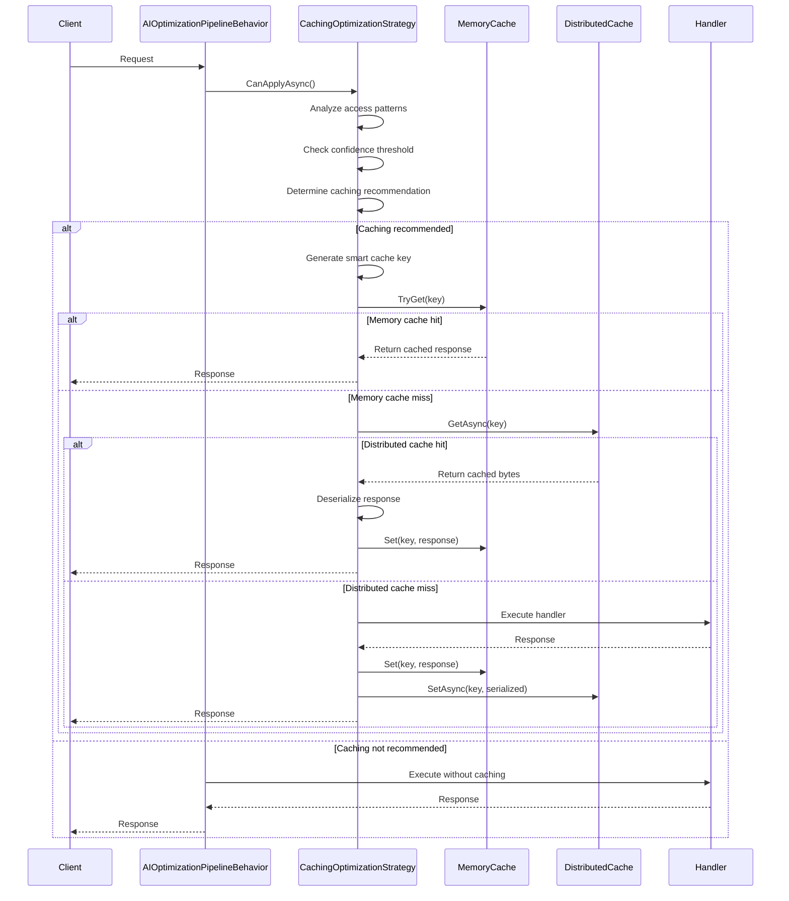
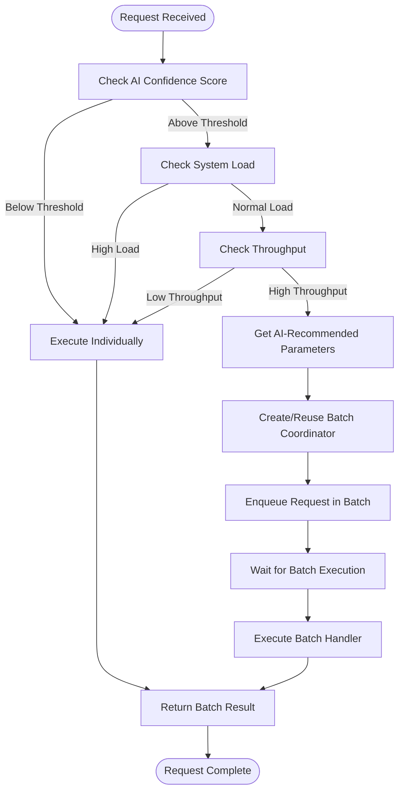
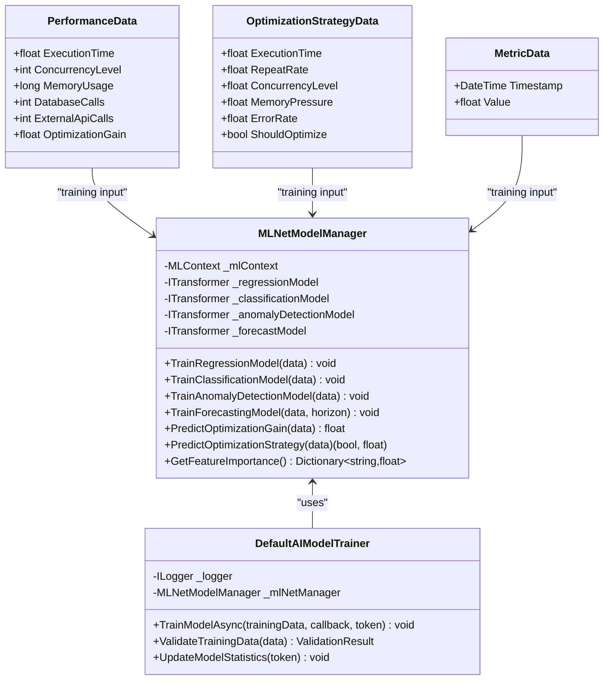
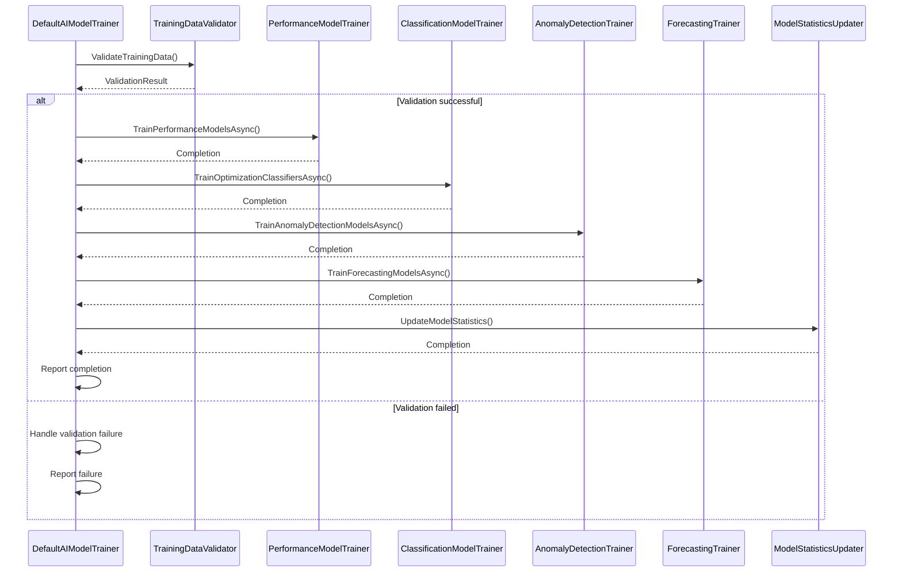
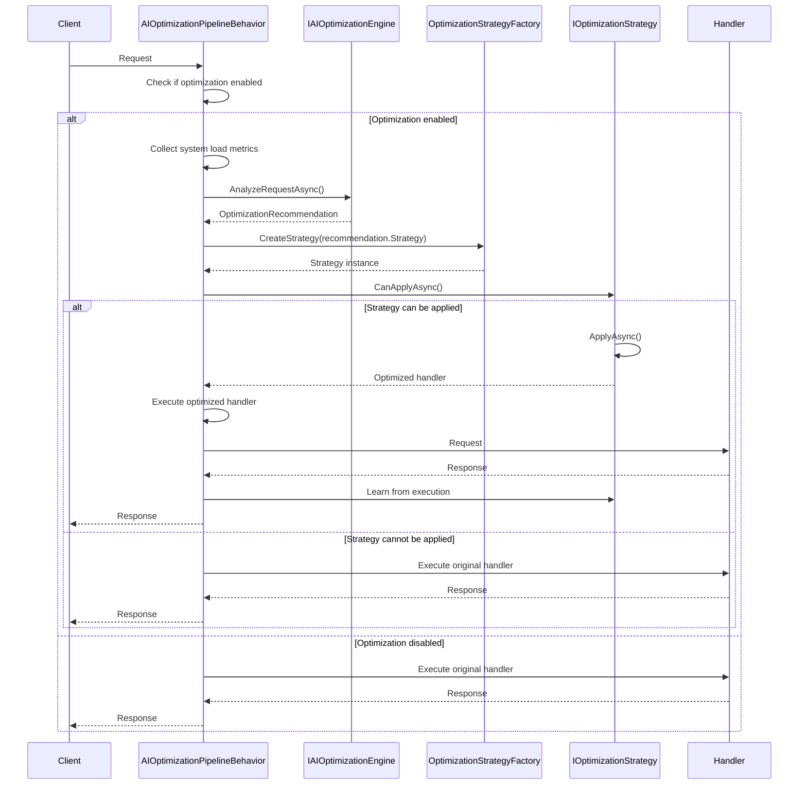

# AI Optimization

<cite>
**Referenced Files in This Document**   
- [AIOptimizationPipelineBehavior.cs](file://src/Relay.Core.AI/AI/Pipeline/Behaviors/AIOptimizationPipelineBehavior.cs)
- [CachingOptimizationStrategy.cs](file://src/Relay.Core.AI/AI/Pipeline/Behaviors/Strategies/CachingOptimizationStrategy.cs)
- [BatchingOptimizationStrategy.cs](file://src/Relay.Core.AI/AI/Pipeline/Behaviors/Strategies/BatchingOptimizationStrategy.cs)
- [IAIOptimizationEngine.cs](file://src/Relay.Core.AI/AI/Optimization/Core/IAIOptimizationEngine.cs)
- [OptimizationRecommendation.cs](file://src/Relay.Core.AI/AI/Models/OptimizationRecommendation.cs)
- [DefaultAIModelTrainer.cs](file://src/Relay.Core.AI/AI/Training/DefaultAIModelTrainer.cs)
- [MLNetModelManager.cs](file://src/Relay.Core.AI/AI/Optimization/Models/MLNetModelManager.cs)
- [AIBatchOptimizationOptions.cs](file://src/Relay.Core.AI/AI/Pipeline/Options/AIBatchOptimizationOptions.cs)
</cite>

## Table of Contents
1. [Introduction](#introduction)
2. [AI Optimization Engine Architecture](#ai-optimization-engine-architecture)
3. [Core Optimization Strategies](#core-optimization-strategies)
4. [Machine Learning Model Implementation](#machine-learning-model-implementation)
5. [Training Process and Model Updates](#training-process-and-model-updates)
6. [Configuration Options](#configuration-options)
7. [Monitoring and Override Mechanisms](#monitoring-and-override-mechanisms)
8. [Common Issues and Solutions](#common-issues-and-solutions)
9. [Integration with Pipeline Behaviors](#integration-with-pipeline-behaviors)

## Introduction
The AI Optimization sub-feature in the Relay framework leverages machine learning to dynamically optimize system performance by analyzing usage patterns and adjusting key operational parameters. This intelligent optimization system automatically tunes batching, caching, and circuit breaker strategies based on real-time system load and historical performance data. The AIOptimizationEngine serves as the central component that analyzes request patterns, predicts optimal configurations, and learns from execution outcomes to continuously improve optimization decisions. This documentation provides a comprehensive overview of the AI-powered optimization system, including its architecture, implementation details, configuration options, and operational considerations.

## AI Optimization Engine Architecture

**Diagram sources**
- [IAIOptimizationEngine.cs](file://src/Relay.Core.AI/AI/Optimization/Core/IAIOptimizationEngine.cs)
- [AIOptimizationPipelineBehavior.cs](file://src/Relay.Core.AI/AI/Pipeline/Behaviors/AIOptimizationPipelineBehavior.cs)
- [OptimizationRecommendation.cs](file://src/Relay.Core.AI/AI/Models/OptimizationRecommendation.cs)

**Section sources**
- [AIOptimizationPipelineBehavior.cs](file://src/Relay.Core.AI/AI/Pipeline/Behaviors/AIOptimizationPipelineBehavior.cs)
- [IAIOptimizationEngine.cs](file://src/Relay.Core.AI/AI/Optimization/Core/IAIOptimizationEngine.cs)

## Core Optimization Strategies

### AICachingOptimizationBehavior Implementation
The AICachingOptimizationBehavior implements intelligent caching strategies by analyzing access patterns and predicting cache effectiveness. This strategy evaluates factors such as access frequency, data volatility, and execution time to determine optimal caching parameters. The implementation supports multiple cache levels (L1 memory cache and L2 distributed cache) with automatic cache warming when a distributed cache hit occurs. The AI engine recommends cache key strategies (full request, request type only, selected properties, or custom) based on the specific request characteristics and usage patterns. Cache time-to-live (TTL) values are dynamically determined by the AI model based on predicted data volatility and access patterns.

**Diagram sources**
- [CachingOptimizationStrategy.cs](file://src/Relay.Core.AI/AI/Pipeline/Behaviors/Strategies/CachingOptimizationStrategy.cs)

**Section sources**
- [CachingOptimizationStrategy.cs](file://src/Relay.Core.AI/AI/Pipeline/Behaviors/Strategies/CachingOptimizationStrategy.cs)

### AIBatchOptimizationBehavior Implementation
The AIBatchOptimizationBehavior implements AI-powered batching optimization that dynamically adjusts batch size, window duration, and coordination strategy based on system load and request patterns. The strategy uses a batch coordinator registry to manage batch processing for different request types, with each coordinator configured according to AI recommendations. The implementation supports multiple batching strategies (adaptive, fixed, or sliding window) and includes sophisticated logic for determining when batching is beneficial based on system conditions such as CPU utilization, memory pressure, and throughput requirements.

**Diagram sources**
- [BatchingOptimizationStrategy.cs](file://src/Relay.Core.AI/AI/Pipeline/Behaviors/Strategies/BatchingOptimizationStrategy.cs)

**Section sources**
- [BatchingOptimizationStrategy.cs](file://src/Relay.Core.AI/AI/Pipeline/Behaviors/Strategies/BatchingOptimizationStrategy.cs)

## Machine Learning Model Implementation

### Model Architecture and Training
The AI optimization system employs multiple machine learning models trained using ML.NET to handle different aspects of performance optimization. The system implements a multi-model approach with specialized models for performance prediction, optimization classification, anomaly detection, and time-series forecasting. These models are trained on historical execution metrics, optimization outcomes, and system load data to predict optimal configurations and identify performance improvement opportunities.

**Diagram sources**
- [MLNetModelManager.cs](file://src/Relay.Core.AI/AI/Optimization/Models/MLNetModelManager.cs)
- [DefaultAIModelTrainer.cs](file://src/Relay.Core.AI/AI/Training/DefaultAIModelTrainer.cs)

**Section sources**
- [MLNetModelManager.cs](file://src/Relay.Core.AI/AI/Optimization/Models/MLNetModelManager.cs)
- [DefaultAIModelTrainer.cs](file://src/Relay.Core.AI/AI/Training/DefaultAIModelTrainer.cs)

### Model Training Pipeline
The training process follows a structured pipeline that validates data quality, trains multiple model types sequentially, and updates model statistics. The DefaultAIModelTrainer orchestrates this process, implementing quality checks to ensure sufficient training samples and data integrity before proceeding with model training. The training pipeline includes specific phases for performance models, optimization classifiers, anomaly detection, forecasting, and statistical analysis, with progress reporting at each stage.

**Diagram sources**
- [DefaultAIModelTrainer.cs](file://src/Relay.Core.AI/AI/Training/DefaultAIModelTrainer.cs)

**Section sources**
- [DefaultAIModelTrainer.cs](file://src/Relay.Core.AI/AI/Training/DefaultAIModelTrainer.cs)

## Training Process and Model Updates

### Data Collection and Feedback Loops
The AI optimization system implements a continuous learning loop that collects execution metrics and uses them to improve future recommendations. After each request execution, whether successful or failed, the system records detailed performance metrics including execution time, memory allocation, CPU usage, and success/failure status. These metrics are fed back into the AI engine through the LearnFromExecutionAsync method, which updates the underlying machine learning models during periodic training cycles.

The feedback loop operates on multiple time scales:
- Immediate: Real-time system load metrics influence current optimization decisions
- Short-term: Recent execution outcomes affect near-future recommendations
- Long-term: Aggregated historical data drives model retraining and improvement

### Model Update Strategy
Model updates occur through scheduled training cycles that process accumulated training data. The system implements data quality validation to ensure sufficient samples and data integrity before initiating training. To maintain performance, the training process uses data sampling for large datasets and runs in background tasks to avoid impacting request processing. Trained models are persisted to disk, allowing them to survive application restarts and be shared across instances in distributed environments.

## Configuration Options

### AI Behavior Configuration
The AI optimization system provides extensive configuration options to control its behavior and sensitivity. Key configuration parameters include:

| Configuration Option | Default Value | Description |
|----------------------|-------------|-------------|
| Enabled | true | Global toggle for AI optimization |
| LearningEnabled | true | Enables/disables learning from execution results |
| MinConfidenceScore | 0.7 | Minimum confidence threshold for applying optimizations |
| MinCacheHitRate | 0.5 | Minimum predicted cache hit rate for caching recommendations |
| MinExecutionsForAnalysis | 5 | Minimum executions before AI analysis is performed |
| OptimizationScope | Global | Scope of optimization (Global, PerRequestType, PerInstance) |
| LearningRate | 0.01 | Rate at which new data influences model updates |

### Batching Optimization Configuration
The AIBatchOptimizationOptions class provides specific configuration for batching behavior:

| Configuration Option | Default Value | Description |
|----------------------|-------------|-------------|
| MaxBatchSize | 100 | Maximum number of requests to batch together |
| MinBatchSize | 2 | Minimum batch size for batching to be considered |
| DefaultBatchWindow | 100ms | Default time window for collecting batch requests |
| MaxWaitTime | 200ms | Maximum time to wait for additional requests before processing |
| BatchTimeoutBehavior | Continue | Behavior when batch timeout occurs (Continue, Fail, Partial) |
| AdaptiveBatchingEnabled | true | Whether to use AI to dynamically adjust batch parameters |

## Monitoring and Override Mechanisms

### AI Recommendation Monitoring
The system provides comprehensive monitoring capabilities for AI optimization decisions through multiple channels:
- Structured logging with detailed information about recommendations, confidence scores, and applied optimizations
- Metrics collection for cache hit rates, batching efficiency, and optimization success rates
- System performance insights available through the GetSystemInsightsAsync method
- Model statistics and feature importance data accessible via GetModelStatistics

### Override Mechanisms
To maintain operational control, the system supports several override mechanisms:
- Global disable through the Enabled configuration option
- Request-level control using the AIMonitoredAttribute to include/exclude specific handlers
- Runtime learning mode toggling via SetLearningMode method
- Manual intervention through direct configuration changes
- Fallback to standard execution when AI optimization fails or is cancelled

## Common Issues and Solutions

### Over-Optimization
Over-optimization occurs when the AI system applies optimizations too aggressively, potentially degrading performance. This can happen when:
- Confidence thresholds are set too low
- The model is trained on insufficient or biased data
- System conditions change rapidly

**Solutions:**
- Increase the MinConfidenceScore configuration value
- Implement circuit breakers for optimization strategies
- Use the RiskLevel property in recommendations to avoid high-risk optimizations
- Monitor optimization effectiveness metrics and adjust training data

### Cold Start Problems
Cold start issues occur when the AI system has insufficient historical data to make reliable recommendations, typically after deployment or when handling new request types.

**Solutions:**
- Implement sensible default configurations for new request types
- Use conservative confidence thresholds until sufficient data is collected
- Gradually increase optimization aggressiveness based on data volume
- Provide initial training data for common scenarios
- Implement fallback strategies that gradually enable optimizations

### Model Staleness
Model staleness occurs when the AI models become outdated due to changing system patterns or usage characteristics.

**Solutions:**
- Implement regular scheduled retraining cycles
- Monitor model performance metrics and trigger retraining when degradation is detected
- Use sliding window data collection to emphasize recent patterns
- Implement model versioning and A/B testing for new models
- Set appropriate MinExecutionsForAnalysis to ensure sufficient data before relying on predictions

## Integration with Pipeline Behaviors

### Pipeline Integration Architecture
The AI optimization system integrates seamlessly with the Relay framework's pipeline behavior architecture. The AIOptimizationPipelineBehavior is inserted into the request processing pipeline where it intercepts requests before they reach their handlers. This behavior coordinates with the IAIOptimizationEngine to obtain recommendations and applies appropriate optimization strategies through the OptimizationStrategyFactory.

**Diagram sources**
- [AIOptimizationPipelineBehavior.cs](file://src/Relay.Core.AI/AI/Pipeline/Behaviors/AIOptimizationPipelineBehavior.cs)
- [IAIOptimizationEngine.cs](file://src/Relay.Core.AI/AI/Optimization/Core/IAIOptimizationEngine.cs)

**Section sources**
- [AIOptimizationPipelineBehavior.cs](file://src/Relay.Core.AI/AI/Pipeline/Behaviors/AIOptimizationPipelineBehavior.cs)

### Runtime Decision Process
At runtime, the AI optimization system follows a decision process that balances performance improvement potential with system stability:
1. Evaluate whether AI optimization is enabled and applicable to the request
2. Collect current system load metrics and historical execution data
3. Request optimization recommendations from the AI engine
4. Validate recommendations against confidence thresholds and system constraints
5. Apply appropriate optimization strategies through the strategy factory
6. Execute the request with optimizations and collect outcome metrics
7. Feed execution results back into the AI learning system

This process ensures that optimization decisions are made dynamically based on current conditions while maintaining system reliability and performance.