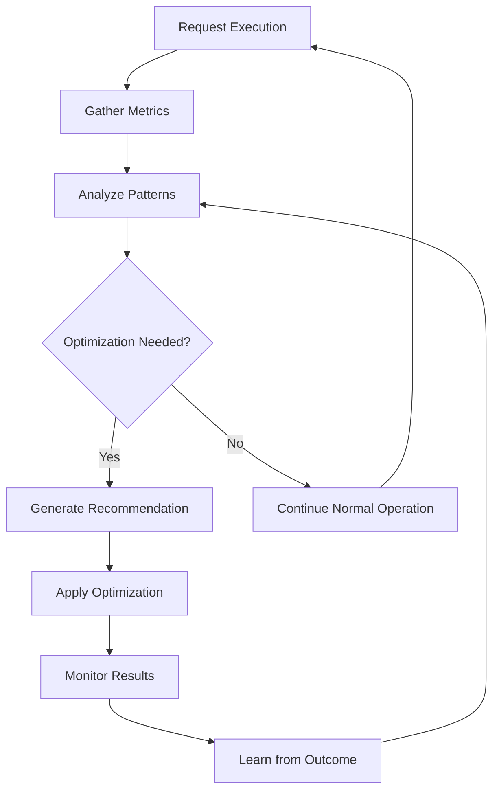
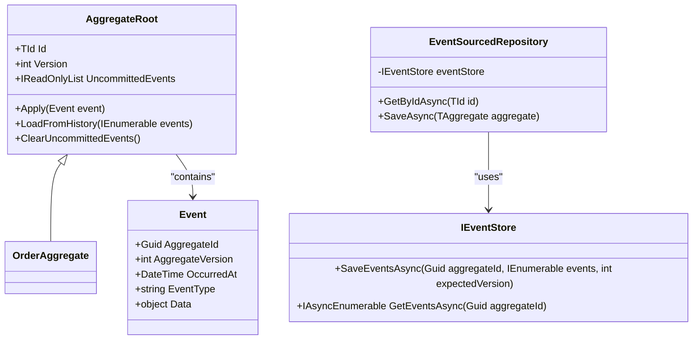
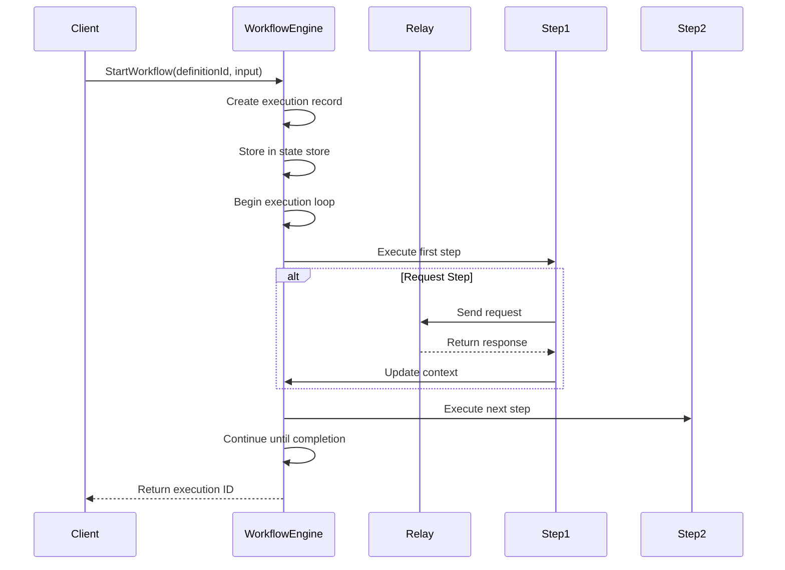
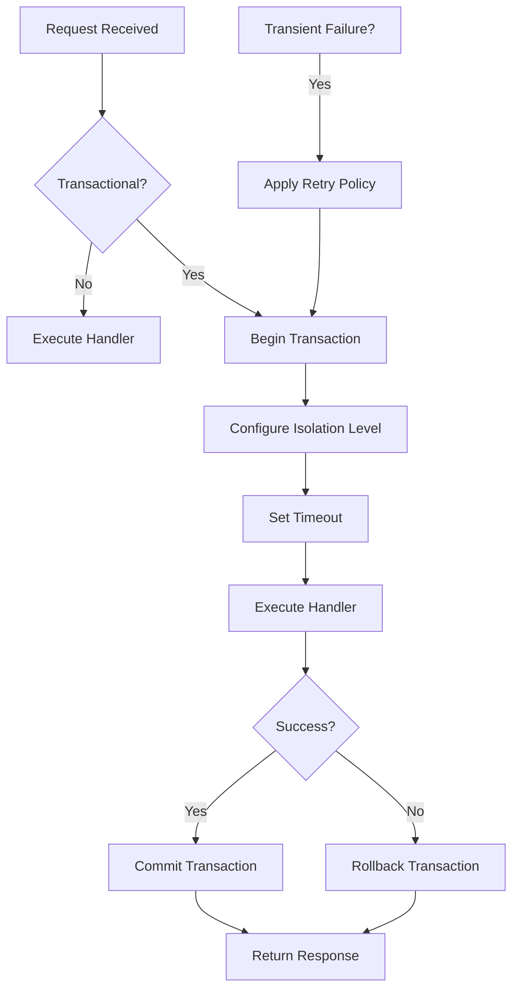
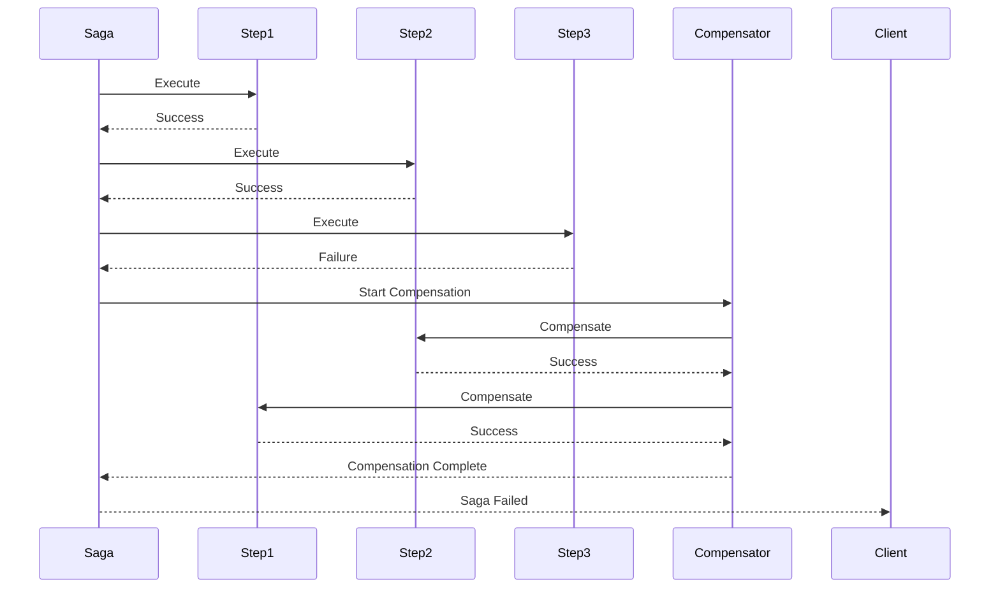
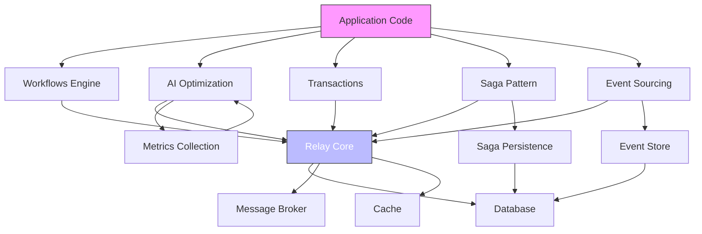

# Advanced Features

<cite>
**Referenced Files in This Document**   
- [AIOptimizationEngine.cs](file://src/Relay.Core.AI/AI/Optimization/Engines/AIOptimizationEngine.cs)
- [AggregateRoot.cs](file://src/Relay.Core.EventSourcing/EventSourcing/Core/AggregateRoot.cs)
- [EventSourcedRepository.cs](file://src/Relay.Core.EventSourcing/EventSourcing/Repositories/EventSourcedRepository.cs)
- [WorkflowEngine.cs](file://src/Relay.Core/Workflows/WorkflowEngine.cs)
- [WorkflowDefinition.cs](file://src/Relay.Core/Workflows/WorkflowDefinition.cs)
- [TransactionBehavior.cs](file://src/Relay.Core/Transactions/TransactionBehavior.cs)
- [TransactionOptions.cs](file://src/Relay.Core/Transactions/TransactionOptions.cs)
- [Saga.cs](file://src/Relay.MessageBroker/Saga/Saga.cs)
- [SagaOptions.cs](file://src/Relay.MessageBroker/Saga/SagaOptions.cs)
</cite>

## Table of Contents
1. [Introduction](#introduction)
2. [AI Optimization](#ai-optimization)
3. [Event Sourcing](#event-sourcing)
4. [Workflows Engine](#workflows-engine)
5. [Transactions](#transactions)
6. [Saga Pattern](#saga-pattern)
7. [Architecture Overview](#architecture-overview)
8. [Performance Considerations](#performance-considerations)
9. [Common Issues and Solutions](#common-issues-and-solutions)

## Introduction
The Relay framework provides a suite of advanced features designed to enhance application performance, reliability, and scalability. This document details the implementation and usage of key advanced components including AI-driven optimization, event sourcing, workflow orchestration, transaction management, and distributed transaction coordination through the Saga pattern. These features work together to provide a robust foundation for building complex, high-performance distributed systems.

## AI Optimization
The Relay framework incorporates machine learning capabilities through its AI Optimization Engine, which analyzes system behavior and usage patterns to automatically enhance performance. The `AIOptimizationEngine` class serves as the central component for this functionality, providing intelligent recommendations and automated optimizations based on real-time and historical data analysis.

The AI system monitors various performance metrics including request execution times, system load, memory utilization, and error rates. It uses this data to identify optimization opportunities such as caching strategies, batching configurations, and resource allocation adjustments. The engine employs time-series analysis and machine learning models to predict optimal configurations and adapt to changing usage patterns over time.

Key capabilities include:
- Predictive analysis of optimal batch sizes based on current system load and historical performance
- Intelligent caching recommendations with confidence scoring and expected improvement metrics
- System-wide performance insights with bottleneck identification and optimization opportunities
- Adaptive learning from executed optimizations to improve future recommendations

**Diagram sources**
- [AIOptimizationEngine.cs](file://src/Relay.Core.AI/AI/Optimization/Engines/AIOptimizationEngine.cs)

**Section sources**
- [AIOptimizationEngine.cs](file://src/Relay.Core.AI/AI/Optimization/Engines/AIOptimizationEngine.cs)

## Event Sourcing
The Relay framework implements a comprehensive event sourcing pattern that enables state reconstruction from event streams. This approach provides a complete audit trail of all state changes and allows systems to rebuild their current state by replaying events from the beginning of time.

The implementation centers around the `AggregateRoot<TId>` class, which serves as the base for all event-sourced entities. Aggregates maintain their state by applying domain events through the `Apply` method, which updates the internal state and records the event in an uncommitted events collection. The `LoadFromHistory` method reconstructs an aggregate's state by applying a sequence of events in chronological order.

Event persistence is handled by the `EventSourcedRepository<TAggregate, TId>` class, which manages the loading and saving of aggregates to an event store. When retrieving an aggregate, the repository fetches all events for that aggregate ID and applies them to reconstruct the current state. When saving, it persists any uncommitted events and ensures consistency through optimistic concurrency control using version numbers.

**Diagram sources**
- [AggregateRoot.cs](file://src/Relay.Core.EventSourcing/EventSourcing/Core/AggregateRoot.cs)
- [EventSourcedRepository.cs](file://src/Relay.Core.EventSourcing/EventSourcing/Repositories/EventSourcedRepository.cs)

**Section sources**
- [AggregateRoot.cs](file://src/Relay.Core.EventSourcing/EventSourcing/Core/AggregateRoot.cs)
- [EventSourcedRepository.cs](file://src/Relay.Core.EventSourcing/EventSourcing/Repositories/EventSourcedRepository.cs)

## Workflows Engine
The Relay framework includes a powerful workflows engine that enables the definition and execution of complex business processes. The `WorkflowEngine` class orchestrates multi-step processes, providing features such as conditional branching, parallel execution, and error handling.

Workflows are defined using the `WorkflowDefinition` class, which contains a sequence of `WorkflowStep` objects. Each step can be one of several types:
- **Request**: Executes a Relay request and stores the response in the workflow context
- **Conditional**: Evaluates a condition and optionally executes different steps based on the result
- **Parallel**: Executes multiple steps concurrently
- **Wait**: Introduces a delay in the workflow execution

The engine maintains execution state in the `WorkflowExecution` class, which tracks the current step, input data, context variables, and execution status. Workflow context allows data to flow between steps, with input parameters automatically populated and response data from request steps stored for use in subsequent steps.

**Diagram sources**
- [WorkflowEngine.cs](file://src/Relay.Core/Workflows/WorkflowEngine.cs)
- [WorkflowDefinition.cs](file://src/Relay.Core/Workflows/WorkflowDefinition.cs)

**Section sources**
- [WorkflowEngine.cs](file://src/Relay.Core/Workflows/WorkflowEngine.cs)
- [WorkflowDefinition.cs](file://src/Relay.Core/Workflows/WorkflowDefinition.cs)

## Transactions
The Relay framework provides comprehensive transaction support to ensure data consistency across operations. The transaction system is implemented as a pipeline behavior that wraps request handling in database transactions with advanced features including timeout enforcement, retry mechanisms, and nested transaction support.

The `TransactionBehavior<TRequest, TResponse>` class is the core implementation, integrating with the Relay pipeline to automatically manage transaction boundaries. Transactions are configured through the `TransactionAttribute` applied to request classes, with additional global settings available through `TransactionOptions`. Key features include:

- **Mandatory isolation level specification**: All transactional requests must explicitly specify their isolation level
- **Timeout enforcement**: Transactions exceeding the configured timeout are automatically rolled back
- **Automatic retry**: Support for retrying transient failures using configurable retry policies
- **Nested transactions**: Support for multiple transactional operations within a single request
- **Savepoints**: Ability to create intermediate rollback points within a transaction

The system also provides comprehensive metrics and telemetry, with options to enable distributed tracing and collect transaction performance data.

**Diagram sources**
- [TransactionBehavior.cs](file://src/Relay.Core/Transactions/TransactionBehavior.cs)
- [TransactionOptions.cs](file://src/Relay.Core/Transactions/TransactionOptions.cs)

**Section sources**
- [TransactionBehavior.cs](file://src/Relay.Core/Transactions/TransactionBehavior.cs)
- [TransactionOptions.cs](file://src/Relay.Core/Transactions/TransactionOptions.cs)

## Saga Pattern
The Relay framework implements the Saga pattern for managing distributed transactions across multiple services or databases. The `Saga<TSagaData>` base class provides a structured approach to orchestrating long-running business processes with built-in compensation mechanisms for error recovery.

Sagas are defined by inheriting from the `Saga<TSagaData>` class and adding steps through the `AddStep` method. Each step represents an operation that can be executed and, if necessary, compensated. When a step fails, the saga automatically executes compensation logic for all previously completed steps in reverse order, ensuring system consistency.

The implementation includes comprehensive error handling with configurable retry policies, timeout management, and detailed failure tracking. The `SagaOptions` class provides configuration for saga behavior including persistence intervals, retry strategies, and telemetry settings.

**Diagram sources**
- [Saga.cs](file://src/Relay.MessageBroker/Saga/Saga.cs)
- [SagaOptions.cs](file://src/Relay.MessageBroker/Saga/SagaOptions.cs)

**Section sources**
- [Saga.cs](file://src/Relay.MessageBroker/Saga/Saga.cs)
- [SagaOptions.cs](file://src/Relay.MessageBroker/Saga/SagaOptions.cs)

## Architecture Overview
The advanced features of the Relay framework integrate seamlessly with the core architecture, providing enhanced capabilities while maintaining a consistent programming model. The components work together to address common challenges in distributed systems development.

The architecture demonstrates how the advanced features build upon the Relay core while integrating with external systems for persistence, messaging, and caching. The AI optimization system consumes metrics from all components to provide intelligent recommendations, creating a feedback loop that continuously improves system performance.

**Diagram sources**
- [AIOptimizationEngine.cs](file://src/Relay.Core.AI/AI/Optimization/Engines/AIOptimizationEngine.cs)
- [WorkflowEngine.cs](file://src/Relay.Core/Workflows/WorkflowEngine.cs)
- [TransactionBehavior.cs](file://src/Relay.Core/Transactions/TransactionBehavior.cs)
- [Saga.cs](file://src/Relay.MessageBroker/Saga/Saga.cs)
- [EventSourcedRepository.cs](file://src/Relay.Core.EventSourcing/EventSourcing/Repositories/EventSourcedRepository.cs)

## Performance Considerations
The advanced features of the Relay framework are designed with performance in mind, but certain considerations should be taken into account when implementing these patterns:

- **AI Optimization**: The machine learning components introduce minimal overhead during request processing, as most analysis occurs asynchronously. However, the accuracy of recommendations improves with more usage data, so performance benefits increase over time.

- **Event Sourcing**: While event sourcing provides excellent audit capabilities, reconstructing aggregates from a large number of events can impact performance. The framework supports snapshotting to mitigate this by storing periodic state snapshots.

- **Workflows Engine**: Complex workflows with many steps or parallel branches can consume significant memory to maintain execution state. For long-running workflows, ensure adequate storage is available in the configured state store.

- **Transactions**: Long-running transactions can lead to resource contention and should be kept as short as possible. The framework's timeout mechanism helps prevent indefinite blocking.

- **Saga Pattern**: Sagas are designed for long-running processes, but each step should be kept relatively short to minimize the window for failures. The compensation mechanism adds overhead when failures occur, so design steps to be as reliable as possible.

## Common Issues and Solutions
When implementing the advanced features of the Relay framework, several common issues may arise:

- **Transaction Configuration Errors**: Forgetting to specify the isolation level in the `TransactionAttribute` will result in configuration exceptions. Always specify an explicit isolation level for transactional requests.

- **Saga State Corruption**: In distributed environments, saga state persistence failures can occur. Implement the `OnSagaFailed` callback to handle cleanup and notification when sagas fail unexpectedly.

- **Workflow Definition Errors**: Invalid workflow definitions with missing required properties will be caught during validation. Use the built-in validation to catch these issues early.

- **Event Sourcing Performance**: Aggregates with very high event counts may experience slow loading times. Implement snapshotting to store periodic state snapshots and reduce the number of events that need to be replayed.

- **AI Optimization Cold Start**: The AI system requires usage data to make accurate recommendations. During initial deployment, manually configure optimizations until sufficient data is collected for reliable predictions.