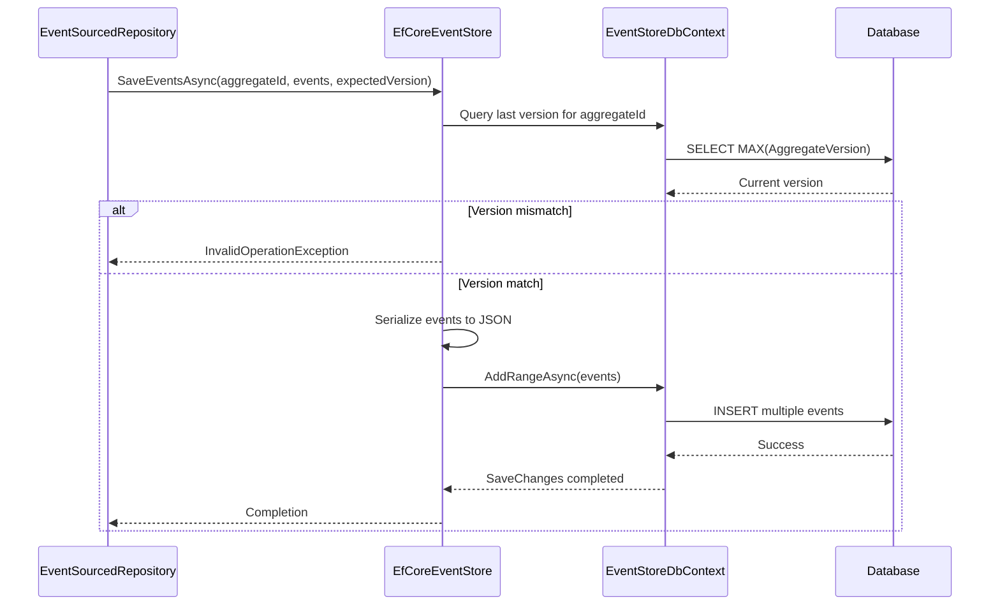
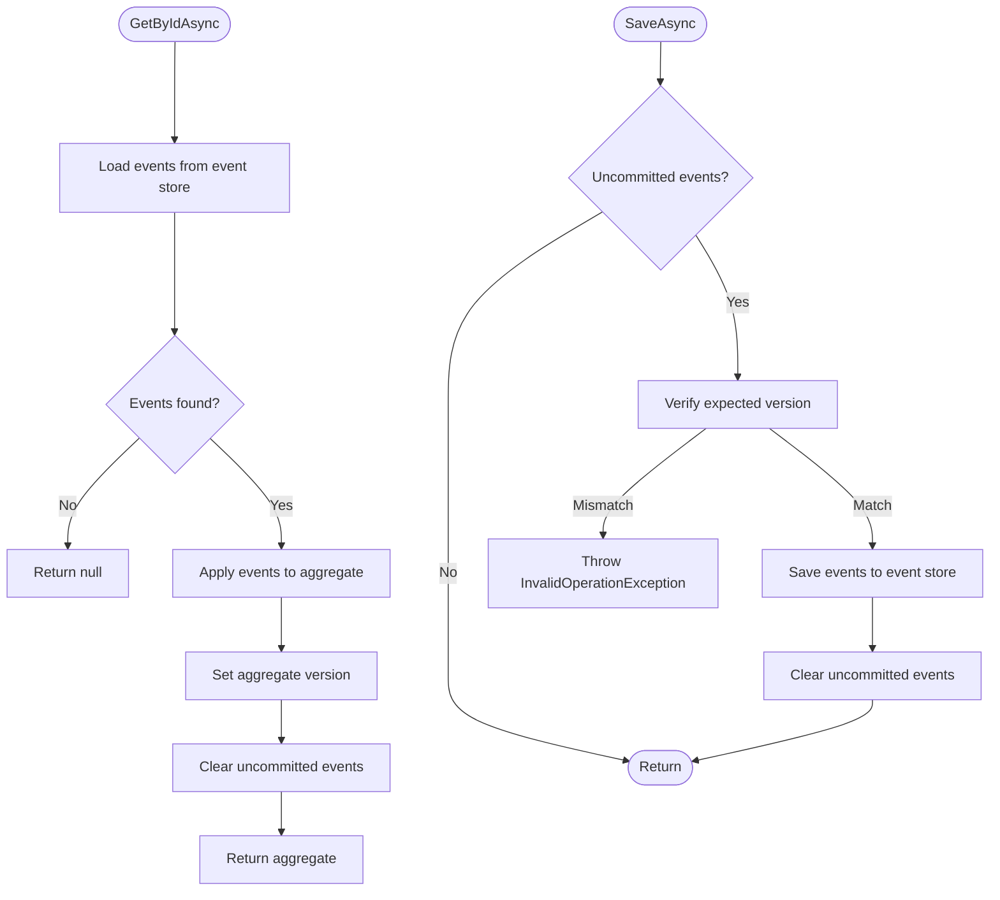
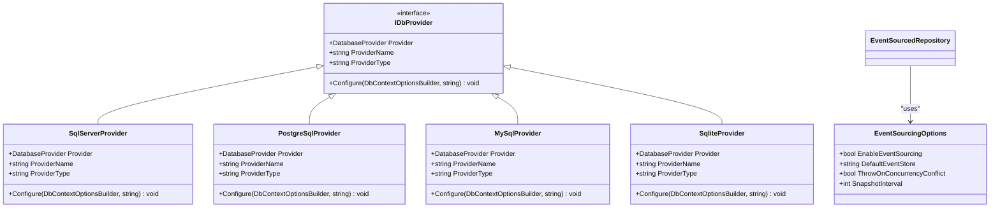
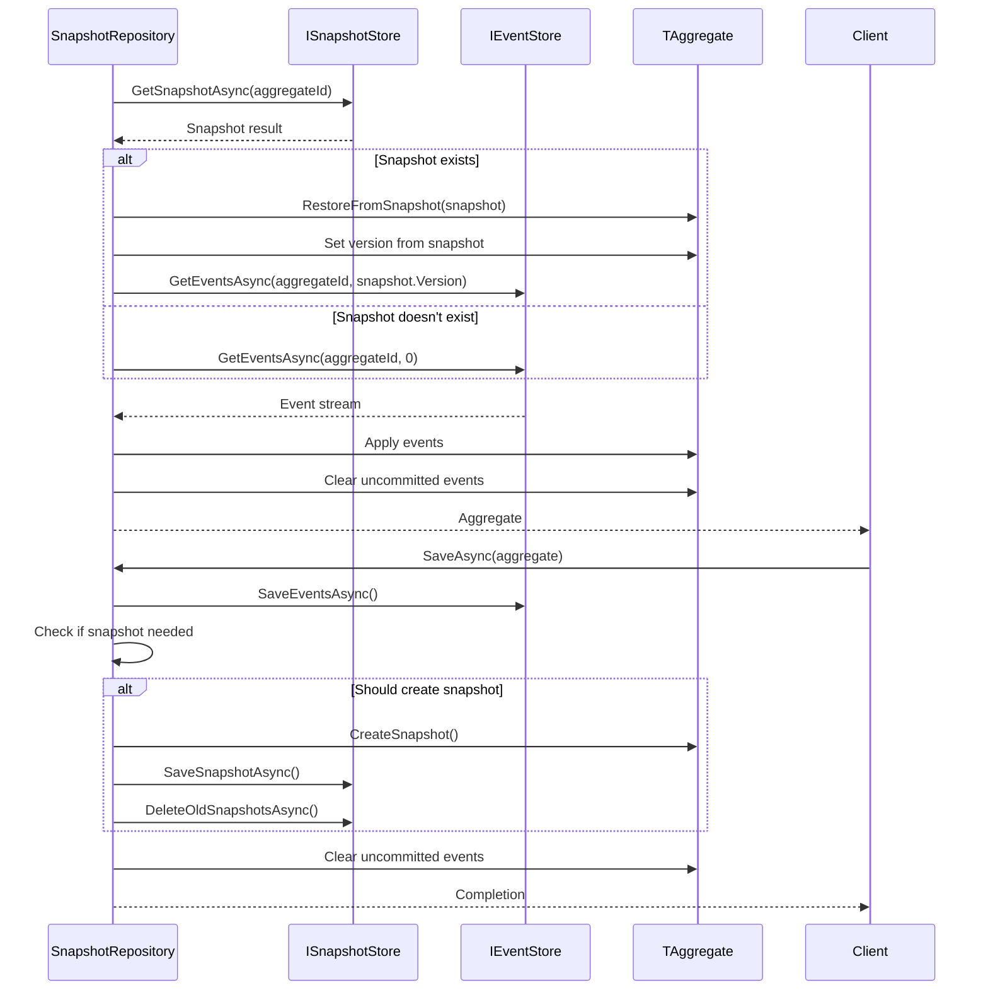
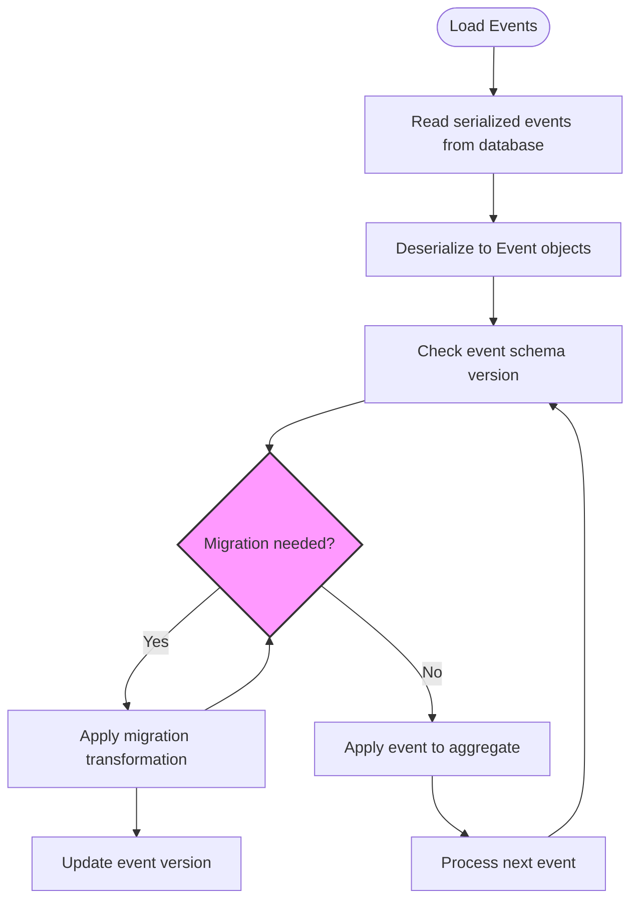
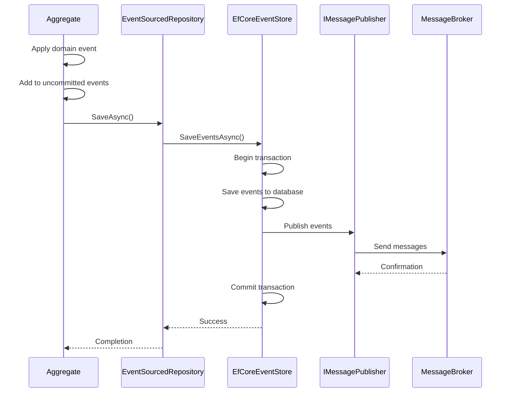

# Event Sourcing

<cite>
**Referenced Files in This Document**   
- [EventSourcedRepository.cs](file://src/Relay.Core.EventSourcing/EventSourcing/Repositories/EventSourcedRepository.cs)
- [EfCoreEventStore.cs](file://src/Relay.Core.EventSourcing/EventSourcing/Infrastructure/EfCoreEventStore.cs)
- [SnapshotRepository.cs](file://src/Relay.Core.EventSourcing/EventSourcing/Repositories/SnapshotRepository.cs)
- [EventStoreDbContext.cs](file://src/Relay.Core.EventSourcing/EventSourcing/Infrastructure/EventStoreDbContext.cs)
- [IEventStore.cs](file://src/Relay.Core.EventSourcing/EventSourcing/Core/IEventStore.cs)
- [AggregateRoot.cs](file://src/Relay.Core.EventSourcing/EventSourcing/Core/AggregateRoot.cs)
- [EventSourcingOptions.cs](file://src/Relay.Core.EventSourcing/Configuration/Options/EventSourcing/EventSourcingOptions.cs)
- [IDbProvider.cs](file://src/Relay.Core.EventSourcing/EventSourcing/Infrastructure/Database/IDbProvider.cs)
- [EventMigrationManager.cs](file://src/Relay.Core.EventSourcing/EventSourcing/Versioning/EventMigrationManager.cs)
- [README.md](file://src/Relay.Core.EventSourcing/EventSourcing/README.md)
</cite>

## Table of Contents
1. [Introduction](#introduction)
2. [Core Components](#core-components)
3. [Event Store Implementation](#event-store-implementation)
4. [State Reconstruction and Versioning](#state-reconstruction-and-versioning)
5. [Database Independence and Configuration](#database-independence-and-configuration)
6. [Snapshotting and Performance Optimization](#snapshotting-and-performance-optimization)
7. [Event Schema Evolution and Migration](#event-schema-evolution-and-migration)
8. [Integration with Messaging System](#integration-with-messaging-system)
9. [Common Issues and Solutions](#common-issues-and-solutions)
10. [Conclusion](#conclusion)

## Introduction
The Event Sourcing sub-feature in the Relay framework provides a robust implementation of the event sourcing pattern using EF Core for persistence. This document details the architecture and implementation of event-sourced aggregates, the EventStoreDbContext that persists events, and the EventSourcedRepository that reconstructs state from event streams. The system supports multiple database providers, includes snapshotting capabilities for performance optimization, and provides mechanisms for handling event schema evolution. The implementation follows domain-driven design principles and provides a clean separation between the domain model and persistence concerns.

**Section sources**
- [README.md](file://src/Relay.Core.EventSourcing/EventSourcing/README.md#L1-L22)

## Core Components

The event sourcing implementation consists of several key components that work together to provide a complete event sourcing solution. At the core is the AggregateRoot class, which serves as the base class for all event-sourced aggregates. Aggregates maintain their state by applying domain events through the Apply method, which uses double dispatch to route events to appropriate When handlers. The IEventStore interface defines the contract for event persistence, with the EfCoreEventStore providing an EF Core-based implementation that stores events in a relational database. The EventSourcedRepository coordinates the loading and saving of aggregates by retrieving events from the event store and applying them to reconstruct aggregate state.

```mermaid
classDiagram
class AggregateRoot<TId> {
+TId Id
+int Version
+IReadOnlyList<Event> UncommittedEvents
+ClearUncommittedEvents() void
+Apply(Event) void
+LoadFromHistory(IEnumerable<Event>) void
}
class EventSourcedRepository<TAggregate, TId> {
-IEventStore _eventStore
+GetByIdAsync(TId, CancellationToken) ValueTask<TAggregate?>
+SaveAsync(TAggregate, CancellationToken) ValueTask
}
class IEventStore {
<<interface>>
+SaveEventsAsync(Guid, IEnumerable<Event>, int, CancellationToken) ValueTask
+GetEventsAsync(Guid, CancellationToken) IAsyncEnumerable<Event>
+GetEventsAsync(Guid, int, int, CancellationToken) IAsyncEnumerable<Event>
}
class Event {
+Guid Id
+Guid AggregateId
+int AggregateVersion
+string EventType
+DateTime Timestamp
}
AggregateRoot <|-- OrderAggregate
EventSourcedRepository --> IEventStore : "uses"
EventSourcedRepository --> AggregateRoot : "manages"
OrderAggregate --> Event : "applies"
```

**Diagram sources**
- [AggregateRoot.cs](file://src/Relay.Core.EventSourcing/EventSourcing/Core/AggregateRoot.cs#L5-L40)
- [EventSourcedRepository.cs](file://src/Relay.Core.EventSourcing/EventSourcing/Repositories/EventSourcedRepository.cs#L15-L91)
- [IEventStore.cs](file://src/Relay.Core.EventSourcing/EventSourcing/Core/IEventStore.cs#L11-L40)

**Section sources**
- [AggregateRoot.cs](file://src/Relay.Core.EventSourcing/EventSourcing/Core/AggregateRoot.cs#L5-L40)
- [EventSourcedRepository.cs](file://src/Relay.Core.EventSourcing/EventSourcing/Repositories/EventSourcedRepository.cs#L15-L91)
- [IEventStore.cs](file://src/Relay.Core.EventSourcing/EventSourcing/Core/IEventStore.cs#L11-L40)

## Event Store Implementation

The EfCoreEventStore class provides an EF Core-based implementation of the IEventStore interface, using the EventStoreDbContext to persist events to a relational database. The implementation uses optimistic concurrency control by checking the expected version against the actual version of the aggregate before saving events. When saving events, the implementation serializes each event to JSON using System.Text.Json with camelCase naming policy. The event store supports both full event stream retrieval and range-based queries, allowing clients to retrieve events from a specific version range. The EventStoreDbContext is configured with appropriate indexes to ensure efficient querying by aggregate ID and version, with a unique constraint on the combination of aggregate ID and version to prevent concurrency conflicts.



**Diagram sources**
- [EfCoreEventStore.cs](file://src/Relay.Core.EventSourcing/EventSourcing/Infrastructure/EfCoreEventStore.cs#L15-L151)
- [EventStoreDbContext.cs](file://src/Relay.Core.EventSourcing/EventSourcing/Infrastructure/EventStoreDbContext.cs#L8-L101)

**Section sources**
- [EfCoreEventStore.cs](file://src/Relay.Core.EventSourcing/EventSourcing/Infrastructure/EfCoreEventStore.cs#L15-L151)
- [EventStoreDbContext.cs](file://src/Relay.Core.EventSourcing/EventSourcing/Infrastructure/EventStoreDbContext.cs#L8-L101)

## State Reconstruction and Versioning

The EventSourcedRepository is responsible for reconstructing aggregate state from event streams and managing versioning. When loading an aggregate by ID, the repository creates a new instance and applies all events from the event store in version order. The repository uses reflection to set the aggregate ID before loading events, as the ID property is protected in the base AggregateRoot class. During the save operation, the repository calculates the expected version based on the aggregate's current version and the number of uncommitted events, providing optimistic concurrency control. The versioning system ensures that only one write operation can succeed when multiple processes attempt to modify the same aggregate concurrently, preventing lost updates and maintaining data consistency.



**Diagram sources**
- [EventSourcedRepository.cs](file://src/Relay.Core.EventSourcing/EventSourcing/Repositories/EventSourcedRepository.cs#L30-L91)

**Section sources**
- [EventSourcedRepository.cs](file://src/Relay.Core.EventSourcing/EventSourcing/Repositories/EventSourcedRepository.cs#L30-L91)

## Database Independence and Configuration

The event sourcing implementation supports multiple database providers through the IDbProvider abstraction, allowing the EventStoreDbContext to work with different relational databases. The framework includes implementations for SQL Server, PostgreSQL, MySQL, MariaDB, and SQLite, each providing the necessary configuration for their respective EF Core providers. The database provider is configured through dependency injection, allowing applications to specify their preferred database at startup. Configuration options are exposed through the EventSourcingOptions class, which allows control over event sourcing behavior such as enabling/disabling the feature, specifying the default event store implementation, configuring concurrency conflict handling, and setting snapshot intervals.



**Diagram sources**
- [IDbProvider.cs](file://src/Relay.Core.EventSourcing/EventSourcing/Infrastructure/Database/IDbProvider.cs#L9-L33)
- [EventSourcingOptions.cs](file://src/Relay.Core.EventSourcing/Configuration/Options/EventSourcing/EventSourcingOptions.cs#L6-L27)

**Section sources**
- [IDbProvider.cs](file://src/Relay.Core.EventSourcing/EventSourcing/Infrastructure/Database/IDbProvider.cs#L9-L33)
- [EventSourcingOptions.cs](file://src/Relay.Core.EventSourcing/Configuration/Options/EventSourcing/EventSourcingOptions.cs#L6-L27)

## Snapshotting and Performance Optimization

The SnapshotRepository extends the basic event sourcing functionality by adding snapshotting capabilities to improve performance for aggregates with long event histories. The repository first attempts to load a snapshot of the aggregate state, then applies only the events that occurred after the snapshot was taken. This reduces the number of events that need to be loaded and applied, significantly improving read performance for mature aggregates. Snapshots are created automatically based on the aggregate's snapshot frequency, which can be configured per aggregate type. The repository also includes cleanup logic to remove old snapshots, preventing the snapshot store from growing indefinitely.



**Diagram sources**
- [SnapshotRepository.cs](file://src/Relay.Core.EventSourcing/EventSourcing/Repositories/SnapshotRepository.cs#L16-L136)

**Section sources**
- [SnapshotRepository.cs](file://src/Relay.Core.EventSourcing/EventSourcing/Repositories/SnapshotRepository.cs#L16-L136)

## Event Schema Evolution and Migration

The event sourcing system includes a comprehensive mechanism for handling event schema evolution through the EventMigrationManager and related components. As domain models evolve, event schemas may need to change, but historical events must still be readable. The EventMigrationManager allows registration of IEventMigration implementations that can transform events from older schemas to newer ones. When events are loaded from the event store, they pass through the migration pipeline, which applies all necessary migrations in sequence until the event is in the current schema version. Each event can implement the VersionedEvent interface to specify its schema version, allowing the migration system to determine which migrations need to be applied. This approach enables backward compatibility while allowing the domain model to evolve over time.



**Diagram sources**
- [EventMigrationManager.cs](file://src/Relay.Core.EventSourcing/EventSourcing/Versioning/EventMigrationManager.cs#L11-L115)

**Section sources**
- [EventMigrationManager.cs](file://src/Relay.Core.EventSourcing/EventSourcing/Versioning/EventMigrationManager.cs#L11-L115)

## Integration with Messaging System

While the event sourcing implementation primarily focuses on persistence, it integrates with the core messaging system for event publication. When events are saved to the event store, they are also published to the messaging system, allowing other components to react to domain events. This integration follows the outbox pattern, where events are atomically saved to the event store and queued for publication in the same transaction, ensuring consistency between state changes and message publication. The messaging integration is handled through the framework's publishing infrastructure, which supports multiple message brokers including AWS SQS/SNS, Azure Service Bus, Kafka, RabbitMQ, and Redis Streams. This allows events to be reliably delivered to subscribers even in the presence of network failures or service outages.



**Section sources**
- [README.md](file://src/Relay.Core.EventSourcing/EventSourcing/README.md#L72-L101)

## Common Issues and Solutions

Several common issues can arise when implementing event sourcing, and the Relay framework provides solutions for these challenges. Event store performance degradation can occur as event streams grow very long; this is addressed through snapshotting, which reduces the number of events that need to be loaded and applied. Event versioning conflicts due to concurrent modifications are handled through optimistic concurrency control, where the expected version is checked against the actual version before saving events. For event schema evolution, the migration system allows gradual transformation of event data as the domain model evolves. Database-specific performance issues are mitigated through appropriate indexing, connection pooling, and provider-specific optimizations. The framework also includes comprehensive error handling and logging to aid in troubleshooting and monitoring event sourcing operations.

**Section sources**
- [README.md](file://src/Relay.Core.EventSourcing/EventSourcing/README.md#L146-L161)

## Conclusion

The event sourcing implementation in the Relay framework provides a comprehensive solution for building event-sourced systems with strong consistency guarantees and good performance characteristics. By leveraging EF Core for persistence, the system benefits from mature ORM capabilities while maintaining the flexibility to support multiple database providers. The separation of concerns between aggregates, repositories, and event stores follows domain-driven design principles, making the codebase maintainable and testable. The inclusion of snapshotting, schema migration, and messaging integration addresses common challenges in event-sourced systems, providing a robust foundation for building scalable, resilient applications. The configuration options and extension points allow the system to be adapted to various deployment scenarios and performance requirements.