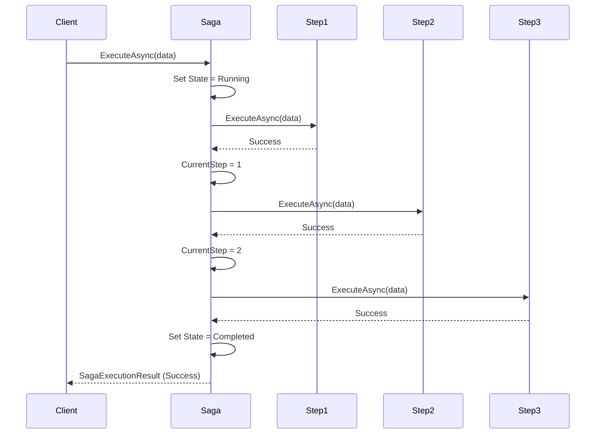
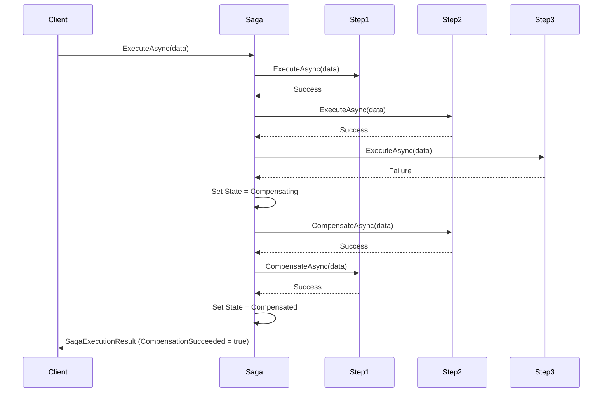
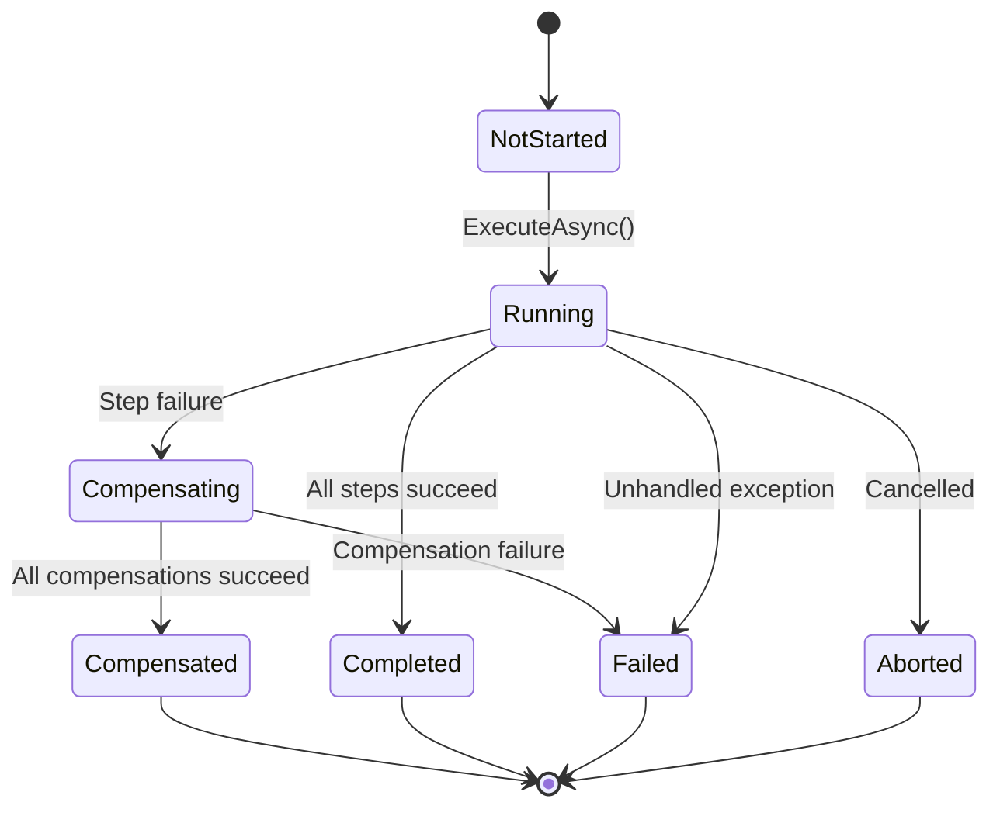
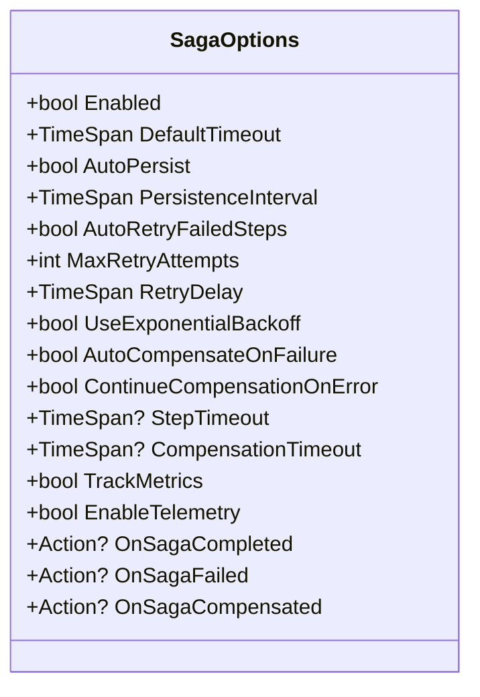
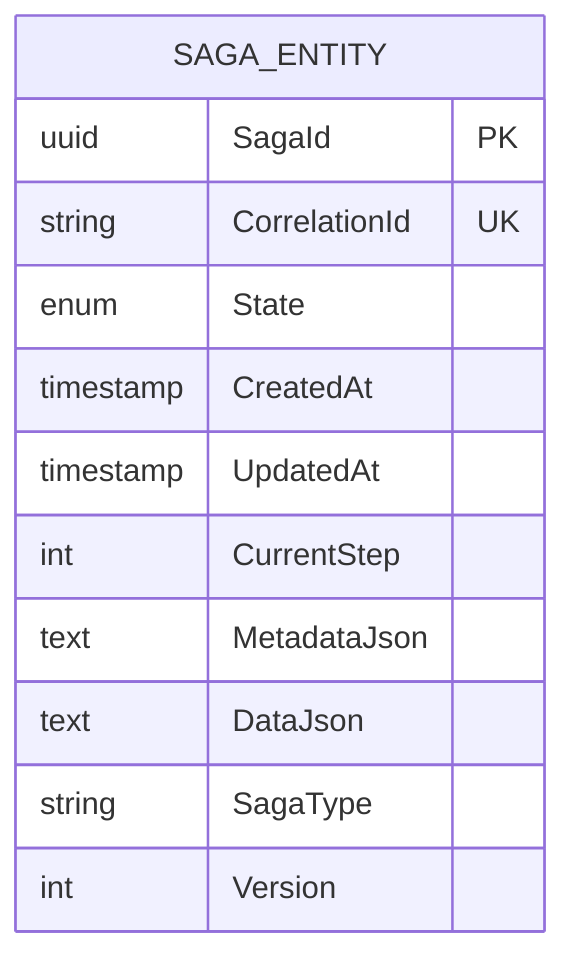
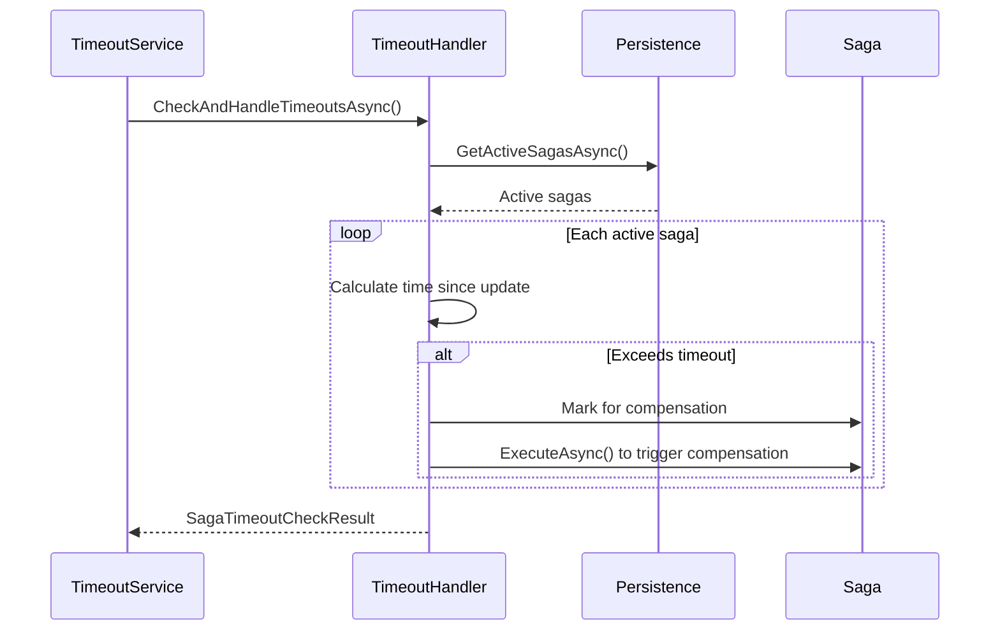
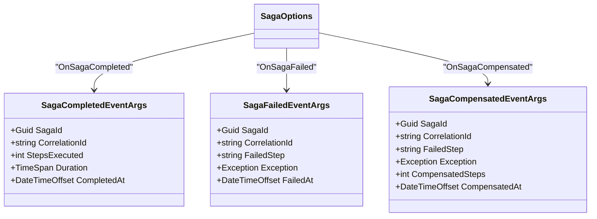
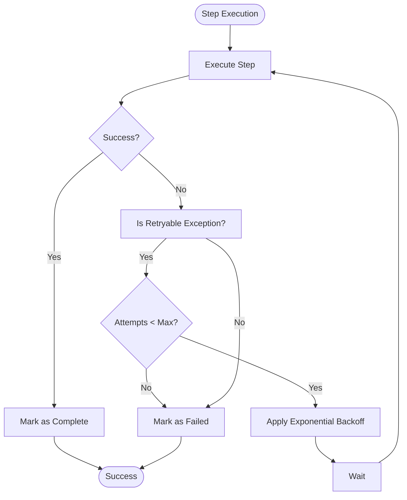

# Saga Pattern

<cite>
**Referenced Files in This Document**   
- [Saga.cs](file://src/Relay.MessageBroker/Saga/Saga.cs)
- [SagaState.cs](file://src/Relay.MessageBroker/Saga/SagaState.cs)
- [SagaOptions.cs](file://src/Relay.MessageBroker/Saga/SagaOptions.cs)
- [SagaExecutionResult.cs](file://src/Relay.MessageBroker/Saga/SagaExecutionResult.cs)
- [ISaga.cs](file://src/Relay.MessageBroker/Saga/Interfaces/ISaga.cs)
- [ISagaData.cs](file://src/Relay.MessageBroker/Saga/Interfaces/ISagaData.cs)
- [ISagaStep.cs](file://src/Relay.MessageBroker/Saga/Interfaces/ISagaStep.cs)
- [ISagaPersistence.cs](file://src/Relay.MessageBroker/Saga/Persistence/ISagaPersistence.cs)
- [DatabaseSagaPersistence.cs](file://src/Relay.MessageBroker/Saga/Persistence/DatabaseSagaPersistence.cs)
- [SagaTimeoutService.cs](file://src/Relay.MessageBroker/Saga/Services/SagaTimeoutService.cs)
- [SagaTimeoutHandler.cs](file://src/Relay.MessageBroker/Saga/Services/SagaTimeoutHandler.cs)
- [SagaCompletedEventArgs.cs](file://src/Relay.MessageBroker/Saga/Events/SagaCompletedEventArgs.cs)
- [SagaFailedEventArgs.cs](file://src/Relay.MessageBroker/Saga/Events/SagaFailedEventArgs.cs)
- [SagaCompensatedEventArgs.cs](file://src/Relay.MessageBroker/Saga/Events/SagaCompensatedEventArgs.cs)
</cite>

## Table of Contents
1. [Introduction](#introduction)
2. [Core Components](#core-components)
3. [Saga Execution Flow](#saga-execution-flow)
4. [Compensation Mechanism](#compensation-mechanism)
5. [State Management](#state-management)
6. [Configuration Options](#configuration-options)
7. [Persistence Layer](#persistence-layer)
8. [Timeout Handling](#timeout-handling)
9. [Event-Driven Architecture](#event-driven-architecture)
10. [Error Handling and Retry Policies](#error-handling-and-retry-policies)
11. [Best Practices for Compensating Actions](#best-practices-for-compensating-actions)
12. [Common Issues and Solutions](#common-issues-and-solutions)

## Introduction

The Saga Pattern implementation in the Relay framework provides a robust solution for managing distributed transactions across microservices. This document details the architecture, components, and operational characteristics of the saga orchestration system, focusing on how it ensures data consistency in distributed environments through coordinated sequences of local transactions with compensating actions.

The implementation follows the choreography pattern where a central orchestrator (the Saga class) coordinates a sequence of steps, each representing a local transaction in a service. When failures occur, the system automatically triggers compensating actions to maintain data consistency across services.

**Section sources**
- [Saga.cs](file://src/Relay.MessageBroker/Saga/Saga.cs#L1-L351)
- [SagaOptions.cs](file://src/Relay.MessageBroker/Saga/SagaOptions.cs#L1-L95)

## Core Components

The Saga Pattern implementation consists of several key components that work together to manage distributed transactions:

- **Saga Class**: The orchestrator that defines the sequence of steps and manages execution flow
- **SagaData**: The state container that persists across steps and services
- **SagaStep**: Individual units of work that perform forward operations and compensating actions
- **SagaState**: Enumeration that tracks the execution state of a saga instance
- **SagaExecutionResult**: Container for execution outcomes and diagnostic information

The Saga class serves as the central orchestrator, defining the sequence of steps through its `AddStep` method. Each step implements both forward execution and compensating actions, allowing the system to maintain consistency when failures occur.

```mermaid
classDiagram
class Saga<TSagaData> {
+string SagaId
+IReadOnlyList<ISagaStep<TSagaData>> Steps
+ExecuteAsync(TSagaData, CancellationToken) ValueTask~SagaExecutionResult<TSagaData>~
+AddStep(ISagaStep<TSagaData>) Saga<TSagaData>
}
class SagaExecutionResult<TSagaData> {
+TSagaData Data
+bool IsSuccess
+string? FailedStep
+Exception? Exception
+bool CompensationSucceeded
}
class SagaDataBase {
+Guid SagaId
+string CorrelationId
+SagaState State
+DateTimeOffset CreatedAt
+DateTimeOffset UpdatedAt
+int CurrentStep
+Dictionary<string, object> Metadata
}
class SagaStep<TSagaData> {
+string Name
+ExecuteAsync(TSagaData, CancellationToken) ValueTask
+CompensateAsync(TSagaData, CancellationToken) ValueTask
}
Saga<TSagaData> --> SagaExecutionResult<TSagaData> : "returns"
Saga<TSagaData> --> SagaStep<TSagaData> : "contains"
SagaStep<TSagaData> --> SagaDataBase : "operates on"
Saga<TSagaData> --> SagaDataBase : "executes with"
```

**Diagram sources**
- [Saga.cs](file://src/Relay.MessageBroker/Saga/Saga.cs#L9-L351)
- [SagaExecutionResult.cs](file://src/Relay.MessageBroker/Saga/SagaExecutionResult.cs#L9-L36)
- [ISagaData.cs](file://src/Relay.MessageBroker/Saga/Interfaces/ISagaData.cs#L47-L70)
- [ISagaStep.cs](file://src/Relay.MessageBroker/Saga/Interfaces/ISagaStep.cs#L35-L46)

**Section sources**
- [Saga.cs](file://src/Relay.MessageBroker/Saga/Saga.cs#L9-L351)
- [SagaExecutionResult.cs](file://src/Relay.MessageBroker/Saga/SagaExecutionResult.cs#L9-L36)
- [ISagaData.cs](file://src/Relay.MessageBroker/Saga/Interfaces/ISagaData.cs#L47-L70)
- [ISagaStep.cs](file://src/Relay.MessageBroker/Saga/Interfaces/ISagaStep.cs#L35-L46)

## Saga Execution Flow

The saga execution follows a sequential orchestration pattern where steps are executed in a predefined order. The execution flow is managed by the `ExecuteAsync` method in the Saga class, which processes each step and handles failures by triggering compensation.

When a saga is executed, it begins in the `Running` state and processes each step in sequence. For each step, the system calls the `ExecuteAsync` method, updates the current step counter, and persists the state. If all steps complete successfully, the saga transitions to the `Completed` state.



**Diagram sources**
- [Saga.cs](file://src/Relay.MessageBroker/Saga/Saga.cs#L31-L94)

**Section sources**
- [Saga.cs](file://src/Relay.MessageBroker/Saga/Saga.cs#L31-L94)

## Compensation Mechanism

When a step fails during execution, the saga system automatically triggers the compensation mechanism to roll back previously completed steps. The compensation process follows the Last-In-First-Out (LIFO) principle, reversing the steps in reverse order.

The compensation logic includes retry capabilities with exponential backoff, timeout protection, and comprehensive failure tracking. Each compensation step is retried up to three times with increasing delays (1s, 2s, 4s) to handle transient failures.



**Diagram sources**
- [Saga.cs](file://src/Relay.MessageBroker/Saga/Saga.cs#L65-L82)

**Section sources**
- [Saga.cs](file://src/Relay.MessageBroker/Saga/Saga.cs#L65-L82)
- [Saga.cs](file://src/Relay.MessageBroker/Saga/Saga.cs#L114-L264)

## State Management

The SagaState enumeration defines the lifecycle states of a saga instance, providing visibility into the execution progress and outcome. The state management system ensures that sagas can be resumed after failures and that the current state is always persisted.

The available states include:
- **NotStarted**: Saga has been created but not yet executed
- **Running**: Saga is currently executing steps
- **Compensating**: Saga has encountered a failure and is rolling back
- **Completed**: All steps executed successfully
- **Compensated**: Saga was rolled back due to failure
- **Failed**: Saga failed and could not be compensated
- **Aborted**: Saga was explicitly aborted



**Diagram sources**
- [SagaState.cs](file://src/Relay.MessageBroker/Saga/SagaState.cs#L6-L42)

**Section sources**
- [SagaState.cs](file://src/Relay.MessageBroker/Saga/SagaState.cs#L6-L42)
- [Saga.cs](file://src/Relay.MessageBroker/Saga/Saga.cs#L33-L34)

## Configuration Options

The SagaOptions class provides comprehensive configuration for saga behavior, allowing customization of timeouts, retry policies, persistence, and telemetry. These options can be set globally or overridden for specific sagas.

Key configuration options include:
- **Enabled**: Controls whether saga orchestration is active
- **DefaultTimeout**: Global timeout for saga execution (default: 30 minutes)
- **AutoPersist**: Enables automatic persistence of saga state
- **PersistenceInterval**: Interval for state persistence (default: 5 seconds)
- **AutoRetryFailedSteps**: Enables automatic retry of failed steps
- **MaxRetryAttempts**: Maximum retry attempts for failed steps (default: 3)
- **RetryDelay**: Delay between retry attempts (default: 5 seconds)
- **UseExponentialBackoff**: Enables exponential backoff for retries
- **AutoCompensateOnFailure**: Automatically triggers compensation on failure
- **ContinueCompensationOnError**: Continues compensation even if individual steps fail
- **StepTimeout**: Timeout for individual steps
- **CompensationTimeout**: Timeout for compensation operations



**Diagram sources**
- [SagaOptions.cs](file://src/Relay.MessageBroker/Saga/SagaOptions.cs#L8-L95)

**Section sources**
- [SagaOptions.cs](file://src/Relay.MessageBroker/Saga/SagaOptions.cs#L8-L95)

## Persistence Layer

The saga system provides both in-memory and database-backed persistence options to store saga state across executions. The persistence layer ensures that sagas can survive application restarts and can be resumed from their last known state.

The ISagaPersistence interface defines the contract for saga persistence, with implementations including:
- **InMemorySagaPersistence**: Development/testing implementation using in-memory dictionaries
- **DatabaseSagaPersistence**: Production implementation using a database with JSON serialization

The database persistence stores saga data in a normalized format with separate columns for metadata and serialized data, enabling efficient querying and indexing.



**Diagram sources**
- [ISagaPersistence.cs](file://src/Relay.MessageBroker/Saga/Persistence/ISagaPersistence.cs#L10-L163)
- [DatabaseSagaPersistence.cs](file://src/Relay.MessageBroker/Saga/Persistence/DatabaseSagaPersistence.cs#L11-L168)

**Section sources**
- [ISagaPersistence.cs](file://src/Relay.MessageBroker/Saga/Persistence/ISagaPersistence.cs#L10-L163)
- [DatabaseSagaPersistence.cs](file://src/Relay.MessageBroker/Saga/Persistence/DatabaseSagaPersistence.cs#L11-L168)

## Timeout Handling

The saga system includes comprehensive timeout handling for long-running sagas through the SagaTimeoutService and SagaTimeoutHandler components. This ensures that sagas do not remain in a running state indefinitely and are properly cleaned up when they exceed their allowed duration.

The SagaTimeoutService runs as a background service that periodically checks for timed-out sagas. It delegates the actual timeout checking to registered ISagaTimeoutHandler instances, which can be specific to each saga type.

Timeouts can be configured at multiple levels:
- Global default timeout (5 minutes by default)
- Saga-specific timeout via SagaOptions
- Per-saga instance timeout via metadata or ISagaDataWithTimeout interface



**Diagram sources**
- [SagaTimeoutService.cs](file://src/Relay.MessageBroker/Saga/Services/SagaTimeoutService.cs#L11-L119)
- [SagaTimeoutHandler.cs](file://src/Relay.MessageBroker/Saga/Services/SagaTimeoutHandler.cs#L12-L201)

**Section sources**
- [SagaTimeoutService.cs](file://src/Relay.MessageBroker/Saga/Services/SagaTimeoutService.cs#L11-L119)
- [SagaTimeoutHandler.cs](file://src/Relay.MessageBroker/Saga/Services/SagaTimeoutHandler.cs#L12-L201)

## Event-Driven Architecture

The saga system uses an event-driven architecture to notify external systems about saga lifecycle events. These events enable monitoring, alerting, and integration with other systems without coupling them directly to the saga execution.

The three primary events are:
- **SagaCompletedEventArgs**: Fired when a saga completes successfully
- **SagaFailedEventArgs**: Fired when a saga fails and cannot be compensated
- **SagaCompensatedEventArgs**: Fired when a saga is successfully compensated

These events can be handled through callback actions configured in SagaOptions, allowing for custom logging, alerting, and integration workflows.



**Diagram sources**
- [SagaCompletedEventArgs.cs](file://src/Relay.MessageBroker/Saga/Events/SagaCompletedEventArgs.cs#L6-L33)
- [SagaFailedEventArgs.cs](file://src/Relay.MessageBroker/Saga/Events/SagaFailedEventArgs.cs)
- [SagaCompensatedEventArgs.cs](file://src/Relay.MessageBroker/Saga/Events/SagaCompensatedEventArgs.cs)

**Section sources**
- [SagaCompletedEventArgs.cs](file://src/Relay.MessageBroker/Saga/Events/SagaCompletedEventArgs.cs#L6-L33)
- [SagaOptions.cs](file://src/Relay.MessageBroker/Saga/SagaOptions.cs#L83-L94)

## Error Handling and Retry Policies

The saga system implements comprehensive error handling and retry policies to handle transient failures and ensure reliable execution. The retry mechanism includes both forward step retries and compensation step retries with different strategies.

For forward steps, retries are controlled by the AutoRetryFailedSteps, MaxRetryAttempts, and RetryDelay options. For compensation steps, the system implements a more robust retry strategy with exponential backoff and timeout protection.

The system distinguishes between retryable and non-retryable exceptions, with retryable exceptions including:
- TimeoutException
- HttpRequestException
- IOException
- SocketException
- Any exception with "Transient" or "Timeout" in the type name
- Any exception with "timeout" or "connection" in the message



**Diagram sources**
- [Saga.cs](file://src/Relay.MessageBroker/Saga/Saga.cs#L269-L283)
- [Saga.cs](file://src/Relay.MessageBroker/Saga/Saga.cs#L136-L215)

**Section sources**
- [Saga.cs](file://src/Relay.MessageBroker/Saga/Saga.cs#L269-L283)
- [SagaOptions.cs](file://src/Relay.MessageBroker/Saga/SagaOptions.cs#L33-L49)

## Best Practices for Compensating Actions

When designing compensating actions for sagas, several best practices should be followed to ensure reliability and consistency:

1. **Idempotency**: Compensating actions must be idempotent, meaning they can be safely executed multiple times without changing the result beyond the initial application.

2. **Equivalence**: The compensation should leave the system in a state equivalent to if the original action had never been performed.

3. **No New Failures**: Compensating actions should avoid introducing new failure modes and should be simpler than the original action.

4. **Time Bound**: Compensations should complete within a reasonable time frame to prevent resource locking.

5. **Logging**: All compensation attempts should be thoroughly logged for audit and debugging purposes.

6. **Monitoring**: Compensation failures should trigger alerts and potentially manual intervention workflows.

The framework supports these best practices through its built-in retry mechanisms, timeout protection, and failure tracking capabilities.

**Section sources**
- [Saga.cs](file://src/Relay.MessageBroker/Saga/Saga.cs#L159-L163)
- [Saga.cs](file://src/Relay.MessageBroker/Saga/Saga.cs#L295-L337)

## Common Issues and Solutions

### Orphaned Sagas
Orphaned sagas occur when a saga instance remains in a running state after the orchestrating process has terminated. This can happen due to application crashes or unexpected shutdowns.

**Solution**: The SagaTimeoutService automatically detects and handles timed-out sagas by triggering compensation. Configure appropriate timeout values based on your business requirements.

### Message Loss
Message loss can occur in distributed systems due to network issues or broker failures.

**Solution**: The framework integrates with reliable message brokers and supports the outbox pattern to ensure message durability. Use the Inbox and Outbox patterns to prevent message loss.

### Partial Failures
Partial failures occur when some compensation steps succeed while others fail, leaving the system in an inconsistent state.

**Solution**: The framework tracks compensation progress and provides the OnPartialCompensationFailureAsync hook for custom handling. Implement manual intervention workflows for critical operations.

### Long-Running Sagas
Long-running sagas can consume resources and impact system performance.

**Solution**: Implement appropriate timeout values, use the SagaTimeoutService for monitoring, and consider breaking long sagas into smaller, more manageable units.

**Section sources**
- [SagaTimeoutService.cs](file://src/Relay.MessageBroker/Saga/Services/SagaTimeoutService.cs#L11-L119)
- [Saga.cs](file://src/Relay.MessageBroker/Saga/Saga.cs#L312-L337)
- [Saga.cs](file://src/Relay.MessageBroker/Saga/Saga.cs#L255-L261)