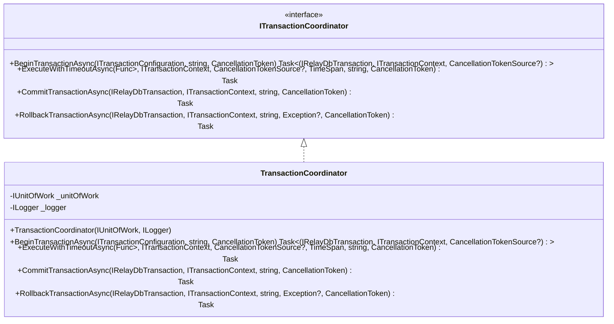
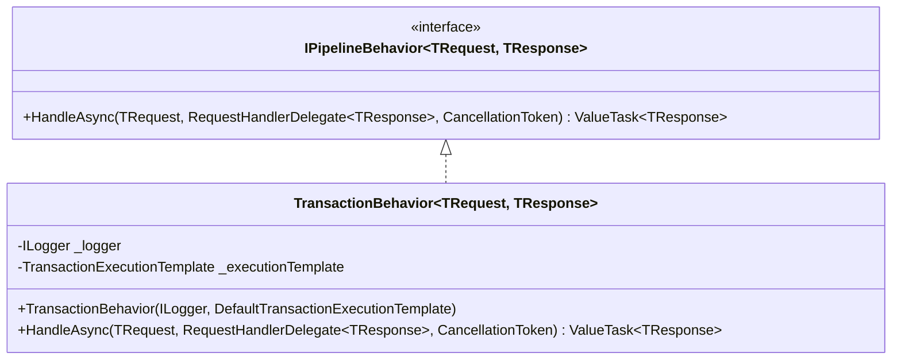
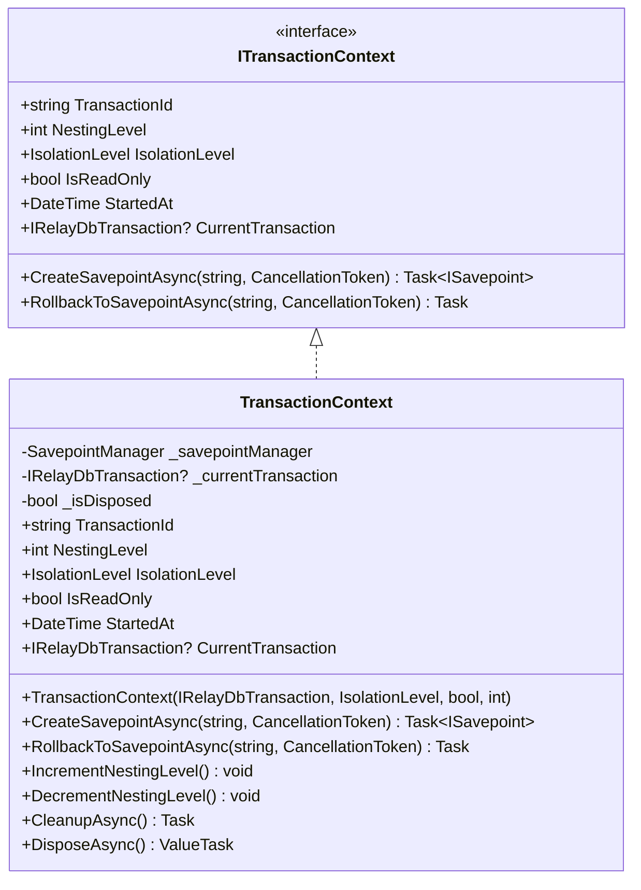
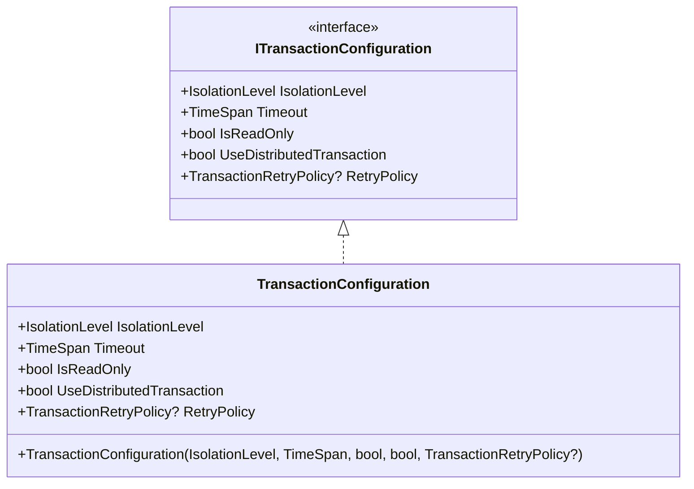
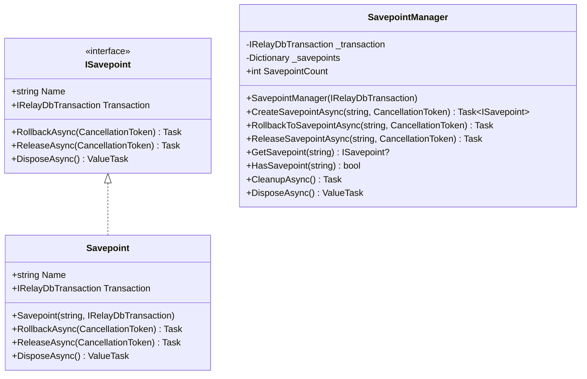
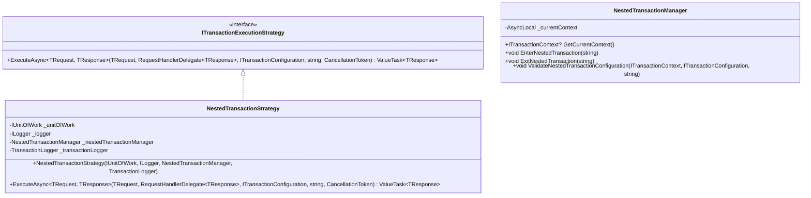
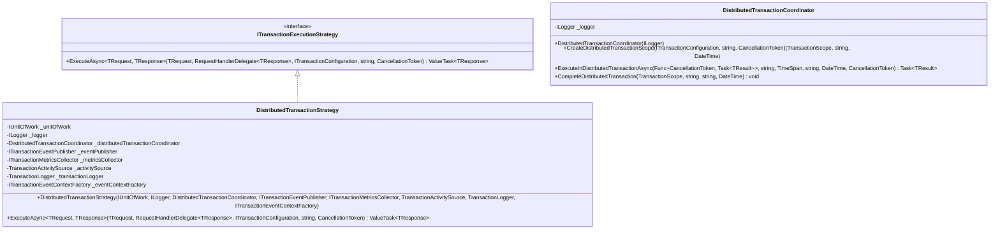
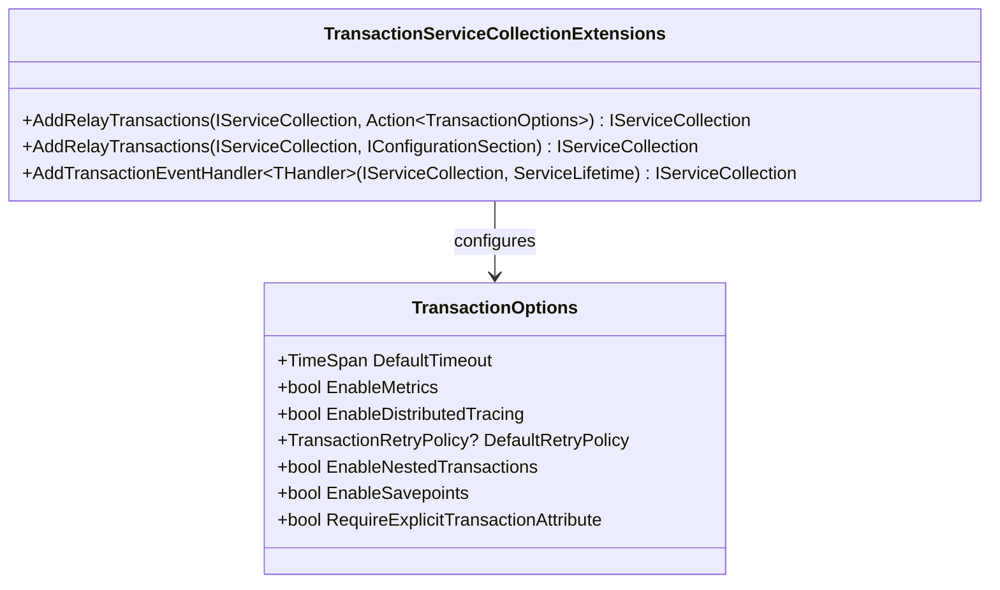
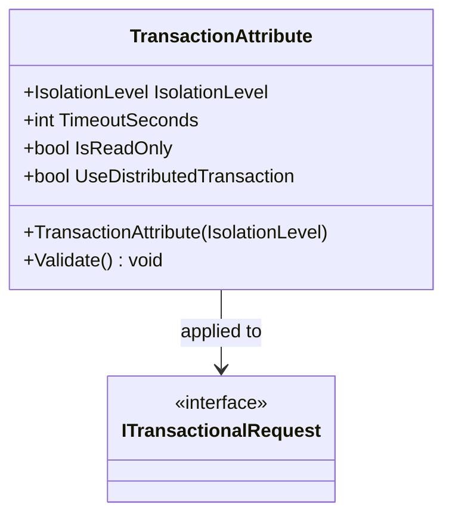
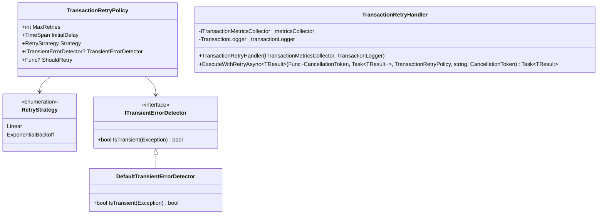

# Transactions

<cite>
**Referenced Files in This Document**   
- [TransactionCoordinator.cs](file://src/Relay.Core/Transactions/TransactionCoordinator.cs)
- [TransactionBehavior.cs](file://src/Relay.Core/Transactions/TransactionBehavior.cs)
- [TransactionContext.cs](file://src/Relay.Core/Transactions/TransactionContext.cs)
- [TransactionConfiguration.cs](file://src/Relay.Core/Transactions/TransactionConfiguration.cs)
- [TransactionOptions.cs](file://src/Relay.Core/Transactions/TransactionOptions.cs)
- [SavepointManager.cs](file://src/Relay.Core/Transactions/SavepointManager.cs)
- [ITransactionContext.cs](file://src/Relay.Core/Transactions/ITransactionContext.cs)
- [TransactionServiceCollectionExtensions.cs](file://src/Relay.Core/Transactions/TransactionServiceCollectionExtensions.cs)
- [TransactionAttribute.cs](file://src/Relay.Core/Transactions/TransactionAttribute.cs)
- [ITransactionalRequest.cs](file://src/Relay.Core/Transactions/ITransactionalRequest.cs)
- [TransactionRetryPolicy.cs](file://src/Relay.Core/Transactions/TransactionRetryPolicy.cs)
- [DistributedTransactionStrategy.cs](file://src/Relay.Core/Transactions/Strategies/DistributedTransactionStrategy.cs)
- [NestedTransactionStrategy.cs](file://src/Relay.Core/Transactions/Strategies/NestedTransactionStrategy.cs)
- [DefaultTransactionExecutionTemplate.cs](file://src/Relay.Core/Transactions/Template/DefaultTransactionExecutionTemplate.cs)
</cite>

## Table of Contents
1. [Introduction](#introduction)
2. [Transaction Coordinator](#transaction-coordinator)
3. [Transaction Behavior](#transaction-behavior)
4. [Transaction Context](#transaction-context)
5. [Transaction Configuration](#transaction-configuration)
6. [Savepoints and Partial Rollbacks](#savepoints-and-partial-rollbacks)
7. [Nested Transactions](#nested-transactions)
8. [Distributed Transactions](#distributed-transactions)
9. [Configuration Options](#configuration-options)
10. [Transaction Attributes](#transaction-attributes)
11. [Retry Policies](#retry-policies)
12. [Common Issues and Solutions](#common-issues-and-solutions)

## Introduction

The Transactions sub-feature in the Relay framework provides a comprehensive solution for managing distributed transactions across multiple operations while ensuring data consistency. This system implements a sophisticated transaction management infrastructure that handles transaction boundaries, context propagation, and coordination across various transactional operations.

The transaction system is built around several core components that work together to provide a robust transaction management solution. At its heart is the TransactionCoordinator, which manages the lifecycle of transactions including timeout enforcement, nested transaction management, and savepoint coordination. The TransactionBehavior acts as a pipeline behavior that automatically wraps request handlers in database transactions, providing features like automatic retry on transient failures and transaction event hooks.

TransactionContext plays a crucial role in the system by flowing through the execution pipeline and maintaining transaction metadata such as transaction ID, nesting level, isolation level, and read-only status. This context is stored in AsyncLocal storage to ensure it flows correctly through asynchronous operations.

The system supports various transaction strategies including distributed transactions that coordinate across multiple resources, nested transactions that reuse existing transaction contexts, and outermost transactions that establish new transaction boundaries. It also provides comprehensive support for savepoints, allowing partial rollbacks within a transaction without affecting the entire operation.

Configuration of the transaction system is flexible and can be controlled through both code-based configuration and appsettings.json configuration. The system enforces explicit transaction configuration through the TransactionAttribute, requiring developers to consciously specify isolation levels and other transaction properties.

**Section sources**
- [TransactionCoordinator.cs](file://src/Relay.Core/Transactions/TransactionCoordinator.cs#L1-L309)
- [TransactionBehavior.cs](file://src/Relay.Core/Transactions/TransactionBehavior.cs#L1-L59)
- [TransactionContext.cs](file://src/Relay.Core/Transactions/TransactionContext.cs#L1-L153)

## Transaction Coordinator

The TransactionCoordinator is responsible for managing the lifecycle of transactions, including beginning transactions with proper isolation levels, enforcing transaction timeouts, managing nested transaction scenarios, and coordinating savepoint operations. It serves as the central component for transaction management and is used internally by the TransactionBehavior to coordinate transaction operations.

The coordinator provides methods for beginning transactions with specified configurations and timeout enforcement. When beginning a transaction, it creates a unique transaction ID and records the start time for duration tracking. If a timeout is configured, it creates a CancellationTokenSource that will cancel the operation after the specified duration, ensuring that long-running transactions don't block resources indefinitely.

For transaction execution, the coordinator provides the ExecuteWithTimeoutAsync method that wraps operations with timeout enforcement. This method uses the effective cancellation token (either the timeout token or the original cancellation token) to ensure operations don't exceed their allocated time. If a timeout occurs during execution, it throws a TransactionTimeoutException with detailed information about the elapsed time and configured timeout.

The coordinator also handles transaction commitment and rollback operations. When committing a transaction, it logs the operation with the transaction ID and elapsed time, then delegates to the underlying database transaction. For rollbacks, it provides detailed logging of the rollback reason, including whether it was due to an exception, and ensures proper cleanup of transaction resources.

**Diagram sources**
- [TransactionCoordinator.cs](file://src/Relay.Core/Transactions/TransactionCoordinator.cs#L24-L309)

**Section sources**
- [TransactionCoordinator.cs](file://src/Relay.Core/Transactions/TransactionCoordinator.cs#L24-L309)

## Transaction Behavior

The TransactionBehavior is a pipeline behavior that automatically wraps request handlers in database transactions with comprehensive features. It serves as the integration point between the MediatR pipeline and the transaction management system, ensuring that transactional requests are properly wrapped in transaction boundaries.

This behavior requires all transactional requests to have a TransactionAttribute with an explicit isolation level specified. Requests without the attribute or with IsolationLevel.Unspecified will throw a TransactionConfigurationException, enforcing explicit transaction configuration decisions. This design prevents implicit transaction behavior and ensures developers consciously choose appropriate isolation levels for their operations.

The behavior provides several key features including transaction timeout enforcement, automatic retry on transient failures, transaction event hooks, nested transaction support, read-only transaction optimization, distributed transaction coordination, and comprehensive metrics and telemetry. It delegates the actual transaction execution to a TransactionExecutionTemplate, which uses a strategy pattern to determine the appropriate execution approach based on the transaction configuration.

When handling a request, the TransactionBehavior delegates to the execution template, which determines whether to use a distributed transaction strategy, nested transaction strategy, or outermost transaction strategy based on the current context and configuration. This allows for sophisticated transaction management that can adapt to different scenarios while maintaining consistency.

**Diagram sources**
- [TransactionBehavior.cs](file://src/Relay.Core/Transactions/TransactionBehavior.cs#L35-L59)

**Section sources**
- [TransactionBehavior.cs](file://src/Relay.Core/Transactions/TransactionBehavior.cs#L12-L59)

## Transaction Context

The TransactionContext represents the context of an active transaction, providing access to transaction metadata and savepoint management operations. It flows through the execution pipeline via AsyncLocal storage, ensuring that transaction information is available throughout asynchronous operations.

The context maintains several key pieces of information including a unique transaction ID for correlation in logs and traces, the current nesting level indicating how many nested transactional requests are active, the isolation level determining locking behavior and consistency guarantees, a flag indicating whether the transaction is read-only, and the timestamp when the transaction was started for duration tracking.

The TransactionContext also provides methods for managing savepoints within the transaction, allowing for partial rollbacks without affecting the entire transaction. These methods include CreateSavepointAsync for creating named savepoints and RollbackToSavepointAsync for rolling back to a previously created savepoint. The context ensures that savepoint names are unique within the transaction and provides proper error handling when savepoint operations fail.

Internally, the context uses a SavepointManager to track and manage savepoints, and it provides methods to increment and decrement the nesting level when entering and exiting nested transactions. It also handles proper cleanup of resources when the transaction completes, ensuring that all savepoints are properly disposed.

**Diagram sources**
- [ITransactionContext.cs](file://src/Relay.Core/Transactions/ITransactionContext.cs#L31-L120)
- [TransactionContext.cs](file://src/Relay.Core/Transactions/TransactionContext.cs#L17-L153)

**Section sources**
- [ITransactionContext.cs](file://src/Relay.Core/Transactions/ITransactionContext.cs#L8-L120)
- [TransactionContext.cs](file://src/Relay.Core/Transactions/TransactionContext.cs#L8-L153)

## Transaction Configuration

Transaction configuration in the Relay framework is managed through the ITransactionConfiguration interface and its concrete implementation TransactionConfiguration. This configuration object defines the properties and behavior of a transaction, including isolation level, timeout duration, read-only status, distributed transaction usage, and retry policies.

The TransactionConfiguration class provides properties for all these aspects of transaction behavior. The IsolationLevel property determines the locking behavior and consistency guarantees of the transaction, with options ranging from ReadUncommitted to Serializable. The Timeout property specifies the maximum duration for the transaction before it is automatically rolled back. The IsReadOnly flag indicates whether the transaction is read-only, which can enable database optimizations and prevent modification operations.

The UseDistributedTransaction property determines whether the transaction should use distributed transaction coordination via TransactionScope to coordinate operations across multiple resources. The RetryPolicy property allows specification of automatic retry behavior for transient failures, including the maximum number of retries, initial delay, retry strategy (linear or exponential backoff), and conditions for retrying.

Configuration can be applied at both the global level through TransactionOptions and at the individual request level through the TransactionAttribute. This allows for default settings to be established at the application level while still permitting specific overrides for individual transactional operations.

**Diagram sources**
- [ITransactionConfiguration.cs](file://src/Relay.Core/Transactions/ITransactionConfiguration.cs)
- [TransactionConfiguration.cs](file://src/Relay.Core/Transactions/TransactionConfiguration.cs#L9-L48)

**Section sources**
- [TransactionConfiguration.cs](file://src/Relay.Core/Transactions/TransactionConfiguration.cs#L6-L49)

## Savepoints and Partial Rollbacks

The Relay transaction system provides comprehensive support for savepoints, enabling partial rollbacks within a transaction without affecting the entire operation. This feature is implemented through the SavepointManager class, which manages the creation, tracking, and lifecycle of savepoints within a transaction.

Savepoints allow developers to create named checkpoints within a transaction that can be rolled back to if needed. This is particularly useful for complex operations where certain parts might fail independently of others. For example, in a multi-step order processing operation, a savepoint could be created before inventory updates, allowing those updates to be rolled back if payment processing fails, while still preserving earlier steps like order creation.

The SavepointManager ensures that savepoint names are unique within the transaction and validates names to prevent SQL injection attacks by restricting characters to letters, digits, and underscores. It provides methods for creating savepoints (CreateSavepointAsync), rolling back to savepoints (RollbackToSavepointAsync), releasing savepoints (ReleaseSavepointAsync), and checking for the existence of savepoints (HasSavepoint).

When a savepoint is created, the manager executes a SAVEPOINT SQL command against the database and maintains a reference to the savepoint in memory. Rolling back to a savepoint undoes all changes made after the savepoint was created but leaves the transaction active and able to continue. Released savepoints are removed from the manager's tracking but remain in the database until the transaction completes.

**Diagram sources**
- [ISavepoint.cs](file://src/Relay.Core/Transactions/ISavepoint.cs)
- [Savepoint.cs](file://src/Relay.Core/Transactions/Savepoint.cs)
- [SavepointManager.cs](file://src/Relay.Core/Transactions/SavepointManager.cs#L13-L253)

**Section sources**
- [SavepointManager.cs](file://src/Relay.Core/Transactions/SavepointManager.cs#L10-L253)

## Nested Transactions

The Relay framework supports nested transactions through the NestedTransactionStrategy and NestedTransactionManager classes. This feature allows transactional requests to be called from within other transactional requests, reusing the existing transaction context rather than creating a new transaction.

When a nested transaction is detected, the system increments the nesting level in the TransactionContext and allows the operation to proceed within the existing transaction. This prevents issues that could arise from multiple concurrent transactions on the same connection and ensures that all operations participate in the same transaction boundary.

The NestedTransactionManager is responsible for tracking the current transaction context and managing the nesting level. It provides methods to enter and exit nested transactions, ensuring proper incrementing and decrementing of the nesting level. It also validates that nested transaction configurations are compatible with the outer transaction, preventing conflicts in isolation levels or read-only status.

Nested transactions provide several benefits including reduced resource usage (single database transaction instead of multiple), consistent transaction boundaries across related operations, and simplified error handling (all operations succeed or fail together). However, they also require careful consideration of isolation levels and transaction boundaries to ensure data consistency.

**Diagram sources**
- [ITransactionExecutionStrategy.cs](file://src/Relay.Core/Transactions/Strategies/ITransactionExecutionStrategy.cs)
- [NestedTransactionStrategy.cs](file://src/Relay.Core/Transactions/Strategies/NestedTransactionStrategy.cs#L13-L102)
- [INestedTransactionManager.cs](file://src/Relay.Core/Transactions/INestedTransactionManager.cs)
- [NestedTransactionManager.cs](file://src/Relay.Core/Transactions/NestedTransactionManager.cs)

**Section sources**
- [NestedTransactionStrategy.cs](file://src/Relay.Core/Transactions/Strategies/NestedTransactionStrategy.cs#L8-L102)
- [NestedTransactionManager.cs](file://src/Relay.Core/Transactions/NestedTransactionManager.cs)

## Distributed Transactions

Distributed transactions in the Relay framework are managed by the DistributedTransactionStrategy and DistributedTransactionCoordinator classes. These components enable transaction coordination across multiple resources or databases using System.Transactions.TransactionScope.

The DistributedTransactionStrategy handles the execution of distributed transactions by creating a TransactionScope with the specified isolation level and other configuration options. It coordinates the transaction lifecycle, including beginning the transaction, executing the operation, and committing or rolling back based on the outcome.

When a distributed transaction is created, the strategy starts a distributed transaction activity for tracing purposes and creates a TransactionScope with the appropriate settings. It then executes the operation within the scope, ensuring that all database operations participate in the distributed transaction. If the operation succeeds, it completes the transaction scope; if it fails, it disposes of the scope, causing a rollback.

The system supports various isolation levels for distributed transactions and provides comprehensive logging and metrics collection. It also handles transaction event publishing, allowing other components to react to transaction lifecycle events such as before and after commit or rollback.

**Diagram sources**
- [ITransactionExecutionStrategy.cs](file://src/Relay.Core/Transactions/Strategies/ITransactionExecutionStrategy.cs)
- [DistributedTransactionStrategy.cs](file://src/Relay.Core/Transactions/Strategies/DistributedTransactionStrategy.cs#L15-L181)
- [DistributedTransactionCoordinator.cs](file://src/Relay.Core/Transactions/DistributedTransactionCoordinator.cs)

**Section sources**
- [DistributedTransactionStrategy.cs](file://src/Relay.Core/Transactions/Strategies/DistributedTransactionStrategy.cs#L12-L181)
- [DistributedTransactionCoordinator.cs](file://src/Relay.Core/Transactions/DistributedTransactionCoordinator.cs)

## Configuration Options

The transaction system in Relay is highly configurable through the TransactionOptions class, which controls the default behavior of the transaction system. These options can be set programmatically or through configuration files like appsettings.json.

Key configuration options include DefaultTimeout, which sets the default timeout for transactions (default 30 seconds); EnableMetrics, which controls whether transaction metrics are collected (default true); EnableDistributedTracing, which enables OpenTelemetry tracing for transactions (default true); and DefaultRetryPolicy, which specifies the default retry policy for transient failures.

Additional options include EnableNestedTransactions, which controls whether nested transactions are allowed (default true); EnableSavepoints, which enables or disables savepoint support (default true); and RequireExplicitTransactionAttribute, which enforces that all transactional requests must have an explicit TransactionAttribute (default true).

These options can be configured through dependency injection using the AddRelayTransactions extension method, either with an action delegate or by binding to a configuration section. This allows for flexible configuration that can be adjusted based on environment or deployment requirements.

**Diagram sources**
- [TransactionOptions.cs](file://src/Relay.Core/Transactions/TransactionOptions.cs#L28-L134)
- [TransactionServiceCollectionExtensions.cs](file://src/Relay.Core/Transactions/TransactionServiceCollectionExtensions.cs#L33-L449)

**Section sources**
- [TransactionOptions.cs](file://src/Relay.Core/Transactions/TransactionOptions.cs#L5-L134)
- [TransactionServiceCollectionExtensions.cs](file://src/Relay.Core/Transactions/TransactionServiceCollectionExtensions.cs#L11-L449)

## Transaction Attributes

Transaction attributes in the Relay framework are implemented through the TransactionAttribute class, which provides declarative transaction configuration on transactional requests. This attribute is required on all types implementing ITransactionalRequest, enforcing explicit transaction configuration.

The attribute requires an explicit isolation level to be specified and does not allow IsolationLevel.Unspecified, ensuring that developers make conscious decisions about transaction isolation behavior. It includes properties for specifying the isolation level, timeout in seconds, whether the transaction is read-only, and whether distributed transaction coordination should be used.

The attribute performs validation to ensure configuration consistency, such as preventing read-only transactions from being used with distributed transactions. It also converts the timeout from seconds to a TimeSpan internally, providing a convenient interface while maintaining compatibility with the underlying transaction system.

When applied to a request class, the attribute is discovered by the transaction system and used to configure the transaction behavior for that request. This declarative approach keeps transaction configuration close to the business logic it affects, improving code readability and maintainability.

**Diagram sources**
- [TransactionAttribute.cs](file://src/Relay.Core/Transactions/TransactionAttribute.cs#L24-L120)
- [ITransactionalRequest.cs](file://src/Relay.Core/Transactions/ITransactionalRequest.cs#L12-L24)

**Section sources**
- [TransactionAttribute.cs](file://src/Relay.Core/Transactions/TransactionAttribute.cs#L6-L120)
- [ITransactionalRequest.cs](file://src/Relay.Core/Transactions/ITransactionalRequest.cs#L3-L24)

## Retry Policies

The Relay transaction system includes comprehensive support for retry policies through the TransactionRetryPolicy class and associated components. This feature allows automatic retry of transient transaction failures such as deadlocks, connection timeouts, or temporary database unavailability.

The TransactionRetryPolicy class defines the retry strategy with properties for MaxRetries (default 3), InitialDelay (default 100ms), and Strategy (Linear or ExponentialBackoff). It also includes mechanisms for determining which exceptions should trigger retries, either through a ShouldRetry predicate or a custom ITransientErrorDetector implementation.

The system includes a DefaultTransientErrorDetector that identifies common transient database errors, but also allows for custom detectors to handle application-specific or database-specific transient conditions. This flexibility enables precise control over retry behavior based on the specific requirements and error patterns of the application.

Retry policies can be configured at both the global level through TransactionOptions.DefaultRetryPolicy and at the individual request level through the TransactionAttribute or request-specific configuration. This allows for tailored retry strategies that balance resilience with performance considerations.

**Diagram sources**
- [TransactionRetryPolicy.cs](file://src/Relay.Core/Transactions/TransactionRetryPolicy.cs#L40-L144)
- [ITransientErrorDetector.cs](file://src/Relay.Core/Transactions/ITransientErrorDetector.cs)
- [DefaultTransientErrorDetector.cs](file://src/Relay.Core/Transactions/DefaultTransientErrorDetector.cs)
- [ITransactionRetryHandler.cs](file://src/Relay.Core/Transactions/ITransactionRetryHandler.cs)
- [TransactionRetryHandler.cs](file://src/Relay.Core/Transactions/TransactionRetryHandler.cs)

**Section sources**
- [TransactionRetryPolicy.cs](file://src/Relay.Core/Transactions/TransactionRetryPolicy.cs#L22-L144)

## Common Issues and Solutions

Several common issues can arise when working with the Relay transaction system, along with their corresponding solutions. Understanding these issues and their resolutions is crucial for maintaining application stability and data consistency.

Transaction escalation occurs when multiple connections are used within a transaction, causing the transaction to escalate from a lightweight local transaction to a distributed transaction. This can be prevented by ensuring that all operations within a transaction use the same database connection, typically managed by the UnitOfWork pattern.

Connection pooling conflicts can occur when connections are not properly returned to the pool, leading to connection exhaustion. This is addressed by ensuring proper disposal of transaction resources and using async/await patterns correctly to avoid connection leaks. The framework's use of async-disposable patterns helps mitigate this issue.

Deadlocks can occur when multiple transactions compete for the same resources in different orders. Prevention strategies include accessing resources in a consistent order across the application, keeping transactions as short as possible, and using appropriate isolation levels. The retry system can also help recover from deadlock conditions when they do occur.

Transaction scope management issues can arise when nested transactions have conflicting configurations. The system validates nested transaction compatibility and throws descriptive exceptions when conflicts are detected, helping developers identify and resolve configuration issues early.

Timeout-related issues can be addressed by setting appropriate timeout values based on operation complexity and system load. The framework provides detailed logging when timeouts occur, including the elapsed time and configured timeout, aiding in performance tuning and issue diagnosis.

**Section sources**
- [TransactionCoordinator.cs](file://src/Relay.Core/Transactions/TransactionCoordinator.cs#L123-L142)
- [TransactionBehavior.cs](file://src/Relay.Core/Transactions/TransactionBehavior.cs#L16-L19)
- [TransactionAttribute.cs](file://src/Relay.Core/Transactions/TransactionAttribute.cs#L112-L117)
- [NestedTransactionStrategy.cs](file://src/Relay.Core/Transactions/Strategies/NestedTransactionStrategy.cs#L80-L99)