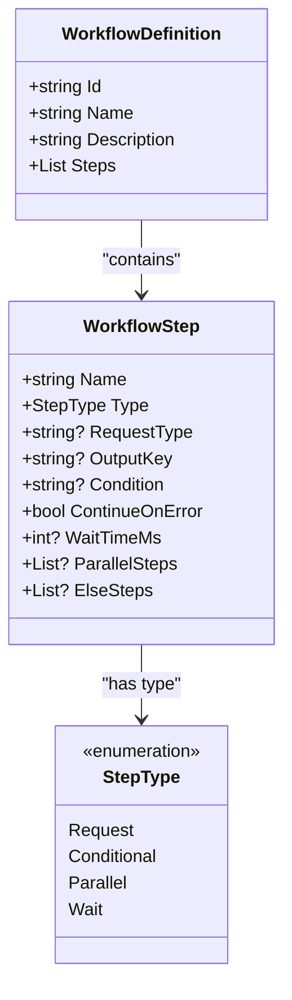
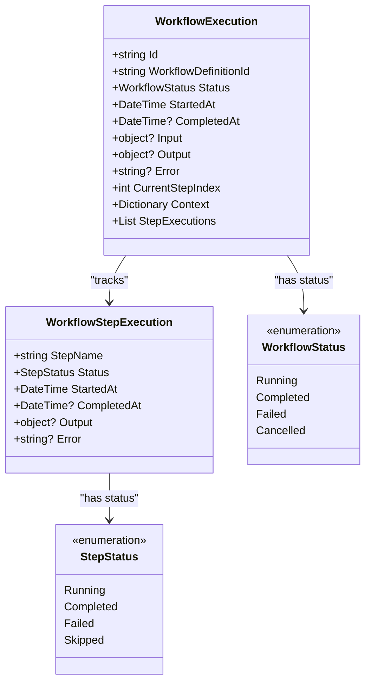
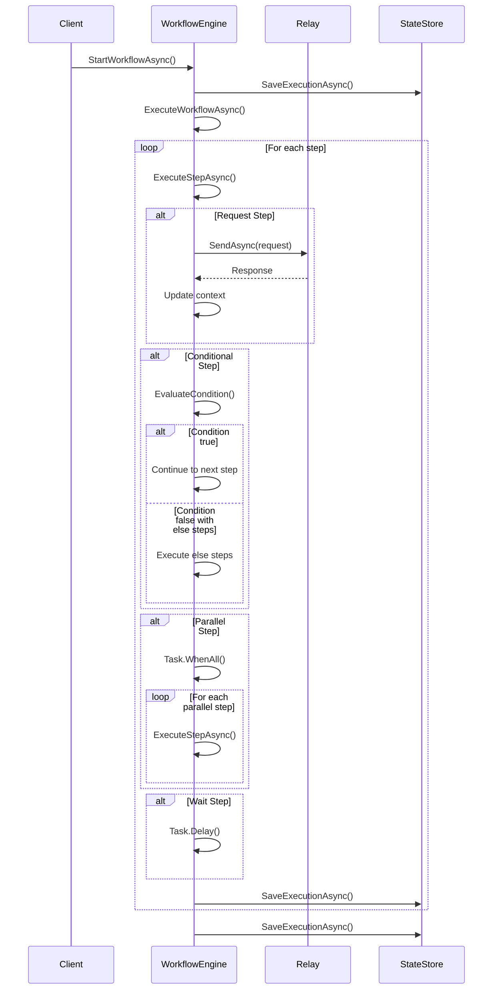
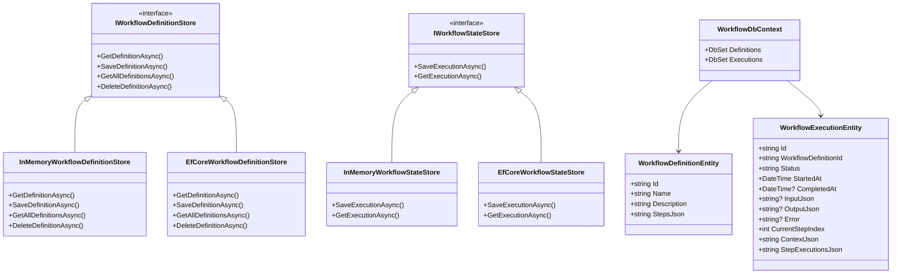
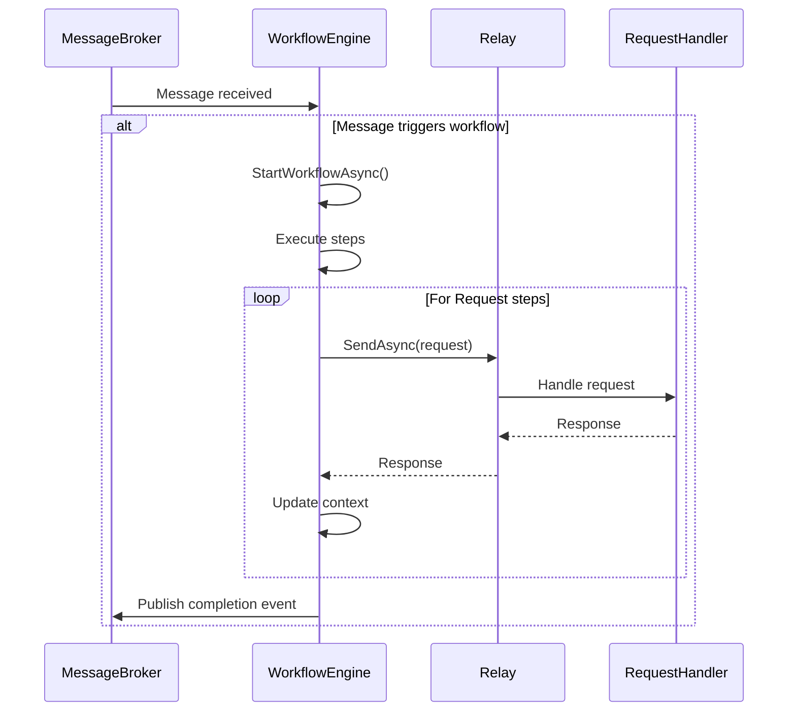

# Workflows

<cite>
**Referenced Files in This Document**   
- [IWorkflowEngine.cs](file://src/Relay.Core/Workflows/IWorkflowEngine.cs)
- [WorkflowEngine.cs](file://src/Relay.Core/Workflows/WorkflowEngine.cs)
- [WorkflowDefinition.cs](file://src/Relay.Core/Workflows/WorkflowDefinition.cs)
- [WorkflowExecution.cs](file://src/Relay.Core/Workflows/WorkflowExecution.cs)
- [WorkflowStep.cs](file://src/Relay.Core/Workflows/WorkflowStep.cs)
- [WorkflowStatus.cs](file://src/Relay.Core/Workflows/WorkflowStatus.cs)
- [StepStatus.cs](file://src/Relay.Core/Workflows/StepStatus.cs)
- [StepType.cs](file://src/Relay.Core/Workflows/StepType.cs)
- [WorkflowStepExecution.cs](file://src/Relay.Core/Workflows/WorkflowStepExecution.cs)
- [IWorkflowDefinitionStore.cs](file://src/Relay.Core/Workflows/IWorkflowDefinitionStore.cs)
- [IWorkflowStateStore.cs](file://src/Relay.Core/Workflows/IWorkflowStateStore.cs)
- [InMemoryWorkflowDefinitionStore.cs](file://src/Relay.Core/Workflows/InMemoryWorkflowDefinitionStore.cs)
- [EfCoreWorkflowDefinitionStore.cs](file://src/Relay.Core/Workflows/Infrastructure/EfCoreWorkflowDefinitionStore.cs)
- [InMemoryWorkflowStateStore.cs](file://src/Relay.Core/Workflows/Stores/InMemoryWorkflowStateStore.cs)
- [EfCoreWorkflowStateStore.cs](file://src/Relay.Core/Workflows/Infrastructure/EfCoreWorkflowStateStore.cs)
- [WorkflowDbContext.cs](file://src/Relay.Core/Workflows/Infrastructure/WorkflowDbContext.cs)
- [WorkflowDefinitionEntity.cs](file://src/Relay.Core/Workflows/Infrastructure/WorkflowDefinitionEntity.cs)
- [WorkflowExecutionEntity.cs](file://src/Relay.Core/Workflows/Infrastructure/WorkflowExecutionEntity.cs)
</cite>

## Table of Contents
1. [Introduction](#introduction)
2. [Workflow Definition](#workflow-definition)
3. [Workflow Execution](#workflow-execution)
4. [Workflow Engine Implementation](#workflow-engine-implementation)
5. [Persistence Mechanisms](#persistence-mechanisms)
6. [Integration with Messaging System](#integration-with-messaging-system)
7. [Configuration Options](#configuration-options)
8. [Design Guidelines](#design-guidelines)
9. [Common Issues and Solutions](#common-issues-and-solutions)
10. [Conclusion](#conclusion)

## Introduction
The Workflows sub-feature in the Relay framework provides a robust engine for defining and executing complex business processes. This documentation details the implementation of the workflow system, including the definition of workflows, execution management, persistence mechanisms, and integration with the core messaging infrastructure. The system supports long-running processes with comprehensive state management, various step types, and configurable error handling policies.

## Workflow Definition

The workflow definition system allows for the specification of complex business processes through a structured definition model. The core components include:

- **WorkflowDefinition**: The main container for a workflow, containing metadata and a collection of steps
- **WorkflowStep**: Represents individual steps within a workflow with different types and configurations
- **StepType**: Enumeration defining the available step types (Request, Conditional, Parallel, Wait)

The `WorkflowDefinition` class contains essential metadata such as ID, name, description, and an ordered list of steps. Each `WorkflowStep` can be configured with specific properties depending on its type, enabling flexible process orchestration.

**Diagram sources**
- [WorkflowDefinition.cs](file://src/Relay.Core/Workflows/WorkflowDefinition.cs#L8-L14)
- [WorkflowStep.cs](file://src/Relay.Core/Workflows/WorkflowStep.cs#L8-L19)
- [StepType.cs](file://src/Relay.Core/Workflows/StepType.cs#L6-L12)

**Section sources**
- [WorkflowDefinition.cs](file://src/Relay.Core/Workflows/WorkflowDefinition.cs#L8-L14)
- [WorkflowStep.cs](file://src/Relay.Core/Workflows/WorkflowStep.cs#L8-L19)
- [StepType.cs](file://src/Relay.Core/Workflows/StepType.cs#L6-L12)

## Workflow Execution

The workflow execution system manages the runtime state of active workflows, tracking progress, status, and context. Key components include:

- **WorkflowExecution**: Represents the runtime state of a workflow instance
- **WorkflowStepExecution**: Tracks the execution state of individual steps
- **WorkflowStatus**: Enumeration indicating the current status of a workflow
- **StepStatus**: Enumeration indicating the status of individual step execution

The `WorkflowExecution` class maintains critical runtime information including the current status, timestamps, input/output data, execution context, and step execution history. The context dictionary allows for data sharing between steps, while the step execution collection provides detailed tracking of each step's progress.

**Diagram sources**
- [WorkflowExecution.cs](file://src/Relay.Core/Workflows/WorkflowExecution.cs#L9-L22)
- [WorkflowStepExecution.cs](file://src/Relay.Core/Workflows/WorkflowStepExecution.cs#L8-L16)
- [WorkflowStatus.cs](file://src/Relay.Core/Workflows/WorkflowStatus.cs#L6-L11)
- [StepStatus.cs](file://src/Relay.Core/Workflows/StepStatus.cs#L6-L11)

**Section sources**
- [WorkflowExecution.cs](file://src/Relay.Core/Workflows/WorkflowExecution.cs#L9-L22)
- [WorkflowStepExecution.cs](file://src/Relay.Core/Workflows/WorkflowStepExecution.cs#L8-L16)
- [WorkflowStatus.cs](file://src/Relay.Core/Workflows/WorkflowStatus.cs#L6-L11)
- [StepStatus.cs](file://src/Relay.Core/Workflows/StepStatus.cs#L6-L11)

## Workflow Engine Implementation

The `WorkflowEngine` class implements the `IWorkflowEngine` interface and provides the core functionality for workflow orchestration. It manages the lifecycle of workflows from initiation to completion, handling various step types and maintaining execution state.

Key methods include:
- `StartWorkflowAsync`: Initiates a new workflow execution with the specified definition and input
- `GetExecutionAsync`: Retrieves the current state of a workflow execution
- `ExecuteWorkflowAsync`: The main execution loop that processes workflow steps sequentially
- `ExecuteStepAsync`: Handles the execution of individual steps based on their type

The engine supports four primary step types:
1. **Request**: Executes a Relay request and stores the response in the workflow context
2. **Conditional**: Evaluates a condition and optionally executes else steps
3. **Parallel**: Executes multiple steps concurrently
4. **Wait**: Introduces a delay in the workflow execution

**Diagram sources**
- [WorkflowEngine.cs](file://src/Relay.Core/Workflows/WorkflowEngine.cs#L35-L648)
- [IWorkflowEngine.cs](file://src/Relay.Core/Workflows/IWorkflowEngine.cs#L11-L13)

**Section sources**
- [WorkflowEngine.cs](file://src/Relay.Core/Workflows/WorkflowEngine.cs#L17-L648)

## Persistence Mechanisms

The workflow system provides flexible persistence options through pluggable store implementations. The architecture separates the workflow definition storage from the execution state storage, allowing for independent configuration and scaling.

### Workflow Definition Storage
The `IWorkflowDefinitionStore` interface defines operations for managing workflow definitions:
- `GetDefinitionAsync`: Retrieves a workflow definition by ID
- `SaveDefinitionAsync`: Persists a workflow definition
- `GetAllDefinitionsAsync`: Retrieves all available workflow definitions
- `DeleteDefinitionAsync`: Removes a workflow definition

Two implementations are provided:
- `InMemoryWorkflowDefinitionStore`: Stores definitions in memory (suitable for development)
- `EfCoreWorkflowDefinitionStore`: Persists definitions to a database using Entity Framework Core

### Workflow State Storage
The `IWorkflowStateStore` interface defines operations for managing workflow execution state:
- `SaveExecutionAsync`: Persists the current state of a workflow execution
- `GetExecutionAsync`: Retrieves the state of a workflow execution by ID

Two implementations are provided:
- `InMemoryWorkflowStateStore`: Stores execution state in memory
- `EfCoreWorkflowStateStore`: Persists execution state to a database

The Entity Framework Core implementation uses the following entities:
- `WorkflowDefinitionEntity`: Database representation of workflow definitions
- `WorkflowExecutionEntity`: Database representation of workflow execution state
- `WorkflowDbContext`: Entity Framework context managing the workflow entities

**Diagram sources**
- [IWorkflowDefinitionStore.cs](file://src/Relay.Core/Workflows/IWorkflowDefinitionStore.cs#L10-L16)
- [IWorkflowStateStore.cs](file://src/Relay.Core/Workflows/IWorkflowStateStore.cs#L10-L13)
- [InMemoryWorkflowDefinitionStore.cs](file://src/Relay.Core/Workflows/InMemoryWorkflowDefinitionStore.cs)
- [EfCoreWorkflowDefinitionStore.cs](file://src/Relay.Core/Workflows/Infrastructure/EfCoreWorkflowDefinitionStore.cs)
- [InMemoryWorkflowStateStore.cs](file://src/Relay.Core/Workflows/Stores/InMemoryWorkflowStateStore.cs)
- [EfCoreWorkflowStateStore.cs](file://src/Relay.Core/Workflows/Infrastructure/EfCoreWorkflowStateStore.cs)
- [WorkflowDbContext.cs](file://src/Relay.Core/Workflows/Infrastructure/WorkflowDbContext.cs)
- [WorkflowDefinitionEntity.cs](file://src/Relay.Core/Workflows/Infrastructure/WorkflowDefinitionEntity.cs)
- [WorkflowExecutionEntity.cs](file://src/Relay.Core/Workflows/Infrastructure/WorkflowExecutionEntity.cs)

**Section sources**
- [IWorkflowDefinitionStore.cs](file://src/Relay.Core/Workflows/IWorkflowDefinitionStore.cs#L10-L16)
- [IWorkflowStateStore.cs](file://src/Relay.Core/Workflows/IWorkflowStateStore.cs#L10-L13)
- [InMemoryWorkflowDefinitionStore.cs](file://src/Relay.Core/Workflows/InMemoryWorkflowDefinitionStore.cs)
- [EfCoreWorkflowDefinitionStore.cs](file://src/Relay.Core/Workflows/Infrastructure/EfCoreWorkflowDefinitionStore.cs)
- [InMemoryWorkflowStateStore.cs](file://src/Relay.Core/Workflows/Stores/InMemoryWorkflowStateStore.cs)
- [EfCoreWorkflowStateStore.cs](file://src/Relay.Core/Workflows/Infrastructure/EfCoreWorkflowStateStore.cs)

## Integration with Messaging System

The workflow engine integrates with the core messaging system through the `IRelay` interface, enabling workflows to trigger and respond to messages. This integration allows workflows to be initiated by incoming messages and to send messages as part of their execution.

When a workflow step of type "Request" is executed, the engine creates a request object based on the step configuration and the current workflow context. The request is then sent through the `IRelay.SendAsync` method, which routes it to the appropriate handler. The response is captured and stored in the workflow context for use by subsequent steps.

Workflows can also be triggered by messages through the workflow engine's integration with the message broker system. When a message arrives that matches a workflow trigger condition, the corresponding workflow is started with the message content as input.

The integration supports both synchronous and asynchronous message patterns, allowing workflows to handle immediate responses or wait for future events. This enables complex business processes that span multiple systems and time periods.

**Diagram sources**
- [WorkflowEngine.cs](file://src/Relay.Core/Workflows/WorkflowEngine.cs#L207-L214)
- [IWorkflowEngine.cs](file://src/Relay.Core/Workflows/IWorkflowEngine.cs#L11-L13)

**Section sources**
- [WorkflowEngine.cs](file://src/Relay.Core/Workflows/WorkflowEngine.cs#L207-L214)

## Configuration Options

The workflow system provides several configuration options to control behavior, error handling, and performance characteristics.

### Timeout Configuration
Workflows support configurable timeouts at both the step and workflow levels. The Wait step type allows for introducing delays between steps, with the `WaitTimeMs` property specifying the duration in milliseconds. This enables time-based workflows and scheduled operations.

### Retry Policies
The system supports retry policies through the `ContinueOnError` property on workflow steps. When set to true, if a step fails, the workflow continues to the next step rather than failing entirely. This allows for resilient workflows that can handle transient failures.

For more sophisticated retry logic, workflows can be designed with conditional steps that check for failure conditions and implement custom retry loops using parallel or request steps.

### Compensation Handlers
While not explicitly implemented as a dedicated step type, compensation logic can be implemented using conditional steps and the `ElseSteps` property. When a step fails, subsequent steps can detect the error condition and execute compensating actions to maintain data consistency.

The workflow context can be used to store state information needed for compensation, such as original values before updates or references to created resources that need cleanup.

### Error Handling
The workflow engine provides comprehensive error handling with the following features:
- Automatic workflow failure when a step fails and `ContinueOnError` is false
- Detailed error information stored in the execution state
- Logging of step execution failures
- Preservation of partial execution state for debugging

Workflows can also implement custom error handling by checking for error conditions in subsequent steps and taking appropriate actions.

**Section sources**
- [WorkflowStep.cs](file://src/Relay.Core/Workflows/WorkflowStep.cs#L15)
- [WorkflowEngine.cs](file://src/Relay.Core/Workflows/WorkflowEngine.cs#L188-L193)
- [WorkflowExecution.cs](file://src/Relay.Core/Workflows/WorkflowExecution.cs#L18)
- [WorkflowStepExecution.cs](file://src/Relay.Core/Workflows/WorkflowStepExecution.cs#L15)

## Design Guidelines

### Idempotent Workflow Steps
To ensure reliability in distributed systems, workflow steps should be designed to be idempotent whenever possible. This means that executing the same step multiple times with the same input produces the same result without side effects.

Strategies for achieving idempotency include:
- Using unique identifiers for operations to detect and prevent duplicates
- Implementing幂等 APIs in request handlers
- Using conditional updates that only modify data if it hasn't changed
- Employing distributed locks for critical sections

The workflow engine's persistence mechanism helps support idempotency by ensuring that step execution state is preserved even if the workflow is interrupted and resumed.

### Failure Handling
Effective failure handling in workflows involves several best practices:

1. **Graceful Degradation**: Design workflows to continue when possible, using the `ContinueOnError` flag for non-critical steps.

2. **Error Detection**: Use conditional steps to check for error conditions and take appropriate actions.

3. **Compensation**: Implement compensating transactions for steps that modify state, ensuring data consistency when failures occur.

4. **Retry Logic**: Implement exponential backoff or other retry strategies for transient failures.

5. **Monitoring**: Log step execution details and errors for troubleshooting and analysis.

6. **Circuit Breaking**: For external dependencies, consider implementing circuit breaker patterns to prevent cascading failures.

Workflows should be designed with the assumption that failures will occur, and include appropriate error handling and recovery mechanisms.

**Section sources**
- [WorkflowStep.cs](file://src/Relay.Core/Workflows/WorkflowStep.cs#L15)
- [WorkflowEngine.cs](file://src/Relay.Core/Workflows/WorkflowEngine.cs#L188-L193)
- [WorkflowExecution.cs](file://src/Relay.Core/Workflows/WorkflowExecution.cs#L18)
- [WorkflowStepExecution.cs](file://src/Relay.Core/Workflows/WorkflowStepExecution.cs#L15)

## Common Issues and Solutions

### Workflow State Corruption
Workflow state corruption can occur due to concurrent modifications or storage failures. The following solutions address this issue:

1. **Optimistic Concurrency Control**: The persistence layer should implement versioning or timestamps to detect concurrent modifications.

2. **Atomic Updates**: Ensure that state updates are atomic operations to prevent partial updates.

3. **Validation**: Validate workflow state before and after updates to detect corruption.

4. **Backup and Recovery**: Implement regular backups of workflow state for recovery purposes.

The Entity Framework Core implementation provides transactional integrity, helping to prevent state corruption during updates.

### Step Execution Deadlocks
Deadlocks can occur in workflows with complex dependencies or parallel execution patterns. Prevention strategies include:

1. **Timeouts**: Implement timeouts on all steps to prevent indefinite blocking.

2. **Resource Ordering**: Establish a consistent order for acquiring resources to prevent circular dependencies.

3. **Limited Parallelism**: Control the degree of parallelism to avoid overwhelming system resources.

4. **Deadlock Detection**: Implement monitoring to detect and resolve deadlocked workflows.

The workflow engine's sequential execution model for non-parallel steps helps prevent many deadlock scenarios, while the parallel step type includes built-in error handling for failed parallel executions.

### Performance Optimization
For high-throughput scenarios, consider the following optimizations:

1. **Batch Processing**: Group multiple workflow initiations when possible.

2. **Caching**: Cache frequently accessed workflow definitions.

3. **Asynchronous Processing**: Ensure that all I/O operations are performed asynchronously.

4. **Database Indexing**: Index database tables on frequently queried fields like execution ID and status.

5. **State Minimization**: Store only essential data in the workflow context to reduce storage overhead.

**Section sources**
- [WorkflowEngine.cs](file://src/Relay.Core/Workflows/WorkflowEngine.cs#L56)
- [EfCoreWorkflowStateStore.cs](file://src/Relay.Core/Workflows/Infrastructure/EfCoreWorkflowStateStore.cs)
- [WorkflowExecution.cs](file://src/Relay.Core/Workflows/WorkflowExecution.cs#L20)
- [WorkflowStepExecution.cs](file://src/Relay.Core/Workflows/WorkflowStepExecution.cs#L14)

## Conclusion
The Workflows sub-feature in the Relay framework provides a comprehensive solution for defining and executing complex business processes. The system's modular architecture, with clear separation between definition, execution, and persistence, enables flexible and scalable workflow management.

Key strengths of the implementation include:
- Support for multiple step types enabling complex process orchestration
- Flexible persistence options from in-memory to database-backed storage
- Integration with the core messaging system for event-driven workflows
- Comprehensive error handling and state management
- Support for long-running processes with reliable state persistence

The workflow engine can be extended with custom step types, storage providers, and integration points to meet specific business requirements. By following the design guidelines and addressing common issues, developers can create robust, reliable workflows that automate complex business processes effectively.