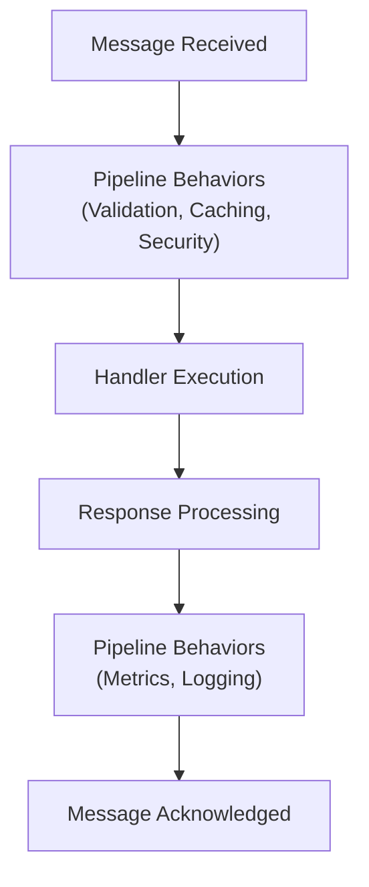
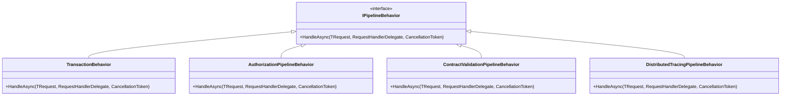
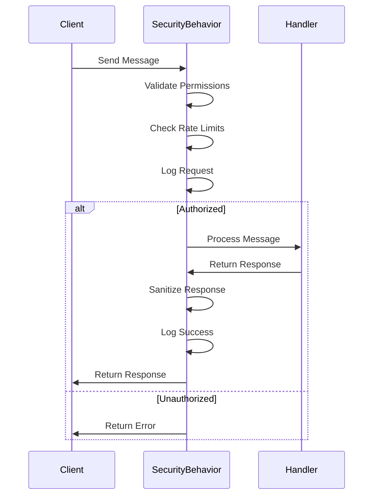
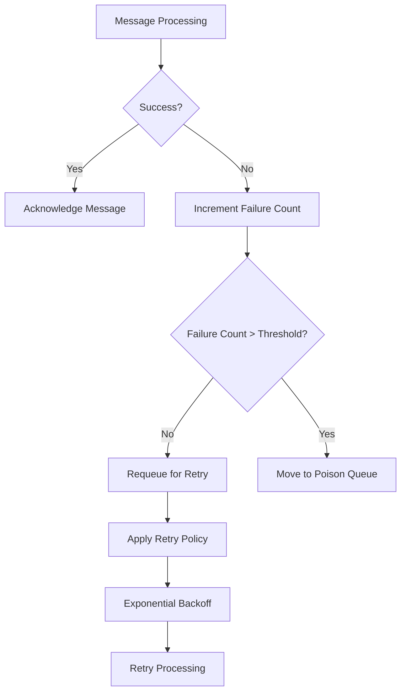
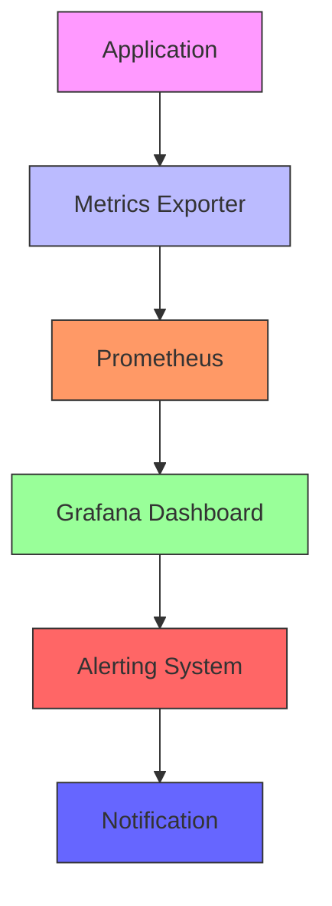
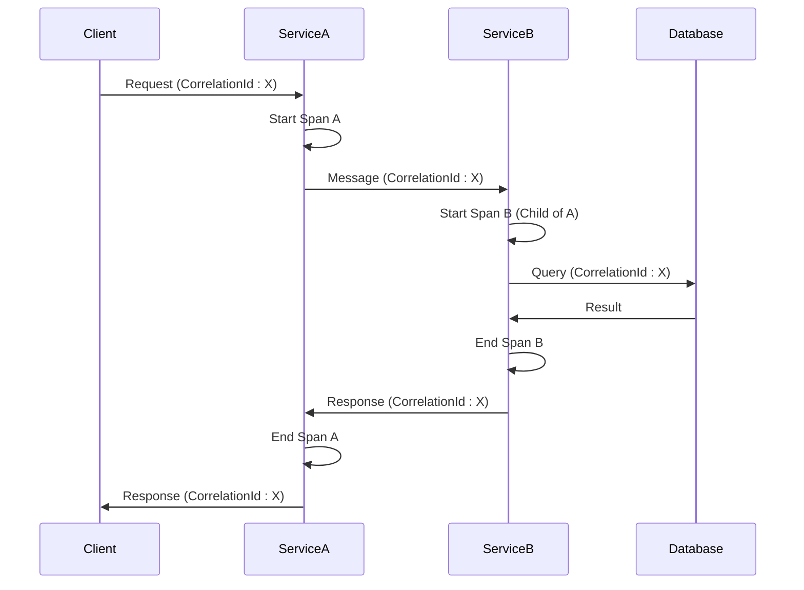
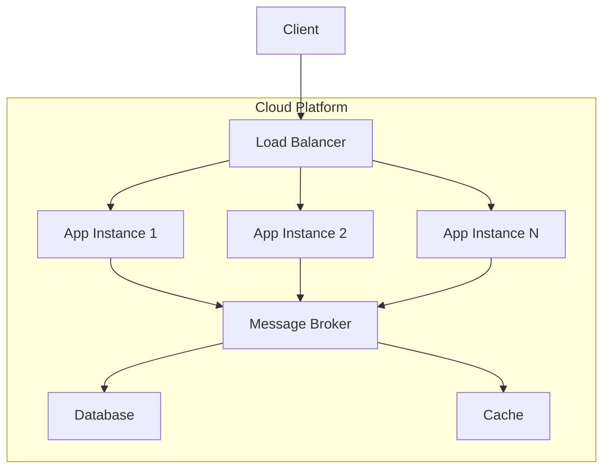

# Best Practices

<cite>
**Referenced Files in This Document**   
- [BEST_PRACTICES.md](file://docs/MessageBroker/BEST_PRACTICES.md)
- [TROUBLESHOOTING.md](file://docs/MessageBroker/TROUBLESHOOTING.md)
- [README.md](file://docs/MessageBroker/deployment/README.md)
- [PerformanceServiceCollectionExtensions.cs](file://src/Relay.Core/Performance/PerformanceServiceCollectionExtensions.cs)
- [SecurityPipelineBehavior.cs](file://src/Relay.Core/Security/Behaviors/SecurityPipelineBehavior.cs)
- [SlidingWindowRateLimiter.cs](file://src/Relay.Core/RateLimiting/Implementations/SlidingWindowRateLimiter.cs)
- [TransactionServiceCollectionExtensions.cs](file://src/Relay.Core/Transactions/TransactionServiceCollectionExtensions.cs)
- [OpenTelemetryTracingProvider.cs](file://src/Relay.Core/DistributedTracing/OpenTelemetryTracingProvider.cs)
- [RelayHealthCheck.cs](file://src/Relay.Core/Observability/RelayHealthCheck.cs)
</cite>

## Table of Contents
1. [Performance Guidelines](#performance-guidelines)
2. [Security Considerations](#security-considerations)
3. [Error Handling Strategies](#error-handling-strategies)
4. [Monitoring and Observability](#monitoring-and-observability)
5. [Scalability and Deployment Patterns](#scalability-and-deployment-patterns)
6. [Testing Strategies and Code Organization](#testing-strategies-and-code-organization)
7. [Common Anti-patterns and Solutions](#common-anti-patterns-and-solutions)
8. [Real-world Examples](#real-world-examples)

## Performance Guidelines

### Handler Design Recommendations
For optimal performance, handlers should be designed as lightweight and stateless components. The Relay framework supports both synchronous and asynchronous processing, but asynchronous handlers are recommended for I/O-bound operations to maximize throughput. Handlers should avoid blocking operations and use async/await patterns for database calls, HTTP requests, or other I/O operations. The framework's pipeline behavior system allows for cross-cutting concerns like caching, validation, and logging to be applied without adding complexity to individual handlers.



**Diagram sources**
- [SecurityPipelineBehavior.cs](file://src/Relay.Core/Security/Behaviors/SecurityPipelineBehavior.cs)

**Section sources**
- [BEST_PRACTICES.md](file://docs/MessageBroker/BEST_PRACTICES.md#performance-optimization)

### Pipeline Configuration
The Relay framework provides a comprehensive pipeline system that allows for the composition of multiple behaviors around message processing. For performance optimization, the order of pipeline behaviors should be carefully considered, with fast, lightweight behaviors (like validation) executed before more expensive ones (like database access). The framework supports custom pipeline behaviors that can be registered globally or applied selectively to specific handlers using attributes.

Performance optimization services are registered through the `AddRelayPerformanceOptimizations` method, which configures object pooling, buffer management, and telemetry context pooling to minimize memory allocations and garbage collection pressure. The framework provides different performance profiles that can be selected based on the application's requirements.



**Diagram sources**
- [SecurityPipelineBehavior.cs](file://src/Relay.Core/Security/Behaviors/SecurityPipelineBehavior.cs)
- [TransactionServiceCollectionExtensions.cs](file://src/Relay.Core/Transactions/TransactionServiceCollectionExtensions.cs)

**Section sources**
- [BEST_PRACTICES.md](file://docs/MessageBroker/BEST_PRACTICES.md#performance-optimization)
- [PerformanceServiceCollectionExtensions.cs](file://src/Relay.Core/Performance/PerformanceServiceCollectionExtensions.cs)

### Message Broker Usage
For high-throughput scenarios, the Relay framework supports batch processing to reduce the overhead of individual message operations. Batch size and flush intervals should be tuned based on message size and latency requirements. For small messages, larger batch sizes (500+) can be used with short flush intervals (100ms) for low latency. For large messages, smaller batch sizes (50-100) with longer flush intervals (1s) may be more appropriate to balance throughput and memory usage.

Connection pooling is critical for performance, especially in high-concurrency scenarios. The pool size should be configured based on the expected workload, with minimum and maximum pool sizes set appropriately. Monitoring pool metrics such as wait time and utilization can help identify configuration issues. The prefetch count should be optimized based on message processing time, with higher values (100+) for fast processing (<100ms) and lower values (1-10) for slow processing (>1s).

**Section sources**
- [BEST_PRACTICES.md](file://docs/MessageBroker/BEST_PRACTICES.md#performance-optimization)

## Security Considerations

### Authentication and Authorization
The Relay framework implements a comprehensive security model with both authentication and authorization capabilities. Authentication is typically handled through JWT tokens, with configuration for issuer and audience validation. The framework supports role-based access control with configurable permissions for different operations. Service accounts with limited permissions are recommended over shared credentials or user accounts.

Security is implemented through pipeline behaviors that intercept message processing to enforce security policies. The `SecurityPipelineBehavior` class handles multiple security concerns including permission validation, rate limiting, and audit logging. This behavior is automatically applied to all message handlers, ensuring consistent security enforcement across the application.



**Diagram sources**
- [SecurityPipelineBehavior.cs](file://src/Relay.Core/Security/Behaviors/SecurityPipelineBehavior.cs)

**Section sources**
- [BEST_PRACTICES.md](file://docs/MessageBroker/BEST_PRACTICES.md#security)
- [SecurityPipelineBehavior.cs](file://src/Relay.Core/Security/Behaviors/SecurityPipelineBehavior.cs)

### Data Encryption
Sensitive data should be encrypted both in transit and at rest. The framework supports message-level encryption using industry-standard algorithms like AES256. Encryption should be applied selectively to sensitive fields rather than entire messages to balance security and performance. The framework integrates with key management systems like Azure Key Vault for secure key storage and rotation.

Key rotation is supported with a grace period that allows for the coexistence of old and new keys during the transition period. This ensures that messages encrypted with the old key can still be decrypted while new messages are encrypted with the new key. The grace period should be long enough to ensure all in-flight messages are processed but not so long as to create security risks.

**Section sources**
- [BEST_PRACTICES.md](file://docs/MessageBroker/BEST_PRACTICES.md#security)

### Protection Against Common Vulnerabilities
The framework includes built-in protections against common security vulnerabilities. Input validation is enforced through the contract validation system, which can prevent injection attacks and other input-based vulnerabilities. Rate limiting protects against denial-of-service attacks by limiting the number of requests from individual clients or tenants.

Sensitive data should never be logged in plaintext. The framework encourages the use of structured logging with sensitive fields masked or omitted. Headers containing sensitive information like authorization tokens should be excluded from distributed tracing to prevent exposure in monitoring systems.

**Section sources**
- [BEST_PRACTICES.md](file://docs/MessageBroker/BEST_PRACTICES.md#security)

## Error Handling Strategies

### Robustness and Graceful Degradation
The Relay framework provides multiple mechanisms for ensuring robustness in the face of failures. Circuit breakers prevent cascading failures by temporarily stopping requests to failing services, allowing them time to recover. The circuit breaker configuration includes thresholds for failure count and rate, timeout periods, and success thresholds for closing the circuit.

Bulkhead isolation prevents resource exhaustion by limiting the number of concurrent operations. This ensures that a surge in one type of request doesn't consume all available resources and impact other operations. When the bulkhead is full, operations can either be rejected immediately or queued for later processing.

Poison message handling protects against messages that consistently fail to process. After a configurable number of failure attempts, such messages are moved to a poison queue for analysis rather than continuously failing and consuming resources. This allows the system to continue processing other messages while problematic ones are investigated.



**Diagram sources**
- [TROUBLESHOOTING.md](file://docs/MessageBroker/TROUBLESHOOTING.md#resilience-issues)

**Section sources**
- [BEST_PRACTICES.md](file://docs/MessageBroker/BEST_PRACTICES.md#resilience)
- [TROUBLESHOOTING.md](file://docs/MessageBroker/TROUBLESHOOTING.md#resilience-issues)

### Retry Mechanisms
The framework supports configurable retry policies with exponential backoff to handle transient failures. The retry configuration includes the maximum number of attempts, initial delay, and whether to use exponential backoff. For example, a configuration with 5 maximum attempts and exponential backoff would retry after 2s, 4s, 8s, 16s, and 32s.

Retry decisions should consider the nature of the failure. Transient exceptions (like network timeouts) should trigger retries with requeuing, while permanent exceptions (like validation errors) should not be retried. For unknown errors, the delivery count can be checked to determine whether to retry or give up after a certain number of attempts.

**Section sources**
- [BEST_PRACTICES.md](file://docs/MessageBroker/BEST_PRACTICES.md#reliability-patterns)

## Monitoring and Observability

### Metrics Collection
The framework integrates with Prometheus for metrics collection, exposing key performance indicators such as message throughput, processing latency, error rates, queue depth, and connection pool utilization. These metrics should be monitored with appropriate alerts configured for anomalous conditions.

Key metrics to monitor include:
- Message throughput (messages/second)
- Processing latency (p50, p95, p99)
- Error rate (should be < 1%)
- Queue depth (high depth may indicate processing bottlenecks)
- Connection pool utilization (low availability indicates pool exhaustion)
- Circuit breaker state (open state indicates service issues)
- Duplicate message rate (high rate may indicate upstream issues)
- Backpressure status (active backpressure indicates overload)



**Diagram sources**
- [README.md](file://docs/MessageBroker/deployment/README.md)

**Section sources**
- [BEST_PRACTICES.md](file://docs/MessageBroker/BEST_PRACTICES.md#observability)

### Distributed Tracing
Distributed tracing is implemented using OpenTelemetry, providing end-to-end visibility into message flows across services. Sampling rates should be configured appropriately for different environments, with 100% sampling in development and lower rates (10%) in production to balance visibility and performance overhead.

Custom span attributes can be added to provide additional context, such as business identifiers (order ID, customer tier) and performance metrics. Sensitive headers should be excluded from tracing to prevent exposure of confidential information. Correlation IDs should be used throughout the system to link related operations across service boundaries.



**Diagram sources**
- [OpenTelemetryTracingProvider.cs](file://src/Relay.Core/DistributedTracing/OpenTelemetryTracingProvider.cs)

**Section sources**
- [BEST_PRACTICES.md](file://docs/MessageBroker/BEST_PRACTICES.md#observability)
- [OpenTelemetryTracingProvider.cs](file://src/Relay.Core/DistributedTracing/OpenTelemetryTracingProvider.cs)

### Logging Practices
Structured logging with consistent formatting is recommended for better observability. Log levels should be used appropriately:
- Debug: Detailed information for debugging
- Information: General operational messages
- Warning: Potentially harmful situations
- Error: Error events that might still allow the application to continue
- Critical: Severe errors that might cause the application to abort

Logs should include relevant context such as message type, message ID, tenant ID, and processing duration. Sensitive data should be masked or omitted from logs to comply with security and privacy requirements.

**Section sources**
- [BEST_PRACTICES.md](file://docs/MessageBroker/BEST_PRACTICES.md#observability)

## Scalability and Deployment Patterns

### Deployment Environments
The Relay framework supports multiple deployment patterns for different environments. For development and small-scale production, Docker Compose provides a simple way to run the application with all dependencies. For enterprise-scale production, Kubernetes with Helm charts offers advanced features like auto-scaling, pod disruption budgets, and service mesh integration.

Azure and AWS deployments are supported through platform-specific services like Azure Container Apps, AKS, Amazon ECS, and EKS. These managed services provide additional features like automatic scaling, integrated monitoring, and simplified management.



**Diagram sources**
- [README.md](file://docs/MessageBroker/deployment/README.md)

**Section sources**
- [README.md](file://docs/MessageBroker/deployment/README.md)

### Blue-Green and Rolling Updates
Zero-downtime deployments are supported through blue-green deployment and rolling update patterns. Blue-green deployments use consumer groups to allow parallel processing by old and new versions, enabling instant cutover with the ability to quickly roll back if issues are detected.

Rolling updates require careful version compatibility management. Message versioning should be implemented with version headers, and consumers should be able to handle multiple message versions. Feature flags can be used to gradually enable new functionality, allowing for controlled rollouts and quick disablement if problems occur.

**Section sources**
- [BEST_PRACTICES.md](file://docs/MessageBroker/BEST_PRACTICES.md#deployment)

## Testing Strategies and Code Organization

### Testing Approaches
The framework encourages comprehensive testing at multiple levels. Unit tests should verify the business logic within handlers, while integration tests validate the interaction between handlers and external systems like databases and message brokers. The framework provides testing utilities in the `Relay.Core.Testing` package to simplify test setup and verification.

Scenario-based testing is recommended to validate complex workflows and error conditions. This includes testing retry logic, circuit breaker behavior, and poison message handling. Performance testing should be conducted to validate throughput and latency under expected loads, with monitoring of resource utilization.

**Section sources**
- [BEST_PRACTICES.md](file://docs/MessageBroker/BEST_PRACTICES.md)
- [TROUBLESHOOTING.md](file://docs/MessageBroker/TROUBLESHOOTING.md)

### Code Organization
Code should be organized around business capabilities rather than technical layers. Handlers should be grouped by feature area, with related requests, responses, and validators colocated. The pipeline behavior system allows cross-cutting concerns to be implemented in reusable components rather than duplicated across handlers.

Configuration should be separated by environment, with development configurations enabling more verbose logging and tracing, while production configurations optimize for performance and security. Feature flags can be used to control the activation of new functionality, enabling gradual rollouts and easier rollback if needed.

**Section sources**
- [BEST_PRACTICES.md](file://docs/MessageBroker/BEST_PRACTICES.md)

## Common Anti-patterns and Solutions

### Dual-write Problem
The dual-write anti-pattern occurs when data is written to a database and then published to a message broker in separate operations, creating a risk of inconsistency if one operation succeeds and the other fails. This is solved by using the Outbox pattern, which stores messages in the same transaction as the business data, ensuring atomicity.

```csharp
// ✅ Good: Transactional consistency with Outbox pattern
using var transaction = await _dbContext.Database.BeginTransactionAsync();
try
{
    // Save entity
    await _dbContext.Orders.AddAsync(order);
    await _dbContext.SaveChangesAsync();
    
    // Store in outbox (same transaction)
    await _outboxStore.StoreAsync(new OutboxMessage
    {
        MessageType = typeof(OrderCreatedEvent).Name,
        Payload = JsonSerializer.SerializeToUtf8Bytes(orderEvent)
    });
    
    await transaction.CommitAsync();
}
```

**Section sources**
- [BEST_PRACTICES.md](file://docs/MessageBroker/BEST_PRACTICES.md#reliability-patterns)

### Connection Leaks
Connection pool exhaustion can occur due to connection leaks when connections are not properly disposed. This is prevented by using async using statements or ensuring that connections are disposed in finally blocks. The framework's connection pooling system includes metrics to monitor pool utilization and detect potential leaks.

**Section sources**
- [TROUBLESHOOTING.md](file://docs/MessageBroker/TROUBLESHOOTING.md#connection-pool-issues)

### Over-encryption
Encrypting all message content adds unnecessary overhead and can impact performance. Instead, encryption should be applied selectively to sensitive fields using attributes. This balances security requirements with performance considerations.

**Section sources**
- [BEST_PRACTICES.md](file://docs/MessageBroker/BEST_PRACTICES.md#security)

## Real-world Examples

### E-commerce Order Processing
In an e-commerce system, when an order is created, the Outbox pattern ensures that the order is saved to the database and the order creation event is published atomically. The event is processed by multiple services (inventory, shipping, billing) using the Inbox pattern to ensure idempotency. Circuit breakers protect downstream services, and distributed tracing provides visibility into the entire order fulfillment process.

### Financial Transaction System
A financial system uses strict transaction management with explicit isolation levels to ensure data consistency. Rate limiting protects against abuse, with different limits for different customer tiers. Sensitive financial data is encrypted at rest, and comprehensive audit logging records all access and modifications. The system uses high-frequency monitoring with alerts for any anomalies in transaction patterns.

**Section sources**
- [BEST_PRACTICES.md](file://docs/MessageBroker/BEST_PRACTICES.md)