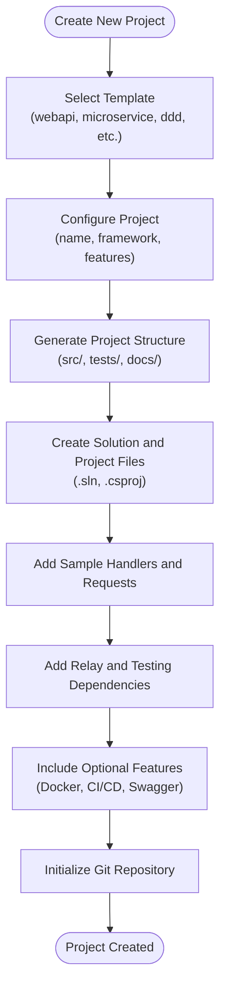
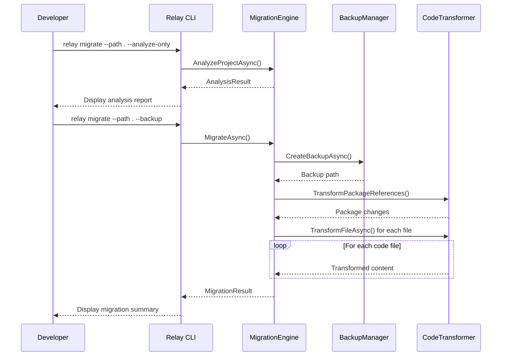
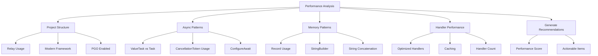
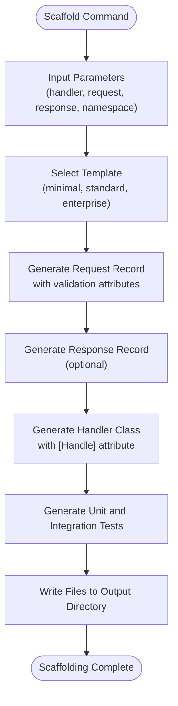

# CLI Tool

<cite>
**Referenced Files in This Document**   
- [Program.cs](file://tools/Relay.CLI/Program.cs)
- [README.md](file://tools/Relay.CLI/README.md)
- [NewCommand.cs](file://tools/Relay.CLI/Commands/NewCommand.cs)
- [InitCommand.cs](file://tools/Relay.CLI/Commands/InitCommand.cs)
- [DoctorCommand.cs](file://tools/Relay.CLI/Commands/DoctorCommand.cs)
- [MigrateCommand.cs](file://tools/Relay.CLI/Commands/MigrateCommand.cs)
- [MigrateCommandBuilder.cs](file://tools/Relay.CLI/Commands/MigrateCommandBuilder.cs)
- [MigrationEngine.cs](file://tools/Relay.CLI/Migration/MigrationEngine.cs)
- [OptimizeCommand.cs](file://tools/Relay.CLI/Commands/OptimizeCommand.cs)
- [AnalyzeCommand.cs](file://tools/Relay.CLI/Commands/AnalyzeCommand.cs)
- [ScaffoldCommand.cs](file://tools/Relay.CLI/Commands/ScaffoldCommand.cs)
- [PluginCommand.cs](file://tools/Relay.CLI/Commands/PluginCommand.cs)
- [PluginManager.cs](file://tools/Relay.CLI/Plugins/PluginManager.cs)
- [BenchmarkCommand.cs](file://tools/Relay.CLI/Commands/BenchmarkCommand.cs)
- [PerformanceCommand.cs](file://tools/Relay.CLI/Commands/PerformanceCommand.cs)
</cite>

## Table of Contents
1. [Introduction](#introduction)
2. [Project Scaffolding](#project-scaffolding)
3. [Migration Tools](#migration-tools)
4. [Performance Analysis](#performance-analysis)
5. [Code Generation](#code-generation)
6. [Plugin System](#plugin-system)
7. [Command-Line Interface](#command-line-interface)
8. [Development Workflows](#development-workflows)
9. [Troubleshooting](#troubleshooting)

## Introduction
The Relay CLI is a comprehensive developer toolset designed to streamline the development, optimization, and maintenance of applications built with the Relay framework. As a high-performance alternative to MediatR, Relay provides compile-time source generation and zero-overhead dispatch capabilities. The CLI tool enhances developer productivity through automated project scaffolding, intelligent code analysis, performance optimization, and seamless migration capabilities. This documentation covers all aspects of the CLI tool, including its core commands, integration into development workflows, and extension through plugins.

**Section sources**
- [README.md](file://tools/Relay.CLI/README.md#L1-L388)
- [Program.cs](file://tools/Relay.CLI/Program.cs#L1-L101)

## Project Scaffolding
The Relay CLI provides robust project scaffolding capabilities that enable rapid setup of new projects with recommended configurations. The `init` and `new` commands create complete project structures with appropriate directory layouts, configuration files, and sample code. The scaffolding system supports multiple templates for different architectural patterns including Clean Architecture, Microservices, Domain-Driven Design, CQRS+Event Sourcing, and Modular Monoliths.

The `init` command creates a new Relay project with complete scaffolding, allowing customization through various options such as project name, template selection, target framework, and inclusion of Docker or CI/CD configurations. The `new` command provides a more extensive template system with over 10 production-ready templates for different application types including Web APIs, Microservices, GraphQL APIs, gRPC services, Serverless functions, and mobile applications.

When creating a new project, the CLI generates the complete solution structure including source code directories, test projects, documentation folders, and build scripts. It automatically creates the solution file (.sln), project files (.csproj), and sample implementation code with handlers, requests, and responses. The scaffolding process also includes configuration for modern .NET features such as nullable reference types, implicit usings, and latest C# language versions.



**Diagram sources**
- [InitCommand.cs](file://tools/Relay.CLI/Commands/InitCommand.cs#L14-L557)
- [NewCommand.cs](file://tools/Relay.CLI/Commands/NewCommand.cs#L8-L706)

**Section sources**
- [InitCommand.cs](file://tools/Relay.CLI/Commands/InitCommand.cs#L14-L557)
- [NewCommand.cs](file://tools/Relay.CLI/Commands/NewCommand.cs#L8-L706)
- [README.md](file://tools/Relay.CLI/README.md#L20-L244)

## Migration Tools
The Relay CLI includes comprehensive migration tools that assist in upgrading from previous versions or migrating from other frameworks like MediatR. The `migrate` command provides an automated migration process that analyzes existing projects, transforms code, and updates dependencies to transition from MediatR to Relay with minimal manual intervention.

The migration process begins with analysis of the existing project to identify MediatR usage patterns, handler implementations, and pipeline behaviors. The CLI creates a backup of the original codebase before making any changes, ensuring that the migration can be safely rolled back if needed. The migration engine then transforms package references by removing MediatR dependencies and adding Relay.Core, followed by code transformation that updates handler interfaces, request/response patterns, and registration methods.

The migration tool supports both automated and interactive modes. In automated mode, it applies all transformations without user intervention, while interactive mode prompts for confirmation before each change, allowing developers to review and approve modifications. The tool also provides dry-run and preview options to show what changes would be made without actually applying them, enabling developers to assess the migration impact before proceeding.



**Diagram sources**
- [MigrateCommand.cs](file://tools/Relay.CLI/Commands/MigrateCommand.cs#L8-L14)
- [MigrationEngine.cs](file://tools/Relay.CLI/Migration/MigrationEngine.cs#L12-L907)
- [MigrateCommandBuilder.cs](file://tools/Relay.CLI/Commands/MigrateCommandBuilder.cs)

**Section sources**
- [MigrateCommand.cs](file://tools/Relay.CLI/Commands/MigrateCommand.cs#L8-L14)
- [MigrationEngine.cs](file://tools/Relay.CLI/Migration/MigrationEngine.cs#L12-L907)
- [README.md](file://tools/Relay.CLI/README.md#L48-L69)

## Performance Analysis
The Relay CLI provides sophisticated performance analysis features that identify optimization opportunities in the codebase. The `analyze` and `performance` commands examine various aspects of the application including async patterns, memory usage, handler performance, and build configurations to generate actionable recommendations for improvement.

The performance analysis evaluates several key metrics such as the ratio of ValueTask to Task usage, presence of cancellation tokens in async methods, usage of immutable records versus classes, and implementation of optimized handlers with the [Handle] attribute. It also checks for modern .NET framework usage, profile-guided optimization (PGO) settings, and other build-time performance enhancements. The analysis generates a performance score from 0-100 based on these factors, providing a quantitative measure of the codebase's optimization level.

The `benchmark` command runs comprehensive performance tests comparing Relay implementations against MediatR and direct method calls. It measures requests per second, average execution time, memory allocation, and other performance metrics under various conditions including different thread counts and iteration volumes. The benchmark results can be output in multiple formats including console, JSON, HTML, and CSV for detailed analysis and reporting.



**Diagram sources**
- [AnalyzeCommand.cs](file://tools/Relay.CLI/Commands/AnalyzeCommand.cs#L8-L107)
- [PerformanceCommand.cs](file://tools/Relay.CLI/Commands/PerformanceCommand.cs#L11-L501)
- [BenchmarkCommand.cs](file://tools/Relay.CLI/Commands/BenchmarkCommand.cs#L11-L573)

**Section sources**
- [AnalyzeCommand.cs](file://tools/Relay.CLI/Commands/AnalyzeCommand.cs#L8-L107)
- [PerformanceCommand.cs](file://tools/Relay.CLI/Commands/PerformanceCommand.cs#L11-L501)
- [BenchmarkCommand.cs](file://tools/Relay.CLI/Commands/BenchmarkCommand.cs#L11-L573)
- [README.md](file://tools/Relay.CLI/README.md#L129-L147)

## Code Generation
The Relay CLI offers powerful code generation capabilities that automate repetitive tasks and ensure consistency across the codebase. The `scaffold` command generates boilerplate code for handlers, requests, responses, and associated tests based on specified parameters. This feature significantly reduces the time required to implement new functionality while maintaining standardized patterns and best practices.

The code generation system supports multiple templates (standard, minimal, enterprise) that determine the level of detail and features included in the generated code. For example, the enterprise template includes comprehensive logging, error handling, and performance comments, while the minimal template provides a concise implementation. The generated code includes proper XML documentation, validation attributes, and follows Relay framework conventions such as using records for immutable data transfer objects and ValueTask for asynchronous operations.

In addition to handler scaffolding, the CLI can generate various utility components through the `generate` command. This includes documentation, configuration files, benchmarking code, and other project artifacts. The code generation system is extensible through plugins, allowing teams to create custom templates and generators tailored to their specific architectural patterns and coding standards.



**Diagram sources**
- [ScaffoldCommand.cs](file://tools/Relay.CLI/Commands/ScaffoldCommand.cs#L7-L546)
- [README.md](file://tools/Relay.CLI/README.md#L113-L128)

**Section sources**
- [ScaffoldCommand.cs](file://tools/Relay.CLI/Commands/ScaffoldCommand.cs#L7-L546)
- [README.md](file://tools/Relay.CLI/README.md#L113-L128)

## Plugin System
The Relay CLI features a robust plugin system that allows extension of its functionality. The `plugin` command provides a complete interface for managing plugins, including installation, uninstallation, updating, and creation of new plugins. This extensibility model enables the community and organizations to enhance the CLI with custom commands, integrations, and tools specific to their needs.

Plugins are implemented as .NET assemblies with a class that implements the `IRelayPlugin` interface and is decorated with the `RelayPlugin` attribute. The plugin system uses isolated assembly loading contexts to prevent version conflicts and ensure stability. Each plugin can define its own commands, options, and execution logic while integrating with the CLI's logging, configuration, and error handling systems.

The plugin manager handles security validation, dependency resolution, and lifecycle management for plugins. It supports both local and global plugin installation, with global plugins available across all projects and local plugins specific to a directory. The system includes health monitoring and automatic restart capabilities to maintain plugin reliability. Plugins can be distributed through NuGet packages, local directories, or ZIP files, making distribution and installation straightforward.

```mermaid
classDiagram
class IRelayPlugin {
<<interface>>
+string Name
+string Version
+string Description
+Task<bool> InitializeAsync(IPluginContext context)
+Task<int> ExecuteAsync(string[] args)
+Task CleanupAsync()
}
class PluginManager {
-Dictionary<string, LoadedPlugin> _loadedPlugins
-string _pluginsDirectory
-PluginSecurityValidator _securityValidator
-PluginHealthMonitor _healthMonitor
+Task<List<PluginInfo>> GetInstalledPluginsAsync()
+Task<IRelayPlugin?> LoadPluginAsync(string name, IPluginContext context)
+Task<bool> UnloadPluginAsync(string name)
+Task<PluginInstallResult> InstallPluginAsync(string source, string? version, bool global)
}
class PluginManager *-- PluginSecurityValidator
class PluginManager *-- PluginHealthMonitor
class PluginManager *-- IRelayPlugin
class PluginSecurityValidator {
+Task<SecurityValidationResult> ValidatePluginAsync(string assemblyPath, PluginInfo pluginInfo)
+PluginPermissions GetPluginPermissions(string pluginName)
}
class PluginHealthMonitor {
+bool IsHealthy(string pluginName)
+void RecordSuccess(string pluginName)
+void RecordFailure(string pluginName, Exception ex)
+bool AttemptRestart(string pluginName)
}
class IPluginContext {
<<interface>>
+IPluginLogger Logger
+IConfiguration Configuration
+IFileSystem FileSystem
}
class PluginInfo {
+string Name
+string Version
+string Description
+string[] Authors
+string[] Tags
+string Path
+bool IsGlobal
+bool Enabled
+PluginManifest Manifest
}
class PluginManifest {
+string Name
+string Version
+string Description
+string[] Authors
+string[] Tags
+string MinimumRelayVersion
+Dictionary~string, string~ Dependencies
+string Repository
}
PluginManager --> PluginInfo : creates
PluginManager --> PluginManifest : reads
PluginSecurityValidator --> PluginInfo : validates
PluginHealthMonitor --> IRelayPlugin : monitors
```

**Diagram sources**
- [PluginCommand.cs](file://tools/Relay.CLI/Commands/PluginCommand.cs#L6-L530)
- [PluginManager.cs](file://tools/Relay.CLI/Plugins/PluginManager.cs#L9-L678)
- [README.md](file://tools/Relay.CLI/README.md#L316-L367)

**Section sources**
- [PluginCommand.cs](file://tools/Relay.CLI/Commands/PluginCommand.cs#L6-L530)
- [PluginManager.cs](file://tools/Relay.CLI/Plugins/PluginManager.cs#L9-L678)
- [README.md](file://tools/Relay.CLI/README.md#L316-L367)

## Command-Line Interface
The Relay CLI provides a comprehensive command-line interface with numerous commands and options for various development tasks. The main commands include `init`, `new`, `migrate`, `scaffold`, `analyze`, `optimize`, `benchmark`, `performance`, `doctor`, `plugin`, and `ai`, each serving specific purposes in the development workflow.

The CLI uses System.CommandLine for parsing and validation, providing consistent option handling, help text generation, and error reporting across all commands. Most commands support common options such as `--path` to specify the project directory, `--verbose` for detailed output, and `--output` to specify output locations. The interface is designed to be intuitive and discoverable, with comprehensive help available through the `--help` option for each command.

The CLI outputs information in a user-friendly format using Spectre.Console for rich text formatting, progress indicators, tables, and panels. This enhances readability and provides visual feedback during long-running operations. Results can be output in various formats including console, JSON, HTML, and Markdown, facilitating integration with other tools and reporting systems.

**Table of CLI Commands and Options**

| Command | Description | Key Options |
|---------|-------------|-----------|
| `init` | Initialize new Relay project | `--name`, `--template`, `--framework`, `--output`, `--git`, `--docker`, `--ci` |
| `new` | Create project from template | `--name`, `--template`, `--features`, `--output`, `--broker`, `--database`, `--auth` |
| `migrate` | Migrate from MediatR to Relay | `--path`, `--analyze-only`, `--dry-run`, `--preview`, `--backup`, `--format` |
| `scaffold` | Generate handler and request code | `--handler`, `--request`, `--response`, `--namespace`, `--include-tests` |
| `analyze` | Analyze project for optimizations | `--path`, `--include-tests`, `--exclude` |
| `optimize` | Apply performance optimizations | `--path`, `--target`, `--aggressive`, `--dry-run`, `--backup` |
| `benchmark` | Run performance benchmarks | `--iterations`, `--format`, `--output`, `--threads` |
| `performance` | Analyze performance characteristics | `--path`, `--report`, `--detailed`, `--output` |
| `doctor` | Health check for Relay projects | `--path`, `--verbose`, `--fix` |
| `plugin` | Manage CLI plugins | `list`, `search`, `install`, `uninstall`, `update`, `info`, `create` |
| `ai` | AI-powered analysis and optimization | `analyze`, `optimize`, `predict`, `learn`, `insights` |

**Section sources**
- [Program.cs](file://tools/Relay.CLI/Program.cs#L24-L43)
- [README.md](file://tools/Relay.CLI/README.md#L18-L244)

## Development Workflows
The Relay CLI can be integrated into various development workflows and CI/CD pipelines to ensure consistent code quality and performance standards. The `pipeline` command combines multiple operations into a complete development pipeline that can be run as a single command, making it ideal for automation in build systems.

For local development, developers can use the CLI to quickly create new projects, analyze existing codebases, and apply optimizations. The typical workflow involves initializing a project with `init`, running `doctor` to check for issues, using `scaffold` to generate new components, and applying `optimize` to improve performance. The `analyze` and `performance` commands help identify areas for improvement, while `benchmark` provides quantitative performance metrics.

In CI/CD pipelines, the CLI can be used to enforce quality gates by running `doctor` to verify project health, `analyze` to check for optimization opportunities, and `benchmark` to ensure performance requirements are met. The ability to output results in JSON and other machine-readable formats makes it easy to integrate with build servers and reporting tools. The `--ci` option in the `init` command automatically includes CI/CD configuration files, streamlining pipeline setup.

**Table of Common Workflows**

| Workflow | Commands | Purpose |
|---------|---------|--------|
| Quick Start | `init`, `pipeline` | Rapid project setup and optimization |
| Migration | `migrate`, `doctor`, `optimize` | Transition from MediatR to Relay |
| Component Creation | `scaffold`, `analyze`, `optimize` | Generate and optimize new functionality |
| Performance Tuning | `analyze`, `optimize`, `benchmark` | Identify and apply performance improvements |
| CI/CD Integration | `doctor`, `analyze`, `benchmark` | Quality gates in automated pipelines |
| Plugin Development | `plugin create`, `plugin install` | Create and test custom extensions |

**Section sources**
- [README.md](file://tools/Relay.CLI/README.md#L266-L314)
- [Program.cs](file://tools/Relay.CLI/Program.cs#L34-L35)

## Troubleshooting
Common issues with the Relay CLI typically involve installation problems, permission errors, or compatibility issues with existing projects. When encountering issues, the first step is to check the CLI version using `relay --version` and ensure it matches the latest release. Installation issues can often be resolved by clearing the NuGet package cache and reinstalling the tool.

Permission errors when writing files can occur when the CLI lacks write access to the target directory. This can be resolved by running the command with appropriate permissions or specifying a different output directory with the `--output` option. When migrating existing projects, analysis failures may occur due to syntax errors or unsupported code patterns; these can be addressed by fixing the underlying code issues before attempting migration.

For debugging purposes, most commands support verbose output with the `--verbose` option, which provides detailed information about the operations being performed. The `doctor` command can be used to diagnose project health issues, while the `--dry-run` option in commands like `migrate` and `optimize` allows previewing changes without applying them. If issues persist, the CLI's detailed error messages and stack traces can help identify the root cause.

**Section sources**
- [README.md](file://tools/Relay.CLI/README.md#L376-L388)
- [DoctorCommand.cs](file://tools/Relay.CLI/Commands/DoctorCommand.cs#L16-L493)