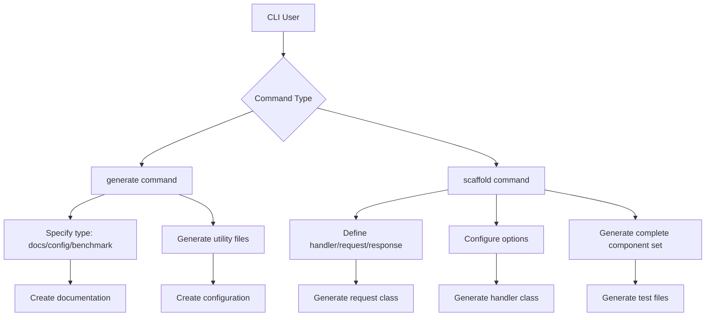
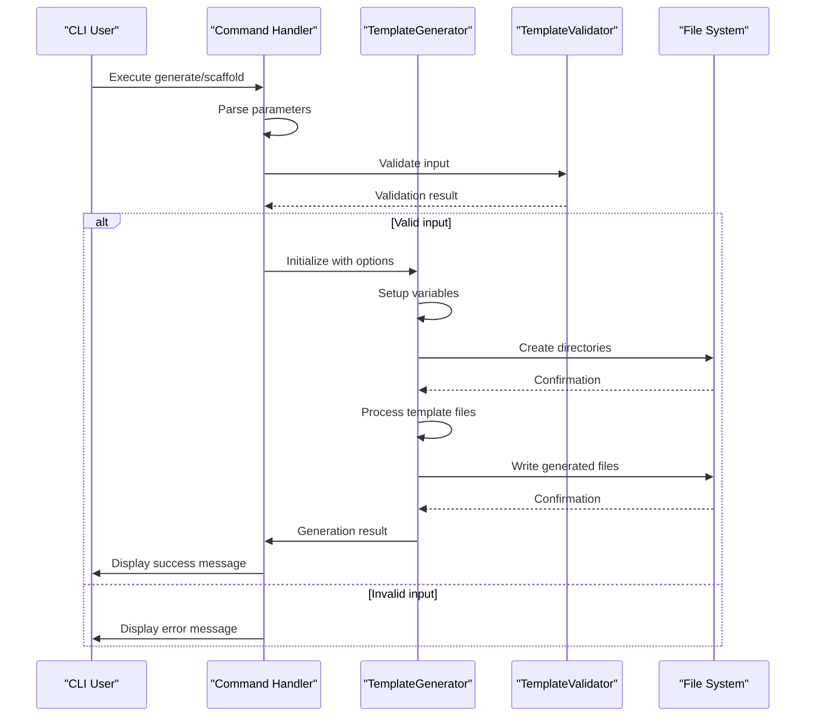
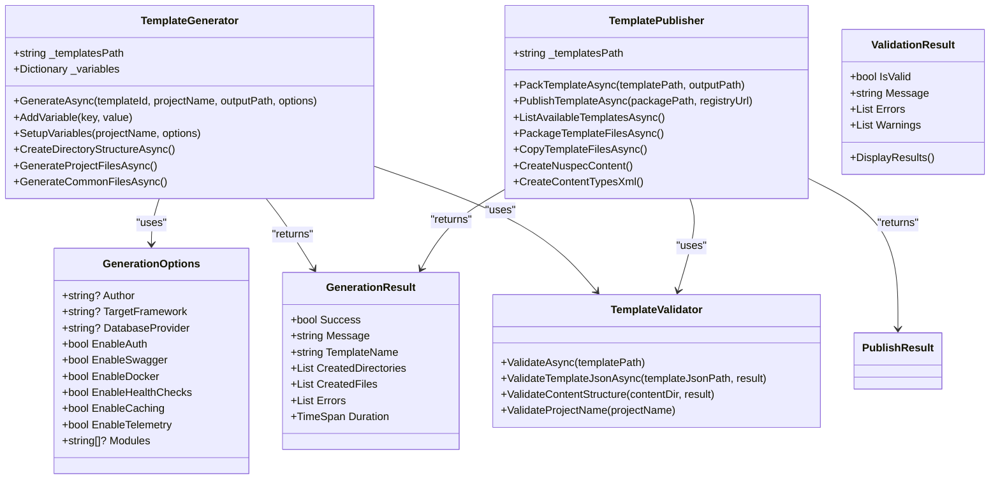
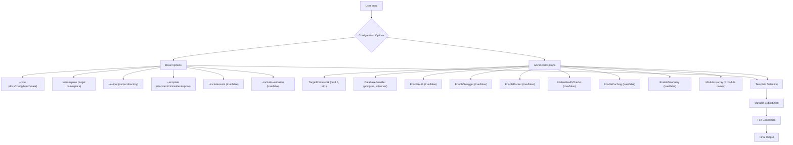
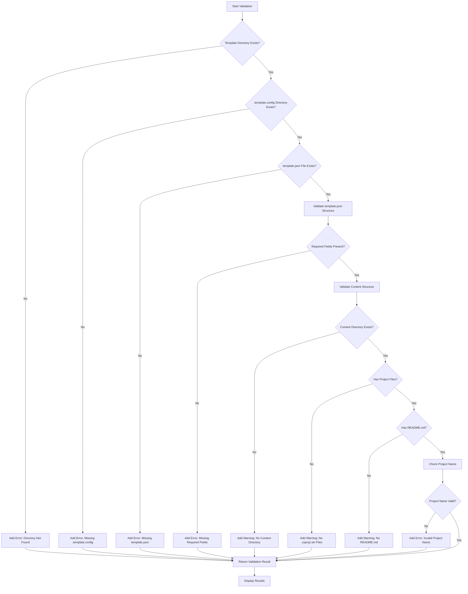
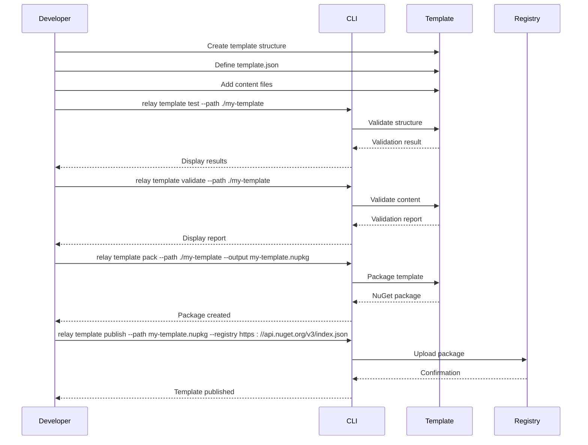

# Code Generation

<cite>
**Referenced Files in This Document**   
- [GenerateCommand.cs](file://tools/Relay.CLI/Commands/GenerateCommand.cs)
- [ScaffoldCommand.cs](file://tools/Relay.CLI/Commands/ScaffoldCommand.cs)
- [TemplateGenerator.cs](file://tools/Relay.CLI/TemplateEngine/TemplateGenerator.cs)
- [GenerationOptions.cs](file://tools/Relay.CLI/TemplateEngine/GenerationOptions.cs)
- [ValidationResult.cs](file://tools/Relay.CLI/TemplateEngine/ValidationResult.cs)
- [TemplateValidator.cs](file://tools/Relay.CLI/TemplateEngine/TemplateValidator.cs)
- [TemplatePublisher.cs](file://tools/Relay.CLI/TemplateEngine/TemplatePublisher.cs)
- [GenerationResult.cs](file://tools/Relay.CLI/TemplateEngine/GenerationResult.cs)
- [TemplateInfo.cs](file://tools/Relay.CLI/Commands/Models/Template/TemplateInfo.cs)
- [README.md](file://tools/Relay.CLI/Templates/README.md)
- [Program.cs](file://tools/Relay.CLI/Program.cs)
</cite>

## Table of Contents
1. [Introduction](#introduction)
2. [Core Commands Overview](#core-commands-overview)
3. [Code Generation Workflow](#code-generation-workflow)
4. [Template System Architecture](#template-system-architecture)
5. [Configuration Options](#configuration-options)
6. [Template Validation Process](#template-validation-process)
7. [Custom Template Development](#custom-template-development)
8. [Troubleshooting Guide](#troubleshooting-guide)
9. [Conclusion](#conclusion)

## Introduction

The Relay CLI provides a comprehensive code generation system designed to automate repetitive development tasks and accelerate project setup. This system centers around two primary commands: `generate` and `scaffold`, which work in conjunction with a sophisticated template engine to create production-ready code structures. The code generation framework enables developers to quickly create handlers, requests, responses, and associated test files while maintaining consistency across projects.

The system follows a modular architecture where templates define the structure and content of generated code, configuration options control the generation process, and validation components ensure quality standards are met. This documentation provides a detailed exploration of the implementation, workflow, and extensibility of the code generation system, making it accessible to both beginners and experienced developers.

## Core Commands Overview

The Relay CLI implements two primary commands for code generation: `generate` and `scaffold`. These commands serve different but complementary purposes in the development workflow.

The `generate` command focuses on creating auxiliary components and utilities that support the main application. It accepts a `--type` parameter to specify what should be generated, with supported types including documentation, configuration files, and benchmark templates. The command creates these files in the specified output directory, providing quick access to standardized templates for common development tasks.

The `scaffold` command is more comprehensive, designed to create complete component sets including handlers, requests, and tests. It accepts multiple parameters such as `--handler`, `--request`, and `--response` to define the components to be created. Additional options like `--namespace`, `--output`, and `--template` allow for customization of the generated code. The command creates a cohesive set of files that work together, complete with appropriate namespaces, dependencies, and implementation patterns.

**Diagram sources**
- [GenerateCommand.cs](file://tools/Relay.CLI/Commands/GenerateCommand.cs#L6-L114)
- [ScaffoldCommand.cs](file://tools/Relay.CLI/Commands/ScaffoldCommand.cs#L7-L546)

**Section sources**
- [GenerateCommand.cs](file://tools/Relay.CLI/Commands/GenerateCommand.cs#L6-L114)
- [ScaffoldCommand.cs](file://tools/Relay.CLI/Commands/ScaffoldCommand.cs#L7-L546)

## Code Generation Workflow

The code generation process in Relay CLI follows a structured workflow that ensures consistent and reliable output. This workflow begins with command execution and progresses through template selection, parameter substitution, file creation, and final validation.

When a user executes a generation command, the system first parses the provided parameters and validates their correctness. For the `scaffold` command, this includes verifying that required parameters like `--handler` and `--request` are present. The system then determines which template to use based on the specified options, with a default template applied if none is explicitly provided.

The template generator processes the selected template by substituting variables with the provided parameter values. This includes replacing placeholders for class names, namespaces, and other configurable elements. The generator creates the necessary directory structure before writing the generated files to disk. Each file is created with appropriate content based on the template and configuration options.

After file creation, the system provides feedback to the user through a progress indicator and success message. The feedback includes a summary of created files and next steps for the developer. This comprehensive workflow ensures that code generation is not only automated but also transparent and user-friendly.

**Diagram sources**
- [TemplateGenerator.cs](file://tools/Relay.CLI/TemplateEngine/TemplateGenerator.cs#L6-L831)
- [ScaffoldCommand.cs](file://tools/Relay.CLI/Commands/ScaffoldCommand.cs#L7-L546)

**Section sources**
- [TemplateGenerator.cs](file://tools/Relay.CLI/TemplateEngine/TemplateGenerator.cs#L6-L831)
- [ScaffoldCommand.cs](file://tools/Relay.CLI/Commands/ScaffoldCommand.cs#L7-L546)

## Template System Architecture

The template system in Relay CLI is built around several key components that work together to provide a flexible and robust code generation capability. At the core of this system is the `TemplateGenerator` class, which orchestrates the entire generation process.

The `TemplateGenerator` works with `GenerationOptions` to control various aspects of code generation. These options include settings like target framework, database provider, and feature flags for authentication, Swagger, Docker, and other capabilities. The generator uses these options to customize the output, creating project structures that match the specified requirements.

Templates are organized in a hierarchical structure with metadata defined in `template.json` files within `.template.config` directories. Each template contains content files that serve as the basis for generated code. The system supports multiple template types such as `relay-webapi`, `relay-microservice`, and `relay-ddd`, each designed for specific architectural patterns.

The `TemplatePublisher` component enables the packaging and distribution of templates as NuGet packages. This allows teams to share custom templates across projects and organizations. The publishing process validates templates, creates appropriate package structures, and prepares them for distribution to NuGet registries.

**Diagram sources**
- [TemplateGenerator.cs](file://tools/Relay.CLI/TemplateEngine/TemplateGenerator.cs#L6-L831)
- [GenerationOptions.cs](file://tools/Relay.CLI/TemplateEngine/GenerationOptions.cs#L3-L16)
- [TemplatePublisher.cs](file://tools/Relay.CLI/TemplateEngine/TemplatePublisher.cs#L6-L384)
- [TemplateValidator.cs](file://tools/Relay.CLI/TemplateEngine/TemplateValidator.cs#L6-L188)
- [GenerationResult.cs](file://tools/Relay.CLI/TemplateEngine/GenerationResult.cs#L3-L13)
- [ValidationResult.cs](file://tools/Relay.CLI/TemplateEngine/ValidationResult.cs#L3-L54)

**Section sources**
- [TemplateGenerator.cs](file://tools/Relay.CLI/TemplateEngine/TemplateGenerator.cs#L6-L831)
- [GenerationOptions.cs](file://tools/Relay.CLI/TemplateEngine/GenerationOptions.cs#L3-L16)
- [TemplatePublisher.cs](file://tools/Relay.CLI/TemplateEngine/TemplatePublisher.cs#L6-L384)

## Configuration Options

The code generation system in Relay CLI provides extensive configuration options that allow developers to customize the output to match their specific requirements. These options are primarily accessed through the `GenerationOptions` class and various command-line parameters.

Key configuration options include:
- `--type`: Specifies the type of generation (docs, config, benchmark)
- `--namespace`: Sets the target namespace for generated code
- `--output`: Defines the output directory for generated files
- `--template`: Selects the template type (standard, minimal, enterprise)
- `--include-tests`: Determines whether test files should be generated
- `--include-validation`: Controls inclusion of validation pipeline components

The `GenerationOptions` class exposes additional properties for more granular control:
- `TargetFramework`: Specifies the .NET target framework version
- `DatabaseProvider`: Sets the database provider (e.g., postgres, sqlserver)
- `EnableAuth`: Enables or disables authentication features
- `EnableSwagger`: Controls Swagger/OpenAPI documentation generation
- `EnableDocker`: Determines whether Docker support files are included
- `EnableHealthChecks`: Enables health check endpoints
- `EnableCaching`: Includes caching infrastructure
- `EnableTelemetry`: Adds telemetry and monitoring capabilities
- `Modules`: Specifies modules for modular architectures

These options work together to create highly customized project structures. For example, setting `EnableAuth=true` and `EnableSwagger=true` generates a project with JWT authentication and OpenAPI documentation, while `EnableDocker=true` adds Docker configuration files. The system intelligently combines these options to produce cohesive, production-ready applications.

**Diagram sources**
- [GenerationOptions.cs](file://tools/Relay.CLI/TemplateEngine/GenerationOptions.cs#L3-L16)
- [ScaffoldCommand.cs](file://tools/Relay.CLI/Commands/ScaffoldCommand.cs#L7-L546)
- [GenerateCommand.cs](file://tools/Relay.CLI/Commands/GenerateCommand.cs#L6-L114)

**Section sources**
- [GenerationOptions.cs](file://tools/Relay.CLI/TemplateEngine/GenerationOptions.cs#L3-L16)
- [ScaffoldCommand.cs](file://tools/Relay.CLI/Commands/ScaffoldCommand.cs#L7-L546)

## Template Validation Process

The template validation process in Relay CLI ensures that generated code meets quality standards and follows best practices. This process is implemented through the `TemplateValidator` class, which performs comprehensive checks on templates before they are used for code generation.

The validation process begins by checking the basic structure of the template directory. It verifies that the template directory exists and contains the required `.template.config` directory and `template.json` file. If any of these essential components are missing, the validation fails immediately with appropriate error messages.

Once the basic structure is confirmed, the validator examines the `template.json` file for required fields such as `name`, `shortName`, and `identity`. It also checks for classifications and other metadata that help categorize and describe the template. The content structure is then validated to ensure it contains appropriate project files like `.csproj` or `.sln` files and documentation like `README.md`.

For project names, the validator enforces naming conventions by checking for invalid characters, ensuring the name starts with a letter, and warning against the use of spaces or reserved keywords. This multi-layered validation approach ensures that templates are well-structured, properly configured, and produce high-quality output.

**Diagram sources**
- [TemplateValidator.cs](file://tools/Relay.CLI/TemplateEngine/TemplateValidator.cs#L6-L188)
- [ValidationResult.cs](file://tools/Relay.CLI/TemplateEngine/ValidationResult.cs#L3-L54)

**Section sources**
- [TemplateValidator.cs](file://tools/Relay.CLI/TemplateEngine/TemplateValidator.cs#L6-L188)

## Custom Template Development

Developers can create custom templates to extend the code generation capabilities of Relay CLI. This process involves creating a template structure, defining metadata, and publishing the template for use.

To create a custom template, start by organizing your project structure with the required components:
- `.template.config/` directory containing `template.json`
- `content/` directory with the template files
- Optional `scripts/` directory for setup scripts

The `template.json` file defines the template metadata including name, version, description, author, and parameters. It also specifies features that can be enabled or disabled during generation. Parameters allow for dynamic values to be substituted during generation, while features provide optional components that can be included based on user preferences.

Once the template structure is complete, it can be tested locally using the `relay template test` command and validated with `relay template validate`. The template can then be packaged using `relay template pack` and published to a NuGet registry with `relay template publish`. This distribution mechanism allows teams to share templates across projects and organizations.

**Diagram sources**
- [TemplatePublisher.cs](file://tools/Relay.CLI/TemplateEngine/TemplatePublisher.cs#L6-L384)
- [README.md](file://tools/Relay.CLI/Templates/README.md#L1-L265)

**Section sources**
- [TemplatePublisher.cs](file://tools/Relay.CLI/TemplateEngine/TemplatePublisher.cs#L6-L384)
- [README.md](file://tools/Relay.CLI/Templates/README.md#L1-L265)

## Troubleshooting Guide

When working with the code generation system in Relay CLI, several common issues may arise. Understanding these issues and their solutions can help ensure a smooth development experience.

**Template Parsing Errors**: These typically occur when the `template.json` file has invalid JSON syntax or missing required fields. To resolve this issue, validate the JSON structure using a JSON validator and ensure all required fields (`name`, `shortName`) are present. Check that the file is properly formatted with correct commas, brackets, and quotes.

**File Permission Problems**: These occur when the CLI doesn't have write permissions to the output directory. Ensure that the target directory is writable and that you have appropriate permissions. On Unix-like systems, check directory permissions with `ls -la` and modify them with `chmod` if necessary. On Windows, ensure you're not trying to write to a protected system directory.

**Missing Template Directory**: This error appears when the specified template cannot be found. Verify that the template name is correct and that the template is installed. Use `relay new --list` to see available templates. If using a custom template, ensure it's properly packaged and published to a registry that the CLI can access.

**Invalid Project Names**: The validator rejects project names with special characters, spaces, or that start with non-letter characters. Use alphanumeric characters and PascalCase naming convention. Avoid special characters like `<`, `>`, `:`, `"`, `|`, `?`, `*`, and spaces.

**Generation Failures**: If generation fails unexpectedly, check the error messages for specific details. Common causes include insufficient disk space, network issues when downloading templates, or corrupted template packages. Try running the command with elevated privileges or in a different directory.

For persistent issues, enable verbose logging if available, or examine the CLI source code to understand the specific failure point. The modular design of the system makes it easier to isolate and resolve issues.

**Section sources**
- [TemplateValidator.cs](file://tools/Relay.CLI/TemplateEngine/TemplateValidator.cs#L6-L188)
- [TemplateGenerator.cs](file://tools/Relay.CLI/TemplateEngine/TemplateGenerator.cs#L6-L831)

## Conclusion

The code generation system in Relay CLI provides a powerful and flexible solution for automating repetitive development tasks. By combining the `generate` and `scaffold` commands with a robust template engine, developers can quickly create consistent, high-quality code structures that follow best practices.

The system's architecture, built around the `TemplateGenerator`, `TemplateValidator`, and `TemplatePublisher` components, ensures that code generation is reliable, customizable, and extensible. Configuration options like `--type`, `--namespace`, `--output`, and `--include-tests` provide fine-grained control over the generation process, while the validation system ensures quality standards are maintained.

For teams looking to standardize their development practices, the ability to create and share custom templates offers significant benefits. By encapsulating architectural patterns and organizational standards in templates, teams can ensure consistency across projects while reducing setup time.

The comprehensive troubleshooting guidance helps developers overcome common issues, making the system accessible to developers of all experience levels. Whether you're a beginner learning the framework or an experienced developer extending its capabilities, the code generation system in Relay CLI provides the tools needed to accelerate development and maintain high code quality.