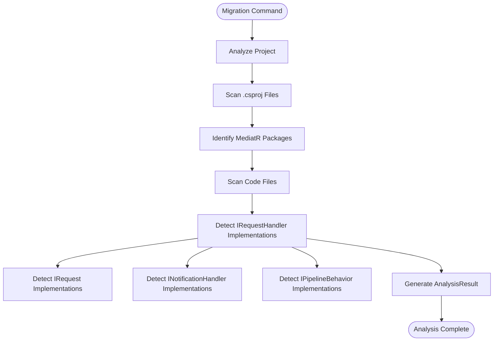
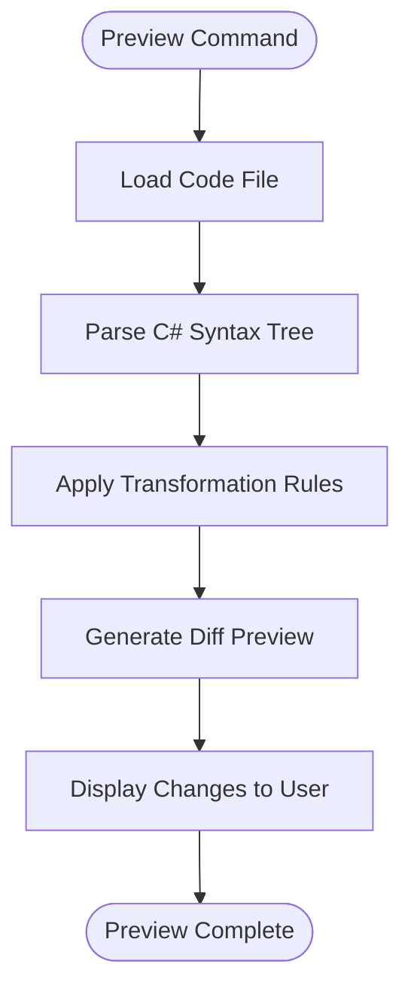
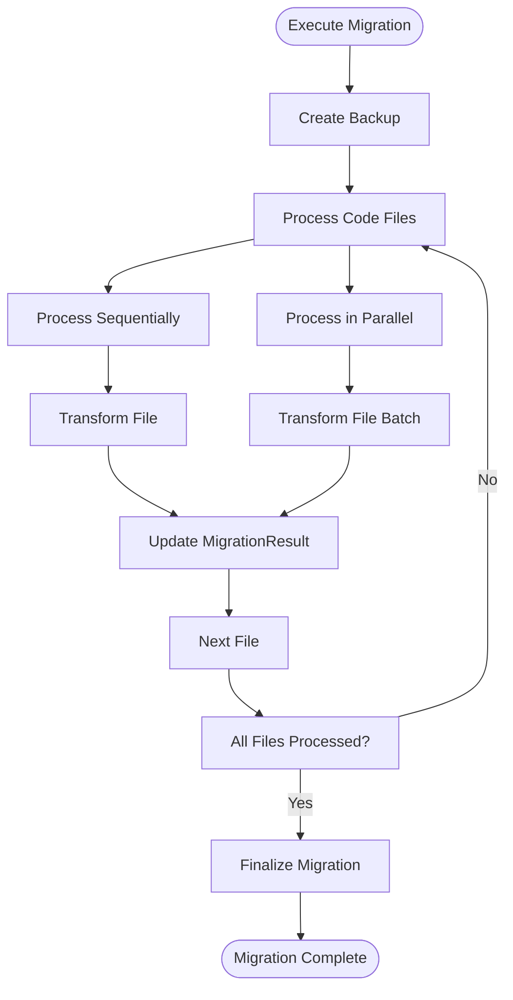
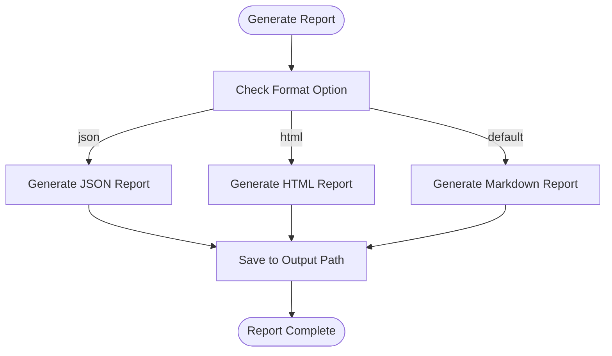

# Migration Tools

<cite>
**Referenced Files in This Document**   
- [MigrateCommand.cs](file://tools/Relay.CLI/Commands/MigrateCommand.cs)
- [MigrateCommandBuilder.cs](file://tools/Relay.CLI/Commands/MigrateCommandBuilder.cs)
- [MigrateCommandExecutor.cs](file://tools/Relay.CLI/Commands/MigrateCommandExecutor.cs)
- [MigrationEngine.cs](file://tools/Relay.CLI/Migration/MigrationEngine.cs)
- [MediatRAnalyzer.cs](file://tools/Relay.CLI/Migration/MediatRAnalyzer.cs)
- [CodeTransformer.cs](file://tools/Relay.CLI/Migration/CodeTransformer.cs)
- [MigrationOptions.cs](file://tools/Relay.CLI/Migration/MigrationOptions.cs)
- [MigrationResult.cs](file://tools/Relay.CLI/Migration/MigrationResult.cs)
- [AnalysisResult.cs](file://tools/Relay.CLI/Migration/AnalysisResult.cs)
- [BackupManager.cs](file://tools/Relay.CLI/Migration/BackupManager.cs)
- [MigrationReportGenerator.cs](file://tools/Relay.CLI/Commands/MigrationReportGenerator.cs)
- [MigrationDisplay.cs](file://tools/Relay.CLI/Commands/MigrationDisplay.cs)
- [MIGRATION.md](file://docs/MessageBroker/MIGRATION.md)
</cite>

## Table of Contents
1. [Introduction](#introduction)
2. [Migration Workflow](#migration-workflow)
3. [Core Components](#core-components)
4. [Configuration Options](#configuration-options)
5. [Migration Report Generation](#migration-report-generation)
6. [Complex Migration Scenarios](#complex-migration-scenarios)
7. [Troubleshooting](#troubleshooting)
8. [Conclusion](#conclusion)

## Introduction
The Relay CLI provides a comprehensive migration toolset designed to assist developers in upgrading from previous versions or migrating from other frameworks like MediatR. The `migrate` command offers an automated transformation process that analyzes, previews, and executes code migrations with safety features like backups and detailed reporting. This document explains the implementation of the migration tools, focusing on the workflow, core components, configuration options, and practical guidance for successful migrations.

## Migration Workflow
The migration process in Relay CLI follows a structured three-phase approach: analysis, preview, and execution. This ensures a safe and predictable migration experience.

### Analysis Phase
The analysis phase begins when the `migrate` command is invoked. The `MigrationEngine` orchestrates the process by first creating a `MediatRAnalyzer` instance to scan the project for MediatR usage patterns. The analyzer examines project files, package references, and code files to identify handlers, requests, notifications, and pipeline behaviors. It generates an `AnalysisResult` containing detailed information about the project's compatibility with Relay, including the number of handlers found, package references, and any potential issues.

**Diagram sources**
- [MediatRAnalyzer.cs](file://tools/Relay.CLI/Migration/MediatRAnalyzer.cs#L12-L527)
- [AnalysisResult.cs](file://tools/Relay.CLI/Migration/AnalysisResult.cs#L6-L73)

**Section sources**
- [MediatRAnalyzer.cs](file://tools/Relay.CLI/Migration/MediatRAnalyzer.cs#L12-L527)
- [AnalysisResult.cs](file://tools/Relay.CLI/Migration/AnalysisResult.cs#L6-L73)

### Preview Phase
The preview phase allows developers to see the changes before they are applied. When the `--preview` or `--dry-run` options are used, the `MigrationEngine` invokes the `CodeTransformer` to generate transformation previews without modifying files. The `PreviewTransformAsync` method parses each code file, applies the transformation rules, and returns a `TransformationResult` showing what would change. The `DiffDisplayUtility` then presents these changes in a user-friendly format, either inline or side-by-side depending on the `--side-by-side` option.

**Diagram sources**
- [CodeTransformer.cs](file://tools/Relay.CLI/Migration/CodeTransformer.cs#L56-L60)
- [TransformationResult.cs](file://tools/Relay.CLI/Migration/TransformationResult.cs#L6-L48)

**Section sources**
- [CodeTransformer.cs](file://tools/Relay.CLI/Migration/CodeTransformer.cs#L56-L60)
- [TransformationResult.cs](file://tools/Relay.CLI/Migration/TransformationResult.cs#L6-L48)

### Execution Phase
The execution phase applies the transformations to the codebase. The `MigrationEngine` first creates a backup using the `BackupManager` if the `--backup` option is enabled. It then processes code files either sequentially or in parallel based on the project size and `EnableParallelProcessing` setting. For each file, the `CodeTransformer` applies the necessary changes, and the results are tracked in a `MigrationResult`. The process includes progress reporting through the `OnProgress` callback, allowing real-time monitoring of the migration status.

**Diagram sources**
- [MigrationEngine.cs](file://tools/Relay.CLI/Migration/MigrationEngine.cs#L44-L256)
- [MigrationResult.cs](file://tools/Relay.CLI/Migration/MigrationResult.cs#L6-L68)
- [BackupManager.cs](file://tools/Relay.CLI/Migration/BackupManager.cs#L28-L54)

**Section sources**
- [MigrationEngine.cs](file://tools/Relay.CLI/Migration/MigrationEngine.cs#L44-L256)
- [MigrationResult.cs](file://tools/Relay.CLI/Migration/MigrationResult.cs#L6-L68)
- [BackupManager.cs](file://tools/Relay.CLI/Migration/BackupManager.cs#L28-L54)

## Core Components
The migration tools are built around several core components that work together to provide a seamless migration experience.

### MigrationEngine
The `MigrationEngine` is the central orchestrator of the migration process. It coordinates the analysis, transformation, and reporting phases while handling error conditions and progress reporting. The engine is initialized with a `MediatRAnalyzer`, `CodeTransformer`, and `BackupManager`, which it uses to perform the various migration tasks. It supports multiple execution modes including standard migration, interactive migration, and preview-only mode.

**Section sources**
- [MigrationEngine.cs](file://tools/Relay.CLI/Migration/MigrationEngine.cs#L12-L907)

### MediatRAnalyzer
The `MediatRAnalyzer` is responsible for analyzing the project structure and identifying MediatR-specific patterns. It scans project files for MediatR package references and examines code files for MediatR interfaces like `IRequestHandler`, `INotificationHandler`, and `IPipelineBehavior`. The analyzer generates an `AnalysisResult` that includes detailed information about the project's compatibility with Relay, potential issues, and recommendations for manual intervention.

**Section sources**
- [MediatRAnalyzer.cs](file://tools/Relay.CLI/Migration/MediatRAnalyzer.cs#L10-L527)

### CodeTransformer
The `CodeTransformer` performs the actual code modifications during migration. It uses the Roslyn compiler platform to parse C# syntax trees and apply transformations such as renaming `Handle` methods to `HandleAsync`, changing `Task` return types to `ValueTask`, and updating using directives from `MediatR` to `Relay.Core`. The transformer operates on a file-by-file basis and generates detailed change logs that are included in the migration report.

**Section sources**
- [CodeTransformer.cs](file://tools/Relay.CLI/Migration/CodeTransformer.cs#L11-L222)

## Configuration Options
The `migrate` command supports several configuration options that control the migration behavior.

### --analyze-only
The `--analyze-only` option performs a complete analysis of the project without making any changes. This is useful for assessing the scope of migration and identifying potential issues before proceeding with the actual transformation.

**Section sources**
- [MigrationOptions.cs](file://tools/Relay.CLI/Migration/MigrationOptions.cs#L26-L27)

### --dry-run
The `--dry-run` option shows what changes would be made without applying them. This allows developers to review the proposed transformations and understand the impact on their codebase.

**Section sources**
- [MigrationOptions.cs](file://tools/Relay.CLI/Migration/MigrationOptions.cs#L31-L32)

### --preview
The `--preview` option provides a detailed diff preview of the changes, showing exactly which lines will be added, removed, or modified. This option can be combined with `--side-by-side` for a more visual comparison.

**Section sources**
- [MigrationOptions.cs](file://tools/Relay.CLI/Migration/MigrationOptions.cs#L36-L37)

### --backup
The `--backup` option creates a backup of the project before applying any changes. The backup includes all source files and metadata, and can be used to restore the original state if needed. Backups are stored in the directory specified by `--backup-path` (default: `.backup`).

**Section sources**
- [MigrationOptions.cs](file://tools/Relay.CLI/Migration/MigrationOptions.cs#L41-L42)
- [BackupManager.cs](file://tools/Relay.CLI/Migration/BackupManager.cs#L28-L54)

### --aggressive
The `--aggressive` option applies additional optimizations during migration. When enabled, it adds `[Handle]` attributes to handler methods and may apply other performance-enhancing transformations. This option is recommended for projects that want to fully leverage Relay's features.

**Section sources**
- [MigrationOptions.cs](file://tools/Relay.CLI/Migration/MigrationOptions.cs#L56-L57)
- [CodeTransformer.cs](file://tools/Relay.CLI/Migration/CodeTransformer.cs#L149-L169)

## Migration Report Generation
The migration tools include a comprehensive reporting system that documents the results of the migration process.

### MigrationReportGenerator
The `MigrationReportGenerator` creates detailed reports in multiple formats (markdown, json, html) based on the `MigrationResult`. The report includes summary statistics, a list of changes made, any issues encountered, and manual steps required after migration. The generator uses a switch statement to determine the output format based on the `--format` option.

**Diagram sources**
- [MigrationReportGenerator.cs](file://tools/Relay.CLI/Commands/MigrationReportGenerator.cs#L8-L38)

**Section sources**
- [MigrationReportGenerator.cs](file://tools/Relay.CLI/Commands/MigrationReportGenerator.cs#L8-L38)

### Report Content
The migration report includes several key sections:
- **Summary**: Overview of migration statistics including files modified, lines changed, and handlers migrated
- **Changes**: Detailed list of all modifications made during migration
- **Issues**: Any warnings or errors encountered during the process
- **Manual Steps**: Recommendations for post-migration tasks that require human intervention

**Section sources**
- [MigrationReportGenerator.cs](file://tools/Relay.CLI/Commands/MigrationReportGenerator.cs#L20-L38)
- [MigrationResult.cs](file://tools/Relay.CLI/Migration/MigrationResult.cs#L56-L67)

## Complex Migration Scenarios
The migration tools handle several complex scenarios that may arise during the migration process.

### Custom Mediator Implementations
Projects with custom `IMediator` implementations require special attention. The `MediatRAnalyzer` detects these cases and adds a warning to the analysis results, recommending manual review. The migration process does not automatically transform custom mediator logic, as this often contains project-specific patterns that cannot be safely automated.

**Section sources**
- [MediatRAnalyzer.cs](file://tools/Relay.CLI/Migration/MediatRAnalyzer.cs#L264-L275)

### Advanced Pipeline Behaviors
Custom pipeline behaviors with complex logic are identified by the analyzer and flagged for review. The migration tools can handle standard behaviors like logging and validation, but complex custom behaviors may need manual updates to work with Relay's pipeline system.

**Section sources**
- [MediatRAnalyzer.cs](file://tools/Relay.CLI/Migration/MediatRAnalyzer.cs#L346-L394)

### Streaming Requests
Streaming requests using `IStreamRequest` are not automatically migrated, as Relay's streaming model differs from MediatR's implementation. The analyzer detects these patterns and recommends manual migration, providing guidance in the migration report.

**Section sources**
- [MediatRAnalyzer.cs](file://tools/Relay.CLI/Migration/MediatRAnalyzer.cs#L325-L343)

## Troubleshooting
This section provides guidance for common issues encountered during migration.

### Syntax Errors During Transformation
Syntax errors can occur when the code parser encounters invalid C# syntax. These are typically caused by incomplete code files or syntax that the Roslyn parser cannot handle. The migration engine catches `SyntaxException` and reports the file and error message, allowing developers to fix the issue before retrying the migration.

**Section sources**
- [MigrationEngine.cs](file://tools/Relay.CLI/Migration/MigrationEngine.cs#L576-L588)

### Backup Failures
Backup failures can occur due to insufficient disk space, permission issues, or file locks. The `BackupManager` attempts to create the backup directory and copy files, but if any step fails, it returns false. Developers should ensure adequate disk space and proper permissions before running the migration.

**Section sources**
- [BackupManager.cs](file://tools/Relay.CLI/Migration/BackupManager.cs#L28-L54)

### Partial Migration Success
In cases where some files fail to migrate but others succeed, the migration result will show a `Partial` status. The `ContinueOnError` option (enabled by default) allows the migration to proceed past individual file errors, maximizing the number of successful transformations. Developers can then address the failed files manually.

**Section sources**
- [MigrationEngine.cs](file://tools/Relay.CLI/Migration/MigrationEngine.cs#L581-L587)
- [MigrationOptions.cs](file://tools/Relay.CLI/Migration/MigrationOptions.cs#L91-L92)

## Conclusion
The Relay CLI migration tools provide a robust and safe way to upgrade from MediatR or previous versions. By following the analysis, preview, and execution workflow, developers can confidently migrate their codebases with minimal risk. The tools offer extensive configuration options, detailed reporting, and comprehensive error handling to ensure a smooth transition. For complex scenarios requiring custom transformations, the modular design allows for extension and customization of the migration process.