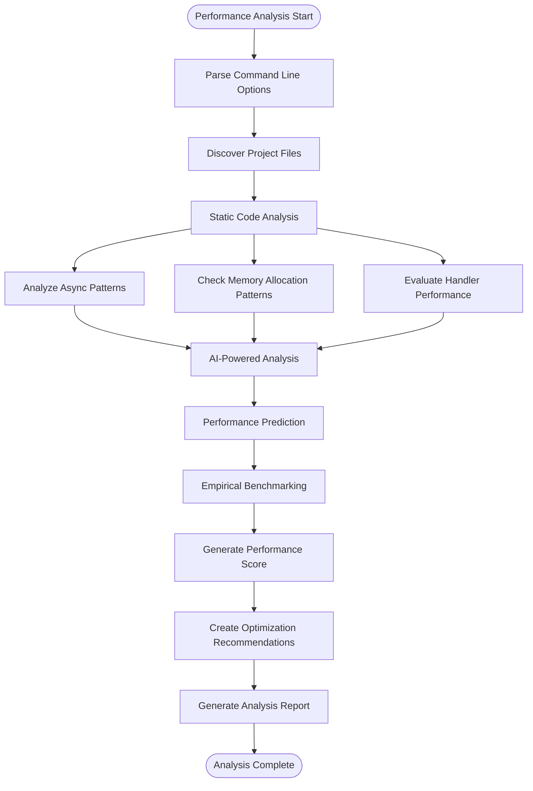
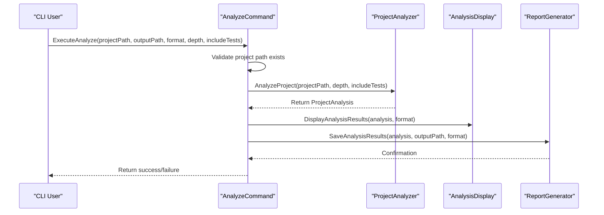
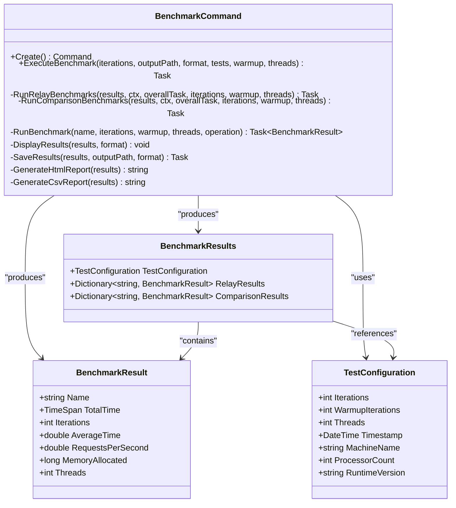
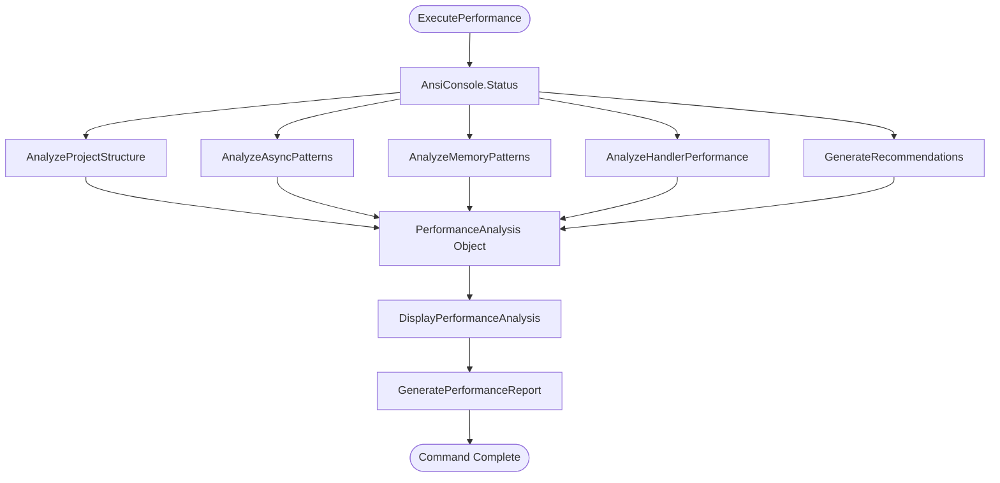
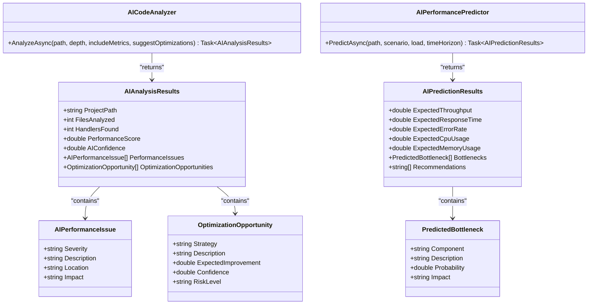
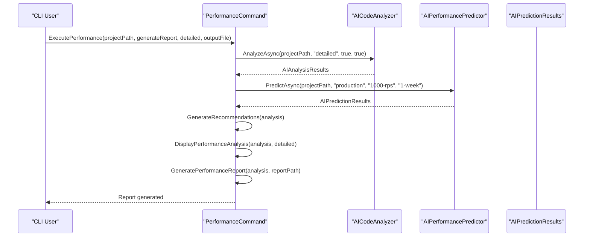
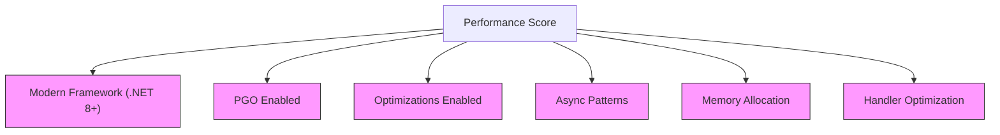
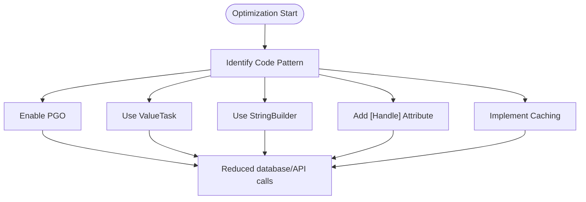
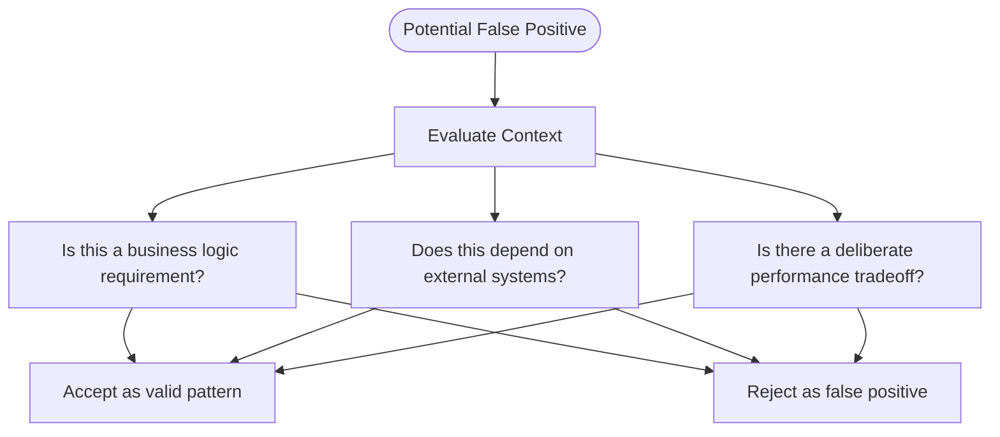

# Performance Analysis

<cite>
**Referenced Files in This Document**   
- [AnalyzeCommand.cs](file://tools/Relay.CLI/Commands/AnalyzeCommand.cs)
- [BenchmarkCommand.cs](file://tools/Relay.CLI/Commands/BenchmarkCommand.cs)
- [PerformanceCommand.cs](file://tools/Relay.CLI/Commands/PerformanceCommand.cs)
- [AICodeAnalyzer.cs](file://tools/Relay.CLI/Commands/AICodeAnalyzer.cs)
- [AIPerformancePredictor.cs](file://tools/Relay.CLI/Commands/AIPerformancePredictor.cs)
- [PerformanceAnalysis.cs](file://tools/Relay.CLI/Commands/Models/Performance/PerformanceAnalysis.cs)
- [PerformanceRecommendation.cs](file://tools/Relay.CLI/Commands/Models/Performance/PerformanceRecommendation.cs)
- [AIPredictionResults.cs](file://tools/Relay.CLI/Commands/AIPredictionResults.cs)
- [AILearningResults.cs](file://tools/Relay.CLI/Commands/AILearningResults.cs)
</cite>

## Table of Contents
1. [Introduction](#introduction)
2. [Performance Analysis Workflow](#performance-analysis-workflow)
3. [Core Commands](#core-commands)
4. [AI-Powered Performance Components](#ai-powered-performance-components)
5. [Configuration Options](#configuration-options)
6. [Analysis Results Interpretation](#analysis-results-interpretation)
7. [Optimization Implementation](#optimization-implementation)
8. [Troubleshooting Common Issues](#troubleshooting-common-issues)
9. [Conclusion](#conclusion)

## Introduction

The Relay CLI provides comprehensive performance analysis capabilities through its `analyze`, `benchmark`, and `performance` commands. These tools work together to identify optimization opportunities, detect performance bottlenecks, and generate actionable recommendations for improving application efficiency. The system combines static code analysis with AI-powered predictions to deliver both immediate insights and forward-looking performance forecasts.

The performance analysis framework is designed to be accessible to developers of all experience levels while providing deep technical insights for advanced users. It integrates seamlessly with the Relay ecosystem, analyzing code patterns, async usage, memory allocation, and handler optimization to deliver a comprehensive performance assessment.

**Section sources**
- [PerformanceCommand.cs](file://tools/Relay.CLI/Commands/PerformanceCommand.cs#L1-L501)
- [AnalyzeCommand.cs](file://tools/Relay.CLI/Commands/AnalyzeCommand.cs#L1-L107)

## Performance Analysis Workflow

The performance analysis workflow in Relay CLI follows a structured approach that combines multiple analysis techniques to provide comprehensive insights. The process begins with the `analyze` command, which orchestrates a multi-stage analysis of the codebase, followed by the `performance` command that focuses specifically on performance characteristics, and the `benchmark` command that provides empirical performance measurements.



**Diagram sources**
- [PerformanceCommand.cs](file://tools/Relay.CLI/Commands/PerformanceCommand.cs#L35-L98)
- [AnalyzeCommand.cs](file://tools/Relay.CLI/Commands/AnalyzeCommand.cs#L14-L71)
- [BenchmarkCommand.cs](file://tools/Relay.CLI/Commands/BenchmarkCommand.cs#L39-L120)

**Section sources**
- [PerformanceCommand.cs](file://tools/Relay.CLI/Commands/PerformanceCommand.cs#L35-L98)
- [AnalyzeCommand.cs](file://tools/Relay.CLI/Commands/AnalyzeCommand.cs#L14-L71)
- [BenchmarkCommand.cs](file://tools/Relay.CLI/Commands/BenchmarkCommand.cs#L39-L120)

## Core Commands

### Analyze Command

The `analyze` command serves as the primary entry point for comprehensive code analysis, including performance assessment. It coordinates the analysis process, manages progress reporting, and handles result display and persistence.



**Diagram sources**
- [AnalyzeCommand.cs](file://tools/Relay.CLI/Commands/AnalyzeCommand.cs#L14-L71)

**Section sources**
- [AnalyzeCommand.cs](file://tools/Relay.CLI/Commands/AnalyzeCommand.cs#L14-L71)

### Benchmark Command

The `benchmark` command provides empirical performance measurements by running controlled tests against different Relay implementations and comparing them with baseline approaches like direct method calls and simulated MediatR performance.



**Diagram sources**
- [BenchmarkCommand.cs](file://tools/Relay.CLI/Commands/BenchmarkCommand.cs#L11-L573)

**Section sources**
- [BenchmarkCommand.cs](file://tools/Relay.CLI/Commands/BenchmarkCommand.cs#L11-L573)

### Performance Command

The `performance` command focuses specifically on performance characteristics, analyzing code patterns and generating targeted recommendations for optimization.



**Diagram sources**
- [PerformanceCommand.cs](file://tools/Relay.CLI/Commands/PerformanceCommand.cs#L35-L98)

**Section sources**
- [PerformanceCommand.cs](file://tools/Relay.CLI/Commands/PerformanceCommand.cs#L35-L98)

## AI-Powered Performance Components

### AICodeAnalyzer and AIPerformancePredictor

The Relay CLI leverages AI-powered components to enhance performance analysis with predictive capabilities and intelligent pattern recognition. The `AICodeAnalyzer` and `AIPerformancePredictor` work together to identify optimization opportunities and forecast system behavior under various conditions.



**Diagram sources**
- [AICodeAnalyzer.cs](file://tools/Relay.CLI/Commands/AICodeAnalyzer.cs#L4-L30)
- [AIPerformancePredictor.cs](file://tools/Relay.CLI/Commands/AIPerformancePredictor.cs#L3-L29)
- [AIPredictionResults.cs](file://tools/Relay.CLI/Commands/AIPredictionResults.cs#L3-L13)

**Section sources**
- [AICodeAnalyzer.cs](file://tools/Relay.CLI/Commands/AICodeAnalyzer.cs#L4-L30)
- [AIPerformancePredictor.cs](file://tools/Relay.CLI/Commands/AIPerformancePredictor.cs#L3-L29)
- [AIPredictionResults.cs](file://tools/Relay.CLI/Commands/AIPredictionResults.cs#L3-L13)

### AI Learning and Prediction Integration

The AI components integrate with the performance analysis workflow to provide enhanced insights beyond what static analysis alone can deliver. This integration allows the system to learn from historical data and make predictions about future performance.



**Diagram sources**
- [PerformanceCommand.cs](file://tools/Relay.CLI/Commands/PerformanceCommand.cs#L35-L98)
- [AICodeAnalyzer.cs](file://tools/Relay.CLI/Commands/AICodeAnalyzer.cs#L6-L29)
- [AIPerformancePredictor.cs](file://tools/Relay.CLI/Commands/AIPerformancePredictor.cs#L5-L28)

**Section sources**
- [PerformanceCommand.cs](file://tools/Relay.CLI/Commands/PerformanceCommand.cs#L35-L98)
- [AICodeAnalyzer.cs](file://tools/Relay.CLI/Commands/AICodeAnalyzer.cs#L6-L29)
- [AIPerformancePredictor.cs](file://tools/Relay.CLI/Commands/AIPerformancePredictor.cs#L5-L28)

## Configuration Options

### Command Line Parameters

The performance analysis commands support various configuration options that control the depth and scope of analysis. These options allow users to tailor the analysis to their specific needs and constraints.

```mermaid
erDiagram
PERFORMANCE_COMMAND ||--o{ OPTION : has
BENCHMARK_COMMAND ||--o{ OPTION : has
PERFORMANCE_COMMAND {
string name "performance"
string description "Performance analysis and recommendations"
}
BENCHMARK_COMMAND {
string name "benchmark"
string description "Run comprehensive performance benchmarks"
}
OPTION {
string name
string default_value
string description
string type
}
OPTION {
"--path" "string" "." "Project path to analyze"
"--report" "bool" "true" "Generate performance report"
"--detailed" "bool" "false" "Show detailed analysis"
"--output" "string" "null" "Output file for the report"
"--iterations" "int" "100000" "Number of iterations per test"
"--warmup" "int" "1000" "Warmup iterations"
"--threads" "int" "1" "Number of concurrent threads"
"--tests" "string[]" "all" "Specific tests to run"
"--include-tests" "bool" "false" "Include test files in analysis"
}
```

**Diagram sources**
- [PerformanceCommand.cs](file://tools/Relay.CLI/Commands/PerformanceCommand.cs#L17-L25)
- [BenchmarkCommand.cs](file://tools/Relay.CLI/Commands/BenchmarkCommand.cs#L17-L29)

**Section sources**
- [PerformanceCommand.cs](file://tools/Relay.CLI/Commands/PerformanceCommand.cs#L17-L25)
- [BenchmarkCommand.cs](file://tools/Relay.CLI/Commands/BenchmarkCommand.cs#L17-L29)

### Impact of Configuration Options

Different configuration options have specific impacts on the analysis results and performance characteristics of the analysis process itself.

| Option | Purpose | Impact on Analysis |
|--------|-------|-------------------|
| --include-tests | Include test files in analysis | Increases analysis scope but may identify optimization opportunities in test code |
| --iterations | Number of iterations for benchmarking | Higher values provide more accurate results but increase execution time |
| --detailed | Show detailed analysis output | Provides more granular insights but increases output volume |
| --report | Generate performance report | Creates persistent documentation of analysis results |
| --threads | Number of concurrent threads | Enables multi-threaded benchmarking to measure concurrency performance |

**Section sources**
- [PerformanceCommand.cs](file://tools/Relay.CLI/Commands/PerformanceCommand.cs#L17-L25)
- [BenchmarkCommand.cs](file://tools/Relay.CLI/Commands/BenchmarkCommand.cs#L17-L29)

## Analysis Results Interpretation

### Performance Score and Metrics

The performance analysis generates a comprehensive score and various metrics that help assess the overall health of the codebase from a performance perspective.



**Diagram sources**
- [PerformanceCommand.cs](file://tools/Relay.CLI/Commands/PerformanceCommand.cs#L286-L298)
- [PerformanceAnalysis.cs](file://tools/Relay.CLI/Commands/Models/Performance/PerformanceAnalysis.cs#L1-L26)

**Section sources**
- [PerformanceCommand.cs](file://tools/Relay.CLI/Commands/PerformanceCommand.cs#L286-L298)
- [PerformanceAnalysis.cs](file://tools/Relay.CLI/Commands/Models/Performance/PerformanceAnalysis.cs#L1-L26)

### Recommendation Prioritization

The system categorizes recommendations by priority and impact, helping users focus on the most critical optimizations first.

| Priority | Color Code | Action Required |
|---------|-----------|----------------|
| High | Red | Address immediately as these have significant performance impact |
| Medium | Yellow | Implement when possible as these provide noticeable improvements |
| Low | Blue | Consider for future optimization cycles |

**Section sources**
- [PerformanceCommand.cs](file://tools/Relay.CLI/Commands/PerformanceCommand.cs#L301-L359)
- [PerformanceRecommendation.cs](file://tools/Relay.CLI/Commands/Models/Performance/PerformanceRecommendation.cs#L1-L10)

## Optimization Implementation

### Common Optimization Strategies

The performance analysis identifies several common optimization opportunities that can significantly improve application performance.



**Diagram sources**
- [PerformanceCommand.cs](file://tools/Relay.CLI/Commands/PerformanceCommand.cs#L301-L359)

**Section sources**
- [PerformanceCommand.cs](file://tools/Relay.CLI/Commands/PerformanceCommand.cs#L301-L359)

## Troubleshooting Common Issues

### False Positives in Analysis

Occasionally, the analysis may generate recommendations that don't apply to specific use cases. Understanding how to evaluate these recommendations is crucial.



**Diagram sources**
- [PerformanceCommand.cs](file://tools/Relay.CLI/Commands/PerformanceCommand.cs#L301-L359)

**Section sources**
- [PerformanceCommand.cs](file://tools/Relay.CLI/Commands/PerformanceCommand.cs#L301-L359)

### Benchmarking Inaccuracies

Benchmarking results can sometimes be misleading due to environmental factors or configuration issues.

| Issue | Cause | Solution |
|------|------|---------|
| Inconsistent results | Background processes | Run benchmarks on clean system with minimal background activity |
| Memory allocation spikes | GC interference | Add GC.Collect() before measurements and ensure warmup iterations |
| CPU throttling | Power settings | Use high-performance power plan during benchmarking |
| Network variability | External dependencies | Isolate network-dependent code or use mocks for consistent results |

**Section sources**
- [BenchmarkCommand.cs](file://tools/Relay.CLI/Commands/BenchmarkCommand.cs#L236-L240)

## Conclusion

The Relay CLI's performance analysis capabilities provide a comprehensive toolkit for identifying and addressing performance bottlenecks in .NET applications. By combining static code analysis, empirical benchmarking, and AI-powered predictions, the system delivers actionable insights that help developers optimize their code for maximum efficiency.

The integration of AI components like `AICodeAnalyzer` and `AIPerformancePredictor` enhances the analysis with predictive capabilities, allowing teams to anticipate performance issues before they occur in production. The various configuration options provide flexibility in tailoring the analysis to specific needs, while the clear reporting and recommendation system makes it accessible to developers of all experience levels.

By following the recommendations generated by the analysis tools and understanding how to interpret the results, development teams can systematically improve their application's performance, reduce resource consumption, and deliver a better user experience.

**Section sources**
- [PerformanceCommand.cs](file://tools/Relay.CLI/Commands/PerformanceCommand.cs#L1-L501)
- [BenchmarkCommand.cs](file://tools/Relay.CLI/Commands/BenchmarkCommand.cs#L1-L573)
- [AICodeAnalyzer.cs](file://tools/Relay.CLI/Commands/AICodeAnalyzer.cs#L1-L30)