# Plugin System

<cite>
**Referenced Files in This Document**   
- [IRelayPlugin.cs](file://tools/Relay.CLI/Plugins/IRelayPlugin.cs)
- [RelayPluginAttribute.cs](file://tools/Relay.CLI/Plugins/RelayPluginAttribute.cs)
- [PluginManager.cs](file://tools/Relay.CLI/Plugins/PluginManager.cs)
- [PluginLoadContext.cs](file://tools/Relay.CLI/Plugins/PluginLoadContext.cs)
- [PluginSecurityValidator.cs](file://tools/Relay.CLI/Plugins/PluginSecurityValidator.cs)
- [PluginSandbox.cs](file://tools/Relay.CLI/Plugins/PluginSandbox.cs)
- [PluginCommand.cs](file://tools/Relay.CLI/Commands/PluginCommand.cs)
- [IPluginContext.cs](file://tools/Relay.CLI/Plugins/IPluginContext.cs)
- [PluginContext.cs](file://tools/Relay.CLI/Plugins/PluginContext.cs)
- [PluginFileSystem.cs](file://tools/Relay.CLI/Plugins/PluginFileSystem.cs)
- [PluginManifest.cs](file://tools/Relay.CLI/Plugins/PluginManifest.cs)
- [PluginPermissions.cs](file://tools/Relay.CLI/Plugins/PluginPermissions.cs)
- [LazyPluginLoader.cs](file://tools/Relay.CLI/Plugins/LazyPluginLoader.cs)
- [PluginHealthMonitor.cs](file://tools/Relay.CLI/Plugins/PluginHealthMonitor.cs)
- [PluginHealthInfo.cs](file://tools/Relay.CLI/Plugins/PluginHealthInfo.cs)
</cite>

## Table of Contents
1. [Introduction](#introduction)
2. [Plugin Architecture Overview](#plugin-architecture-overview)
3. [Core Components](#core-components)
4. [Plugin Lifecycle Management](#plugin-lifecycle-management)
5. [Plugin Commands Implementation](#plugin-commands-implementation)
6. [Security Model](#security-model)
7. [Creating Custom Plugins](#creating-custom-plugins)
8. [Troubleshooting Guide](#troubleshooting-guide)
9. [Conclusion](#conclusion)

## Introduction

The Relay CLI Plugin System provides a robust framework for extending the functionality of the Relay CLI through third-party plugins. This extensibility model allows developers to create custom tools, integrations, and utilities that seamlessly integrate with the core CLI experience. The system is designed with security, isolation, and reliability as primary concerns, ensuring that plugins can extend functionality without compromising the stability or security of the host application.

The plugin architecture follows a modular design pattern with clear separation of concerns between discovery, loading, initialization, execution, and cleanup phases. Plugins are implemented as .NET assemblies that conform to specific interfaces and conventions, enabling the CLI to dynamically discover and interact with them at runtime. The system supports both local and global plugin installations, allowing users to manage plugins at the project level or across their entire development environment.

This document provides a comprehensive analysis of the plugin system implementation, covering the core interfaces, lifecycle management, security mechanisms, and practical guidance for creating and troubleshooting plugins.

**Section sources**
- [PluginManager.cs](file://tools/Relay.CLI/Plugins/PluginManager.cs#L1-L678)
- [IRelayPlugin.cs](file://tools/Relay.CLI/Plugins/IRelayPlugin.cs#L1-L58)

## Plugin Architecture Overview

The Relay CLI Plugin System consists of several interconnected components that work together to provide a secure and reliable plugin execution environment. The architecture is designed to isolate plugins from each other and from the host application while providing controlled access to necessary resources and services.

```mermaid
graph TB
subgraph "Host Application"
CLI[Relay CLI]
PluginCommand[PluginCommand]
PluginManager[PluginManager]
HealthMonitor[PluginHealthMonitor]
end
subgraph "Plugin Environment"
SecurityValidator[PluginSecurityValidator]
Sandbox[PluginSandbox]
LoadContext[PluginLoadContext]
Context[PluginContext]
end
subgraph "Plugin"
Plugin[IRelayPlugin]
Attribute[RelayPluginAttribute]
Manifest[plugin.json]
end
CLI --> PluginCommand
PluginCommand --> PluginManager
PluginManager --> SecurityValidator
PluginManager --> HealthMonitor
PluginManager --> LoadContext
PluginManager --> Context
SecurityValidator --> Plugin
LoadContext --> Plugin
Context --> Plugin
Plugin --> Manifest
Plugin --> Attribute
style Plugin fill:#f9f,stroke:#333
style Host Application fill:#eef,stroke:#333
style Plugin Environment fill:#efe,stroke:#333
```

**Diagram sources**
- [PluginManager.cs](file://tools/Relay.CLI/Plugins/PluginManager.cs#L1-L678)
- [PluginSecurityValidator.cs](file://tools/Relay.CLI/Plugins/PluginSecurityValidator.cs#L1-L561)
- [PluginSandbox.cs](file://tools/Relay.CLI/Plugins/PluginSandbox.cs#L1-L319)
- [PluginLoadContext.cs](file://tools/Relay.CLI/Plugins/PluginLoadContext.cs#L1-L40)

## Core Components

The plugin system is built around several core components that define its behavior and capabilities. These components work together to provide a comprehensive plugin management solution.

### IRelayPlugin Interface

The `IRelayPlugin` interface defines the contract that all plugins must implement. It specifies the required properties and methods that enable the plugin manager to interact with plugins consistently.

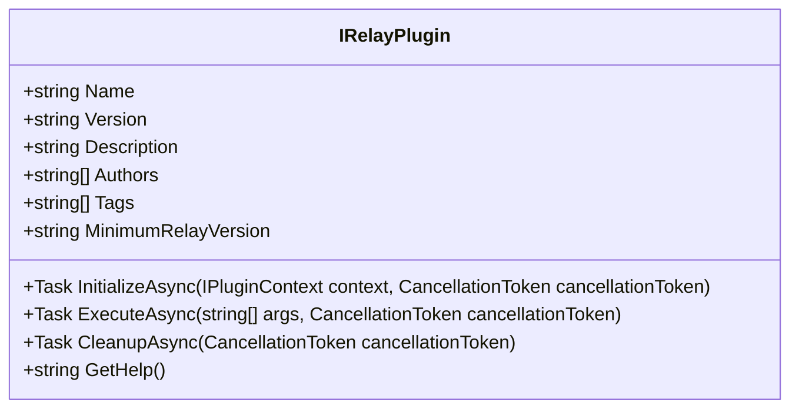

**Diagram sources**
- [IRelayPlugin.cs](file://tools/Relay.CLI/Plugins/IRelayPlugin.cs#L1-L58)

### PluginManager

The `PluginManager` class is the central component responsible for managing the entire plugin lifecycle. It handles plugin discovery, loading, initialization, execution, and cleanup.

**Section sources**
- [PluginManager.cs](file://tools/Relay.CLI/Plugins/PluginManager.cs#L1-L678)

### PluginLoadContext

The `PluginLoadContext` class provides isolated assembly loading for plugins, preventing dependency conflicts between plugins and the host application.

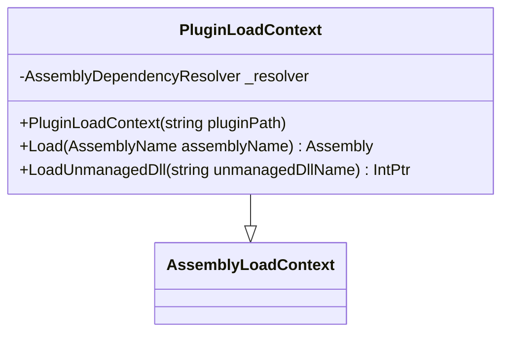

**Diagram sources**
- [PluginLoadContext.cs](file://tools/Relay.CLI/Plugins/PluginLoadContext.cs#L1-L40)

## Plugin Lifecycle Management

The plugin lifecycle consists of four main phases: discovery, loading, execution, and cleanup. Each phase is carefully managed to ensure reliability and security.

### Discovery Phase

The discovery phase identifies installed plugins by scanning designated directories and reading plugin manifests.

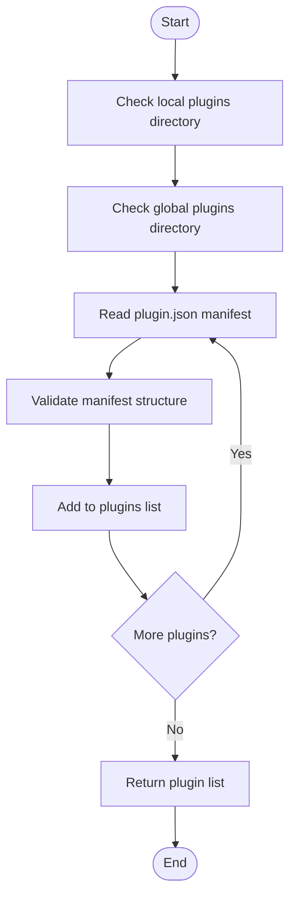

**Diagram sources**
- [PluginManager.cs](file://tools/Relay.CLI/Plugins/PluginManager.cs#L41-L97)

### Loading Phase

The loading phase involves several security and validation steps before a plugin is made available for execution.

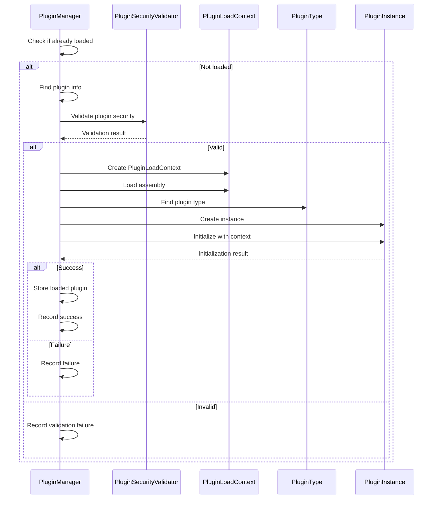

**Diagram sources**
- [PluginManager.cs](file://tools/Relay.CLI/Plugins/PluginManager.cs#L100-L246)
- [PluginSecurityValidator.cs](file://tools/Relay.CLI/Plugins/PluginSecurityValidator.cs#L51-L122)

### Execution Phase

The execution phase runs the plugin in a secure sandbox environment with resource limits and monitoring.

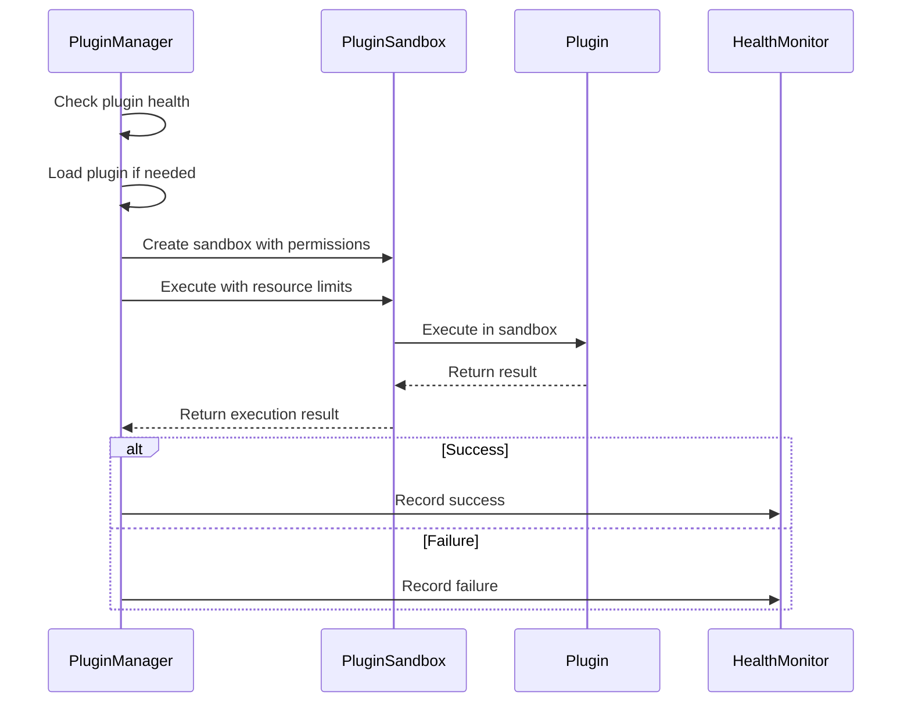

**Diagram sources**
- [PluginManager.cs](file://tools/Relay.CLI/Plugins/PluginManager.cs#L369-L424)
- [PluginSandbox.cs](file://tools/Relay.CLI/Plugins/PluginSandbox.cs#L29-L165)

### Cleanup Phase

The cleanup phase ensures proper resource disposal when a plugin is unloaded.

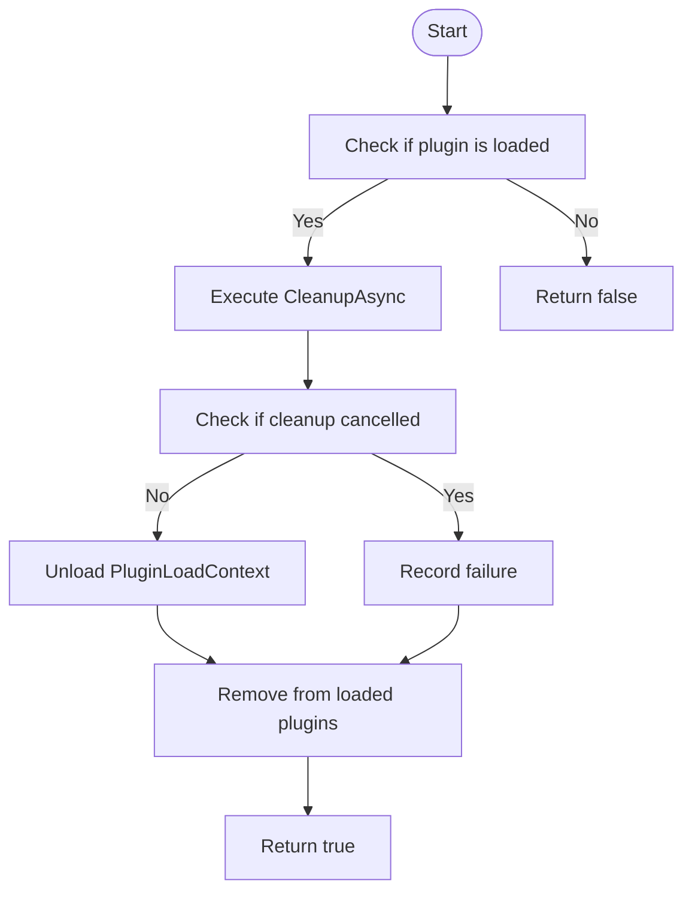

**Diagram sources**
- [PluginManager.cs](file://tools/Relay.CLI/Plugins/PluginManager.cs#L255-L298)

## Plugin Commands Implementation

The plugin system provides several commands for managing plugins, implemented through the `PluginCommand` class.

### Command Structure

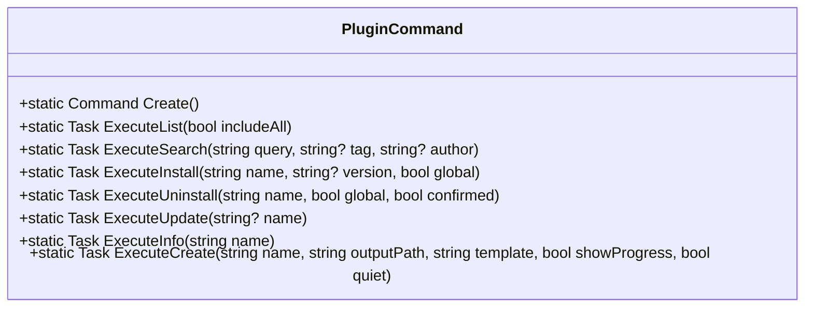

**Diagram sources**
- [PluginCommand.cs](file://tools/Relay.CLI/Commands/PluginCommand.cs#L1-L530)

### Command Flow

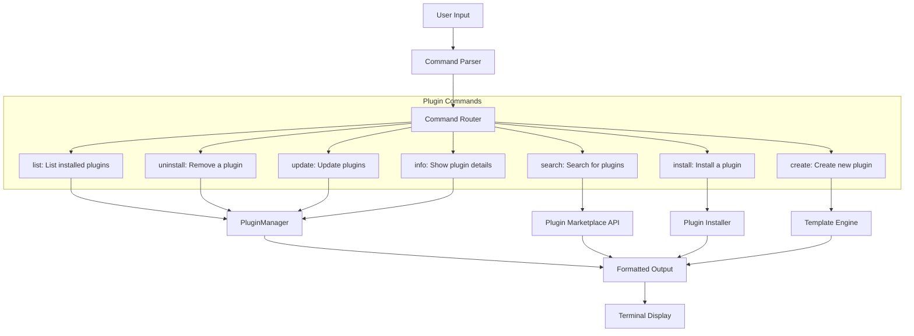

**Section sources**
- [PluginCommand.cs](file://tools/Relay.CLI/Commands/PluginCommand.cs#L1-L530)
- [PluginManager.cs](file://tools/Relay.CLI/Plugins/PluginManager.cs#L447-L632)

## Security Model

The plugin system implements a comprehensive security model to protect the host application and user system from malicious or poorly behaved plugins.

### Security Components

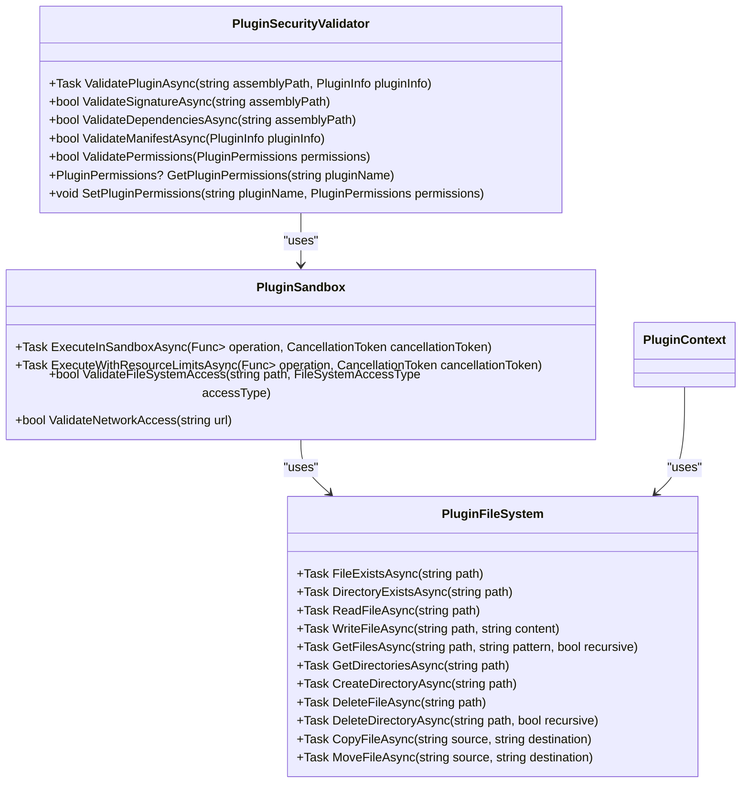

**Diagram sources**
- [PluginSecurityValidator.cs](file://tools/Relay.CLI/Plugins/PluginSecurityValidator.cs#L1-L561)
- [PluginSandbox.cs](file://tools/Relay.CLI/Plugins/PluginSandbox.cs#L1-L319)
- [PluginFileSystem.cs](file://tools/Relay.CLI/Plugins/PluginFileSystem.cs#L1-L164)

### Permission System

The permission system controls what resources a plugin can access, with configurable limits for file system, network, memory, and execution time.

```mermaid
erDiagram
PLUGIN ||--o{ PERMISSIONS : has
PERMISSIONS ||--o{ FILE_SYSTEM_PERMISSIONS : contains
PERMISSIONS ||--o{ NETWORK_PERMISSIONS : contains
class PluginPermissions {
FileSystemPermissions? FileSystem
NetworkPermissions? Network
long MaxMemoryBytes
long MaxExecutionTimeMs
}
class FileSystemPermissions {
bool Read
bool Write
bool Delete
string[] AllowedPaths
string[] DeniedPaths
}
class NetworkPermissions {
bool Http
bool Https
string[] AllowedHosts
string[] DeniedHosts
}
```

**Diagram sources**
- [PluginPermissions.cs](file://tools/Relay.CLI/Plugins/PluginPermissions.cs#L1-L14)
- [FileSystemPermissions.cs](file://tools/Relay.CLI/Plugins/FileSystemPermissions.cs#L1-L10)
- [NetworkPermissions.cs](file://tools/Relay.CLI/Plugins/NetworkPermissions.cs#L1-L10)

## Creating Custom Plugins

Creating custom plugins for the Relay CLI involves implementing the `IRelayPlugin` interface and following the plugin development guidelines.

### Plugin Development Steps

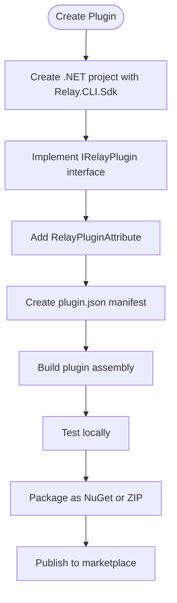

**Section sources**
- [IRelayPlugin.cs](file://tools/Relay.CLI/Plugins/IRelayPlugin.cs#L1-L58)
- [RelayPluginAttribute.cs](file://tools/Relay.CLI/Plugins/RelayPluginAttribute.cs#L1-L18)
- [PluginManifest.cs](file://tools/Relay.CLI/Plugins/PluginManifest.cs#L1-L19)

### Plugin Context Access

Plugins receive a `PluginContext` that provides access to CLI services and resources.

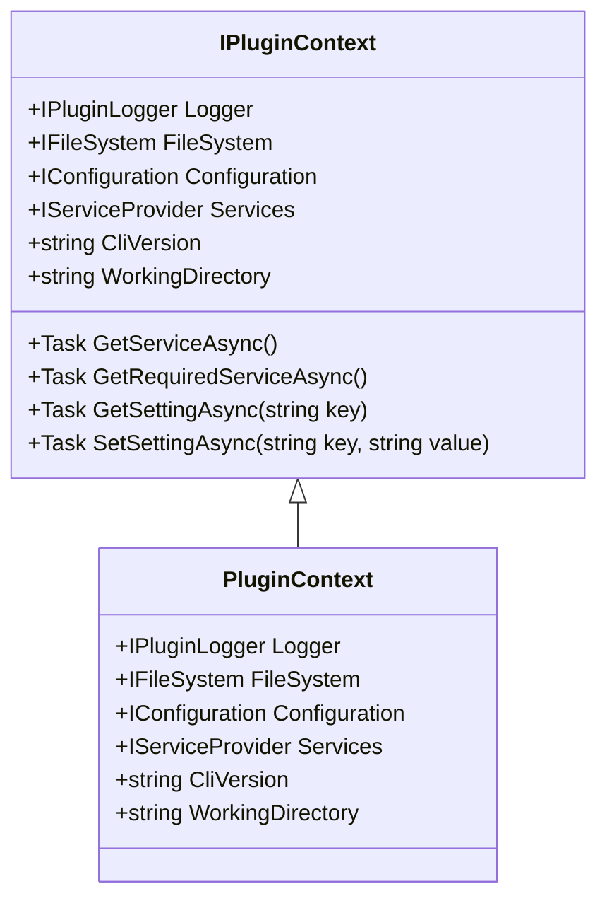

**Diagram sources**
- [IPluginContext.cs](file://tools/Relay.CLI/Plugins/IPluginContext.cs#L1-L58)
- [PluginContext.cs](file://tools/Relay.CLI/Plugins/PluginContext.cs#L1-L58)

## Troubleshooting Guide

This section provides guidance for diagnosing and resolving common plugin system issues.

### Common Issues and Solutions

| Issue | Possible Causes | Solutions |
|------|----------------|----------|
| Plugin fails to load | Invalid manifest, missing dependencies, security validation failure | Check plugin.json format, verify dependencies, ensure proper signing |
| Plugin execution timeout | Long-running operations, infinite loops | Optimize code, add progress reporting, increase timeout if necessary |
| Permission denied errors | Insufficient permissions in manifest, restricted access | Update plugin.json with required permissions, check allowed paths |
| Dependency conflicts | Version mismatches, conflicting assemblies | Use isolated PluginLoadContext, specify exact versions in dependencies |
| Installation failures | Network issues, invalid source, permission problems | Verify source URL, check network connectivity, run with elevated privileges |

**Section sources**
- [PluginManager.cs](file://tools/Relay.CLI/Plugins/PluginManager.cs#L180-L252)
- [PluginSecurityValidator.cs](file://tools/Relay.CLI/Plugins/PluginSecurityValidator.cs#L51-L122)
- [PluginSandbox.cs](file://tools/Relay.CLI/Plugins/PluginSandbox.cs#L29-L165)

### Health Monitoring

The PluginHealthMonitor tracks plugin status and automatically handles failures.

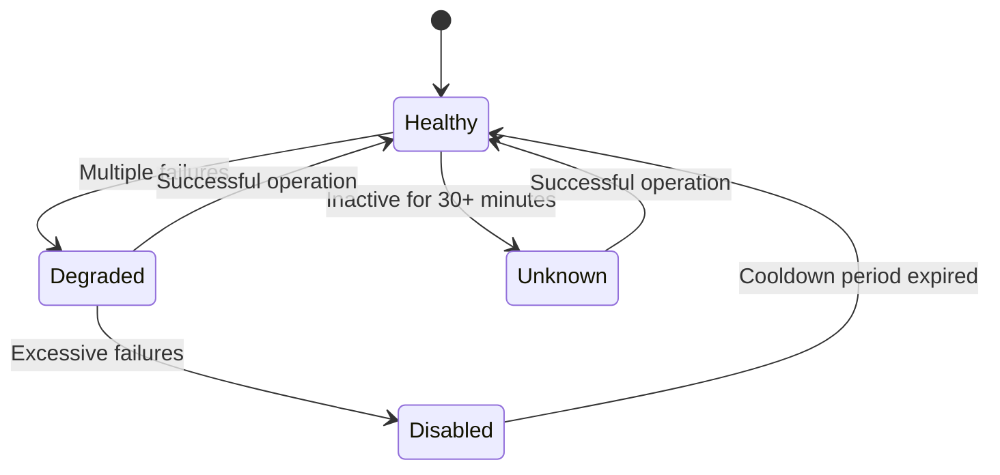

**Diagram sources**
- [PluginHealthMonitor.cs](file://tools/Relay.CLI/Plugins/PluginHealthMonitor.cs#L1-L265)
- [PluginHealthInfo.cs](file://tools/Relay.CLI/Plugins/PluginHealthInfo.cs#L1-L25)

## Conclusion

The Relay CLI Plugin System provides a comprehensive framework for extending the CLI's functionality through third-party plugins. The architecture emphasizes security, isolation, and reliability through several key mechanisms:

1. **Isolated Loading**: The `PluginLoadContext` ensures plugins are loaded in isolated contexts, preventing dependency conflicts.

2. **Security Validation**: The `PluginSecurityValidator` performs comprehensive checks on plugin assemblies, including signature validation, dependency analysis, and manifest verification.

3. **Sandboxed Execution**: The `PluginSandbox` enforces resource limits and permission restrictions during plugin execution.

4. **Health Monitoring**: The `PluginHealthMonitor` tracks plugin status and automatically handles failures to maintain system stability.

5. **Comprehensive Commands**: The plugin command system provides intuitive interfaces for discovering, installing, and managing plugins.

The system strikes a balance between flexibility and security, allowing developers to create powerful extensions while protecting the host application and user environment. By following the documented patterns and interfaces, developers can create robust plugins that integrate seamlessly with the Relay CLI ecosystem.

**Section sources**
- [PluginManager.cs](file://tools/Relay.CLI/Plugins/PluginManager.cs#L1-L678)
- [PluginSecurityValidator.cs](file://tools/Relay.CLI/Plugins/PluginSecurityValidator.cs#L1-L561)
- [PluginSandbox.cs](file://tools/Relay.CLI/Plugins/PluginSandbox.cs#L1-L319)