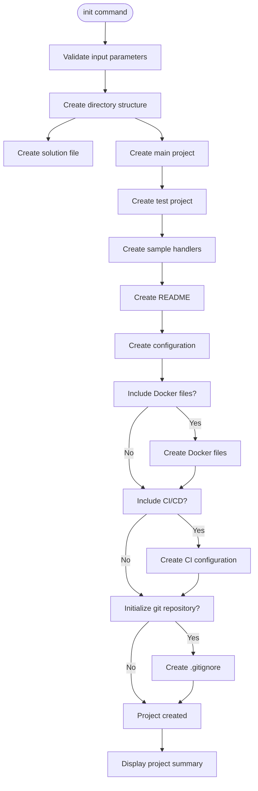
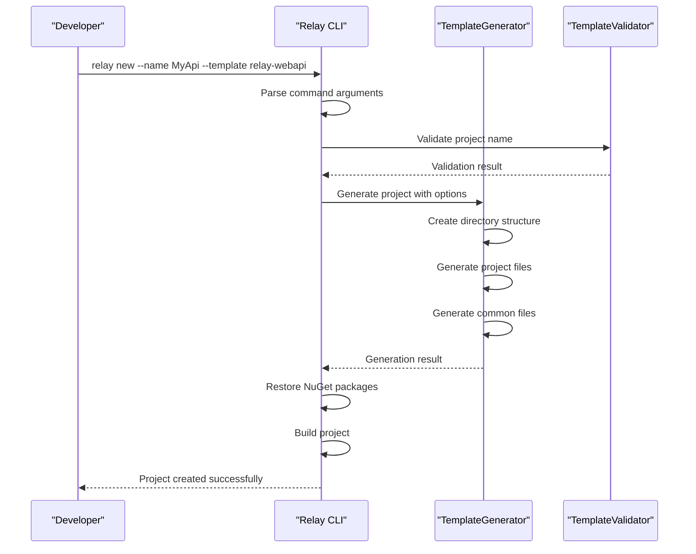
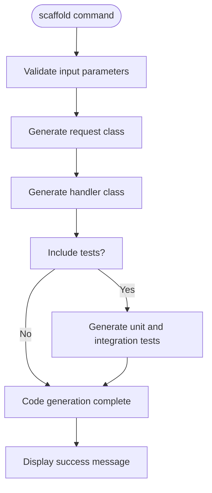
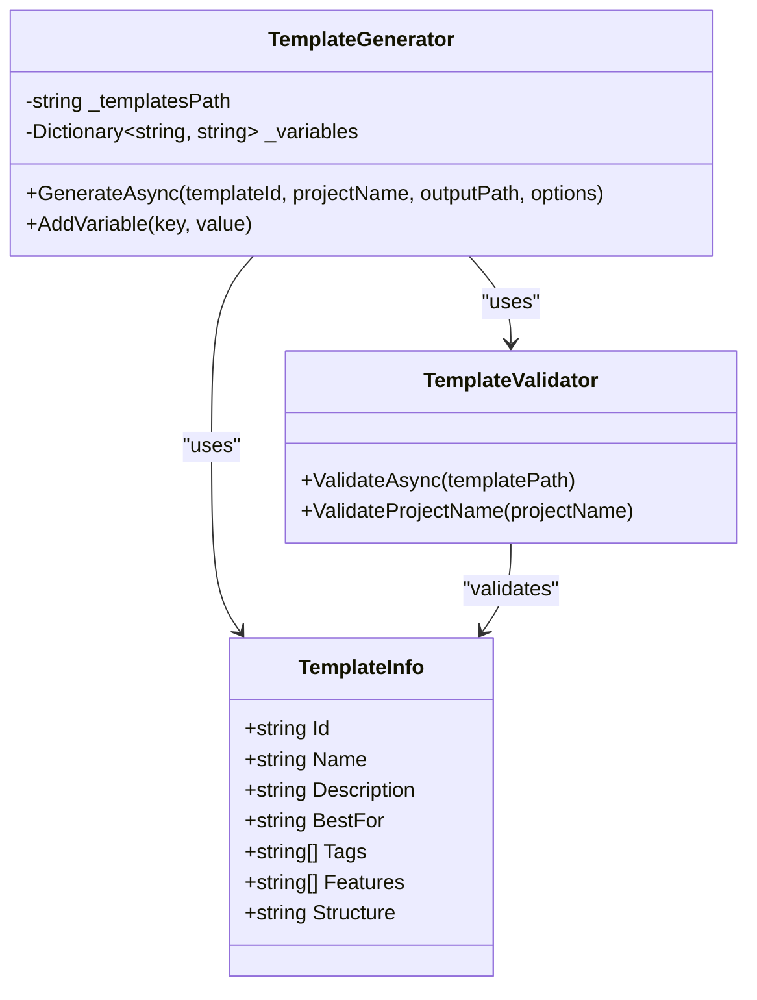
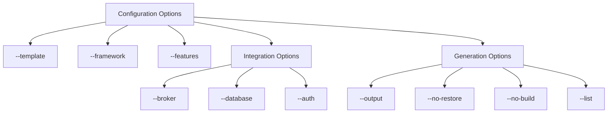
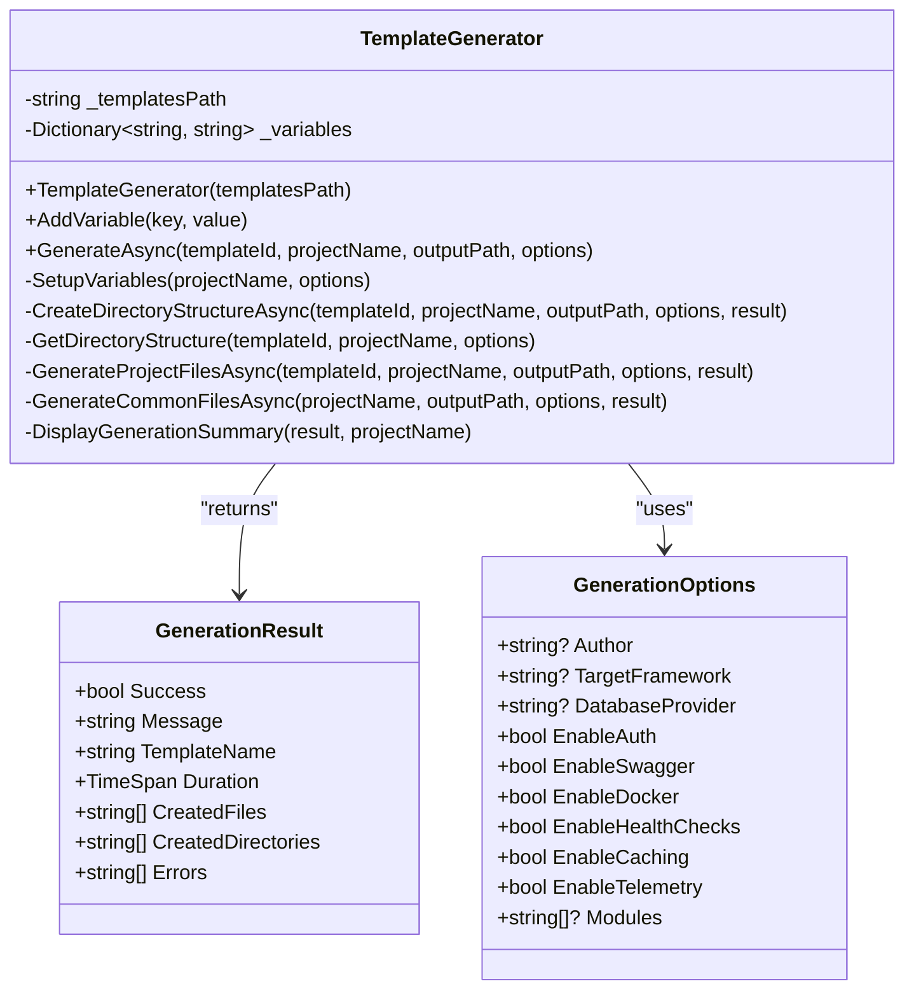
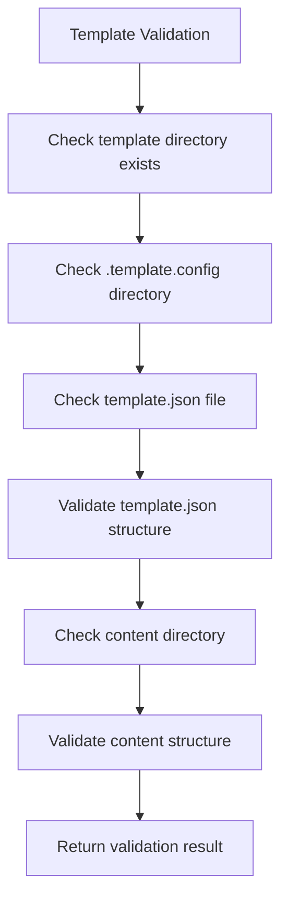
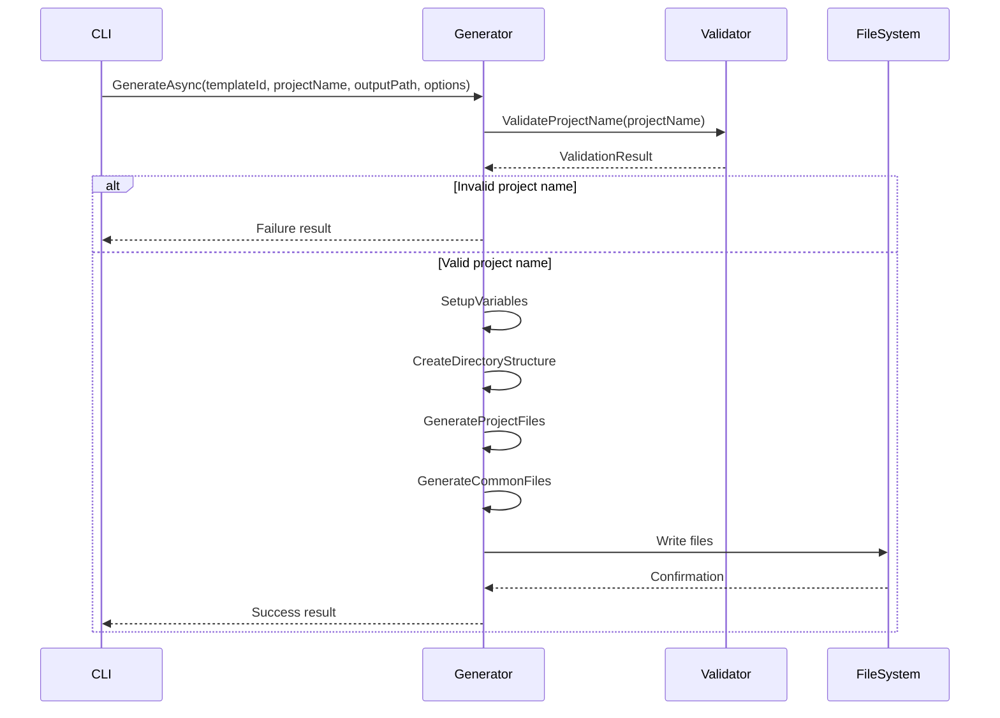
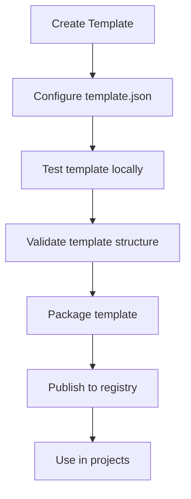

# Project Scaffolding

<cite>
**Referenced Files in This Document**   
- [InitCommand.cs](file://tools/Relay.CLI/Commands/InitCommand.cs)
- [NewCommand.cs](file://tools/Relay.CLI/Commands/NewCommand.cs)
- [ScaffoldCommand.cs](file://tools/Relay.CLI/Commands/ScaffoldCommand.cs)
- [TemplateGenerator.cs](file://tools/Relay.CLI/TemplateEngine/TemplateGenerator.cs)
- [TemplateValidator.cs](file://tools/Relay.CLI/TemplateEngine/TemplateValidator.cs)
- [GenerationOptions.cs](file://tools/Relay.CLI/TemplateEngine/GenerationOptions.cs)
- [TemplateInfo.cs](file://tools/Relay.CLI/Commands/Models/Template/TemplateInfo.cs)
- [README.md](file://tools/Relay.CLI/Templates/README.md)
- [IMPLEMENTATION_GUIDE.md](file://tools/Relay.CLI/Templates/IMPLEMENTATION_GUIDE.md)
</cite>

## Table of Contents
1. [Introduction](#introduction)
2. [Core Commands](#core-commands)
3. [Available Templates](#available-templates)
4. [Template Architecture](#template-architecture)
5. [Configuration Options](#configuration-options)
6. [Template Engine Components](#template-engine-components)
7. [Creating Custom Templates](#creating-custom-templates)
8. [Troubleshooting](#troubleshooting)
9. [Conclusion](#conclusion)

## Introduction

The Relay CLI provides a comprehensive project scaffolding system that enables developers to rapidly create new projects with recommended configurations and architectural patterns. The scaffolding system is built around three core commands: `init`, `new`, and `scaffold`, each serving a specific purpose in the project creation workflow.

The `init` command provides a simple way to initialize a new Relay project with basic scaffolding, while the `new` command offers a more sophisticated template-based approach for creating projects with specific architectures and features. The `scaffold` command allows for generating boilerplate code for individual components within an existing project.

This documentation will explore the implementation details of these commands, the available project templates, their architectures, and how to extend the scaffolding system with custom templates.

**Section sources**
- [InitCommand.cs](file://tools/Relay.CLI/Commands/InitCommand.cs)
- [NewCommand.cs](file://tools/Relay.CLI/Commands/NewCommand.cs)
- [ScaffoldCommand.cs](file://tools/Relay.CLI/Commands/ScaffoldCommand.cs)

## Core Commands

### init Command

The `init` command is designed for quickly setting up a new Relay project with a standard structure. It creates a complete project scaffold with source and test directories, solution files, and basic configuration.



**Diagram sources**
- [InitCommand.cs](file://tools/Relay.CLI/Commands/InitCommand.cs#L32-L114)

The `init` command supports several configuration options:
- `--name`: Project name (required)
- `--template`: Project template (minimal, standard, enterprise)
- `--output`: Output directory
- `--framework`: Target framework (net6.0, net8.0, net9.0)
- `--git`: Initialize git repository
- `--docker`: Include Docker support
- `--ci`: Include CI/CD configuration

These options allow developers to customize the initial project setup according to their requirements.

**Section sources**
- [InitCommand.cs](file://tools/Relay.CLI/Commands/InitCommand.cs#L14-L30)

### new Command

The `new` command is the primary interface for creating projects from templates. It provides access to a rich collection of project templates, each designed for specific use cases and architectural patterns.



**Diagram sources**
- [NewCommand.cs](file://tools/Relay.CLI/Commands/NewCommand.cs#L77-L111)
- [TemplateGenerator.cs](file://tools/Relay.CLI/TemplateEngine/TemplateGenerator.cs#L22-L77)

The `new` command supports a wide range of options for customizing the generated project:
- `--name`: Project name (required)
- `--template`: Template to use (e.g., relay-webapi, relay-microservice)
- `--list`: List all available templates
- `--features`: Features to include (e.g., auth, swagger, docker)
- `--output`: Output directory
- `--broker`: Message broker (rabbitmq, kafka, azureservicebus)
- `--database`: Database provider (sqlserver, postgres, mysql, sqlite)
- `--auth`: Authentication provider (jwt, identityserver, auth0)
- `--no-restore`: Skip restoring NuGet packages
- `--no-build`: Skip building the project

The command first validates the input parameters, then uses the TemplateGenerator to create the project structure and files based on the selected template.

**Section sources**
- [NewCommand.cs](file://tools/Relay.CLI/Commands/NewCommand.cs#L13-L75)

### scaffold Command

The `scaffold` command generates boilerplate code for handlers, requests, and tests within an existing project. This command is particularly useful for maintaining consistency across components and reducing repetitive coding tasks.



**Diagram sources**
- [ScaffoldCommand.cs](file://tools/Relay.CLI/Commands/ScaffoldCommand.cs#L31-L34)

The `scaffold` command supports the following options:
- `--handler`: Handler class name (required)
- `--request`: Request class name (required)
- `--response`: Response class name (optional)
- `--namespace`: Target namespace
- `--output`: Output directory
- `--template`: Template type (standard, minimal, enterprise)
- `--include-tests`: Generate test files
- `--include-validation`: Include validation pipeline

This command generates complete, ready-to-use code files with appropriate using statements, namespaces, and implementation patterns based on the selected template.

**Section sources**
- [ScaffoldCommand.cs](file://tools/Relay.CLI/Commands/ScaffoldCommand.cs#L11-L29)

## Available Templates

The Relay CLI provides a comprehensive collection of project templates designed for different use cases and architectural patterns. These templates can be listed using the `relay new --list` command.



**Diagram sources**
- [TemplateInfo.cs](file://tools/Relay.CLI/Commands/Models/Template/TemplateInfo.cs#L3-L12)
- [TemplateGenerator.cs](file://tools/Relay.CLI/TemplateEngine/TemplateGenerator.cs#L6-L15)
- [TemplateValidator.cs](file://tools/Relay.CLI/TemplateEngine/TemplateValidator.cs#L6-L7)

### relay-webapi Template

The `relay-webapi` template creates a production-ready REST API following Clean Architecture principles. This template is ideal for enterprise REST APIs and backend services.

**Architecture:**
- Clean Architecture layers (Domain, Application, Infrastructure, API)
- CQRS with Relay
- Entity Framework Core
- JWT Authentication (optional)
- Swagger/OpenAPI (optional)
- Docker support (optional)
- Health checks (optional)
- Redis caching (optional)
- OpenTelemetry (optional)
- Complete test suite

**Use Case:** Enterprise REST APIs, backend services, and applications requiring a well-structured, maintainable architecture.

### relay-microservice Template

The `relay-microservice` template creates an event-driven microservice with message broker integration. This template is designed for microservices architectures and event-driven systems.

**Architecture:**
- Event-driven architecture
- Message broker integration (RabbitMQ/Kafka/Azure Service Bus)
- Saga pattern support
- Service discovery
- Circuit breaker & Retry
- Distributed tracing
- Kubernetes ready
- Helm charts

**Use Case:** Microservices architecture, event-driven systems, and applications requiring high scalability and resilience.

### relay-ddd Template

The `relay-ddd` template implements Domain-Driven Design tactical patterns. This template is ideal for complex business domains and enterprise applications.

**Architecture:**
- Aggregates & Entities
- Value Objects
- Domain Events
- Repository Pattern
- Specification Pattern
- Unit of Work
- Rich domain models

**Use Case:** Complex business domains, enterprise applications, and systems with rich business logic.

### relay-cqrs-es Template

The `relay-cqrs-es` template provides a complete CQRS with Event Sourcing implementation. This template is designed for systems requiring a full audit trail.

**Architecture:**
- Full Event Sourcing
- Event Store integration
- Projections
- Snapshots
- Time-travel debugging
- Saga support
- CQRS patterns

**Use Case:** Systems requiring full audit trail, financial applications, and systems where data history is critical.

### relay-modular Template

The `relay-modular` template creates a modular monolith with vertical slice architecture. This template is ideal for applications that may evolve into microservices.

**Architecture:**
- Vertical slice architecture
- Module isolation
- Shared kernel
- Easy migration to microservices
- Feature folders
- Module-level testing

**Use Case:** Starting with a monolith with the option to migrate to microservices, applications requiring clear module boundaries.

### Other Templates

The CLI also provides several other specialized templates:

- **relay-graphql**: GraphQL API with Hot Chocolate
- **relay-grpc**: High-performance gRPC service
- **relay-serverless**: AWS Lambda / Azure Functions
- **relay-blazor**: Full-stack Blazor app
- **relay-maui**: Cross-platform mobile app

Each template is designed with specific features and configurations to support its intended use case.

**Section sources**
- [README.md](file://tools/Relay.CLI/Templates/README.md#L7-L150)
- [IMPLEMENTATION_GUIDE.md](file://tools/Relay.CLI/Templates/IMPLEMENTATION_GUIDE.md#L45-L436)

## Template Architecture

The template system follows a standardized structure that ensures consistency across all templates. Each template is organized in a specific directory structure within the `tools/Relay.CLI/Templates` directory.

```mermaid
erDiagram
TEMPLATE ||--o{ CONFIG : contains
TEMPLATE ||--o{ CONTENT : contains
TEMPLATE ||--o{ SCRIPTS : contains
CONFIG ||--o{ METADATA : contains
CONTENT ||--o{ PROJECT_FILES : contains
class TEMPLATE {
string name
string id
string description
}
class CONFIG {
string path
string type
}
class CONTENT {
string path
string type
}
class SCRIPTS {
string path
string type
}
class METADATA {
string name
string shortName
string identity
string[] classifications
}
class PROJECT_FILES {
string name
string path
string type
}
```

**Diagram sources**
- [README.md](file://tools/Relay.CLI/Templates/README.md#L218-L232)

### Template Structure

Each template follows a consistent structure:

```
templates/
├── template-name/
│   ├── .template.config/
│   │   └── template.json
│   ├── content/
│   │   ├── src/
│   │   ├── tests/
│   │   ├── docs/
│   │   └── README.md
│   └── scripts/
```

- **.template.config/**: Contains template metadata in `template.json`
- **content/**: Contains the actual template files that will be copied to the new project
- **scripts/**: Contains setup scripts that may be executed after project creation

The `content` directory contains the complete project structure that will be replicated when creating a new project from the template.

### Template Metadata

The `template.json` file in the `.template.config` directory contains metadata about the template:

```json
{
  "$schema": "http://json.schemastore.org/template",
  "author": "Your Name",
  "classifications": ["Web", "API", "Custom"],
  "identity": "YourCompany.Templates.MyTemplate",
  "name": "My Custom Template",
  "shortName": "my-template",
  "tags": {
    "language": "C#",
    "type": "project"
  },
  "sourceName": "MyTemplate",
  "symbols": {
    "ProjectName": {
      "type": "parameter",
      "datatype": "string",
      "isRequired": true
    },
    "EnableFeature": {
      "type": "parameter",
      "datatype": "bool",
      "defaultValue": "true"
    }
  }
}
```

This metadata defines the template's properties, including its name, description, tags, and configurable parameters.

**Section sources**
- [README.md](file://tools/Relay.CLI/Templates/README.md#L218-L232)
- [IMPLEMENTATION_GUIDE.md](file://tools/Relay.CLI/Templates/IMPLEMENTATION_GUIDE.md#L499-L527)

## Configuration Options

The scaffolding system supports a wide range of configuration options that allow developers to customize the generated projects according to their specific requirements.

### Template Options

The `--template` option specifies which template to use for project creation. The available templates include:
- `relay-webapi`: Clean Architecture Web API
- `relay-microservice`: Event-Driven Microservice
- `relay-ddd`: Domain-Driven Design
- `relay-cqrs-es`: CQRS + Event Sourcing
- `relay-modular`: Modular Monolith
- `relay-graphql`: GraphQL API
- `relay-grpc`: gRPC Service
- `relay-serverless`: Serverless Functions
- `relay-blazor`: Blazor Application
- `relay-maui`: MAUI Mobile App

### Framework Options

The `--framework` option specifies the target .NET framework version for the project. Supported values include:
- `net6.0`
- `net8.0`
- `net9.0`

This option ensures that the generated project files specify the correct target framework in the project configuration.

### Feature Options

The `--features` option allows developers to include specific features in the generated project. Available features vary by template but commonly include:
- `auth`: Authentication and authorization
- `swagger`: Swagger/OpenAPI documentation
- `docker`: Docker support
- `ci`: CI/CD configuration
- `healthchecks`: Health checks
- `caching`: Caching support
- `telemetry`: OpenTelemetry integration

Multiple features can be specified by separating them with commas:
```bash
relay new --name MyApi --template relay-webapi --features "auth,swagger,docker"
```

### Integration Options

Several options allow for integration with specific technologies:

- `--broker`: Specifies the message broker (rabbitmq, kafka, azureservicebus)
- `--database`: Specifies the database provider (sqlserver, postgres, mysql, sqlite)
- `--auth`: Specifies the authentication provider (jwt, identityserver, auth0)

These options configure the project with the appropriate dependencies and settings for the selected technologies.

### Generation Options

Additional options control the project generation process:
- `--output`: Specifies the output directory for the generated project
- `--no-restore`: Skips restoring NuGet packages after project creation
- `--no-build`: Skips building the project after creation
- `--list`: Lists all available templates instead of creating a project

These options provide flexibility in the project creation workflow, allowing developers to integrate the scaffolding process into their existing development practices.



**Diagram sources**
- [NewCommand.cs](file://tools/Relay.CLI/Commands/NewCommand.cs#L15-L65)
- [InitCommand.cs](file://tools/Relay.CLI/Commands/InitCommand.cs#L16-L23)

**Section sources**
- [GenerationOptions.cs](file://tools/Relay.CLI/TemplateEngine/GenerationOptions.cs#L3-L15)

## Template Engine Components

The scaffolding system is built on a modular architecture with several key components that work together to create projects from templates.

### TemplateGenerator

The `TemplateGenerator` class is responsible for creating projects from templates. It handles the entire generation process, from creating the directory structure to generating the project files.



**Diagram sources**
- [TemplateGenerator.cs](file://tools/Relay.CLI/TemplateEngine/TemplateGenerator.cs#L6-L15)

The `TemplateGenerator` follows a structured process:
1. Validates the project name using `TemplateValidator`
2. Sets up variables for template replacement
3. Creates the directory structure based on the template
4. Generates project files specific to the template
5. Creates common files like README and .gitignore
6. Displays a summary of the generation process

The generator supports different directory structures for different templates, such as Clean Architecture for web APIs, microservice architecture, and DDD patterns.

### TemplateValidator

The `TemplateValidator` class ensures that templates are correctly structured and that project names are valid.



**Diagram sources**
- [TemplateValidator.cs](file://tools/Relay.CLI/TemplateEngine/TemplateValidator.cs#L8-L10)

The validator performs several checks:
- Verifies that the template directory exists
- Ensures the `.template.config` directory is present
- Confirms the `template.json` file exists and is valid
- Checks for a content directory with project files
- Validates the project name for invalid characters

This ensures that templates are properly structured and that generated projects will be valid.

### Component Relationships

The template engine components work together in a coordinated manner:



**Diagram sources**
- [TemplateGenerator.cs](file://tools/Relay.CLI/TemplateEngine/TemplateGenerator.cs#L22-L77)
- [TemplateValidator.cs](file://tools/Relay.CLI/TemplateEngine/TemplateValidator.cs#L30-L38)

The `TemplateGenerator` orchestrates the entire process, using the `TemplateValidator` to ensure input validity and interacting with the file system to create the necessary directories and files.

**Section sources**
- [TemplateGenerator.cs](file://tools/Relay.CLI/TemplateEngine/TemplateGenerator.cs#L6-L831)
- [TemplateValidator.cs](file://tools/Relay.CLI/TemplateEngine/TemplateValidator.cs#L6-L188)
- [GenerationOptions.cs](file://tools/Relay.CLI/TemplateEngine/GenerationOptions.cs#L3-L15)

## Creating Custom Templates

The Relay CLI provides tools for creating and managing custom templates, allowing organizations and developers to define their own project structures and best practices.

### Creating a Template

To create a custom template, start with an existing project that represents your desired structure:

```bash
relay template create --name my-template --from ./MyProject
```

This command creates a new template directory with the following structure:
```
Templates/my-template/
├── .template.config/
│   └── template.json
└── content/
    └── [your project files]
```

### Configuring template.json

The `template.json` file defines the template's metadata and parameters:

```json
{
  "$schema": "http://json.schemastore.org/template",
  "author": "Your Name",
  "classifications": ["Web", "API", "Custom"],
  "identity": "YourCompany.Templates.MyTemplate",
  "name": "My Custom Template",
  "shortName": "my-template",
  "tags": {
    "language": "C#",
    "type": "project"
  },
  "sourceName": "MyTemplate",
  "symbols": {
    "ProjectName": {
      "type": "parameter",
      "datatype": "string",
      "isRequired": true
    },
    "EnableFeature": {
      "type": "parameter",
      "datatype": "bool",
      "defaultValue": "true"
    }
  }
}
```

Key properties include:
- `name`: The display name of the template
- `shortName`: The command-line identifier for the template
- `classifications`: Categories for the template
- `symbols`: Configurable parameters for the template

### Testing and Validation

Before publishing a template, it should be tested and validated:

```bash
# Test the template locally
relay template test --path ./Templates/my-template

# Validate the template structure
relay template validate --path ./Templates/my-template
```

These commands ensure that the template is properly structured and will work correctly when used to create projects.

### Publishing Templates

Once a template is ready, it can be packaged and published:

```bash
# Package the template
relay template pack --path ./Templates/my-template

# Publish to a registry
relay template publish --name my-template --registry https://your-registry.com
```

Published templates can then be used by other developers in their projects.



**Diagram sources**
- [IMPLEMENTATION_GUIDE.md](file://tools/Relay.CLI/Templates/IMPLEMENTATION_GUIDE.md#L484-L547)

**Section sources**
- [README.md](file://tools/Relay.CLI/Templates/README.md#L180-L216)
- [IMPLEMENTATION_GUIDE.md](file://tools/Relay.CLI/Templates/IMPLEMENTATION_GUIDE.md#L484-L547)

## Troubleshooting

When working with the project scaffolding system, several common issues may arise. This section provides guidance on identifying and resolving these issues.

### Template Resolution Failures

If a template cannot be found, verify the following:

1. Check the template name spelling:
```bash
relay new --list
```

2. Ensure the template directory exists in `tools/Relay.CLI/Templates/`

3. Verify the template has a valid `.template.config/template.json` file

4. Check that the `shortName` in `template.json` matches the command-line name

### Generation Errors

Common generation errors and their solutions:

- **Directory already exists**: Specify a different project name or output directory
- **Invalid project name**: Use a name without special characters or spaces
- **Permission denied**: Run the CLI with appropriate permissions
- **Network issues**: Ensure internet connectivity for package restoration

### Configuration Issues

If the generated project has configuration problems:

1. Verify the `GenerationOptions` are correctly set
2. Check that the template supports the requested features
3. Ensure the target framework is installed
4. Validate that database providers are correctly specified

### Debugging Tips

For troubleshooting scaffolding issues:

1. Use the `--verbose` flag if available to get detailed output
2. Check the CLI version with `relay --version`
3. Verify the Relay CLI installation is complete
4. Examine the generated files for unexpected content
5. Review the template structure for missing files

The most common issues are related to template configuration and file paths. Always validate templates before use and ensure that all required dependencies are available.

**Section sources**
- [TemplateValidator.cs](file://tools/Relay.CLI/TemplateEngine/TemplateValidator.cs#L144-L186)
- [InitCommand.cs](file://tools/Relay.CLI/Commands/InitCommand.cs#L56-L59)
- [NewCommand.cs](file://tools/Relay.CLI/Commands/NewCommand.cs#L179-L183)

## Conclusion

The Relay CLI's project scaffolding system provides a powerful and flexible way to create new projects with recommended configurations and architectural patterns. Through the `init`, `new`, and `scaffold` commands, developers can quickly set up projects ranging from simple applications to complex enterprise systems.

The system's rich collection of templates, including `relay-webapi`, `relay-microservice`, `relay-ddd`, and others, enables developers to start with proven architectural patterns and best practices. The template engine, built on the `TemplateGenerator` and `TemplateValidator` components, ensures consistent and reliable project creation.

By understanding the available configuration options and learning how to create custom templates, developers and organizations can extend the scaffolding system to meet their specific needs. This not only accelerates project setup but also promotes consistency and quality across projects.

The scaffolding system represents a significant productivity enhancement, reducing the time and effort required to start new projects while ensuring they follow recommended practices from the beginning.