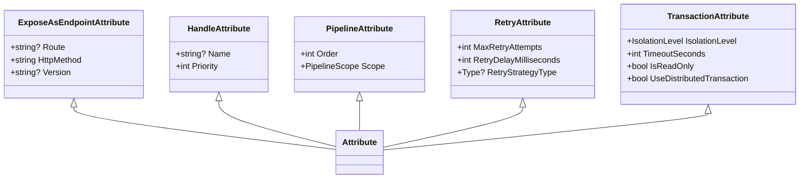
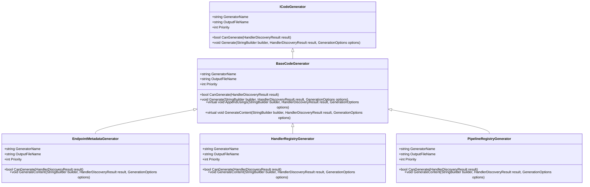
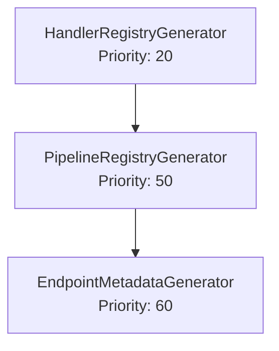
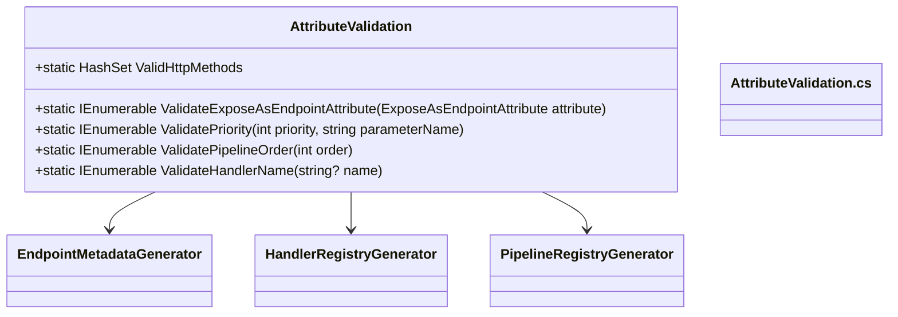

# Attribute-Based Configuration

<cite>
**Referenced Files in This Document**   
- [ExposeAsEndpointAttribute.cs](file://src/Relay.Core/Attributes/ExposeAsEndpointAttribute.cs)
- [HandleAttribute.cs](file://src/Relay.Core/Attributes/HandleAttribute.cs)
- [PipelineAttribute.cs](file://src/Relay.Core/Attributes/PipelineAttribute.cs)
- [RetryAttribute.cs](file://src/Relay.Core/Retry/RetryAttribute.cs)
- [TransactionAttribute.cs](file://src/Relay.Core/Transactions/TransactionAttribute.cs)
- [EndpointMetadataGenerator.cs](file://src/Relay.SourceGenerator/Generators/EndpointMetadataGenerator.cs)
- [HandlerRegistryGenerator.cs](file://src/Relay.SourceGenerator/Generators/HandlerRegistryGenerator.cs)
- [PipelineRegistryGenerator.cs](file://src/Relay.SourceGenerator/Generators/PipelineRegistryGenerator.cs)
- [AttributeValidation.cs](file://src/Relay.Core/Attributes/AttributeValidation.cs)
- [Program.cs](file://samples/Relay.MinimalApiSample/Program.cs)
- [ProductsController.cs](file://samples/Relay.ControllerApiSample/Controllers/ProductsController.cs)
</cite>

## Table of Contents
1. [Introduction](#introduction)
2. [Core Attributes Overview](#core-attributes-overview)
3. [ExposeAsEndpointAttribute](#exposeasendpointattribute)
4. [HandleAttribute](#handleattribute)
5. [PipelineAttribute](#pipelineattribute)
6. [RetryAttribute](#retryattribute)
7. [TransactionAttribute](#transactionattribute)
8. [Source Generator Processing](#source-generator-processing)
9. [Attribute Validation and Conflict Detection](#attribute-validation-and-conflict-detection)
10. [Practical Usage Examples](#practical-usage-examples)
11. [Common Issues and Solutions](#common-issues-and-solutions)
12. [Advanced Scenarios](#advanced-scenarios)
13. [Conclusion](#conclusion)

## Introduction

The Relay framework provides a powerful attribute-based configuration system that enables developers to declaratively configure handler behavior directly on classes and methods. This approach eliminates the need for verbose configuration code while providing compile-time safety and optimized runtime performance. The framework leverages source generators to process these attributes at compile time, generating optimized code that enhances application performance and reduces runtime overhead.

This document provides comprehensive documentation on the attribute-based configuration system in Relay, focusing on key attributes such as ExposeAsEndpointAttribute, HandleAttribute, PipelineAttribute, RetryAttribute, and TransactionAttribute. It explains how to use these attributes to control routing, pipeline behavior, retry policies, and transaction management, with practical examples from the codebase. The document also covers how the source generator processes these attributes and addresses common issues such as attribute conflicts.

**Section sources**
- [ExposeAsEndpointAttribute.cs](file://src/Relay.Core/Attributes/ExposeAsEndpointAttribute.cs)
- [HandleAttribute.cs](file://src/Relay.Core/Attributes/HandleAttribute.cs)
- [PipelineAttribute.cs](file://src/Relay.Core/Attributes/PipelineAttribute.cs)

## Core Attributes Overview

The Relay framework provides several attributes that allow developers to configure handler behavior declaratively. These attributes are processed by the source generator at compile time to generate optimized code for request routing, pipeline behavior, and other cross-cutting concerns.

The core attributes include:
- **ExposeAsEndpointAttribute**: Marks handlers for automatic HTTP endpoint generation
- **HandleAttribute**: Marks methods as request handlers and provides naming and priority configuration
- **PipelineAttribute**: Marks methods as pipeline behaviors with execution order and scope configuration
- **RetryAttribute**: Applies retry logic to handlers or requests
- **TransactionAttribute**: Provides declarative transaction configuration for transactional requests

These attributes work together to create a flexible and powerful configuration system that enables both simple and complex scenarios while maintaining compile-time safety.



**Diagram sources**
- [ExposeAsEndpointAttribute.cs](file://src/Relay.Core/Attributes/ExposeAsEndpointAttribute.cs#L8-L25)
- [HandleAttribute.cs](file://src/Relay.Core/Attributes/HandleAttribute.cs#L8-L20)
- [PipelineAttribute.cs](file://src/Relay.Core/Attributes/PipelineAttribute.cs#L8-L20)
- [RetryAttribute.cs](file://src/Relay.Core/Retry/RetryAttribute.cs#L9-L10)
- [TransactionAttribute.cs](file://src/Relay.Core/Transactions/TransactionAttribute.cs#L23-L24)

## ExposeAsEndpointAttribute

The `ExposeAsEndpointAttribute` is used to mark handlers for automatic HTTP endpoint generation. This attribute enables the framework to automatically create REST API endpoints from handler methods, eliminating the need for manual controller routing configuration.

### Properties
- **Route**: Gets or sets the route template for the endpoint. If not specified, a default route is generated based on the request type name.
- **HttpMethod**: Gets or sets the HTTP method for the endpoint (default: "POST").
- **Version**: Gets or sets the version of the endpoint for API versioning.

### Usage Example
```csharp
[ExposeAsEndpoint(Route = "/products", HttpMethod = "GET")]
public async Task<GetAllProductsResponse> HandleAsync(GetAllProductsRequest request)
{
    // Handler implementation
}
```

The source generator processes this attribute to generate endpoint metadata registration code, which is used by the framework to register the endpoint with the web server. The generator extracts attribute values and creates appropriate route configurations, including support for API versioning.

When no route is specified, the framework generates a default route by:
1. Removing common suffixes like "Request", "Command", or "Query" from the request type name
2. Converting the name to kebab-case (lowercase with hyphens)
3. Prefixing with a forward slash

For example, a request type named `CreateProductCommand` would generate a default route of `/create-product`.

**Section sources**
- [ExposeAsEndpointAttribute.cs](file://src/Relay.Core/Attributes/ExposeAsEndpointAttribute.cs)
- [EndpointMetadataGenerator.cs](file://src/Relay.SourceGenerator/Generators/EndpointMetadataGenerator.cs)

## HandleAttribute

The `HandleAttribute` is used to mark methods as request handlers and provides configuration options for handler naming and priority. This attribute is essential for the framework's request routing system, enabling both simple and advanced routing scenarios.

### Properties
- **Name**: Gets or sets the name of the handler. This enables named handler resolution, allowing multiple handlers for the same request type with different names.
- **Priority**: Gets or sets the priority of the handler. Higher values indicate higher priority, which determines the execution order when multiple handlers are registered for the same request.

### Usage Examples

#### Basic Usage
```csharp
[Handle]
public async Task<CreateUserResponse> HandleAsync(CreateUserRequest request)
{
    // Handler implementation
}
```

#### Named Handler
```csharp
[Handle(Name = "Admin")]
public async Task<CreateUserResponse> HandleAsync(CreateUserRequest request)
{
    // Admin-specific handler implementation
}
```

#### Priority Configuration
```csharp
[Handle(Priority = 100)]
public async Task<CreateUserResponse> HandleAsync(CreateUserRequest request)
{
    // High-priority handler implementation
}
```

The source generator processes the `HandleAttribute` to generate handler registry code that includes the handler's name and priority. This information is used at runtime to resolve the appropriate handler for a given request, either by name or by priority when multiple handlers exist for the same request type.

**Section sources**
- [HandleAttribute.cs](file://src/Relay.Core/Attributes/HandleAttribute.cs)
- [HandlerRegistryGenerator.cs](file://src/Relay.SourceGenerator/Generators/HandlerRegistryGenerator.cs)

## PipelineAttribute

The `PipelineAttribute` is used to mark methods as pipeline behaviors, which are executed before or after the main handler logic. Pipeline behaviors enable cross-cutting concerns such as logging, validation, and performance monitoring to be implemented in a reusable and composable way.

### Properties
- **Order**: Gets or sets the execution order of the pipeline behavior. Lower values execute first.
- **Scope**: Gets or sets the scope of the pipeline behavior (default: PipelineScope.All).

### Usage Examples

#### Basic Pipeline Behavior
```csharp
[Pipeline(Order = 1)]
public async ValueTask<TResponse> HandleAsync<TRequest, TResponse>(
    TRequest request, 
    RequestHandlerDelegate<TResponse> next, 
    CancellationToken cancellationToken)
{
    // Pre-processing logic
    var result = await next();
    // Post-processing logic
    return result;
}
```

#### Scoped Pipeline Behavior
```csharp
[Pipeline(Order = 2, Scope = PipelineScope.Requests)]
public async ValueTask<TResponse> HandleAsync<TRequest, TResponse>(
    TRequest request, 
    RequestHandlerDelegate<TResponse> next, 
    CancellationToken cancellationToken)
{
    // Logic specific to request handlers
    return await next();
}
```

The source generator processes the `PipelineAttribute` to generate pipeline registry code that includes the behavior's order and scope. At runtime, the framework uses this information to build a pipeline of behaviors that are executed in the specified order around the main handler logic.

The `PipelineScope` enumeration defines different scopes for pipeline behaviors:
- **All**: Applies to all handler types
- **Requests**: Applies only to request handlers
- **Notifications**: Applies only to notification handlers
- **Streams**: Applies only to stream handlers

This scoping mechanism allows developers to create specialized pipeline behaviors that only apply to specific types of handlers.

**Section sources**
- [PipelineAttribute.cs](file://src/Relay.Core/Attributes/PipelineAttribute.cs)
- [PipelineRegistryGenerator.cs](file://src/Relay.SourceGenerator/Generators/PipelineRegistryGenerator.cs)

## RetryAttribute

The `RetryAttribute` is used to apply retry logic to handlers or requests that may fail due to transient faults. This attribute enables resilient applications by automatically retrying failed operations according to configurable policies.

### Properties
- **MaxRetryAttempts**: Gets the maximum number of retry attempts.
- **RetryDelayMilliseconds**: Gets the retry delay in milliseconds between attempts.
- **RetryStrategyType**: Gets the retry strategy type for custom retry strategies.

### Constructors
The `RetryAttribute` provides two constructors to support different retry scenarios:

#### Fixed Delay Retry
```csharp
public RetryAttribute(int maxRetryAttempts, int retryDelayMilliseconds = 1000)
```

#### Custom Retry Strategy
```csharp
public RetryAttribute(Type retryStrategyType, int maxRetryAttempts = 3)
```

### Usage Examples

#### Fixed Delay Retry
```csharp
[Retry(3, 1000)]
public async Task<CreateOrderResponse> HandleAsync(CreateOrderRequest request)
{
    // Handler implementation that may experience transient failures
}
```

#### Custom Retry Strategy
```csharp
[Retry(typeof(ExponentialBackoffRetryStrategy), 5)]
public async Task<CreateOrderResponse> HandleAsync(CreateOrderRequest request)
{
    // Handler implementation with exponential backoff retry
}
```

The framework validates the attribute parameters at construction time:
- `maxRetryAttempts` must be a positive number
- `retryDelayMilliseconds` must be a non-negative number
- For custom strategies, the type must implement `IRetryStrategy`

The source generator processes the `RetryAttribute` to generate appropriate retry pipeline behavior code that wraps the handler execution with the specified retry policy. This ensures that failed operations are automatically retried according to the configured policy, improving application resilience.

**Section sources**
- [RetryAttribute.cs](file://src/Relay.Core/Retry/RetryAttribute.cs)
- [PipelineRegistryGenerator.cs](file://src/Relay.SourceGenerator/Generators/PipelineRegistryGenerator.cs)

## TransactionAttribute

The `TransactionAttribute` provides declarative transaction configuration for transactional requests. This attribute is required on all types implementing `ITransactionalRequest` and ensures that database operations are executed within appropriate transaction boundaries.

### Properties
- **IsolationLevel**: Gets the isolation level for the transaction (required, cannot be Unspecified).
- **TimeoutSeconds**: Gets or sets the transaction timeout in seconds (default: 30).
- **IsReadOnly**: Gets or sets whether this is a read-only transaction.
- **UseDistributedTransaction**: Gets or sets whether to use distributed transaction coordination.

### Usage Example
```csharp
[Transaction(IsolationLevel.ReadCommitted, TimeoutSeconds = 30)]
public record CreateOrderCommand : IRequest<OrderResult>, ITransactionalRequest;
```

### Validation Rules
The `TransactionAttribute` enforces several validation rules to ensure proper transaction configuration:

1. **Isolation Level**: Must be explicitly specified and cannot be `IsolationLevel.Unspecified`. This ensures developers make conscious decisions about transaction isolation behavior.

2. **Timeout**: 
   - Default is 30 seconds
   - Can be disabled by setting to 0 or -1 (infinite)
   - Cannot be less than -1

3. **Read-Only and Distributed Transactions**: Cannot be used together. A transaction cannot be both read-only and distributed.

4. **Validation Method**: The `Validate()` method performs runtime validation of the attribute configuration and throws `InvalidOperationException` if the configuration is invalid.

### Advanced Scenarios

#### Read-Only Transaction
```csharp
[Transaction(IsolationLevel.ReadCommitted, IsReadOnly = true)]
public record GetOrderQuery : IRequest<OrderResponse>, ITransactionalRequest;
```

#### Distributed Transaction
```csharp
[Transaction(IsolationLevel.Serializable, UseDistributedTransaction = true)]
public record TransferFundsCommand : IRequest<TransferResult>, ITransactionalRequest;
```

The source generator processes the `TransactionAttribute` to generate transaction management code that ensures the handler executes within the specified transaction context. This includes setting the appropriate isolation level, timeout, and transaction type (regular or distributed).

**Section sources**
- [TransactionAttribute.cs](file://src/Relay.Core/Transactions/TransactionAttribute.cs)
- [PipelineRegistryGenerator.cs](file://src/Relay.SourceGenerator/Generators/PipelineRegistryGenerator.cs)

## Source Generator Processing

The Relay framework uses a source generator to process attributes at compile time and generate optimized code for request routing, pipeline behavior, and other cross-cutting concerns. This approach provides several benefits:

- **Compile-time Safety**: Configuration errors are detected at compile time rather than runtime
- **Performance**: Generated code is optimized and eliminates runtime reflection overhead
- **Reduced Boilerplate**: Eliminates the need for manual registration and configuration code

### Generator Architecture

The source generator follows a strategy pattern with multiple generator classes, each responsible for a specific aspect of code generation:



**Diagram sources**
- [EndpointMetadataGenerator.cs](file://src/Relay.SourceGenerator/Generators/EndpointMetadataGenerator.cs#L13-L328)
- [HandlerRegistryGenerator.cs](file://src/Relay.SourceGenerator/Generators/HandlerRegistryGenerator.cs#L12-L320)
- [PipelineRegistryGenerator.cs](file://src/Relay.SourceGenerator/Generators/PipelineRegistryGenerator.cs#L16-L471)

### Generation Process

The source generation process follows these steps:

1. **Discovery**: The framework discovers all handler methods and their attributes using Roslyn syntax and semantic analysis.

2. **Validation**: Attribute configurations are validated for correctness and consistency.

3. **Code Generation**: Each generator produces source code for its specific responsibility:
   - `HandlerRegistryGenerator`: Generates code for request routing and handler resolution
   - `PipelineRegistryGenerator`: Generates code for pipeline behavior registration and execution
   - `EndpointMetadataGenerator`: Generates code for HTTP endpoint registration

4. **Compilation**: The generated code is compiled with the application, creating a single assembly with optimized routing and pipeline logic.

### Priority-Based Execution

Generators execute in a specific order based on their priority:



**Diagram sources**
- [HandlerRegistryGenerator.cs](file://src/Relay.SourceGenerator/Generators/HandlerRegistryGenerator.cs#L28)
- [PipelineRegistryGenerator.cs](file://src/Relay.SourceGenerator/Generators/PipelineRegistryGenerator.cs#L32)
- [EndpointMetadataGenerator.cs](file://src/Relay.SourceGenerator/Generators/EndpointMetadataGenerator.cs#L31)

This priority system ensures that dependencies are resolved correctly, with lower-level infrastructure (handler registry) generated before higher-level concerns (endpoints).

**Section sources**
- [EndpointMetadataGenerator.cs](file://src/Relay.SourceGenerator/Generators/EndpointMetadataGenerator.cs)
- [HandlerRegistryGenerator.cs](file://src/Relay.SourceGenerator/Generators/HandlerRegistryGenerator.cs)
- [PipelineRegistryGenerator.cs](file://src/Relay.SourceGenerator/Generators/PipelineRegistryGenerator.cs)

## Attribute Validation and Conflict Detection

The Relay framework includes comprehensive validation mechanisms to ensure attribute configurations are correct and consistent. These validations occur at both compile time and runtime to provide maximum safety and reliability.

### Validation Architecture

The validation system consists of several components:



**Diagram sources**
- [AttributeValidation.cs](file://src/Relay.Core/Attributes/AttributeValidation.cs)
- [EndpointMetadataGenerator.cs](file://src/Relay.SourceGenerator/Generators/EndpointMetadataGenerator.cs)
- [HandlerRegistryGenerator.cs](file://src/Relay.SourceGenerator/Generators/HandlerRegistryGenerator.cs)
- [PipelineRegistryGenerator.cs](file://src/Relay.SourceGenerator/Generators/PipelineRegistryGenerator.cs)

### Validation Rules

#### ExposeAsEndpointAttribute Validation
- **HTTP Method**: Must be one of: GET, POST, PUT, DELETE, PATCH, HEAD, OPTIONS
- **Route**: Cannot contain consecutive forward slashes (//) or whitespace characters
- **Route**: Should not end with a trailing slash unless it's the root route
- **Version**: Cannot contain control characters

#### HandleAttribute Validation
- **Priority**: Must be between -10000 and 10000
- **Name**: Cannot exceed 200 characters or contain control characters

#### PipelineAttribute Validation
- **Order**: Must be between -100000 and 100000
- **Scope**: Must be a valid PipelineScope value

#### TransactionAttribute Validation
- **IsolationLevel**: Cannot be Unspecified
- **TimeoutSeconds**: Cannot be less than -1
- **IsReadOnly and UseDistributedTransaction**: Cannot both be true

### Conflict Detection

The framework detects and reports attribute conflicts to prevent ambiguous or contradictory configurations:

1. **Multiple Handlers with Same Name**: When multiple handlers for the same request type have the same name, the framework reports a conflict.

2. **Conflicting Pipeline Orders**: When pipeline behaviors have identical order values, they execute in undefined order, which may lead to unexpected behavior.

3. **Incompatible Transaction Settings**: The combination of IsReadOnly and UseDistributedTransaction is explicitly forbidden.

4. **Attribute Overlap**: Certain attributes cannot be used together on the same method, such as HandleAttribute and PipelineAttribute.

The source generator reports these conflicts as compilation errors, ensuring that configuration issues are caught early in the development process.

**Section sources**
- [AttributeValidation.cs](file://src/Relay.Core/Attributes/AttributeValidation.cs)
- [EndpointMetadataGenerator.cs](file://src/Relay.SourceGenerator/Generators/EndpointMetadataGenerator.cs)
- [HandlerRegistryGenerator.cs](file://src/Relay.SourceGenerator/Generators/HandlerRegistryGenerator.cs)

## Practical Usage Examples

This section provides practical examples of attribute usage from the Relay framework codebase, demonstrating both basic and advanced scenarios.

### Minimal API Example

The MinimalApiSample demonstrates how attributes are used in a minimal API configuration:

```csharp
var builder = WebApplication.CreateBuilder(args);

// Register all handlers and core Relay services (generated by source generator)
builder.Services.AddRelay();

// Add additional Relay features
builder.Services
    .AddRelayValidation()
    .AddRelayPrePostProcessors()
    .AddRelayExceptionHandlers();
```

The `AddRelay()` method registers all handlers discovered by the source generator, which processes the attributes to create the appropriate registrations.

**Section sources**
- [Program.cs](file://samples/Relay.MinimalApiSample/Program.cs)

### Controller API Example

The ControllerApiSample demonstrates how attributes are used with traditional ASP.NET Core controllers:

```csharp
[ApiController]
[Route("api/[controller]")]
[Produces("application/json")]
public class ProductsController : ControllerBase
{
    private readonly IRelay _relay;
    private readonly ILogger<ProductsController> _logger;

    public ProductsController(IRelay relay, ILogger<ProductsController> logger)
    {
        _relay = relay;
        _logger = logger;
    }

    [HttpGet]
    [ProducesResponseType(typeof(GetAllProductsResponse), StatusCodes.Status200OK)]
    public async Task<ActionResult<GetAllProductsResponse>> GetAllProducts(CancellationToken cancellationToken)
    {
        var request = new GetAllProductsRequest();
        var response = await _relay.SendAsync(request, cancellationToken);
        return Ok(response);
    }
}
```

In this example, the controller delegates to the Relay framework for request handling, while the attributes on the handler methods control the actual behavior.

**Section sources**
- [ProductsController.cs](file://samples/Relay.ControllerApiSample/Controllers/ProductsController.cs)

### Advanced Attribute Combinations

The framework supports advanced scenarios where multiple attributes are applied to the same handler:

```csharp
[ExposeAsEndpoint(Route = "/orders", HttpMethod = "POST")]
[Handle(Name = "Standard", Priority = 50)]
[Retry(3, 1000)]
[Transaction(IsolationLevel.ReadCommitted)]
public async Task<CreateOrderResponse> HandleAsync(CreateOrderRequest request)
{
    // Handler implementation
}
```

This handler is configured with:
- HTTP endpoint exposure with custom route and method
- Named handler with medium priority
- Retry policy with 3 attempts and 1 second delay
- Transaction with read committed isolation level

The source generator processes all these attributes and generates the appropriate code to implement the specified behavior.

**Section sources**
- [Program.cs](file://samples/Relay.MinimalApiSample/Program.cs)
- [ProductsController.cs](file://samples/Relay.ControllerApiSample/Controllers/ProductsController.cs)

## Common Issues and Solutions

This section addresses common issues encountered when using attribute-based configuration in the Relay framework and provides solutions.

### Issue 1: Attribute Not Being Processed

**Symptom**: Attributes are not having the expected effect; generated code is missing.

**Causes**:
- Missing `AddRelay()` call in service registration
- Source generator not properly referenced
- Compilation errors preventing source generation

**Solutions**:
1. Ensure `builder.Services.AddRelay()` is called in Program.cs
2. Verify the Relay.SourceGenerator package is referenced
3. Check for compilation errors that might prevent source generation

### Issue 2: HTTP Method Validation Errors

**Symptom**: "HttpMethod 'INVALID' is not valid" error during compilation.

**Cause**: Using an invalid HTTP method in ExposeAsEndpointAttribute.

**Solution**: Use one of the valid HTTP methods: GET, POST, PUT, DELETE, PATCH, HEAD, OPTIONS.

```csharp
// Correct usage
[ExposeAsEndpoint(HttpMethod = "GET")]
public async Task<Response> HandleAsync(Request request)
{
    // Handler implementation
}
```

### Issue 3: Transaction Configuration Conflicts

**Symptom**: "Read-only transactions cannot be used with distributed transactions" error.

**Cause**: Setting both IsReadOnly and UseDistributedTransaction to true.

**Solution**: Choose one transaction type:

```csharp
// Option 1: Read-only transaction
[Transaction(IsolationLevel.ReadCommitted, IsReadOnly = true)]

// Option 2: Distributed transaction
[Transaction(IsolationLevel.Serializable, UseDistributedTransaction = true)]
```

### Issue 4: Pipeline Order Conflicts

**Symptom**: Pipeline behaviors executing in unexpected order.

**Cause**: Multiple pipeline behaviors with the same order value.

**Solution**: Ensure unique order values for critical pipeline behaviors:

```csharp
[Pipeline(Order = 1)] // Authentication
[Pipeline(Order = 2)] // Authorization
[Pipeline(Order = 3)] // Logging
[Pipeline(Order = 4)] // Caching
```

### Issue 5: Handler Priority Conflicts

**Symptom**: Multiple handlers for the same request type executing in unexpected order.

**Cause**: Handlers with the same priority value.

**Solution**: Use distinct priority values to ensure predictable execution order:

```csharp
[Handle(Priority = 100)] // High priority handler
[Handle(Priority = 50)]  // Medium priority handler  
[Handle(Priority = 10)]  // Low priority handler
```

**Section sources**
- [AttributeValidation.cs](file://src/Relay.Core/Attributes/AttributeValidation.cs)
- [TransactionAttribute.cs](file://src/Relay.Core/Transactions/TransactionAttribute.cs)
- [PipelineRegistryGenerator.cs](file://src/Relay.SourceGenerator/Generators/PipelineRegistryGenerator.cs)

## Advanced Scenarios

This section covers advanced scenarios involving multiple attributes on the same handler and complex configuration patterns.

### Scenario 1: Multi-Endpoint Handlers

A single handler can be exposed as multiple endpoints with different routes and HTTP methods:

```csharp
[ExposeAsEndpoint(Route = "/products", HttpMethod = "POST")]
[ExposeAsEndpoint(Route = "/products/batch", HttpMethod = "PUT")]
[Transaction(IsolationLevel.ReadCommitted)]
public async Task<CreateProductsResponse> HandleAsync(CreateProductsRequest request)
{
    // Handler implementation
}
```

The source generator creates separate endpoint metadata for each ExposeAsEndpointAttribute, allowing the same handler logic to be accessed through multiple API endpoints.

### Scenario 2: Layered Retry Policies

Combine different retry strategies for different failure modes:

```csharp
[Retry(typeof(ExponentialBackoffRetryStrategy), 5)]
[Handle(Name = "Primary")]
public async Task<Response> HandleAsync(Request request)
{
    // Primary handler with exponential backoff
}

[Retry(3, 1000)]
[Handle(Name = "Fallback")]
public async Task<Response> HandleAsync(Request request)
{
    // Fallback handler with fixed delay
}
```

This pattern provides resilience against different types of failures, with the primary handler using exponential backoff for transient faults and the fallback handler providing a simpler retry policy.

### Scenario 3: Conditional Pipeline Behaviors

Use pipeline scope to apply behaviors conditionally:

```csharp
[Pipeline(Order = 1, Scope = PipelineScope.Requests)]
public async ValueTask<TResponse> ValidationPipeline<TRequest, TResponse>(
    TRequest request,
    RequestHandlerDelegate<TResponse> next,
    CancellationToken cancellationToken)
{
    // Apply validation only to request handlers
    return await next();
}

[Pipeline(Order = 2, Scope = PipelineScope.Notifications)]
public async ValueTask<TResponse> NotificationPipeline<TRequest, TResponse>(
    TRequest request,
    RequestHandlerDelegate<TResponse> next,
    CancellationToken cancellationToken)
{
    // Apply notification-specific logic
    return await next();
}
```

### Scenario 4: Versioned Endpoints with Transactions

Combine API versioning with transaction management:

```csharp
[ExposeAsEndpoint(Route = "/orders", HttpMethod = "POST", Version = "v1")]
[Transaction(IsolationLevel.ReadCommitted, TimeoutSeconds = 30)]
public async Task<CreateOrderResponse> HandleAsyncV1(CreateOrderRequest request)
{
    // V1 implementation
}

[ExposeAsEndpoint(Route = "/orders", HttpMethod = "POST", Version = "v2")]
[Transaction(IsolationLevel.Serializable, TimeoutSeconds = 60)]
public async Task<CreateOrderResponse> HandleAsyncV2(CreateOrderRequest request)
{
    // V2 implementation with stricter isolation
}
```

These advanced scenarios demonstrate the flexibility and power of the attribute-based configuration system, enabling complex patterns while maintaining clean, readable code.

**Section sources**
- [ExposeAsEndpointAttribute.cs](file://src/Relay.Core/Attributes/ExposeAsEndpointAttribute.cs)
- [HandleAttribute.cs](file://src/Relay.Core/Attributes/HandleAttribute.cs)
- [PipelineAttribute.cs](file://src/Relay.Core/Attributes/PipelineAttribute.cs)
- [TransactionAttribute.cs](file://src/Relay.Core/Transactions/TransactionAttribute.cs)

## Conclusion

The attribute-based configuration system in the Relay framework provides a powerful and flexible way to configure handler behavior declaratively. By using attributes such as ExposeAsEndpointAttribute, HandleAttribute, PipelineAttribute, RetryAttribute, and TransactionAttribute, developers can control routing, pipeline behavior, retry policies, and transaction management directly on classes and methods.

The key benefits of this approach include:

- **Compile-time Safety**: Configuration errors are detected at compile time rather than runtime
- **Performance**: Source generators eliminate runtime reflection overhead by generating optimized code
- **Clean Code**: Declarative configuration keeps code clean and focused on business logic
- **Flexibility**: Support for both simple and complex scenarios with multiple attributes

The source generator processes these attributes at compile time to generate optimized code for request routing, pipeline behavior, and other cross-cutting concerns. This ensures that the framework can efficiently resolve handlers, build execution pipelines, and manage transactions without runtime performance penalties.

When using the attribute-based configuration system, developers should:
- Follow the validation rules for each attribute
- Avoid attribute conflicts by understanding the interaction between different attributes
- Use priority and order values carefully to ensure predictable execution
- Test complex attribute combinations thoroughly

By following these guidelines and leveraging the comprehensive documentation provided, developers can effectively use the attribute-based configuration system to build robust, maintainable, and high-performance applications with the Relay framework.

[No sources needed since this section summarizes without analyzing specific files]