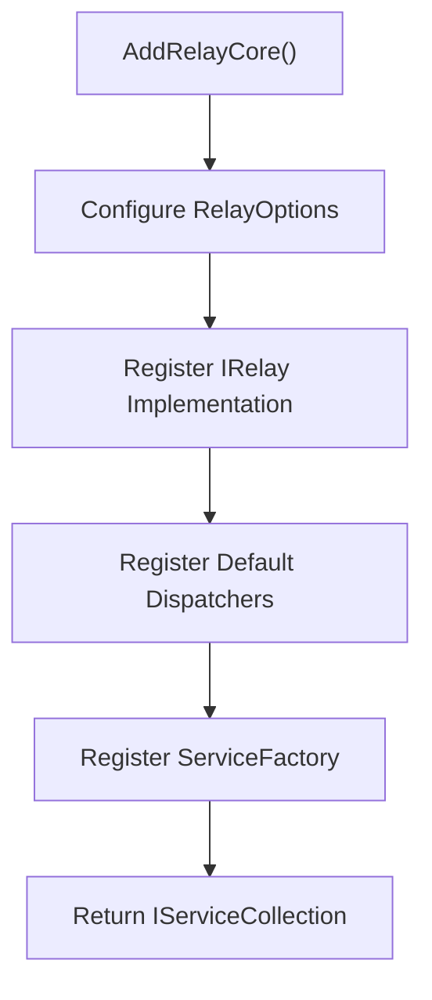
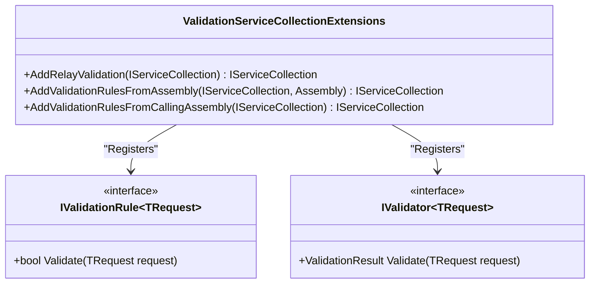
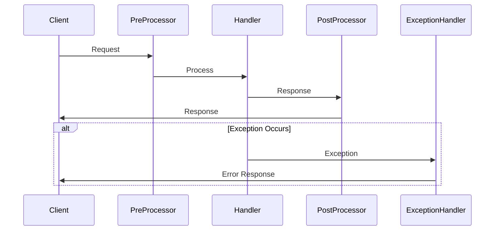
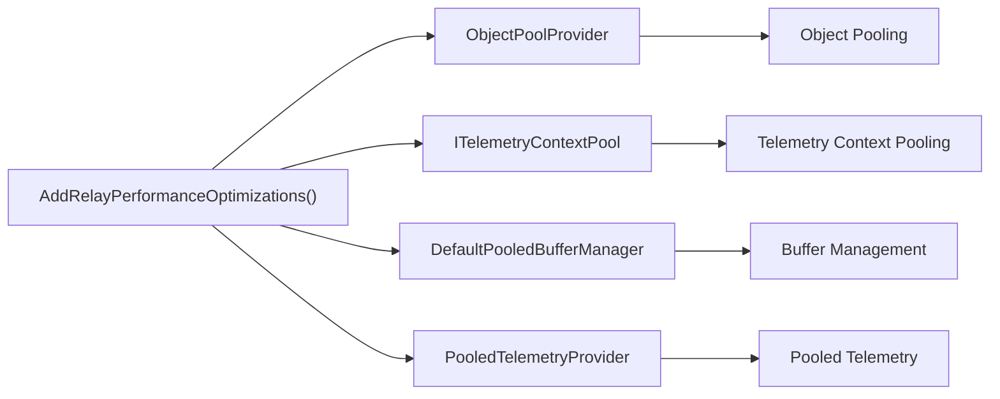
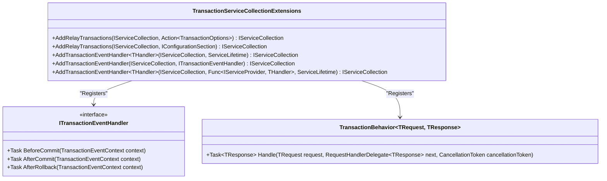
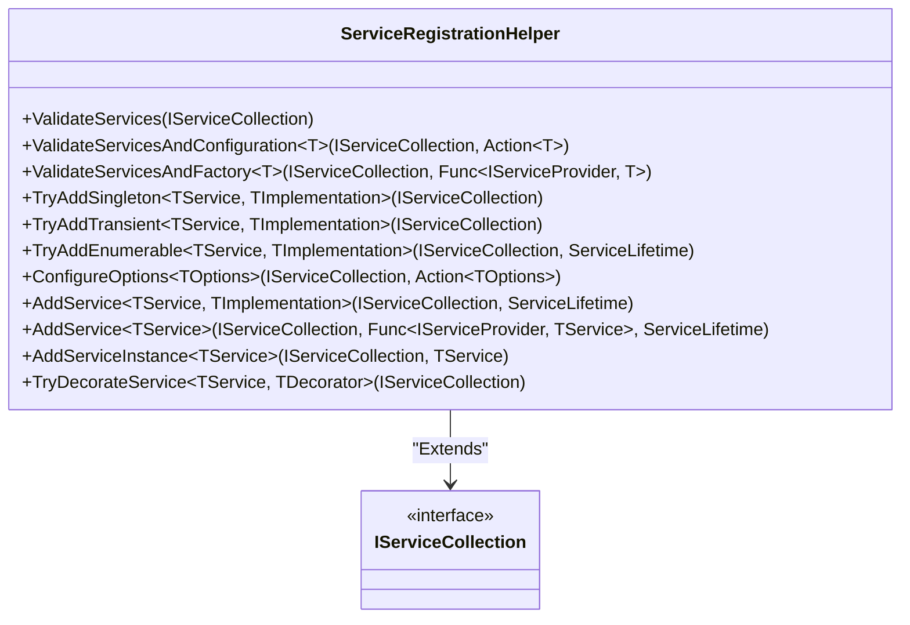

# Code-Based Configuration

<cite>
**Referenced Files in This Document**   
- [RelayServiceCollectionExtensions.cs](file://src/Relay/RelayServiceCollectionExtensions.cs)
- [BaseServiceCollectionExtensions.cs](file://src/Relay.Core/Extensions/BaseServiceCollectionExtensions.cs)
- [ValidationServiceCollectionExtensions.cs](file://src/Relay.Core/Extensions/ValidationServiceCollectionExtensions.cs)
- [PipelineServiceCollectionExtensions.cs](file://src/Relay.Core/Pipeline/Extensions/PipelineServiceCollectionExtensions.cs)
- [PerformanceServiceCollectionExtensions.cs](file://src/Relay.Core/Performance/PerformanceServiceCollectionExtensions.cs)
- [TelemetryServiceCollectionExtensions.cs](file://src/Relay.Core/Telemetry/Extensions/TelemetryServiceCollectionExtensions.cs)
- [TransactionServiceCollectionExtensions.cs](file://src/Relay.Core/Transactions/TransactionServiceCollectionExtensions.cs)
- [ServiceRegistrationHelper.cs](file://src/Relay.Core/Extensions/ServiceRegistrationHelper.cs)
- [MessageQueueOptions.cs](file://src/Relay/Core/Configuration/MessageQueueOptions.cs)
- [Program.cs](file://samples/MinimalApiSample/Program.cs)
- [FLUENT_CONFIGURATION.md](file://docs/MessageBroker/FLUENT_CONFIGURATION.md)
- [CONFIGURATION.md](file://docs/MessageBroker/CONFIGURATION.md)
</cite>

## Table of Contents
1. [Introduction](#introduction)
2. [Core Configuration Methods](#core-configuration-methods)
3. [Feature-Specific Configuration](#feature-specific-configuration)
4. [Dependency Injection Integration](#dependency-injection-integration)
5. [Configuration Patterns and Best Practices](#configuration-patterns-and-best-practices)
6. [Advanced Configuration Scenarios](#advanced-configuration-scenarios)
7. [Common Issues and Solutions](#common-issues-and-solutions)
8. [Conclusion](#conclusion)

## Introduction

The Relay framework provides a comprehensive code-based configuration system through extension methods on IServiceCollection, enabling developers to programmatically configure the framework's various components and features. This approach offers greater flexibility and control compared to configuration file-based approaches, allowing for dynamic configuration based on environment, conditional feature activation, and complex composition scenarios. The configuration system is designed around a modular architecture where different aspects of the framework can be configured independently or as part of comprehensive feature sets.

The code-based configuration system in Relay follows established patterns in the .NET ecosystem, leveraging extension methods to provide a fluent API for service registration and configuration. This design enables developers to chain configuration calls together, creating readable and maintainable configuration code. The system is built on a foundation of reusable helper methods and patterns that ensure consistency across different configuration scenarios while providing the flexibility needed for advanced use cases.

**Section sources**
- [RelayServiceCollectionExtensions.cs](file://src/Relay/RelayServiceCollectionExtensions.cs#L22-L255)

## Core Configuration Methods

The Relay framework provides several core extension methods for configuring the basic framework services. The primary entry point is `AddRelayCore()`, which registers the fundamental services required for the framework to function. This method serves as the foundation for all other configuration methods and ensures that essential services like the IRelay implementation, request dispatchers, and service factory are properly registered in the dependency injection container.



**Diagram sources**
- [RelayServiceCollectionExtensions.cs](file://src/Relay/RelayServiceCollectionExtensions.cs#L214-L240)

In addition to the core method, Relay provides scenario-specific configuration methods through `AddRelayForScenario()`. This method accepts a RelayScenario enum parameter that determines the optimization profile and feature set to apply. The available scenarios include Minimal, WebApi, HighPerformance, EventDriven, and Microservices, each tailored to specific use cases and performance requirements. For example, the HighPerformance scenario enables performance optimizations and AI-driven optimizations, while the Microservices scenario includes transaction support and comprehensive telemetry.

The framework also provides convenience methods like `AddRelayWithFeatures()` and `AddRelayWithAdvancedFeatures()` that combine multiple configuration aspects into single calls. These methods are designed to reduce boilerplate code and ensure consistent configuration across applications. The `AddRelayWithAdvancedFeatures()` method, for instance, includes AI optimization, performance monitoring, and transaction support, making it suitable for production deployments of complex applications.

**Section sources**
- [RelayServiceCollectionExtensions.cs](file://src/Relay/RelayServiceCollectionExtensions.cs#L76-L127)

## Feature-Specific Configuration

### Validation Configuration

The Relay framework provides dedicated extension methods for configuring validation services through the `ValidationServiceCollectionExtensions` class. The primary method, `AddRelayValidation()`, registers the validation pipeline behaviors that enable automatic validation of requests. This method registers both the standard validation behavior and stream validation behavior as transient services, ensuring they are properly integrated into the request processing pipeline.



**Diagram sources**
- [ValidationServiceCollectionExtensions.cs](file://src/Relay.Core/Extensions/ValidationServiceCollectionExtensions.cs#L23-L31)
- [ValidationServiceCollectionExtensions.cs](file://src/Relay.Core/Extensions/ValidationServiceCollectionExtensions.cs#L39-L48)

The validation system also supports automatic discovery and registration of validation rules through `AddValidationRulesFromAssembly()` and `AddValidationRulesFromCallingAssembly()`. These methods scan the specified assembly for types that implement the `IValidationRule<T>` interface and automatically register them with the dependency injection container. This feature enables a convention-based approach to validation where rules are automatically discovered and applied without explicit registration.

### Pipeline Behavior Configuration

Pipeline behaviors in Relay are configured through the `PipelineServiceCollectionExtensions` class, which provides methods for adding various types of pipeline behaviors including pre-processors, post-processors, exception handlers, and exception actions. The `AddRelayPrePostProcessors()` method registers both request pre-processor and post-processor behaviors, enabling cross-cutting concerns to be applied before and after request handling.



**Diagram sources**
- [PipelineServiceCollectionExtensions.cs](file://src/Relay.Core/Pipeline/Extensions/PipelineServiceCollectionExtensions.cs#L22-L31)
- [PipelineServiceCollectionExtensions.cs](file://src/Relay.Core/Pipeline/Extensions/PipelineServiceCollectionExtensions.cs#L38-L50)

The framework provides granular methods for registering specific pipeline behaviors, such as `AddPreProcessor<TRequest, TPreProcessor>()`, `AddPostProcessor<TRequest, TResponse, TPostProcessor>()`, and `AddExceptionHandler<TRequest, TResponse, TException, THandler>()`. These methods allow developers to register custom behaviors for specific request types, enabling targeted cross-cutting concerns. The registration methods support both type-based registration and factory-based registration, providing flexibility in how behaviors are instantiated.

### Performance and Telemetry Configuration

Performance optimization services are configured through the `PerformanceServiceCollectionExtensions` class, which provides methods for adding performance-related services such as object pool providers, telemetry context pools, and buffer managers. The `AddRelayPerformanceOptimizations()` method registers these services as singletons, ensuring they are shared across the application and providing consistent performance benefits.



**Diagram sources**
- [PerformanceServiceCollectionExtensions.cs](file://src/Relay.Core/Performance/PerformanceServiceCollectionExtensions.cs#L24-L40)

Telemetry services are configured through the `TelemetryServiceCollectionExtensions` class, which provides methods for adding metrics providers, telemetry providers, and decorators for existing services. The `AddRelayTelemetry()` method registers the default metrics provider and telemetry provider, and decorates existing dispatchers and the main IRelay interface with telemetry capabilities. This ensures that all framework operations are automatically instrumented for monitoring and observability.

### Transaction Configuration

Transaction services are configured through the `TransactionServiceCollectionExtensions` class, which provides comprehensive methods for setting up the transaction infrastructure. The `AddRelayTransactions()` method registers all transaction-related services including the transaction coordinator, distributed transaction coordinator, event publisher, and configuration resolver. This method also registers the TransactionBehavior as a pipeline behavior, integrating transaction management into the request processing pipeline.



**Diagram sources**
- [TransactionServiceCollectionExtensions.cs](file://src/Relay.Core/Transactions/TransactionServiceCollectionExtensions.cs#L88-L91)
- [TransactionServiceCollectionExtensions.cs](file://src/Relay.Core/Transactions/TransactionServiceCollectionExtensions.cs#L213-L216)

The transaction system also supports event handlers through methods like `AddTransactionEventHandler<THandler>()`, which allows developers to register handlers that respond to transaction lifecycle events such as before commit, after commit, and after rollback. These handlers can be used for cross-cutting concerns like audit logging, cache invalidation, or sending notifications when transactions complete.

**Section sources**
- [ValidationServiceCollectionExtensions.cs](file://src/Relay.Core/Extensions/ValidationServiceCollectionExtensions.cs#L23-L78)
- [PipelineServiceCollectionExtensions.cs](file://src/Relay.Core/Pipeline/Extensions/PipelineServiceCollectionExtensions.cs#L22-L235)
- [PerformanceServiceCollectionExtensions.cs](file://src/Relay.Core/Performance/PerformanceServiceCollectionExtensions.cs#L24-L67)
- [TelemetryServiceCollectionExtensions.cs](file://src/Relay.Core/Telemetry/Extensions/TelemetryServiceCollectionExtensions.cs#L21-L113)
- [TransactionServiceCollectionExtensions.cs](file://src/Relay.Core/Transactions/TransactionServiceCollectionExtensions.cs#L88-L448)

## Dependency Injection Integration

The Relay framework's configuration system is deeply integrated with the .NET dependency injection container, leveraging its capabilities to manage service lifetimes, resolve dependencies, and support various registration patterns. The framework uses a combination of TryAdd methods and Add methods to ensure proper service registration while avoiding conflicts with existing registrations.

The `ServiceRegistrationHelper` class provides a set of utility methods that encapsulate common service registration patterns, ensuring consistency across the various extension methods. These helpers include methods like `TryAddSingleton<TService, TImplementation>()`, `TryAddTransient<TService, TImplementation>()`, and `TryAddEnumerable<TService, TImplementation>()`, which safely register services only if they haven't already been registered.



**Diagram sources**
- [ServiceRegistrationHelper.cs](file://src/Relay.Core/Extensions/ServiceRegistrationHelper.cs#L13-L392)

The framework supports multiple service registration patterns, including:

1. **Type-based registration**: Registering services by specifying the service and implementation types
2. **Factory-based registration**: Registering services with a factory function that resolves dependencies from the service provider
3. **Instance-based registration**: Registering a pre-created service instance
4. **Conditional registration**: Registering services based on conditions or configuration settings

These patterns are exposed through various overloads of the configuration methods, allowing developers to choose the most appropriate approach for their specific scenario. For example, the `AddTransactionEventHandler<THandler>()` method has overloads that support type-based registration, instance-based registration, and factory-based registration.

The framework also supports service decoration through methods like `TryDecorateService<TService, TDecorator>()`, which allows existing services to be wrapped with additional functionality. This is used extensively in the telemetry system to add monitoring capabilities to existing services without modifying their implementations.

**Section sources**
- [ServiceRegistrationHelper.cs](file://src/Relay.Core/Extensions/ServiceRegistrationHelper.cs#L13-L392)
- [BaseServiceCollectionExtensions.cs](file://src/Relay.Core/Extensions/BaseServiceCollectionExtensions.cs#L14-L279)

## Configuration Patterns and Best Practices

### Basic Registration Examples

For beginners, the Relay framework provides simple and straightforward configuration methods that require minimal setup. The most basic configuration involves calling `AddRelayCore()` to register the essential services:

```csharp
services.AddRelayCore();
```

For applications that need common features, the `AddRelayWithFeatures()` method provides a convenient way to register validation, pre/post processors, and exception handlers:

```csharp
services.AddRelayWithFeatures(options =>
{
    // Configure Relay options
    options.EnableDetailedErrors = true;
});
```

### Scenario-Based Configuration

For more complex applications, the framework provides scenario-based configuration through the `AddRelayForScenario()` method. This approach allows developers to select a predefined configuration profile based on their application's requirements:

```csharp
services.AddRelayForScenario(
    RelayScenario.Microservices,
    options =>
    {
        options.EnableDetailedErrors = true;
        options.DefaultTimeout = TimeSpan.FromSeconds(30);
    });
```

This pattern is particularly useful for teams that want to ensure consistent configuration across multiple services in a microservices architecture.

### Fluent Configuration

The Relay framework supports a fluent configuration style that allows multiple configuration calls to be chained together. This approach improves code readability and reduces the need for intermediate variables:

```csharp
services.AddRelayCore()
    .AddRelayValidation()
    .AddRelayPrePostProcessors()
    .AddRelayExceptionHandlers()
    .AddRelayTelemetry()
    .AddRelayTransactions();
```

### Configuration from External Sources

The framework supports configuration from external sources such as IConfiguration through the `AddRelayFromConfiguration()` method. This allows configuration to be externalized to appsettings.json or other configuration sources:

```csharp
services.AddRelayFromConfiguration(
    configuration,
    "Relay");
```

With corresponding configuration in appsettings.json:
```json
{
  "Relay": {
    "EnableDetailedErrors": true,
    "DefaultTimeout": "00:00:30",
    "AI": {
      "EnableOptimization": true,
      "OptimizationLevel": "Production"
    },
    "Performance": {
      "Profile": "HighThroughput"
    }
  }
}
```

### Assembly Scanning

For applications with many handlers or validation rules, the framework provides assembly scanning capabilities through methods like `AddRelayWithHandlerDiscovery()` and `AddValidationRulesFromAssembly()`. These methods automatically discover and register types that match specific patterns:

```csharp
services.AddRelayWithHandlerDiscovery(
    new[] { Assembly.GetExecutingAssembly() },
    options =>
    {
        options.EnableDetailedErrors = true;
    });
```

**Section sources**
- [RelayServiceCollectionExtensions.cs](file://src/Relay/RelayServiceCollectionExtensions.cs#L38-L74)
- [RelayServiceCollectionExtensions.cs](file://src/Relay/RelayServiceCollectionExtensions.cs#L136-L163)
- [RelayServiceCollectionExtensions.cs](file://src/Relay/RelayServiceCollectionExtensions.cs#L173-L190)
- [ValidationServiceCollectionExtensions.cs](file://src/Relay.Core/Extensions/ValidationServiceCollectionExtensions.cs#L39-L48)

## Advanced Configuration Scenarios

### Conditional Configuration

The framework supports conditional configuration based on environment or other factors through the `RegisterConditional()` method in `BaseServiceCollectionExtensions`. This allows different services to be registered based on runtime conditions:

```csharp
services.RegisterConditional(
    () => environment.IsDevelopment(),
    // Services to register in development
    devServices => devServices
        .AddRelayCore()
        .AddRelayValidation(),
    // Services to register in production
    prodServices => prodServices
        .AddRelayForScenario(RelayScenario.Production));
```

### Dynamic Configuration Loading

For scenarios where configuration needs to be loaded dynamically, the framework supports factory-based service registration. This allows services to be created with dependencies that are resolved at runtime:

```csharp
services.AddTransactionEventHandler<LoggingTransactionHandler>(sp =>
{
    var logger = sp.GetRequiredService<ILogger<LoggingTransactionHandler>>();
    var auditService = sp.GetRequiredService<IAuditService>();
    return new LoggingTransactionHandler(logger, auditService);
});
```

### Custom Service Registration

The framework provides flexible service registration options through the `RegisterServiceWithOptions<TService>()` method, which supports multiple registration strategies:

```csharp
// Register with implementation type
services.RegisterServiceWithOptions<IService>(
    implementationType: typeof(ServiceImplementation));

// Register with factory function
services.RegisterServiceWithOptions<IService>(
    factory: sp => new ServiceImplementation(
        sp.GetRequiredService<IDependency>()));

// Register with instance
services.RegisterServiceWithOptions<IService>(
    instance: new ServiceImplementation());
```

### Feature Composition

Complex applications can compose multiple features together using the various configuration methods. For example, a high-performance microservice might combine multiple optimization features:

```csharp
services.AddRelayCore(options =>
{
    options.EnableDetailedErrors = false;
    options.DefaultTimeout = TimeSpan.FromSeconds(10);
})
.AddRelayValidation()
.AddRelayPrePostProcessors()
.AddRelayExceptionHandlers()
.AddRelayTransactions()
.AddRelayTelemetry(telemetryProvider => 
{
    telemetryProvider.ServiceName = "OrderService";
    telemetryProvider.EnableTracing = true;
})
.AddRelayPerformanceOptimizations()
.WithPerformanceProfile(PerformanceProfile.HighThroughput)
.AddAIOptimizationForScenario(AIOptimizationScenario.Production);
```

**Section sources**
- [BaseServiceCollectionExtensions.cs](file://src/Relay.Core/Extensions/BaseServiceCollectionExtensions.cs#L257-L277)
- [TransactionServiceCollectionExtensions.cs](file://src/Relay.Core/Transactions/TransactionServiceCollectionExtensions.cs#L289-L308)
- [BaseServiceCollectionExtensions.cs](file://src/Relay.Core/Extensions/BaseServiceCollectionExtensions.cs#L138-L174)

## Common Issues and Solutions

### Registration Order Dependencies

One common issue in dependency injection configuration is registration order dependencies. The Relay framework addresses this through careful design of its extension methods and the use of TryAdd patterns to avoid conflicts. However, developers should still be aware of potential ordering issues, particularly when registering decorators or pipeline behaviors.

The recommended solution is to follow a consistent ordering convention, such as:
1. Core services first
2. Feature-specific services
3. Decorators and pipeline behaviors last

```csharp
// Recommended order
services.AddRelayCore()
    .AddRelayValidation()
    .AddRelayPrePostProcessors()
    .AddRelayExceptionHandlers()
    .AddRelayTelemetry(); // Decorators should be last
```

### Duplicate Registration

Duplicate service registration can lead to unexpected behavior or runtime errors. The Relay framework mitigates this risk by using TryAdd methods in its extension methods, which only register services if they haven't already been registered.

Developers should follow these best practices to avoid duplicate registration:
- Use TryAdd methods when creating custom extensions
- Check for existing registrations before adding new ones
- Use the framework's built-in methods rather than registering services manually

### Configuration Validation

The framework includes built-in configuration validation through the IValidateOptions<T> interface. This ensures that configuration options are valid before they are used. Developers should implement validation for custom options classes to catch configuration errors early.

```csharp
public class TransactionOptionsValidator : IValidateOptions<TransactionOptions>
{
    public ValidateOptionsResult Validate(string name, TransactionOptions options)
    {
        if (options.DefaultTimeout <= TimeSpan.Zero)
        {
            return ValidateOptionsResult.Fail("DefaultTimeout must be positive");
        }
        
        return ValidateOptionsResult.Success;
    }
}
```

### Environment-Specific Configuration

For environment-specific configuration, the framework supports multiple approaches:
- Using `IHostEnvironment` to conditionally register services
- Using different configuration sections in appsettings.json
- Using the `AddRelayForScenario()` method with environment-based scenarios

```csharp
if (environment.IsDevelopment())
{
    services.AddRelayForScenario(RelayScenario.Minimal);
}
else
{
    services.AddRelayForScenario(RelayScenario.Production);
}
```

**Section sources**
- [RelayServiceCollectionExtensions.cs](file://src/Relay/RelayServiceCollectionExtensions.cs#L214-L240)
- [ServiceRegistrationHelper.cs](file://src/Relay.Core/Extensions/ServiceRegistrationHelper.cs#L220-L226)

## Conclusion

The code-based configuration system in the Relay framework provides a comprehensive and flexible approach to configuring the framework's various components and features. Through a rich set of extension methods on IServiceCollection, developers can programmatically configure the framework to meet their specific requirements, from basic setups to complex, production-ready configurations.

The system is designed with several key principles in mind:
- **Modularity**: Features can be configured independently or as part of comprehensive feature sets
- **Consistency**: Common patterns and helper methods ensure consistent configuration across different scenarios
- **Flexibility**: Multiple registration patterns support various use cases and composition scenarios
- **Integration**: Deep integration with the .NET dependency injection container ensures seamless operation within existing applications

By following the patterns and best practices outlined in this document, developers can effectively leverage the Relay framework's configuration system to build robust, maintainable applications. The combination of simple entry points for beginners and advanced composition capabilities for experienced developers makes the framework accessible to developers of all skill levels while providing the power needed for complex enterprise applications.