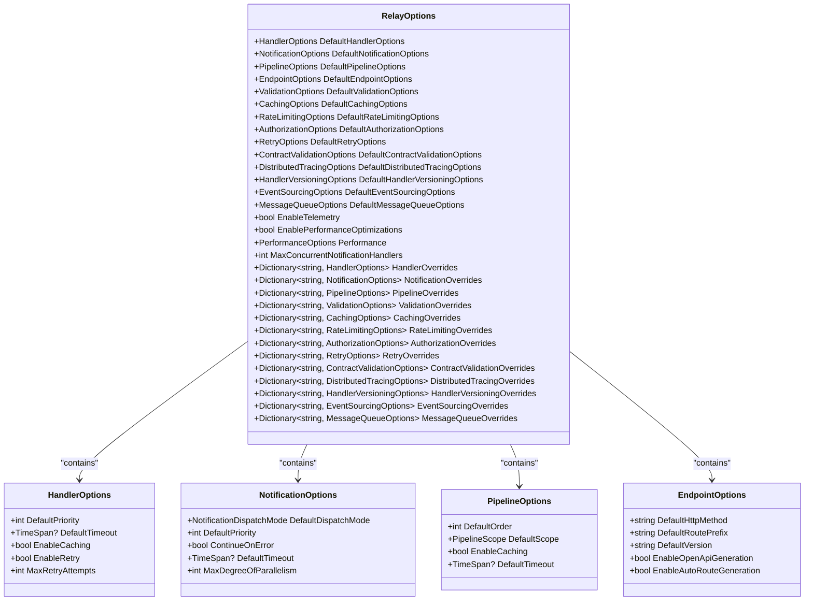
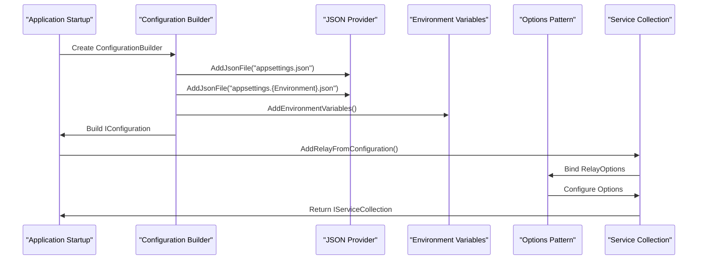
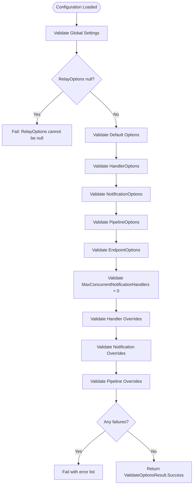
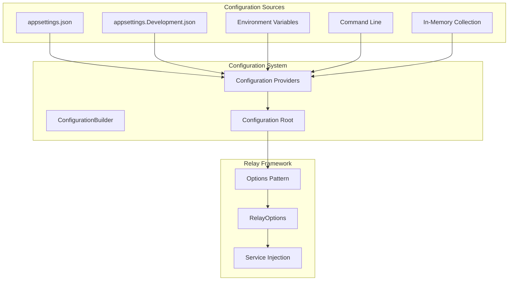

# Configuration Files

<cite>
**Referenced Files in This Document**   
- [RelayOptions.cs](file://src/Relay.Core/Configuration/Options/Core/RelayOptions.cs)
- [RelayOptionsValidator.cs](file://src/Relay.Core/Configuration/Core/RelayOptionsValidator.cs)
- [RelayConfigurationExtensions.cs](file://src/Relay.Core/Configuration/Core/RelayConfigurationExtensions.cs)
- [ConfigurationResolver.cs](file://src/Relay.Core/Configuration/Core/ConfigurationResolver.cs)
- [appsettings.json](file://samples/MinimalApiSample/appsettings.json)
- [appsettings.Development.json](file://samples/MinimalApiSample/appsettings.Development.json)
- [RelayServiceCollectionExtensions.cs](file://src/Relay/RelayServiceCollectionExtensions.cs)
</cite>

## Table of Contents
1. [Introduction](#introduction)
2. [Configuration File Usage](#configuration-file-usage)
3. [RelayOptions Class Structure](#relayoptions-class-structure)
4. [Configuration Loading and Parsing](#configuration-loading-and-parsing)
5. [Validation Process](#validation-process)
6. [Integration with Microsoft.Extensions.Configuration](#integration-with-microsoftextensionsconfiguration)
7. [Environment-Specific Configuration Examples](#environment-specific-configuration-examples)
8. [Best Practices for Environment Management](#best-practices-for-environment-management)
9. [Common Issues and Solutions](#common-issues-and-solutions)

## Introduction
The Relay framework provides a comprehensive configuration system that enables developers to customize framework behavior through configuration files and code-based configuration. This document details the implementation of configuration loading, parsing, and validation within the Relay framework, with a focus on JSON configuration files and integration with Microsoft.Extensions.Configuration. The system supports hierarchical configuration, environment variable overrides, and validation to ensure robust application setup across different deployment environments.

## Configuration File Usage
The Relay framework utilizes JSON configuration files as the primary mechanism for defining application settings. Configuration is typically stored in `appsettings.json` files, with environment-specific overrides in files like `appsettings.Development.json` or `appsettings.Production.json`. The framework follows the ASP.NET Core configuration pattern, allowing for hierarchical configuration where more specific environment files override settings from the base configuration file.

Configuration files are loaded during application startup and bound to the `RelayOptions` class, which serves as the central configuration object for the framework. The configuration system supports various data types including strings, numbers, booleans, and complex nested objects, enabling rich configuration scenarios. Developers can define global defaults and specific overrides for different components within the framework.

**Section sources**
- [appsettings.json](file://samples/MinimalApiSample/appsettings.json)
- [appsettings.Development.json](file://samples/MinimalApiSample/appsettings.Development.json)

## RelayOptions Class Structure
The `RelayOptions` class serves as the root configuration object for the Relay framework, containing nested configuration objects for different subsystems. This hierarchical structure enables comprehensive configuration of the framework's various features.



**Diagram sources**
- [RelayOptions.cs](file://src/Relay.Core/Configuration/Options/Core/RelayOptions.cs)

**Section sources**
- [RelayOptions.cs](file://src/Relay.Core/Configuration/Options/Core/RelayOptions.cs)

## Configuration Loading and Parsing
The Relay framework integrates with Microsoft.Extensions.Configuration to load and parse configuration from JSON files and other sources. Configuration loading occurs during application startup through extension methods on `IServiceCollection`. The primary method for loading configuration from files is `AddRelayFromConfiguration`, which binds configuration data to the `RelayOptions` class.

The configuration system supports multiple configuration providers, allowing settings to be loaded from various sources including JSON files, environment variables, command-line arguments, and in-memory collections. When multiple sources contain the same setting, the last provider to add the setting takes precedence, enabling environment variables to override file-based configuration.

Configuration parsing is handled by the .NET configuration system, which automatically converts JSON values to their corresponding .NET types. The framework uses the standard options pattern, with configuration sections bound to strongly-typed options classes. This approach provides compile-time safety and IntelliSense support for configuration settings.



**Diagram sources**
- [RelayServiceCollectionExtensions.cs](file://src/Relay/RelayServiceCollectionExtensions.cs)
- [RelayConfigurationExtensions.cs](file://src/Relay.Core/Configuration/Core/RelayConfigurationExtensions.cs)

**Section sources**
- [RelayServiceCollectionExtensions.cs](file://src/Relay/RelayServiceCollectionExtensions.cs)
- [RelayConfigurationExtensions.cs](file://src/Relay.Core/Configuration/Core/RelayConfigurationExtensions.cs)

## Validation Process
The Relay framework implements a comprehensive validation process to ensure configuration integrity. The `RelayOptionsValidator` class implements the `IValidateOptions<RelayOptions>` interface, which is invoked by the .NET configuration system during application startup. This validator checks for required settings, valid ranges, and proper configuration of nested objects.

Validation occurs at multiple levels, starting with the top-level `RelayOptions` object and cascading down to nested configuration objects. The validator checks for null values, invalid enum values, and out-of-range numeric values. For example, it ensures that `MaxConcurrentNotificationHandlers` is greater than zero and that HTTP methods are valid.

When invalid configuration is detected, the validator returns a `ValidateOptionsResult` with descriptive error messages. These errors are logged and prevent the application from starting, ensuring that misconfigured applications do not run in an undefined state. Developers can also manually trigger validation using the `ValidateRelayConfiguration` extension method.



**Diagram sources**
- [RelayOptionsValidator.cs](file://src/Relay.Core/Configuration/Core/RelayOptionsValidator.cs)

**Section sources**
- [RelayOptionsValidator.cs](file://src/Relay.Core/Configuration/Core/RelayOptionsValidator.cs)

## Integration with Microsoft.Extensions.Configuration
The Relay framework seamlessly integrates with Microsoft.Extensions.Configuration, leveraging its hierarchical configuration system and multiple configuration providers. This integration enables environment variable overrides, command-line argument support, and flexible configuration sourcing.

The framework uses the standard options pattern, with `IOptions<RelayOptions>` injected into services that require configuration. This approach provides immutable configuration access and supports change notifications when configuration sources support them. The integration also supports configuration reloading, allowing applications to respond to configuration changes without restarts.

Environment variable overrides follow the standard .NET naming convention, where nested properties are represented with double underscores. For example, `Relay__DefaultHandlerOptions__EnableRetry` would override the `EnableRetry` setting in the default handler options. This allows deployment environments to customize behavior without modifying configuration files.



**Diagram sources**
- [RelayConfigurationExtensions.cs](file://src/Relay.Core/Configuration/Core/RelayConfigurationExtensions.cs)

**Section sources**
- [RelayConfigurationExtensions.cs](file://src/Relay.Core/Configuration/Core/RelayConfigurationExtensions.cs)

## Environment-Specific Configuration Examples
The Relay framework supports environment-specific configuration through the standard ASP.NET Core pattern of using multiple JSON files. The base `appsettings.json` file contains default settings, while environment-specific files like `appsettings.Development.json` or `appsettings.Production.json` contain overrides for specific environments.

For example, in a development environment, logging might be set to a more verbose level to aid debugging, while in production, logging is set to a higher level to reduce noise. Similarly, connection strings and service endpoints can be customized for each environment, allowing the same codebase to work across different deployment targets.

The framework also supports environment variables for sensitive information like passwords and API keys, preventing them from being stored in configuration files. This approach enhances security and enables flexible deployment across different environments.

```json
{
  "Logging": {
    "LogLevel": {
      "Default": "Information",
      "Microsoft.AspNetCore": "Warning",
      "Relay.MessageBroker": "Debug"
    }
  },
  "AllowedHosts": "*",
  "RabbitMQ": {
    "HostName": "localhost",
    "Port": "5672",
    "UserName": "guest",
    "Password": "guest"
  }
}
```

```json
{
  "Logging": {
    "LogLevel": {
      "Default": "Debug",
      "Microsoft.AspNetCore": "Information",
      "Relay.MessageBroker": "Debug"
    }
  },
  "RabbitMQ": {
    "HostName": "localhost",
    "Port": "5672",
    "UserName": "guest",
    "Password": "guest"
  }
}
```

**Section sources**
- [appsettings.json](file://samples/MinimalApiSample/appsettings.json)
- [appsettings.Development.json](file://samples/MinimalApiSample/appsettings.Development.json)

## Best Practices for Environment Management
Effective environment management in the Relay framework involves several best practices to ensure consistent and secure configuration across different deployment targets. First, use hierarchical configuration with base settings in `appsettings.json` and environment-specific overrides in environment-named files. This approach minimizes duplication and makes it clear which settings vary by environment.

Second, store sensitive information like passwords and API keys in environment variables rather than configuration files. This prevents accidental exposure of secrets in source control and allows different values to be used in different environments without code changes.

Third, use configuration validation to catch errors early. The built-in validation ensures that required settings are present and within valid ranges, preventing runtime errors due to misconfiguration. Enable validation in all environments to maintain consistency.

Fourth, document configuration requirements and provide example configuration files for each environment. This helps new developers understand the configuration needs and reduces setup time.

Finally, use consistent naming conventions for configuration settings and follow the framework's established patterns. This improves readability and maintainability, making it easier for team members to understand and modify configuration.

**Section sources**
- [RelayOptions.cs](file://src/Relay.Core/Configuration/Options/Core/RelayOptions.cs)
- [RelayOptionsValidator.cs](file://src/Relay.Core/Configuration/Core/RelayOptionsValidator.cs)

## Common Issues and Solutions
Several common issues arise when working with configuration in the Relay framework. One frequent problem is missing required settings, which can be addressed by providing sensible defaults in the `RelayOptions` class and using configuration validation to catch missing values. The validation system will prevent the application from starting with invalid configuration, making issues immediately apparent.

Type mismatches between configuration values and expected types can occur when JSON values are not properly formatted. For example, a string value for a numeric setting will cause a parsing error. These issues are typically caught during application startup, with descriptive error messages indicating the problematic setting.

Another common issue is incorrect environment variable naming, which prevents overrides from being applied. Ensure that environment variable names follow the double underscore convention for nested properties and match the configuration section and property names exactly.

Configuration loading order can also cause issues, as later configuration sources override earlier ones. Be mindful of the order in which configuration providers are added to ensure that the desired precedence is maintained.

Finally, circular dependencies in configuration can occur when settings reference each other in a way that creates an infinite loop. The framework's validation system helps detect these issues by validating configuration in a predictable order and providing clear error messages when problems are detected.

**Section sources**
- [RelayOptionsValidator.cs](file://src/Relay.Core/Configuration/Core/RelayOptionsValidator.cs)
- [ConfigurationResolver.cs](file://src/Relay.Core/Configuration/Core/ConfigurationResolver.cs)