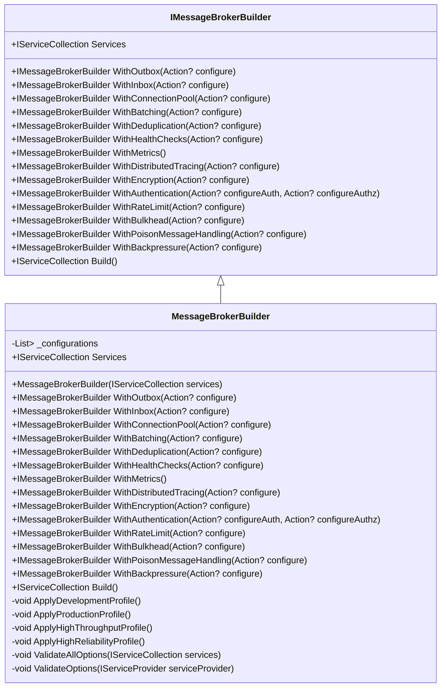
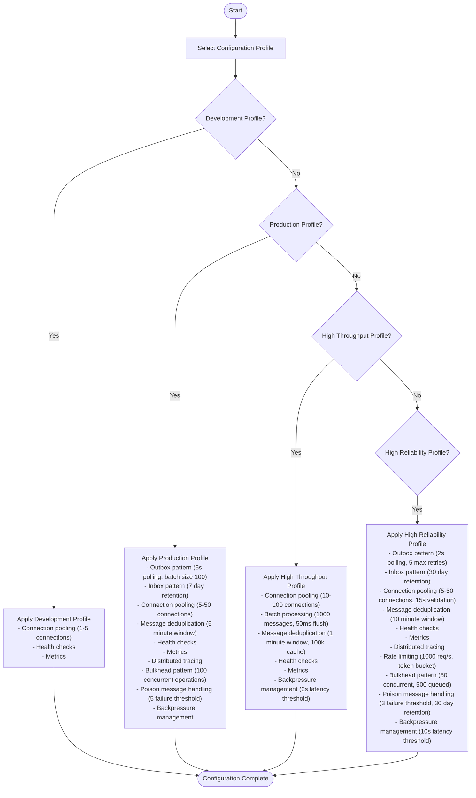

# Fluent API Configuration

<cite>
**Referenced Files in This Document**   
- [IMessageBrokerBuilder.cs](file://src/Relay.MessageBroker/Core/IMessageBrokerBuilder.cs)
- [MessageBrokerBuilder.cs](file://src/Relay.MessageBroker/Core/MessageBrokerBuilder.cs)
- [ServiceCollectionExtensions.cs](file://src/Relay.MessageBroker/Hosting/ServiceCollectionExtensions.cs)
- [MessageBrokerOptions.cs](file://src/Relay.MessageBroker/Configuration/MessageBrokerOptions.cs)
- [MessageBrokerProfile.cs](file://src/Relay.MessageBroker/Configuration/MessageBrokerProfile.cs)
- [FLUENT_CONFIGURATION.md](file://docs/MessageBroker/FLUENT_CONFIGURATION.md)
- [FluentConfigurationExample.cs](file://docs/MessageBroker/examples/FluentConfigurationExample.cs)
</cite>

## Table of Contents
1. [Introduction](#introduction)
2. [Core Components](#core-components)
3. [Fluent Builder Pattern Implementation](#fluent-builder-pattern-implementation)
4. [Configuration Profiles](#configuration-profiles)
5. [Individual Feature Configuration](#individual-feature-configuration)
6. [Relationship Between Fluent API and Configuration Objects](#relationship-between-fluent-api-and-configuration-objects)
7. [Common Issues and Solutions](#common-issues-and-solutions)
8. [Complete Examples](#complete-examples)
9. [Validation and Error Handling](#validation-and-error-handling)
10. [Best Practices](#best-practices)

## Introduction

The Relay framework provides a fluent API configuration system that enables clean, readable, and chainable method calls for configuring message brokers and their associated patterns. This documentation details the implementation of the fluent builder pattern, the interfaces and classes involved, and provides concrete examples of how to configure various aspects of the message broker system.

The fluent API simplifies the configuration process by allowing developers to chain method calls together, making the configuration code more intuitive and easier to read. This approach is particularly beneficial for complex configurations involving multiple patterns and features.

**Section sources**
- [FLUENT_CONFIGURATION.md](file://docs/MessageBroker/FLUENT_CONFIGURATION.md#L1-L554)

## Core Components

The fluent API configuration system in the Relay framework is built around several key components that work together to provide a seamless configuration experience. The primary components include the `IMessageBrokerBuilder` interface, the `MessageBrokerBuilder` class, and various configuration options classes.

The `IMessageBrokerBuilder` interface defines the contract for the fluent builder, exposing methods for configuring different aspects of the message broker such as outbox, inbox, connection pooling, batching, deduplication, health checks, metrics, distributed tracing, encryption, authentication, rate limiting, bulkhead, poison message handling, and backpressure management.

The `MessageBrokerBuilder` class implements the `IMessageBrokerBuilder` interface and provides the actual implementation of the fluent configuration methods. It maintains a list of configuration actions that are applied when the `Build()` method is called.

**Section sources**
- [IMessageBrokerBuilder.cs](file://src/Relay.MessageBroker/Core/IMessageBrokerBuilder.cs#L1-L133)
- [MessageBrokerBuilder.cs](file://src/Relay.MessageBroker/Core/MessageBrokerBuilder.cs#L1-L431)

## Fluent Builder Pattern Implementation

The fluent builder pattern in the Relay framework is implemented through the `IMessageBrokerBuilder` interface and its concrete implementation, `MessageBrokerBuilder`. This pattern allows for method chaining, where each configuration method returns the builder instance, enabling a clean and readable configuration syntax.

The `MessageBrokerBuilder` class maintains a list of configuration actions (`_configurations`) that are executed when the `Build()` method is called. Each configuration method (e.g., `WithOutbox`, `WithInbox`, `WithConnectionPool`) adds a new action to this list, which is responsible for configuring the corresponding feature.



**Diagram sources**
- [IMessageBrokerBuilder.cs](file://src/Relay.MessageBroker/Core/IMessageBrokerBuilder.cs#L1-L133)
- [MessageBrokerBuilder.cs](file://src/Relay.MessageBroker/Core/MessageBrokerBuilder.cs#L1-L431)

## Configuration Profiles

The Relay framework provides pre-configured profiles for common scenarios, making it easier to set up the message broker with appropriate defaults for different environments. These profiles include Development, Production, High Throughput, and High Reliability.

The `MessageBrokerProfile` enum defines these profiles, and the `MessageBrokerBuilder` class includes methods to apply each profile's configuration. When a profile is applied, it configures the message broker with a set of default settings optimized for that scenario.

For example, the Development profile enables minimal features with in-memory stores, while the Production profile enables all reliability and observability features. The High Throughput profile is optimized for maximum performance, and the High Reliability profile enables all resilience patterns.



**Diagram sources**
- [MessageBrokerProfile.cs](file://src/Relay.MessageBroker/Configuration/MessageBrokerProfile.cs#L1-L28)
- [MessageBrokerBuilder.cs](file://src/Relay.MessageBroker/Core/MessageBrokerBuilder.cs#L233-L393)

## Individual Feature Configuration

The fluent API allows for granular configuration of individual features, providing flexibility to customize each aspect of the message broker. Each feature is configured through a corresponding method on the `IMessageBrokerBuilder` interface, which accepts an optional configuration action to fine-tune the settings.

### Outbox Pattern

The Outbox pattern ensures reliable message publishing by storing messages in a database before sending them to the message broker. This prevents message loss in case of failures.

```csharp
services.AddMessageBrokerWithPatterns(options => { /* ... */ })
    .WithOutbox(options =>
    {
        options.Enabled = true;
        options.PollingInterval = TimeSpan.FromSeconds(5);
        options.BatchSize = 100;
        options.MaxRetryAttempts = 3;
    })
    .Build();
```

### Inbox Pattern

The Inbox pattern ensures idempotent message processing by tracking processed messages and preventing duplicates.

```csharp
services.AddMessageBrokerWithPatterns(options => { /* ... */ })
    .WithInbox(options =>
    {
        options.Enabled = true;
        options.RetentionPeriod = TimeSpan.FromDays(7);
        options.CleanupInterval = TimeSpan.FromHours(1);
    })
    .Build();
```

### Connection Pooling

Connection pooling improves performance by reusing connections to the message broker.

```csharp
services.AddMessageBrokerWithPatterns(options => { /* ... */ })
    .WithConnectionPool(options =>
    {
        options.Enabled = true;
        options.MinPoolSize = 5;
        options.MaxPoolSize = 50;
        options.ConnectionTimeout = TimeSpan.FromSeconds(5);
        options.ValidationInterval = TimeSpan.FromSeconds(30);
    })
    .Build();
```

### Batch Processing

Batch processing optimizes high-volume scenarios by grouping multiple messages into a single batch.

```csharp
services.AddMessageBrokerWithPatterns(options => { /* ... */ })
    .WithBatching(options =>
    {
        options.Enabled = true;
        options.MaxBatchSize = 100;
        options.FlushInterval = TimeSpan.FromMilliseconds(100);
        options.EnableCompression = true;
        options.PartialRetry = true;
    })
    .Build();
```

### Message Deduplication

Message deduplication prevents duplicate messages from being processed.

```csharp
services.AddMessageBrokerWithPatterns(options => { /* ... */ })
    .WithDeduplication(options =>
    {
        options.Enabled = true;
        options.Window = TimeSpan.FromMinutes(5);
        options.MaxCacheSize = 100_000;
        options.Strategy = DeduplicationStrategy.ContentHash;
    })
    .Build();
```

### Health Checks

Health checks provide monitoring capabilities for the message broker.

```csharp
services.AddMessageBrokerWithPatterns(options => { /* ... */ })
    .WithHealthChecks(options =>
    {
        options.Interval = TimeSpan.FromSeconds(30);
        options.ConnectivityTimeout = TimeSpan.FromSeconds(2);
        options.IncludeCircuitBreakerState = true;
        options.IncludeConnectionPoolMetrics = true;
    })
    .Build();
```

### Metrics and Telemetry

Metrics and telemetry provide observability into the message broker's performance.

```csharp
services.AddMessageBrokerWithPatterns(options => { /* ... */ })
    .WithMetrics()
    .Build();
```

### Distributed Tracing

Distributed tracing enables end-to-end visibility into message flows.

```csharp
services.AddMessageBrokerWithPatterns(options => { /* ... */ })
    .WithDistributedTracing(options =>
    {
        options.EnableTracing = true;
        options.ServiceName = "MyService";
        options.SamplingRate = 1.0;
        options.OtlpExporter = new OtlpExporterOptions
        {
            Enabled = true,
            Endpoint = "http://localhost:4317"
        };
    })
    .Build();
```

### Message Encryption

Message encryption ensures the confidentiality of messages.

```csharp
services.AddMessageBrokerWithPatterns(options => { /* ... */ })
    .WithEncryption(options =>
    {
        options.EnableEncryption = true;
        options.EncryptionAlgorithm = "AES256";
        options.KeyVaultUrl = "https://myvault.vault.azure.net/"
    })
    .Build();
```

### Authentication and Authorization

Authentication and authorization secure access to the message broker.

```csharp
services.AddMessageBrokerWithPatterns(options => { /* ... */ })
    .WithAuthentication(
        authOptions =>
        {
            authOptions.EnableAuthentication = true;
            authOptions.JwtIssuer = "https://myissuer.com";
            authOptions.JwtAudience = "myapi";
        },
        authzOptions =>
        {
            authzOptions.EnableAuthorization = true;
            authzOptions.RolePermissions = new Dictionary<string, string[]>
            {
                ["Publisher"] = new[] { "publish" },
                ["Consumer"] = new[] { "subscribe" },
                ["Admin"] = new[] { "publish", "subscribe" }
            };
        })
    .Build();
```

### Rate Limiting

Rate limiting controls the rate of message processing.

```csharp
services.AddMessageBrokerWithPatterns(options => { /* ... */ })
    .WithRateLimit(options =>
    {
        options.Enabled = true;
        options.RequestsPerSecond = 1000;
        options.Strategy = RateLimitStrategy.TokenBucket;
        options.EnablePerTenantLimits = true;
    })
    .Build();
```

### Bulkhead Pattern

The bulkhead pattern isolates resources to prevent cascading failures.

```csharp
services.AddMessageBrokerWithPatterns(options => { /* ... */ })
    .WithBulkhead(options =>
    {
        options.Enabled = true;
        options.MaxConcurrentOperations = 100;
        options.MaxQueuedOperations = 1000;
        options.AcquisitionTimeout = TimeSpan.FromSeconds(30);
    })
    .Build();
```

### Poison Message Handling

Poison message handling manages messages that cannot be processed.

```csharp
services.AddMessageBrokerWithPatterns(options => { /* ... */ })
    .WithPoisonMessageHandling(options =>
    {
        options.Enabled = true;
        options.FailureThreshold = 5;
        options.RetentionPeriod = TimeSpan.FromDays(7);
        options.CleanupInterval = TimeSpan.FromHours(1);
    })
    .Build();
```

### Backpressure Management

Backpressure management prevents system overload by controlling the rate of message processing.

```csharp
services.AddMessageBrokerWithPatterns(options => { /* ... */ })
    .WithBackpressure(options =>
    {
        options.Enabled = true;
        options.LatencyThreshold = TimeSpan.FromSeconds(5);
        options.QueueDepthThreshold = 10000;
        options.RecoveryLatencyThreshold = TimeSpan.FromSeconds(2);
    })
    .Build();
```

**Section sources**
- [FLUENT_CONFIGURATION.md](file://docs/MessageBroker/FLUENT_CONFIGURATION.md#L147-L350)

## Relationship Between Fluent API and Configuration Objects

The fluent API in the Relay framework serves as a high-level abstraction over the underlying configuration objects. Each method in the fluent API corresponds to a specific configuration object, allowing developers to configure the message broker without directly manipulating the configuration classes.

For example, the `WithOutbox` method configures the `OutboxOptions` class, the `WithInbox` method configures the `InboxOptions` class, and so on. This abstraction simplifies the configuration process by providing a more intuitive and readable syntax.

The relationship between the fluent API and the configuration objects is established through the `MessageBrokerBuilder` class, which maintains a list of configuration actions. Each configuration action is responsible for configuring a specific feature by setting the appropriate properties on the corresponding configuration object.

When the `Build()` method is called, all configuration actions are executed, and the configuration objects are validated to ensure that the settings are correct. This validation process helps catch configuration errors early, preventing runtime issues.

```mermaid
classDiagram
class MessageBrokerOptions {
+MessageBrokerType BrokerType
+string? ConnectionString
+RabbitMQOptions? RabbitMQ
+KafkaOptions? Kafka
+AzureServiceBusOptions? AzureServiceBus
+AwsSqsSnsOptions? AwsSqsSns
+NatsOptions? Nats
+RedisStreamsOptions? RedisStreams
}
class OutboxOptions {
+bool Enabled
+TimeSpan PollingInterval
+int BatchSize
+int MaxRetryAttempts
}
class InboxOptions {
+bool Enabled
+TimeSpan RetentionPeriod
+TimeSpan CleanupInterval
}
class ConnectionPoolOptions {
+bool Enabled
+int MinPoolSize
+int MaxPoolSize
+TimeSpan ConnectionTimeout
+TimeSpan ValidationInterval
}
class BatchOptions {
+bool Enabled
+int MaxBatchSize
+TimeSpan FlushInterval
+bool EnableCompression
+bool PartialRetry
}
class DeduplicationOptions {
+bool Enabled
+TimeSpan Window
+int MaxCacheSize
+DeduplicationStrategy Strategy
}
class HealthCheckOptions {
+TimeSpan Interval
+TimeSpan ConnectivityTimeout
+bool IncludeCircuitBreakerState
+bool IncludeConnectionPoolMetrics
}
class DistributedTracingOptions {
+bool EnableTracing
+string ServiceName
+double SamplingRate
+OtlpExporterOptions OtlpExporter
}
class SecurityOptions {
+bool EnableEncryption
+string EncryptionAlgorithm
+string KeyVaultUrl
}
class AuthenticationOptions {
+bool EnableAuthentication
+string JwtIssuer
+string JwtAudience
}
class AuthorizationOptions {
+bool EnableAuthorization
+Dictionary<string, string[]> RolePermissions
}
class RateLimitOptions {
+bool Enabled
+int RequestsPerSecond
+RateLimitStrategy Strategy
+bool EnablePerTenantLimits
+int DefaultTenantLimit
+Dictionary<string, int> TenantLimits
}
class BulkheadOptions {
+bool Enabled
+int MaxConcurrentOperations
+int MaxQueuedOperations
+TimeSpan AcquisitionTimeout
}
class PoisonMessageOptions {
+bool Enabled
+int FailureThreshold
+TimeSpan RetentionPeriod
+TimeSpan CleanupInterval
}
class BackpressureOptions {
+bool Enabled
+TimeSpan LatencyThreshold
+int QueueDepthThreshold
+TimeSpan RecoveryLatencyThreshold
}
MessageBrokerOptions --> OutboxOptions : "contains"
MessageBrokerOptions --> InboxOptions : "contains"
MessageBrokerOptions --> ConnectionPoolOptions : "contains"
MessageBrokerOptions --> BatchOptions : "contains"
MessageBrokerOptions --> DeduplicationOptions : "contains"
MessageBrokerOptions --> HealthCheckOptions : "contains"
MessageBrokerOptions --> DistributedTracingOptions : "contains"
MessageBrokerOptions --> SecurityOptions : "contains"
MessageBrokerOptions --> AuthenticationOptions : "contains"
MessageBrokerOptions --> AuthorizationOptions : "contains"
MessageBrokerOptions --> RateLimitOptions : "contains"
MessageBrokerOptions --> BulkheadOptions : "contains"
MessageBrokerOptions --> PoisonMessageOptions : "contains"
MessageBrokerOptions --> BackpressureOptions : "contains"
```



**Diagram sources**
- [MessageBrokerOptions.cs](file://src/Relay.MessageBroker/Configuration/MessageBrokerOptions.cs#L1-L50)
- [OutboxOptions.cs](file://src/Relay.MessageBroker/Outbox/OutboxOptions.cs#L1-L20)
- [InboxOptions.cs](file://src/Relay.MessageBroker/Inbox/InboxOptions.cs#L1-L20)
- [ConnectionPoolOptions.cs](file://src/Relay.MessageBroker/ConnectionPool/ConnectionPoolOptions.cs#L1-L20)
- [BatchOptions.cs](file://src/Relay.MessageBroker/Batch/BatchOptions.cs#L1-L20)
- [DeduplicationOptions.cs](file://src/Relay.MessageBroker/Deduplication/DeduplicationOptions.cs#L1-L20)
- [HealthCheckOptions.cs](file://src/Relay.MessageBroker/HealthChecks/HealthCheckOptions.cs#L1-L20)
- [DistributedTracingOptions.cs](file://src/Relay.MessageBroker/DistributedTracing/DistributedTracingOptions.cs#L1-L20)
- [SecurityOptions.cs](file://src/Relay.MessageBroker/Security/SecurityOptions.cs#L1-L20)
- [AuthenticationOptions.cs](file://src/Relay.MessageBroker/Security/AuthenticationOptions.cs#L1-L20)
- [AuthorizationOptions.cs](file://src/Relay.MessageBroker/Security/AuthorizationOptions.cs#L1-L20)
- [RateLimitOptions.cs](file://src/Relay.MessageBroker/RateLimit/RateLimitOptions.cs#L1-L20)
- [BulkheadOptions.cs](file://src/Relay.MessageBroker/Bulkhead/BulkheadOptions.cs#L1-L20)
- [PoisonMessageOptions.cs](file://src/Relay.MessageBroker/PoisonMessage/PoisonMessageOptions.cs#L1-L20)
- [BackpressureOptions.cs](file://src/Relay.MessageBroker/Backpressure/BackpressureOptions.cs#L1-L20)

## Common Issues and Solutions

When using the fluent API configuration system, developers may encounter common issues related to method call ordering, configuration validation, and complex configuration scenarios. Understanding these issues and their solutions is crucial for effective use of the framework.

### Method Call Ordering Requirements

One common issue is the requirement for specific method call ordering. For example, the `AddMessageBrokerWithPatterns` method must be called before any of the `With*` methods. This is because the `AddMessageBrokerWithPatterns` method initializes the `MessageBrokerBuilder` instance, which is then used by the subsequent `With*` methods.

To avoid this issue, always ensure that the `AddMessageBrokerWithPatterns` method is called first, followed by the appropriate `With*` methods in any order.

### Configuration Validation

Another common issue is configuration validation. The fluent API automatically validates the configuration when the `Build()` method is called. If any configuration is invalid, an `InvalidOperationException` is thrown with details about the validation failure.

To handle this, wrap the `Build()` call in a try-catch block and handle the `InvalidOperationException` appropriately.

```csharp
try
{
    services.AddMessageBrokerWithPatterns(options => { /* ... */ })
        .WithOutbox(options =>
        {
            options.PollingInterval = TimeSpan.FromMilliseconds(50); // Invalid: < 100ms
        })
        .Build();
}
catch (InvalidOperationException ex)
{
    // Handle validation error
    Console.WriteLine($"Configuration error: {ex.Message}");
}
```

### Complex Configuration Scenarios

Complex configuration scenarios may require combining multiple features and profiles. For example, a high-volume event processing system may require the High Throughput profile with additional custom settings for batching and deduplication.

To handle complex scenarios, start with a profile and customize as needed using the `With*` methods.

```csharp
services.AddMessageBrokerWithProfile(
    MessageBrokerProfile.HighThroughput,
    options =>
    {
        options.BrokerType = MessageBrokerType.Kafka;
        options.Kafka = new KafkaOptions
        {
            BootstrapServers = "kafka:9092",
            ConsumerGroupId = "event-processor"
        };
    })
    .WithBatching(options =>
    {
        options.MaxBatchSize = 1000;
        options.FlushInterval = TimeSpan.FromMilliseconds(50);
        options.EnableCompression = true;
    })
    .WithDeduplication(options =>
    {
        options.Window = TimeSpan.FromMinutes(1);
        options.MaxCacheSize = 100_000;
    })
    .Build();
```

**Section sources**
- [FLUENT_CONFIGURATION.md](file://docs/MessageBroker/FLUENT_CONFIGURATION.md#L497-L516)

## Complete Examples

The following examples demonstrate the use of the fluent API configuration system in various scenarios.

### Microservice with Full Observability

```csharp
services.AddMessageBrokerWithPatterns(options =>
{
    options.BrokerType = MessageBrokerType.RabbitMQ;
    options.RabbitMQ = new RabbitMQOptions
    {
        HostName = configuration["RabbitMQ:HostName"],
        Port = 5672,
        UserName = configuration["RabbitMQ:UserName"],
        Password = configuration["RabbitMQ:Password"]
    };
})
.WithOutbox()
.WithInbox()
.WithConnectionPool()
.WithHealthChecks()
.WithMetrics()
.WithDistributedTracing(options =>
{
    options.ServiceName = "OrderService";
    options.OtlpExporter = new OtlpExporterOptions
    {
        Enabled = true,
        Endpoint = "http://jaeger:4317"
    };
})
.Build();
```

### High-Volume Event Processing

```csharp
services.AddMessageBrokerWithPatterns(options =>
{
    options.BrokerType = MessageBrokerType.Kafka;
    options.Kafka = new KafkaOptions
    {
        BootstrapServers = "kafka:9092",
        ConsumerGroupId = "event-processor"
    };
})
.WithConnectionPool(options =>
{
    options.MinPoolSize = 10;
    options.MaxPoolSize = 100;
})
.WithBatching(options =>
{
    options.MaxBatchSize = 1000;
    options.FlushInterval = TimeSpan.FromMilliseconds(50);
    options.EnableCompression = true;
})
.WithDeduplication(options =>
{
    options.Window = TimeSpan.FromMinutes(1);
    options.MaxCacheSize = 100_000;
})
.WithBackpressure()
.WithHealthChecks()
.WithMetrics()
.Build();
```

### Secure Multi-Tenant System

```csharp
services.AddMessageBrokerWithPatterns(options =>
{
    options.BrokerType = MessageBrokerType.AzureServiceBus;
    options.AzureServiceBus = new AzureServiceBusOptions
    {
        ConnectionString = configuration["AzureServiceBus:ConnectionString"]
    };
})
.WithOutbox()
.WithInbox()
.WithEncryption(options =>
{
    options.EnableEncryption = true;
    options.KeyVaultUrl = configuration["KeyVault:Url"];
})
.WithAuthentication(
    authOptions =>
    {
        authOptions.EnableAuthentication = true;
        authOptions.JwtIssuer = configuration["Auth:Issuer"];
        authOptions.JwtAudience = configuration["Auth:Audience"];
    },
    authzOptions =>
    {
        authzOptions.EnableAuthorization = true;
    })
.WithRateLimit(options =>
{
    options.EnablePerTenantLimits = true;
    options.DefaultTenantLimit = 100;
    options.TenantLimits = new Dictionary<string, int>
    {
        ["premium-tenant"] = 1000,
        ["standard-tenant"] = 100
    };
})
.WithHealthChecks()
.WithMetrics()
.WithDistributedTracing()
.Build();
```

### Mission-Critical System

```csharp
services.AddMessageBrokerWithProfile(
    MessageBrokerProfile.HighReliability,
    options =>
    {
        options.BrokerType = MessageBrokerType.RabbitMQ;
        options.RabbitMQ = new RabbitMQOptions
        {
            HostName = configuration["RabbitMQ:HostName"],
            Port = 5672
        };
        
        // Enable circuit breaker
        options.CircuitBreaker = new CircuitBreakerOptions
        {
            FailureThreshold = 5,
            SuccessThreshold = 2,
            Timeout = TimeSpan.FromSeconds(30)
        };
        
        // Enable retry policy
        options.RetryPolicy = new RetryPolicy
        {
            MaxAttempts = 3,
            InitialDelay = TimeSpan.FromSeconds(1),
            MaxDelay = TimeSpan.FromSeconds(30),
            BackoffMultiplier = 2.0
        };
    });
```

**Section sources**
- [FLUENT_CONFIGURATION.md](file://docs/MessageBroker/FLUENT_CONFIGURATION.md#L352-L462)

## Validation and Error Handling

The fluent API configuration system includes robust validation and error handling to ensure that the configuration is correct and to provide meaningful error messages when issues arise.

All options are automatically validated when the `Build()` method is called. If any configuration is invalid, an `InvalidOperationException` is thrown with details about the validation failure. This helps catch configuration errors early, preventing runtime issues.

To handle validation errors, wrap the `Build()` call in a try-catch block and handle the `InvalidOperationException` appropriately.

```csharp
try
{
    services.AddMessageBrokerWithPatterns(options => { /* ... */ })
        .WithOutbox(options =>
        {
            options.PollingInterval = TimeSpan.FromMilliseconds(50); // Invalid: < 100ms
        })
        .Build();
}
catch (InvalidOperationException ex)
{
    // Handle validation error
    Console.WriteLine($"Configuration error: {ex.Message}");
}
```

The validation process is implemented in the `ValidateAllOptions` method of the `MessageBrokerBuilder` class, which iterates through all registered options and calls their `Validate` method if it exists.

**Section sources**
- [FLUENT_CONFIGURATION.md](file://docs/MessageBroker/FLUENT_CONFIGURATION.md#L497-L516)
- [MessageBrokerBuilder.cs](file://src/Relay.MessageBroker/Core/MessageBrokerBuilder.cs#L395-L429)

## Best Practices

When using the fluent API configuration system, follow these best practices to ensure optimal configuration and maintainability:

1. **Use Profiles for Common Scenarios**: Start with a profile and customize as needed.
2. **Enable Features Incrementally**: Add patterns one at a time in development.
3. **Validate Early**: Call `Build()` during application startup to catch configuration errors.
4. **Monitor in Production**: Always enable health checks and metrics in production.
5. **Secure Sensitive Data**: Use encryption and authentication for production workloads.
6. **Plan for Failures**: Enable outbox, inbox, and poison message handling for reliability.
7. **Optimize for Your Workload**: Use high throughput profile for event processing, high reliability for critical systems.

By following these best practices, developers can ensure that their message broker configurations are robust, secure, and optimized for their specific use cases.

**Section sources**
- [FLUENT_CONFIGURATION.md](file://docs/MessageBroker/FLUENT_CONFIGURATION.md#L518-L527)