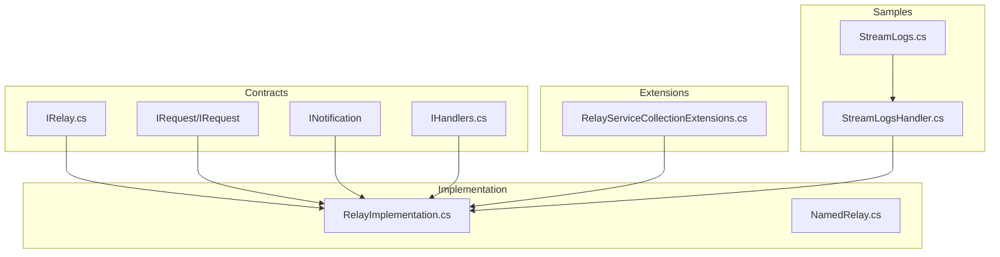
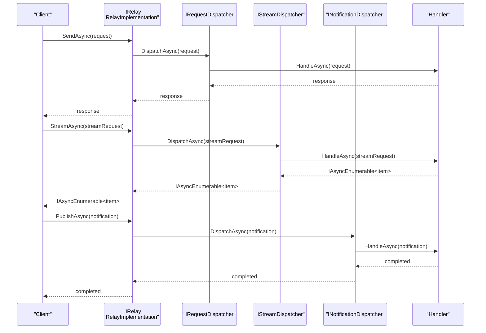
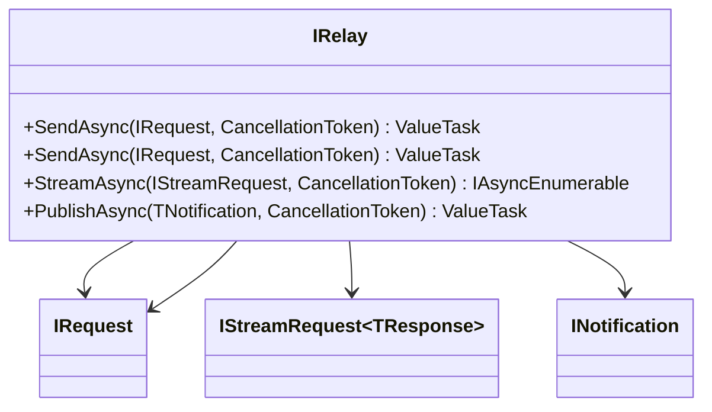
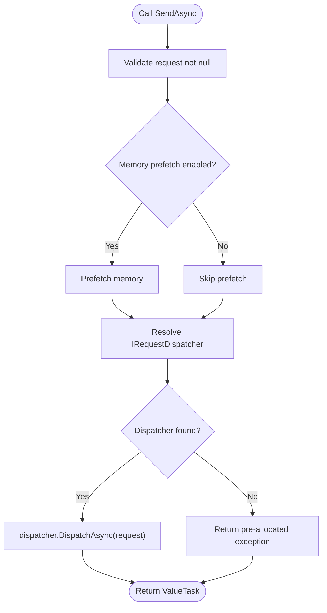
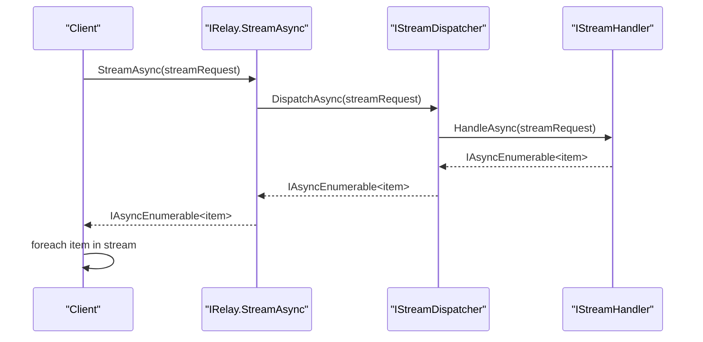
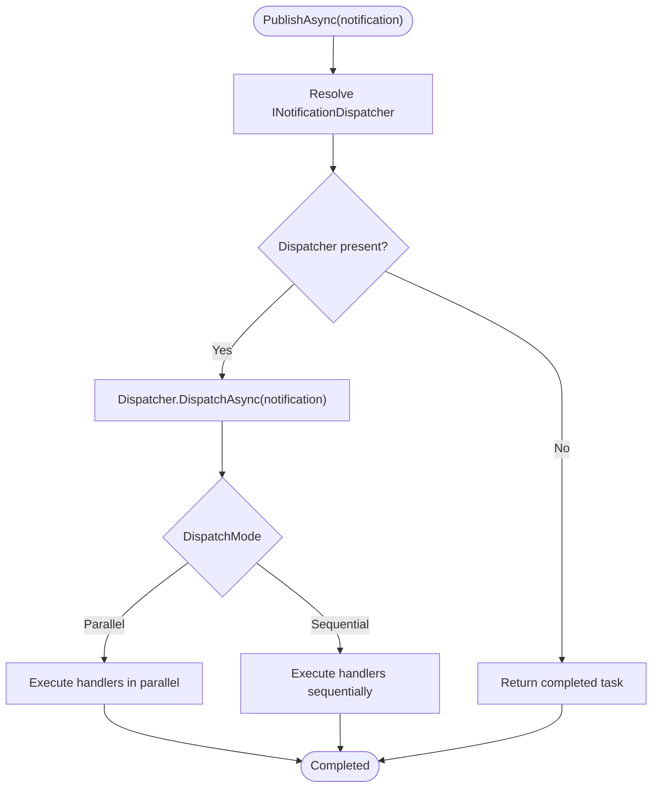
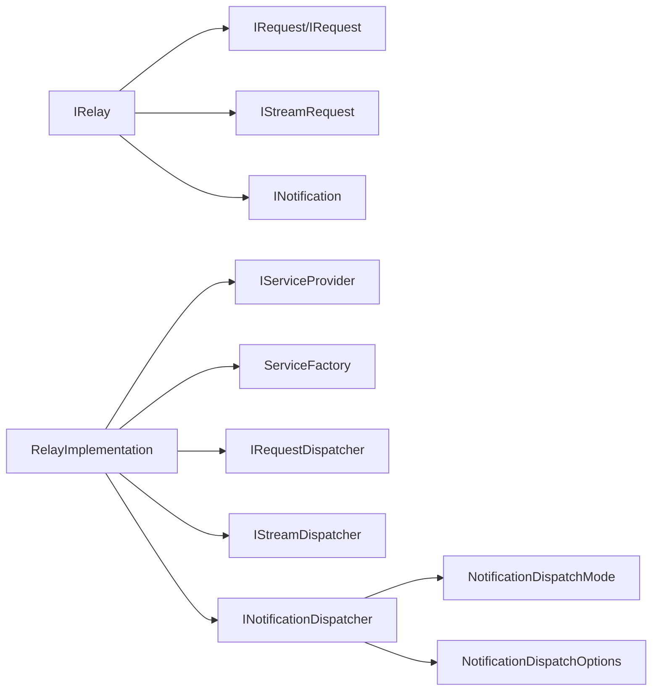

# Core Framework

<cite>
**Referenced Files in This Document**
- [IRelay.cs](file://src/Relay.Core/Contracts/Core/IRelay.cs)
- [RelayImplementation.cs](file://src/Relay.Core/Implementation/Core/RelayImplementation.cs)
- [RelayServiceCollectionExtensions.cs](file://src/Relay/RelayServiceCollectionExtensions.cs)
- [SharedInterfaces.cs](file://src/Relay.SourceGenerator/Core/SharedInterfaces.cs)
- [IHandlers.cs](file://src/Relay.Core/Contracts/Handlers/IHandlers.cs)
- [NotificationDispatchMode.cs](file://src/Relay.Core/Attributes/NotificationDispatchMode.cs)
- [NotificationDispatchOptions.cs](file://src/Relay.Core/Implementation/Configuration/NotificationDispatchOptions.cs)
- [NamedRelay.cs](file://src/Relay.Core/Implementation/Core/NamedRelay.cs)
- [StreamLogs.cs](file://samples/Relay.MinimalApiSample/Features/Examples/07-Streaming/StreamLogs.cs)
- [StreamLogsHandler.cs](file://samples/Relay.MinimalApiSample/Features/Examples/07-Streaming/StreamLogsHandler.cs)
- [HandlerNotFoundException.cs](file://src/Relay.Core/Exceptions/HandlerNotFoundException.cs)
- [MultipleHandlersException.cs](file://src/Relay.Core/Exceptions/MultipleHandlersException.cs)
- [RelayImplementationCachingTests.cs](file://tests/Relay.Core.Tests/Core/RelayImplementationCachingTests.cs)
- [RelayImplementationComprehensiveTests.cs](file://tests/Relay.Core.Tests/Implementation/RelayImplementationComprehensiveTests.cs)
- [NotificationDispatcherTests.cs](file://tests/Relay.Core.Tests/Notifications/NotificationDispatcherTests.cs)
- [BaseDispatcherTests.cs](file://tests/Relay.Core.Tests/Dispatchers/BaseDispatcherTests.cs)
</cite>

## Table of Contents
1. [Introduction](#introduction)
2. [Project Structure](#project-structure)
3. [Core Components](#core-components)
4. [Architecture Overview](#architecture-overview)
5. [Detailed Component Analysis](#detailed-component-analysis)
6. [Dependency Analysis](#dependency-analysis)
7. [Performance Considerations](#performance-considerations)
8. [Troubleshooting Guide](#troubleshooting-guide)
9. [Conclusion](#conclusion)

## Introduction
This section documents the Core Framework of Relay, focusing on the mediator pattern implementation and the central IRelay interface. It explains how requests and notifications are handled, how streaming enables real-time communication, and how the RelayImplementation orchestrates handler resolution and execution. It also covers extension methods for fluent configuration and DI integration, along with practical examples and common issues around handler registration and resolution.

## Project Structure
The Core Framework spans several namespaces:
- Contracts define the public interfaces for requests, notifications, handlers, and the mediator.
- Implementation provides the high-performance RelayImplementation and related dispatchers.
- Extensions offer fluent configuration methods for DI containers.
- Samples demonstrate streaming handlers and usage patterns.
- Tests validate behavior including handler resolution, streaming, and notification dispatch modes.

**Diagram sources**
- [IRelay.cs](file://src/Relay.Core/Contracts/Core/IRelay.cs#L1-L49)
- [RelayImplementation.cs](file://src/Relay.Core/Implementation/Core/RelayImplementation.cs#L1-L349)
- [RelayServiceCollectionExtensions.cs](file://src/Relay/RelayServiceCollectionExtensions.cs#L1-L255)
- [IHandlers.cs](file://src/Relay.Core/Contracts/Handlers/IHandlers.cs#L1-L61)
- [StreamLogs.cs](file://samples/Relay.MinimalApiSample/Features/Examples/07-Streaming/StreamLogs.cs#L1-L14)
- [StreamLogsHandler.cs](file://samples/Relay.MinimalApiSample/Features/Examples/07-Streaming/StreamLogsHandler.cs#L1-L65)

**Section sources**
- [IRelay.cs](file://src/Relay.Core/Contracts/Core/IRelay.cs#L1-L49)
- [RelayImplementation.cs](file://src/Relay.Core/Implementation/Core/RelayImplementation.cs#L1-L349)
- [RelayServiceCollectionExtensions.cs](file://src/Relay/RelayServiceCollectionExtensions.cs#L1-L255)

## Core Components
- IRelay: The central mediator interface exposing SendAsync, SendAsync (void), StreamAsync, and PublishAsync.
- IRequest/IRequest<TResponse>: Marker interfaces for requests; IRequest<TResponse> carries a typed response, IRequest for fire-and-forget.
- INotification: Marker interface for notifications dispatched to multiple handlers.
- IStreamRequest<TResponse>: Marker interface for streaming requests returning IAsyncEnumerable<T>.
- RelayImplementation: High-performance implementation of IRelay that resolves and executes handlers via generated/dispatchers and supports batching and SIMD optimizations.
- NotificationDispatchMode: Enum controlling whether notifications are executed sequentially or in parallel.
- NotificationDispatchOptions: Configuration for default dispatch mode, exception continuation, and parallelism limits.
- NamedRelay: Optional wrapper enabling named handler resolution for requests and streams.

Key public APIs:
- IRelay.SendAsync<TResponse>(IRequest<TResponse>, CancellationToken): returns ValueTask<TResponse>
- IRelay.SendAsync(IRequest, CancellationToken): returns ValueTask
- IRelay.StreamAsync<TResponse>(IStreamRequest<TResponse>, CancellationToken): returns IAsyncEnumerable<TResponse>
- IRelay.PublishAsync<TNotification>(TNotification, CancellationToken): returns ValueTask
- RelayImplementation(ServiceFactory) constructors and ServiceFactory property for external resolution.
- RelayServiceCollectionExtensions.AddRelayCore/AddRelayWithFeatures/AddRelayForScenario/AddRelayFromConfiguration: fluent DI configuration.

**Section sources**
- [IRelay.cs](file://src/Relay.Core/Contracts/Core/IRelay.cs#L1-L49)
- [SharedInterfaces.cs](file://src/Relay.SourceGenerator/Core/SharedInterfaces.cs#L1-L65)
- [RelayImplementation.cs](file://src/Relay.Core/Implementation/Core/RelayImplementation.cs#L1-L349)
- [NotificationDispatchMode.cs](file://src/Relay.Core/Attributes/NotificationDispatchMode.cs#L1-L18)
- [NotificationDispatchOptions.cs](file://src/Relay.Core/Implementation/Configuration/NotificationDispatchOptions.cs#L1-L25)
- [NamedRelay.cs](file://src/Relay.Core/Implementation/Core/NamedRelay.cs#L1-L34)
- [RelayServiceCollectionExtensions.cs](file://src/Relay/RelayServiceCollectionExtensions.cs#L1-L255)

## Architecture Overview
The Core Framework follows a mediator pattern:
- Clients call IRelay methods to send requests, stream data, or publish notifications.
- RelayImplementation resolves the appropriate dispatcher (IRequestDispatcher, IStreamDispatcher, INotificationDispatcher) from the DI container.
- Dispatchers locate handlers implementing IRequestHandler, IStreamHandler, or INotificationHandler.
- Handlers execute and return responses or streams; notifications are dispatched according to configured modes.

**Diagram sources**
- [IRelay.cs](file://src/Relay.Core/Contracts/Core/IRelay.cs#L1-L49)
- [RelayImplementation.cs](file://src/Relay.Core/Implementation/Core/RelayImplementation.cs#L160-L256)
- [IHandlers.cs](file://src/Relay.Core/Contracts/Handlers/IHandlers.cs#L1-L61)

## Detailed Component Analysis

### IRelay and Interfaces
- IRelay defines four primary operations: typed request response, void request, streaming, and notification publishing.
- IRequest/IRequest<TResponse>/IStreamRequest<TResponse> are marker interfaces used by the source generator and dispatchers to route calls to handlers.
- INotification is a marker for multi-cast notifications.

**Diagram sources**
- [IRelay.cs](file://src/Relay.Core/Contracts/Core/IRelay.cs#L1-L49)
- [SharedInterfaces.cs](file://src/Relay.SourceGenerator/Core/SharedInterfaces.cs#L1-L65)

**Section sources**
- [IRelay.cs](file://src/Relay.Core/Contracts/Core/IRelay.cs#L1-L49)
- [SharedInterfaces.cs](file://src/Relay.SourceGenerator/Core/SharedInterfaces.cs#L1-L65)

### RelayImplementation
Responsibilities:
- Resolve and cache dispatchers when configured.
- Execute SendAsync/SendAsync via IRequestDispatcher.
- Execute StreamAsync via IStreamDispatcher returning IAsyncEnumerable<T>.
- Execute PublishAsync via INotificationDispatcher.
- Provide ServiceFactory for external resolution.
- Support batch processing and SIMD optimizations when enabled.

Performance features:
- Aggressive inlining for hot paths.
- Pre-allocated exceptions when enabled.
- Memory prefetch and SIMD acceleration for batch processing.
- Handler cache and frozen collections when enabled.

**Diagram sources**
- [RelayImplementation.cs](file://src/Relay.Core/Implementation/Core/RelayImplementation.cs#L160-L220)

**Section sources**
- [RelayImplementation.cs](file://src/Relay.Core/Implementation/Core/RelayImplementation.cs#L1-L349)

### Streaming Support
- IStreamRequest<TResponse> marks streaming requests.
- IStreamHandler<TRequest,TResponse> returns IAsyncEnumerable<TResponse>.
- RelayImplementation.StreamAsync delegates to IStreamDispatcher and returns the stream directly.
- Samples demonstrate streaming handlers yielding log entries over time.

**Diagram sources**
- [IRelay.cs](file://src/Relay.Core/Contracts/Core/IRelay.cs#L31-L38)
- [IHandlers.cs](file://src/Relay.Core/Contracts/Handlers/IHandlers.cs#L41-L56)
- [RelayImplementation.cs](file://src/Relay.Core/Implementation/Core/RelayImplementation.cs#L222-L237)
- [StreamLogs.cs](file://samples/Relay.MinimalApiSample/Features/Examples/07-Streaming/StreamLogs.cs#L1-L14)
- [StreamLogsHandler.cs](file://samples/Relay.MinimalApiSample/Features/Examples/07-Streaming/StreamLogsHandler.cs#L1-L65)

**Section sources**
- [IRelay.cs](file://src/Relay.Core/Contracts/Core/IRelay.cs#L31-L38)
- [IHandlers.cs](file://src/Relay.Core/Contracts/Handlers/IHandlers.cs#L41-L56)
- [RelayImplementation.cs](file://src/Relay.Core/Implementation/Core/RelayImplementation.cs#L222-L237)
- [StreamLogs.cs](file://samples/Relay.MinimalApiSample/Features/Examples/07-Streaming/StreamLogs.cs#L1-L14)
- [StreamLogsHandler.cs](file://samples/Relay.MinimalApiSample/Features/Examples/07-Streaming/StreamLogsHandler.cs#L1-L65)

### Notification Publishing and Dispatch Modes
- INotification is a marker for multi-cast notifications.
- NotificationDispatchMode controls execution: Sequential or Parallel.
- NotificationDispatchOptions configures default mode, exception continuation, and parallelism.
- Tests demonstrate parallel execution ordering and sequential-first behavior when mixed.

**Diagram sources**
- [IRelay.cs](file://src/Relay.Core/Contracts/Core/IRelay.cs#L40-L49)
- [NotificationDispatchMode.cs](file://src/Relay.Core/Attributes/NotificationDispatchMode.cs#L1-L18)
- [NotificationDispatchOptions.cs](file://src/Relay.Core/Implementation/Configuration/NotificationDispatchOptions.cs#L1-L25)
- [NotificationDispatcherTests.cs](file://tests/Relay.Core.Tests/Notifications/NotificationDispatcherTests.cs#L133-L232)

**Section sources**
- [IRelay.cs](file://src/Relay.Core/Contracts/Core/IRelay.cs#L40-L49)
- [NotificationDispatchMode.cs](file://src/Relay.Core/Attributes/NotificationDispatchMode.cs#L1-L18)
- [NotificationDispatchOptions.cs](file://src/Relay.Core/Implementation/Configuration/NotificationDispatchOptions.cs#L1-L25)
- [NotificationDispatcherTests.cs](file://tests/Relay.Core.Tests/Notifications/NotificationDispatcherTests.cs#L133-L232)

### NamedRelay
- NamedRelay wraps RelayImplementation and optionally resolves IRequestDispatcher and IStreamDispatcher to target named handlers.
- Enables handler selection by name when supported by the underlying dispatchers.

**Section sources**
- [NamedRelay.cs](file://src/Relay.Core/Implementation/Core/NamedRelay.cs#L1-L34)

### Fluent Configuration and DI Integration
- RelayServiceCollectionExtensions provides:
  - AddRelayCore: registers IRelay as RelayImplementation and fallback dispatchers.
  - AddRelayWithFeatures: adds validation, processors, and exception handlers.
  - AddRelayWithAdvancedFeatures: adds transactions, telemetry, performance optimizations, and AI optimization.
  - AddRelayForScenario: scenario-driven presets (Minimal, WebApi, HighPerformance, EventDriven, Microservices).
  - AddRelayFromConfiguration: binds options from IConfiguration and conditionally adds features.
  - AddRelayWithHandlerDiscovery: scans assemblies for validation rules and handlers.
- These methods integrate seamlessly with Microsoft.Extensions.DependencyInjection.

**Section sources**
- [RelayServiceCollectionExtensions.cs](file://src/Relay/RelayServiceCollectionExtensions.cs#L1-L255)

### Practical Examples
- Creating a streaming handler:
  - Define a request implementing IStreamRequest<TResponse>.
  - Implement IRequestHandler<Request, IAsyncEnumerable<T>> returning an async enumerable.
  - Sample: StreamLogsRequest and StreamLogsHandler in the MinimalApi sample.
- Creating request handlers:
  - Implement IRequestHandler<Request, TResponse> for typed responses or IRequestHandler<Request> for void.
- Creating notification handlers:
  - Implement INotificationHandler<Notification> to react to published notifications.
- Using IRelay:
  - Inject IRelay and call SendAsync/StreamAsync/PublishAsync depending on the operation.

**Section sources**
- [StreamLogs.cs](file://samples/Relay.MinimalApiSample/Features/Examples/07-Streaming/StreamLogs.cs#L1-L14)
- [StreamLogsHandler.cs](file://samples/Relay.MinimalApiSample/Features/Examples/07-Streaming/StreamLogsHandler.cs#L1-L65)
- [IHandlers.cs](file://src/Relay.Core/Contracts/Handlers/IHandlers.cs#L1-L61)

## Dependency Analysis
- IRelay depends on marker interfaces (IRequest/IRequest<T>/IStreamRequest<T>/INotification) and dispatchers.
- RelayImplementation depends on IServiceProvider and ServiceFactory for resolution, and on generated or fallback dispatchers.
- Notification dispatching depends on NotificationDispatchMode and NotificationDispatchOptions.
- DI extensions depend on Microsoft.Extensions.DependencyInjection and Relay options.

**Diagram sources**
- [IRelay.cs](file://src/Relay.Core/Contracts/Core/IRelay.cs#L1-L49)
- [RelayImplementation.cs](file://src/Relay.Core/Implementation/Core/RelayImplementation.cs#L1-L120)
- [NotificationDispatchMode.cs](file://src/Relay.Core/Attributes/NotificationDispatchMode.cs#L1-L18)
- [NotificationDispatchOptions.cs](file://src/Relay.Core/Implementation/Configuration/NotificationDispatchOptions.cs#L1-L25)

**Section sources**
- [IRelay.cs](file://src/Relay.Core/Contracts/Core/IRelay.cs#L1-L49)
- [RelayImplementation.cs](file://src/Relay.Core/Implementation/Core/RelayImplementation.cs#L1-L120)
- [NotificationDispatchMode.cs](file://src/Relay.Core/Attributes/NotificationDispatchMode.cs#L1-L18)
- [NotificationDispatchOptions.cs](file://src/Relay.Core/Implementation/Configuration/NotificationDispatchOptions.cs#L1-L25)

## Performance Considerations
- RelayImplementation applies performance profiles (LowMemory, Balanced, HighThroughput, UltraLowLatency) that control caching, inlining, zero-allocation paths, frozen collections, memory prefetch, and SIMD optimizations.
- Batch processing supports SIMD acceleration when hardware and thresholds permit.
- Handler caching reduces resolution overhead when enabled.
- Pre-allocated exceptions minimize allocation on error paths.

**Section sources**
- [RelayImplementation.cs](file://src/Relay.Core/Implementation/Core/RelayImplementation.cs#L107-L154)
- [RelayImplementation.cs](file://src/Relay.Core/Implementation/Core/RelayImplementation.cs#L278-L347)

## Troubleshooting Guide
Common issues and resolutions:
- Handler not found:
  - Symptom: HandlerNotFoundException thrown when no handler is registered for a request.
  - Cause: Missing handler registration or incorrect request type.
  - Resolution: Ensure handlers implement the correct IRequestHandler/IStreamHandler/INotificationHandler and are registered via DI or source-generated discovery.
- Multiple handlers for a single-handler request:
  - Symptom: MultipleHandlersException when multiple handlers match a single-handler expectation.
  - Cause: Multiple handlers registered for the same request type.
  - Resolution: Use named handlers or ensure only one handler is registered for the request type.
- Missing dispatcher:
  - Symptom: Exceptions when SendAsync/StreamAsync/PublishAsync cannot resolve a dispatcher.
  - Cause: Core services not registered or generated dispatchers not available.
  - Resolution: Call AddRelayCore or equivalent to register core services and fallback dispatchers.
- Streaming handler not found:
  - Symptom: HandlerNotFoundException when streaming request has no handler.
  - Resolution: Register an IStreamHandler for the request type or ensure source generation discovers it.
- Notification handler not executed:
  - Symptom: PublishAsync completes without invoking handlers.
  - Cause: No INotificationDispatcher registered or no handlers for the notification type.
  - Resolution: Ensure notification dispatcher is available and handlers are registered.

Validation references:
- Tests demonstrate throwing of HandlerNotFoundException for missing handlers and successful completion when no handlers are present.
- Tests show parallel vs sequential execution behavior for notifications.

**Section sources**
- [HandlerNotFoundException.cs](file://src/Relay.Core/Exceptions/HandlerNotFoundException.cs#L1-L200)
- [MultipleHandlersException.cs](file://src/Relay.Core/Exceptions/MultipleHandlersException.cs#L1-L16)
- [RelayImplementationCachingTests.cs](file://tests/Relay.Core.Tests/Core/RelayImplementationCachingTests.cs#L1-L65)
- [RelayImplementationComprehensiveTests.cs](file://tests/Relay.Core.Tests/Implementation/RelayImplementationComprehensiveTests.cs#L37-L69)
- [BaseDispatcherTests.cs](file://tests/Relay.Core.Tests/Dispatchers/BaseDispatcherTests.cs#L185-L222)
- [NotificationDispatcherTests.cs](file://tests/Relay.Core.Tests/Notifications/NotificationDispatcherTests.cs#L133-L232)

## Conclusion
The Core Framework centers on IRelay and RelayImplementation, which coordinate request/response handling, streaming, and notification publishing through generated or fallback dispatchers. Fluent DI extensions simplify configuration across scenarios, while performance options and optimizations enable high-throughput and low-latency deployments. Proper handler registration and awareness of dispatch modes are essential for reliable operation.