# Notification Publishing

<cite>
**Referenced Files in This Document**   
- [INotification.cs](file://src/Relay.Core/Contracts/Requests/INotification.cs)
- [INotificationDispatcher.cs](file://src/Relay.Core/Contracts/Dispatchers/INotificationDispatcher.cs)
- [NotificationDispatcher.cs](file://src/Relay.Core/Implementation/Dispatchers/NotificationDispatcher.cs)
- [BaseNotificationDispatcher.cs](file://src/Relay.Core/Implementation/Base/BaseNotificationDispatcher.cs)
- [NotificationAttribute.cs](file://src/Relay.Core/Attributes/NotificationAttribute.cs)
- [NotificationDispatchMode.cs](file://src/Relay.Core/Attributes/NotificationDispatchMode.cs)
- [NotificationHandlerRegistration.cs](file://src/Relay.Core/Implementation/Configuration/NotificationHandlerRegistration.cs)
- [NotificationDispatchOptions.cs](file://src/Relay.Core/Implementation/Configuration/NotificationDispatchOptions.cs)
- [INotificationPublisher.cs](file://src/Relay.Core/Publishing/Interfaces/INotificationPublisher.cs)
- [SequentialNotificationPublisher.cs](file://src/Relay.Core/Publishing/Strategies/SequentialNotificationPublisher.cs)
- [ParallelNotificationPublisher.cs](file://src/Relay.Core/Publishing/Strategies/ParallelNotificationPublisher.cs)
- [SendWelcomeEmailHandler.cs](file://samples/Relay.MinimalApiSample/Features/Examples/06-Notifications/SendWelcomeEmailHandler.cs)
- [TrackAnalyticsHandler.cs](file://samples/Relay.MinimalApiSample/Features/Examples/06-Notifications/TrackAnalyticsHandler.cs)
- [UserCreatedNotification.cs](file://samples/Relay.MinimalApiSample/Features/Examples/06-Notifications/UserCreatedNotification.cs)
</cite>

## Table of Contents
1. [Introduction](#introduction)
2. [Core Interfaces](#core-interfaces)
3. [Notification Dispatcher Implementation](#notification-dispatcher-implementation)
4. [Handler Registration and Configuration](#handler-registration-and-configuration)
5. [Publishing Strategies](#publishing-strategies)
6. [Dependency Injection Integration](#dependency-injection-integration)
7. [Error Handling and Resilience](#error-handling-and-resilience)
8. [Performance Considerations](#performance-considerations)
9. [Practical Examples](#practical-examples)
10. [Troubleshooting Guide](#troubleshooting-guide)

## Introduction

The Notification Publishing system in Relay provides a robust event-driven architecture for implementing the observer pattern across application components. This decoupled approach enables various parts of an application to respond to business events without direct dependencies, promoting loose coupling and high cohesion. The system is designed to handle notifications efficiently, supporting both sequential and parallel execution models with configurable error handling and performance characteristics.

**Section sources**
- [INotification.cs](file://src/Relay.Core/Contracts/Requests/INotification.cs)
- [INotificationDispatcher.cs](file://src/Relay.Core/Contracts/Dispatchers/INotificationDispatcher.cs)

## Core Interfaces

### INotification Interface

The `INotification` interface serves as a marker interface for all notification types within the Relay framework. As a simple contract with no methods or properties, it identifies classes that represent domain events or business notifications that can be published to multiple interested parties.

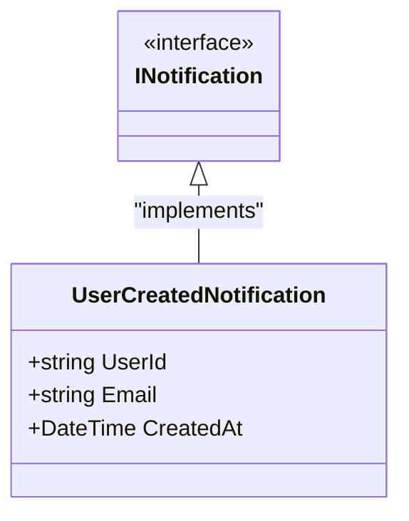

**Diagram sources**
- [INotification.cs](file://src/Relay.Core/Contracts/Requests/INotification.cs)

### INotificationDispatcher Interface

The `INotificationDispatcher` interface defines the contract for dispatching notifications to their respective handlers. It provides a generic method for asynchronous dispatch of notifications, accepting a cancellation token for cooperative cancellation support.

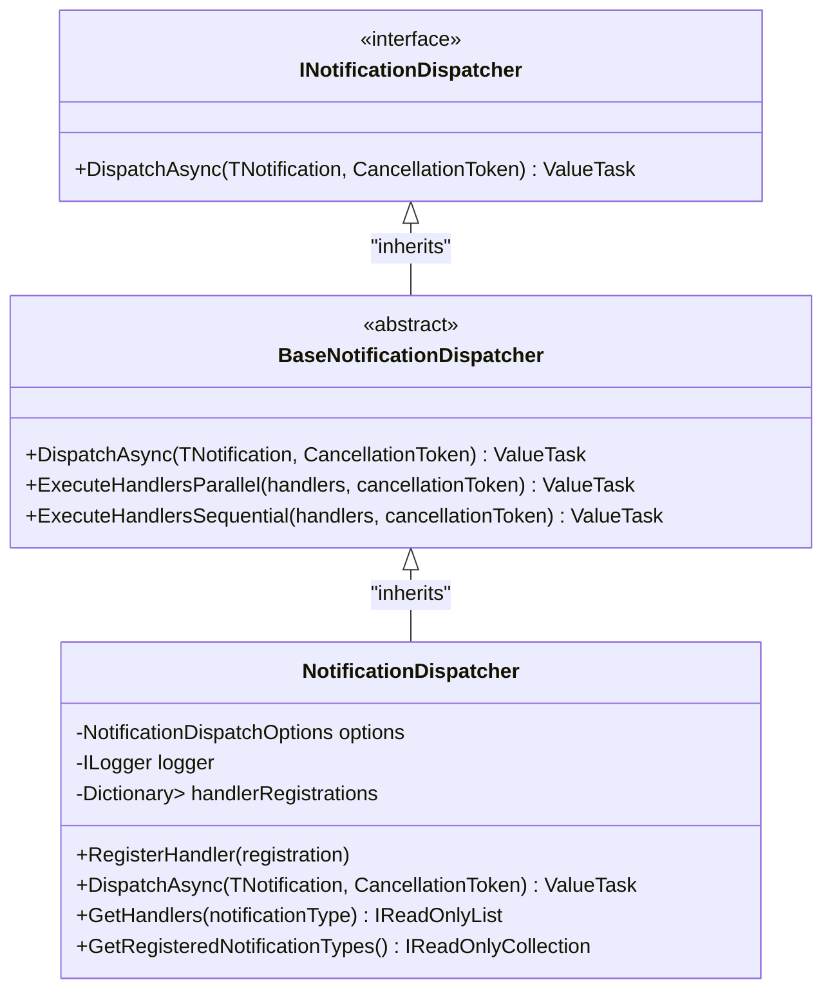

**Diagram sources**
- [INotificationDispatcher.cs](file://src/Relay.Core/Contracts/Dispatchers/INotificationDispatcher.cs)
- [NotificationDispatcher.cs](file://src/Relay.Core/Implementation/Dispatchers/NotificationDispatcher.cs)
- [BaseNotificationDispatcher.cs](file://src/Relay.Core/Implementation/Base/BaseNotificationDispatcher.cs)

**Section sources**
- [INotificationDispatcher.cs](file://src/Relay.Core/Contracts/Dispatchers/INotificationDispatcher.cs)
- [NotificationDispatcher.cs](file://src/Relay.Core/Implementation/Dispatchers/NotificationDispatcher.cs)

## Notification Dispatcher Implementation

The `NotificationDispatcher` class provides the default implementation for handling notification distribution. It maintains an internal registry of notification handlers and supports both parallel and sequential execution modes based on handler configuration.

When dispatching a notification, the dispatcher first checks its internal registration table for handlers. If no registered handlers are found, it falls back to discovering handlers through the dependency injection container, allowing for dynamic handler resolution.

The dispatcher groups handlers by their dispatch mode (parallel or sequential) and executes sequential handlers first, followed by parallel handlers. This ensures predictable execution order for time-sensitive operations while maximizing throughput for independent handlers.

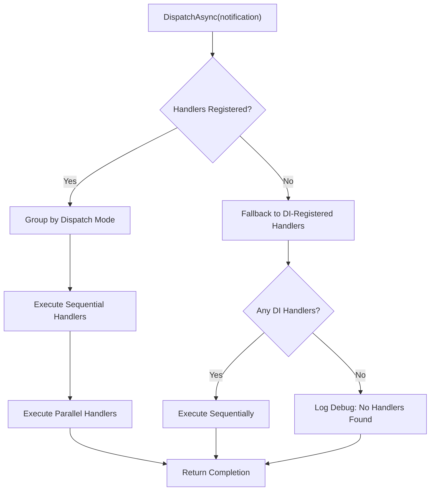

**Diagram sources**
- [NotificationDispatcher.cs](file://src/Relay.Core/Implementation/Dispatchers/NotificationDispatcher.cs)

**Section sources**
- [NotificationDispatcher.cs](file://src/Relay.Core/Implementation/Dispatchers/NotificationDispatcher.cs)

## Handler Registration and Configuration

### Notification Attributes

Relay uses attributes to configure notification handlers declaratively. The `NotificationAttribute` allows developers to specify dispatch behavior and priority for each handler method.

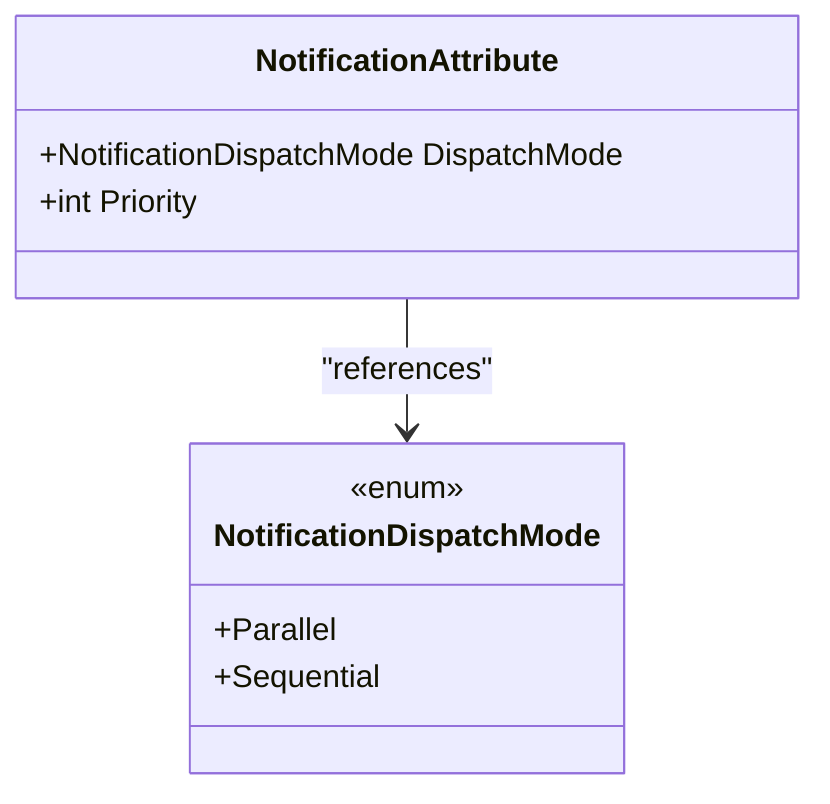

**Diagram sources**
- [NotificationAttribute.cs](file://src/Relay.Core/Attributes/NotificationAttribute.cs)
- [NotificationDispatchMode.cs](file://src/Relay.Core/Attributes/NotificationDispatchMode.cs)

### Handler Registration Model

The `NotificationHandlerRegistration` class encapsulates all metadata required to invoke a notification handler, including the notification type, handler type, dispatch mode, priority, and factory methods for handler creation and execution.

Handler registration supports priority-based sorting, with higher priority handlers executed first within their dispatch mode group. This allows fine-grained control over execution order when needed.

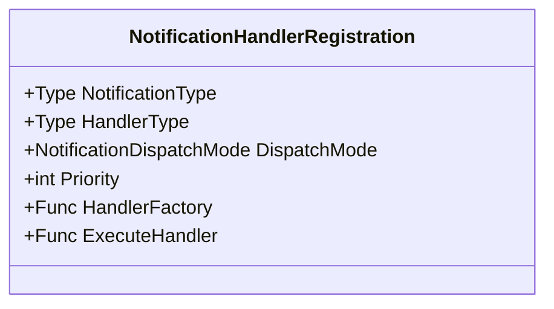

**Diagram sources**
- [NotificationHandlerRegistration.cs](file://src/Relay.Core/Implementation/Configuration/NotificationHandlerRegistration.cs)

**Section sources**
- [NotificationAttribute.cs](file://src/Relay.Core/Attributes/NotificationAttribute.cs)
- [NotificationDispatchMode.cs](file://src/Relay.Core/Attributes/NotificationDispatchMode.cs)
- [NotificationHandlerRegistration.cs](file://src/Relay.Core/Implementation/Configuration/NotificationHandlerRegistration.cs)
- [NotificationDispatchOptions.cs](file://src/Relay.Core/Implementation/Configuration/NotificationDispatchOptions.cs)

## Publishing Strategies

Relay provides multiple publishing strategies through the `INotificationPublisher` interface, allowing different execution models based on application requirements.

### Sequential Publishing

The `SequentialNotificationPublisher` executes handlers one at a time in the order they are provided. If any handler throws an exception, the publishing process stops immediately and the exception propagates to the caller. This strategy ensures predictable execution order and is appropriate for handlers with dependencies or side effects that must occur in a specific sequence.

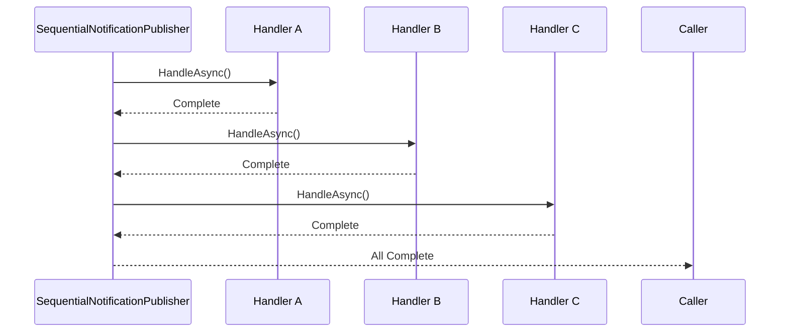

**Diagram sources**
- [SequentialNotificationPublisher.cs](file://src/Relay.Core/Publishing/Strategies/SequentialNotificationPublisher.cs)

### Parallel Publishing

The framework also supports parallel execution through `ParallelNotificationPublisher` and `ParallelWhenAllNotificationPublisher`, which execute all handlers concurrently using `Task.WhenAll`. This maximizes throughput for independent handlers but requires careful consideration of thread safety and resource contention.

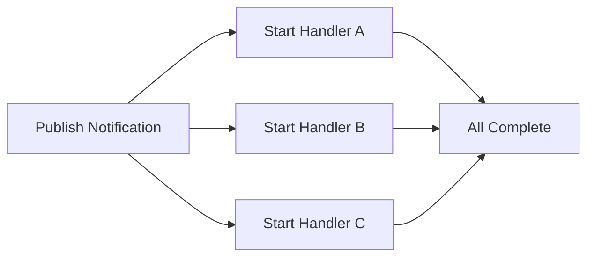

**Section sources**
- [INotificationPublisher.cs](file://src/Relay.Core/Publishing/Interfaces/INotificationPublisher.cs)
- [SequentialNotificationPublisher.cs](file://src/Relay.Core/Publishing/Strategies/SequentialNotificationPublisher.cs)
- [ParallelNotificationPublisher.cs](file://src/Relay.Core/Publishing/Strategies/ParallelNotificationPublisher.cs)

## Dependency Injection Integration

The notification system is tightly integrated with .NET's dependency injection container, supporting both transient and scoped handler lifetimes. When handlers are resolved from the service provider, they follow the lifetime semantics configured in the DI container.

Transient handlers are created fresh for each notification dispatch, ensuring isolation between invocations. Scoped handlers are created once per request or scope, allowing them to maintain state within a logical operation boundary.

The dispatcher creates a new service scope for each handler execution, ensuring proper disposal of disposable services and preventing memory leaks. This design allows handlers to depend on scoped services like database contexts or HTTP clients without lifecycle management concerns.

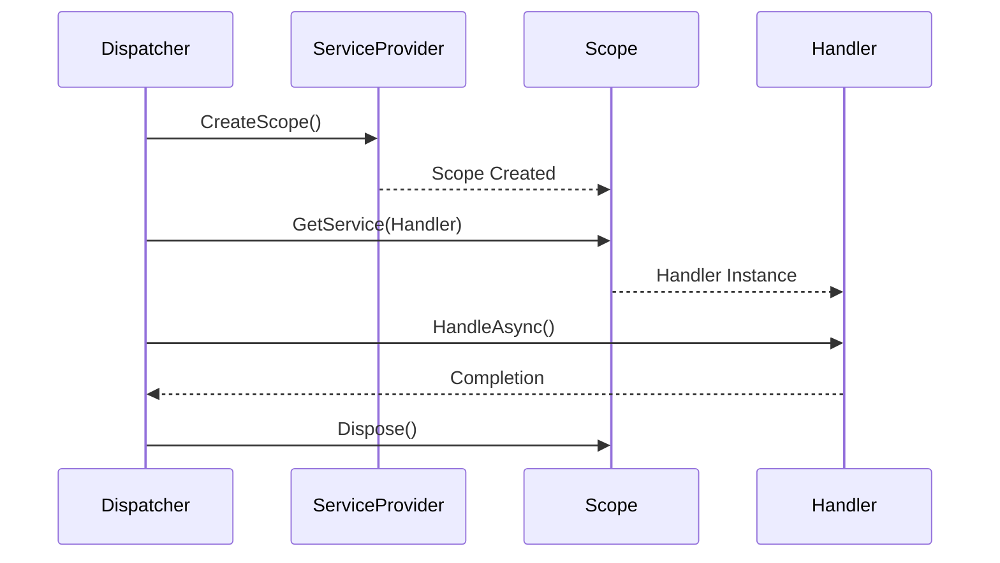

**Section sources**
- [NotificationDispatcher.cs](file://src/Relay.Core/Implementation/Dispatchers/NotificationDispatcher.cs)

## Error Handling and Resilience

The notification system provides configurable error handling through the `NotificationDispatchOptions` class. The `ContinueOnException` property determines whether the dispatcher should continue executing remaining handlers when one fails.

When `ContinueOnException` is true (the default), exceptions from individual handlers are logged but do not prevent other handlers from executing. This "fire and forget" approach is suitable for non-critical notifications where partial success is acceptable.

When `ContinueOnException` is false, any handler exception will terminate the dispatch process and propagate the exception to the caller, ensuring all-or-nothing semantics for critical notifications.

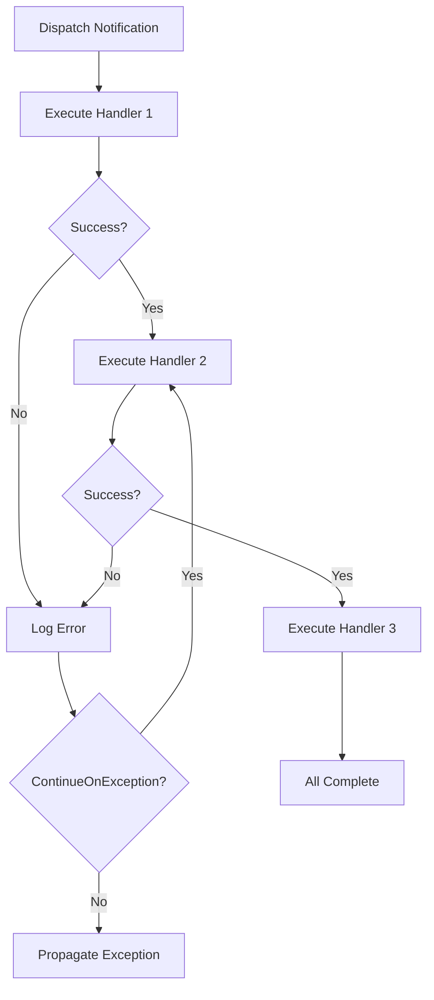

**Section sources**
- [NotificationDispatcher.cs](file://src/Relay.Core/Implementation/Dispatchers/NotificationDispatcher.cs)
- [NotificationDispatchOptions.cs](file://src/Relay.Core/Implementation/Configuration/NotificationDispatchOptions.cs)

## Performance Considerations

The notification system is optimized for high-volume scenarios with several performance-focused features:

- **Parallel Execution**: Independent handlers can execute concurrently, maximizing CPU utilization
- **ValueTask Usage**: Minimizes allocation overhead for synchronous or cached operations
- **Handler Caching**: Registered handlers are cached by notification type for O(1) lookup
- **Optimized Parallel Dispatch**: Single handler optimizations avoid unnecessary task creation

For high-throughput scenarios, consider using parallel dispatch mode and transient handlers to minimize contention. When dealing with I/O-bound handlers (e.g., sending emails, making HTTP calls), parallel execution can significantly reduce overall latency.

The `MaxDegreeOfParallelism` option can be used to limit concurrent execution when resource constraints exist, preventing thread pool exhaustion or database connection limits.

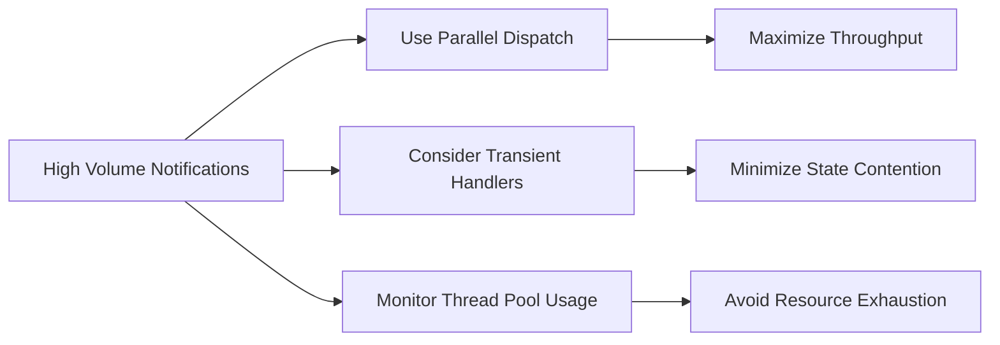

**Section sources**
- [NotificationDispatcher.cs](file://src/Relay.Core/Implementation/Dispatchers/NotificationDispatcher.cs)
- [NotificationDispatchOptions.cs](file://src/Relay.Core/Implementation/Configuration/NotificationDispatchOptions.cs)

## Practical Examples

### Defining a Notification

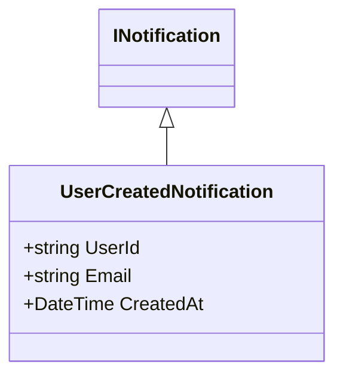

**Diagram sources**
- [UserCreatedNotification.cs](file://samples/Relay.MinimalApiSample/Features/Examples/06-Notifications/UserCreatedNotification.cs)

### Implementing Notification Handlers

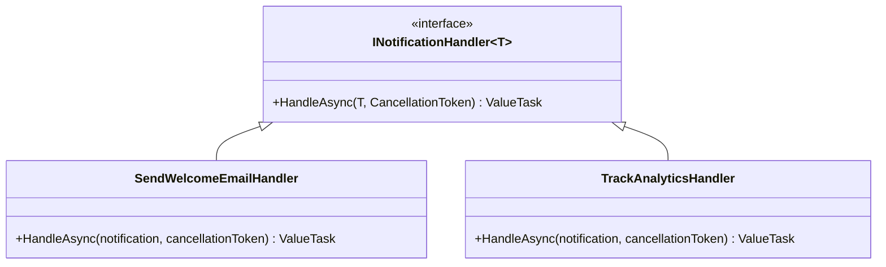

**Diagram sources**
- [SendWelcomeEmailHandler.cs](file://samples/Relay.MinimalApiSample/Features/Examples/06-Notifications/SendWelcomeEmailHandler.cs)
- [TrackAnalyticsHandler.cs](file://samples/Relay.MinimalApiSample/Features/Examples/06-Notifications/TrackAnalyticsHandler.cs)

### Publishing Notifications

The IRelay interface provides methods for publishing notifications through the configured dispatcher. Handlers are automatically discovered and invoked based on the notification type, with execution following the configured dispatch modes and priorities.

**Section sources**
- [SendWelcomeEmailHandler.cs](file://samples/Relay.MinimalApiSample/Features/Examples/06-Notifications/SendWelcomeEmailHandler.cs)
- [TrackAnalyticsHandler.cs](file://samples/Relay.MinimalApiSample/Features/Examples/06-Notifications/TrackAnalyticsHandler.cs)
- [UserCreatedNotification.cs](file://samples/Relay.MinimalApiSample/Features/Examples/06-Notifications/UserCreatedNotification.cs)

## Troubleshooting Guide

Common issues in notification publishing include:

- **Missing Handlers**: Ensure handlers are properly registered in the DI container and marked with appropriate attributes
- **Ordering Issues**: Use priority settings and dispatch modes to control execution sequence
- **Exception Handling**: Configure `ContinueOnException` based on whether partial success is acceptable
- **Performance Bottlenecks**: Monitor handler execution times and consider parallel execution for independent operations
- **Memory Leaks**: Ensure scoped services are properly disposed by using the provided service scope

When handlers fail silently, check logging configuration to ensure error messages are being captured. For debugging complex notification flows, enable trace-level logging to see the complete execution sequence.

**Section sources**
- [NotificationDispatcher.cs](file://src/Relay.Core/Implementation/Dispatchers/NotificationDispatcher.cs)
- [NotificationDispatchOptions.cs](file://src/Relay.Core/Implementation/Configuration/NotificationDispatchOptions.cs)