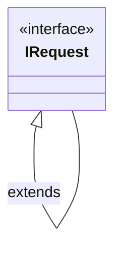
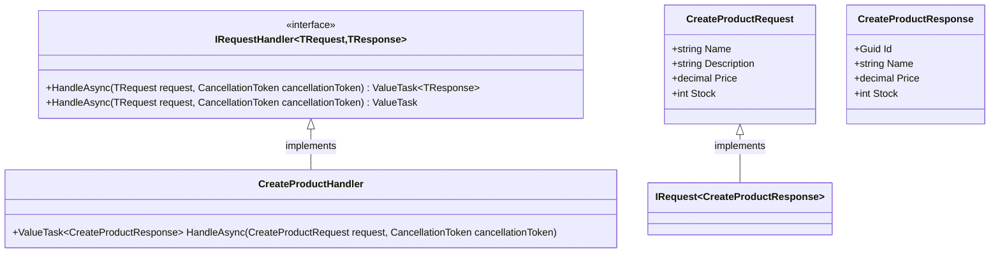
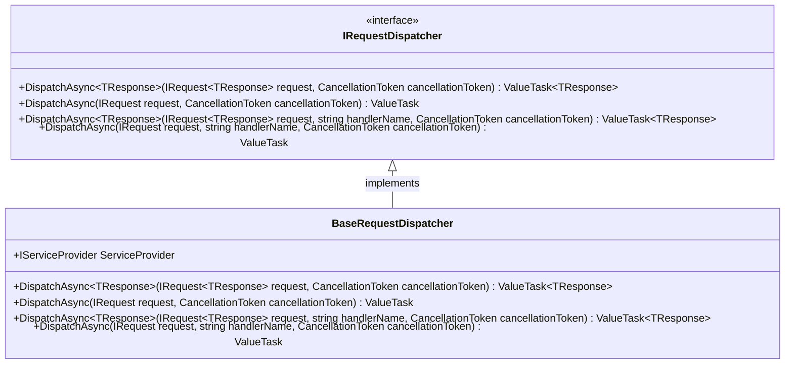
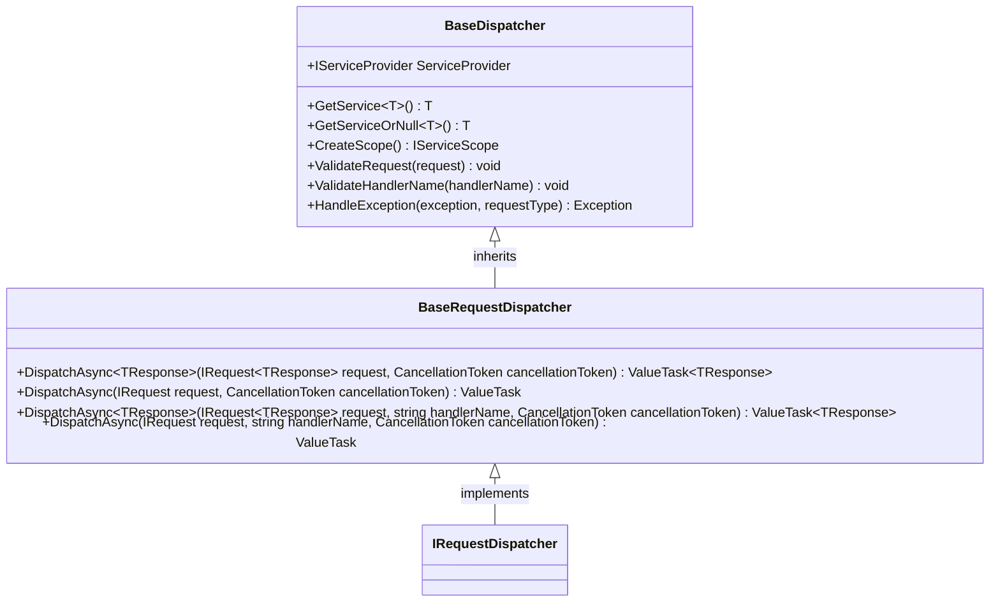
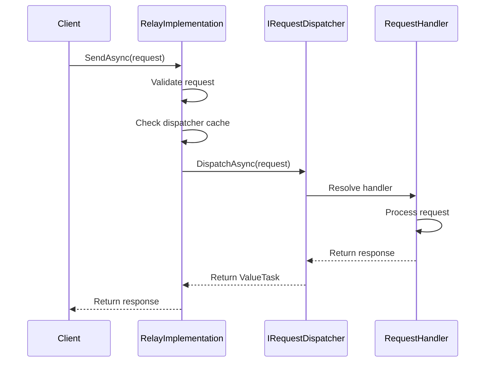
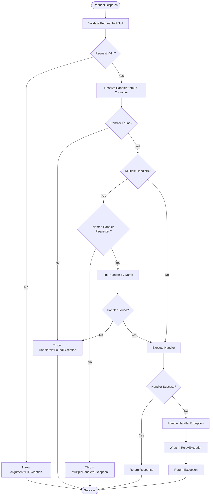

# Request/Response Handling

<cite>
**Referenced Files in This Document**   
- [IRequest.cs](file://src/Relay.Core/Contracts/Requests/IRequest.cs)
- [IRequestDispatcher.cs](file://src/Relay.Core/Contracts/Dispatchers/IRequestDispatcher.cs)
- [IHandlers.cs](file://src/Relay.Core/Contracts/Handlers/IHandlers.cs)
- [BaseRequestDispatcher.cs](file://src/Relay.Core/Implementation/Base/BaseRequestDispatcher.cs)
- [RelayImplementation.cs](file://src/Relay.Core/Implementation/Core/RelayImplementation.cs)
- [CreateProductHandler.cs](file://samples/Relay.MinimalApiSample/Features/Products/CreateProductHandler.cs)
</cite>

## Table of Contents
1. [Introduction](#introduction)
2. [Request Interfaces](#request-interfaces)
3. [Request Handler Interfaces](#request-handler-interfaces)
4. [Request Dispatcher Interface](#request-dispatcher-interface)
5. [Base Request Dispatcher Implementation](#base-request-dispatcher-implementation)
6. [Relay Implementation Integration](#relay-implementation-integration)
7. [Handler Registration and Dependency Injection](#handler-registration-and-dependency-injection)
8. [Error Handling and Exception Management](#error-handling-and-exception-management)
9. [Performance Considerations](#performance-considerations)
10. [Validation and Pipeline Integration](#validation-and-pipeline-integration)

## Introduction

The Request/Response handling system in Relay provides a robust mediator pattern implementation for command and query processing. This documentation details the core interfaces, dispatcher implementations, and integration points that enable efficient request routing and handling within the Relay framework. The system is designed with performance, scalability, and developer experience as primary considerations, leveraging source generation and advanced optimization techniques.

**Section sources**
- [IRequest.cs](file://src/Relay.Core/Contracts/Requests/IRequest.cs)
- [IRequestDispatcher.cs](file://src/Relay.Core/Contracts/Dispatchers/IRequestDispatcher.cs)
- [IHandlers.cs](file://src/Relay.Core/Contracts/Handlers/IHandlers.cs)

## Request Interfaces

The foundation of the request/response pattern in Relay consists of two marker interfaces that define the contract for requests. The `IRequest<TResponse>` interface is used for requests that return a response of type TResponse, while the `IRequest` interface is used for fire-and-forget requests that don't return a response. These interfaces serve as type constraints and enable compile-time verification of request-handler relationships.

**Diagram sources**
- [IRequest.cs](file://src/Relay.Core/Contracts/Requests/IRequest.cs)

**Section sources**
- [IRequest.cs](file://src/Relay.Core/Contracts/Requests/IRequest.cs)

## Request Handler Interfaces

Request handlers implement specific interfaces based on the type of request they handle. The `IRequestHandler<TRequest, TResponse>` interface is implemented by handlers that process requests with responses, where TRequest must implement `IRequest<TResponse>`. For void requests, handlers implement `IRequestHandler<TRequest>` where TRequest implements the base `IRequest` interface. All handlers use the `HandleAsync` method pattern with cancellation support.

**Diagram sources**
- [IHandlers.cs](file://src/Relay.Core/Contracts/Handlers/IHandlers.cs)
- [CreateProductHandler.cs](file://samples/Relay.MinimalApiSample/Features/Products/CreateProductHandler.cs)

**Section sources**
- [IHandlers.cs](file://src/Relay.Core/Contracts/Handlers/IHandlers.cs)
- [CreateProductHandler.cs](file://samples/Relay.MinimalApiSample/Features/Products/CreateProductHandler.cs)

## Request Dispatcher Interface

The `IRequestDispatcher` interface defines the contract for dispatching requests to their corresponding handlers. It provides four overloads of the `DispatchAsync` method to handle both response and void requests, with support for named handlers. The dispatcher abstracts the handler resolution mechanism and provides a consistent API for request processing regardless of the underlying implementation.

**Diagram sources**
- [IRequestDispatcher.cs](file://src/Relay.Core/Contracts/Dispatchers/IRequestDispatcher.cs)
- [BaseRequestDispatcher.cs](file://src/Relay.Core/Implementation/Base/BaseRequestDispatcher.cs)

**Section sources**
- [IRequestDispatcher.cs](file://src/Relay.Core/Contracts/Dispatchers/IRequestDispatcher.cs)

## Base Request Dispatcher Implementation

The `BaseRequestDispatcher` class provides a foundational implementation for request dispatchers, serving as the base class for source-generated optimized dispatchers. It encapsulates common functionality including service provider access, request validation, and exception handling. The abstract methods require concrete implementations to provide the actual dispatching logic, allowing for different strategies such as switch-based dispatching or dictionary lookups.

**Diagram sources**
- [BaseRequestDispatcher.cs](file://src/Relay.Core/Implementation/Base/BaseRequestDispatcher.cs)

**Section sources**
- [BaseRequestDispatcher.cs](file://src/Relay.Core/Implementation/Base/BaseRequestDispatcher.cs)

## Relay Implementation Integration

The `RelayImplementation` class serves as the primary entry point for the Relay framework, integrating the request dispatcher with the service provider and performance optimization features. It implements the `IRelay` interface and provides the `SendAsync` methods that applications use to dispatch requests. The implementation includes sophisticated caching mechanisms, SIMD optimizations, and configurable performance profiles to maximize throughput and minimize latency.

**Diagram sources**
- [RelayImplementation.cs](file://src/Relay.Core/Implementation/Core/RelayImplementation.cs)

**Section sources**
- [RelayImplementation.cs](file://src/Relay.Core/Implementation/Core/RelayImplementation.cs)

## Handler Registration and Dependency Injection

Request handlers are registered with the dependency injection container and resolved at runtime by the dispatcher. The framework supports various lifetime management patterns including transient, scoped, and singleton handlers. Handler registration is typically automated through source generation, which creates optimized dispatchers that use direct type checking and casting for maximum performance. The system also supports named handlers for scenarios requiring multiple handlers for the same request type.

**Section sources**
- [RelayImplementation.cs](file://src/Relay.Core/Implementation/Core/RelayImplementation.cs)
- [IHandlers.cs](file://src/Relay.Core/Contracts/Handlers/IHandlers.cs)

## Error Handling and Exception Management

The request/response system includes comprehensive error handling for common scenarios such as missing handlers and multiple handler conflicts. The `HandlerNotFoundException` is thrown when no handler is registered for a request type, while the `MultipleHandlersException` is thrown when more than one handler is found for a request without a specified name. These exceptions are wrapped in `RelayException` instances with contextual information to aid in debugging and monitoring.

**Diagram sources**
- [RelayImplementation.cs](file://src/Relay.Core/Implementation/Core/RelayImplementation.cs)

**Section sources**
- [RelayImplementation.cs](file://src/Relay.Core/Implementation/Core/RelayImplementation.cs)

## Performance Considerations

The Relay framework incorporates several performance optimizations to ensure high throughput and low latency. These include dispatcher caching, handler caching, aggressive inlining, and SIMD-accelerated batch processing. The `PerformanceOptions` configuration allows tuning of these features based on the application's requirements, with predefined profiles for different scenarios such as low memory, balanced, high throughput, and ultra-low latency.

**Section sources**
- [RelayImplementation.cs](file://src/Relay.Core/Implementation/Core/RelayImplementation.cs)

## Validation and Pipeline Integration

Request processing integrates with validation and pipeline behaviors through a middleware-like pattern. Validation is typically performed through attributes like `ValidateContractAttribute` and pipeline behaviors that execute before the handler. The system supports chaining multiple pipeline behaviors for cross-cutting concerns such as logging, authorization, and caching. Validation errors are returned as part of the response or thrown as exceptions based on configuration.

**Section sources**
- [RelayImplementation.cs](file://src/Relay.Core/Implementation/Core/RelayImplementation.cs)
- [IRequestDispatcher.cs](file://src/Relay.Core/Contracts/Dispatchers/IRequestDispatcher.cs)