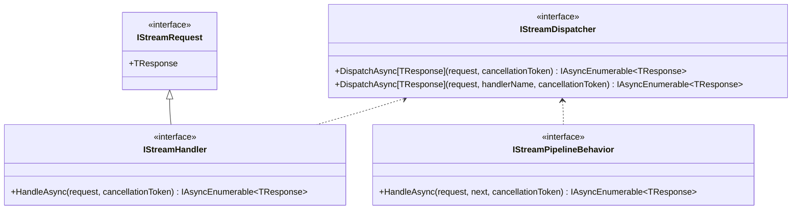
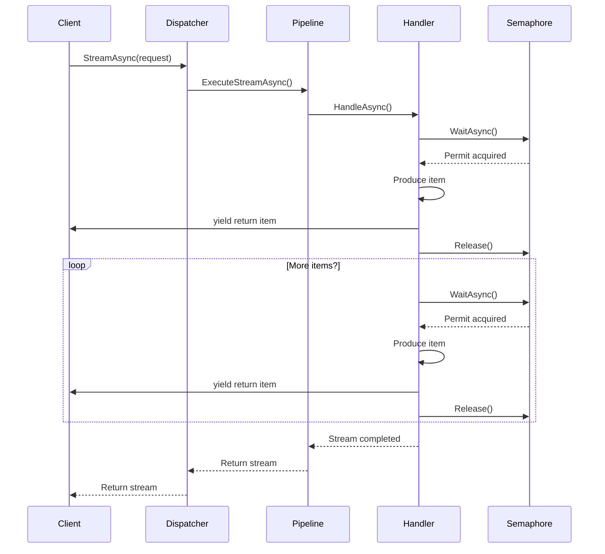
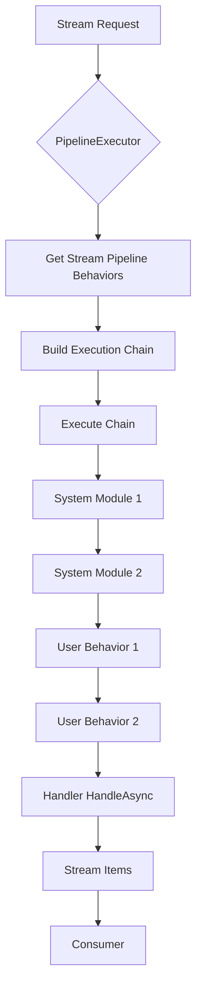
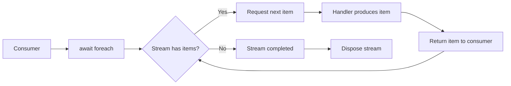
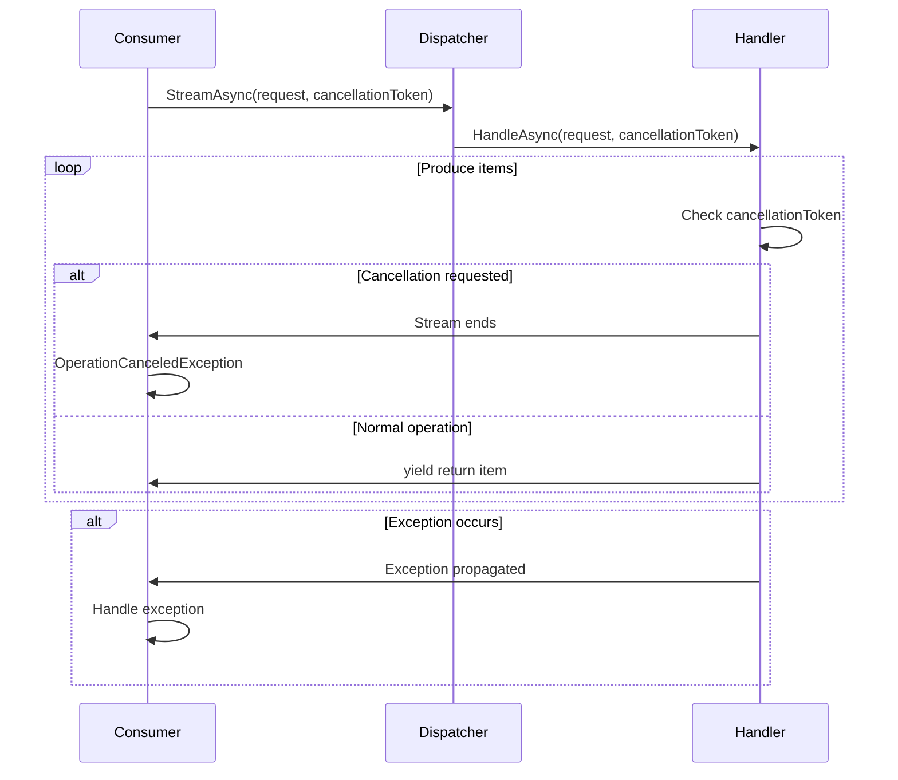

# Streaming Support

<cite>
**Referenced Files in This Document**   
- [IStreamRequest.cs](file://src/Relay.Core/Contracts/Requests/IStreamRequest.cs)
- [IStreamDispatcher.cs](file://src/Relay.Core/Contracts/Dispatchers/IStreamDispatcher.cs)
- [BackpressureStreamDispatcher.cs](file://src/Relay.Core/Implementation/Dispatchers/BackpressureStreamDispatcher.cs)
- [IStreamPipelineBehavior.cs](file://src/Relay.Core/Contracts/Pipeline/IStreamPipelineBehavior.cs)
- [IRelay.cs](file://src/Relay.Core/Contracts/Core/IRelay.cs)
- [StreamLogs.cs](file://samples/Relay.MinimalApiSample/Features/Examples/07-Streaming/StreamLogs.cs)
- [StreamLogsHandler.cs](file://samples/Relay.MinimalApiSample/Features/Examples/07-Streaming/StreamLogsHandler.cs)
- [PipelineExecutor.cs](file://src/Relay.Core/Implementation/Core/PipelineExecutor.cs)
- [IHandlers.cs](file://src/Relay.Core/Contracts/Handlers/IHandlers.cs)
- [BaseStreamDispatcher.cs](file://src/Relay.Core/Implementation/Base/BaseStreamDispatcher.cs)
</cite>

## Table of Contents
1. [Introduction](#introduction)
2. [Core Streaming Interfaces](#core-streaming-interfaces)
3. [IStreamRequest Interface](#istreamrequest-interface)
4. [IStreamDispatcher Interface](#istreamdispatcher-interface)
5. [BackpressureStreamDispatcher Implementation](#backpressurestreamdispatcher-implementation)
6. [IStreamPipelineBehavior Integration](#istreampipelinebehavior-integration)
7. [Streaming with IRelay Interface](#streaming-with-irelay-interface)
8. [Streaming and Asynchronous Enumerables](#streaming-and-asynchronous-enumerables)
9. [Error Handling and Stream Cancellation](#error-handling-and-stream-cancellation)
10. [Performance Considerations](#performance-considerations)
11. [Example Implementation](#example-implementation)
12. [Conclusion](#conclusion)

## Introduction
Relay provides comprehensive support for streaming operations, enabling real-time, continuous data transmission between components. This documentation details the streaming architecture, focusing on the key interfaces and implementations that facilitate efficient, backpressure-aware streaming communication patterns. The system leverages .NET's asynchronous enumerable patterns to provide a natural, efficient way to handle continuous data streams while maintaining proper flow control and resource management.

## Core Streaming Interfaces
The streaming functionality in Relay is built around several core interfaces that define the contract for streaming operations. These interfaces work together to provide a cohesive streaming experience that integrates seamlessly with the overall Relay architecture.



**Diagram sources**
- [IStreamRequest.cs](file://src/Relay.Core/Contracts/Requests/IStreamRequest.cs)
- [IStreamDispatcher.cs](file://src/Relay.Core/Contracts/Dispatchers/IStreamDispatcher.cs)
- [IHandlers.cs](file://src/Relay.Core/Contracts/Handlers/IHandlers.cs)
- [IStreamPipelineBehavior.cs](file://src/Relay.Core/Contracts/Pipeline/IStreamPipelineBehavior.cs)

**Section sources**
- [IStreamRequest.cs](file://src/Relay.Core/Contracts/Requests/IStreamRequest.cs)
- [IStreamDispatcher.cs](file://src/Relay.Core/Contracts/Dispatchers/IStreamDispatcher.cs)
- [IHandlers.cs](file://src/Relay.Core/Contracts/Handlers/IHandlers.cs)
- [IStreamPipelineBehavior.cs](file://src/Relay.Core/Contracts/Pipeline/IStreamPipelineBehavior.cs)

## IStreamRequest Interface
The `IStreamRequest<TResponse>` interface serves as a marker interface for requests that return multiple responses through streaming. It defines the contract for streaming requests, specifying the type of response items that will be produced.

The interface is covariant in its type parameter (`out TResponse`), allowing for polymorphic behavior where a handler for a base response type can be used with requests that expect derived types. This enables flexible handler registration and reuse across related request types.

As a marker interface, `IStreamRequest<TResponse>` doesn't define any members but serves as a type constraint that enables the Relay framework to identify and handle streaming requests appropriately. This pattern allows the framework to provide specialized dispatching logic for streaming operations while maintaining type safety.

**Section sources**
- [IStreamRequest.cs](file://src/Relay.Core/Contracts/Requests/IStreamRequest.cs)

## IStreamDispatcher Interface
The `IStreamDispatcher` interface defines the contract for dispatching streaming requests to their handlers. It provides two primary methods for dispatching streaming requests:

1. `DispatchAsync<TResponse>(IStreamRequest<TResponse> request, CancellationToken cancellationToken)` - Dispatches a streaming request to its handler using type-based resolution.
2. `DispatchAsync<TResponse>(IStreamRequest<TResponse> request, string handlerName, CancellationToken cancellationToken)` - Dispatches a streaming request to a specifically named handler.

Both methods return an `IAsyncEnumerable<TResponse>` which represents the stream of response items. The returned enumerable is lazily evaluated, meaning that items are produced on-demand as the consumer iterates through the stream. This enables efficient memory usage and supports backpressure patterns where the consumer controls the rate of data production.

The interface is designed to be implemented by generated code, allowing the Relay framework to optimize dispatching performance by eliminating reflection overhead at runtime.

**Section sources**
- [IStreamDispatcher.cs](file://src/Relay.Core/Contracts/Dispatchers/IStreamDispatcher.cs)

## BackpressureStreamDispatcher Implementation
The `BackpressureStreamDispatcher` class provides a concrete implementation of the `IStreamDispatcher` interface with built-in support for backpressure and flow control. It inherits from `BaseStreamDispatcher` and adds concurrency and buffering controls to manage stream production rates.

Key features of the `BackpressureStreamDispatcher` include:

- **Configurable concurrency**: The `_maxConcurrency` parameter limits the number of concurrent operations, preventing resource exhaustion.
- **Buffer size control**: The `_bufferSize` parameter manages the internal buffer for flow control, though the current implementation primarily uses the semaphore for backpressure.
- **Semaphore-based backpressure**: Uses a `SemaphoreSlim` to control the flow of items, ensuring that producers don't overwhelm consumers.

The dispatcher integrates with the `PipelineExecutor` to execute streaming requests through the configured pipeline behaviors before reaching the handler. This allows cross-cutting concerns like logging, monitoring, and error handling to be applied consistently across all streaming operations.

When dispatching a request, the dispatcher first validates the request and then executes it through the pipeline. The `CreateBackpressureStream` method implements the core streaming logic, using the semaphore to control the flow of items from the handler to the consumer.



**Diagram sources**
- [BackpressureStreamDispatcher.cs](file://src/Relay.Core/Implementation/Dispatchers/BackpressureStreamDispatcher.cs)
- [PipelineExecutor.cs](file://src/Relay.Core/Implementation/Core/PipelineExecutor.cs)
- [IHandlers.cs](file://src/Relay.Core/Contracts/Handlers/IHandlers.cs)

**Section sources**
- [BackpressureStreamDispatcher.cs](file://src/Relay.Core/Implementation/Dispatchers/BackpressureStreamDispatcher.cs)
- [BaseStreamDispatcher.cs](file://src/Relay.Core/Implementation/Base/BaseStreamDispatcher.cs)

## IStreamPipelineBehavior Integration
The `IStreamPipelineBehavior<TRequest, TResponse>` interface enables the application of cross-cutting concerns to streaming operations through a pipeline pattern. Pipeline behaviors are executed in order before the actual streaming handler, allowing for interception and modification of the streaming process.

Key aspects of the pipeline behavior implementation:

- **Ordered execution**: Behaviors are executed in a specific order, with system modules having priority over user-defined behaviors.
- **Chain of responsibility**: Each behavior receives a delegate to the next behavior or handler in the chain, enabling wrapping of execution.
- **Return type consistency**: Unlike regular pipeline behaviors that return `ValueTask<TResponse>`, stream pipeline behaviors return `IAsyncEnumerable<TResponse>`, preserving the streaming nature of the operation.

The `PipelineExecutor.ExecuteStreamAsync` method orchestrates the execution of stream pipeline behaviors by:

1. Retrieving all registered stream pipeline behaviors for the request type
2. Building an execution chain by wrapping each behavior around the next
3. Executing the chain, with the final delegate calling the handler's `HandleAsync` method

This design allows behaviors to perform actions both before and after the streaming operation, such as logging start and completion events, measuring performance metrics, or implementing custom error handling strategies.



**Diagram sources**
- [IStreamPipelineBehavior.cs](file://src/Relay.Core/Contracts/Pipeline/IStreamPipelineBehavior.cs)
- [PipelineExecutor.cs](file://src/Relay.Core/Implementation/Core/PipelineExecutor.cs)

**Section sources**
- [IStreamPipelineBehavior.cs](file://src/Relay.Core/Contracts/Pipeline/IStreamPipelineBehavior.cs)
- [PipelineExecutor.cs](file://src/Relay.Core/Implementation/Core/PipelineExecutor.cs)

## Streaming with IRelay Interface
The `IRelay` interface provides the primary entry point for streaming operations through its `StreamAsync<TResponse>` method. This method serves as the public API for initiating streaming requests and abstracts away the underlying dispatcher implementation.

Key features of the streaming API:

- **Simplified consumer interface**: Consumers only need to interact with the `IRelay` interface, not the dispatcher directly
- **CancellationToken support**: All streaming operations accept a cancellation token, enabling graceful shutdown of long-running streams
- **Type safety**: The generic method signature ensures type safety while maintaining flexibility

The `StreamAsync` method returns an `IAsyncEnumerable<TResponse>` which can be consumed using the `await foreach` syntax. This provides a natural, readable way to process streaming data while maintaining asynchronous execution and proper resource management.

When a streaming request is dispatched through `IRelay.StreamAsync`, it follows this flow:
1. The request is passed to the registered `IStreamDispatcher`
2. The dispatcher executes the request through the pipeline behaviors
3. The handler produces items via `IAsyncEnumerable`
4. Items are returned to the consumer as they become available

This architecture enables efficient, backpressure-aware streaming while maintaining a clean, intuitive API for consumers.

**Section sources**
- [IRelay.cs](file://src/Relay.Core/Contracts/Core/IRelay.cs)

## Streaming and Asynchronous Enumerables
Relay's streaming implementation is built on .NET's `IAsyncEnumerable<T>` pattern, which provides a modern, efficient way to handle sequences of data that are produced asynchronously. This pattern offers several advantages over traditional approaches:

- **Memory efficiency**: Items are produced on-demand rather than buffering the entire sequence
- **Backpressure support**: Consumers control the rate of data production through enumeration
- **Natural syntax**: The `await foreach` syntax provides a clean, readable way to consume streams
- **Cancellation support**: Built-in support for cancellation through `CancellationToken`

The `IAsyncEnumerable<T>` pattern works by combining the enumeration pattern with async/await, allowing asynchronous operations to be performed between yielding items. In Relay's implementation, this enables handlers to perform asynchronous operations (like database queries or API calls) between yielding individual items.

Key considerations when working with asynchronous enumerables:

- **Proper disposal**: Streams should be properly disposed to release resources
- **Exception handling**: Exceptions can occur during enumeration and should be handled appropriately
- **Cancellation**: Consumers should respect cancellation tokens to allow graceful shutdown
- **Performance**: The pattern minimizes memory usage by avoiding buffering of entire sequences



**Diagram sources**
- [IHandlers.cs](file://src/Relay.Core/Contracts/Handlers/IHandlers.cs)
- [BackpressureStreamDispatcher.cs](file://src/Relay.Core/Implementation/Dispatchers/BackpressureStreamDispatcher.cs)

**Section sources**
- [IHandlers.cs](file://src/Relay.Core/Contracts/Handlers/IHandlers.cs)

## Error Handling and Stream Cancellation
Effective error handling and cancellation are critical for robust streaming implementations. Relay provides several mechanisms to handle these scenarios:

### Stream Cancellation
Streaming operations support cancellation through the `CancellationToken` parameter. When a cancellation token is signaled:

- The consumer's `await foreach` loop will be interrupted
- The handler should check `cancellationToken.IsCancellationRequested` and exit gracefully
- Resources should be properly cleaned up

Best practices for cancellation:
- Handlers should check the cancellation token frequently, especially in loops
- Long-running operations should pass the cancellation token to underlying async methods
- Cleanup code should execute in `finally` blocks to ensure resource release

### Error Handling
Errors in streaming operations can occur at various points:
- During handler execution
- In pipeline behaviors
- During item production

Relay's error handling strategy:
- Exceptions are propagated to the consumer through the `IAsyncEnumerable`
- Pipeline behaviors can implement custom error handling logic
- The framework ensures proper cleanup even when exceptions occur

Common error scenarios and mitigation:
- **Network failures**: Implement retry logic in appropriate pipeline behaviors
- **Resource exhaustion**: Use backpressure to prevent overwhelming consumers
- **Data corruption**: Validate data before yielding items
- **Handler failures**: Ensure handlers are stateless and can be safely retried



**Diagram sources**
- [BackpressureStreamDispatcher.cs](file://src/Relay.Core/Implementation/Dispatchers/BackpressureStreamDispatcher.cs)
- [StreamLogsHandler.cs](file://samples/Relay.MinimalApiSample/Features/Examples/07-Streaming/StreamLogsHandler.cs)

**Section sources**
- [BackpressureStreamDispatcher.cs](file://src/Relay.Core/Implementation/Dispatchers/BackpressureStreamDispatcher.cs)
- [StreamLogsHandler.cs](file://samples/Relay.MinimalApiSample/Features/Examples/07-Streaming/StreamLogsHandler.cs)

## Performance Considerations
Streaming operations require careful consideration of performance characteristics, particularly regarding memory usage, connection management, and backpressure strategies.

### Memory Usage
- **Avoid buffering**: The streaming pattern minimizes memory usage by producing items on-demand
- **Object pooling**: Consider pooling frequently used objects to reduce GC pressure
- **Stream size awareness**: Be mindful of the potential size of streams and implement appropriate limits

### Connection Management
- **Connection reuse**: Reuse connections where possible to reduce overhead
- **Timeout configuration**: Set appropriate timeouts for long-running streams
- **Heartbeats**: Implement heartbeat mechanisms for very long-running streams to prevent timeouts

### Backpressure Strategies
The `BackpressureStreamDispatcher` provides several configuration options for managing flow control:

- **Max concurrency**: Limits the number of concurrent operations to prevent resource exhaustion
- **Buffer size**: Controls the internal buffer for flow control (though primarily managed by the semaphore)
- **Semaphore-based throttling**: Uses `SemaphoreSlim` to control the rate of item production

High-throughput scenarios should consider:
- Tuning concurrency limits based on system capabilities
- Monitoring stream performance metrics
- Implementing adaptive backpressure that responds to consumer demand
- Using appropriate batching strategies when applicable

### Optimization Recommendations
- Use the generated dispatcher implementation for optimal performance
- Minimize work in pipeline behaviors to reduce overhead
- Consider using `ValueTask` for handlers that may complete synchronously
- Monitor and tune backpressure parameters based on actual usage patterns

**Section sources**
- [BackpressureStreamDispatcher.cs](file://src/Relay.Core/Implementation/Dispatchers/BackpressureStreamDispatcher.cs)
- [PipelineExecutor.cs](file://src/Relay.Core/Implementation/Core/PipelineExecutor.cs)

## Example Implementation
The following example demonstrates how to implement a streaming feature in Relay:

```csharp
// Define the streaming request
public record StreamLogsRequest(DateTime StartDate) : IRequest<IAsyncEnumerable<LogEntry>>;

public record LogEntry(Guid Id, DateTime Timestamp, string Level, string Message);

// Implement the handler
public class StreamLogsHandler : IRequestHandler<StreamLogsRequest, IAsyncEnumerable<LogEntry>>
{
    private readonly ILogger<StreamLogsHandler> _logger;

    public StreamLogsHandler(ILogger<StreamLogsHandler> logger)
    {
        _logger = logger;
    }

    public ValueTask<IAsyncEnumerable<LogEntry>> HandleAsync(
        StreamLogsRequest request,
        CancellationToken cancellationToken = default)
    {
        return ValueTask.FromResult(StreamLogsAsync(request, cancellationToken));
    }

    private async IAsyncEnumerable<LogEntry> StreamLogsAsync(
        StreamLogsRequest request,
        [EnumeratorCancellation] CancellationToken cancellationToken = default)
    {
        _logger.LogInformation("Starting log stream from {StartDate}", request.StartDate);

        var levels = new[] { "INFO", "DEBUG", "WARNING", "ERROR" };
        var messages = new[]
        {
            "Application started",
            "User logged in",
            "Database query executed",
            "Cache miss",
            "API request processed"
        };

        for (int i = 0; i < 10; i++)
        {
            if (cancellationToken.IsCancellationRequested)
            {
                _logger.LogInformation("Log stream cancelled");
                yield break;
            }

            await Task.Delay(100, cancellationToken);

            var logEntry = new LogEntry(
                Guid.NewGuid(),
                DateTime.UtcNow,
                levels[i % levels.Length],
                $"{messages[i % messages.Length]} (Entry #{i + 1})"
            );

            _logger.LogDebug("Streaming log entry: {Message}", logEntry.Message);

            yield return logEntry;
        }

        _logger.LogInformation("Log stream completed");
    }
}
```

To consume the stream:

```csharp
var request = new StreamLogsRequest(DateTime.UtcNow.AddHours(-1));
await foreach (var logEntry in relay.StreamAsync(request))
{
    Console.WriteLine($"{logEntry.Timestamp:HH:mm:ss} [{logEntry.Level}] {logEntry.Message}");
}
```

This example demonstrates key streaming concepts:
- Using `IAsyncEnumerable<T>` for the response type
- Proper cancellation handling with `[EnumeratorCancellation]`
- Incremental item production with `yield return`
- Appropriate error and cancellation handling

**Section sources**
- [StreamLogs.cs](file://samples/Relay.MinimalApiSample/Features/Examples/07-Streaming/StreamLogs.cs)
- [StreamLogsHandler.cs](file://samples/Relay.MinimalApiSample/Features/Examples/07-Streaming/StreamLogsHandler.cs)

## Conclusion
Relay's streaming support provides a robust, efficient framework for implementing real-time, continuous data transmission patterns. By leveraging .NET's `IAsyncEnumerable<T>` pattern and combining it with a sophisticated pipeline architecture, Relay enables developers to build high-performance streaming features with proper backpressure, error handling, and resource management.

The key components—IStreamRequest, IStreamDispatcher, BackpressureStreamDispatcher, and IStreamPipelineBehavior—work together to provide a cohesive streaming experience that balances performance, reliability, and developer productivity. The integration with the IRelay interface ensures a consistent API across all messaging patterns in the framework.

When implementing streaming features, developers should pay particular attention to cancellation handling, error propagation, and performance characteristics to ensure robust, production-ready solutions. The example implementation provides a template for building streaming handlers that follow best practices for the Relay framework.