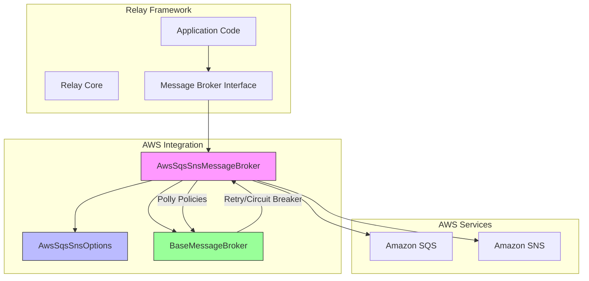
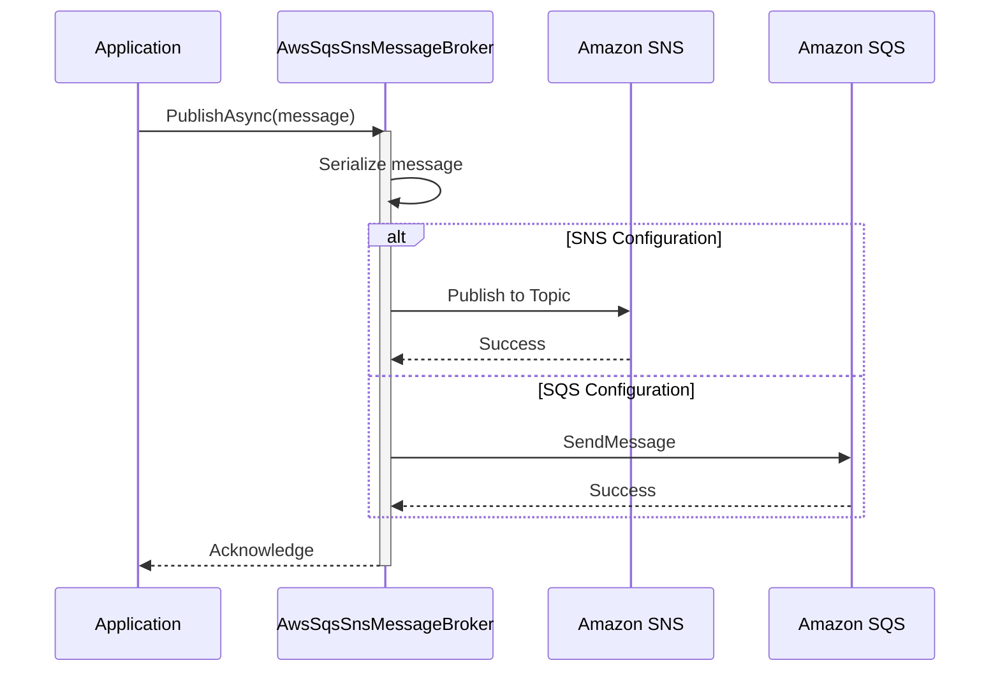
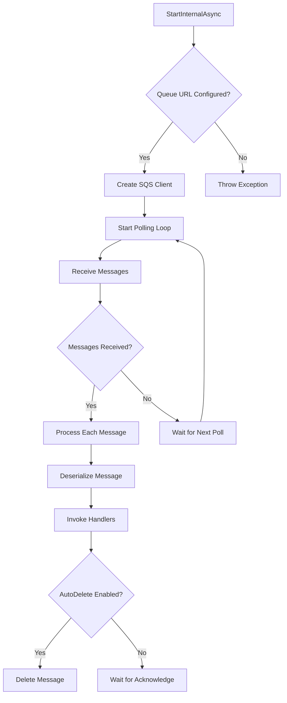
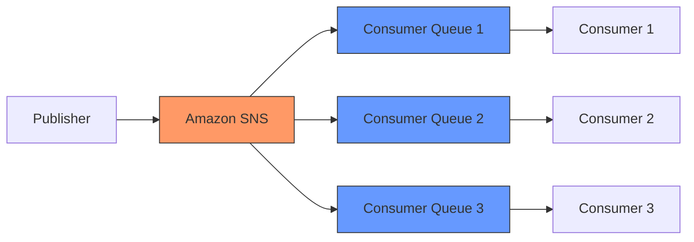

# AWS SQS/SNS Integration

<cite>
**Referenced Files in This Document**   
- [AwsSqsSnsMessageBroker.cs](file://src/Relay.MessageBroker/AwsSqsSns/AwsSqsSnsMessageBroker.cs)
- [AwsSqsSnsOptions.cs](file://src/Relay.MessageBroker/AwsSqsSns/AwsSqsSnsOptions.cs)
- [BaseMessageBroker.cs](file://src/Relay.MessageBroker/Core/BaseMessageBroker.cs)
- [MessageBrokerOptions.cs](file://src/Relay.MessageBroker/Configuration/MessageBrokerOptions.cs)
- [CommonMessageBrokerOptions.cs](file://src/Relay.MessageBroker/Common/CommonMessageBrokerOptions.cs)
</cite>

## Table of Contents
1. [Introduction](#introduction)
2. [Architecture Overview](#architecture-overview)
3. [Core Components](#core-components)
4. [Configuration Options](#configuration-options)
5. [Implementation Details](#implementation-details)
6. [Integration Patterns](#integration-patterns)
7. [Error Handling and Best Practices](#error-handling-and-best-practices)
8. [Performance Considerations](#performance-considerations)
9. [Troubleshooting Guide](#troubleshooting-guide)
10. [Conclusion](#conclusion)

## Introduction
The AWS SQS/SNS integration in the Relay framework provides a robust messaging solution that combines the queuing capabilities of Amazon SQS (Simple Queue Service) with the publish/subscribe model of Amazon SNS (Simple Notification Service). This integration enables developers to build scalable, decoupled applications with reliable message delivery and processing. The implementation follows a modular design pattern, with the AwsSqsSnsMessageBroker class serving as the primary interface for interacting with AWS messaging services. The framework supports both standard and FIFO (First-In-First-Out) queues, message attributes, and various configuration options for tuning performance and reliability.

## Architecture Overview
The AWS SQS/SNS integration architecture in Relay follows a layered approach that abstracts the complexity of AWS SDK interactions while providing comprehensive messaging capabilities. The design centers around the AwsSqsSnsMessageBroker class, which inherits from BaseMessageBroker and implements the IMessageBroker interface. This architecture enables seamless integration with the broader Relay framework while maintaining separation of concerns.



**Diagram sources**
- [AwsSqsSnsMessageBroker.cs](file://src/Relay.MessageBroker/AwsSqsSns/AwsSqsSnsMessageBroker.cs#L25-L378)
- [BaseMessageBroker.cs](file://src/Relay.MessageBroker/Core/BaseMessageBroker.cs#L19-L506)
- [AwsSqsSnsOptions.cs](file://src/Relay.MessageBroker/AwsSqsSns/AwsSqsSnsOptions.cs#L6-L76)

**Section sources**
- [AwsSqsSnsMessageBroker.cs](file://src/Relay.MessageBroker/AwsSqsSns/AwsSqsSnsMessageBroker.cs#L1-L378)
- [BaseMessageBroker.cs](file://src/Relay.MessageBroker/Core/BaseMessageBroker.cs#L1-L506)

## Core Components

The AWS SQS/SNS integration consists of several core components that work together to provide a comprehensive messaging solution. The primary component is the AwsSqsSnsMessageBroker class, which handles all interactions with AWS services. This class is responsible for message publishing, subscription management, and message processing. It leverages the BaseMessageBroker class for common functionality such as retry policies, circuit breakers, and telemetry. The AwsSqsSnsOptions class provides configuration options for the AWS integration, including region, credentials, and queue/topic settings.

The integration uses Polly for resilience, implementing retry policies, circuit breakers, and timeouts for AWS operations. Message serialization is handled through System.Text.Json, with support for compression and contract validation. The framework also includes poison message handling and backpressure management to ensure reliable message processing under various conditions.

**Section sources**
- [AwsSqsSnsMessageBroker.cs](file://src/Relay.MessageBroker/AwsSqsSns/AwsSqsSnsMessageBroker.cs#L25-L378)
- [AwsSqsSnsOptions.cs](file://src/Relay.MessageBroker/AwsSqsSns/AwsSqsSnsOptions.cs#L6-L76)
- [BaseMessageBroker.cs](file://src/Relay.MessageBroker/Core/BaseMessageBroker.cs#L19-L506)

## Configuration Options

The AWS SQS/SNS integration provides extensive configuration options through the AwsSqsSnsOptions class. These options allow developers to customize the behavior of the messaging system to meet specific requirements.

### AWS Configuration
The integration supports various AWS-specific configuration options:

**AwsSqsSnsOptions Configuration**
| Property | Type | Default Value | Description |
|---------|------|-------------|-------------|
| Region | string | "us-east-1" | AWS region for SQS/SNS services |
| AccessKeyId | string? | null | AWS access key ID for authentication |
| SecretAccessKey | string? | null | AWS secret access key for authentication |
| DefaultQueueUrl | string? | null | Default SQS queue URL for message consumption |
| DefaultTopicArn | string? | null | Default SNS topic ARN for pub/sub messaging |
| VisibilityTimeout | TimeSpan | 30 seconds | SQS message visibility timeout |
| MaxNumberOfMessages | int | 10 | Maximum number of messages to receive in a single call |
| WaitTimeSeconds | TimeSpan | 20 seconds | Long polling wait time for SQS |
| UseFifo | bool | false | Flag to enable FIFO queue support |
| UseFifoQueue | bool | false | Alternative flag for FIFO queue support |
| MessageGroupId | string? | null | Message group ID for FIFO queues |
| MessageDeduplicationId | string? | null | Message deduplication ID for FIFO queues |
| AutoDeleteMessages | bool | true | Flag to automatically delete processed messages |
| MessageRetentionPeriod | TimeSpan | 4 days | Message retention period in the queue |

These configuration options can be set programmatically or through configuration files, allowing for flexible deployment scenarios. The framework also supports AWS credentials through environment variables, IAM roles, or explicit configuration.

**Section sources**
- [AwsSqsSnsOptions.cs](file://src/Relay.MessageBroker/AwsSqsSns/AwsSqsSnsOptions.cs#L6-L76)
- [MessageBrokerOptions.cs](file://src/Relay.MessageBroker/Configuration/MessageBrokerOptions.cs#L36-L37)

## Implementation Details

The implementation of the AWS SQS/SNS integration follows a well-structured approach that separates concerns and promotes reusability. The AwsSqsSnsMessageBroker class implements the core messaging functionality while leveraging the BaseMessageBroker for common operations.

### Message Publishing
The PublishInternalAsync method handles message publishing to either SQS or SNS based on configuration. When a DefaultTopicArn is configured, messages are published to SNS for pub/sub distribution. When a DefaultQueueUrl is configured, messages are sent directly to SQS for point-to-point communication.



**Diagram sources**
- [AwsSqsSnsMessageBroker.cs](file://src/Relay.MessageBroker/AwsSqsSns/AwsSqsSnsMessageBroker.cs#L92-L180)
- [BaseMessageBroker.cs](file://src/Relay.MessageBroker/Core/BaseMessageBroker.cs#L113-L182)

### Message Consumption
The StartInternalAsync method initiates long polling for messages from the configured SQS queue. The implementation uses a background task to continuously poll for messages, process them, and handle acknowledgments.



**Diagram sources**
- [AwsSqsSnsMessageBroker.cs](file://src/Relay.MessageBroker/AwsSqsSns/AwsSqsSnsMessageBroker.cs#L192-L237)
- [AwsSqsSnsMessageBroker.cs](file://src/Relay.MessageBroker/AwsSqsSns/AwsSqsSnsMessageBroker.cs#L263-L323)

**Section sources**
- [AwsSqsSnsMessageBroker.cs](file://src/Relay.MessageBroker/AwsSqsSns/AwsSqsSnsMessageBroker.cs#L92-L378)

## Integration Patterns

The AWS SQS/SNS integration in Relay supports several integration patterns that enable decoupled architectures and scalable applications.

### Pub/Sub Pattern
The integration supports the publish/subscribe pattern through Amazon SNS. When a DefaultTopicArn is configured, messages are published to an SNS topic, which can have multiple SQS queues subscribed to it. This enables event-driven architectures where multiple services can react to the same events without being tightly coupled.

### Message Queuing Pattern
For point-to-point communication, the integration uses Amazon SQS directly. This pattern is suitable for work distribution, where messages are processed by a single consumer. The implementation supports both standard and FIFO queues, with appropriate configuration options for message ordering and deduplication.

### Hybrid Pattern
The framework supports a hybrid approach where SNS is used for fan-out distribution and SQS for reliable message processing. This pattern combines the benefits of both services, enabling scalable event distribution with guaranteed message delivery.



**Diagram sources**
- [AwsSqsSnsMessageBroker.cs](file://src/Relay.MessageBroker/AwsSqsSns/AwsSqsSnsMessageBroker.cs#L101-L131)
- [AwsSqsSnsMessageBroker.cs](file://src/Relay.MessageBroker/AwsSqsSns/AwsSqsSnsMessageBroker.cs#L132-L176)

**Section sources**
- [AwsSqsSnsMessageBroker.cs](file://src/Relay.MessageBroker/AwsSqsSns/AwsSqsSnsMessageBroker.cs#L92-L180)

## Error Handling and Best Practices

The AWS SQS/SNS integration includes comprehensive error handling mechanisms to ensure reliable message processing.

### Resilience Features
The implementation uses Polly to provide resilience features:

- **Retry Policy**: Automatically retries failed operations with exponential backoff
- **Circuit Breaker**: Prevents cascading failures by temporarily stopping requests when failures exceed a threshold
- **Timeout Policy**: Ensures operations complete within a specified time limit

### Common Issues and Solutions
**Message Duplication**
SQS may deliver messages multiple times. The framework addresses this through:
- Idempotent message processing
- Use of FIFO queues with message deduplication IDs
- Application-level deduplication logic

**Delivery Delays**
To minimize delivery delays:
- Configure appropriate WaitTimeSeconds for long polling
- Optimize VisibilityTimeout based on processing time
- Monitor queue metrics and adjust scaling accordingly

**Permission Errors**
Ensure proper IAM permissions are configured:
- sqs:SendMessage, sqs:ReceiveMessage, sqs:DeleteMessage for SQS
- sns:Publish for SNS
- Use IAM roles when running in AWS environments

### Best Practices
1. **Configure appropriate visibility timeouts** based on message processing time
2. **Use dead-letter queues** for failed message handling
3. **Implement proper error handling** in message processors
4. **Monitor queue metrics** for performance optimization
5. **Use message attributes** for metadata instead of including in message body
6. **Enable server-side encryption** for sensitive data

**Section sources**
- [AwsSqsSnsMessageBroker.cs](file://src/Relay.MessageBroker/AwsSqsSns/AwsSqsSnsMessageBroker.cs#L51-L90)
- [AwsSqsSnsMessageBroker.cs](file://src/Relay.MessageBroker/AwsSqsSns/AwsSqsSnsMessageBroker.cs#L263-L323)
- [BaseMessageBroker.cs](file://src/Relay.MessageBroker/Core/BaseMessageBroker.cs#L387-L431)

## Performance Considerations

The AWS SQS/SNS integration is designed with performance in mind, incorporating several optimization strategies.

### Configuration Tuning
Key performance-related configuration options:
- **MaxNumberOfMessages**: Increase for higher throughput (up to 10)
- **WaitTimeSeconds**: Use long polling (up to 20 seconds) to reduce empty responses
- **VisibilityTimeout**: Set appropriately to prevent message reprocessing
- **Compression**: Enable for large messages to reduce transfer time

### Resource Management
The implementation efficiently manages AWS SDK resources:
- Reuses SQS and SNS clients across operations
- Implements proper disposal through IAsyncDisposable
- Uses cancellation tokens for graceful shutdown

### Scalability
The framework supports horizontal scaling through:
- Multiple consumer instances processing from the same queue
- Automatic load balancing via SQS
- Support for distributed tracing to monitor performance across services

**Section sources**
- [AwsSqsSnsOptions.cs](file://src/Relay.MessageBroker/AwsSqsSns/AwsSqsSnsOptions.cs#L36-L46)
- [AwsSqsSnsMessageBroker.cs](file://src/Relay.MessageBroker/AwsSqsSns/AwsSqsSnsMessageBroker.cs#L341-L371)

## Troubleshooting Guide

When encountering issues with the AWS SQS/SNS integration, consider the following troubleshooting steps:

### Connection Issues
- Verify AWS credentials and permissions
- Check network connectivity to AWS endpoints
- Ensure region configuration matches the AWS resources

### Message Processing Problems
- Check visibility timeout settings
- Verify message serialization/deserialization
- Review error logs for processing exceptions

### Performance Bottlenecks
- Monitor SQS queue metrics (ApproximateNumberOfMessagesVisible)
- Check for long-running message processing
- Verify appropriate configuration of MaxNumberOfMessages and WaitTimeSeconds

### Configuration Validation
Ensure proper configuration in appsettings.json:
```json
{
  "MessageBroker": {
    "BrokerType": "AwsSqsSns",
    "AwsSqsSns": {
      "Region": "us-east-1",
      "DefaultQueueUrl": "https://sqs.us-east-1.amazonaws.com/123456789012/my-queue",
      "DefaultTopicArn": "arn:aws:sns:us-east-1:123456789012:my-topic",
      "VisibilityTimeout": "00:01:00",
      "MaxNumberOfMessages": 10,
      "WaitTimeSeconds": "00:00:20"
    }
  }
}
```

**Section sources**
- [AwsSqsSnsMessageBroker.cs](file://src/Relay.MessageBroker/AwsSqsSns/AwsSqsSnsMessageBroker.cs#L48-L49)
- [AwsSqsSnsMessageBroker.cs](file://src/Relay.MessageBroker/AwsSqsSns/AwsSqsSnsMessageBroker.cs#L197-L198)
- [AwsSqsSnsOptions.cs](file://src/Relay.MessageBroker/AwsSqsSns/AwsSqsSnsOptions.cs#L11-L76)

## Conclusion
The AWS SQS/SNS integration in the Relay framework provides a comprehensive solution for building scalable, reliable messaging systems. By combining the strengths of Amazon SQS and SNS, the integration enables both point-to-point and pub/sub communication patterns. The implementation follows best practices for resilience, performance, and maintainability, with extensive configuration options to meet various requirements. Developers can leverage this integration to build decoupled, event-driven architectures that scale efficiently and handle failures gracefully. The framework's modular design and comprehensive error handling make it suitable for both beginners and experienced developers working with AWS messaging services.