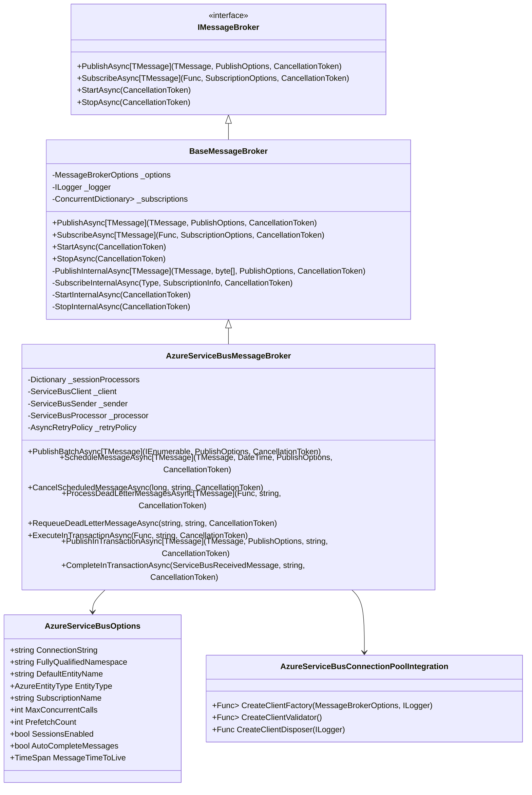
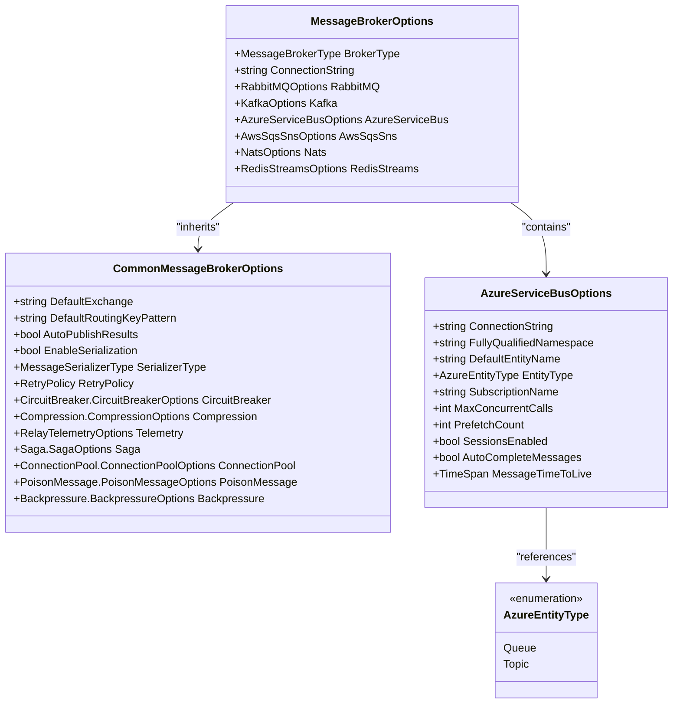
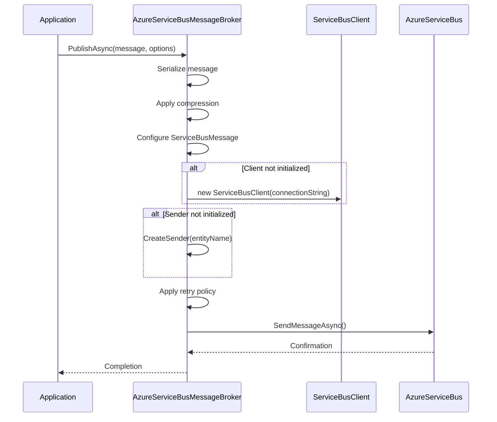
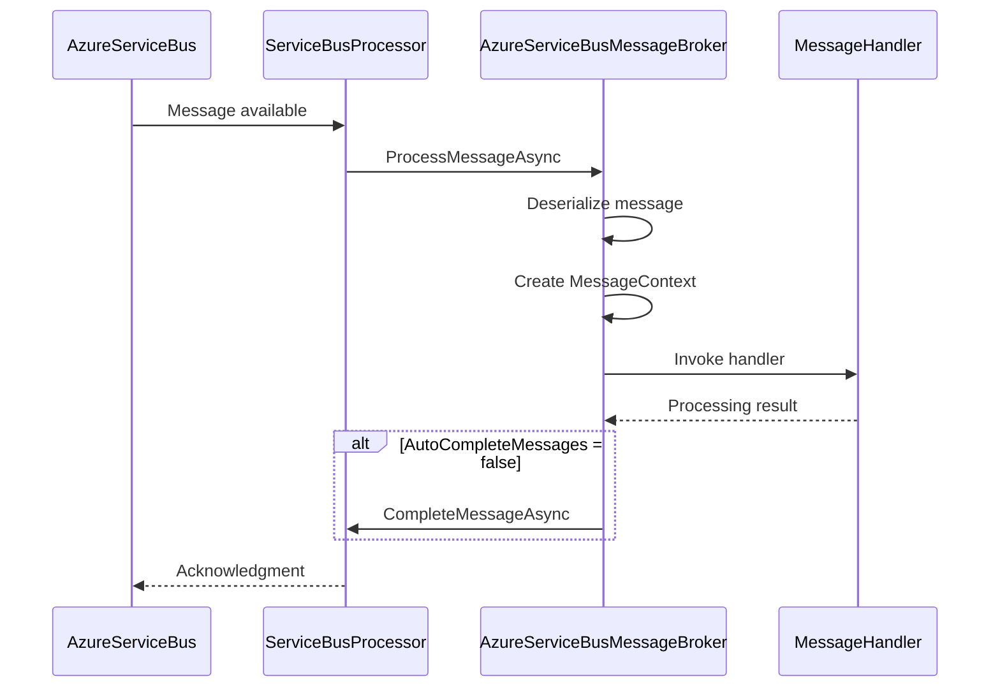
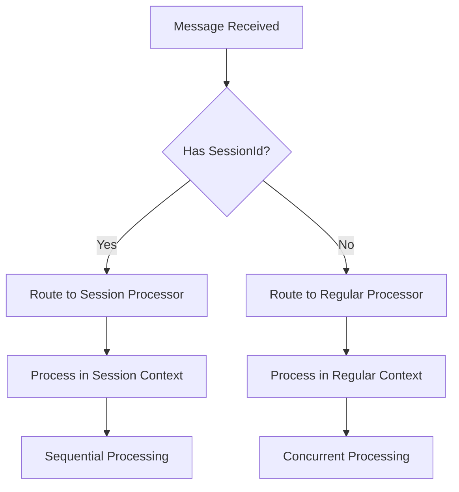
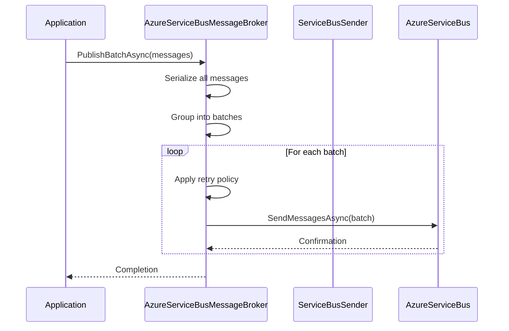
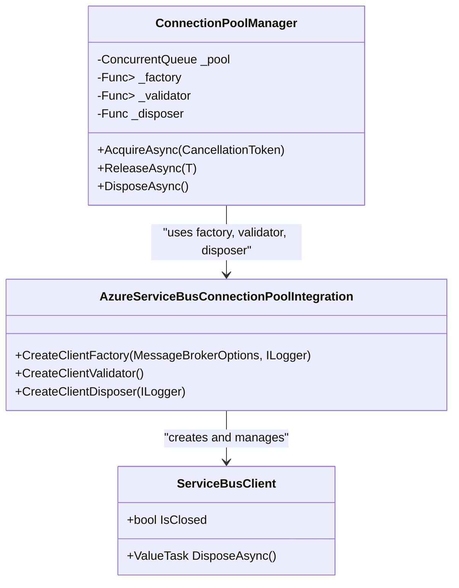
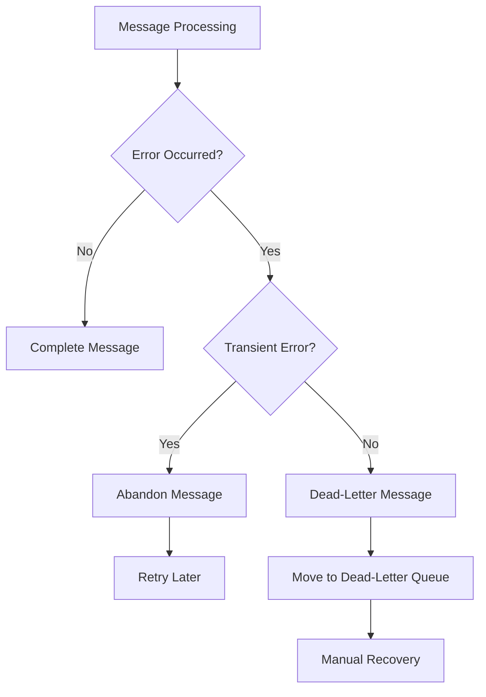
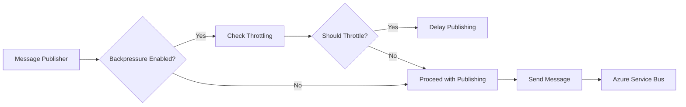

# Azure Service Bus Integration

<cite>
**Referenced Files in This Document**   
- [AzureServiceBusMessageBroker.cs](file://src/Relay.MessageBroker/AzureServiceBus/AzureServiceBusMessageBroker.cs)
- [AzureServiceBusOptions.cs](file://src/Relay.MessageBroker/AzureServiceBus/AzureServiceBusOptions.cs)
- [AzureServiceBusConnectionPoolIntegration.cs](file://src/Relay.MessageBroker/AzureServiceBus/AzureServiceBusConnectionPoolIntegration.cs)
- [BaseMessageBroker.cs](file://src/Relay.MessageBroker/Core/BaseMessageBroker.cs)
- [MessageBrokerOptions.cs](file://src/Relay.MessageBroker/Configuration/MessageBrokerOptions.cs)
- [CommonMessageBrokerOptions.cs](file://src/Relay.MessageBroker/Common/CommonMessageBrokerOptions.cs)
</cite>

## Table of Contents
1. [Introduction](#introduction)
2. [Core Architecture](#core-architecture)
3. [Configuration Options](#configuration-options)
4. [Message Publishing](#message-publishing)
5. [Message Consumption](#message-consumption)
6. [Message Sessions](#message-sessions)
7. [Batch Operations and Transaction Support](#batch-operations-and-transaction-support)
8. [Connection Pooling Integration](#connection-pooling-integration)
9. [Error Handling and Dead-Letter Processing](#error-handling-and-dead-letter-processing)
10. [Performance and Throttling](#performance-and-throttling)
11. [Common Issues and Best Practices](#common-issues-and-best-practices)

## Introduction

The Azure Service Bus integration in the Relay framework provides a robust message broker implementation that leverages Microsoft Azure's enterprise-grade messaging service. This integration enables reliable message queuing and pub/sub messaging patterns with advanced features like message sessions, batching, and connection pooling. The implementation is designed to be both beginner-friendly and technically comprehensive, offering a seamless experience for developers working with distributed systems.

Azure Service Bus serves as a critical component in modern cloud architectures, providing durable messaging with guaranteed delivery, transactional operations, and sophisticated routing capabilities. The Relay framework's integration abstracts the complexity of the Azure SDK while exposing essential configuration options and operational patterns that allow developers to effectively utilize Service Bus features in their applications.

This document provides a detailed examination of the AzureServiceBusMessageBroker implementation, covering configuration, message handling, session management, and performance optimization strategies. It also addresses common operational challenges and provides best practices for reliable message processing in production environments.

**Section sources**
- [AzureServiceBusMessageBroker.cs](file://src/Relay.MessageBroker/AzureServiceBus/AzureServiceBusMessageBroker.cs#L1-L874)
- [AzureServiceBusOptions.cs](file://src/Relay.MessageBroker/AzureServiceBus/AzureServiceBusOptions.cs#L1-L66)

## Core Architecture

The Azure Service Bus integration follows a layered architecture that extends the base message broker functionality while implementing Azure-specific features. The core component is the AzureServiceBusMessageBroker class, which inherits from BaseMessageBroker and implements the IMessageBroker interface. This design allows for consistent message handling patterns across different broker implementations while providing Azure-specific capabilities.

The architecture consists of three primary components: the message broker implementation, configuration options, and connection pooling integration. The AzureServiceBusMessageBroker handles all message operations including publishing, subscription, and processing, while leveraging the Azure.Messaging.ServiceBus SDK for low-level communication with the Service Bus service. The broker maintains separate processors for regular messages and session-based messages, allowing for concurrent processing of both message types.

**Diagram sources**
- [AzureServiceBusMessageBroker.cs](file://src/Relay.MessageBroker/AzureServiceBus/AzureServiceBusMessageBroker.cs#L18-L874)
- [AzureServiceBusOptions.cs](file://src/Relay.MessageBroker/AzureServiceBus/AzureServiceBusOptions.cs#L6-L57)
- [AzureServiceBusConnectionPoolIntegration.cs](file://src/Relay.MessageBroker/AzureServiceBus/AzureServiceBusConnectionPoolIntegration.cs#L10-L72)
- [BaseMessageBroker.cs](file://src/Relay.MessageBroker/Core/BaseMessageBroker.cs#L19-L507)

**Section sources**
- [AzureServiceBusMessageBroker.cs](file://src/Relay.MessageBroker/AzureServiceBus/AzureServiceBusMessageBroker.cs#L18-L874)
- [AzureServiceBusOptions.cs](file://src/Relay.MessageBroker/AzureServiceBus/AzureServiceBusOptions.cs#L6-L57)
- [AzureServiceBusConnectionPoolIntegration.cs](file://src/Relay.MessageBroker/AzureServiceBus/AzureServiceBusConnectionPoolIntegration.cs#L10-L72)

## Configuration Options

The Azure Service Bus integration provides comprehensive configuration options through the AzureServiceBusOptions class, which is part of the broader MessageBrokerOptions configuration structure. These options allow fine-tuning of the broker's behavior to match specific application requirements and deployment scenarios.

The configuration is structured hierarchically, with AzureServiceBusOptions nested within the main MessageBrokerOptions. This design enables a consistent configuration approach across different message broker implementations while allowing broker-specific settings. The configuration options are validated during broker initialization, ensuring that required settings like the connection string are present before attempting to establish connections.

**Diagram sources**
- [MessageBrokerOptions.cs](file://src/Relay.MessageBroker/Configuration/MessageBrokerOptions.cs#L6-L50)
- [CommonMessageBrokerOptions.cs](file://src/Relay.MessageBroker/Common/CommonMessageBrokerOptions.cs#L6-L72)
- [AzureServiceBusOptions.cs](file://src/Relay.MessageBroker/AzureServiceBus/AzureServiceBusOptions.cs#L6-L57)

The primary configuration options include:

- **ConnectionString**: The connection string for authenticating with Azure Service Bus, which contains the necessary credentials and endpoint information.
- **FullyQualifiedNamespace**: The fully qualified namespace of the Service Bus (e.g., myservicebus.servicebus.windows.net), which can be used instead of a connection string.
- **DefaultEntityName**: The default queue or topic name to use when no specific routing key is provided during message publishing.
- **EntityType**: Specifies whether to use a Queue or Topic entity type, determining the messaging pattern (point-to-point vs. publish-subscribe).
- **SubscriptionName**: For topics, specifies the subscription name that the broker will listen to for messages.
- **MaxConcurrentCalls**: Controls the maximum number of concurrent message processing operations, helping to manage resource utilization.
- **PrefetchCount**: Determines how many messages are prefetched from the service to reduce latency and improve throughput.
- **SessionsEnabled**: Enables or disables message session support, which ensures ordered processing of related messages.
- **AutoCompleteMessages**: When enabled, automatically completes messages after successful processing; when disabled, requires explicit acknowledgment.
- **MessageTimeToLive**: Sets the default time-to-live for messages, after which they will expire if not processed.

These options can be configured programmatically or through configuration files, allowing for environment-specific settings in development, staging, and production environments.

**Section sources**
- [AzureServiceBusOptions.cs](file://src/Relay.MessageBroker/AzureServiceBus/AzureServiceBusOptions.cs#L6-L57)
- [MessageBrokerOptions.cs](file://src/Relay.MessageBroker/Configuration/MessageBrokerOptions.cs#L31-L32)
- [CommonMessageBrokerOptions.cs](file://src/Relay.MessageBroker/Common/CommonMessageBrokerOptions.cs#L36-L37)

## Message Publishing

The Azure Service Bus integration provides multiple methods for publishing messages, each designed for specific use cases and performance requirements. The primary publishing mechanism is implemented through the PublishInternalAsync method, which handles the serialization, configuration, and transmission of messages to the Service Bus.

When publishing a message, the broker first ensures that the ServiceBusClient and ServiceBusSender instances are initialized. If they don't exist, new instances are created using the connection string from the configuration. The entity name (queue or topic) is determined by checking the routing key in the publish options, falling back to the default entity name from configuration, and finally using the message type name as a last resort.

**Diagram sources**
- [AzureServiceBusMessageBroker.cs](file://src/Relay.MessageBroker/AzureServiceBus/AzureServiceBusMessageBroker.cs#L61-L118)

The message publishing process includes several important features:

- **Retry Policy**: The broker implements a configurable retry policy that automatically retries transient failures, such as network connectivity issues or service throttling. The retry policy uses exponential backoff with jitter to prevent thundering herd problems.
- **Message Properties**: Various message properties are set, including MessageId, ContentType, and Subject (which stores the message type's FullName for proper deserialization).
- **Headers**: Custom headers from the publish options are added to the message's ApplicationProperties, allowing for metadata to be passed along with the message.
- **Time-to-Live**: If specified in the publish options, the message's TimeToLive is set, after which the message will expire if not processed.
- **Session Support**: If a SessionId header is present, it is assigned to the message's SessionId property, enabling ordered processing within a message session.
- **Scheduled Enqueue**: Messages can be scheduled for future delivery by setting the ScheduledEnqueueTime property through a header.

In addition to individual message publishing, the integration provides specialized methods for batch operations and scheduled messages:

- **PublishBatchAsync**: Sends multiple messages in batches to improve performance and reduce the number of service calls. Messages are grouped into batches of up to 100 (the Service Bus limit) and sent sequentially.
- **ScheduleMessageAsync**: Sends a message that will be enqueued at a specific future time, useful for delayed processing or reminders.
- **CancelScheduledMessageAsync**: Cancels a previously scheduled message using its sequence number.

These publishing methods are designed to handle various messaging patterns while maintaining reliability and performance.

**Section sources**
- [AzureServiceBusMessageBroker.cs](file://src/Relay.MessageBroker/AzureServiceBus/AzureServiceBusMessageBroker.cs#L61-L286)

## Message Consumption

Message consumption in the Azure Service Bus integration is handled through the StartInternalAsync method, which initializes the message processing infrastructure when the broker starts. The consumption model follows the event-driven architecture, where messages are automatically received and processed as they arrive in the queue or topic subscription.

The broker creates a ServiceBusProcessor instance that listens to the specified entity (queue or topic subscription) and invokes the message processing callback for each received message. The processor is configured with options from the AzureServiceBusOptions, including MaxConcurrentCalls, PrefetchCount, and ReceiveMode (determined by the AutoCompleteMessages setting).

**Diagram sources**
- [AzureServiceBusMessageBroker.cs](file://src/Relay.MessageBroker/AzureServiceBus/AzureServiceBusMessageBroker.cs#L576-L633)

The message consumption process includes several key components:

- **Message Deserialization**: Incoming messages are deserialized using the message's Subject property to determine the target type, ensuring proper type safety.
- **Message Context**: A MessageContext object is created for each message, providing access to message metadata (MessageId, CorrelationId, Timestamp) and acknowledgment methods (Acknowledge, Reject).
- **Error Handling**: Any exceptions during message processing are caught and logged, with appropriate actions taken based on the error type and configuration.
- **Acknowledgment**: Depending on the AutoCompleteMessages setting, messages are either automatically completed or require explicit acknowledgment through the MessageContext.

The broker also handles subscription registration through the SubscribeInternalAsync method, which stores subscription information for later use during message processing. When a message arrives, the broker looks up the appropriate handler based on the message type and invokes it with the deserialized message and context.

For error scenarios, the broker provides comprehensive error handling through the ProcessErrorAsync callback, which logs errors from the Service Bus processor and can be extended for custom error handling logic.

**Section sources**
- [AzureServiceBusMessageBroker.cs](file://src/Relay.MessageBroker/AzureServiceBus/AzureServiceBusMessageBroker.cs#L567-L746)

## Message Sessions

Message sessions in Azure Service Bus provide a mechanism for ensuring ordered processing of related messages. The Relay framework's integration supports message sessions through the SessionsEnabled configuration option and dedicated session processing infrastructure.

When message sessions are enabled, the broker creates a ServiceBusSessionProcessor in addition to the regular ServiceBusProcessor. The session processor handles messages that belong to specific sessions, ensuring that messages within the same session are processed sequentially by a single consumer. This is particularly useful for scenarios where message ordering is critical, such as processing events for a specific user or transaction.

**Diagram sources**
- [AzureServiceBusMessageBroker.cs](file://src/Relay.MessageBroker/AzureServiceBus/AzureServiceBusMessageBroker.cs#L604-L630)

The session processing workflow includes:

- **Session Initialization**: When a new session is detected, the SessionInitializingAsync callback is invoked, allowing for session-specific setup.
- **Session Processing**: Messages within the same session are processed sequentially by the same processor instance, maintaining order.
- **Session Closing**: When a session becomes idle, the SessionClosingAsync callback is invoked, allowing for cleanup operations.

The session processor is configured with specific options to optimize session handling:

- **MaxConcurrentCallsPerSession**: Set to 1 to ensure sequential processing within each session.
- **MaxConcurrentSessions**: Controls the maximum number of concurrent sessions that can be processed, based on the MaxConcurrentCalls setting.
- **SessionIdleTimeout**: Specifies how long a session can remain idle before being closed (default is 1 minute).

Message sessions are identified by the SessionId property, which can be set in the publish options headers. When publishing a message with a SessionId, all messages with the same session ID will be processed in order by the same consumer.

This session support enables various advanced messaging patterns, such as:

- **Ordering Guarantees**: Ensuring that messages for a specific entity (e.g., user, order) are processed in the order they were sent.
- **Stateful Processing**: Maintaining state across multiple messages within the same session.
- **Atomic Operations**: Grouping related messages that should be processed as a unit.

**Section sources**
- [AzureServiceBusMessageBroker.cs](file://src/Relay.MessageBroker/AzureServiceBus/AzureServiceBusMessageBroker.cs#L604-L630)
- [AzureServiceBusOptions.cs](file://src/Relay.MessageBroker/AzureServiceBus/AzureServiceBusOptions.cs#L46-L47)

## Batch Operations and Transaction Support

The Azure Service Bus integration provides support for batch operations and transactional message processing, enabling efficient handling of multiple messages and ensuring data consistency across operations. While Azure Service Bus doesn't support distributed transactions in the traditional sense, it provides batch operations that can be used to achieve transaction-like behavior.

The integration offers several methods for batch operations:

- **PublishBatchAsync**: Sends multiple messages in a single operation, improving performance by reducing the number of service calls. Messages are grouped into batches of up to 100 (the Service Bus limit) and sent sequentially with retry logic applied to each batch.
- **SendMessagesAsync**: Used internally by PublishBatchAsync to send a batch of messages atomically within the Service Bus service.

**Diagram sources**
- [AzureServiceBusMessageBroker.cs](file://src/Relay.MessageBroker/AzureServiceBus/AzureServiceBusMessageBroker.cs#L123-L193)

For transactional scenarios, the integration provides methods that simulate transactional behavior using Service Bus batch operations:

- **ExecuteInTransactionAsync**: Executes a provided operation within a logical transaction scope, with error handling and logging.
- **PublishInTransactionAsync**: Publishes a message as part of a transaction, ensuring that the operation is properly logged and monitored.
- **CompleteInTransactionAsync**: Completes a received message as part of a transaction, typically used in conjunction with other operations.

These transactional methods don't provide ACID transactions across multiple services but ensure that operations are properly tracked and that errors are handled consistently. They integrate with the framework's telemetry system to provide visibility into transaction success and failure rates.

The batch and transaction support is particularly useful for:

- **High-Volume Scenarios**: Processing large numbers of messages efficiently by reducing the overhead of individual service calls.
- **Data Consistency**: Ensuring that related operations are processed together, reducing the risk of partial updates.
- **Performance Optimization**: Minimizing network round-trips and service calls, improving overall throughput.

**Section sources**
- [AzureServiceBusMessageBroker.cs](file://src/Relay.MessageBroker/AzureServiceBus/AzureServiceBusMessageBroker.cs#L123-L193)
- [AzureServiceBusMessageBroker.cs](file://src/Relay.MessageBroker/AzureServiceBus/AzureServiceBusMessageBroker.cs#L451-L565)

## Connection Pooling Integration

The Azure Service Bus integration includes connection pooling capabilities through the AzureServiceBusConnectionPoolIntegration class, which provides factory methods for creating, validating, and disposing Service Bus clients in a pooled environment. Connection pooling is a critical performance optimization that reduces the overhead of establishing and tearing down connections, particularly in high-throughput scenarios.

The connection pooling integration consists of three primary components:

- **Client Factory**: Creates new ServiceBusClient instances using the connection string from configuration.
- **Client Validator**: Validates that a client is still usable (not disposed or closed) before returning it from the pool.
- **Client Disposer**: Properly disposes of clients when they are returned to the pool or when the pool is being cleaned up.

**Diagram sources**
- [AzureServiceBusConnectionPoolIntegration.cs](file://src/Relay.MessageBroker/AzureServiceBus/AzureServiceBusConnectionPoolIntegration.cs#L10-L72)

The connection pooling workflow follows these steps:

1. **Acquisition**: When a client is needed, the pool attempts to return an existing, valid client from its internal queue.
2. **Validation**: Before returning a client, the validator function checks that the client is still usable (not disposed or closed).
3. **Creation**: If no valid clients are available in the pool, the factory function creates a new ServiceBusClient instance.
4. **Usage**: The client is used for message operations (sending, receiving, etc.).
5. **Release**: After use, the client is returned to the pool for future reuse.
6. **Disposal**: When clients are disposed (either through explicit disposal or pool cleanup), the disposer function ensures proper cleanup.

Connection pooling provides several benefits:

- **Reduced Latency**: Eliminates the connection establishment overhead for subsequent operations.
- **Resource Efficiency**: Reuses existing connections rather than creating new ones for each operation.
- **Scalability**: Supports higher throughput by reducing the number of concurrent connection establishments.
- **Resilience**: Handles connection failures gracefully by providing alternative clients from the pool.

The connection pooling integration is designed to work seamlessly with the rest of the message broker, allowing developers to benefit from performance optimizations without changing their code.

**Section sources**
- [AzureServiceBusConnectionPoolIntegration.cs](file://src/Relay.MessageBroker/AzureServiceBus/AzureServiceBusConnectionPoolIntegration.cs#L10-L72)

## Error Handling and Dead-Letter Processing

The Azure Service Bus integration provides comprehensive error handling and dead-letter processing capabilities to ensure reliable message delivery and processing. The error handling strategy is designed to handle both transient and permanent failures, with appropriate recovery mechanisms and logging.

The integration implements several layers of error handling:

- **Retry Policy**: Transient failures (such as network connectivity issues or service throttling) are automatically retried using an exponential backoff strategy.
- **Message Processing Errors**: Errors during message processing are caught and logged, with appropriate actions taken based on the error type.
- **Dead-Letter Queue**: Messages that cannot be processed after multiple attempts are moved to the dead-letter queue for later analysis and recovery.

**Diagram sources**
- [AzureServiceBusMessageBroker.cs](file://src/Relay.MessageBroker/AzureServiceBus/AzureServiceBusMessageBroker.cs#L728-L737)

The integration provides specific methods for handling dead-lettered messages:

- **ProcessDeadLetterMessagesAsync**: Allows applications to process messages from the dead-letter queue, enabling recovery of messages that failed processing.
- **RequeueDeadLetterMessageAsync**: Moves a dead-lettered message back to the original queue for reprocessing, useful for messages that failed due to temporary issues.

These methods provide a complete solution for handling message processing failures, allowing developers to implement robust error recovery strategies. The dead-letter processing capabilities are particularly valuable for:

- **Error Analysis**: Examining failed messages to understand the root cause of processing issues.
- **Data Recovery**: Recovering messages that failed due to temporary system issues.
- **Compliance**: Ensuring that no messages are lost, even in the face of processing failures.

The error handling is integrated with the framework's logging and telemetry systems, providing visibility into error rates, retry attempts, and dead-letter queue activity.

**Section sources**
- [AzureServiceBusMessageBroker.cs](file://src/Relay.MessageBroker/AzureServiceBus/AzureServiceBusMessageBroker.cs#L287-L450)

## Performance and Throttling

The Azure Service Bus integration includes several performance optimization features and throttling mechanisms to ensure efficient resource utilization and prevent system overload. These features are designed to balance throughput, latency, and resource consumption in various deployment scenarios.

Key performance features include:

- **Prefetching**: The PrefetchCount setting determines how many messages are prefetched from the service, reducing latency by having messages ready for processing when the consumer is ready.
- **Concurrent Processing**: The MaxConcurrentCalls setting controls the number of concurrent message processing operations, allowing for optimal utilization of available resources.
- **Compression**: Message compression can be enabled to reduce network bandwidth usage and storage requirements.
- **Connection Pooling**: Reusing Service Bus clients reduces the overhead of connection establishment and teardown.

**Diagram sources**
- [BaseMessageBroker.cs](file://src/Relay.MessageBroker/Core/BaseMessageBroker.cs#L82-L91)

The integration also supports backpressure management through the ShouldThrottleAsync method, which checks whether the system should apply throttling based on current load and configuration. This feature helps prevent system overload by temporarily delaying message publishing when the system is under heavy load.

Performance considerations for the Azure Service Bus integration include:

- **Batching**: Using PublishBatchAsync for high-volume scenarios to reduce the number of service calls.
- **Session Management**: Carefully managing session idle timeout to balance resource utilization and message ordering requirements.
- **Prefetch Configuration**: Tuning the PrefetchCount based on message processing speed and memory constraints.
- **Concurrency Settings**: Adjusting MaxConcurrentCalls to match the processing capacity of the consumer.

These performance features work together to provide a scalable and efficient messaging solution that can handle varying workloads while maintaining reliability and responsiveness.

**Section sources**
- [AzureServiceBusOptions.cs](file://src/Relay.MessageBroker/AzureServiceBus/AzureServiceBusOptions.cs#L36-L42)
- [BaseMessageBroker.cs](file://src/Relay.MessageBroker/Core/BaseMessageBroker.cs#L82-L91)

## Common Issues and Best Practices

When working with the Azure Service Bus integration in the Relay framework, several common issues may arise. Understanding these issues and following best practices can help ensure reliable and efficient message processing in production environments.

### Common Issues

**Message Lock Expiration**: One of the most common issues is message lock expiration, which occurs when a message takes longer to process than the lock duration. This can result in the message being delivered to another consumer, potentially causing duplicate processing.

**Entity Creation**: The integration does not automatically create queues or topics. If the specified entity does not exist, message operations will fail with appropriate exceptions.

**Throttling**: Azure Service Bus may throttle requests if the service limits are exceeded. This is typically handled by the retry policy, but excessive throttling can impact performance.

**Serialization Issues**: Messages must be properly serializable, and the message type must be resolvable by the consumer for proper deserialization.

### Best Practices

**Configure Appropriate Timeouts**: Set the MaxConcurrentCalls and processing timeouts based on the expected message processing time to avoid lock expiration.

**Use Dead-Letter Processing**: Implement dead-letter processing to handle messages that cannot be processed, allowing for analysis and recovery.

**Monitor Queue Metrics**: Regularly monitor queue length, processing rates, and error rates to identify potential issues before they impact system performance.

**Implement Idempotent Handlers**: Design message handlers to be idempotent, so that duplicate message processing does not cause data inconsistencies.

**Use Connection Pooling**: Enable connection pooling to improve performance and reduce resource consumption in high-throughput scenarios.

**Configure Retry Policies**: Customize the retry policy based on the specific requirements of your application, balancing between resilience and responsiveness.

**Handle Session State Carefully**: When using message sessions, be mindful of session state and ensure that session cleanup is handled properly to avoid resource leaks.

By following these best practices and understanding the common issues, developers can build robust and reliable messaging solutions using the Azure Service Bus integration in the Relay framework.

**Section sources**
- [AzureServiceBusMessageBroker.cs](file://src/Relay.MessageBroker/AzureServiceBus/AzureServiceBusMessageBroker.cs#L43-L58)
- [AzureServiceBusOptions.cs](file://src/Relay.MessageBroker/AzureServiceBus/AzureServiceBusOptions.cs#L36-L42)
- [AzureServiceBusConnectionPoolIntegration.cs](file://src/Relay.MessageBroker/AzureServiceBus/AzureServiceBusConnectionPoolIntegration.cs#L34-L37)