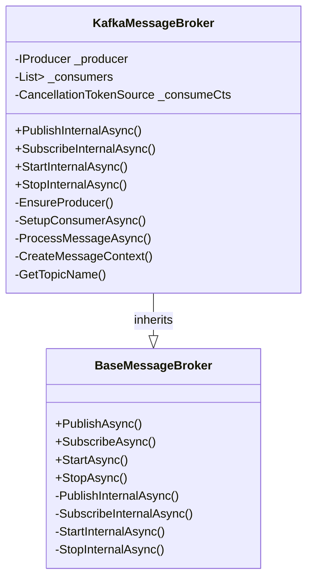
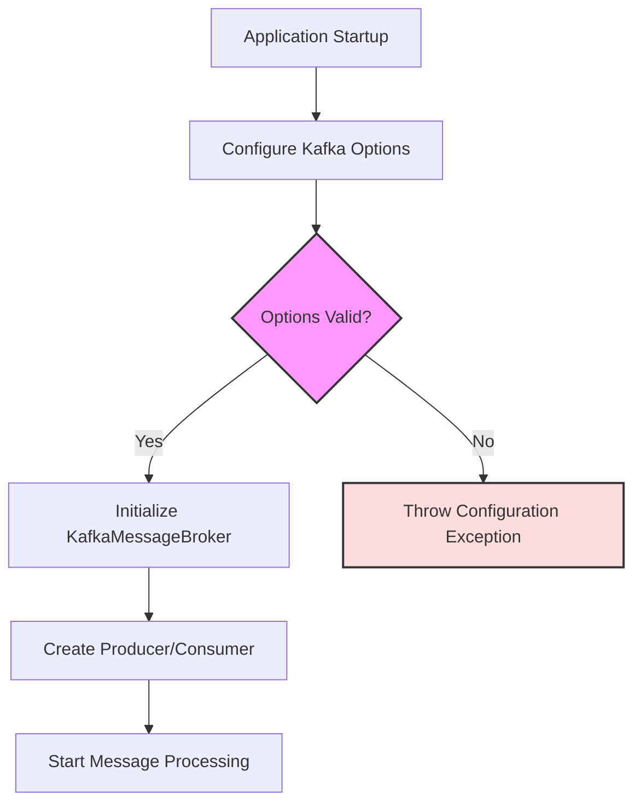
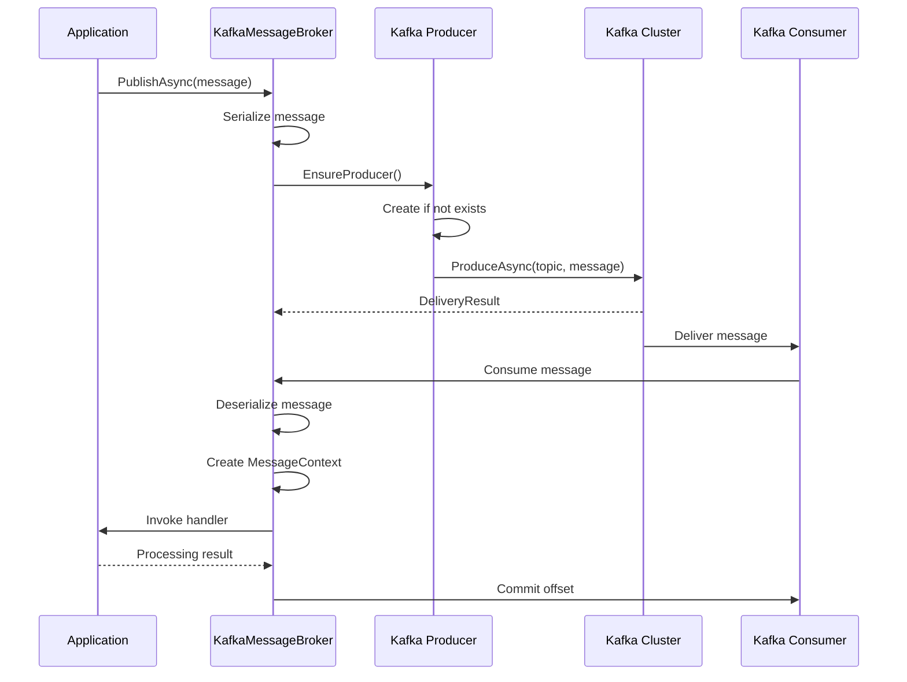
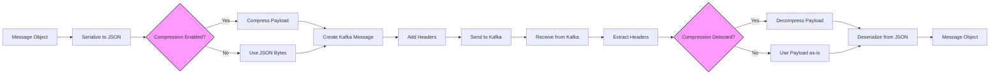
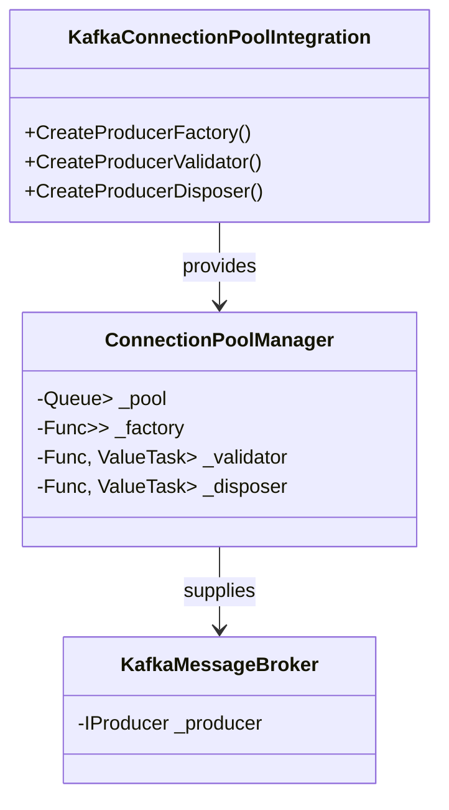
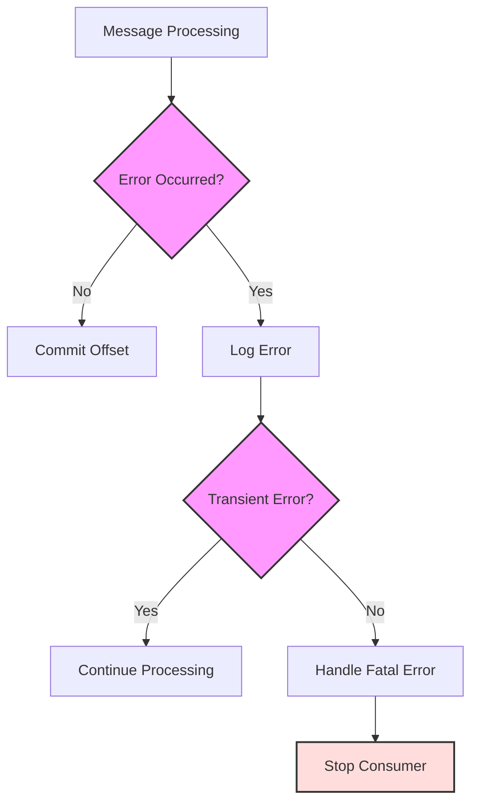

# Kafka Integration

<cite>
**Referenced Files in This Document**   
- [KafkaMessageBroker.cs](file://src/Relay.MessageBroker/Kafka/KafkaMessageBroker.cs)
- [KafkaOptions.cs](file://src/Relay.MessageBroker/Kafka/KafkaOptions.cs)
- [KafkaConnectionPoolIntegration.cs](file://src/Relay.MessageBroker/Kafka/KafkaConnectionPoolIntegration.cs)
- [README.md](file://src/Relay.MessageBroker/README.md)
- [BaseMessageBroker.cs](file://src/Relay.MessageBroker/Core/BaseMessageBroker.cs)
- [ServiceCollectionExtensions.cs](file://src/Relay.MessageBroker/Hosting/ServiceCollectionExtensions.cs)
</cite>

## Table of Contents
1. [Introduction](#introduction)
2. [KafkaMessageBroker Implementation](#kafkamessagebroker-implementation)
3. [Configuration Options](#configuration-options)
4. [Producer and Consumer Configuration](#producer-and-consumer-configuration)
5. [Topic Management and Message Serialization](#topic-management-and-message-serialization)
6. [Connection Pooling Integration](#connection-pooling-integration)
7. [Error Handling and Common Issues](#error-handling-and-common-issues)
8. [Best Practices](#best-practices)
9. [Conclusion](#conclusion)

## Introduction

The Relay framework provides comprehensive Kafka integration through the `KafkaMessageBroker` class, enabling seamless event streaming and high-throughput messaging capabilities. This implementation leverages the Confluent.Kafka library to provide robust message broker functionality with enterprise-grade features. The integration supports key Kafka concepts including topics, partitions, consumer groups, and message offsets, while abstracting away much of the complexity through a clean, intuitive API.

The Kafka integration follows the same interface patterns as other message brokers in the Relay ecosystem, ensuring consistency across different messaging technologies. It supports both publishing and subscribing to messages with configurable options for routing, headers, and message processing. The implementation handles message serialization using JSON by default, with support for compression and custom message formats.

This document provides a detailed examination of the Kafka integration, covering implementation details, configuration options, and best practices for using Kafka with the Relay framework.

**Section sources**
- [README.md](file://src/Relay.MessageBroker/README.md#L1-L707)

## KafkaMessageBroker Implementation

The `KafkaMessageBroker` class serves as the primary implementation for Kafka integration within the Relay framework. As a sealed class inheriting from `BaseMessageBroker`, it provides the concrete implementation of Kafka-specific messaging functionality while leveraging shared infrastructure from the base class.

The implementation follows a producer-consumer pattern with separate handling for message publishing and subscription. For publishing, the broker maintains a single producer instance that is lazily initialized when first needed. For consumption, it manages a collection of consumer instances, one for each subscription, allowing for parallel message processing across different topics.

Key aspects of the implementation include:

- **Producer Management**: The broker ensures a single producer instance is created and reused for all publishing operations, optimizing resource utilization.
- **Consumer Lifecycle**: Each subscription creates its own consumer instance, which runs in a background task to continuously poll for messages.
- **Message Processing**: Received messages are deserialized and passed to registered handlers with appropriate context information.
- **Error Handling**: Comprehensive error handling is implemented to manage network issues, deserialization failures, and processing exceptions.

The broker integrates with the Relay framework's telemetry and validation systems, providing built-in monitoring and message validation capabilities. It also supports backpressure control to prevent consumer overload in high-throughing scenarios.

**Diagram sources **
- [KafkaMessageBroker.cs](file://src/Relay.MessageBroker/Kafka/KafkaMessageBroker.cs#L1-L323)
- [BaseMessageBroker.cs](file://src/Relay.MessageBroker/Core/BaseMessageBroker.cs#L1-L507)

**Section sources**
- [KafkaMessageBroker.cs](file://src/Relay.MessageBroker/Kafka/KafkaMessageBroker.cs#L1-L323)

## Configuration Options

The Kafka integration provides extensive configuration options through the `KafkaOptions` class, allowing fine-tuned control over broker behavior. These options can be configured through dependency injection or directly in code, providing flexibility for different deployment scenarios.

The primary configuration options include:

- **BootstrapServers**: Specifies the Kafka broker addresses for connection. This is a required field with a default value of "localhost:9092" for development scenarios.
- **ConsumerGroupId**: Defines the consumer group ID for coordinating message consumption across multiple instances.
- **AutoOffsetReset**: Controls the behavior when there is no initial offset or when the current offset is out of range. Valid values are "earliest" and "latest".
- **EnableAutoCommit**: Determines whether offsets are automatically committed by the consumer.
- **SessionTimeout**: Sets the timeout for consumer session maintenance with the broker.
- **CompressionType**: Specifies the compression algorithm for message payloads (none, gzip, snappy, lz4, zstd).
- **DefaultPartitions**: Defines the number of partitions for automatically created topics.
- **ReplicationFactor**: Sets the replication factor for automatically created topics.

These options are validated during broker initialization, with appropriate exceptions thrown for invalid configurations. For example, null or empty values for BootstrapServers or ConsumerGroupId will result in ArgumentException being thrown.

Configuration can be applied through the service collection extensions, allowing for fluent configuration in the application startup process. The options also support connection string overrides, enabling centralized configuration management.

**Diagram sources **
- [KafkaOptions.cs](file://src/Relay.MessageBroker/Kafka/KafkaOptions.cs#L1-L47)
- [KafkaMessageBroker.cs](file://src/Relay.MessageBroker/Kafka/KafkaMessageBroker.cs#L32-L48)

**Section sources**
- [KafkaOptions.cs](file://src/Relay.MessageBroker/Kafka/KafkaOptions.cs#L1-L47)

## Producer and Consumer Configuration

The Kafka integration in Relay framework implements separate configuration patterns for producers and consumers, aligning with Kafka's architectural principles. The producer configuration focuses on message delivery guarantees and performance optimization, while consumer configuration emphasizes message processing reliability and coordination.

### Producer Configuration

The producer is configured with the following key settings:
- **BootstrapServers**: The Kafka broker addresses for connection
- **CompressionType**: The compression algorithm for message payloads
- **EnableIdempotence**: Ensures exactly-once message delivery semantics
- **MaxInFlight**: Limits the number of unacknowledged requests in flight
- **Acks**: Requires acknowledgment from all in-sync replicas before considering a write successful

The producer is implemented as a singleton within the broker instance, created lazily when first needed. This approach optimizes resource usage and ensures consistent message ordering for a given key. The producer automatically handles serialization of messages to JSON format and includes metadata in message headers such as message type, message ID, and timestamp.

### Consumer Configuration

Each consumer is configured with the following key settings:
- **BootstrapServers**: The Kafka broker addresses for connection
- **GroupId**: The consumer group ID for coordination
- **AutoOffsetReset**: The policy for handling missing offsets
- **EnableAutoCommit**: Whether to automatically commit offsets
- **SessionTimeoutMs**: The timeout for consumer session maintenance

Consumers are created per subscription and run in background tasks to continuously poll for messages. The implementation handles consumer group coordination, partition assignment, and rebalancing events automatically. When a consumer receives a message, it processes the message through registered handlers and manages offset commits based on the acknowledgment settings.

The consumer implementation includes robust error handling for network issues, deserialization failures, and processing exceptions. In case of errors, the consumer continues processing other messages while logging the failure, preventing a single problematic message from blocking the entire consumer.

**Diagram sources **
- [KafkaMessageBroker.cs](file://src/Relay.MessageBroker/Kafka/KafkaMessageBroker.cs#L51-L97)
- [KafkaMessageBroker.cs](file://src/Relay.MessageBroker/Kafka/KafkaMessageBroker.cs#L164-L225)

**Section sources**
- [KafkaMessageBroker.cs](file://src/Relay.MessageBroker/Kafka/KafkaMessageBroker.cs#L51-L225)

## Topic Management and Message Serialization

The Kafka integration in the Relay framework provides automated topic management and standardized message serialization to simplify development and ensure consistency across services.

### Topic Management

Topic names are generated automatically based on message types using a configurable pattern. By default, the pattern is "relay.{MessageType}" where {MessageType} is replaced with the message class name in lowercase. This can be customized using the DefaultRoutingKeyPattern option in the main message broker options.

The implementation does not automatically create topics in Kafka, relying instead on external topic management practices. However, it provides the DefaultPartitions and ReplicationFactor options in KafkaOptions to specify the desired configuration when topics are created. This approach aligns with production best practices where topic creation is managed separately from application code.

When publishing a message, the topic name is determined by checking the RoutingKey in the PublishOptions first, falling back to the generated topic name based on the message type. This allows for both automatic topic naming and explicit topic selection as needed.

### Message Serialization

Messages are serialized using System.Text.Json with UTF-8 encoding. The serialization process includes the following steps:
1. The message object is serialized to JSON bytes
2. If compression is enabled, the JSON bytes are compressed
3. Message metadata is added to Kafka headers including:
   - MessageType: The full type name of the message
   - MessageId: A unique identifier for the message
   - Timestamp: The message creation time
   - Custom headers from PublishOptions

The deserialization process reverses these steps, extracting the message type from headers to determine the target type for deserialization. This approach enables polymorphic message handling and versioning capabilities.

The implementation supports custom serialization through dependency injection, allowing replacement of the default JSON serializer with alternative formats like Avro or Protobuf when needed. Compression can be enabled globally or per message, with support for gzip, snappy, lz4, and zstd algorithms.

**Diagram sources **
- [KafkaMessageBroker.cs](file://src/Relay.MessageBroker/Kafka/KafkaMessageBroker.cs#L57-L87)
- [KafkaMessageBroker.cs](file://src/Relay.MessageBroker/Kafka/KafkaMessageBroker.cs#L234-L235)

**Section sources**
- [KafkaMessageBroker.cs](file://src/Relay.MessageBroker/Kafka/KafkaMessageBroker.cs#L57-L87)
- [KafkaMessageBroker.cs](file://src/Relay.MessageBroker/Kafka/KafkaMessageBroker.cs#L234-L235)
- [KafkaMessageBroker.cs](file://src/Relay.MessageBroker/Kafka/KafkaMessageBroker.cs#L309-L315)

## Connection Pooling Integration

The Kafka integration includes support for connection pooling through the `KafkaConnectionPoolIntegration` class, which provides factory methods for creating, validating, and disposing Kafka producers. This enables efficient resource management in high-concurrency scenarios and improves application performance.

The connection pooling integration provides three key functions:

- **CreateProducerFactory**: Returns a function that creates new Kafka producer instances with the configured settings. This factory function is used by the connection pool to create new connections as needed.
- **CreateProducerValidator**: Returns a function that validates the health of producer connections. For Kafka producers, validation is straightforward since the Confluent.Kafka library handles connection health internally.
- **CreateProducerDisposer**: Returns a function that properly disposes of producer instances, ensuring that any pending messages are flushed before disposal.

The implementation takes into account the thread-safe nature of Kafka producers, which can be shared across threads but should not have multiple operations in flight simultaneously on the same instance. The connection pool helps manage this by providing isolated producer instances to different consumers.

Connection pooling is particularly beneficial in scenarios with bursty traffic patterns, where the number of concurrent producers can be dynamically adjusted based on load. It also helps with graceful shutdown by ensuring all producers are properly disposed of, with pending messages flushed to the broker.

The integration works seamlessly with the existing KafkaMessageBroker implementation, requiring no changes to the core messaging logic. It can be enabled or configured independently, allowing teams to adopt connection pooling based on their specific performance requirements.

**Diagram sources **
- [KafkaConnectionPoolIntegration.cs](file://src/Relay.MessageBroker/Kafka/KafkaConnectionPoolIntegration.cs#L1-L79)

**Section sources**
- [KafkaConnectionPoolIntegration.cs](file://src/Relay.MessageBroker/Kafka/KafkaConnectionPoolIntegration.cs#L1-L79)

## Error Handling and Common Issues

The Kafka integration in the Relay framework includes comprehensive error handling mechanisms to address common issues encountered in production environments. These mechanisms ensure reliable message processing and provide clear guidance for troubleshooting.

### Broker Unavailability

When Kafka brokers are unavailable, the implementation relies on the underlying Confluent.Kafka library's retry mechanisms. The producer automatically handles transient network issues and broker failures, with configurable retry policies. For consumer scenarios, the implementation includes appropriate error logging and continues attempting to connect, ensuring that message processing resumes automatically when brokers become available.

### Message Ordering

Kafka guarantees message ordering within a partition, but not across partitions or topics. The Relay framework preserves this guarantee by ensuring that messages with the same key are routed to the same partition. However, applications should be designed to handle out-of-order delivery in scenarios where multiple consumers or partitions are involved.

### Consumer Lag

Consumer lag occurs when message processing cannot keep up with message production. The implementation includes backpressure controls to mitigate this issue by slowing down message consumption when processing capacity is exceeded. Monitoring consumer lag through Kafka's built-in metrics is recommended to identify and address performance bottlenecks.

### Offset Management

The integration provides flexible offset management through the EnableAutoCommit option. When disabled, offsets are committed only when messages are successfully processed and acknowledged. This ensures at-least-once delivery semantics and prevents message loss during consumer failures.

Common issues and their solutions include:

- **Serialization Errors**: Ensure message contracts are stable and use explicit versioning when evolving message schemas
- **Consumer Rebalancing**: Design consumers to handle rebalancing events gracefully, avoiding long-running operations in message handlers
- **Large Messages**: Use compression for large payloads and consider message size limits in Kafka configuration
- **Network Partitions**: Implement appropriate timeout settings and monitor for split-brain scenarios in distributed deployments

The framework's logging and telemetry capabilities provide valuable insights for diagnosing and resolving these issues in production environments.

**Diagram sources **
- [KafkaMessageBroker.cs](file://src/Relay.MessageBroker/Kafka/KafkaMessageBroker.cs#L203-L216)
- [KafkaMessageBroker.cs](file://src/Relay.MessageBroker/Kafka/KafkaMessageBroker.cs#L246-L256)

**Section sources**
- [KafkaMessageBroker.cs](file://src/Relay.MessageBroker/Kafka/KafkaMessageBroker.cs#L203-L256)

## Best Practices

To maximize the effectiveness of Kafka integration in the Relay framework, consider the following best practices:

### Configuration Best Practices
- Set appropriate consumer group IDs for each service to enable proper message distribution
- Configure AutoOffsetReset based on your application's requirements (earliest for replay scenarios, latest for real-time processing)
- Use meaningful topic naming conventions that reflect your domain model
- Set appropriate session timeouts based on your network conditions and processing patterns

### Performance Optimization
- Enable compression for large messages to reduce network bandwidth usage
- Configure appropriate prefetch counts based on your message processing speed
- Use connection pooling in high-concurrency scenarios to optimize resource utilization
- Consider batching messages when publishing high volumes of events

### Reliability and Resilience
- Implement idempotent message handlers to handle duplicate messages
- Use manual acknowledgment mode for critical operations requiring exactly-once processing
- Monitor consumer lag to identify performance bottlenecks
- Implement proper error handling and dead letter queue patterns for failed messages

### Development and Testing
- Use the InMemoryMessageBroker for unit testing to avoid dependencies on Kafka infrastructure
- Implement comprehensive integration tests with a test Kafka cluster
- Use correlation IDs to trace messages across distributed systems
- Validate message contracts to ensure compatibility between producers and consumers

Following these best practices will help ensure reliable, performant, and maintainable Kafka integration in your Relay-based applications.

**Section sources**
- [README.md](file://src/Relay.MessageBroker/README.md#L520-L612)

## Conclusion

The Kafka integration in the Relay framework provides a robust, feature-rich solution for event-driven architectures and high-throughput messaging scenarios. By leveraging the Confluent.Kafka library and extending it with framework-specific capabilities, the implementation offers a balance of power and simplicity.

Key strengths of the integration include:
- Comprehensive configuration options for tuning broker behavior
- Seamless integration with the Relay ecosystem's telemetry and validation systems
- Support for connection pooling to optimize resource utilization
- Robust error handling and resilience features
- Clear separation of concerns between producer and consumer responsibilities

The implementation follows Kafka best practices while abstracting away much of the complexity, making it accessible to developers of all experience levels. Whether building simple event notification systems or complex event streaming architectures, the Kafka integration provides the tools needed for success.

By following the configuration guidelines and best practices outlined in this document, teams can effectively leverage Kafka's capabilities within the Relay framework to build scalable, reliable, and maintainable distributed systems.