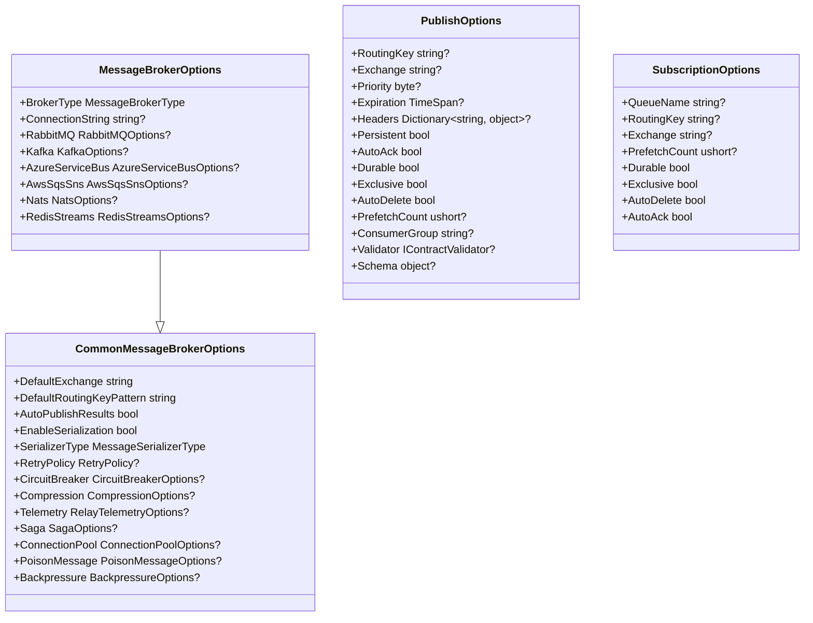

# Message Brokers

<cite>
**Referenced Files in This Document**   
- [README.md](file://docs/MessageBroker/README.md)
- [QUICKSTART.md](file://docs/MessageBroker/QUICKSTART.md)
- [INDEX.md](file://docs/MessageBroker/INDEX.md)
- [RabbitMQMessageBroker.cs](file://src/Relay.MessageBroker/RabbitMQ/RabbitMQMessageBroker.cs)
- [KafkaMessageBroker.cs](file://src/Relay.MessageBroker/Kafka/KafkaMessageBroker.cs)
- [AzureServiceBusMessageBroker.cs](file://src/Relay.MessageBroker/AzureServiceBus/AzureServiceBusMessageBroker.cs)
- [AwsSqsSnsMessageBroker.cs](file://src/Relay.MessageBroker/AwsSqsSns/AwsSqsSnsMessageBroker.cs)
- [NatsMessageBroker.cs](file://src/Relay.MessageBroker/Nats/NatsMessageBroker.cs)
- [RedisStreamsMessageBroker.cs](file://src/Relay.MessageBroker/RedisStreams/RedisStreamsMessageBroker.cs)
- [MessageBrokerOptions.cs](file://src/Relay.MessageBroker/Configuration/MessageBrokerOptions.cs)
- [CommonMessageBrokerOptions.cs](file://src/Relay.MessageBroker/Common/CommonMessageBrokerOptions.cs)
- [BaseMessageBroker.cs](file://src/Relay.MessageBroker/Core/BaseMessageBroker.cs)
- [IMessageBroker.cs](file://src/Relay.MessageBroker/Core/IMessageBroker.cs)
</cite>

## Table of Contents
1. [Architecture Overview](#architecture-overview)
2. [Common Interface and Configuration](#common-interface-and-configuration)
3. [RabbitMQ Integration](#rabbitmq-integration)
4. [Kafka Integration](#kafka-integration)
5. [Azure Service Bus Integration](#azure-service-bus-integration)
6. [AWS SQS/SNS Integration](#aws-sqssns-integration)
7. [NATS Integration](#nats-integration)
8. [Redis Streams Integration](#redis-streams-integration)
9. [Message Routing and Patterns](#message-routing-and-patterns)
10. [Error Handling and Retry Mechanisms](#error-handling-and-retry-mechanisms)
11. [Performance Considerations and Best Practices](#performance-considerations-and-best-practices)
12. [Troubleshooting Guide](#troubleshooting-guide)

## Architecture Overview

The Relay framework provides a unified message broker abstraction that enables seamless integration with multiple message brokers through a common interface. This architecture is designed to provide consistent messaging capabilities across different broker technologies while preserving the unique features of each broker.

The core architectural pattern is based on the Strategy and Adapter patterns, where each message broker implementation (RabbitMQ, Kafka, Azure Service Bus, AWS SQS/SNS, NATS, and Redis Streams) implements a common interface (`IMessageBroker`) while providing broker-specific functionality. The `BaseMessageBroker` class serves as the foundation for all broker implementations, providing shared functionality such as message serialization, compression, validation, and telemetry.

The architecture supports both publish-subscribe and point-to-point messaging patterns, with each broker implementation handling the specific routing mechanisms of its underlying technology. The framework abstracts away the differences between brokers while allowing access to advanced features through broker-specific methods when needed.

```mermaid
classDiagram
class IMessageBroker {
<<interface>>
+PublishAsync[TMessage](message, options, cancellationToken)
+SubscribeAsync[TMessage](handler, options, cancellationToken)
+StartAsync(cancellationToken)
+StopAsync(cancellationToken)
}
class BaseMessageBroker {
+_options MessageBrokerOptions
+_logger ILogger
+_subscriptions ConcurrentDictionary~Type, SubscriptionInfo[]~
+_compressor IMessageCompressor?
+_telemetry MessageBrokerTelemetryAdapter
+_validation MessageBrokerValidationAdapter?
+_poisonMessageHandler IPoisonMessageHandler?
+_backpressureController IBackpressureController?
+PublishAsync[TMessage](message, options, cancellationToken)
+SubscribeAsync[TMessage](handler, options, cancellationToken)
+StartAsync(cancellationToken)
+StopAsync(cancellationToken)
+SerializeMessage[TMessage](message)
+DeserializeMessage[TMessage](data)
+CompressMessageAsync(data, cancellationToken)
+DecompressMessageAsync(data, cancellationToken)
+ProcessMessageAsync(message, messageType, context, cancellationToken)
+EnsureStartedAsync(cancellationToken)
}
class RabbitMQMessageBroker {
+_connection IConnection?
+_publishChannel IChannel?
+_consumerChannels IChannel[]
+PublishInternalAsync[TMessage](message, serializedMessage, options, cancellationToken)
+SubscribeInternalAsync(messageType, subscriptionInfo, cancellationToken)
+StartInternalAsync(cancellationToken)
+StopInternalAsync(cancellationToken)
+DisposeInternalAsync()
}
class KafkaMessageBroker {
+_producer IProducer~string, byte[]~?
+_consumers IConsumer[]string, byte[]~~
+_consumeCts CancellationTokenSource
+PublishInternalAsync[TMessage](message, serializedMessage, options, cancellationToken)
+SubscribeInternalAsync(messageType, subscriptionInfo, cancellationToken)
+StartInternalAsync(cancellationToken)
+StopInternalAsync(cancellationToken)
+DisposeInternalAsync()
}
class AzureServiceBusMessageBroker {
+_client ServiceBusClient?
+_sender ServiceBusSender?
+_processor ServiceBusProcessor?
+_sessionProcessors Dictionary~string, ServiceBusSessionProcessor?~
+PublishInternalAsync[TMessage](message, serializedMessage, options, cancellationToken)
+SubscribeInternalAsync(messageType, subscriptionInfo, cancellationToken)
+StartInternalAsync(cancellationToken)
+StopInternalAsync(cancellationToken)
+DisposeInternalAsync()
}
class AwsSqsSnsMessageBroker {
+_sqsClient AmazonSQSClient?
+_snsClient AmazonSimpleNotificationServiceClient?
+_pollingCts CancellationTokenSource?
+_pollingTask Task?
+PublishInternalAsync[TMessage](message, serializedMessage, options, cancellationToken)
+SubscribeInternalAsync(messageType, subscriptionInfo, cancellationToken)
+StartInternalAsync(cancellationToken)
+StopInternalAsync(cancellationToken)
+DisposeInternalAsync()
}
class NatsMessageBroker {
+_connection NatsConnection?
+_natsSubscriptions CancellationTokenSource[]
+PublishInternalAsync[TMessage](message, serializedMessage, options, cancellationToken)
+SubscribeInternalAsync(messageType, subscriptionInfo, cancellationToken)
+StartInternalAsync(cancellationToken)
+StopInternalAsync(cancellationToken)
+DisposeInternalAsync()
}
class RedisStreamsMessageBroker {
+_redis IConnectionMultiplexer?
+_database IDatabase?
+_consumerTasks Dictionary~string, CancellationTokenSource~
+_pollingCts CancellationTokenSource?
+_pendingEntriesTask Task?
+PublishInternalAsync[TMessage](message, serializedMessage, options, cancellationToken)
+SubscribeInternalAsync(messageType, subscriptionInfo, cancellationToken)
+StartInternalAsync(cancellationToken)
+StopInternalAsync(cancellationToken)
+DisposeInternalAsync()
}
IMessageBroker <|-- BaseMessageBroker
BaseMessageBroker <|-- RabbitMQMessageBroker
BaseMessageBroker <|-- KafkaMessageBroker
BaseMessageBroker <|-- AzureServiceBusMessageBroker
BaseMessageBroker <|-- AwsSqsSnsMessageBroker
BaseMessageBroker <|-- NatsMessageBroker
BaseMessageBroker <|-- RedisStreamsMessageBroker
```



**Diagram sources**
- [IMessageBroker.cs](file://src/Relay.MessageBroker/Core/IMessageBroker.cs)
- [BaseMessageBroker.cs](file://src/Relay.MessageBroker/Core/BaseMessageBroker.cs)
- [RabbitMQMessageBroker.cs](file://src/Relay.MessageBroker/RabbitMQ/RabbitMQMessageBroker.cs)
- [KafkaMessageBroker.cs](file://src/Relay.MessageBroker/Kafka/KafkaMessageBroker.cs)
- [AzureServiceBusMessageBroker.cs](file://src/Relay.MessageBroker/AzureServiceBus/AzureServiceBusMessageBroker.cs)
- [AwsSqsSnsMessageBroker.cs](file://src/Relay.MessageBroker/AwsSqsSns/AwsSqsSnsMessageBroker.cs)
- [NatsMessageBroker.cs](file://src/Relay.MessageBroker/Nats/NatsMessageBroker.cs)
- [RedisStreamsMessageBroker.cs](file://src/Relay.MessageBroker/RedisStreams/RedisStreamsMessageBroker.cs)

**Section sources**
- [IMessageBroker.cs](file://src/Relay.MessageBroker/Core/IMessageBroker.cs)
- [BaseMessageBroker.cs](file://src/Relay.MessageBroker/Core/BaseMessageBroker.cs)

## Common Interface and Configuration

The Relay message broker framework provides a unified interface and configuration system that allows applications to work with different message brokers through a consistent API. The core interface `IMessageBroker` defines the fundamental operations for publishing and subscribing to messages, ensuring that applications can be broker-agnostic.

The configuration system is centered around the `MessageBrokerOptions` class, which inherits from `CommonMessageBrokerOptions` and includes broker-specific options for each supported message broker. This hierarchical configuration approach allows for both global settings that apply to all brokers and specific settings tailored to individual brokers.

The common configuration options include:
- **DefaultExchange**: The default exchange name for brokers that support exchanges (e.g., RabbitMQ)
- **DefaultRoutingKeyPattern**: A pattern for generating routing keys, supporting placeholders like `{MessageType}` and `{MessageFullName}`
- **AutoPublishResults**: Whether to automatically publish handler results
- **EnableSerialization**: Whether message serialization is enabled
- **SerializerType**: The type of serializer to use (currently JSON)
- **RetryPolicy**: Configuration for retry mechanisms
- **CircuitBreaker**: Options for circuit breaker pattern
- **Compression**: Configuration for message compression
- **Telemetry**: Options for observability and monitoring
- **Saga**: Configuration for distributed transaction patterns
- **ConnectionPool**: Settings for connection pooling
- **PoisonMessage**: Options for handling failed messages
- **Backpressure**: Configuration for backpressure management

The framework uses a fluent configuration API that allows developers to configure the message broker in a readable and intuitive way. The configuration can be done through dependency injection in ASP.NET Core applications using extension methods like `AddRabbitMQ`, `AddKafka`, `AddAzureServiceBus`, etc.



**Diagram sources**
- [MessageBrokerOptions.cs](file://src/Relay.MessageBroker/Configuration/MessageBrokerOptions.cs)
- [CommonMessageBrokerOptions.cs](file://src/Relay.MessageBroker/Common/CommonMessageBrokerOptions.cs)
- [Configuration/MessageBrokerOptions.cs](file://src/Relay.MessageBroker/Configuration/MessageBrokerOptions.cs)

**Section sources**
- [MessageBrokerOptions.cs](file://src/Relay.MessageBroker/Configuration/MessageBrokerOptions.cs)
- [CommonMessageBrokerOptions.cs](file://src/Relay.MessageBroker/Common/CommonMessageBrokerOptions.cs)

## RabbitMQ Integration

The Relay framework provides comprehensive integration with RabbitMQ, supporting its full feature set including exchanges, queues, bindings, and advanced routing patterns. The `RabbitMQMessageBroker` implementation leverages the RabbitMQ.Client library to provide reliable messaging capabilities.

### Configuration Options

The RabbitMQ integration supports the following configuration options through the `RabbitMQOptions` class:
- **HostName**: The hostname of the RabbitMQ server
- **Port**: The port number (default: 5672)
- **UserName**: The username for authentication
- **Password**: The password for authentication
- **VirtualHost**: The virtual host to connect to
- **UseSsl**: Whether to use SSL/TLS encryption
- **PrefetchCount**: The number of messages to prefetch (default: 10)
- **ExchangeType**: The type of exchange to use (direct, topic, fanout, headers)
- **ConnectionTimeout**: The connection timeout duration

### Implementation Details

The `RabbitMQMessageBroker` class implements the `IMessageBroker` interface and provides RabbitMQ-specific functionality. It manages connections and channels efficiently, using a single publishing channel and multiple consumer channels to ensure thread safety and optimal performance.

When publishing a message, the broker:
1. Ensures a connection is established
2. Creates a `BasicProperties` object with message metadata (message ID, timestamp, content type, etc.)
3. Sets message properties based on the provided `PublishOptions`
4. Publishes the message to the specified exchange with the routing key

When subscribing to messages, the broker:
1. Creates a dedicated channel for the consumer
2. Declares the queue if it doesn't exist
3. Binds the queue to the exchange with the specified routing key
4. Sets up a consumer with the provided message handler
5. Starts consuming messages with the specified prefetch count

The implementation supports both manual and automatic acknowledgment modes, allowing for flexible error handling and message processing strategies.

### Practical Example

```csharp
var builder = WebApplication.CreateBuilder(args);

// Add RabbitMQ message broker
builder.Services.AddRabbitMQ(options =>
{
    options.HostName = "localhost";
    options.Port = 5672;
    options.UserName = "guest";
    options.Password = "guest";
    options.VirtualHost = "/";
    options.PrefetchCount = 10;
    options.ExchangeType = "topic";
});

// Add hosted service for automatic start/stop
builder.Services.AddMessageBrokerHostedService();

var app = builder.Build();
app.Run();
```

**Section sources**
- [RabbitMQMessageBroker.cs](file://src/Relay.MessageBroker/RabbitMQ/RabbitMQMessageBroker.cs)

## Kafka Integration

The Relay framework provides robust integration with Apache Kafka, leveraging the Confluent.Kafka library to deliver high-performance event streaming capabilities. The `KafkaMessageBroker` implementation supports Kafka's core concepts including topics, partitions, consumer groups, and offset management.

### Configuration Options

The Kafka integration supports the following configuration options through the `KafkaOptions` class:
- **BootstrapServers**: The list of Kafka bootstrap servers
- **ConsumerGroupId**: The consumer group ID for coordinated consumption
- **AutoOffsetReset**: The behavior when there is no initial offset (earliest, latest, none)
- **EnableAutoCommit**: Whether to automatically commit offsets
- **SessionTimeout**: The timeout for consumer session management
- **CompressionType**: The compression algorithm to use (none, gzip, snappy, lz4, zstd)
- **DefaultPartitions**: The default number of partitions for topic creation
- **ReplicationFactor**: The replication factor for topic creation

### Implementation Details

The `KafkaMessageBroker` class implements the `IMessageBroker` interface and provides Kafka-specific functionality. It manages a single producer instance for efficient message publishing and multiple consumer instances for parallel message processing.

When publishing a message, the broker:
1. Ensures the producer is created and connected
2. Maps the message type to a topic name using the routing key pattern
3. Creates a `Message` object with headers containing message metadata
4. Publishes the message to the specified topic with optional key-based partitioning

When subscribing to messages, the broker:
1. Creates a consumer with the specified consumer group
2. Subscribes to the topic corresponding to the message type
3. Starts a background task to continuously consume messages
4. Processes each message through the registered handlers
5. Commits offsets based on the acknowledgment mode

The implementation supports both at-least-once and at-most-once delivery semantics through configurable acknowledgment modes. It also provides support for message key-based partitioning to ensure message ordering within logical groups.

### Practical Example

```csharp
var builder = WebApplication.CreateBuilder(args);

// Add Kafka message broker
builder.Services.AddKafka(options =>
{
    options.BootstrapServers = "localhost:9092";
    options.ConsumerGroupId = "my-consumer-group";
    options.AutoOffsetReset = "earliest";
    options.EnableAutoCommit = false;
    options.SessionTimeout = TimeSpan.FromSeconds(30);
    options.CompressionType = "gzip";
});

// Add hosted service for automatic start/stop
builder.Services.AddMessageBrokerHostedService();

var app = builder.Build();
app.Run();
```

**Section sources**
- [KafkaMessageBroker.cs](file://src/Relay.MessageBroker/Kafka/KafkaMessageBroker.cs)

## Azure Service Bus Integration

The Relay framework provides comprehensive integration with Azure Service Bus, leveraging the Azure.Messaging.ServiceBus library to deliver enterprise-grade messaging capabilities in cloud environments. The `AzureServiceBusMessageBroker` implementation supports both queues and topics, along with advanced features like sessions, dead-lettering, and scheduled messaging.

### Configuration Options

The Azure Service Bus integration supports the following configuration options through the `AzureServiceBusOptions` class:
- **ConnectionString**: The connection string for authentication
- **DefaultEntityName**: The default queue or topic name
- **EntityType**: The type of entity (Queue or Topic)
- **SubscriptionName**: The subscription name (required for topics)
- **MaxConcurrentCalls**: The maximum number of concurrent message processing operations
- **PrefetchCount**: The number of messages to prefetch
- **AutoCompleteMessages**: Whether to automatically complete messages
- **SessionsEnabled**: Whether to enable session support for ordered processing
- **MessageTimeToLive**: The time-to-live for messages
- **MaxDeliveryCount**: The maximum number of delivery attempts before dead-lettering

### Implementation Details

The `AzureServiceBusMessageBroker` class implements the `IMessageBroker` interface and provides Azure Service Bus-specific functionality. It supports both regular message processing and session-based processing through separate processor instances.

When publishing a message, the broker:
1. Ensures the ServiceBusClient and sender are created
2. Creates a `ServiceBusMessage` with metadata and application properties
3. Sets message properties based on the provided `PublishOptions`
4. Publishes the message to the specified entity (queue or topic)
5. Supports advanced features like scheduled enqueue time and message sessions

When subscribing to messages, the broker:
1. Creates a ServiceBusProcessor for regular messages or ServiceBusSessionProcessor for session messages
2. Configures the processor with the specified options
3. Registers message and error handlers
4. Starts processing messages with the specified concurrency

The implementation provides additional methods for advanced scenarios:
- **PublishBatchAsync**: Publishes multiple messages in a batch for improved performance
- **ScheduleMessageAsync**: Schedules a message for future delivery
- **CancelScheduledMessageAsync**: Cancels a previously scheduled message
- **ProcessDeadLetterMessagesAsync**: Processes messages from the dead-letter queue
- **RequeueDeadLetterMessageAsync**: Requeues a dead-lettered message back to the main queue
- **ExecuteInTransactionAsync**: Executes operations within a transaction context
- **PublishInTransactionAsync**: Publishes a message as part of a transaction

### Practical Example

```csharp
var builder = WebApplication.CreateBuilder(args);

// Add Azure Service Bus message broker
builder.Services.AddAzureServiceBus(options =>
{
    options.ConnectionString = "Endpoint=sb://myservicebus.servicebus.windows.net/;SharedAccessKeyName=...";
    options.DefaultEntityName = "relay-messages";
    options.MaxConcurrentCalls = 10;
    options.PrefetchCount = 10;
    options.AutoCompleteMessages = false;
    options.SessionsEnabled = true;
    options.EntityType = AzureEntityType.Topic;
    options.SubscriptionName = "my-subscription";
});

// Add hosted service for automatic start/stop
builder.Services.AddMessageBrokerHostedService();

var app = builder.Build();
app.Run();
```

**Section sources**
- [AzureServiceBusMessageBroker.cs](file://src/Relay.MessageBroker/AzureServiceBus/AzureServiceBusMessageBroker.cs)

## AWS SQS/SNS Integration

The Relay framework provides integration with AWS messaging services, supporting both Amazon SQS (Simple Queue Service) for point-to-point messaging and Amazon SNS (Simple Notification Service) for publish-subscribe patterns. The `AwsSqsSnsMessageBroker` implementation leverages the AWS SDK for .NET to provide reliable messaging in AWS environments.

### Configuration Options

The AWS SQS/SNS integration supports the following configuration options through the `AwsSqsSnsOptions` class:
- **Region**: The AWS region (e.g., us-east-1)
- **AccessKeyId**: The AWS access key ID (optional, can use IAM roles)
- **SecretAccessKey**: The AWS secret access key (optional, can use IAM roles)
- **DefaultQueueUrl**: The default SQS queue URL
- **DefaultTopicArn**: The default SNS topic ARN
- **MaxNumberOfMessages**: The maximum number of messages to retrieve in a single call
- **WaitTimeSeconds**: The long polling wait time
- **AutoDeleteMessages**: Whether to automatically delete messages after processing
- **UseFifoQueue**: Whether to use FIFO (First-In-First-Out) queues
- **MessageGroupId**: The message group ID for FIFO queues
- **MessageDeduplicationId**: The message deduplication ID for FIFO queues

### Implementation Details

The `AwsSqsSnsMessageBroker` class implements the `IMessageBroker` interface and provides AWS-specific functionality. It supports both SQS for direct messaging and SNS for pub/sub patterns, with automatic routing based on configuration.

When publishing a message, the broker:
1. Uses SNS if a topic ARN is configured, otherwise uses SQS
2. Creates a publish or send request with message metadata
3. Sets message attributes for message type and custom headers
4. Applies FIFO-specific settings if configured
5. Executes the operation with retry, circuit breaker, and timeout policies

When subscribing to messages, the broker:
1. Uses long polling to retrieve messages from the configured SQS queue
2. Processes each message through the registered handlers
3. Automatically deletes messages if auto-delete is enabled
4. Supports manual acknowledgment through the message context

The implementation includes robust error handling with Polly policies for:
- **Retry**: Automatic retry with exponential backoff
- **Circuit Breaker**: Prevents cascading failures during service outages
- **Timeout**: Prevents hanging operations

### Practical Example

```csharp
var builder = WebApplication.CreateBuilder(args);

// Add AWS SQS/SNS message broker
builder.Services.AddAwsSqsSns(options =>
{
    options.Region = "us-east-1";
    options.DefaultQueueUrl = "https://sqs.us-east-1.amazonaws.com/123456789/my-queue";
    options.DefaultTopicArn = "arn:aws:sns:us-east-1:123456789:my-topic";
    options.MaxNumberOfMessages = 10;
    options.WaitTimeSeconds = TimeSpan.FromSeconds(20);
});

// Add hosted service for automatic start/stop
builder.Services.AddMessageBrokerHostedService();

var app = builder.Build();
app.Run();
```

**Section sources**
- [AwsSqsSnsMessageBroker.cs](file://src/Relay.MessageBroker/AwsSqsSns/AwsSqsSnsMessageBroker.cs)

## NATS Integration

The Relay framework provides integration with NATS, a high-performance messaging system designed for microservices, IoT, and cloud-native applications. The `NatsMessageBroker` implementation leverages the NATS.Client.Core library to deliver lightweight and fast messaging capabilities.

### Configuration Options

The NATS integration supports the following configuration options through the `NatsOptions` class:
- **Servers**: The list of NATS server URLs
- **Name**: The client name
- **Username**: The username for authentication
- **Password**: The password for authentication
- **MaxReconnects**: The maximum number of reconnection attempts
- **UseJetStream**: Whether to use JetStream for persistent messaging
- **StreamName**: The JetStream stream name
- **ConsumerGroupName**: The consumer group name for JetStream

### Implementation Details

The `NatsMessageBroker` class implements the `IMessageBroker` interface and provides NATS-specific functionality. It supports both core NATS publish-subscribe patterns and JetStream for persistent messaging with consumer groups.

When publishing a message, the broker:
1. Ensures a connection is established
2. Maps the message type to a subject name
3. Creates headers with message metadata
4. Publishes the message to the subject with headers

When subscribing to messages, the broker:
1. Creates a subscription to the subject corresponding to the message type
2. Starts a background task to receive messages
3. Deserializes and processes each message through the registered handlers

The implementation supports NATS core features including:
- **Subjects**: Hierarchical naming for message routing
- **Wildcards**: Support for wildcard subscriptions (e.g., "orders.*")
- **Headers**: Metadata attached to messages
- **Request-Reply**: Built-in request-reply pattern (not directly exposed in the common interface)

For JetStream-enabled scenarios, the broker can be configured to use persistent streams and consumer groups, providing at-least-once delivery semantics and message replay capabilities.

### Practical Example

```csharp
var builder = WebApplication.CreateBuilder(args);

// Add NATS message broker
builder.Services.AddNats(options =>
{
    options.Servers = new[] { "nats://localhost:4222" };
    options.Name = "relay-nats-client";
    options.MaxReconnects = 10;
    options.UseJetStream = true;
    options.StreamName = "RELAY_EVENTS";
});

// Add hosted service for automatic start/stop
builder.Services.AddMessageBrokerHostedService();

var app = builder.Build();
app.Run();
```

**Section sources**
- [NatsMessageBroker.cs](file://src/Relay.MessageBroker/Nats/NatsMessageBroker.cs)

## Redis Streams Integration

The Relay framework provides integration with Redis Streams, a data structure introduced in Redis 5.0 that provides persistent, append-only logs for messaging and event sourcing. The `RedisStreamsMessageBroker` implementation leverages the StackExchange.Redis library to deliver fast and reliable messaging with consumer groups.

### Configuration Options

The Redis Streams integration supports the following configuration options through the `RedisStreamsOptions` class:
- **ConnectionString**: The Redis connection string
- **Database**: The Redis database number
- **DefaultStreamName**: The default stream name
- **ConsumerGroupName**: The consumer group name
- **ConsumerName**: The consumer name
- **CreateConsumerGroupIfNotExists**: Whether to create the consumer group if it doesn't exist
- **MaxMessagesToRead**: The maximum number of messages to read in a single operation
- **ReadTimeout**: The timeout between read operations when no messages are available
- **MaxStreamLength**: The maximum length of the stream (for automatic trimming)
- **AutoAcknowledge**: Whether to automatically acknowledge processed messages
- **ConnectTimeout**: The connection timeout duration
- **SyncTimeout**: The synchronous operation timeout duration

### Implementation Details

The `RedisStreamsMessageBroker` class implements the `IMessageBroker` interface and provides Redis Streams-specific functionality. It supports consumer groups for parallel message processing and message acknowledgment.

When publishing a message, the broker:
1. Ensures a connection to Redis is established
2. Creates a stream entry with fields for message type, data, timestamp, and metadata
3. Adds custom headers as prefixed fields
4. Publishes the message to the specified stream
5. Trims the stream if a maximum length is configured

When subscribing to messages, the broker:
1. Creates a consumer group if configured to do so
2. Starts a consumer task for the stream
3. Uses `XREADGROUP` to retrieve messages from the consumer group
4. Processes each message through the registered handlers
5. Acknowledges messages based on the acknowledgment mode

The implementation includes features for:
- **Consumer Groups**: Multiple consumers can process messages from the same stream
- **Message Acknowledgment**: Messages are tracked and can be acknowledged or left pending
- **Pending Messages**: Support for monitoring and processing pending messages
- **Stream Trimming**: Automatic trimming of streams to prevent unbounded growth
- **Message Expiration**: Support for time-to-live on messages

### Practical Example

```csharp
var builder = WebApplication.CreateBuilder(args);

// Add Redis Streams message broker
builder.Services.AddRedisStreams(options =>
{
    options.ConnectionString = "localhost:6379";
    options.DefaultStreamName = "relay:stream";
    options.ConsumerGroupName = "relay-consumer-group";
    options.ConsumerName = "relay-consumer";
    options.MaxMessagesToRead = 10;
    options.CreateConsumerGroupIfNotExists = true;
});

// Add hosted service for automatic start/stop
builder.Services.AddMessageBrokerHostedService();

var app = builder.Build();
app.Run();
```

**Section sources**
- [RedisStreamsMessageBroker.cs](file://src/Relay.MessageBroker/RedisStreams/RedisStreamsMessageBroker.cs)

## Message Routing and Patterns

The Relay message broker framework supports various message routing patterns and integration scenarios through its flexible configuration and extensibility model. The framework enables complex integration patterns by providing both simple defaults and advanced customization options.

### Routing Key Patterns

The framework uses routing key patterns to determine how messages are routed to queues or topics. The default pattern `{MessageType}` uses the message type name as the routing key, but this can be customized using placeholders:
- `{MessageType}`: The simple name of the message type
- `{MessageFullName}`: The full name of the message type including namespace

For example, a message of type `OrderCreatedEvent` would use the routing key `OrderCreatedEvent` with the default pattern, or could be configured to use `events.OrderCreatedEvent` with a custom pattern.

### Supported Integration Patterns

The framework supports several enterprise integration patterns:

#### Event-Driven Architecture
```csharp
// Service A publishes events
await _messageBroker.PublishAsync(new OrderCreatedEvent { ... });

// Service B subscribes and processes
await _messageBroker.SubscribeAsync<OrderCreatedEvent>(async (evt, ctx, ct) =>
{
    await _inventoryService.ReserveItemsAsync(evt.OrderId);
    await ctx.Acknowledge!();
});

// Service C also subscribes
await _messageBroker.SubscribeAsync<OrderCreatedEvent>(async (evt, ctx, ct) =>
{
    await _notificationService.SendOrderConfirmationAsync(evt.OrderId);
    await ctx.Acknowledge!();
});
```

#### Saga Pattern
```csharp
public class OrderSagaOrchestrator
{
    private readonly IMessageBroker _messageBroker;

    public async Task StartSagaAsync(CreateOrderCommand command)
    {
        var sagaId = Guid.NewGuid().ToString();

        // Step 1: Create order
        await _messageBroker.PublishAsync(
            new CreateOrderEvent { SagaId = sagaId, ... },
            new PublishOptions
            {
                Headers = new Dictionary<string, object> { { "SagaId", sagaId } }
            });
    }

    public async Task SubscribeToSagaEventsAsync()
    {
        await _messageBroker.SubscribeAsync<OrderCreatedEvent>(HandleOrderCreated);
        await _messageBroker.SubscribeAsync<PaymentProcessedEvent>(HandlePaymentProcessed);
        await _messageBroker.SubscribeAsync<InventoryReservedEvent>(HandleInventoryReserved);
        await _messageBroker.SubscribeAsync<SagaFailedEvent>(HandleSagaFailed);
    }
}
```

#### Inbox and Outbox Patterns
The framework supports inbox and outbox patterns for reliable messaging in distributed systems:
- **Outbox Pattern**: Ensures messages are sent reliably by storing them in a database transaction
- **Inbox Pattern**: Prevents duplicate message processing by tracking processed messages

These patterns are implemented as decorators that can be applied to the message broker.

#### Message Filtering
Consumers can filter messages using routing keys and binding patterns:
```csharp
// Subscribe to all order events
await _messageBroker.SubscribeAsync<OrderEvent>(
    handler,
    new SubscriptionOptions
    {
        RoutingKey = "orders.*"
    });

// Subscribe to critical priority messages
await _messageBroker.SubscribeAsync<Message>(
    handler,
    new SubscriptionOptions
    {
        QueueName = "critical-messages",
        RoutingKey = "*.critical"
    });
```

### Advanced Routing Features

The framework provides advanced routing features through broker-specific extensions:

#### Azure Service Bus Sessions
```csharp
await _messageBroker.PublishAsync(
    new OrderCreatedEvent { OrderId = 123, Amount = 99.99m },
    new PublishOptions
    {
        Headers = new Dictionary<string, object>
        {
            { "SessionId", $"order-{orderId}" } // Ensures ordering for this order
        }
    });
```

#### Kafka Partitioning
```csharp
await _messageBroker.PublishAsync(
    new OrderCreatedEvent { OrderId = 123, Amount = 99.99m },
    new PublishOptions
    {
        Headers = new Dictionary<string, object>
        {
            { "Key", $"order-{orderId}" } // Determines partition
        }
    });
```

#### AWS SQS FIFO
```csharp
builder.Services.AddAwsSqsSns(options =>
{
    options.UseFifoQueue = true;
    options.MessageGroupId = "orders"; // Messages in same group are ordered
    options.MessageDeduplicationId = "unique-id"; // Prevents duplicates
});
```

These routing capabilities enable complex integration scenarios while maintaining a consistent API across different message brokers.

**Section sources**
- [README.md](file://docs/MessageBroker/README.md)
- [RabbitMQMessageBroker.cs](file://src/Relay.MessageBroker/RabbitMQ/RabbitMQMessageBroker.cs)
- [KafkaMessageBroker.cs](file://src/Relay.MessageBroker/Kafka/KafkaMessageBroker.cs)
- [AzureServiceBusMessageBroker.cs](file://src/Relay.MessageBroker/AzureServiceBus/AzureServiceBusMessageBroker.cs)

## Error Handling and Retry Mechanisms

The Relay message broker framework provides comprehensive error handling and retry mechanisms to ensure reliable message processing in distributed systems. The framework implements multiple layers of resilience, from message-level retries to system-wide circuit breakers.

### Common Error Handling

All broker implementations follow a consistent error handling pattern:
1. **Message Processing**: Each message is processed in a try-catch block
2. **Error Logging**: Exceptions are logged with relevant context
3. **Acknowledgment Control**: The message context provides methods to acknowledge or reject messages
4. **Poison Message Handling**: Failed messages are moved to a dead-letter queue after a configurable number of attempts

```csharp
await _messageBroker.SubscribeAsync<OrderCreatedEvent>(
    async (message, context, ct) =>
    {
        try
        {
            await ProcessOrderAsync(message);
            await context.Acknowledge!();
        }
        catch (TransientException ex)
        {
            _logger.LogWarning(ex, "Transient error, requeuing message");
            await context.Reject!(requeue: true);
        }
        catch (Exception ex)
        {
            _logger.LogError(ex, "Fatal error, dead-lettering message");
            await context.Reject!(requeue: false);
        }
    });
```

### Retry Policies

The framework supports configurable retry policies through the `RetryPolicy` class:
- **MaxAttempts**: The maximum number of retry attempts
- **InitialDelay**: The delay before the first retry
- **MaxDelay**: The maximum delay between retries
- **BackoffMultiplier**: The multiplier for exponential backoff
- **UseExponentialBackoff**: Whether to use exponential backoff

```csharp
builder.Services.AddMessageBroker(options =>
{
    options.RetryPolicy = new RetryPolicy
    {
        MaxAttempts = 5,
        InitialDelay = TimeSpan.FromSeconds(2),
        MaxDelay = TimeSpan.FromMinutes(5),
        BackoffMultiplier = 2.0,
        UseExponentialBackoff = true
    };
});
```

Broker-specific implementations enhance the common retry mechanism:
- **Azure Service Bus**: Uses built-in retry policies with transient error detection
- **AWS SQS/SNS**: Uses Polly policies with circuit breakers and timeouts
- **Kafka**: Relies on consumer retry logic with offset management

### Circuit Breaker Pattern

The framework implements the circuit breaker pattern to prevent cascading failures during service outages. The `CircuitBreakerOptions` class configures:
- **Enabled**: Whether the circuit breaker is active
- **FailureThreshold**: The number of failures before opening the circuit
- **SuccessThreshold**: The number of successes needed to close the circuit
- **Timeout**: The duration the circuit stays open
- **FailureRateThreshold**: The failure rate threshold for opening the circuit
- **TrackSlowCalls**: Whether to consider slow calls as failures
- **SlowCallDurationThreshold**: The duration that defines a slow call

```csharp
builder.Services.AddRelayMessageBroker(options =>
{
    options.CircuitBreaker = new CircuitBreakerOptions
    {
        Enabled = true,
        FailureThreshold = 5,
        SuccessThreshold = 2,
        Timeout = TimeSpan.FromSeconds(60)
    };
});
```

### Poison Message Handling

The framework provides automatic poison message handling to prevent processing loops with malformed messages. The `PoisonMessageOptions` class configures:
- **Enabled**: Whether poison message handling is active
- **Threshold**: The number of processing attempts before considering a message poisonous
- **QueueName**: The name of the poison queue
- **AutoMove**: Whether to automatically move messages to the poison queue

When a message fails processing more than the threshold number of times, it is moved to the poison queue for later analysis and handling.

### Dead-Letter Queues

Several brokers support dead-letter queues for failed messages:
- **RabbitMQ**: Uses Dead Letter Exchanges (DLX) configured on queues
- **Azure Service Bus**: Built-in dead-lettering with automatic or manual dead-lettering
- **AWS SQS**: Dead-letter queues configured as separate queues

The framework provides methods to process dead-lettered messages:
```csharp
// Process dead-lettered messages (Azure Service Bus)
await ((AzureServiceBusMessageBroker)_messageBroker).ProcessDeadLetterMessagesAsync<OrderCreatedEvent>(
    async (message, context, ct) =>
    {
        _logger.LogWarning("Processing failed order: {OrderId}", message.OrderId);
        await HandleFailedOrderAsync(message);
        await context.Acknowledge();
    });
```

These comprehensive error handling and retry mechanisms ensure that the message broker can handle transient failures gracefully while providing visibility into persistent issues.

**Section sources**
- [README.md](file://docs/MessageBroker/README.md)
- [BaseMessageBroker.cs](file://src/Relay.MessageBroker/Core/BaseMessageBroker.cs)
- [AzureServiceBusMessageBroker.cs](file://src/Relay.MessageBroker/AzureServiceBus/AzureServiceBusMessageBroker.cs)

## Performance Considerations and Best Practices

The Relay message broker framework is designed for high performance and scalability. This section covers performance considerations and best practices for each message broker integration.

### General Performance Guidelines

1. **Connection Management**: Reuse connections and channels where possible
2. **Batch Processing**: Process messages in batches when the use case allows
3. **Prefetching**: Configure appropriate prefetch counts based on processing speed
4. **Asynchronous Processing**: Always use async/await for I/O operations
5. **Resource Cleanup**: Ensure proper disposal of resources to prevent leaks
6. **Monitoring**: Implement comprehensive monitoring to identify bottlenecks

### Broker-Specific Optimization

#### RabbitMQ
- **Prefetch Count**: Set based on average processing time (e.g., 10-100 messages)
- **Publisher Confirms**: Enable for reliable publishing
- **Consumer Acknowledgment**: Use manual acknowledgment for critical messages
- **Queue Design**: Use separate queues for different message types or priorities
- **Exchange Types**: Choose appropriate exchange types (topic for flexible routing, direct for point-to-point)

#### Kafka
- **Partitioning**: Design topics with appropriate partition counts for parallelism
- **Consumer Groups**: Use consumer groups for horizontal scaling
- **Offset Management**: Disable auto-commit for at-least-once delivery
- **Compression**: Use compression (snappy, gzip) for large messages
- **Batch Size**: Optimize batch sizes for network efficiency

#### Azure Service Bus
- **MaxConcurrentCalls**: Set based on processing capacity (e.g., CPU cores)
- **PrefetchCount**: Balance between memory usage and performance
- **Sessions**: Use sessions only when message ordering is required
- **Partitioning**: Enable partitioning for high availability and throughput
- **Duplicate Detection**: Enable for at-least-once delivery semantics

#### AWS SQS/SNS
- **Long Polling**: Use long polling (20 seconds) to reduce empty responses
- **Visibility Timeout**: Set appropriately based on processing time
- **Dead-Letter Queues**: Configure DLQs for failed messages
- **Batch Operations**: Use batch send/receive for improved throughput
- **FIFO Queues**: Use only when strict ordering is required

#### NATS
- **Connection Pooling**: Reuse connections across components
- **Queue Groups**: Use queue groups for load balancing
- **Wildcard Subscriptions**: Use judiciously as they can impact performance
- **JetStream**: Configure appropriate retention policies and storage backends

#### Redis Streams
- **Consumer Groups**: Use consumer groups for parallel processing
- **Pending Messages**: Monitor and process pending messages regularly
- **Stream Trimming**: Configure maximum stream length to prevent unbounded growth
- **Acknowledgment**: Acknowledge messages promptly to prevent reprocessing

### Message Compression

The framework supports message compression to reduce network bandwidth and storage requirements:
```csharp
builder.Services.AddRelayMessageBroker(options =>
{
    options.Compression = new CompressionOptions
    {
        Enabled = true,
        Algorithm = CompressionAlgorithm.Brotli,
        Level = 6,
        MinimumSizeBytes = 1024,
        NonCompressibleContentTypes = new List<string>
        {
            "image/jpeg",
            "image/png",
            "video/mp4",
            "application/zip"
        }
    };
});
```

Best practices for compression:
- Compress only messages above a certain size threshold (e.g., 1KB)
- Exclude already compressed content types
- Monitor compression ratios and CPU usage
- Use Brotli for best compression ratios, Gzip for compatibility

### Monitoring and Observability

Implement comprehensive monitoring using the framework's built-in telemetry:
```csharp
builder.Services.AddRelayMessageBroker(options =>
{
    options.Telemetry = new TelemetryOptions
    {
        Enabled = true,
        ServiceName = "OrderService",
        EnableTracing = true,
        EnableMetrics = true,
        Exporters = new TelemetryExportersOptions
        {
            EnableOtlp = true,
            OtlpEndpoint = "http://localhost:4317",
            EnablePrometheus = true,
            PrometheusEndpoint = "/metrics"
        }
    };
});
```

Key metrics to monitor:
- Message processing rate (messages/sec)
- Processing duration (p50, p95, p99)
- Error rate
- Queue depths
- Connection counts
- Memory usage

### Best Practices Summary

1. **Idempotent Handlers**: Design message handlers to be idempotent
2. **Error Handling**: Implement comprehensive error handling with appropriate retries
3. **Monitoring**: Implement end-to-end monitoring and alerting
4. **Testing**: Test failure scenarios and edge cases
5. **Scaling**: Design for horizontal scaling where possible
6. **Security**: Implement appropriate authentication and authorization
7. **Documentation**: Document message schemas and contracts

Following these performance considerations and best practices will ensure reliable and efficient message broker integrations in production environments.

**Section sources**
- [README.md](file://docs/MessageBroker/README.md)
- [QUICKSTART.md](file://docs/MessageBroker/QUICKSTART.md)
- [INDEX.md](file://docs/MessageBroker/INDEX.md)

## Troubleshooting Guide

This troubleshooting guide covers common issues and solutions for the Relay message broker integrations.

### Connectivity Issues

#### Connection Refused
**Symptoms**: Unable to connect to the message broker with connection refused errors.

**Solutions**:
- Verify the broker hostname and port are correct
- Check that the broker service is running
- Verify network connectivity and firewall rules
- For cloud services, check VPC and security group configurations

#### Authentication Failed
**Symptoms**: Authentication errors when connecting to the broker.

**Solutions**:
- Verify credentials (username/password, connection strings, access keys)
- Check that authentication mechanisms are properly configured
- For Azure Service Bus, verify Shared Access Signatures or Managed Identities
- For AWS, verify IAM roles and policies
- For Redis, verify password authentication

#### SSL/TLS Errors
**Symptoms**: SSL handshake failures or certificate validation errors.

**Solutions**:
- Verify SSL/TLS is properly configured on both client and server
- Check certificate validity and trust chain
- For self-signed certificates, configure appropriate trust settings
- Verify protocol versions are compatible

### Configuration Issues

#### Missing Configuration
**Symptoms**: ArgumentNullException or InvalidOperationException during startup.

**Solutions**:
- Verify all required configuration options are set
- Check that the correct broker type is specified
- For Azure Service Bus, ensure DefaultEntityName is set
- For AWS, ensure either DefaultQueueUrl or DefaultTopicArn is set
- For Redis Streams, ensure ConnectionString is set

#### Invalid Configuration
**Symptoms**: Validation errors during startup.

**Solutions**:
- Verify exchange types are valid (direct, topic, fanout, headers for RabbitMQ)
- Check that port numbers are in valid range (1-65535)
- Verify connection string formats
- Check that consumer group names are valid

### Message Processing Issues

#### Messages Not Being Processed
**Symptoms**: Messages are published but not consumed.

**Solutions**:
- Verify subscription routing keys match published messages
- Check that consumers are properly started
- Verify queue bindings (RabbitMQ)
- Check subscription filters (Azure Service Bus topics)
- Verify consumer group configurations (Kafka, Redis Streams)

#### Duplicate Message Processing
**Symptoms**: Messages are processed multiple times.

**Solutions**:
- Implement idempotent message handlers
- Use message deduplication where supported (AWS FIFO, Azure Service Bus)
- Implement application-level deduplication using message IDs
- Check acknowledgment modes and ensure proper message acknowledgment

#### Message Loss
**Symptoms**: Messages are published but never received.

**Solutions**:
- Verify durable queues and persistent messages are configured
- Check that exchanges and queues are properly declared
- Verify network reliability and retry configurations
- Implement outbox pattern for critical messages
- Check dead-letter queues for failed messages

### Performance Issues

#### High Latency
**Symptoms**: Slow message processing or high end-to-end latency.

**Solutions**:
- Check system resource utilization (CPU, memory, disk, network)
- Optimize prefetch counts and batch sizes
- Implement message compression for large payloads
- Scale out consumers for high throughput scenarios
- Check for blocking operations in message handlers

#### High Error Rates
**Symptoms**: High rate of message processing failures.

**Solutions**:
- Implement proper error handling and retries
- Check message schema compatibility
- Verify deserialization capabilities
- Implement circuit breakers to prevent cascading failures
- Monitor poison message queues

#### Resource Exhaustion
**Symptoms**: Memory leaks, connection limits, or file descriptor exhaustion.

**Solutions**:
- Ensure proper disposal of resources
- Implement connection pooling
- Monitor and limit consumer counts
- Implement backpressure management
- Check for unbounded stream growth (Redis Streams)

### Broker-Specific Issues

#### RabbitMQ
- **Channel Closed**: Ensure proper channel management and reconnection logic
- **Queue Not Found**: Verify queue declarations and bindings
- **Dead Letter Loops**: Check dead-letter exchange configurations

#### Kafka
- **Offset Out of Range**: Reset consumer group offsets if needed
- **Consumer Lag**: Scale out consumers or optimize processing
- **Broker Not Available**: Check broker availability and network connectivity

#### Azure Service Bus
- **Message Lock Lost**: Increase lock duration or optimize processing time
- **Quota Exceeded**: Check namespace quotas and scale appropriately
- **Session Conflicts**: Ensure proper session handling

#### AWS SQS/SNS
- **Visibility Timeout**: Adjust based on processing time
- **Message Not Visible**: Wait for visibility timeout to expire
- **Throttling**: Implement exponential backoff for retries

#### Redis Streams
- **Consumer Group Not Found**: Create consumer group if it doesn't exist
- **Pending Messages**: Process pending messages regularly
- **Stream Full**: Implement stream trimming

By following this troubleshooting guide, most common issues with Relay message broker integrations can be identified and resolved efficiently.

**Section sources**
- [TROUBLESHOOTING.md](file://docs/MessageBroker/TROUBLESHOOTING.md)
- [README.md](file://docs/MessageBroker/README.md)
- [QUICKSTART.md](file://docs/MessageBroker/QUICKSTART.md)