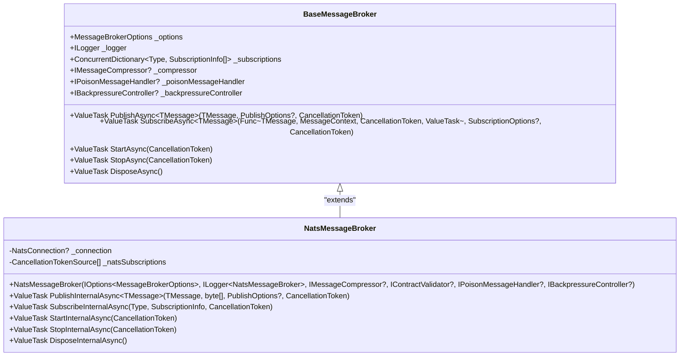
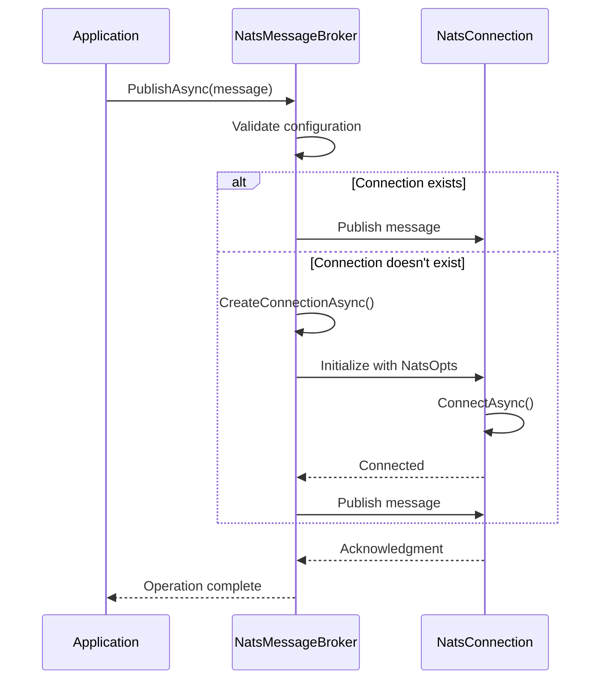
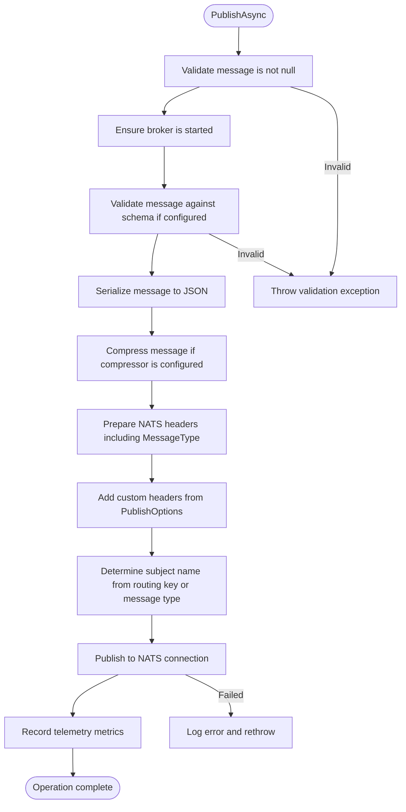
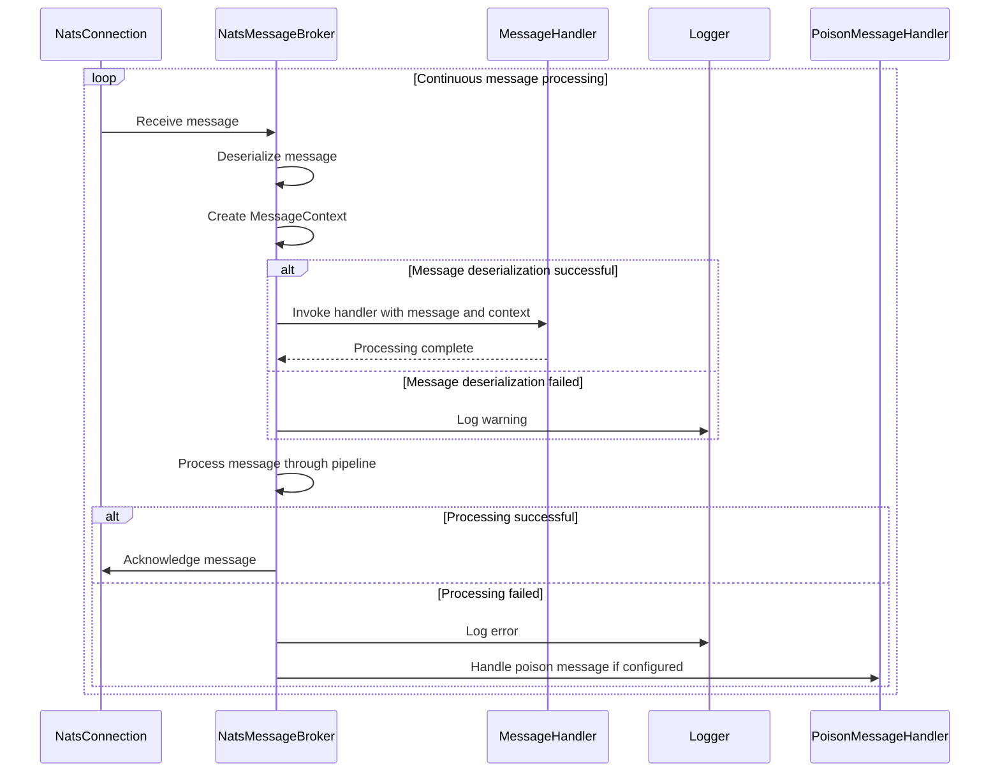
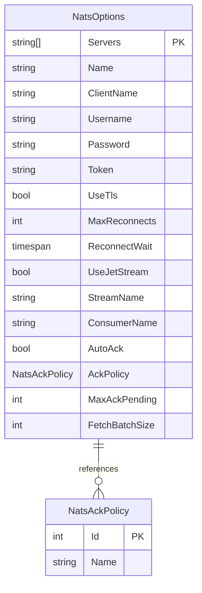
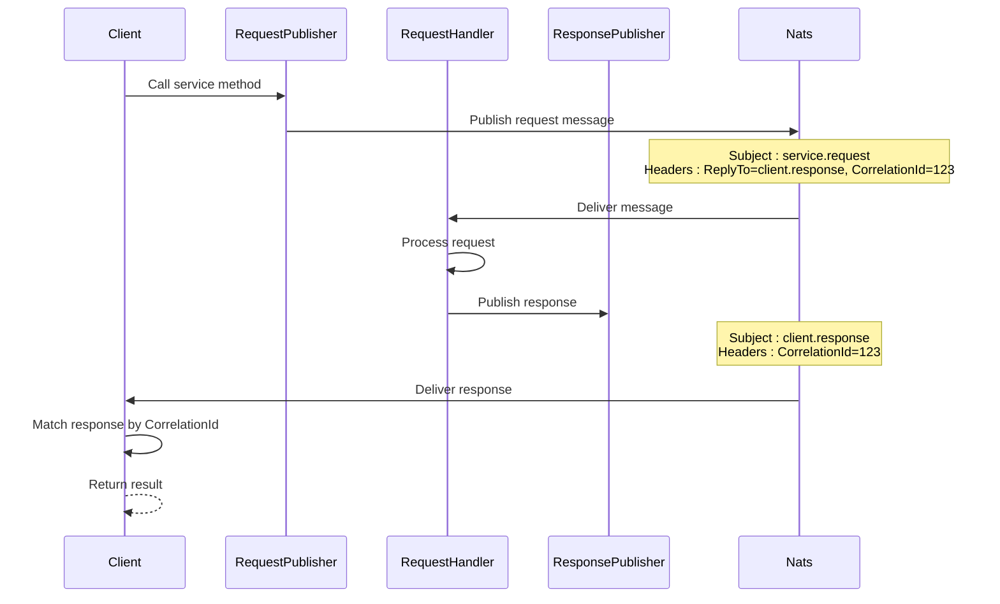
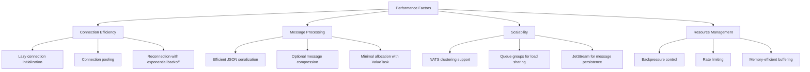
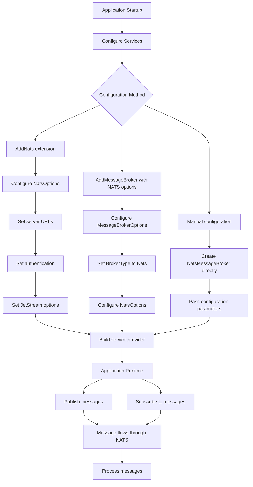

# NATS Integration

<cite>
**Referenced Files in This Document**   
- [NatsMessageBroker.cs](file://src/Relay.MessageBroker/Nats/NatsMessageBroker.cs)
- [NatsOptions.cs](file://src/Relay.MessageBroker/Nats/NatsOptions.cs)
- [BaseMessageBroker.cs](file://src/Relay.MessageBroker/Core/BaseMessageBroker.cs)
- [ServiceCollectionExtensionsNatsTests.cs](file://tests/Relay.MessageBroker.Tests/ServiceCollectionExtensionsNatsTests.cs)
- [NatsMessageBrokerConstructorTests.cs](file://tests/Relay.MessageBroker.Tests/NatsMessageBrokerConstructorTests.cs)
- [NatsMessageBrokerLifecycleTests.cs](file://tests/Relay.MessageBroker.Tests/NatsMessageBrokerLifecycleTests.cs)
- [NatsMessageBrokerPublishTests.cs](file://tests/Relay.MessageBroker.Tests/NatsMessageBrokerPublishTests.cs)
- [NatsMessageBrokerSubscribeTests.cs](file://tests/Relay.MessageBroker.Tests/NatsMessageBrokerSubscribeTests.cs)
- [NatsIntegrationTests.cs](file://tests/Relay.MessageBroker.Tests/Integration/NatsIntegrationTests.cs)
</cite>

## Table of Contents
1. [Introduction](#introduction)
2. [NatsMessageBroker Implementation](#natsmessagebroker-implementation)
3. [Connection Handling](#connection-handling)
4. [Message Publishing](#message-publishing)
5. [Subscription Management](#subscription-management)
6. [NatsOptions Configuration](#natsoptions-configuration)
7. [Request-Reply Pattern](#request-reply-pattern)
8. [Performance and Scalability](#performance-and-scalability)
9. [Common Issues and Best Practices](#common-issues-and-best-practices)
10. [Integration and Usage Examples](#integration-and-usage-examples)
11. [Conclusion](#conclusion)

## Introduction
The Relay framework provides a robust NATS integration through the NatsMessageBroker class, enabling efficient message queuing and event-driven communication. This document details the implementation of NATS within Relay, focusing on the NatsMessageBroker's architecture, configuration options, and usage patterns. NATS, known for its lightweight nature and high performance, serves as an ideal message broker for distributed systems requiring reliable and scalable communication. The integration in Relay abstracts the complexities of NATS while providing extensive configuration options for various deployment scenarios, from simple development setups to production-grade clusters with JetStream persistence.

## NatsMessageBroker Implementation
The NatsMessageBroker class serves as the primary implementation of NATS integration within the Relay framework, extending the BaseMessageBroker to provide NATS-specific functionality. This implementation follows a clean inheritance model, leveraging the base class for common message broker operations while implementing NATS-specific logic for connection management, message publishing, and subscription handling. The broker maintains a connection to the NATS server through a NatsConnection instance, which is lazily initialized upon the first publish or subscribe operation. The implementation uses a list of CancellationTokenSource objects to manage active subscriptions, allowing for clean shutdown and resource cleanup when the broker is stopped or disposed.

**Diagram sources**
- [NatsMessageBroker.cs](file://src/Relay.MessageBroker/Nats/NatsMessageBroker.cs#L16-L173)
- [BaseMessageBroker.cs](file://src/Relay.MessageBroker/Core/BaseMessageBroker.cs#L19-L507)

**Section sources**
- [NatsMessageBroker.cs](file://src/Relay.MessageBroker/Nats/NatsMessageBroker.cs#L16-L173)
- [BaseMessageBroker.cs](file://src/Relay.MessageBroker/Core/BaseMessageBroker.cs#L19-L507)

## Connection Handling
The NatsMessageBroker implements a robust connection handling mechanism that ensures reliable communication with NATS servers. During initialization, the broker validates the presence of NATS options and server URLs, throwing appropriate exceptions if configuration is incomplete. The actual connection to the NATS server is established lazily through the CreateConnectionAsync method, which is called during the first publish or subscribe operation. This approach minimizes startup overhead and allows for graceful handling of transient network issues.

The connection configuration includes several important parameters: server URLs, authentication credentials, client naming, and reconnection policies. The implementation supports multiple server URLs for cluster configurations, with automatic failover between servers. Authentication can be configured using username/password credentials or token-based authentication, providing flexibility for different security requirements. The reconnection policy is configurable with a maximum retry count and exponential backoff strategy, ensuring that temporary network disruptions do not permanently disrupt message flow.

**Diagram sources**
- [NatsMessageBroker.cs](file://src/Relay.MessageBroker/Nats/NatsMessageBroker.cs#L121-L148)
- [NatsMessageBroker.cs](file://src/Relay.MessageBroker/Nats/NatsMessageBroker.cs#L37-L61)

**Section sources**
- [NatsMessageBroker.cs](file://src/Relay.MessageBroker/Nats/NatsMessageBroker.cs#L121-L148)
- [NatsMessageBrokerConstructorTests.cs](file://tests/Relay.MessageBroker.Tests/NatsMessageBrokerConstructorTests.cs#L14-L405)

## Message Publishing
The message publishing mechanism in NatsMessageBroker provides a flexible and reliable way to send messages to NATS subjects. The PublishInternalAsync method handles the core publishing logic, serializing the message to JSON, adding metadata headers, and publishing to the appropriate subject. Each message includes a MessageType header containing the full type name, enabling consumers to properly deserialize the message. Additional headers can be included through the PublishOptions parameter, allowing for custom metadata to be attached to messages.

The subject name for publishing is determined by the GetSubjectName method, which combines a stream prefix (configurable via NatsOptions.StreamName) with the message type name. This convention ensures consistent subject naming across the application. When a routing key is specified in the PublishOptions, it takes precedence over the default subject name, providing flexibility for advanced routing scenarios. The implementation also integrates with Relay's telemetry and validation systems, recording publish metrics and validating messages against schemas when configured.

**Diagram sources**
- [NatsMessageBroker.cs](file://src/Relay.MessageBroker/Nats/NatsMessageBroker.cs#L37-L61)
- [BaseMessageBroker.cs](file://src/Relay.MessageBroker/Core/BaseMessageBroker.cs#L113-L182)

**Section sources**
- [NatsMessageBroker.cs](file://src/Relay.MessageBroker/Nats/NatsMessageBroker.cs#L37-L61)
- [NatsMessageBrokerPublishTests.cs](file://tests/Relay.MessageBroker.Tests/NatsMessageBrokerPublishTests.cs#L13-L112)

## Subscription Management
The subscription management system in NatsMessageBroker enables reliable message consumption from NATS subjects. The SubscribeInternalAsync method sets up a subscription to a subject derived from the message type, creating a background task that continuously receives messages. Each subscription is managed with a CancellationTokenSource, allowing for clean shutdown when the broker is stopped. The implementation processes each received message by deserializing it to the target type and invoking the registered handler within a try-catch block to prevent exceptions from disrupting the subscription.

Message context is created for each received message, containing metadata such as message ID, timestamp, routing key, and headers. This context is passed to the message handler, providing access to message metadata and enabling operations like acknowledgment in request-reply patterns. The implementation integrates with Relay's error handling system, logging exceptions that occur during message processing without terminating the subscription. This fault-tolerant design ensures that transient processing errors do not disrupt the overall message flow.

**Diagram sources**
- [NatsMessageBroker.cs](file://src/Relay.MessageBroker/Nats/NatsMessageBroker.cs#L63-L101)
- [NatsMessageBroker.cs](file://src/Relay.MessageBroker/Nats/NatsMessageBroker.cs#L73-L98)

**Section sources**
- [NatsMessageBroker.cs](file://src/Relay.MessageBroker/Nats/NatsMessageBroker.cs#L63-L101)
- [NatsMessageBrokerSubscribeTests.cs](file://tests/Relay.MessageBroker.Tests/NatsMessageBrokerSubscribeTests.cs#L13-L78)

## NatsOptions Configuration
The NatsOptions class provides comprehensive configuration options for customizing the NATS integration in Relay. These options are divided into several categories: connection settings, authentication, JetStream configuration, and performance tuning. The Servers property is required and specifies one or more NATS server URLs for connection. The connection can be secured with TLS by setting UseTls to true, and client identification can be customized with the Name and ClientName properties.

Authentication is supported through multiple mechanisms: username/password credentials, token-based authentication, or no authentication. The MaxReconnects and ReconnectWait properties control the reconnection behavior, with the implementation using exponential backoff between 1 and 10 seconds by default. For persistent messaging scenarios, JetStream can be enabled with the UseJetStream property, and the stream and consumer names can be specified for organized message storage and processing.

Performance-related options include FetchBatchSize for controlling the number of messages fetched in a single batch, and MaxAckPending for limiting the number of unacknowledged messages. The acknowledgment policy can be configured with the AckPolicy property, supporting explicit acknowledgment, automatic acknowledgment, or no acknowledgment depending on the reliability requirements of the application.

**Diagram sources**
- [NatsOptions.cs](file://src/Relay.MessageBroker/Nats/NatsOptions.cs#L6-L97)
- [NatsOptions.cs](file://src/Relay.MessageBroker/Nats/NatsOptions.cs#L92-L97)

**Section sources**
- [NatsOptions.cs](file://src/Relay.MessageBroker/Nats/NatsOptions.cs#L6-L97)
- [NatsMessageBrokerConstructorTests.cs](file://tests/Relay.MessageBroker.Tests/NatsMessageBrokerConstructorTests.cs#L14-L405)

## Request-Reply Pattern
The NATS integration in Relay supports the request-reply pattern through standard NATS messaging features. When publishing a message that expects a reply, the ReplyTo header can be set in the PublishOptions to specify the subject where the response should be sent. This enables synchronous communication patterns over the otherwise asynchronous message bus. The implementation preserves all standard NATS headers, including ReplyTo, allowing consumers to access this information when processing messages.

For request-reply scenarios, the message context provided to handlers includes the routing key and headers, enabling the handler to determine the appropriate response subject. The handler can then publish a response message to the ReplyTo subject, completing the request-reply cycle. This pattern is particularly useful for RPC-style operations, distributed transactions, or any scenario where a caller needs to wait for a response from a service.

The integration also supports correlation identifiers through custom headers, allowing callers to match responses with their corresponding requests. This is essential in high-throughput scenarios where multiple requests may be in flight simultaneously. By including a unique correlation ID in the request and echoing it in the response, clients can accurately match responses to their original requests even when responses arrive out of order.

**Diagram sources**
- [NatsMessageBroker.cs](file://src/Relay.MessageBroker/Nats/NatsMessageBroker.cs#L47-L58)
- [NatsIntegrationTests.cs](file://tests/Relay.MessageBroker.Tests/Integration/NatsIntegrationTests.cs#L236-L261)

**Section sources**
- [NatsIntegrationTests.cs](file://tests/Relay.MessageBroker.Tests/Integration/NatsIntegrationTests.cs#L236-L261)
- [NatsMessageBroker.cs](file://src/Relay.MessageBroker/Nats/NatsMessageBroker.cs#L47-L58)

## Performance and Scalability
The NATS integration in Relay is designed for high performance and scalability, leveraging NATS's lightweight architecture and efficient messaging protocols. The implementation minimizes overhead by using lazy connection initialization, efficient message serialization with System.Text.Json, and optional message compression. The use of ValueTask throughout the API reduces allocation overhead for asynchronous operations, improving throughput in high-load scenarios.

For scalability, the integration supports NATS clustering with automatic failover between servers, ensuring high availability and load distribution. The subscription model allows for multiple consumers to share message load through queue groups, enabling horizontal scaling of message processing. When using JetStream, message persistence and replay capabilities provide durability while maintaining high throughput.

The implementation also integrates with Relay's backpressure and rate limiting features, allowing the system to gracefully handle load spikes and prevent resource exhaustion. The backpressure controller can throttle message publishing when system resources are constrained, while rate limiting can prevent individual services from overwhelming the message bus. These features work together to create a resilient system that maintains performance under varying load conditions.

**Diagram sources**
- [NatsMessageBroker.cs](file://src/Relay.MessageBroker/Nats/NatsMessageBroker.cs#L121-L148)
- [NatsMessageBroker.cs](file://src/Relay.MessageBroker/Nats/NatsMessageBroker.cs#L37-L61)
- [BaseMessageBroker.cs](file://src/Relay.MessageBroker/Core/BaseMessageBroker.cs#L82-L104)

**Section sources**
- [NatsMessageBroker.cs](file://src/Relay.MessageBroker/Nats/NatsMessageBroker.cs#L121-L148)
- [BaseMessageBroker.cs](file://src/Relay.MessageBroker/Core/BaseMessageBroker.cs#L82-L104)

## Common Issues and Best Practices
When using the NATS integration in Relay, several common issues may arise, along with corresponding best practices for mitigation. Connection drops are a frequent concern, particularly in unstable network environments. The implementation addresses this with automatic reconnection logic, but applications should also implement circuit breakers and retry policies for additional resilience. Setting appropriate values for MaxReconnects and ReconnectWait can balance between aggressive reconnection attempts and avoiding network flooding.

Message ordering is another consideration, particularly in clustered deployments. While NATS provides ordering guarantees within a single subject, applications requiring strict ordering across multiple message types should use a single subject or implement sequence numbers in message payloads. For critical operations, using JetStream with explicit acknowledgment policies ensures message durability and prevents loss during broker restarts.

Configuration best practices include using environment-specific configuration files to manage server URLs and credentials, implementing health checks to monitor broker connectivity, and using structured logging to track message flow. For production deployments, enabling TLS encryption, using strong authentication, and configuring appropriate resource limits are essential for security and stability. Monitoring message rates, queue depths, and error rates provides visibility into system health and helps identify performance bottlenecks.

```mermaid
flowchart TD
A[Common Issues] --> B[Connection Drops]
A --> C[Message Ordering]
A --> D[Message Loss]
A --> E[Performance Bottlenecks]
B --> B1[Implement circuit breakers]
B --> B2[Configure appropriate reconnection settings]
B --> B3[Use connection health checks]
C --> C1[Use single subject for ordered messages]
C --> C2[Implement sequence numbers in payload]
C --> C3[Use JetStream with explicit ack]
D --> D1[Enable JetStream persistence]
D --> D2[Use durable consumers]
D --> D3[Implement poison message handling]
E --> E1[Monitor message rates and queue depths]
E --> E2[Implement backpressure control]
E --> E3[Optimize message size with compression]
F[Best Practices] --> G[Secure Configuration]
F --> H[Monitoring and Logging]
F --> I[Resilience Patterns]
F --> J[Performance Optimization]
G --> G1[Use environment-specific config]
G --> G2[Store credentials securely]
G --> G3[Enable TLS in production]
H --> H1[Implement structured logging]
H --> H2[Create custom health checks]
H --> H3[Monitor key metrics]
I --> I1[Implement retry policies]
I --> I2[Use circuit breakers]
I --> I3[Handle poison messages]
J --> J1[Compress large messages]
J --> J2[Batch high-frequency messages]
J --> J3[Optimize serialization]
```

**Diagram sources**
- [NatsOptions.cs](file://src/Relay.MessageBroker/Nats/NatsOptions.cs#L46-L51)
- [NatsMessageBroker.cs](file://src/Relay.MessageBroker/Nats/NatsMessageBroker.cs#L57-L58)
- [BaseMessageBroker.cs](file://src/Relay.MessageBroker/Core/BaseMessageBroker.cs#L82-L104)

**Section sources**
- [NatsMessageBrokerLifecycleTests.cs](file://tests/Relay.MessageBroker.Tests/NatsMessageBrokerLifecycleTests.cs#L14-L195)
- [NatsMessageBrokerConstructorTests.cs](file://tests/Relay.MessageBroker.Tests/NatsMessageBrokerConstructorTests.cs#L14-L405)

## Integration and Usage Examples
Integrating NATS with Relay can be accomplished through several approaches, with the recommended method being dependency injection configuration. The ServiceCollectionExtensionsNats class provides extension methods for configuring the NATS message broker in the application's service container. The AddNats method simplifies configuration by setting up the message broker with default options, while allowing for custom configuration through a lambda parameter.

For applications requiring more control, the message broker can be configured directly through the AddMessageBroker method with explicit NATS options. This approach provides access to all configuration options and allows for fine-tuned control over the integration. Configuration can be sourced from various providers, including JSON configuration files, environment variables, or code-based configuration.

The integration supports both publish and subscribe operations through a clean API that abstracts the underlying NATS complexity. Publishers can send messages with optional routing keys and custom headers, while subscribers register handlers that process messages asynchronously. The implementation integrates seamlessly with Relay's telemetry, logging, and error handling systems, providing a comprehensive solution for distributed communication.

**Diagram sources**
- [ServiceCollectionExtensionsNatsTests.cs](file://tests/Relay.MessageBroker.Tests/ServiceCollectionExtensionsNatsTests.cs#L8-L137)
- [NatsIntegrationTests.cs](file://tests/Relay.MessageBroker.Tests/Integration/NatsIntegrationTests.cs#L36-L273)

**Section sources**
- [ServiceCollectionExtensionsNatsTests.cs](file://tests/Relay.MessageBroker.Tests/ServiceCollectionExtensionsNatsTests.cs#L8-L137)
- [NatsIntegrationTests.cs](file://tests/Relay.MessageBroker.Tests/Integration/NatsIntegrationTests.cs#L36-L273)

## Conclusion
The NATS integration in the Relay framework provides a robust, high-performance solution for distributed messaging and event-driven architecture. Through the NatsMessageBroker implementation, Relay offers a comprehensive set of features for reliable message publishing and subscription, with extensive configuration options through NatsOptions. The integration leverages NATS's lightweight architecture to deliver excellent performance and scalability, making it suitable for both small-scale applications and large, distributed systems.

Key strengths of the integration include its clean API design, comprehensive error handling, and seamless integration with Relay's telemetry and monitoring systems. The implementation addresses common challenges in distributed systems, such as connection resilience, message ordering, and fault tolerance, while providing flexibility for various deployment scenarios. By following the best practices outlined in this document, developers can effectively leverage NATS within Relay to build scalable, resilient applications.

The integration's support for advanced NATS features like JetStream, request-reply patterns, and clustering enables sophisticated messaging patterns while maintaining simplicity for common use cases. As organizations continue to adopt microservices and event-driven architectures, the NATS integration in Relay provides a solid foundation for building responsive, loosely coupled systems that can evolve and scale with changing requirements.

**Section sources**
- [NatsMessageBroker.cs](file://src/Relay.MessageBroker/Nats/NatsMessageBroker.cs#L16-L173)
- [NatsOptions.cs](file://src/Relay.MessageBroker/Nats/NatsOptions.cs#L6-L97)
- [BaseMessageBroker.cs](file://src/Relay.MessageBroker/Core/BaseMessageBroker.cs#L19-L507)