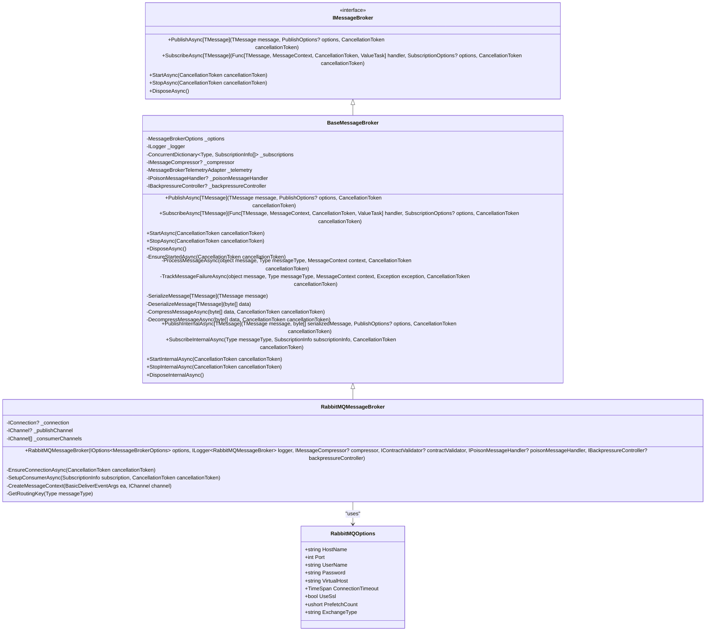
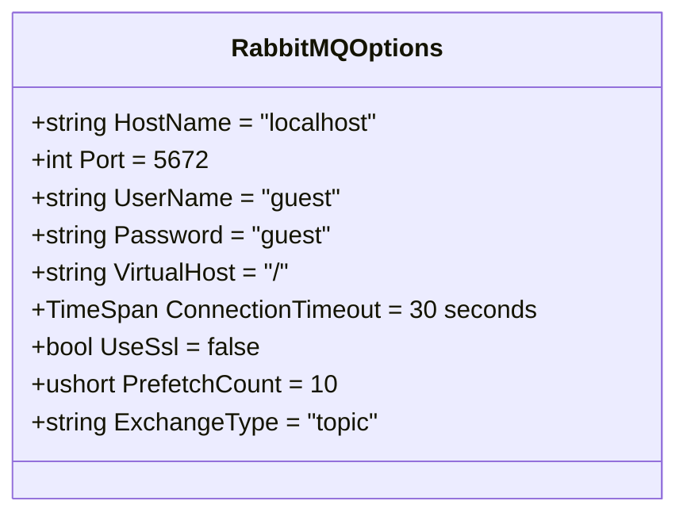
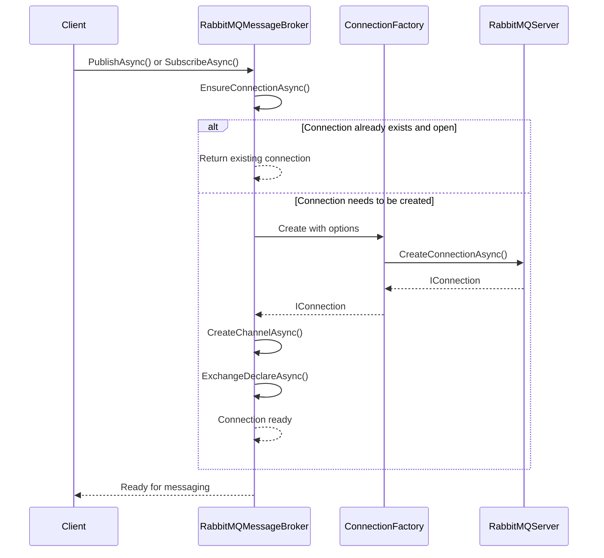
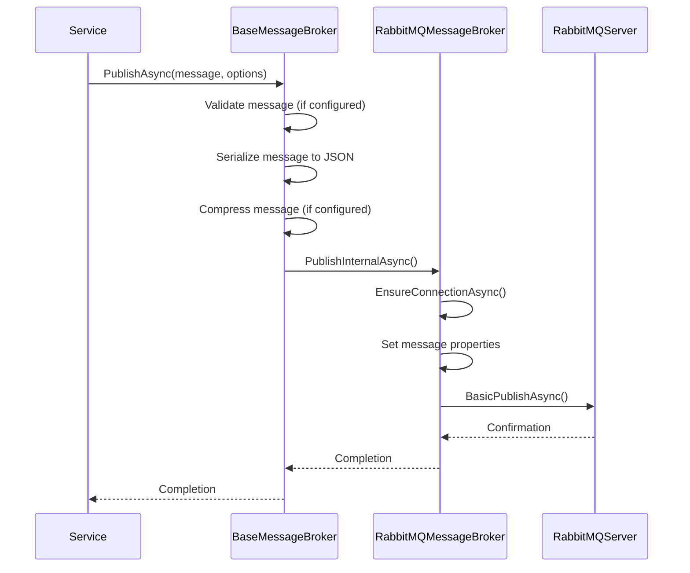
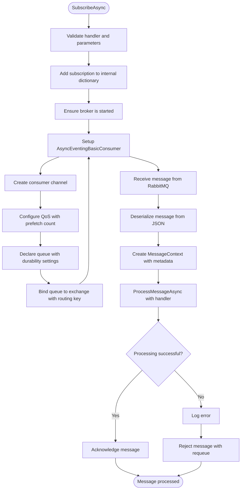
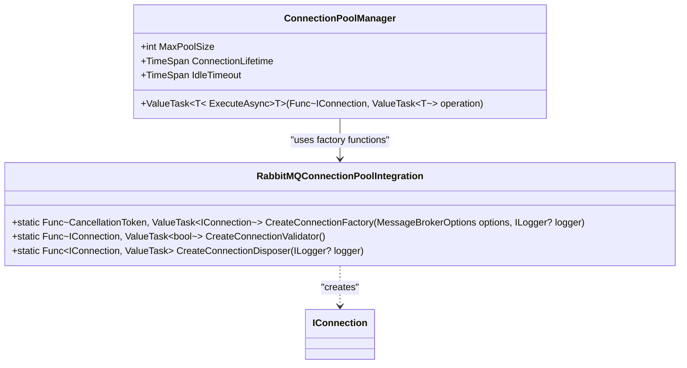
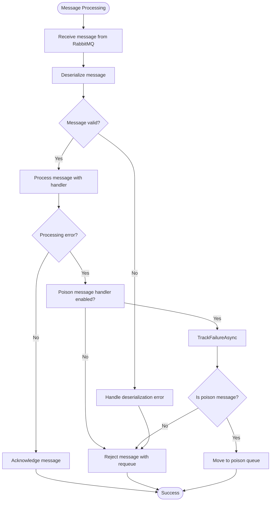
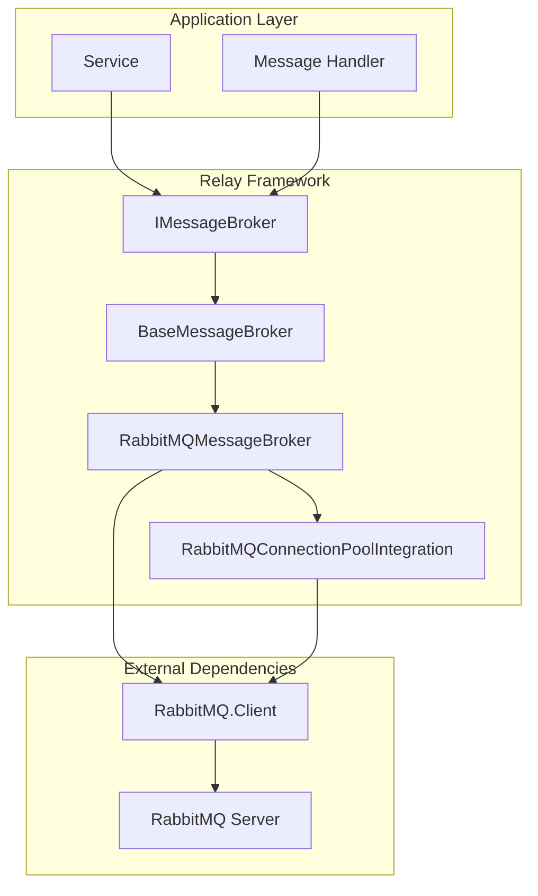

# RabbitMQ Integration

<cite>
**Referenced Files in This Document**   
- [RabbitMQMessageBroker.cs](file://src/Relay.MessageBroker/RabbitMQ/RabbitMQMessageBroker.cs)
- [RabbitMQOptions.cs](file://src/Relay.MessageBroker/RabbitMQ/RabbitMQOptions.cs)
- [RabbitMQConnectionPoolIntegration.cs](file://src/Relay.MessageBroker/RabbitMQ/RabbitMQConnectionPoolIntegration.cs)
- [BaseMessageBroker.cs](file://src/Relay.MessageBroker/Core/BaseMessageBroker.cs)
- [README.md](file://src/Relay.MessageBroker/README.md)
</cite>

## Table of Contents
1. [Introduction](#introduction)
2. [RabbitMQ Configuration Options](#rabbitmq-configuration-options)
3. [Connection Management](#connection-management)
4. [Message Publishing](#message-publishing)
5. [Subscription Handling](#subscription-handling)
6. [Connection Pooling Integration](#connection-pooling-integration)
7. [Error Handling and Recovery](#error-handling-and-recovery)
8. [Best Practices](#best-practices)
9. [Architecture Overview](#architecture-overview)

## Introduction

The Relay framework provides comprehensive RabbitMQ integration through the `RabbitMQMessageBroker` class, which implements the `IMessageBroker` interface. This integration enables reliable message queuing with support for exchanges, queues, routing, and various messaging patterns. The implementation follows a layered architecture with base functionality in `BaseMessageBroker` and RabbitMQ-specific features in `RabbitMQMessageBroker`.

The integration supports key RabbitMQ features including different exchange types (direct, topic, fanout, headers), message acknowledgments, prefetching, and connection pooling. It also provides automatic serialization, error handling, and telemetry integration for observability.

**Diagram sources**
- [BaseMessageBroker.cs](file://src/Relay.MessageBroker/Core/BaseMessageBroker.cs#L19-L507)
- [RabbitMQMessageBroker.cs](file://src/Relay.MessageBroker/RabbitMQ/RabbitMQMessageBroker.cs#L17-L298)
- [RabbitMQOptions.cs](file://src/Relay.MessageBroker/RabbitMQ/RabbitMQOptions.cs#L6-L52)

**Section sources**
- [RabbitMQMessageBroker.cs](file://src/Relay.MessageBroker/RabbitMQ/RabbitMQMessageBroker.cs#L1-L298)
- [BaseMessageBroker.cs](file://src/Relay.MessageBroker/Core/BaseMessageBroker.cs#L1-L507)
- [README.md](file://src/Relay.MessageBroker/README.md#L1-L707)

## RabbitMQ Configuration Options

The `RabbitMQOptions` class provides comprehensive configuration options for connecting to and using RabbitMQ. These options can be set programmatically or through configuration files, allowing for flexible deployment scenarios.

The configuration includes essential connection parameters such as hostname, port, username, password, and virtual host. It also includes advanced settings like connection timeout, SSL usage, prefetch count, and exchange type. The exchange type must be one of the valid RabbitMQ exchange types: direct, topic, fanout, or headers.

**Diagram sources**
- [RabbitMQOptions.cs](file://src/Relay.MessageBroker/RabbitMQ/RabbitMQOptions.cs#L6-L52)

**Section sources**
- [RabbitMQOptions.cs](file://src/Relay.MessageBroker/RabbitMQ/RabbitMQOptions.cs#L1-L52)
- [README.md](file://src/Relay.MessageBroker/README.md#L46-L62)

## Connection Management

The `RabbitMQMessageBroker` handles connection management through the `EnsureConnectionAsync` method, which establishes and maintains the connection to the RabbitMQ server. The connection is created using the `ConnectionFactory` from the RabbitMQ.Client library with parameters from the `RabbitMQOptions`.

The implementation follows a lazy connection pattern, establishing the connection only when needed (during publishing or subscription). It checks if an existing connection is open before creating a new one, optimizing resource usage. The connection includes automatic declaration of the default exchange with the specified exchange type, ensuring the messaging infrastructure is properly set up.

When using a connection string, it takes precedence over individual connection properties, providing a convenient way to configure the connection through environment variables or configuration files.

**Diagram sources**
- [RabbitMQMessageBroker.cs](file://src/Relay.MessageBroker/RabbitMQ/RabbitMQMessageBroker.cs#L161-L197)
- [RabbitMQOptions.cs](file://src/Relay.MessageBroker/RabbitMQ/RabbitMQOptions.cs#L6-L52)

**Section sources**
- [RabbitMQMessageBroker.cs](file://src/Relay.MessageBroker/RabbitMQ/RabbitMQMessageBroker.cs#L161-L197)

## Message Publishing

Message publishing in the Relay framework's RabbitMQ integration is handled through the `PublishInternalAsync` method. This method serializes the message to JSON, sets up appropriate message properties, and publishes it to the specified exchange with the routing key.

The implementation supports various publishing options including custom routing keys, exchanges, message priority, expiration, and custom headers. Message properties such as persistence, message ID, timestamp, content type, and message type are automatically set. The publish operation is asynchronous and includes comprehensive logging for debugging and monitoring.

The base `BaseMessageBroker` class handles message validation, compression, and telemetry before delegating to the RabbitMQ-specific implementation, ensuring consistent behavior across different message broker implementations.

**Diagram sources**
- [RabbitMQMessageBroker.cs](file://src/Relay.MessageBroker/RabbitMQ/RabbitMQMessageBroker.cs#L64-L117)
- [BaseMessageBroker.cs](file://src/Relay.MessageBroker/Core/BaseMessageBroker.cs#L113-L182)

**Section sources**
- [RabbitMQMessageBroker.cs](file://src/Relay.MessageBroker/RabbitMQ/RabbitMQMessageBroker.cs#L64-L117)
- [BaseMessageBroker.cs](file://src/Relay.MessageBroker/Core/BaseMessageBroker.cs#L113-L182)

## Subscription Handling

Subscription handling in the RabbitMQ integration is implemented through the `SetupConsumerAsync` method, which creates a consumer channel, declares a queue, binds it to an exchange with a routing key, and sets up a message consumer.

The subscription process includes configuring the prefetch count to control how many messages are delivered to the consumer at once, helping to balance load and prevent overwhelming the consumer. The consumer uses an `AsyncEventingBasicConsumer` to handle messages asynchronously, with automatic deserialization and message context creation.

Message acknowledgment is handled based on the subscription options. When `AutoAck` is false (the default), the framework automatically acknowledges messages after successful processing or rejects them if an error occurs. The message context provides `Acknowledge` and `Reject` methods for manual acknowledgment control.

**Diagram sources**
- [RabbitMQMessageBroker.cs](file://src/Relay.MessageBroker/RabbitMQ/RabbitMQMessageBroker.cs#L199-L269)
- [BaseMessageBroker.cs](file://src/Relay.MessageBroker/Core/BaseMessageBroker.cs#L191-L222)

**Section sources**
- [RabbitMQMessageBroker.cs](file://src/Relay.MessageBroker/RabbitMQ/RabbitMQMessageBroker.cs#L199-L269)
- [BaseMessageBroker.cs](file://src/Relay.MessageBroker/Core/BaseMessageBroker.cs#L191-L222)

## Connection Pooling Integration

The Relay framework provides connection pooling integration for RabbitMQ through the `RabbitMQConnectionPoolIntegration` class. This integration enables efficient reuse of RabbitMQ connections, reducing the overhead of establishing new connections and improving performance under high load.

The connection pool integration provides three key functions: `CreateConnectionFactory` for creating new connections, `CreateConnectionValidator` for validating existing connections, and `CreateConnectionDisposer` for properly disposing of connections. These functions can be used with a connection pool manager to maintain a pool of ready-to-use connections.

Connection pooling is particularly beneficial in scenarios with high message throughput or when multiple services need to connect to the same RabbitMQ server. It helps to reduce connection establishment latency and prevents connection storms during application startup or scaling events.

**Diagram sources**
- [RabbitMQConnectionPoolIntegration.cs](file://src/Relay.MessageBroker/RabbitMQ/RabbitMQConnectionPoolIntegration.cs#L11-L78)

**Section sources**
- [RabbitMQConnectionPoolIntegration.cs](file://src/Relay.MessageBroker/RabbitMQ/RabbitMQConnectionPoolIntegration.cs#L1-L78)

## Error Handling and Recovery

The RabbitMQ integration in Relay framework includes comprehensive error handling and recovery mechanisms. The implementation validates configuration options during initialization, throwing appropriate exceptions for invalid settings such as empty hostnames, invalid ports, or unsupported exchange types.

During message processing, exceptions are caught and logged, with automatic rejection of messages when auto-acknowledgment is disabled. The framework integrates with poison message handling, tracking message processing failures and moving messages to a poison queue when the failure threshold is exceeded.

The base `BaseMessageBroker` class provides additional error handling layers including message validation, schema validation, and telemetry for error tracking. This multi-layered approach ensures that errors are properly handled at different levels of the messaging pipeline.

**Diagram sources**
- [RabbitMQMessageBroker.cs](file://src/Relay.MessageBroker/RabbitMQ/RabbitMQMessageBroker.cs#L230-L255)
- [BaseMessageBroker.cs](file://src/Relay.MessageBroker/Core/BaseMessageBroker.cs#L328-L431)

**Section sources**
- [RabbitMQMessageBroker.cs](file://src/Relay.MessageBroker/RabbitMQ/RabbitMQMessageBroker.cs#L230-L255)
- [BaseMessageBroker.cs](file://src/Relay.MessageBroker/Core/BaseMessageBroker.cs#L328-L431)

## Best Practices

When using RabbitMQ with the Relay framework, several best practices should be followed to ensure reliable and efficient messaging:

1. **Use Connection Pooling**: Implement connection pooling to reduce connection establishment overhead and improve performance under high load.

2. **Configure Appropriate Prefetch Count**: Set the prefetch count based on your processing capacity to balance throughput and memory usage.

3. **Implement Idempotent Handlers**: Design message handlers to be idempotent to handle potential message redelivery scenarios.

4. **Use Dead Letter Exchanges**: Configure dead letter exchanges to handle messages that cannot be processed after multiple attempts.

5. **Monitor Message Processing Time**: Use the built-in telemetry to monitor message processing times and identify performance bottlenecks.

6. **Handle Errors Gracefully**: Implement proper error handling with appropriate acknowledgment strategies based on error types (transient vs. fatal).

7. **Use Message Expiration**: Set appropriate message expiration times to prevent messages from lingering indefinitely in queues.

8. **Validate Message Contracts**: Use the contract validation features to ensure message structure consistency across services.

## Architecture Overview

The RabbitMQ integration in the Relay framework follows a layered architecture with clear separation of concerns. The base functionality is provided by `BaseMessageBroker`, which handles common messaging operations like serialization, compression, validation, and telemetry. The RabbitMQ-specific implementation in `RabbitMQMessageBroker` extends this base class, implementing the abstract methods for RabbitMQ operations.

The integration uses dependency injection for extensibility, allowing components like message compressors, contract validators, poison message handlers, and backpressure controllers to be injected as needed. This design enables the framework to be easily extended with additional features without modifying the core implementation.

The connection management follows a lazy initialization pattern, establishing connections only when needed and reusing them for subsequent operations. This optimizes resource usage and reduces connection overhead.

**Diagram sources**
- [RabbitMQMessageBroker.cs](file://src/Relay.MessageBroker/RabbitMQ/RabbitMQMessageBroker.cs#L1-L298)
- [BaseMessageBroker.cs](file://src/Relay.MessageBroker/Core/BaseMessageBroker.cs#L1-L507)
- [RabbitMQConnectionPoolIntegration.cs](file://src/Relay.MessageBroker/RabbitMQ/RabbitMQConnectionPoolIntegration.cs#L1-L78)

**Section sources**
- [RabbitMQMessageBroker.cs](file://src/Relay.MessageBroker/RabbitMQ/RabbitMQMessageBroker.cs#L1-L298)
- [BaseMessageBroker.cs](file://src/Relay.MessageBroker/Core/BaseMessageBroker.cs#L1-L507)
- [RabbitMQConnectionPoolIntegration.cs](file://src/Relay.MessageBroker/RabbitMQ/RabbitMQConnectionPoolIntegration.cs#L1-L78)
- [README.md](file://src/Relay.MessageBroker/README.md#L1-L707)