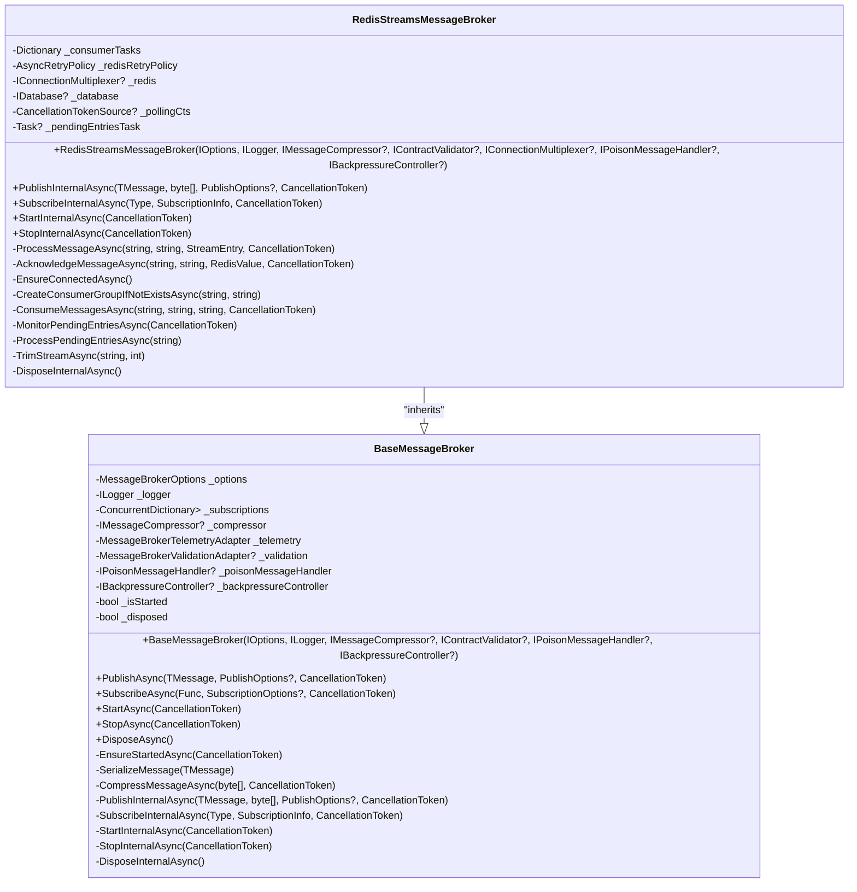
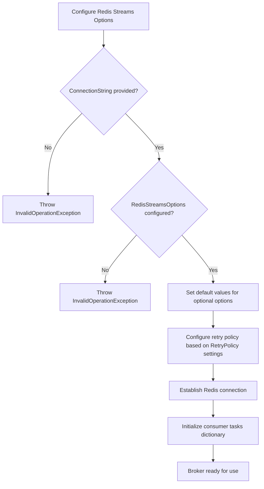
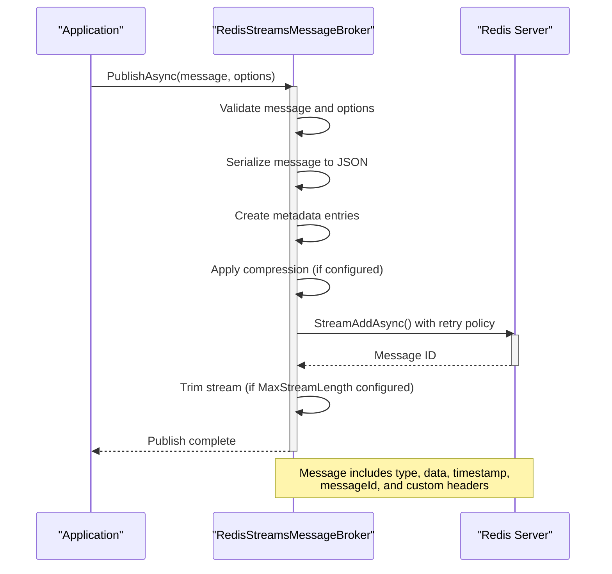
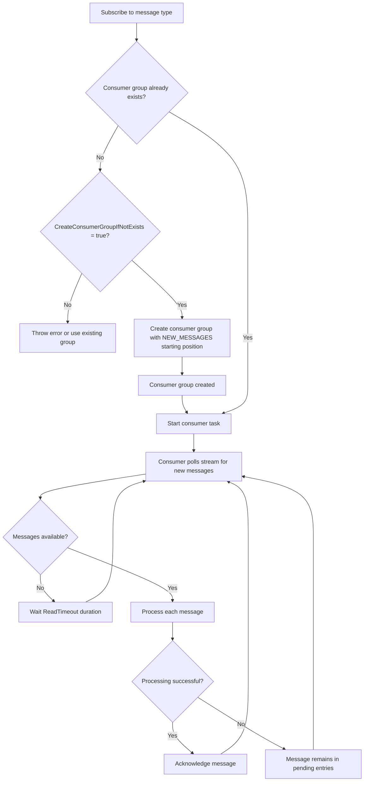
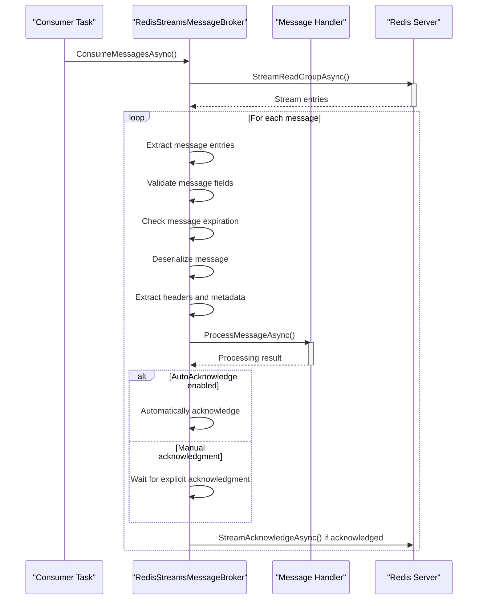
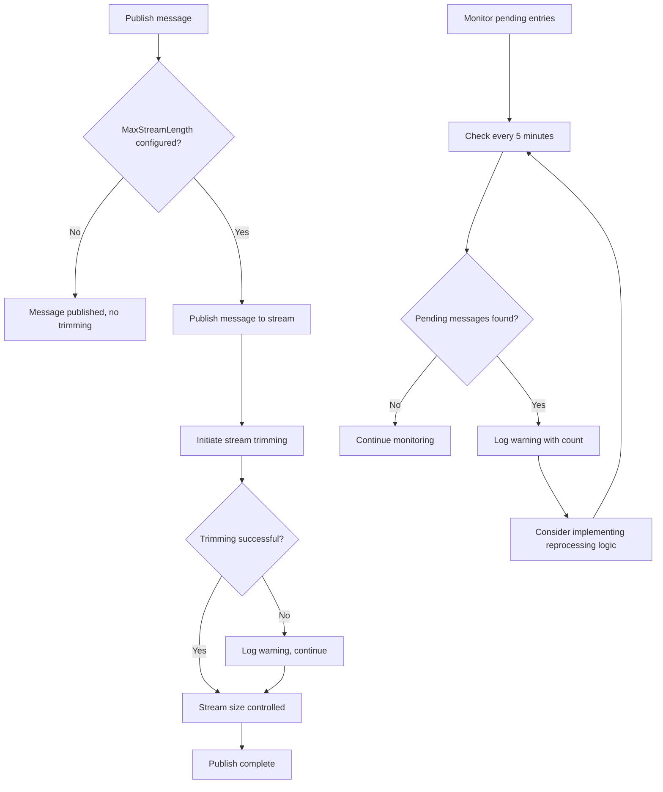
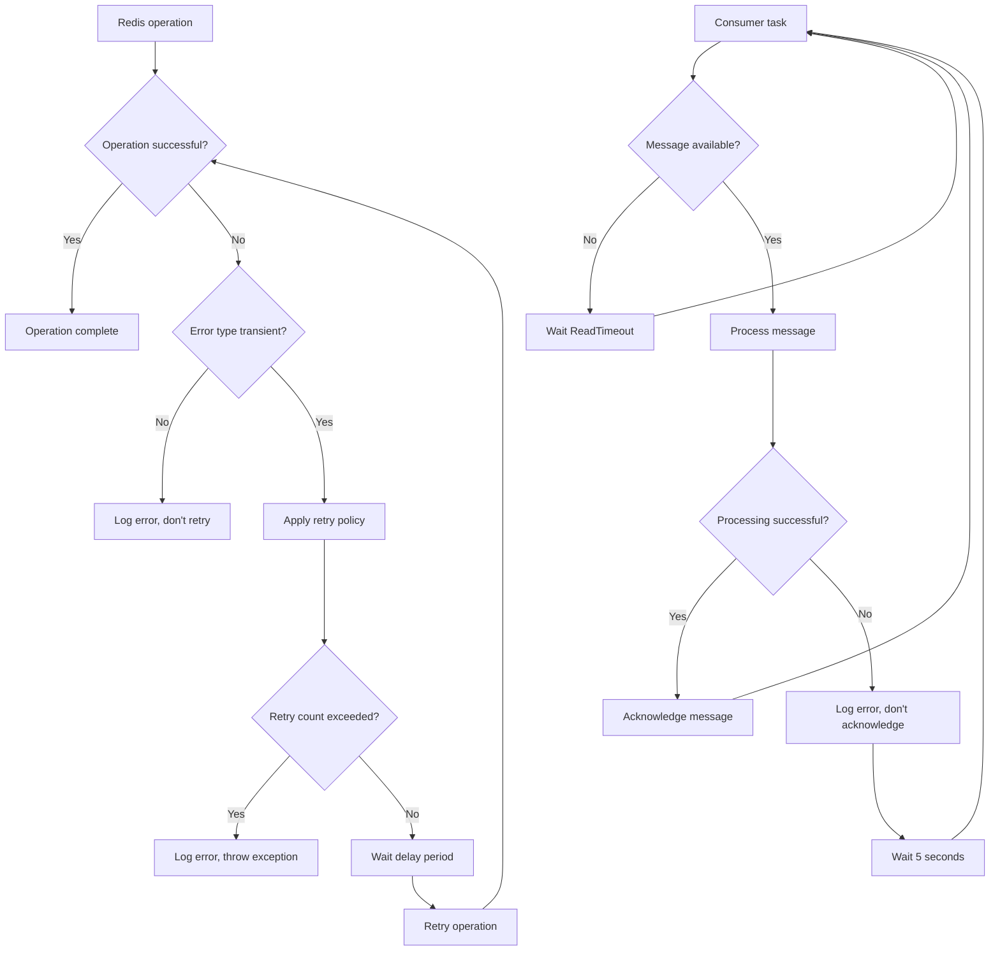
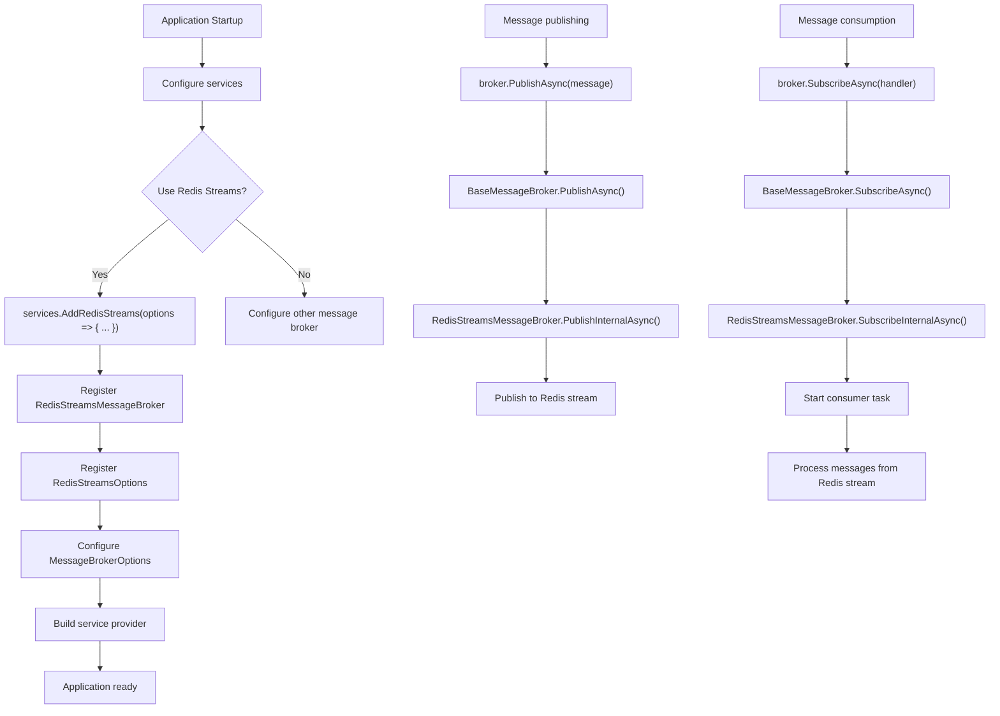

# Redis Streams Integration

<cite>
**Referenced Files in This Document**   
- [RedisStreamsMessageBroker.cs](file://src/Relay.MessageBroker/RedisStreams/RedisStreamsMessageBroker.cs)
- [RedisStreamsOptions.cs](file://src/Relay.MessageBroker/RedisStreams/RedisStreamsOptions.cs)
- [RedisStreamsMessageBrokerConstructorTests.cs](file://tests/Relay.MessageBroker.Tests/RedisStreamsMessageBrokerConstructorTests.cs)
- [RedisStreamsMessageBrokerPublishTests.cs](file://tests/Relay.MessageBroker.Tests/RedisStreamsMessageBrokerPublishTests.cs)
- [RedisStreamsMessageBrokerSubscribeTests.cs](file://tests/Relay.MessageBroker.Tests/RedisStreamsMessageBrokerSubscribeTests.cs)
- [RedisStreamsMessageBrokerLifecycleTests.cs](file://tests/Relay.MessageBroker.Tests/RedisStreamsMessageBrokerLifecycleTests.cs)
- [ServiceCollectionExtensionsRedisStreamsTests.cs](file://tests/Relay.MessageBroker.Tests/ServiceCollectionExtensionsRedisStreamsTests.cs)
- [MessageBrokerOptions.cs](file://src/Relay.MessageBroker/Configuration/MessageBrokerOptions.cs)
- [BaseMessageBroker.cs](file://src/Relay.MessageBroker/Core/BaseMessageBroker.cs)
</cite>

## Table of Contents
1. [Introduction](#introduction)
2. [Redis Streams Message Broker Implementation](#redis-streams-message-broker-implementation)
3. [Configuration Options](#configuration-options)
4. [Message Publishing](#message-publishing)
5. [Consumer Group Management](#consumer-group-management)
6. [Message Acknowledgment and Processing](#message-acknowledgment-and-processing)
7. [Stream Management and Trimming](#stream-management-and-trimming)
8. [Error Handling and Resilience](#error-handling-and-resilience)
9. [Integration with Relay Framework](#integration-with-relay-framework)
10. [Best Practices and Common Issues](#best-practices-and-common-issues)
11. [Conclusion](#conclusion)

## Introduction

Redis Streams integration in the Relay framework provides a robust message broker implementation that leverages Redis Streams for reliable message queuing and processing. This document details the implementation of the RedisStreamsMessageBroker, covering stream creation, message publishing, consumer group management, and configuration options. The integration offers enterprise-grade features including message persistence, consumer group coordination, and resilience to connection failures. This documentation is designed to be accessible to beginners while providing sufficient technical depth for experienced developers implementing message-based architectures with Redis Streams in the Relay framework.

**Section sources**
- [RedisStreamsMessageBroker.cs](file://src/Relay.MessageBroker/RedisStreams/RedisStreamsMessageBroker.cs#L1-L558)
- [RedisStreamsOptions.cs](file://src/Relay.MessageBroker/RedisStreams/RedisStreamsOptions.cs#L1-L67)

## Redis Streams Message Broker Implementation

The RedisStreamsMessageBroker class implements a message broker using Redis Streams as the underlying messaging system. This implementation inherits from BaseMessageBroker and provides Redis-specific functionality for message publishing and consumption. The broker establishes a connection to Redis using StackExchange.Redis and manages the lifecycle of Redis connections, ensuring reliable message delivery even in the face of network interruptions.

The implementation uses a dictionary to track consumer tasks for different streams, allowing multiple streams to be consumed simultaneously within the same application instance. Each consumer task runs in a separate background task, polling its assigned stream for new messages. The broker also implements a retry policy using Polly to handle transient Redis connection issues, automatically retrying failed operations with exponential backoff.

**Diagram sources**
- [RedisStreamsMessageBroker.cs](file://src/Relay.MessageBroker/RedisStreams/RedisStreamsMessageBroker.cs#L17-L558)
- [BaseMessageBroker.cs](file://src/Relay.MessageBroker/Core/BaseMessageBroker.cs#L19-L507)

**Section sources**
- [RedisStreamsMessageBroker.cs](file://src/Relay.MessageBroker/RedisStreams/RedisStreamsMessageBroker.cs#L17-L558)
- [BaseMessageBroker.cs](file://src/Relay.MessageBroker/Core/BaseMessageBroker.cs#L19-L507)

## Configuration Options

The Redis Streams integration provides comprehensive configuration options through the RedisStreamsOptions class, allowing fine-tuning of the message broker behavior. These options are accessed through the MessageBrokerOptions.RedisStreams property and can be configured either programmatically or via configuration files.

The primary configuration options include:

| Option | Type | Default Value | Description |
|--------|------|---------------|-------------|
| ConnectionString | string | "localhost:6379" | Redis connection string in the format host:port |
| DefaultStreamName | string | "relay:stream" | Default stream name used when no routing key is specified |
| ConsumerGroupName | string | "relay-consumer-group" | Name of the consumer group for coordinated message consumption |
| ConsumerName | string | "relay-consumer" | Name of the consumer instance within the consumer group |
| MaxMessagesToRead | int | 10 | Maximum number of messages to read in a single batch from the stream |
| ReadTimeout | TimeSpan | 1 second | Timeout between polling attempts when no messages are available |
| MaxStreamLength | int? | null | Maximum length of the stream before trimming is applied |
| CreateConsumerGroupIfNotExists | bool | true | Whether to automatically create the consumer group if it doesn't exist |
| Database | int | 0 | Redis database number to use for the streams |
| AutoAcknowledge | bool | true | Whether to automatically acknowledge messages after successful processing |
| ConnectTimeout | TimeSpan? | null | Timeout for establishing a connection to Redis |
| SyncTimeout | TimeSpan? | null | Timeout for synchronous operations with Redis |

These options can be configured through the service collection extensions or directly when creating the message broker instance. The configuration system validates required options during initialization, throwing appropriate exceptions if critical settings like the connection string are missing.

**Diagram sources**
- [RedisStreamsOptions.cs](file://src/Relay.MessageBroker/RedisStreams/RedisStreamsOptions.cs#L6-L67)
- [RedisStreamsMessageBroker.cs](file://src/Relay.MessageBroker/RedisStreams/RedisStreamsMessageBroker.cs#L26-L66)
- [RedisStreamsMessageBrokerConstructorTests.cs](file://tests/Relay.MessageBroker.Tests/RedisStreamsMessageBrokerConstructorTests.cs#L55-L394)

**Section sources**
- [RedisStreamsOptions.cs](file://src/Relay.MessageBroker/RedisStreams/RedisStreamsOptions.cs#L6-L67)
- [RedisStreamsMessageBroker.cs](file://src/Relay.MessageBroker/RedisStreams/RedisStreamsMessageBroker.cs#L26-L66)
- [RedisStreamsMessageBrokerConstructorTests.cs](file://tests/Relay.MessageBroker.Tests/RedisStreamsMessageBrokerConstructorTests.cs#L55-L394)

## Message Publishing

The Redis Streams message broker implements a robust message publishing mechanism that serializes messages and stores them in Redis Streams with comprehensive metadata. When a message is published, it is first serialized to JSON format and then published to the appropriate stream based on the routing key specified in the publish options or the default stream name configured in RedisStreamsOptions.

Each message published to a Redis stream includes several metadata fields that facilitate message processing and tracking:
- type: The fully qualified type name of the message
- data: The JSON-serialized message content
- timestamp: The Unix timestamp in milliseconds when the message was published
- messageId: A unique GUID identifier for the message
- correlationId: Optional correlation ID for tracking related messages
- priority: Optional priority level for the message
- expiration: Optional expiration time in milliseconds

The publishing process includes built-in retry logic using Polly's retry policy, which handles transient Redis connection issues by automatically retrying failed operations with exponential backoff. This ensures reliable message delivery even during temporary network disruptions.

**Diagram sources**
- [RedisStreamsMessageBroker.cs](file://src/Relay.MessageBroker/RedisStreams/RedisStreamsMessageBroker.cs#L68-L139)
- [RedisStreamsMessageBrokerPublishTests.cs](file://tests/Relay.MessageBroker.Tests/RedisStreamsMessageBrokerPublishTests.cs#L55-L203)

**Section sources**
- [RedisStreamsMessageBroker.cs](file://src/Relay.MessageBroker/RedisStreams/RedisStreamsMessageBroker.cs#L68-L139)
- [RedisStreamsMessageBrokerPublishTests.cs](file://tests/Relay.MessageBroker.Tests/RedisStreamsMessageBrokerPublishTests.cs#L55-L203)

## Consumer Group Management

The Redis Streams integration in Relay implements consumer group management to enable coordinated message consumption across multiple instances of an application. Consumer groups allow multiple consumers to work together on the same stream while ensuring that each message is processed by only one consumer, providing both scalability and reliability.

When a consumer subscribes to a message type, the broker creates a consumer within the specified consumer group (or uses the default group name from configuration). The consumer name is automatically generated to include the machine name and a unique identifier, ensuring uniqueness across different instances. If the CreateConsumerGroupIfNotExists option is enabled (which is the default), the broker will automatically create the consumer group if it doesn't already exist.

The consumer group implementation handles message acknowledgment through Redis's built-in acknowledgment system. When a message is successfully processed, it is acknowledged using the StreamAcknowledgeAsync method, which removes it from the pending entries list. If a consumer fails to process a message (due to an exception or shutdown), the message remains in the pending entries list and can be processed by another consumer in the group.

**Diagram sources**
- [RedisStreamsMessageBroker.cs](file://src/Relay.MessageBroker/RedisStreams/RedisStreamsMessageBroker.cs#L142-L191)
- [RedisStreamsMessageBrokerSubscribeTests.cs](file://tests/Relay.MessageBroker.Tests/RedisStreamsMessageBrokerSubscribeTests.cs#L89-L176)

**Section sources**
- [RedisStreamsMessageBroker.cs](file://src/Relay.MessageBroker/RedisStreams/RedisStreamsMessageBroker.cs#L142-L191)
- [RedisStreamsMessageBrokerSubscribeTests.cs](file://tests/Relay.MessageBroker.Tests/RedisStreamsMessageBrokerSubscribeTests.cs#L89-L176)

## Message Acknowledgment and Processing

The Redis Streams message broker implements a comprehensive message acknowledgment and processing system that ensures reliable message delivery and processing. When a message is consumed from a Redis stream, it is delivered to the appropriate handler function registered through the SubscribeAsync method. The processing pipeline includes several stages of validation and error handling to ensure message integrity.

During message processing, the broker extracts the message type and data from the Redis stream entry and deserializes the message content from JSON format. The message context includes an Acknowledge delegate that can be called to acknowledge successful processing, removing the message from the pending entries list in Redis. If auto-acknowledgment is enabled (the default), the message is automatically acknowledged after successful processing.

The broker also implements message expiration handling, where messages with an expiration timestamp in the past are automatically skipped and acknowledged without processing. This prevents stale messages from being processed after their relevance has expired. Additionally, the broker validates essential message fields (type and data) before attempting deserialization, ensuring that malformed messages are handled gracefully.

**Diagram sources**
- [RedisStreamsMessageBroker.cs](file://src/Relay.MessageBroker/RedisStreams/RedisStreamsMessageBroker.cs#L236-L397)
- [BaseMessageBroker.cs](file://src/Relay.MessageBroker/Core/BaseMessageBroker.cs#L113-L182)

**Section sources**
- [RedisStreamsMessageBroker.cs](file://src/Relay.MessageBroker/RedisStreams/RedisStreamsMessageBroker.cs#L236-L397)
- [BaseMessageBroker.cs](file://src/Relay.MessageBroker/Core/BaseMessageBroker.cs#L113-L182)

## Stream Management and Trimming

The Redis Streams integration includes built-in stream management features to control the size of Redis streams and prevent unbounded growth. The MaxStreamLength configuration option allows setting a maximum length for streams, after which older messages are automatically trimmed to make room for new ones.

When a message is published and the MaxStreamLength option is set, the broker first publishes the message to the stream and then initiates a separate trimming operation. This separation ensures that message publishing remains fast and responsive, while stream trimming occurs as a background operation. The trimming uses Redis's approximate trimming feature (useApproximateMaxLength: true) for better performance, which means the actual stream length may slightly exceed the specified maximum.

The broker also includes monitoring for pending entries, which are messages that have been delivered to a consumer but not yet acknowledged. Although the current implementation primarily logs information about pending entries, this feature can be extended to implement more sophisticated handling such as message reprocessing or alerting when pending message counts exceed thresholds.

**Diagram sources**
- [RedisStreamsMessageBroker.cs](file://src/Relay.MessageBroker/RedisStreams/RedisStreamsMessageBroker.cs#L135-L139)
- [RedisStreamsMessageBroker.cs](file://src/Relay.MessageBroker/RedisStreams/RedisStreamsMessageBroker.cs#L533-L548)
- [RedisStreamsMessageBroker.cs](file://src/Relay.MessageBroker/RedisStreams/RedisStreamsMessageBroker.cs#L488-L508)

**Section sources**
- [RedisStreamsMessageBroker.cs](file://src/Relay.MessageBroker/RedisStreams/RedisStreamsMessageBroker.cs#L135-L139)
- [RedisStreamsMessageBroker.cs](file://src/Relay.MessageBroker/RedisStreams/RedisStreamsMessageBroker.cs#L533-L548)
- [RedisStreamsMessageBroker.cs](file://src/Relay.MessageBroker/RedisStreams/RedisStreamsMessageBroker.cs#L488-L508)

## Error Handling and Resilience

The Redis Streams message broker implements comprehensive error handling and resilience features to ensure reliable operation in production environments. The implementation uses Polly's retry policy to handle transient Redis connection issues, automatically retrying failed operations with exponential backoff. The retry policy is configured to handle RedisConnectionException, RedisTimeoutException, and RedisServerException, with configurable maximum attempts and delay parameters.

Connection resilience is further enhanced through the EnsureConnectedAsync method, which establishes and maintains the Redis connection. This method uses StackExchange.Redis's ConnectionMultiplexer with configurable connection and sync timeouts, reconnect retry policies, and keep-alive settings. If the connection is lost, the broker will automatically attempt to reconnect when the next operation is performed.

For consumer resilience, each consumer task runs in a separate background task with its own error handling. If an error occurs during message consumption, the task logs the error and continues with a delay before attempting to consume more messages. This prevents a single problematic message from stopping the entire consumer.

**Diagram sources**
- [RedisStreamsMessageBroker.cs](file://src/Relay.MessageBroker/RedisStreams/RedisStreamsMessageBroker.cs#L49-L65)
- [RedisStreamsMessageBroker.cs](file://src/Relay.MessageBroker/RedisStreams/RedisStreamsMessageBroker.cs#L417-L444)
- [RedisStreamsMessageBroker.cs](file://src/Relay.MessageBroker/RedisStreams/RedisStreamsMessageBroker.cs#L174-L189)

**Section sources**
- [RedisStreamsMessageBroker.cs](file://src/Relay.MessageBroker/RedisStreams/RedisStreamsMessageBroker.cs#L49-L65)
- [RedisStreamsMessageBroker.cs](file://src/Relay.MessageBroker/RedisStreams/RedisStreamsMessageBroker.cs#L417-L444)
- [RedisStreamsMessageBroker.cs](file://src/Relay.MessageBroker/RedisStreams/RedisStreamsMessageBroker.cs#L174-L189)

## Integration with Relay Framework

The Redis Streams message broker integrates seamlessly with the Relay framework through service collection extensions and configuration options. The integration follows the framework's patterns for message broker abstraction, implementing the IMessageBroker interface and inheriting from the BaseMessageBroker class to provide consistent behavior across different message broker implementations.

The integration is configured through the MessageBrokerOptions class, which contains a RedisStreams property of type RedisStreamsOptions. This allows Redis Streams to be configured alongside other message broker options in the application's configuration system. The broker can be registered in the service container using the AddRedisStreams extension method, which configures the necessary services and options.

**Diagram sources**
- [ServiceCollectionExtensionsRedisStreamsTests.cs](file://tests/Relay.MessageBroker.Tests/ServiceCollectionExtensionsRedisStreamsTests.cs#L8-L239)
- [MessageBrokerOptions.cs](file://src/Relay.MessageBroker/Configuration/MessageBrokerOptions.cs#L6-L47)
- [RedisStreamsMessageBroker.cs](file://src/Relay.MessageBroker/RedisStreams/RedisStreamsMessageBroker.cs#L17-L558)

**Section sources**
- [ServiceCollectionExtensionsRedisStreamsTests.cs](file://tests/Relay.MessageBroker.Tests/ServiceCollectionExtensionsRedisStreamsTests.cs#L8-L239)
- [MessageBrokerOptions.cs](file://src/Relay.MessageBroker/Configuration/MessageBrokerOptions.cs#L6-L47)
- [RedisStreamsMessageBroker.cs](file://src/Relay.MessageBroker/RedisStreams/RedisStreamsMessageBroker.cs#L17-L558)

## Best Practices and Common Issues

When using Redis Streams with the Relay framework, several best practices should be followed to ensure optimal performance and reliability. For production deployments, configure appropriate connection timeouts and retry policies to handle network instability. Set a reasonable MaxStreamLength to prevent unbounded memory usage in Redis, and consider the trade-offs between exact and approximate trimming based on your application's requirements.

Common issues include consumer group lag, where consumers cannot keep up with the message production rate. This can be mitigated by increasing the number of consumers in the group or optimizing message processing performance. Connection failures can be addressed by ensuring proper retry configuration and monitoring Redis server health. Stream trimming should be carefully configured to balance storage requirements with the need to retain messages for replay scenarios.

For high-throughput scenarios, consider adjusting the MaxMessagesToRead parameter to optimize batch processing, and monitor Redis memory usage to ensure the server has sufficient resources. When using message expiration, ensure clock synchronization between producers and consumers to prevent premature expiration of messages.

**Section sources**
- [RedisStreamsOptions.cs](file://src/Relay.MessageBroker/RedisStreams/RedisStreamsOptions.cs#L6-L67)
- [RedisStreamsMessageBroker.cs](file://src/Relay.MessageBroker/RedisStreams/RedisStreamsMessageBroker.cs#L1-L558)
- [RedisStreamsMessageBrokerLifecycleTests.cs](file://tests/Relay.MessageBroker.Tests/RedisStreamsMessageBrokerLifecycleTests.cs#L1-L330)

## Conclusion

The Redis Streams integration in the Relay framework provides a robust, enterprise-grade message broker implementation that leverages Redis Streams for reliable message queuing and processing. The implementation offers comprehensive features including consumer group management, message acknowledgment, stream trimming, and resilience to connection failures. Through the RedisStreamsOptions configuration, developers can fine-tune the behavior to meet their specific requirements, from connection settings to stream management policies.

The integration follows the Relay framework's patterns for message broker abstraction, providing a consistent API across different message broker implementations while leveraging Redis Streams' capabilities for persistent, ordered message delivery. With proper configuration and monitoring, this integration can support high-throughput, reliable messaging scenarios in distributed applications.

[No sources needed since this section summarizes without analyzing specific files]