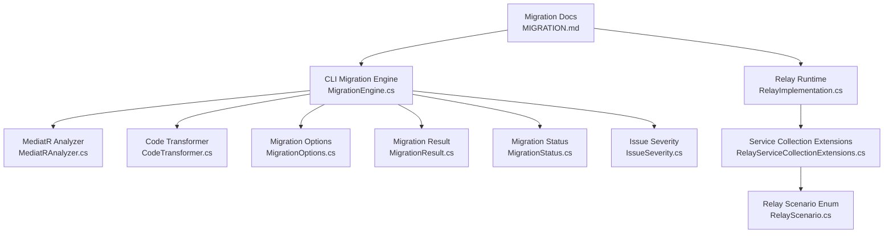
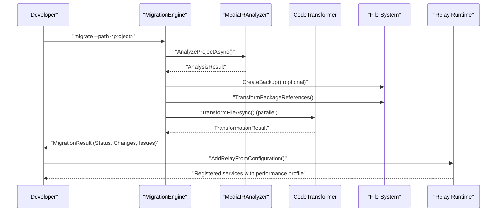
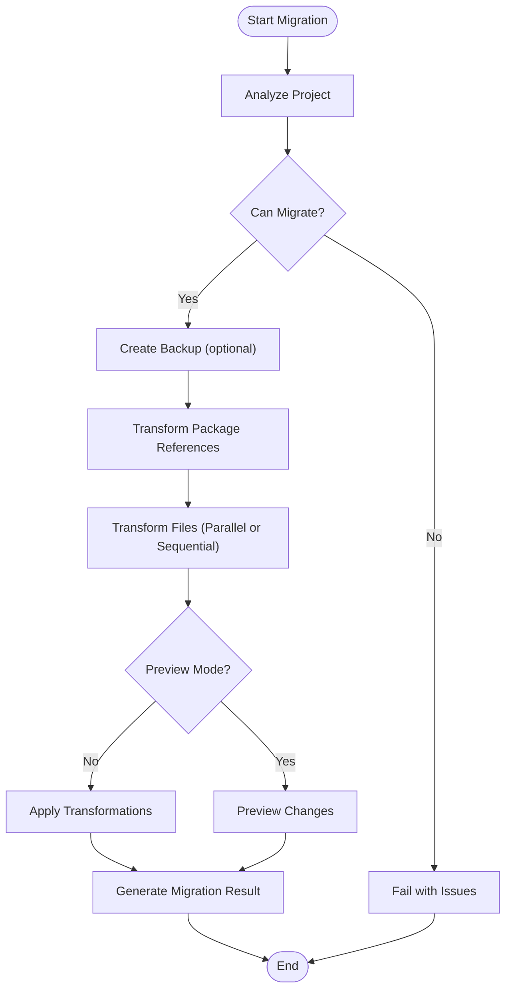
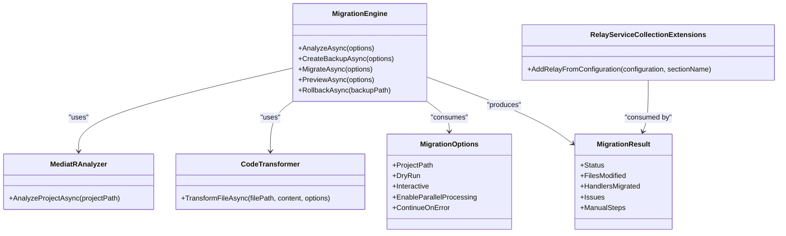

# Migration Guide

<cite>
**Referenced Files in This Document**
- [MIGRATION.md](file://docs/MessageBroker/MIGRATION.md)
- [TROUBLESHOOTING.md](file://docs/MessageBroker/TROUBLESHOOTING.md)
- [MigrationEngine.cs](file://tools/Relay.CLI/Migration/MigrationEngine.cs)
- [CodeTransformer.cs](file://tools/Relay.CLI/Migration/CodeTransformer.cs)
- [MediatRAnalyzer.cs](file://tools/Relay.CLI/Migration/MediatRAnalyzer.cs)
- [MigrationOptions.cs](file://tools/Relay.CLI/Migration/MigrationOptions.cs)
- [MigrationResult.cs](file://tools/Relay.CLI/Migration/MigrationResult.cs)
- [MigrationStatus.cs](file://tools/Relay.CLI/Migration/MigrationStatus.cs)
- [IssueSeverity.cs](file://tools/Relay.CLI/Migration/IssueSeverity.cs)
- [MigrateCommandBuilder.cs](file://tools/Relay.CLI/Commands/MigrateCommandBuilder.cs)
- [MigrateCommand.cs](file://tools/Relay.CLI/Commands/MigrateCommand.cs)
- [RelayServiceCollectionExtensions.cs](file://src/Relay/RelayServiceCollectionExtensions.cs)
- [RelayScenario.cs](file://src/Relay/RelayScenario.cs)
- [RelayImplementation.cs](file://src/Relay.Core/Implementation/Core/RelayImplementation.cs)
- [RelayHealthCheck.cs](file://src/Relay.Core/Observability/RelayHealthCheck.cs)
- [README.md](file://README.md)
- [BenchmarkRunner.cs](file://tests/Relay.Core.Tests/Performance/BenchmarkRunner.cs)
- [RelayTestFramework.cs](file://src/Relay.Core.Testing/Core/RelayTestFramework.cs)
- [IEventMigration.cs](file://src/Relay.Core.EventSourcing/EventSourcing/Versioning/IEventMigration.cs)
</cite>

## Table of Contents
1. [Introduction](#introduction)
2. [Project Structure](#project-structure)
3. [Core Components](#core-components)
4. [Architecture Overview](#architecture-overview)
5. [Detailed Component Analysis](#detailed-component-analysis)
6. [Dependency Analysis](#dependency-analysis)
7. [Performance Considerations](#performance-considerations)
8. [Troubleshooting Guide](#troubleshooting-guide)
9. [Conclusion](#conclusion)
10. [Appendices](#appendices)

## Introduction
This Migration Guide focuses on migrating from MediatR to the Relay framework, covering architectural differences, configuration changes, automated migration tools, and practical patterns. It also includes guidance for upgrading between major versions of Relay, performance implications, troubleshooting, and testing strategies to validate correctness after migration.

## Project Structure
The migration capability is primarily delivered through the Relay CLI’s migration subsystem, which analyzes projects, transforms code, manages backups, and reports progress. The core runtime and configuration extensions for Relay live under the Relay and Relay.Core namespaces.

**Diagram sources**
- [MigrationEngine.cs](file://tools/Relay.CLI/Migration/MigrationEngine.cs#L1-L120)
- [MediatRAnalyzer.cs](file://tools/Relay.CLI/Migration/MediatRAnalyzer.cs#L282-L320)
- [CodeTransformer.cs](file://tools/Relay.CLI/Migration/CodeTransformer.cs#L1-L120)
- [MigrationOptions.cs](file://tools/Relay.CLI/Migration/MigrationOptions.cs#L1-L93)
- [MigrationResult.cs](file://tools/Relay.CLI/Migration/MigrationResult.cs#L1-L68)
- [MigrationStatus.cs](file://tools/Relay.CLI/Migration/MigrationStatus.cs#L1-L42)
- [IssueSeverity.cs](file://tools/Relay.CLI/Migration/IssueSeverity.cs#L1-L27)
- [RelayImplementation.cs](file://src/Relay.Core/Implementation/Core/RelayImplementation.cs#L1-L60)
- [RelayServiceCollectionExtensions.cs](file://src/Relay/RelayServiceCollectionExtensions.cs#L122-L153)
- [RelayScenario.cs](file://src/Relay/RelayScenario.cs#L1-L33)
- [MIGRATION.md](file://docs/MessageBroker/MIGRATION.md#L1-L120)

**Section sources**
- [MIGRATION.md](file://docs/MessageBroker/MIGRATION.md#L1-L120)
- [MigrationEngine.cs](file://tools/Relay.CLI/Migration/MigrationEngine.cs#L1-L120)
- [RelayServiceCollectionExtensions.cs](file://src/Relay/RelayServiceCollectionExtensions.cs#L122-L153)

## Core Components
- CLI Migration Engine orchestrates analysis, backup creation, package transformation, and code transformation. It supports dry runs, previews, interactive confirmations, parallel processing, and progress reporting.
- MediatR Analyzer detects MediatR usage patterns (handlers, notifications, pipeline behaviors) and flags advanced patterns requiring attention.
- Code Transformer performs syntax-aware transformations for namespaces, handler signatures, DI registrations, and async method conversions.
- Migration Options define the migration behavior (parallelism, backup, preview, interactive mode).
- Migration Result aggregates outcomes, issues, and manual steps.
- Relay runtime and configuration extensions provide performance profiles and scenario-based service registration.

**Section sources**
- [MigrationEngine.cs](file://tools/Relay.CLI/Migration/MigrationEngine.cs#L1-L220)
- [MediatRAnalyzer.cs](file://tools/Relay.CLI/Migration/MediatRAnalyzer.cs#L282-L320)
- [CodeTransformer.cs](file://tools/Relay.CLI/Migration/CodeTransformer.cs#L1-L120)
- [MigrationOptions.cs](file://tools/Relay.CLI/Migration/MigrationOptions.cs#L1-L93)
- [MigrationResult.cs](file://tools/Relay.CLI/Migration/MigrationResult.cs#L1-L68)
- [RelayImplementation.cs](file://src/Relay.Core/Implementation/Core/RelayImplementation.cs#L1-L60)
- [RelayServiceCollectionExtensions.cs](file://src/Relay/RelayServiceCollectionExtensions.cs#L122-L153)

## Architecture Overview
The migration architecture separates concerns across CLI orchestration, analysis, transformation, and reporting. The runtime architecture emphasizes source-generated dispatchers and performance profiles.

**Diagram sources**
- [MigrationEngine.cs](file://tools/Relay.CLI/Migration/MigrationEngine.cs#L44-L220)
- [MediatRAnalyzer.cs](file://tools/Relay.CLI/Migration/MediatRAnalyzer.cs#L282-L320)
- [CodeTransformer.cs](file://tools/Relay.CLI/Migration/CodeTransformer.cs#L1-L120)
- [RelayServiceCollectionExtensions.cs](file://src/Relay/RelayServiceCollectionExtensions.cs#L122-L153)

## Detailed Component Analysis

### MediatR to Relay Migration Tooling
- Automated detection of MediatR usage and advanced patterns.
- Syntax-aware transformations for namespaces, handler signatures, DI registrations, and async conversions.
- Dry-run and preview modes to review changes before applying.
- Interactive mode to approve or skip individual file transformations.
- Parallel processing with batching and concurrency controls.
- Backup creation and rollback support.

**Diagram sources**
- [MigrationEngine.cs](file://tools/Relay.CLI/Migration/MigrationEngine.cs#L44-L220)
- [MigrationEngine.cs](file://tools/Relay.CLI/Migration/MigrationEngine.cs#L258-L395)
- [MigrationEngine.cs](file://tools/Relay.CLI/Migration/MigrationEngine.cs#L397-L497)
- [CodeTransformer.cs](file://tools/Relay.CLI/Migration/CodeTransformer.cs#L1-L120)

**Section sources**
- [MigrationEngine.cs](file://tools/Relay.CLI/Migration/MigrationEngine.cs#L44-L220)
- [MigrationEngine.cs](file://tools/Relay.CLI/Migration/MigrationEngine.cs#L258-L395)
- [MigrationEngine.cs](file://tools/Relay.CLI/Migration/MigrationEngine.cs#L397-L497)
- [CodeTransformer.cs](file://tools/Relay.CLI/Migration/CodeTransformer.cs#L1-L120)
- [MediatRAnalyzer.cs](file://tools/Relay.CLI/Migration/MediatRAnalyzer.cs#L282-L320)

### Practical Migration Patterns from MediatR to Relay
Common patterns include:
- Namespace and DI registration updates.
- Handler signature adjustments and async conversions.
- Mediator interface changes and Send/Publish method adjustments.
- Pipeline behavior and pre/post processors detection and guidance.

These patterns are validated by tests in the CLI test suite and are reflected in the analyzer and transformer logic.

**Section sources**
- [MigrateCommandBuilder.cs](file://tools/Relay.CLI/Commands/MigrateCommandBuilder.cs#L1-L60)
- [MigrateCommand.cs](file://tools/Relay.CLI/Commands/MigrateCommand.cs#L1-L14)
- [CodeTransformer.cs](file://tools/Relay.CLI/Migration/CodeTransformer.cs#L1-L120)
- [MediatRAnalyzer.cs](file://tools/Relay.CLI/Migration/MediatRAnalyzer.cs#L282-L320)

### Upgrade Paths Between Major Versions of Relay
- Use the CLI to analyze and preview changes before upgrading.
- Apply performance profile configuration and scenario-based service registration.
- Validate with performance benchmarks and testing framework.

**Section sources**
- [RelayServiceCollectionExtensions.cs](file://src/Relay/RelayServiceCollectionExtensions.cs#L122-L153)
- [RelayScenario.cs](file://src/Relay/RelayScenario.cs#L1-L33)
- [BenchmarkRunner.cs](file://tests/Relay.Core.Tests/Performance/BenchmarkRunner.cs#L1-L195)

### Configuration Differences: MediatR vs Relay
- MediatR relies on runtime reflection and DI registrations for handlers and pipeline behaviors.
- Relay leverages source generators for compile-time dispatchers and performance optimizations, plus scenario-based service registration and performance profiles.

**Section sources**
- [README.md](file://README.md#L1-L160)
- [RelayImplementation.cs](file://src/Relay.Core/Implementation/Core/RelayImplementation.cs#L1-L60)
- [RelayServiceCollectionExtensions.cs](file://src/Relay/RelayServiceCollectionExtensions.cs#L122-L153)

### Automated Refactoring and Compatibility Layers
- The CLI provides automated refactoring for namespace updates, handler signatures, and DI registrations.
- Compatibility layers include analyzer detection of advanced patterns and transformer logic to adapt common MediatR idioms.

**Section sources**
- [MediatRAnalyzer.cs](file://tools/Relay.CLI/Migration/MediatRAnalyzer.cs#L282-L320)
- [CodeTransformer.cs](file://tools/Relay.CLI/Migration/CodeTransformer.cs#L1-L120)

### Practical Examples: MediatR to Relay Migration
- Example transformations include updating using directives, changing AddMediatR to AddRelay, converting Task-returning handlers to ValueTask patterns, and adjusting Send/Publish invocations.
- These examples are covered in the CLI tests and demonstrate the scope of automated migration.

**Section sources**
- [MigrateCommandBuilder.cs](file://tools/Relay.CLI/Commands/MigrateCommandBuilder.cs#L1-L60)
- [MigrateCommand.cs](file://tools/Relay.CLI/Commands/MigrateCommand.cs#L1-L14)

## Dependency Analysis
The migration subsystem depends on:
- MediatRAnalyzer for detecting patterns.
- CodeTransformer for syntax-aware edits.
- MigrationOptions and MigrationResult for controlling behavior and reporting outcomes.
- Relay runtime extensions for post-migration configuration.

**Diagram sources**
- [MigrationEngine.cs](file://tools/Relay.CLI/Migration/MigrationEngine.cs#L1-L120)
- [MediatRAnalyzer.cs](file://tools/Relay.CLI/Migration/MediatRAnalyzer.cs#L282-L320)
- [CodeTransformer.cs](file://tools/Relay.CLI/Migration/CodeTransformer.cs#L1-L120)
- [MigrationOptions.cs](file://tools/Relay.CLI/Migration/MigrationOptions.cs#L1-L93)
- [MigrationResult.cs](file://tools/Relay.CLI/Migration/MigrationResult.cs#L1-L68)
- [RelayServiceCollectionExtensions.cs](file://src/Relay/RelayServiceCollectionExtensions.cs#L122-L153)

**Section sources**
- [MigrationEngine.cs](file://tools/Relay.CLI/Migration/MigrationEngine.cs#L1-L120)
- [MigrationOptions.cs](file://tools/Relay.CLI/Migration/MigrationOptions.cs#L1-L93)
- [MigrationResult.cs](file://tools/Relay.CLI/Migration/MigrationResult.cs#L1-L68)
- [RelayServiceCollectionExtensions.cs](file://src/Relay/RelayServiceCollectionExtensions.cs#L122-L153)

## Performance Considerations
- Relay introduces performance profiles and optimizations (source generators, ValueTask, SIMD batch processing, AOT support, handler caching, zero-allocation hot paths).
- After migration, apply the appropriate performance profile and validate with benchmarks.
- Use the testing framework to assert latency, throughput, and success rates.

**Section sources**
- [README.md](file://README.md#L1-L160)
- [BenchmarkRunner.cs](file://tests/Relay.Core.Tests/Performance/BenchmarkRunner.cs#L1-L195)
- [RelayTestFramework.cs](file://src/Relay.Core.Testing/Core/RelayTestFramework.cs#L1-L32)

## Troubleshooting Guide
Common migration and runtime issues include:
- Syntax errors during transformation.
- File I/O errors.
- Unexpected exceptions during parallel processing.
- Health check failures indicating misconfiguration.
- Performance regressions requiring profile tuning.

Resolution steps include reviewing migration issues, enabling verbose logging, adjusting performance profiles, and validating with health checks and metrics.

**Section sources**
- [MigrationEngine.cs](file://tools/Relay.CLI/Migration/MigrationEngine.cs#L576-L614)
- [MigrationEngine.cs](file://tools/Relay.CLI/Migration/MigrationEngine.cs#L725-L784)
- [TROUBLESHOOTING.md](file://docs/MessageBroker/TROUBLESHOOTING.md#L519-L562)
- [RelayHealthCheck.cs](file://src/Relay.Core/Observability/RelayHealthCheck.cs#L1-L35)

## Conclusion
Migrating from MediatR to Relay involves automated analysis and transformation, careful validation, and performance tuning. The CLI provides robust tooling for previewing, applying, and rolling back changes, while Relay’s runtime offers performance profiles and observability to ensure a smooth transition and optimal performance.

## Appendices

### Compatibility Matrix: Feature Parity Across Frameworks
- MediatR patterns: IRequest/IRequestHandler, INotification/INotificationHandler, IPipelineBehavior.
- Relay equivalents: Source-generated dispatchers, pipeline behaviors, and scenario-based configuration.
- Event schema evolution: IEventMigration interface supports migration between event versions.

**Section sources**
- [IEventMigration.cs](file://src/Relay.Core.EventSourcing/EventSourcing/Versioning/IEventMigration.cs#L1-L45)

### Testing Strategy for Validated Migration
- Use the Relay testing framework to create scenarios, load tests, and behavior verification.
- Validate performance with benchmarks and ensure health checks pass post-migration.

**Section sources**
- [RelayTestFramework.cs](file://src/Relay.Core.Testing/Core/RelayTestFramework.cs#L1-L32)
- [BenchmarkRunner.cs](file://tests/Relay.Core.Tests/Performance/BenchmarkRunner.cs#L1-L195)