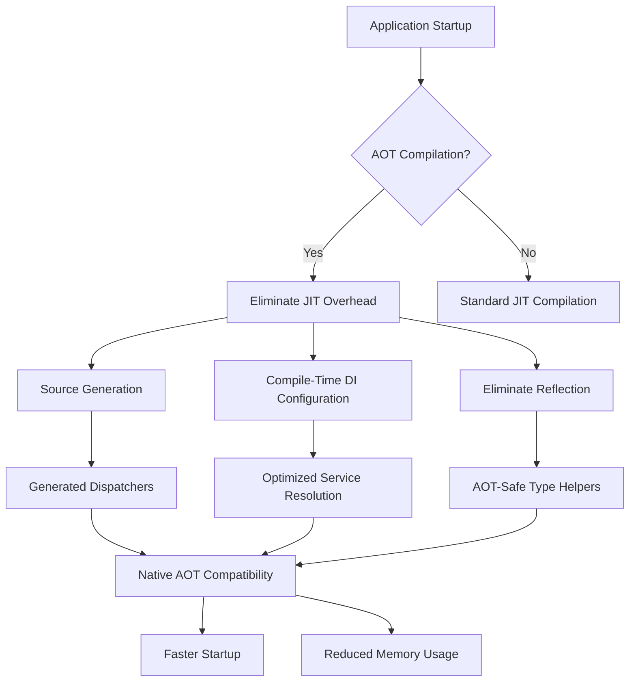
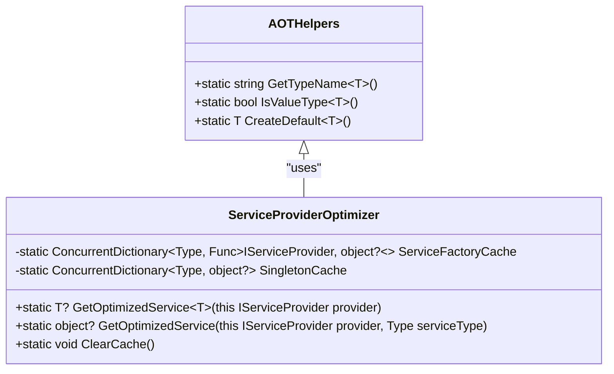
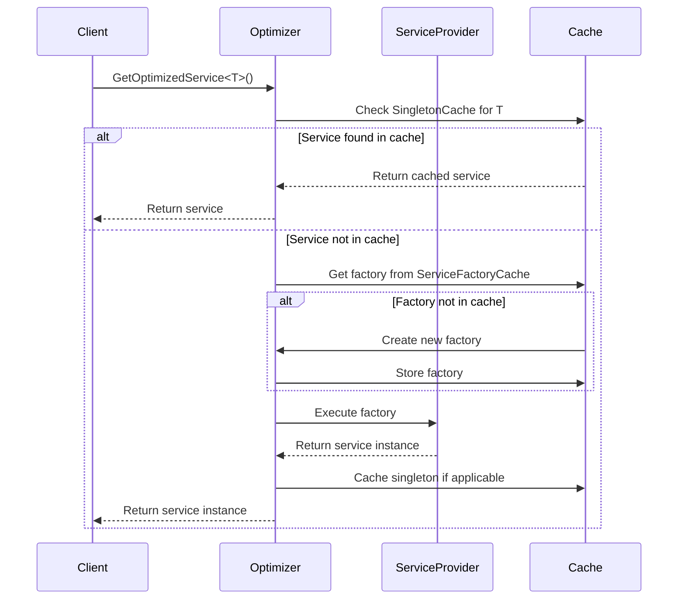
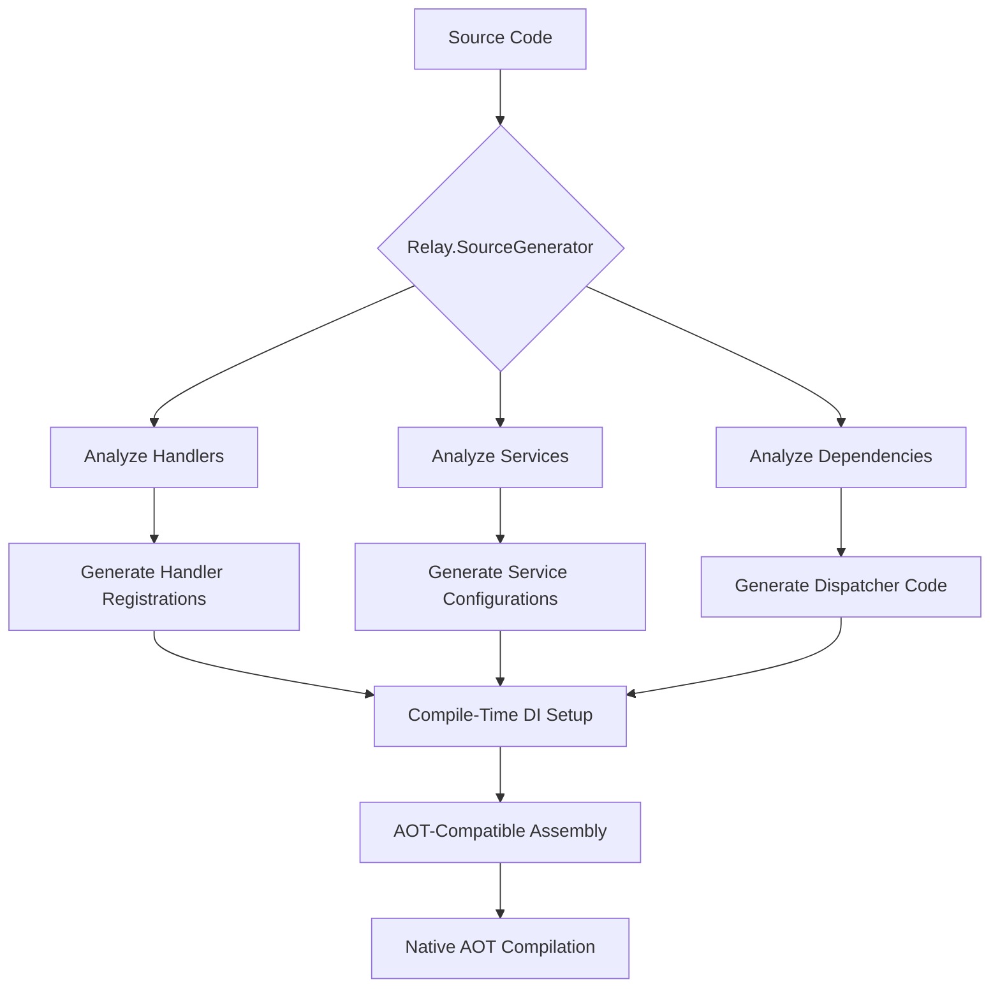
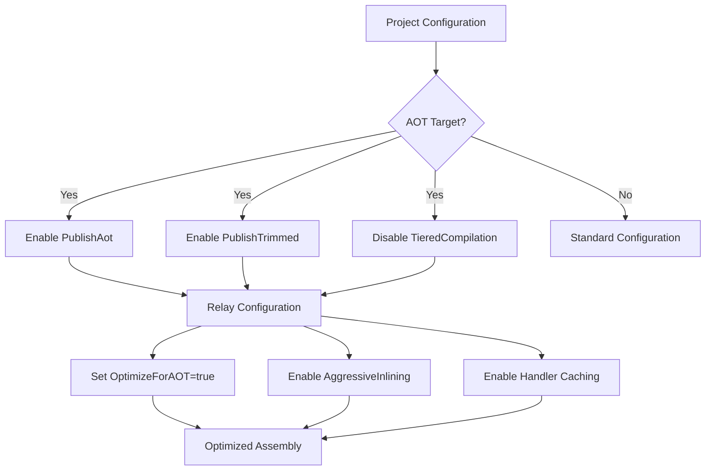
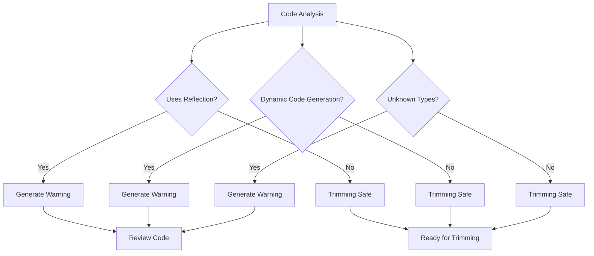
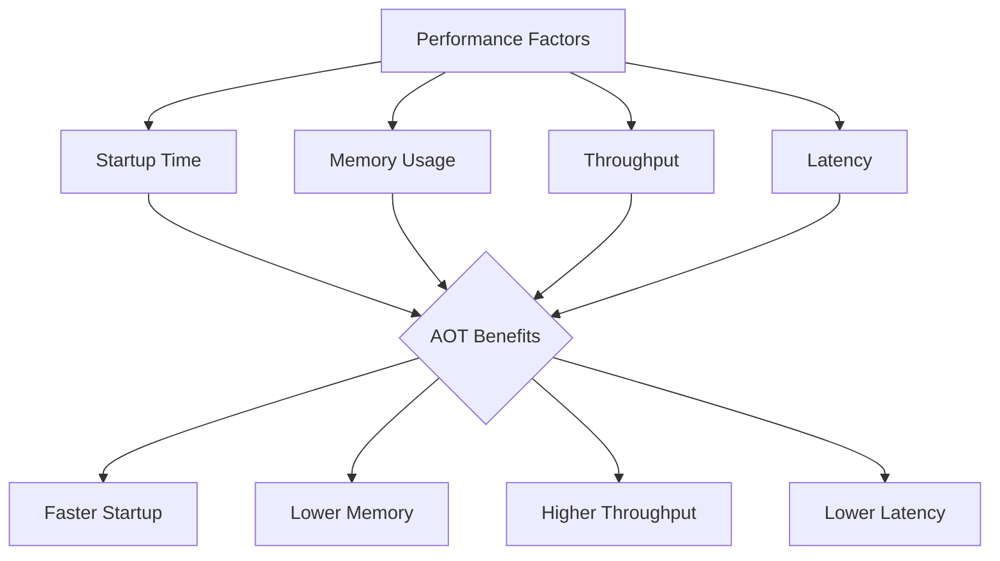
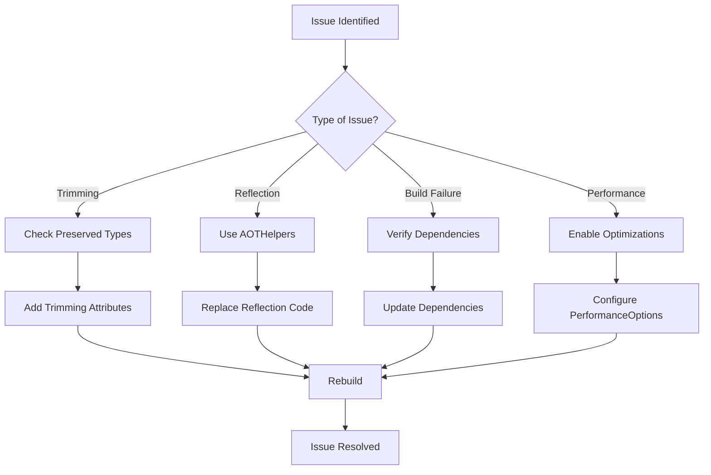

# AOT Compilation Support

<cite>
**Referenced Files in This Document**   
- [AOTHelpers.cs](file://src/Relay.Core/Performance/Optimization/AOTHelpers.cs)
- [ServiceProviderOptimizer.cs](file://src/Relay.Core/Performance/Optimization/ServiceProviderOptimizer.cs)
- [PerformanceOptions.cs](file://src/Relay.Core/Configuration/Options/Performance/PerformanceOptions.cs)
- [RelayImplementation.cs](file://src/Relay.Core/Implementation/Core/RelayImplementation.cs)
- [Relay.SourceGenerator.csproj](file://src/Relay.SourceGenerator/Relay.SourceGenerator.csproj)
- [MSBUILD-CONFIGURATION.md](file://src/Relay.SourceGenerator/MSBUILD-CONFIGURATION.md)
- [DoctorCommand.cs](file://tools/Relay.CLI/Commands/DoctorCommand.cs)
</cite>

## Table of Contents
1. [Introduction](#introduction)
2. [AOT Compilation Overview](#aot-compilation-overview)
3. [Core AOT Components](#core-aot-components)
4. [ServiceProviderOptimizer Implementation](#serviceprovideroptimizer-implementation)
5. [Source Generation and AOT Compatibility](#source-generation-and-aot-compatibility)
6. [Configuration for AOT Scenarios](#configuration-for-aot-scenarios)
7. [Trimming Compatibility and Reflection Warnings](#trimming-compatibility-and-reflection-warnings)
8. [Performance Considerations](#performance-considerations)
9. [Troubleshooting AOT Issues](#troubleshooting-aot-issues)
10. [Conclusion](#conclusion)

## Introduction
AOT (Ahead-of-Time) compilation support in Relay enables native compilation scenarios by eliminating JIT (Just-In-Time) compilation overhead and runtime reflection. This documentation explains how Relay achieves AOT compatibility through the AOTHelpers and ServiceProviderOptimizer components, source generation, and optimized dependency injection patterns. The framework is designed to work seamlessly with Native AOT scenarios, providing high-performance service resolution while avoiding dynamic code generation and reflection that can interfere with trimming and AOT compilation.

**Section sources**
- [AOTHelpers.cs](file://src/Relay.Core/Performance/Optimization/AOTHelpers.cs)
- [ServiceProviderOptimizer.cs](file://src/Relay.Core/Performance/Optimization/ServiceProviderOptimizer.cs)

## AOT Compilation Overview
Relay's AOT compilation support focuses on eliminating runtime reflection and dynamic code generation that can interfere with Native AOT compilation and trimming. The framework achieves this through several key strategies:

1. **Elimination of Runtime Reflection**: Relay avoids using reflection for service resolution and type inspection by leveraging source generation and compile-time optimizations.
2. **Native AOT Compatibility**: The framework is designed to work with Native AOT scenarios by avoiding features that are incompatible with ahead-of-time compilation.
3. **Zero-Allocation Patterns**: Relay implements zero-allocation fast paths to minimize garbage collection pressure and improve performance.
4. **Trimming Safety**: The codebase is designed to be trimming-safe, ensuring that necessary types and methods are preserved during the trimming process.

The AOT support is configurable through the `PerformanceOptions` class, which includes the `OptimizeForAOT` flag that enables AOT-specific optimizations across the framework.



**Diagram sources**
- [PerformanceOptions.cs](file://src/Relay.Core/Configuration/Options/Performance/PerformanceOptions.cs)

**Section sources**
- [PerformanceOptions.cs](file://src/Relay.Core/Configuration/Options/Performance/PerformanceOptions.cs)

## Core AOT Components
Relay's AOT support is built on two primary components: AOTHelpers and ServiceProviderOptimizer. These components work together to provide high-performance, AOT-safe service resolution and type operations.

### AOTHelpers
The AOTHelpers class provides a set of utility methods that perform common type operations in an AOT-safe manner. These methods are designed to avoid reflection and dynamic code generation, making them compatible with Native AOT compilation.

The key methods in AOTHelpers include:
- `GetTypeName<T>()`: Retrieves the name of a type without using reflection
- `IsValueType<T>()`: Determines if a type is a value type without reflection
- `CreateDefault<T>()`: Creates a default value for a type without using Activator.CreateInstance

These methods use generic type parameters and the `typeof` operator, which are resolved at compile time, making them fully compatible with AOT compilation.

### ServiceProviderOptimizer
The ServiceProviderOptimizer class provides optimized service resolution by caching service instances and factory delegates. This optimization reduces the overhead of service resolution, which is particularly beneficial in AOT scenarios where JIT compilation is not available.

The optimizer uses concurrent dictionaries to cache:
- Service factory delegates for faster service creation
- Singleton service instances for immediate retrieval

This caching strategy significantly reduces the performance overhead of dependency injection, especially for frequently accessed services.



**Diagram sources**
- [AOTHelpers.cs](file://src/Relay.Core/Performance/Optimization/AOTHelpers.cs)
- [ServiceProviderOptimizer.cs](file://src/Relay.Core/Performance/Optimization/ServiceProviderOptimizer.cs)

**Section sources**
- [AOTHelpers.cs](file://src/Relay.Core/Performance/Optimization/AOTHelpers.cs)
- [ServiceProviderOptimizer.cs](file://src/Relay.Core/Performance/Optimization/ServiceProviderOptimizer.cs)

## ServiceProviderOptimizer Implementation
The ServiceProviderOptimizer class implements a high-performance service resolution mechanism that is particularly beneficial for AOT compilation scenarios. The implementation uses several optimization techniques to minimize overhead and improve performance.

### Key Implementation Details
The optimizer uses two concurrent dictionaries to cache service resolution information:
- `ServiceFactoryCache`: Caches factory delegates for creating service instances
- `SingletonCache`: Caches singleton service instances for immediate retrieval

When resolving a service, the optimizer follows this process:
1. First checks the singleton cache for already-resolved singleton services
2. If not found in the singleton cache, uses the service factory cache to create the service
3. Caches singleton services after creation for subsequent requests

The `GetOptimizedService<T>` method is marked with `MethodImpl(MethodImplOptions.AggressiveInlining)` to encourage the JIT compiler to inline the method, reducing call overhead.

### Service Caching Strategy
The optimizer implements a smart caching strategy that balances performance with memory usage. For singleton services, the instances are cached permanently after the first resolution. For transient and scoped services, only the factory delegates are cached, allowing for efficient service creation without storing service instances.

The caching mechanism uses `ConcurrentDictionary` for thread safety, ensuring that the optimizer can be used in multi-threaded scenarios without additional synchronization.

### Heuristic for Singleton Detection
The optimizer includes a heuristic method `IsSingletonService` that attempts to identify singleton services based on naming conventions. Services with names ending in "Handler", "Service", or "Repository" are assumed to be singleton or scoped services and are eligible for caching.

```csharp
private static bool IsSingletonService(Type serviceType)
{
    return serviceType.Name.EndsWith("Handler") ||
           serviceType.Name.EndsWith("Service") ||
           serviceType.Name.EndsWith("Repository");
}
```

This heuristic allows the optimizer to cache services that are likely to be singletons, improving performance without requiring explicit configuration.



**Diagram sources**
- [ServiceProviderOptimizer.cs](file://src/Relay.Core/Performance/Optimization/ServiceProviderOptimizer.cs)

**Section sources**
- [ServiceProviderOptimizer.cs](file://src/Relay.Core/Performance/Optimization/ServiceProviderOptimizer.cs)

## Source Generation and AOT Compatibility
Relay's source generation capabilities are a key component of its AOT compatibility. The Relay.SourceGenerator package generates compile-time code that eliminates the need for runtime reflection and dynamic code generation.

### Compile-Time Code Generation
The source generator analyzes the codebase at compile time and generates:
- Handler registration code for dependency injection
- Optimized dispatcher implementations
- Service configuration code

This approach eliminates the need for runtime type discovery and reflection-based service resolution, making the framework fully compatible with Native AOT compilation.

### Generated Code Structure
The source generator produces code that follows these patterns:
- Extension methods for IServiceCollection to register handlers
- Concrete dispatcher implementations that inherit from base dispatcher classes
- Pre-configured service resolution paths that avoid reflection

The generated code is designed to be trimming-safe and AOT-compatible, using only features that are supported in ahead-of-time compilation scenarios.

### Integration with Build Process
The source generator is integrated into the build process through MSBuild targets. When the Relay.SourceGenerator package is referenced, the generator automatically runs during compilation, analyzing the codebase and generating the necessary code.

The generator is configured through MSBuild properties that allow fine-tuning of the generated code, including options to:
- Enable or disable specific generator features
- Configure nullable reference types
- Include or exclude documentation
- Enable aggressive inlining



**Diagram sources**
- [Relay.SourceGenerator.csproj](file://src/Relay.SourceGenerator/Relay.SourceGenerator.csproj)

**Section sources**
- [Relay.SourceGenerator.csproj](file://src/Relay.SourceGenerator/Relay.SourceGenerator.csproj)

## Configuration for AOT Scenarios
Configuring Relay for AOT compilation requires specific settings to ensure optimal performance and compatibility. The framework provides several configuration options through the PerformanceOptions class and MSBuild properties.

### PerformanceOptions Configuration
The `PerformanceOptions` class includes the `OptimizeForAOT` property that enables AOT-specific optimizations:

```csharp
public class PerformanceOptions
{
    /// <summary>
    /// Gets or sets whether to optimize for AOT compilation scenarios
    /// AOT (Ahead-of-Time) compilation avoids JIT overhead and enables faster startup
    /// </summary>
    public bool OptimizeForAOT { get; set; } = false;
}
```

When `OptimizeForAOT` is set to true, the framework enables optimizations that are specifically designed for AOT scenarios, including:
- Aggressive inlining
- Handler caching
- Zero-allocation fast paths
- Frozen collections for better read performance

### MSBuild Configuration
For Native AOT compilation, specific MSBuild properties should be configured:

```xml
<PropertyGroup>
  <PublishAot>true</PublishAot>
  <PublishTrimmed>true</PublishTrimmed>
  <TieredCompilation>false</TieredCompilation>
  <Optimize>true</Optimize>
</PropertyGroup>
```

These properties enable:
- AOT compilation through the .NET Native AOT compiler
- Trimming to reduce application size
- Code optimization for better performance
- Disabling tiered compilation, which is unnecessary for AOT

### Relay-Specific MSBuild Properties
The Relay source generator supports additional MSBuild properties for fine-tuning AOT compatibility:

```xml
<PropertyGroup>
  <RelayUseAggressiveInlining>true</RelayUseAggressiveInlining>
  <RelayEnableOptimizedDispatcher>true</RelayEnableOptimizedDispatcher>
  <RelayIncludeDebugInfo>false</RelayIncludeDebugInfo>
</PropertyGroup>
```

These properties control:
- Aggressive inlining of generated code
- Generation of optimized dispatcher implementations
- Inclusion of debug information in generated code



**Diagram sources**
- [PerformanceOptions.cs](file://src/Relay.Core/Configuration/Options/Performance/PerformanceOptions.cs)
- [MSBUILD-CONFIGURATION.md](file://src/Relay.SourceGenerator/MSBUILD-CONFIGURATION.md)

**Section sources**
- [PerformanceOptions.cs](file://src/Relay.Core/Configuration/Options/Performance/PerformanceOptions.cs)
- [MSBUILD-CONFIGURATION.md](file://src/Relay.SourceGenerator/MSBUILD-CONFIGURATION.md)

## Trimming Compatibility and Reflection Warnings
Trimming compatibility is a critical aspect of AOT compilation, as the trimming process removes unused code to reduce application size. Relay is designed to be trimming-safe and minimize reflection warnings that can interfere with the trimming process.

### Trimming Safety
Relay avoids patterns that can cause issues with trimming:
- No dynamic assembly loading
- No reflection-based type discovery
- No dynamic method invocation
- No serialization of unknown types

The framework uses source generation to eliminate the need for runtime reflection, ensuring that all necessary types and methods are preserved during trimming.

### Reflection Warnings
The Relay source generator and AOT helpers are designed to avoid reflection warnings by:
- Using generic methods instead of reflection
- Leveraging compile-time code generation
- Avoiding dynamic type operations

When `OptimizeForAOT` is enabled, the framework uses AOT-safe patterns that do not trigger reflection warnings during the build process.

### Doctor Command for AOT Validation
The Relay CLI includes a Doctor command that can validate AOT and trimming configuration:

```csharp
// Check for trimming configuration
if (content.Contains("<PublishTrimmed>true</PublishTrimmed>"))
{
    check.AddSuccess("Trimming enabled");
}
```

This command helps identify potential issues with AOT and trimming configuration before deployment.



**Diagram sources**
- [DoctorCommand.cs](file://tools/Relay.CLI/Commands/DoctorCommand.cs)

**Section sources**
- [DoctorCommand.cs](file://tools/Relay.CLI/Commands/DoctorCommand.cs)

## Performance Considerations
AOT compilation with Relay provides several performance benefits, but also requires careful consideration of certain factors to achieve optimal results.

### Startup Performance
AOT compilation eliminates JIT compilation overhead, resulting in faster application startup. Relay's source generation and optimized service resolution further improve startup performance by:
- Eliminating runtime type discovery
- Pre-configuring dependency injection
- Caching frequently accessed services

### Memory Usage
AOT-compiled applications typically have lower memory usage due to:
- Elimination of JIT compiler data structures
- Reduced metadata requirements
- More efficient code generation

Relay's zero-allocation patterns and frozen collections further reduce memory pressure and garbage collection frequency.

### Throughput and Latency
The ServiceProviderOptimizer and other AOT optimizations improve throughput and reduce latency by:
- Reducing service resolution overhead
- Minimizing allocation and garbage collection
- Enabling aggressive inlining of critical paths

For high-throughput scenarios, the `HighThroughput` performance profile can be used to optimize for maximum throughput.

### Trade-offs
While AOT compilation provides significant benefits, there are some trade-offs to consider:
- Larger application size due to ahead-of-time compilation
- Longer build times due to AOT compilation process
- Limited dynamic loading capabilities
- Increased complexity in debugging

These trade-offs should be evaluated based on the specific requirements of the application.



**Section sources**
- [RelayImplementation.cs](file://src/Relay.Core/Implementation/Core/RelayImplementation.cs)

## Troubleshooting AOT Issues
When working with AOT compilation in Relay, several common issues may arise. This section provides guidance on identifying and resolving these issues.

### Common AOT Issues
1. **Missing Types After Trimming**: Ensure that all necessary types are preserved by using appropriate trimming attributes or linker descriptors.
2. **Reflection Warnings**: Review code for reflection usage and replace with AOT-safe alternatives.
3. **Build Failures**: Verify that all dependencies are AOT-compatible and that the correct .NET SDK version is used.
4. **Performance Degradation**: Check that AOT-specific optimizations are enabled and properly configured.

### Diagnostic Tools
The Relay CLI Doctor command can help identify AOT configuration issues:

```bash
relay doctor
```

This command checks for:
- AOT compilation settings
- Trimming configuration
- Optimization settings
- Release configuration

### Resolution Strategies
For reflection-related issues, consider:
- Using the AOTHelpers class for type operations
- Leveraging source generation instead of runtime reflection
- Using generic methods instead of reflection-based type inspection

For trimming issues, ensure that:
- All necessary types are preserved
- Dynamic loading patterns are avoided
- Serialization configurations are trimming-safe



**Section sources**
- [DoctorCommand.cs](file://tools/Relay.CLI/Commands/DoctorCommand.cs)

## Conclusion
Relay's AOT compilation support provides a comprehensive solution for native compilation scenarios, eliminating JIT overhead and runtime reflection through the AOTHelpers and ServiceProviderOptimizer components. The framework leverages source generation to create compile-time optimized code that is fully compatible with Native AOT compilation and trimming.

Key benefits of Relay's AOT support include:
- Faster application startup due to eliminated JIT compilation
- Reduced memory usage through optimized service resolution
- Improved throughput and lower latency with caching and inlining
- Trimming safety and minimal reflection warnings

By configuring the `OptimizeForAOT` option and using the Relay source generator, developers can create high-performance applications that are optimized for AOT compilation while maintaining the flexibility and ease of use that Relay provides. The combination of compile-time code generation, optimized dependency injection, and AOT-safe patterns makes Relay an excellent choice for applications targeting Native AOT scenarios.