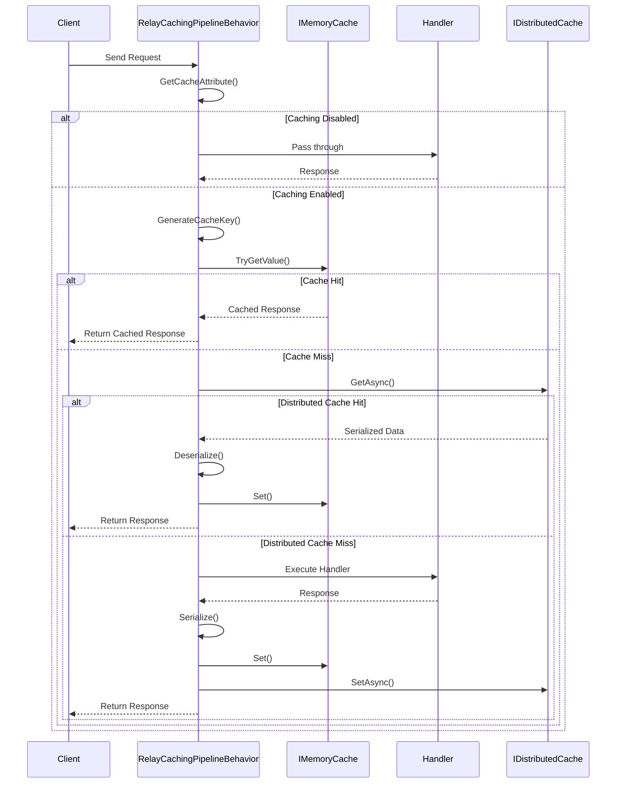
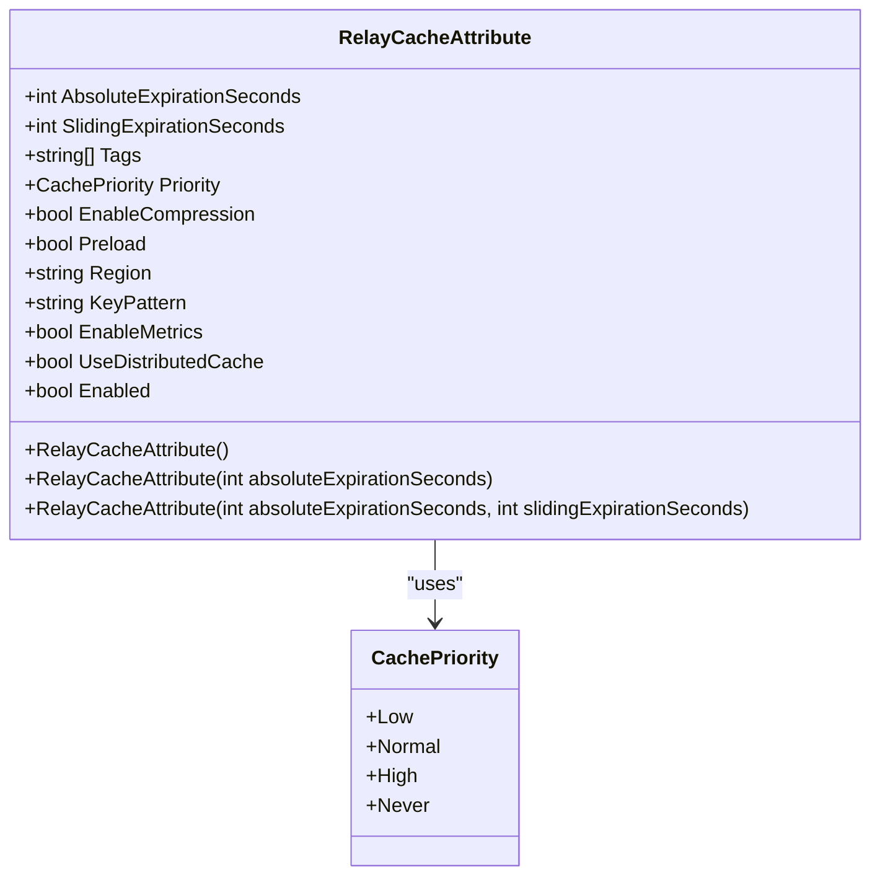
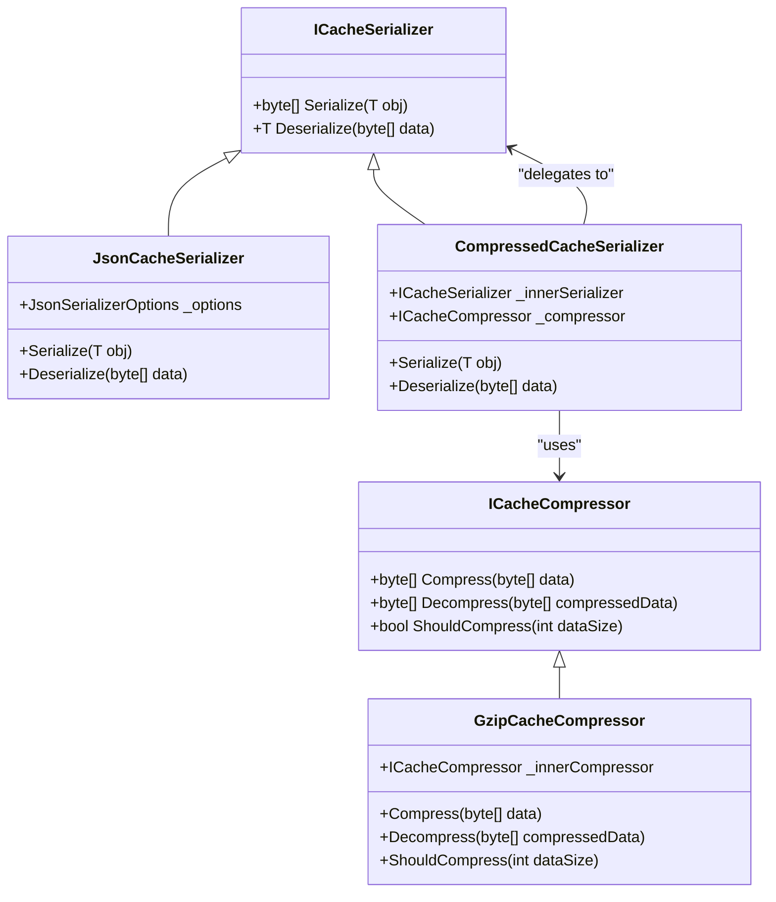
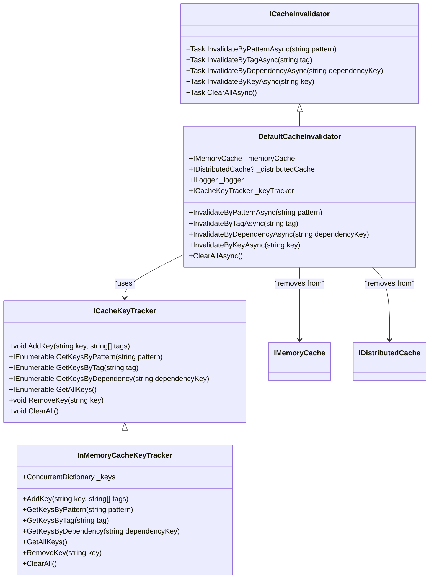
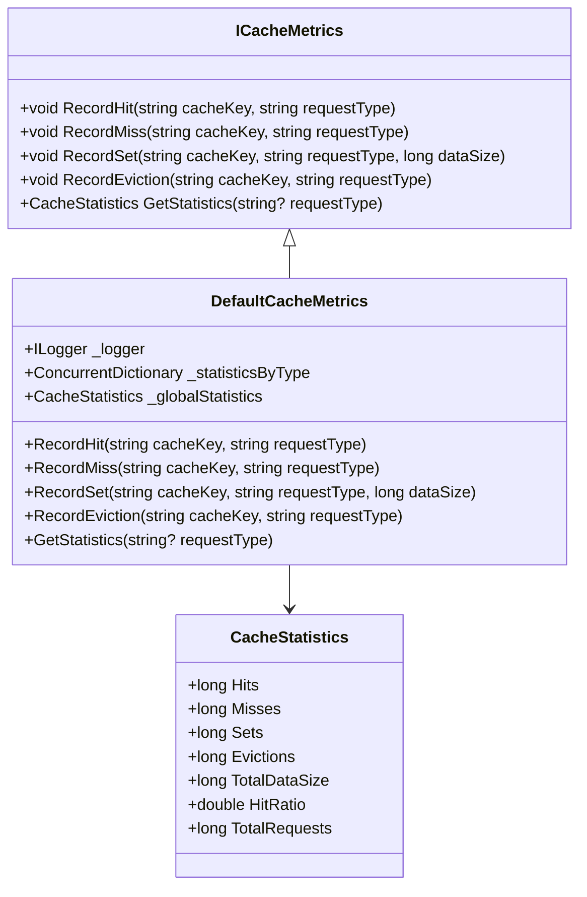
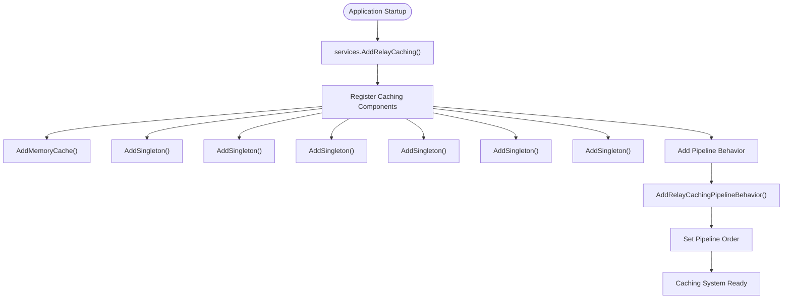

# Handler Caching

<cite>
**Referenced Files in This Document**   
- [RelayCachingPipelineBehavior.cs](file://src/Relay.Core/Caching/Behaviors/RelayCachingPipelineBehavior.cs)
- [RelayCacheAttribute.cs](file://src/Relay.Core/Caching/Attributes/RelayCacheAttribute.cs)
- [DefaultCacheKeyGenerator.cs](file://src/Relay.Core/Caching/KeyGeneration/DefaultCacheKeyGenerator.cs)
- [JsonCacheSerializer.cs](file://src/Relay.Core/Caching/Serialization/JsonCacheSerializer.cs)
- [CompressedCacheSerializer.cs](file://src/Relay.Core/Caching/Compression/CompressedCacheSerializer.cs)
- [DefaultCacheInvalidator.cs](file://src/Relay.Core/Caching/Invalidation/DefaultCacheInvalidator.cs)
- [DefaultCacheMetrics.cs](file://src/Relay.Core/Caching/Metrics/DefaultCacheMetrics.cs)
- [CachingOptions.cs](file://src/Relay.Core/Configuration/Options/Caching/CachingOptions.cs)
- [GetCachedProductsHandler.cs](file://samples/Relay.MinimalApiSample/Features/Examples/05-Caching/GetCachedProductsHandler.cs)
- [GetCachedProducts.cs](file://samples/Relay.MinimalApiSample/Features/Examples/05-Caching/GetCachedProducts.cs)
</cite>

## Table of Contents
1. [Introduction](#introduction)
2. [Caching Pipeline Behavior](#caching-pipeline-behavior)
3. [Cache Configuration with RelayCacheAttribute](#cache-configuration-with-relaycacheattribute)
4. [Cache Key Generation](#cache-key-generation)
5. [Serialization and Compression](#serialization-and-compression)
6. [Cache Invalidation and Tracking](#cache-invalidation-and-tracking)
7. [Performance Metrics and Monitoring](#performance-metrics-and-monitoring)
8. [Configuration and Setup](#configuration-and-setup)
9. [Common Issues and Best Practices](#common-issues-and-best-practices)
10. [Conclusion](#conclusion)

## Introduction

The Handler Caching mechanism in Relay provides a comprehensive solution for reducing handler instantiation costs by storing processed results for identical requests. This caching system operates as a pipeline behavior that intercepts requests before they reach the handler, checking if a cached response exists for the current request. If found, it returns the cached result without executing the handler logic, significantly improving performance for frequently accessed data.

The caching system is designed to be flexible and configurable, supporting both in-memory and distributed caching with various expiration policies, compression options, and invalidation strategies. It integrates seamlessly with the request processing pipeline through the `RelayCachingPipelineBehavior`, which handles the entire caching workflow from key generation to response retrieval and storage.

This document explains the implementation details of the caching mechanism, focusing on how it reduces handler instantiation costs and improves application performance. We'll explore the core components, configuration options, and best practices for implementing effective caching strategies in Relay applications.

**Section sources**
- [RelayCachingPipelineBehavior.cs](file://src/Relay.Core/Caching/Behaviors/RelayCachingPipelineBehavior.cs#L1-L235)
- [RelayCacheAttribute.cs](file://src/Relay.Core/Caching/Attributes/RelayCacheAttribute.cs#L1-L132)

## Caching Pipeline Behavior

The `RelayCachingPipelineBehavior` is the core component that implements the caching functionality in the request processing pipeline. As an `IPipelineBehavior`, it intercepts requests before they reach the handler and manages the entire caching workflow.



**Diagram sources**
- [RelayCachingPipelineBehavior.cs](file://src/Relay.Core/Caching/Behaviors/RelayCachingPipelineBehavior.cs#L54-L83)

The behavior follows a multi-layered approach to caching:

1. **Attribute Detection**: The behavior first checks if the request type has a `RelayCacheAttribute` applied. If no attribute is found or caching is disabled, the request proceeds through the pipeline without caching.

2. **Cache Key Generation**: For cacheable requests, a unique key is generated based on the request type, content, and configured key pattern.

3. **Cache Lookup**: The behavior first checks the in-memory cache for the generated key. If not found and distributed caching is enabled, it checks the distributed cache.

4. **Response Handling**: On cache hit, the cached response is returned immediately. On cache miss, the handler is executed, and the response is cached for future requests.

5. **Multi-level Caching**: The system supports both in-memory and distributed caching, with in-memory cache serving as a fast first layer and distributed cache providing persistence across application instances.

The behavior is designed to be resilient, with proper error handling for cache operations. If distributed cache operations fail, the system continues to function using in-memory caching, ensuring that application performance is not compromised by cache infrastructure issues.

**Section sources**
- [RelayCachingPipelineBehavior.cs](file://src/Relay.Core/Caching/Behaviors/RelayCachingPipelineBehavior.cs#L54-L83)
- [RelayCachingPipelineBehavior.cs](file://src/Relay.Core/Caching/Behaviors/RelayCachingPipelineBehavior.cs#L122-L154)

## Cache Configuration with RelayCacheAttribute

The `RelayCacheAttribute` provides comprehensive configuration options for caching behavior at the request level. This attribute is applied to request classes to define how their responses should be cached.



**Diagram sources**
- [RelayCacheAttribute.cs](file://src/Relay.Core/Caching/Attributes/RelayCacheAttribute.cs#L1-L132)

### Configuration Properties

The attribute exposes several key configuration properties:

- **Expiration Settings**: 
  - `AbsoluteExpirationSeconds`: Time in seconds before the cache entry expires
  - `SlidingExpirationSeconds`: Time in seconds of inactivity after which the cache entry expires

- **Cache Organization**:
  - `Region`: Logical grouping for cache entries
  - `Tags`: Array of tags for grouping and bulk invalidation
  - `KeyPattern`: Custom pattern for cache key generation

- **Performance and Reliability**:
  - `Priority`: Cache item priority (Low, Normal, High, Never)
  - `EnableCompression`: Whether to compress cached data
  - `UseDistributedCache`: Whether to use distributed caching

- **Monitoring and Control**:
  - `EnableMetrics`: Whether to collect performance metrics
  - `Enabled`: Whether caching is enabled for this request

### Usage Examples

```csharp
// Simple caching with 10-minute expiration
[RelayCache(600)]
public record GetProductRequest : IRequest<Product>;

// Advanced caching with sliding expiration and tags
[RelayCache(1800, 900)] // 30m absolute, 15m sliding
[CacheDependency("products")] // Invalidates when products change
public record GetProductListRequest : IRequest<List<Product>>
{
    public string Category { get; init; }
}

// Distributed caching with custom region and compression disabled
[RelayCache(300)]
{
    public string Region { get; set; } = "user-profiles";
    public bool EnableCompression { get; set; } = false;
    public bool UseDistributedCache { get; set; } = true;
}
```

The attribute supports multiple constructors for different use cases, from simple duration-based caching to complex configurations with both absolute and sliding expiration policies. This flexibility allows developers to tailor caching behavior to specific performance requirements and data volatility characteristics.

**Section sources**
- [RelayCacheAttribute.cs](file://src/Relay.Core/Caching/Attributes/RelayCacheAttribute.cs#L1-L132)
- [RelayCachingPipelineBehavior.cs](file://src/Relay.Core/Caching/Behaviors/RelayCachingPipelineBehavior.cs#L85-L88)

## Cache Key Generation

Cache key generation is a critical component of the caching system, ensuring that identical requests receive the same cache key while different requests receive unique keys. The system uses a flexible key generation strategy that can be customized through the `ICacheKeyGenerator` interface.

```mermaid
flowchart TD
Start([Request Received]) --> GetAttribute["Get RelayCacheAttribute"]
GetAttribute --> CheckPattern["Check KeyPattern for {RequestHash}"]
CheckPattern --> |Contains {RequestHash}| GenerateHash["Generate Request Hash"]
CheckPattern --> |No {RequestHash}| UseCustomGenerator["Use ICacheKeyGenerator"]
GenerateHash --> Serialize["Serialize Request to JSON"]
Serialize --> Hash["Compute SHA256 Hash"]
Hash --> Truncate["Truncate to 8 Characters"]
Truncate --> Replace["Replace {RequestHash} in KeyPattern"]
Replace --> FinalKey["Final Cache Key"]
UseCustomGenerator --> CustomKey["Generate Key via ICacheKeyGenerator"]
CustomKey --> FinalKey
FinalKey --> Output["Use Key for Cache Operations"]
```

**Diagram sources**
- [RelayCachingPipelineBehavior.cs](file://src/Relay.Core/Caching/Behaviors/RelayCachingPipelineBehavior.cs#L90-L112)
- [DefaultCacheKeyGenerator.cs](file://src/Relay.Core/Caching/KeyGeneration/DefaultCacheKeyGenerator.cs#L12-L23)

### Default Key Generation Strategy

The `DefaultCacheKeyGenerator` implements the default key generation logic:

1. **Request Serialization**: The request object is serialized to JSON using `System.Text.Json.JsonSerializer`
2. **Hash Computation**: A SHA256 hash is computed from the serialized JSON
3. **Key Construction**: The hash is truncated to 8 characters and combined with the request type name and region according to the key pattern

The default key pattern is `{RequestType}:{RequestHash}`, which creates keys like `GetProductRequest:abc123def`. This approach ensures that requests with identical content produce the same key, regardless of property order or formatting differences.

### Custom Key Patterns

Developers can customize key generation using the `KeyPattern` property:

- `{RequestType}`: Replaced with the request class name
- `{RequestHash}`: Replaced with the SHA256 hash of the request content
- `{Region}`: Replaced with the configured cache region

For example, a key pattern of `products:{Region}:{RequestHash}` with region "electronics" would produce keys like `products:electronics:abc123def`.

### Key Generation Considerations

The system handles several important scenarios:

- **Null and Empty Values**: Properly serialized and included in the hash
- **Special Characters**: Handled correctly in JSON serialization
- **Unicode Support**: Full Unicode character support
- **Large Objects**: Efficient handling of large request objects
- **Property Order Independence**: The same request with properties in different orders produces the same hash

This robust key generation system ensures consistent caching behavior across different request variations while maintaining high performance through efficient hashing algorithms.

**Section sources**
- [DefaultCacheKeyGenerator.cs](file://src/Relay.Core/Caching/KeyGeneration/DefaultCacheKeyGenerator.cs#L12-L32)
- [RelayCachingPipelineBehavior.cs](file://src/Relay.Core/Caching/Behaviors/RelayCachingPipelineBehavior.cs#L90-L112)

## Serialization and Compression

The caching system employs a sophisticated serialization and compression strategy to optimize storage and retrieval performance. This multi-layered approach ensures efficient data handling while maintaining flexibility for different use cases.



**Diagram sources**
- [JsonCacheSerializer.cs](file://src/Relay.Core/Caching/Serialization/JsonCacheSerializer.cs#L1-L32)
- [CompressedCacheSerializer.cs](file://src/Relay.Core/Caching/Compression/CompressedCacheSerializer.cs#L1-L58)
- [GzipCacheCompressor.cs](file://src/Relay.Core/Caching/Compression/GzipCacheCompressor.cs#L1-L42)

### Serialization Pipeline

The serialization process follows a layered approach:

1. **JSON Serialization**: The `JsonCacheSerializer` converts objects to JSON format using `System.Text.Json`, with camelCase property naming and compact formatting by default.

2. **Compression Layer**: The `CompressedCacheSerializer` wraps the JSON serializer and applies compression when enabled and beneficial.

3. **Compression Decision**: The system uses a threshold-based approach, typically compressing data larger than 1KB to avoid overhead for small responses.

4. **Compression Format**: Compressed data includes a 4-byte header (magic number and original length) followed by the compressed payload, allowing seamless decompression.

### Configuration Options

Compression can be controlled at multiple levels:

- **Global Configuration**: Set in `CachingOptions` for all cached responses
- **Per-Request Configuration**: Controlled by the `EnableCompression` property in `RelayCacheAttribute`
- **Dynamic Threshold**: Configurable compression threshold based on data size

The system automatically detects compressed data through the magic number header, ensuring transparent handling of both compressed and uncompressed cache entries.

### Performance Considerations

The serialization and compression strategy balances several factors:

- **CPU vs. Memory Trade-off**: Compression reduces memory usage but increases CPU utilization
- **Network Transfer**: Smaller payloads improve distributed cache performance
- **Deserialization Overhead**: The system minimizes deserialization costs through efficient JSON parsing
- **Memory Allocation**: Buffer reuse and pooling reduce garbage collection pressure

This comprehensive approach ensures optimal performance across different scenarios, from small, frequently accessed responses to large, infrequently accessed data sets.

**Section sources**
- [JsonCacheSerializer.cs](file://src/Relay.Core/Caching/Serialization/JsonCacheSerializer.cs#L1-L32)
- [CompressedCacheSerializer.cs](file://src/Relay.Core/Caching/Compression/CompressedCacheSerializer.cs#L1-L58)
- [GzipCacheCompressor.cs](file://src/Relay.Core/Caching/Compression/GzipCacheCompressor.cs#L1-L42)

## Cache Invalidation and Tracking

Effective cache invalidation is crucial for maintaining data consistency and preventing stale content. The Relay caching system provides a comprehensive invalidation framework with multiple strategies for removing outdated cache entries.



**Diagram sources**
- [DefaultCacheInvalidator.cs](file://src/Relay.Core/Caching/Invalidation/DefaultCacheInvalidator.cs#L1-L124)
- [ICacheKeyTracker.cs](file://src/Relay.Core/Caching/Invalidation/ICacheKeyTracker.cs)

### Invalidation Strategies

The system supports multiple invalidation approaches:

1. **Pattern-based Invalidation**: Removes all cache entries matching a wildcard pattern
2. **Tag-based Invalidation**: Removes all entries associated with a specific tag
3. **Dependency-based Invalidation**: Removes entries dependent on a specific key
4. **Key-based Invalidation**: Removes a specific cache entry
5. **Bulk Clearing**: Removes all cache entries

### Key Tracking Mechanism

The `ICacheKeyTracker` interface maintains a registry of all active cache keys and their metadata:

- **Key Registration**: Each cached response is registered with its key and associated tags
- **Metadata Storage**: Tracks tags, dependencies, and other metadata for each key
- **Query Interface**: Provides methods to find keys by pattern, tag, or dependency
- **Automatic Cleanup**: Removes tracking information when keys are invalidated

### Implementation Example

```csharp
// Register cache dependencies
[CacheDependency("products")]
[CacheDependency("categories")]
public record GetProductDetailsRequest : IRequest<ProductDetails>
{
    public Guid ProductId { get; init; }
}

// Invalidate all product-related caches
await cacheInvalidator.InvalidateByTagAsync("products");

// Invalidate by pattern (e.g., all product caches)
await cacheInvalidator.InvalidateByPatternAsync("GetProduct*");

// Clear all caches (emergency scenario)
await cacheInvalidator.ClearAllAsync();
```

The invalidation system is designed to be resilient, with proper error handling for distributed cache operations and comprehensive logging to track invalidation activities. This ensures that cache consistency can be maintained even in complex distributed environments.

**Section sources**
- [DefaultCacheInvalidator.cs](file://src/Relay.Core/Caching/Invalidation/DefaultCacheInvalidator.cs#L1-L124)
- [ICacheKeyTracker.cs](file://src/Relay.Core/Caching/Invalidation/ICacheKeyTracker.cs)

## Performance Metrics and Monitoring

The caching system includes comprehensive performance metrics and monitoring capabilities to help developers optimize cache usage and identify potential issues.



**Diagram sources**
- [DefaultCacheMetrics.cs](file://src/Relay.Core/Caching/Metrics/DefaultCacheMetrics.cs#L1-L74)

### Metrics Collection

The system tracks several key performance indicators:

- **Hit/Miss Ratio**: Measures cache effectiveness
- **Request Volume**: Tracks total cache operations
- **Data Size**: Monitors memory usage by cached responses
- **Eviction Rate**: Indicates memory pressure and cache turnover

### Statistics Structure

The `CacheStatistics` class provides detailed metrics:

- **Hits**: Number of successful cache retrievals
- **Misses**: Number of cache misses requiring handler execution
- **Sets**: Number of cache entries created
- **Evictions**: Number of entries removed due to expiration or memory pressure
- **TotalDataSize**: Cumulative size of cached data in bytes
- **HitRatio**: Calculated as Hits / (Hits + Misses)

### Monitoring Integration

Metrics are integrated with the application's logging system:

- **Debug Logging**: Detailed information about cache operations
- **Information Logging**: Summary of bulk invalidation and clearing operations
- **Warning Logging**: Issues with distributed cache operations
- **Configurable Output**: Metrics can be directed to various monitoring systems

### Usage Example

```csharp
// Get global cache statistics
var globalStats = cacheMetrics.GetStatistics();
Console.WriteLine($"Overall hit ratio: {globalStats.HitRatio:P2}");

// Get statistics for specific request type
var productStats = cacheMetrics.GetStatistics("GetProductRequest");
Console.WriteLine($"Product cache size: {productStats.TotalDataSize} bytes");

// Monitor cache performance
if (globalStats.HitRatio < 0.7)
{
    logger.LogWarning("Cache hit ratio is below threshold: {HitRatio:P2}", globalStats.HitRatio);
}
```

These metrics enable developers to make data-driven decisions about cache configuration, identify underperforming caches, and optimize memory usage across the application.

**Section sources**
- [DefaultCacheMetrics.cs](file://src/Relay.Core/Caching/Metrics/DefaultCacheMetrics.cs#L1-L74)
- [RelayCachingPipelineBehavior.cs](file://src/Relay.Core/Caching/Behaviors/RelayCachingPipelineBehavior.cs#L69-L70)

## Configuration and Setup

Setting up the caching system in a Relay application involves several configuration steps to ensure proper integration with the request processing pipeline.



**Diagram sources**
- [RelayConfigurationExtensions.cs](file://src/Relay.Core/Configuration/Core/RelayConfigurationExtensions.cs#L162-L180)
- [CachingOptions.cs](file://src/Relay.Core/Configuration/Options/Caching/CachingOptions.cs#L1-L48)

### Service Registration

The `AddRelayCaching` extension method configures all necessary components:

```csharp
// In Program.cs or Startup.cs
services.AddRelayCaching();
```

This single method call registers:

- Memory cache provider
- Default implementations of all caching interfaces
- The caching pipeline behavior
- Required dependencies

### Configuration Options

The `CachingOptions` class provides global configuration settings:

```csharp
services.Configure<CachingOptions>(options =>
{
    options.EnableAutomaticCaching = false;
    options.DefaultCacheDurationSeconds = 300;
    options.UseSlidingExpiration = true;
    options.SlidingExpirationSeconds = 60;
    options.SizeLimitMegabytes = 100;
    options.CacheKeyPrefix = "RelayCache";
    options.EnableDistributedCaching = true;
    options.DefaultOrder = -500;
});
```

### Sample Implementation

```csharp
// Request with caching enabled
[RelayCache(300)] // 5-minute cache
public record GetCachedProductsRequest : IRequest<List<CachedProduct>>;

// Handler implementation
public class GetCachedProductsHandler : IRequestHandler<GetCachedProductsRequest, List<CachedProduct>>
{
    private readonly ILogger<GetCachedProductsHandler> _logger;

    public GetCachedProductsHandler(ILogger<GetCachedProductsHandler> logger)
    {
        _logger = logger;
    }

    public async ValueTask<List<CachedProduct>> HandleAsync(
        GetCachedProductsRequest request,
        CancellationToken cancellationToken = default)
    {
        _logger.LogInformation("Fetching products from database (slow operation)...");
        
        // Simulate slow database call
        await Task.Delay(1000, cancellationToken);

        var products = new List<CachedProduct>
        {
            new(Guid.NewGuid(), "Laptop", 1299.99m, DateTime.UtcNow),
            new(Guid.NewGuid(), "Mouse", 29.99m, DateTime.UtcNow),
            new(Guid.NewGuid(), "Keyboard", 89.99m, DateTime.UtcNow)
        };

        _logger.LogInformation("Products fetched: {Count} items", products.Count);

        return products;
    }
}
```

This configuration ensures that subsequent requests for the same data within 5 minutes return the cached response without executing the handler logic, significantly improving performance.

**Section sources**
- [RelayConfigurationExtensions.cs](file://src/Relay.Core/Configuration/Core/RelayConfigurationExtensions.cs#L162-L180)
- [CachingOptions.cs](file://src/Relay.Core/Configuration/Options/Caching/CachingOptions.cs#L1-L48)
- [GetCachedProductsHandler.cs](file://samples/Relay.MinimalApiSample/Features/Examples/05-Caching/GetCachedProductsHandler.cs#L1-L35)

## Common Issues and Best Practices

Implementing effective caching requires awareness of common issues and adherence to best practices to ensure optimal performance and data consistency.

### Common Issues

**Cache Stampede**: When multiple requests simultaneously miss the cache and trigger expensive handler execution.

*Solution*: Implement staggered expiration or use a locking mechanism to ensure only one request populates the cache.

**Memory Consumption**: Unbounded cache growth can lead to memory pressure.

*Solution*: Use appropriate cache size limits, eviction policies, and monitor memory usage with the provided metrics.

**Stale Data**: Cached responses may become outdated before expiration.

*Solution*: Use appropriate expiration times, implement dependency-based invalidation, and consider cache-aside patterns for critical data.

**Serialization Issues**: Complex objects may not serialize correctly.

*Solution*: Ensure all cached types are serializable and test edge cases with null values, special characters, and large objects.

### Best Practices

**1. Selective Caching**: Apply caching only to expensive operations with high read frequency.

```csharp
// Good: Cache expensive database queries
[RelayCache(300)]
public record GetProductReportRequest : IRequest<ProductReport>;

// Avoid: Cache fast operations
[RelayCache(300)] // Unnecessary
public record GetCurrentUserRequest : IRequest<User>;
```

**2. Appropriate Expiration**: Set expiration times based on data volatility.

```csharp
// Frequently changing data: short expiration
[RelayCache(60)] // 1 minute
public record GetStockPricesRequest : IRequest<StockPrices>;

// Infrequently changing data: longer expiration
[RelayCache(3600)] // 1 hour
public record GetStaticContentRequest : IRequest<StaticContent>;
```

**3. Effective Key Patterns**: Use meaningful key patterns for easier management.

```csharp
// Good: Descriptive pattern with region
[RelayCache(300)]
{
    public string KeyPattern { get; set; } = "user:{Region}:{RequestHash}";
    public string Region { get; set; } = "profile";
}

// Avoid: Generic patterns
[RelayCache(300)]
public record GenericRequest : IRequest<Response>
{
    public string KeyPattern { get; set; } = "{RequestHash}";
}
```

**4. Monitoring and Alerting**: Regularly monitor cache performance metrics.

```csharp
// Check hit ratio and alert if below threshold
var stats = cacheMetrics.GetStatistics();
if (stats.HitRatio < 0.7)
{
    logger.LogWarning("Cache hit ratio low: {HitRatio:P2}", stats.HitRatio);
}
```

**5. Testing**: Thoroughly test caching behavior in different scenarios.

```csharp
// Test cache hit/miss behavior
[Fact]
public async Task GetProduct_CacheHit_ReturnsCachedResponse()
{
    // Arrange
    var request = new GetProductRequest { Id = Guid.NewGuid() };
    var behavior = CreateCachingBehavior();
    
    // First call - cache miss
    await behavior.HandleAsync(request, next, CancellationToken.None);
    
    // Second call - cache hit
    var result = await behavior.HandleAsync(request, next, CancellationToken.None);
    
    // Assert
    Assert.Equal(expected, result);
    metricsMock.Verify(x => x.RecordHit(It.IsAny<string>(), It.IsAny<string>()), Times.Once);
}
```

By following these best practices and being aware of common issues, developers can implement effective caching strategies that significantly improve application performance while maintaining data consistency and system reliability.

**Section sources**
- [RelayCacheAttribute.cs](file://src/Relay.Core/Caching/Attributes/RelayCacheAttribute.cs#L1-L132)
- [RelayCachingPipelineBehavior.cs](file://src/Relay.Core/Caching/Behaviors/RelayCachingPipelineBehavior.cs#L1-L235)
- [DefaultCacheMetrics.cs](file://src/Relay.Core/Caching/Metrics/DefaultCacheMetrics.cs#L1-L74)

## Conclusion

The Handler Caching mechanism in Relay provides a robust and flexible solution for reducing handler instantiation costs and improving application performance. By storing processed results for identical requests, the system eliminates redundant processing and significantly reduces response times for frequently accessed data.

The caching pipeline, implemented through the `RelayCachingPipelineBehavior`, integrates seamlessly with the request processing flow, automatically handling cache lookups, response storage, and expiration management. The `RelayCacheAttribute` provides comprehensive configuration options, allowing developers to tailor caching behavior to specific use cases with precise control over expiration, compression, and invalidation policies.

Key features of the system include:

- **Multi-layered caching** with both in-memory and distributed cache support
- **Flexible key generation** using customizable patterns and hashing
- **Efficient serialization and compression** to optimize storage and transfer
- **Comprehensive invalidation strategies** for maintaining data consistency
- **Detailed performance metrics** for monitoring and optimization

The system addresses common caching challenges such as cache stampede, memory consumption, and stale data through thoughtful design and configurable policies. By following best practices for selective caching, appropriate expiration times, and effective monitoring, developers can implement caching strategies that deliver significant performance improvements while maintaining data integrity.

The modular architecture and clear separation of concerns make the caching system easy to configure, extend, and maintain. Whether implementing simple duration-based caching or complex dependency-driven invalidation, the Relay caching mechanism provides the tools and flexibility needed to optimize application performance across a wide range of scenarios.