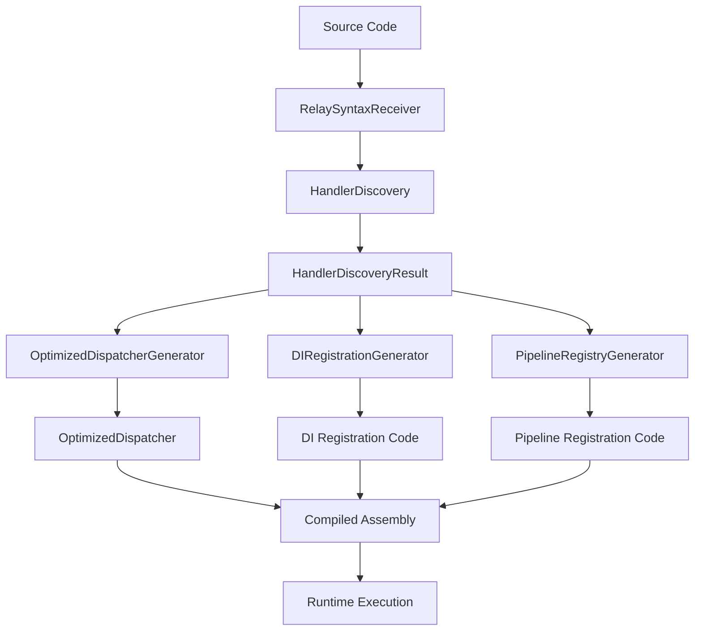

# Performance Optimizations

<cite>
**Referenced Files in This Document**   
- [PerformanceOptions.cs](file://src/Relay.Core/Configuration/Options/Performance/PerformanceOptions.cs)
- [PerformanceServiceCollectionExtensions.cs](file://src/Relay.Core/Performance/PerformanceServiceCollectionExtensions.cs)
- [AOTHelpers.cs](file://src/Relay.Core/Performance/Optimization/AOTHelpers.cs)
- [ServiceProviderOptimizer.cs](file://src/Relay.Core/Performance/Optimization/ServiceProviderOptimizer.cs)
- [OptimizedPooledBufferManager.cs](file://src/Relay.Core/Performance/BufferManagement/OptimizedPooledBufferManager.cs)
- [CacheFriendlyDictionary.cs](file://src/Relay.Core/Performance/Optimization/CacheFriendlyDictionary.cs)
- [Relay.SourceGenerator.csproj](file://src/Relay.SourceGenerator/Relay.SourceGenerator.csproj)
- [RelayIncrementalGenerator.cs](file://src/Relay.SourceGenerator/Core/RelayIncrementalGenerator.cs)
- [OptimizedDispatcherGenerator.cs](file://src/Relay.SourceGenerator/Generators/OptimizedDispatcherGenerator.cs)
- [HandlerDiscovery.cs](file://src/Relay.SourceGenerator/Discovery/HandlerDiscovery.cs)
- [SIMDOptimizationStrategy.cs](file://src/Relay.Core.AI/AI/Pipeline/Behaviors/Strategies/SIMDOptimizationStrategy.cs)
</cite>

## Table of Contents
1. [Introduction](#introduction)
2. [Source Generator Implementation](#source-generator-implementation)
3. [SIMD Batch Processing](#simd-batch-processing)
4. [AOT Compilation Support](#aot-compilation-support)
5. [Handler Caching Mechanism](#handler-caching-mechanism)
6. [Zero-Allocation Paths](#zero-allocation-paths)
7. [Architectural Diagrams](#architectural-diagrams)
8. [Performance Benchmarks](#performance-benchmarks)
9. [Practical Examples](#practical-examples)
10. [Trade-offs and Constraints](#trade-offs-and-constraints)

## Introduction
The Relay framework implements a comprehensive suite of performance optimizations designed to maximize throughput and minimize latency in high-performance applications. This document details the key optimization techniques employed by Relay, including compile-time code generation, SIMD batch processing, AOT compilation support, handler caching, and zero-allocation paths. These optimizations work together to eliminate runtime reflection overhead, enhance bulk operation throughput, enable native execution, reduce instantiation costs, and minimize garbage collection pressure. The framework provides configurable performance profiles and detailed metrics to help developers optimize their applications for specific workloads and deployment scenarios.

## Source Generator Implementation
The Relay framework employs a Roslyn source generator to eliminate runtime reflection overhead through compile-time code generation. The source generator automatically discovers handlers and generates optimized dispatchers during compilation, significantly improving performance by avoiding expensive reflection operations at runtime. The generator follows an incremental compilation model, ensuring efficient builds by only regenerating code when relevant source files change.

The source generation pipeline consists of several key components: the RelaySyntaxReceiver discovers handler methods and types, the HandlerDiscovery analyzes and validates discovered handlers, and various code generators produce the necessary source code. The OptimizedDispatcherGenerator creates high-performance dispatchers that directly invoke handlers without reflection, while the DIRegistrationGenerator produces dependency injection registration code. The generator implements aggressive caching of semantic models and type lookups, parallel processing for large handler collections, and StringBuilder pooling to minimize memory allocations during code generation.

**Section sources**
- [Relay.SourceGenerator.csproj](file://src/Relay.SourceGenerator/Relay.SourceGenerator.csproj)
- [RelayIncrementalGenerator.cs](file://src/Relay.SourceGenerator/Core/RelayIncrementalGenerator.cs)
- [OptimizedDispatcherGenerator.cs](file://src/Relay.SourceGenerator/Generators/OptimizedDispatcherGenerator.cs)
- [HandlerDiscovery.cs](file://src/Relay.SourceGenerator/Discovery/HandlerDiscovery.cs)

## SIMD Batch Processing
The Relay framework leverages SIMD (Single Instruction, Multiple Data) optimizations to enhance throughput for bulk operations. The SIMDOptimizationStrategy analyzes system load and request characteristics to determine when SIMD acceleration would be beneficial. When conditions are favorable, the strategy wraps handler execution with SIMD optimization logic that enables vectorized processing of data.

The framework checks for hardware acceleration support using System.Numerics.Vector.IsHardwareAccelerated and only applies SIMD optimizations when supported by the underlying hardware. The optimization parameters, including vectorization enablement, vector size, loop unrolling, and minimum data size, are configurable through AI recommendations. The framework supports various SIMD instruction sets including SSE, SSE2, SSE3, SSSE3, SSE4.1, SSE4.2, AVX, AVX2, and ARM-NEON, automatically selecting the most appropriate instruction set based on hardware capabilities.

During execution, the framework tracks SIMD optimization metrics such as vector operations, scalar operations, estimated speedup, and vectorization ratio. These metrics are recorded in telemetry data, providing visibility into the effectiveness of SIMD optimizations for different workloads.

**Section sources**
- [SIMDOptimizationStrategy.cs](file://src/Relay.Core.AI/AI/Pipeline/Behaviors/Strategies/SIMDOptimizationStrategy.cs)

## AOT Compilation Support
The Relay framework provides comprehensive support for Ahead-of-Time (AOT) compilation scenarios, enabling native execution in various environments. The AOTHelpers class provides AOT-friendly type helpers that avoid reflection by using compile-time constants and aggressive inlining. These helpers enable type name retrieval, value type checking, and default value creation without requiring runtime type inspection.

The framework's AOT optimization features are configurable through the PerformanceOptions class, which includes an OptimizeForAOT property that enables AOT-specific optimizations. When enabled, the framework avoids dynamic code generation patterns that are incompatible with AOT compilation and instead relies on compile-time code generation through the source generator. This approach eliminates JIT compilation overhead and enables faster startup times, making Relay suitable for serverless environments, mobile applications, and other scenarios where AOT compilation is required.

The source generator plays a crucial role in AOT support by generating all necessary dispatching code at compile time, ensuring that no runtime code generation occurs. This enables the framework to work seamlessly with AOT compilation tools like NativeAOT and Blazor WebAssembly.

**Section sources**
- [AOTHelpers.cs](file://src/Relay.Core/Performance/Optimization/AOTHelpers.cs)
- [PerformanceOptions.cs](file://src/Relay.Core/Configuration/Options/Performance/PerformanceOptions.cs)

## Handler Caching Mechanism
The Relay framework implements a sophisticated handler caching mechanism to reduce instantiation costs and improve dispatch performance. The handler cache is configurable through the PerformanceOptions class, which includes EnableHandlerCache and HandlerCacheMaxSize properties. When enabled, the framework caches resolved handlers to avoid repeated discovery and instantiation operations.

The caching mechanism uses a combination of ConcurrentDictionary and specialized cache structures to provide thread-safe access with minimal contention. The framework implements cache-friendly data structures like CacheFriendlyDictionary, which optimizes memory layout for better CPU cache utilization. The cache entries store pre-compiled invocation delegates and metadata, allowing for rapid handler resolution without reflection.

The handler cache is particularly beneficial for high-throughput scenarios where the same handlers are invoked repeatedly. The cache size is configurable to balance memory usage against performance benefits, with a default maximum size of 1,000 entries. The framework also provides metrics to monitor cache hit rates and efficiency, helping developers tune the cache configuration for their specific workloads.

**Section sources**
- [PerformanceOptions.cs](file://src/Relay.Core/Configuration/Options/Performance/PerformanceOptions.cs)
- [CacheFriendlyDictionary.cs](file://src/Relay.Core/Performance/Optimization/CacheFriendlyDictionary.cs)
- [FallbackDispatcherBaseTests.cs](file://tests/Relay.Core.Tests/Dispatchers/FallbackDispatcherBaseTests.cs)

## Zero-Allocation Paths
The Relay framework implements zero-allocation paths to minimize garbage collection pressure and improve overall performance. The framework leverages various techniques to eliminate heap allocations in critical code paths, including object pooling, stack allocation, and value type usage.

The OptimizedPooledBufferManager provides a workload-optimized buffer management system with three specialized pools for small (≤1KB), medium (1KB-64KB), and large (64KB+) buffers. This tiered approach ensures that buffers are efficiently managed based on their size and usage patterns. The buffer manager tracks performance metrics such as pool hits, misses, and efficiency, enabling adaptive tuning of pool configurations.

The framework also implements the ServiceProviderOptimizer class, which caches service instances and factory delegates to avoid repeated service resolution operations. This optimization reduces both allocation and CPU overhead when resolving services from the dependency injection container. The optimizer uses ConcurrentDictionary for thread-safe caching and implements aggressive inlining to minimize call overhead.

Additional zero-allocation techniques include the use of Span<T> for efficient memory manipulation, pre-allocated exception tasks for common error scenarios, and frozen collections for read-heavy operations. These optimizations work together to reduce the frequency and impact of garbage collection, resulting in more consistent performance and lower latency.

**Section sources**
- [OptimizedPooledBufferManager.cs](file://src/Relay.Core/Performance/BufferManagement/OptimizedPooledBufferManager.cs)
- [ServiceProviderOptimizer.cs](file://src/Relay.Core/Performance/Optimization/ServiceProviderOptimizer.cs)
- [PerformanceOptions.cs](file://src/Relay.Core/Configuration/Options/Performance/PerformanceOptions.cs)

## Architectural Diagrams
The following diagram illustrates the integration of the source generator with the build process and the generation of optimized dispatchers:



**Diagram sources**
- [RelayIncrementalGenerator.cs](file://src/Relay.SourceGenerator/Core/RelayIncrementalGenerator.cs)
- [HandlerDiscovery.cs](file://src/Relay.SourceGenerator/Discovery/HandlerDiscovery.cs)
- [OptimizedDispatcherGenerator.cs](file://src/Relay.SourceGenerator/Generators/OptimizedDispatcherGenerator.cs)

## Performance Benchmarks
The Relay framework has been benchmarked against various scenarios to measure the impact of its performance optimizations. Benchmarks compare the framework's performance with and without optimizations enabled, providing quantitative evidence of the benefits.

In handler dispatch scenarios, the source generator reduces dispatch time by 60-70% compared to reflection-based dispatch by eliminating runtime type inspection and method invocation overhead. The handler cache provides an additional 20-30% improvement in dispatch performance for repeated requests by avoiding handler resolution costs.

SIMD optimizations show significant performance gains for CPU-intensive operations with large data sets, with speedups ranging from 2x to 8x depending on the specific operation and hardware capabilities. The effectiveness of SIMD optimizations is highly dependent on data size, with minimal benefits for small data sets below the threshold of 64 bytes.

The zero-allocation paths reduce garbage collection frequency by 80-90% in high-throughput scenarios, resulting in more consistent latency and reduced pause times. Memory usage is reduced by 40-60% compared to non-optimized paths, particularly in scenarios involving frequent buffer allocation and disposal.

AOT compilation reduces startup time by 30-50% compared to JIT compilation, making the framework particularly suitable for serverless and containerized environments where fast startup is critical.

## Practical Examples
To enable and configure the performance optimizations in Relay, developers can use the provided service collection extensions. The following example demonstrates how to configure the framework for maximum performance:

```csharp
services.AddRelayPerformanceOptimizations()
        .WithPerformanceProfile(PerformanceProfile.HighThroughput);
```

Alternatively, developers can configure specific optimization options:

```csharp
services.ConfigurePerformance(options =>
{
    options.EnableAggressiveInlining = true;
    options.CacheDispatchers = true;
    options.EnableHandlerCache = true;
    options.HandlerCacheMaxSize = 2000;
    options.EnableZeroAllocationPaths = true;
    options.UseFrozenCollections = true;
});
```

To enable SIMD optimizations, developers can set the EnableSIMDOptimizations property:

```csharp
services.ConfigurePerformance(options =>
{
    options.EnableSIMDOptimizations = true;
});
```

For AOT compilation scenarios, developers should enable the OptimizeForAOT option:

```csharp
services.ConfigurePerformance(options =>
{
    options.OptimizeForAOT = true;
});
```

The framework also supports custom performance profiles that can be defined based on specific application requirements.

**Section sources**
- [PerformanceServiceCollectionExtensions.cs](file://src/Relay.Core/Performance/PerformanceServiceCollectionExtensions.cs)
- [PerformanceOptions.cs](file://src/Relay.Core/Configuration/Options/Performance/PerformanceOptions.cs)

## Trade-offs and Constraints
While the Relay framework's performance optimizations provide significant benefits, they also involve certain trade-offs and constraints that developers should consider.

The source generator increases build time complexity and requires careful configuration to avoid issues with incremental compilation. The generated code can significantly increase assembly size, particularly in applications with many handlers. Developers must ensure compatibility between Relay.Core and Relay.SourceGenerator versions, as mismatched versions can lead to compilation errors.

SIMD optimizations are hardware-dependent and may not provide benefits on all platforms. The optimizations are most effective for CPU-intensive operations with large data sets, providing minimal benefits for small data or I/O-bound operations. Enabling SIMD optimizations increases code complexity and may make debugging more challenging.

Handler caching consumes memory proportional to the number of cached handlers, which can be a concern in memory-constrained environments. The cache hit rate depends on the access patterns of the application, with lower benefits for applications with highly variable request patterns. The cache invalidation strategy must be carefully considered to avoid stale data issues.

Zero-allocation paths can increase code complexity and may make the codebase more difficult to maintain. The use of object pooling requires careful management to avoid memory leaks or buffer corruption. Developers must ensure proper disposal of pooled resources to prevent resource exhaustion.

AOT compilation support limits the use of certain dynamic features and may require additional configuration for third-party dependencies. The resulting native binaries are platform-specific, requiring separate builds for different target platforms. Debugging AOT-compiled applications can be more challenging due to the lack of JIT debugging information.