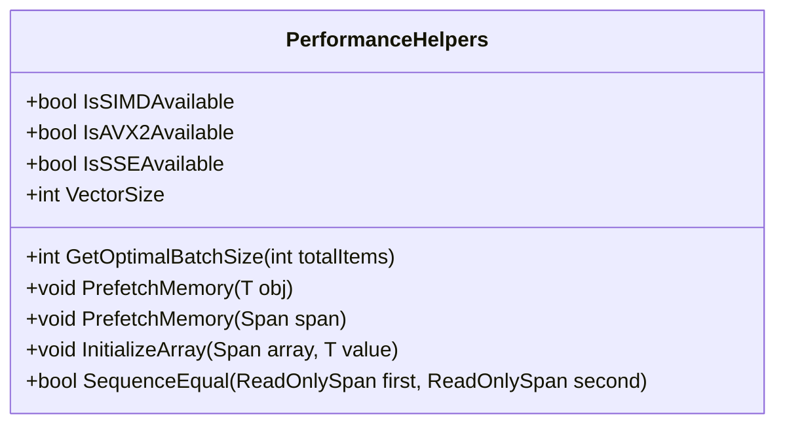
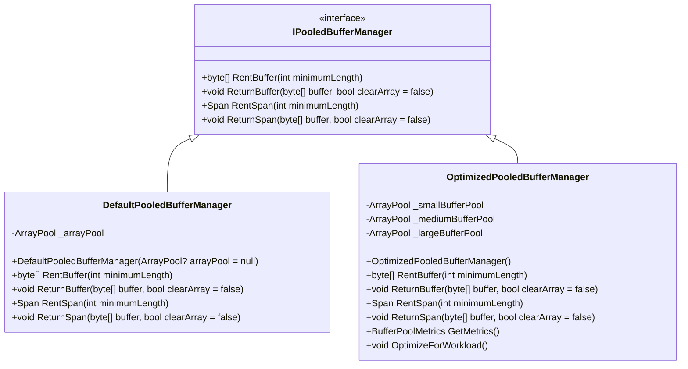
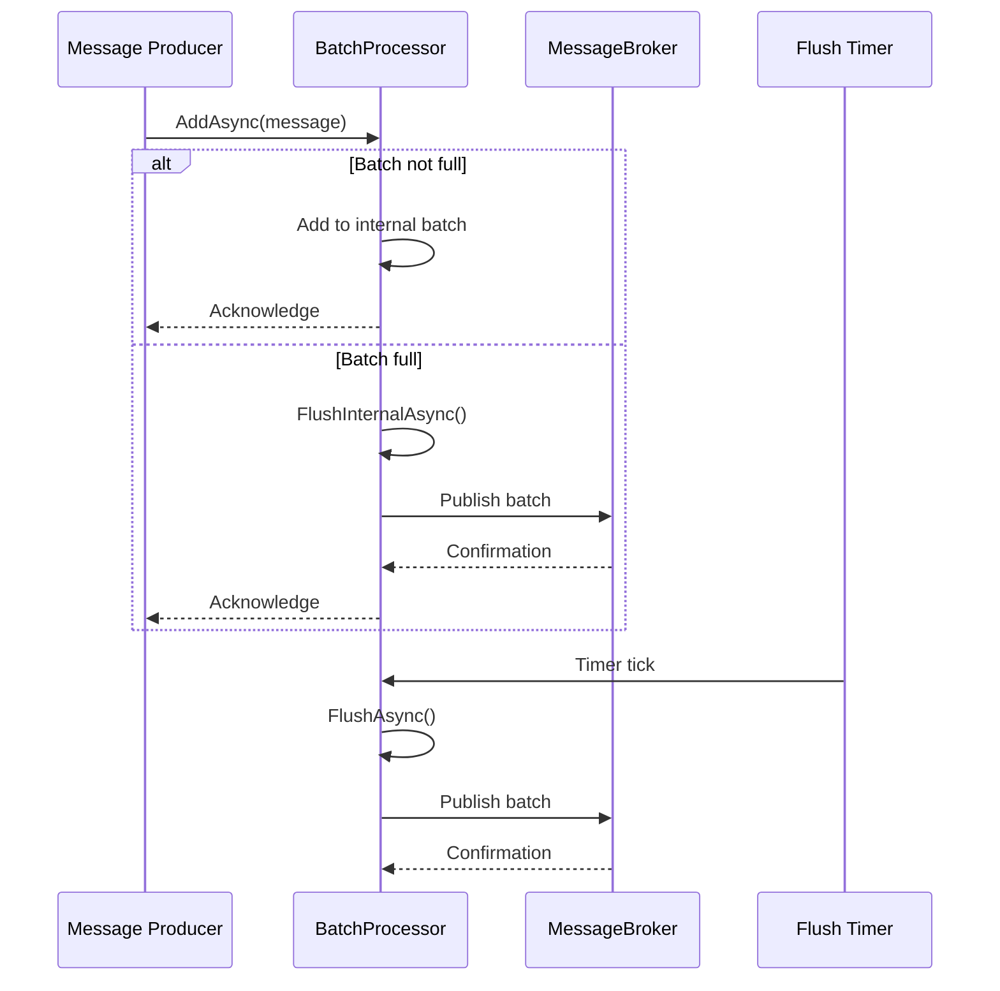
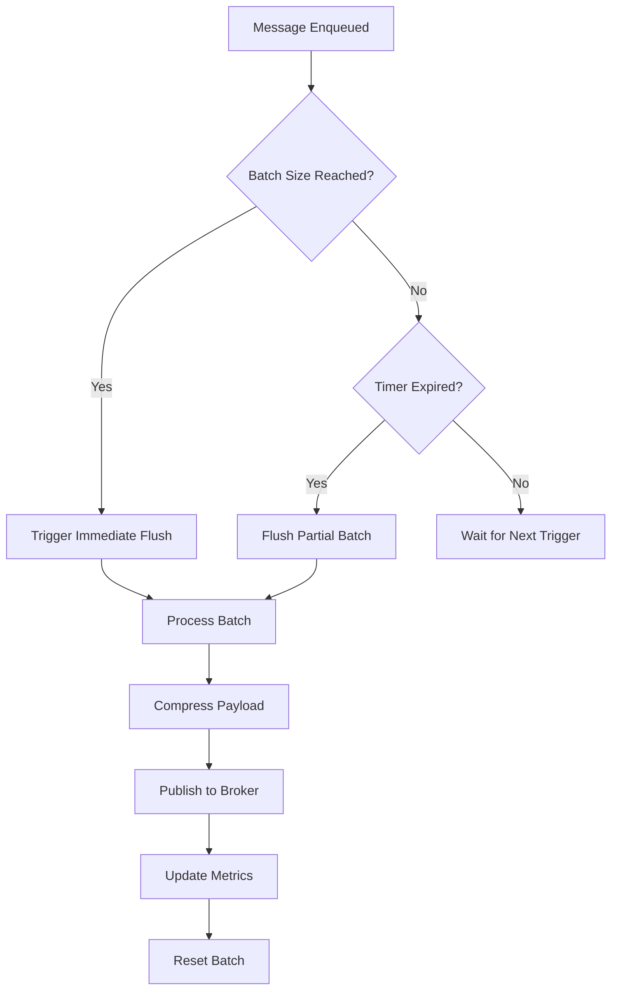
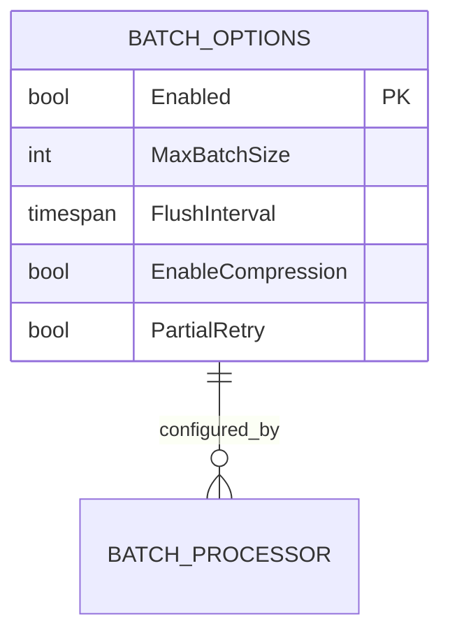
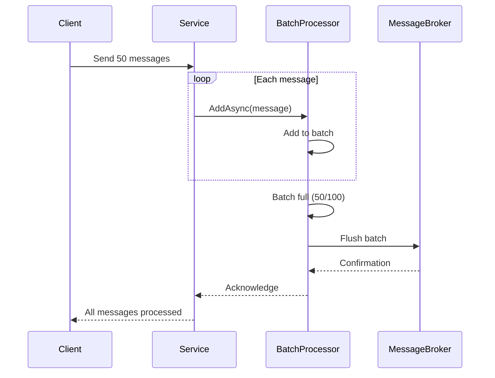
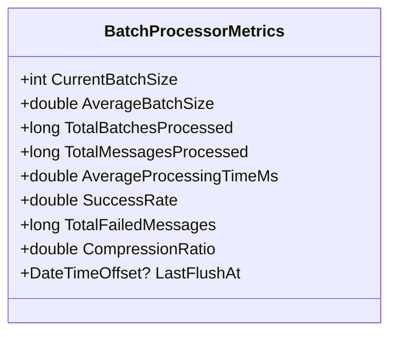
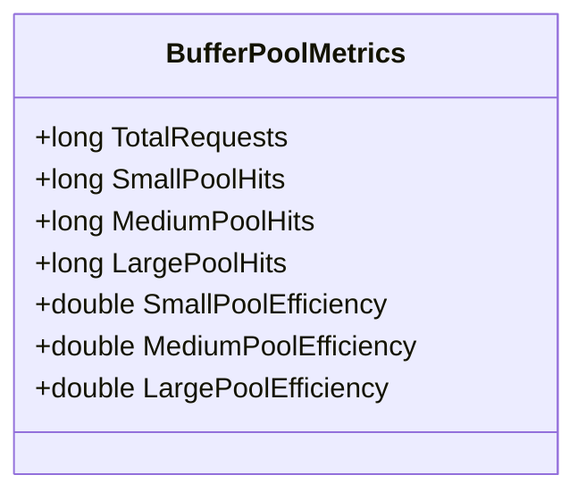

# SIMD Batch Processing

<cite>
**Referenced Files in This Document**   
- [PerformanceHelpers.cs](file://src/Relay.Core/Performance/Optimization/PerformanceHelpers.cs)
- [OptimizedPooledBufferManager.cs](file://src/Relay.Core/Performance/BufferManagement/OptimizedPooledBufferManager.cs)
- [DefaultPooledBufferManager.cs](file://src/Relay.Core/Performance/BufferManagement/DefaultPooledBufferManager.cs)
- [BufferPoolMetrics.cs](file://src/Relay.Core/Performance/BufferManagement/BufferPoolMetrics.cs)
- [SpanExtensions.cs](file://src/Relay.Core/Performance/Extensions/SpanExtensions.cs)
- [BatchProcessor.cs](file://src/Relay.MessageBroker/Batch/BatchProcessor.cs)
- [BatchOptions.cs](file://src/Relay.MessageBroker/Batch/BatchOptions.cs)
- [BatchProcessorMetrics.cs](file://src/Relay.MessageBroker/Batch/BatchProcessorMetrics.cs)
- [BatchCoordinator.cs](file://src/Relay.Core.AI/AI/Optimization/Batching/BatchCoordinator.cs)
</cite>

## Table of Contents
1. [Introduction](#introduction)
2. [SIMD Processing Fundamentals](#simd-processing-fundamentals)
3. [Buffer Management Architecture](#buffer-management-architecture)
4. [Batch Processing Implementation](#batch-processing-implementation)
5. [Performance Optimization Strategies](#performance-optimization-strategies)
6. [Configuration and Tuning](#configuration-and-tuning)
7. [Usage Examples](#usage-examples)
8. [Monitoring and Metrics](#monitoring-and-metrics)
9. [Troubleshooting Guide](#troubleshooting-guide)
10. [Conclusion](#conclusion)

## Introduction

The SIMD Batch Processing capability in Relay represents a sophisticated approach to maximizing throughput and minimizing latency in high-performance messaging systems. This framework combines hardware-level optimizations through Single Instruction, Multiple Data (SIMD) instructions with advanced memory management techniques to process multiple requests in parallel. The system is designed to reduce memory allocation overhead, improve CPU utilization, and enhance overall system efficiency through intelligent buffer pooling and span-based operations.

Relay's batch processing framework operates at multiple levels, from low-level hardware acceleration to high-level message broker integration. The architecture leverages the .NET runtime's support for vectorization and intrinsics while implementing custom buffer management strategies that minimize garbage collection pressure. This document provides a comprehensive overview of how these components work together to deliver high-performance batch processing capabilities.

**Section sources**
- [PerformanceHelpers.cs](file://src/Relay.Core/Performance/Optimization/PerformanceHelpers.cs#L1-L207)
- [OptimizedPooledBufferManager.cs](file://src/Relay.Core/Performance/BufferManagement/OptimizedPooledBufferManager.cs#L1-L210)

## SIMD Processing Fundamentals

### Hardware Acceleration Detection

Relay's SIMD capabilities begin with comprehensive hardware detection and feature availability checking. The `PerformanceHelpers` class provides static properties that determine the availability of various instruction set extensions:

- `IsSIMDAvailable`: Checks for general SIMD hardware acceleration support
- `IsAVX2Available`: Determines AVX2 instruction set availability
- `IsSSEAvailable`: Verifies SSE instruction set support

These detection mechanisms allow the framework to automatically adapt to the underlying hardware capabilities, ensuring optimal performance across different processor architectures while maintaining compatibility with systems that lack advanced instruction sets.



**Diagram sources**
- [PerformanceHelpers.cs](file://src/Relay.Core/Performance/Optimization/PerformanceHelpers.cs#L1-L207)

### Vectorized Operations

The framework implements several key vectorized operations that leverage SIMD instructions for improved performance:

#### Optimal Batch Sizing
The `GetOptimalBatchSize` method calculates batch sizes that align with the hardware's vector width, ensuring efficient utilization of SIMD registers. This method rounds up the requested batch size to the nearest multiple of the vector size, preventing partial vector utilization and maximizing throughput.

#### Memory Prefetching
Relay implements multiple prefetching strategies to improve cache performance:
- `PrefetchMemory<T>(T obj)`: For reference types, accesses object headers to trigger CPU prefetching
- `PrefetchMemory<T>(Span<T> span)`: For spans, prefetches first and last elements to optimize sequential access patterns
- `PrefetchMemoryMultiple<T>(params T[] objects)`: Prefetches multiple objects in parallel to improve cache locality

#### SIMD-Accelerated Algorithms
The framework includes optimized implementations of common operations:
- `InitializeArray`: Uses vector operations to initialize arrays, significantly faster than element-by-element assignment
- `SequenceEqual`: Implements SIMD-accelerated byte sequence comparison, processing multiple bytes per instruction

**Section sources**
- [PerformanceHelpers.cs](file://src/Relay.Core/Performance/Optimization/PerformanceHelpers.cs#L1-L207)

## Buffer Management Architecture

### Pooled Buffer Manager Design

Relay implements a sophisticated buffer management system designed to minimize memory allocations and reduce garbage collection pressure. The architecture centers around the `IPooledBufferManager` interface, which defines the contract for buffer rental and return operations.



**Diagram sources**
- [IPooledBufferManager.cs](file://src/Relay.Core/Performance/BufferManagement/IPooledBufferManager.cs#L1-L37)
- [DefaultPooledBufferManager.cs](file://src/Relay.Core/Performance/BufferManagement/DefaultPooledBufferManager.cs#L1-L77)
- [OptimizedPooledBufferManager.cs](file://src/Relay.Core/Performance/BufferManagement/OptimizedPooledBufferManager.cs#L1-L210)

### Multi-Level Pooling Strategy

The `OptimizedPooledBufferManager` implements a three-tiered pooling strategy optimized for different workload patterns:

#### Small Buffer Pool (≤ 1KB)
- Designed for frequent small allocations
- Higher cache capacity (64 arrays per bucket)
- Optimized for request/response serialization overhead
- Threshold: 1024 bytes

#### Medium Buffer Pool (1KB - 64KB)
- Targeted at typical message payloads
- Balanced cache capacity (16 arrays per bucket)
- Optimized for common message sizes
- Threshold: 65,536 bytes

#### Large Buffer Pool (> 64KB)
- Designed for batch operations and streaming
- Lower cache capacity (4 arrays per bucket)
- Optimized for memory-intensive operations
- No upper size limit

This tiered approach ensures that buffers are efficiently managed according to their usage patterns, reducing fragmentation and improving hit rates.

### Zero-Allocation Design Principles

The buffer management system adheres to strict zero-allocation principles through several key design decisions:

- **Span-Based Operations**: All buffer operations use `Span<T>` to avoid unnecessary array allocations
- **Cache-Line Alignment**: Buffer metrics are aligned to cache line boundaries to prevent false sharing
- **Size Prediction**: The `RentBufferForRequest<T>` method uses type-based heuristics to predict optimal buffer sizes
- **Efficient Return Mechanisms**: The `ReturnSpan` method includes null checks to handle stack-allocated spans appropriately

**Section sources**
- [OptimizedPooledBufferManager.cs](file://src/Relay.Core/Performance/BufferManagement/OptimizedPooledBufferManager.cs#L1-L210)
- [DefaultPooledBufferManager.cs](file://src/Relay.Core/Performance/BufferManagement/DefaultPooledBufferManager.cs#L1-L77)
- [SpanExtensions.cs](file://src/Relay.Core/Performance/Extensions/SpanExtensions.cs#L1-L76)

## Batch Processing Implementation

### Batch Processor Architecture

The `BatchProcessor<TMessage>` class implements the core batch processing functionality, coordinating the collection, batching, and publishing of messages. The architecture follows a producer-consumer pattern with multiple flushing strategies.



**Diagram sources**
- [BatchProcessor.cs](file://src/Relay.MessageBroker/Batch/BatchProcessor.cs#L1-L438)

### Processing Workflow

The batch processing workflow follows these key steps:

1. **Message Collection**: Messages are added to an internal list with thread-safe synchronization
2. **Size-Based Flushing**: When the batch reaches `MaxBatchSize`, it is automatically flushed
3. **Time-Based Flushing**: A timer ensures batches are flushed within `FlushInterval` even if not full
4. **Compression**: Optional GZip compression reduces network bandwidth usage
5. **Publishing**: Batches are published to the message broker as single payloads

### AI-Optimized Batching

The framework includes AI-driven batch coordination through the `BatchCoordinator` class, which implements intelligent batching strategies:

- **Dynamic Batch Sizing**: Adjusts batch sizes based on real-time performance metrics
- **Wait Time Optimization**: Balances batch size benefits against increased latency
- **Efficiency Calculation**: Uses a logarithmic formula to calculate batch efficiency
- **Fallback Mechanisms**: Individual message processing when batch timeouts occur



**Diagram sources**
- [BatchProcessor.cs](file://src/Relay.MessageBroker/Batch/BatchProcessor.cs#L1-L438)
- [BatchCoordinator.cs](file://src/Relay.Core.AI/AI/Optimization/Batching/BatchCoordinator.cs#L1-L219)

**Section sources**
- [BatchProcessor.cs](file://src/Relay.MessageBroker/Batch/BatchProcessor.cs#L1-L438)
- [BatchOptions.cs](file://src/Relay.MessageBroker/Batch/BatchOptions.cs#L1-L51)

## Performance Optimization Strategies

### Memory Management Optimization

The framework employs several advanced memory management techniques to minimize allocation overhead:

#### Buffer Pool Efficiency
The `OptimizedPooledBufferManager` tracks detailed metrics for each pool tier:
- Hit rates for small, medium, and large buffers
- Request counts and efficiency ratios
- Size-based allocation patterns

These metrics enable adaptive tuning of pool configurations based on actual usage patterns.

#### Span Extension Methods
The `SpanExtensions` class provides optimized operations for working with spans:
- `CopyToSpan`: Efficient data copying with bounds checking
- `SafeSlice`: Bounds-safe slicing operations
- Aggressive inlining to eliminate method call overhead

### CPU Utilization Optimization

The system optimizes CPU utilization through several mechanisms:

#### SIMD-Accelerated Processing
When available, the framework leverages SIMD instructions for:
- Parallel data initialization
- Vectorized comparisons
- Bulk memory operations

#### Prefetching Strategies
The prefetching system improves CPU cache utilization by:
- Prefetching first and last elements of spans
- Accessing object headers to trigger CPU prefetch logic
- Parallel prefetching of multiple objects

### Compression Efficiency

The batch processor implements GZip compression with the following characteristics:
- Enabled by default through `EnableCompression` option
- Compression ratio tracking for performance analysis
- Header metadata to identify compressed payloads
- Optimal compression level balancing speed and size

**Section sources**
- [PerformanceHelpers.cs](file://src/Relay.Core/Performance/Optimization/PerformanceHelpers.cs#L1-L207)
- [OptimizedPooledBufferManager.cs](file://src/Relay.Core/Performance/BufferManagement/OptimizedPooledBufferManager.cs#L1-L210)
- [SpanExtensions.cs](file://src/Relay.Core/Performance/Extensions/SpanExtensions.cs#L1-L76)

## Configuration and Tuning

### Batch Options Configuration

The `BatchOptions` class provides configurable parameters for batch processing behavior:



**Diagram sources**
- [BatchOptions.cs](file://src/Relay.MessageBroker/Batch/BatchOptions.cs#L1-L51)

#### Key Configuration Parameters
- **Enabled**: Toggles batch processing on/off
- **MaxBatchSize**: Maximum messages per batch (1-10,000, default 100)
- **FlushInterval**: Time-based flush frequency (minimum 1ms, default 100ms)
- **EnableCompression**: GZip compression toggle (default true)
- **PartialRetry**: Individual message retry on batch failure (default true)

### Buffer Pool Configuration

The buffer management system can be configured through dependency injection:

#### Default Configuration
The `DefaultPooledBufferManager` uses optimized defaults:
- 1MB maximum array length
- 32 arrays per bucket
- Shared pool instance

#### Custom Configuration
The `OptimizedPooledBufferManager` allows fine-grained control:
- Separate pools for different size ranges
- Custom bucket sizes and maximum arrays
- Workload-specific tuning

### Performance Tuning Guidelines

#### Batch Size Optimization
- **High Throughput Workloads**: Increase `MaxBatchSize` (500-1000)
- **Low Latency Requirements**: Decrease `MaxBatchSize` (10-50)
- **Large Messages**: Reduce `MaxBatchSize` to avoid memory pressure

#### Flush Interval Tuning
- **High Message Rates**: Shorter intervals (10-50ms)
- **Low Message Rates**: Longer intervals (200-500ms)
- **Latency-Sensitive**: Match interval to acceptable latency

#### Memory Pressure Management
Monitor buffer pool metrics and adjust:
- Reduce pool sizes under memory pressure
- Increase pool sizes when hit rates are low
- Consider disabling compression for CPU-bound systems

**Section sources**
- [BatchOptions.cs](file://src/Relay.MessageBroker/Batch/BatchOptions.cs#L1-L51)
- [OptimizedPooledBufferManager.cs](file://src/Relay.Core/Performance/BufferManagement/OptimizedPooledBufferManager.cs#L1-L210)

## Usage Examples

### Basic Batch Processing



**Diagram sources**
- [BatchProcessor.cs](file://src/Relay.MessageBroker/Batch/BatchProcessor.cs#L1-L438)

### Configuration Example

```csharp
// Configure batch processing options
services.Configure<BatchOptions>(options =>
{
    options.Enabled = true;
    options.MaxBatchSize = 500;
    options.FlushInterval = TimeSpan.FromMilliseconds(50);
    options.EnableCompression = true;
    options.PartialRetry = true;
});

// Configure optimized buffer manager
services.AddSingleton<IPooledBufferManager, OptimizedPooledBufferManager>();
```

### Performance Monitoring

```csharp
// Retrieve batch processor metrics
var metrics = batchProcessor.GetMetrics();
Console.WriteLine($"Success Rate: {metrics.SuccessRate:P2}");
Console.WriteLine($"Avg Processing Time: {metrics.AverageProcessingTimeMs:F2}ms");
Console.WriteLine($"Compression Ratio: {metrics.CompressionRatio:F2}x");

// Retrieve buffer pool metrics
var bufferMetrics = optimizedBufferManager.GetMetrics();
Console.WriteLine($"Buffer Pool: {bufferMetrics}");
```

**Section sources**
- [BatchProcessor.cs](file://src/Relay.MessageBroker/Batch/BatchProcessor.cs#L1-L438)
- [BatchProcessorMetrics.cs](file://src/Relay.MessageBroker/Batch/BatchProcessorMetrics.cs#L1-L53)
- [BufferPoolMetrics.cs](file://src/Relay.Core/Performance/BufferManagement/BufferPoolMetrics.cs#L1-L24)

## Monitoring and Metrics

### Batch Processing Metrics

The `BatchProcessorMetrics` class provides comprehensive performance monitoring:



**Diagram sources**
- [BatchProcessorMetrics.cs](file://src/Relay.MessageBroker/Batch/BatchProcessorMetrics.cs#L1-L53)

#### Key Metrics
- **Processing Efficiency**: Average batch size and processing time
- **Success Rate**: Percentage of successful message deliveries
- **Compression Ratio**: Original size to compressed size ratio
- **Throughput**: Messages processed per second

### Buffer Pool Metrics

The `BufferPoolMetrics` structure provides detailed buffer management statistics:



**Diagram sources**
- [BufferPoolMetrics.cs](file://src/Relay.Core/Performance/BufferManagement/BufferPoolMetrics.cs#L1-L24)

#### Key Insights
- **Hit Rates**: Success rate for buffer allocations
- **Efficiency Ratios**: Utilization of each pool tier
- **Size Distribution**: Patterns in buffer size requests

### Performance Analysis

The metrics system enables data-driven optimization:
- Identify bottlenecks in batch processing
- Tune buffer pool configurations
- Monitor compression effectiveness
- Track system throughput over time

**Section sources**
- [BatchProcessorMetrics.cs](file://src/Relay.MessageBroker/Batch/BatchProcessorMetrics.cs#L1-L53)
- [BufferPoolMetrics.cs](file://src/Relay.Core/Performance/BufferManagement/BufferPoolMetrics.cs#L1-L24)

## Troubleshooting Guide

### Common Issues and Solutions

#### Memory Pressure
**Symptoms**: High GC activity, OutOfMemory exceptions
**Solutions**:
- Reduce `MaxBatchSize`
- Decrease buffer pool sizes
- Disable compression if CPU is not constrained
- Monitor `BufferPoolMetrics` for low hit rates

#### High Latency
**Symptoms**: Increased message processing time
**Solutions**:
- Decrease `FlushInterval`
- Reduce `MaxBatchSize`
- Check for CPU bottlenecks
- Monitor batch efficiency metrics

#### Low Throughput
**Symptoms**: Low messages processed per second
**Solutions**:
- Increase `MaxBatchSize`
- Increase `FlushInterval` to allow larger batches
- Enable compression for network-bound systems
- Verify SIMD availability with `PerformanceHelpers`

### Configuration Validation

The framework includes built-in validation:
- `BatchOptions.Validate()`: Ensures valid configuration values
- Range checking for `MaxBatchSize` (1-10,000)
- Minimum `FlushInterval` enforcement (1ms)

### Performance Monitoring Best Practices

1. **Regular Metrics Collection**: Monitor batch and buffer metrics continuously
2. **Baseline Establishment**: Record performance under normal conditions
3. **Alerting**: Set thresholds for key metrics (success rate, processing time)
4. **Capacity Planning**: Use metrics to predict resource requirements

**Section sources**
- [BatchOptions.cs](file://src/Relay.MessageBroker/Batch/BatchOptions.cs#L1-L51)
- [BatchProcessor.cs](file://src/Relay.MessageBroker/Batch/BatchProcessor.cs#L1-L438)
- [BufferPoolMetrics.cs](file://src/Relay.Core/Performance/BufferManagement/BufferPoolMetrics.cs#L1-L24)

## Conclusion

The SIMD Batch Processing capability in Relay represents a comprehensive approach to high-performance messaging that combines hardware-level optimizations with sophisticated software engineering. By leveraging SIMD instructions, the framework achieves significant performance improvements in data processing operations, while the optimized buffer management system minimizes memory allocation overhead and reduces garbage collection pressure.

The architecture demonstrates a thoughtful balance between performance and usability, providing configurable options that allow developers to tune the system for their specific workload requirements. The integration of AI-driven optimization through the `BatchCoordinator` adds an additional layer of intelligence, dynamically adjusting batching strategies based on real-time performance metrics.

Key takeaways for developers:
- Utilize the span-based API to minimize allocations
- Configure batch sizes and intervals based on workload characteristics
- Monitor buffer pool metrics to optimize memory usage
- Leverage compression for network-bound scenarios
- Use the comprehensive metrics system for performance analysis

The framework's design adheres to modern performance best practices, including zero-allocation patterns, cache-friendly data structures, and hardware-aware optimizations. This makes it well-suited for high-throughput, low-latency messaging scenarios where performance is critical.