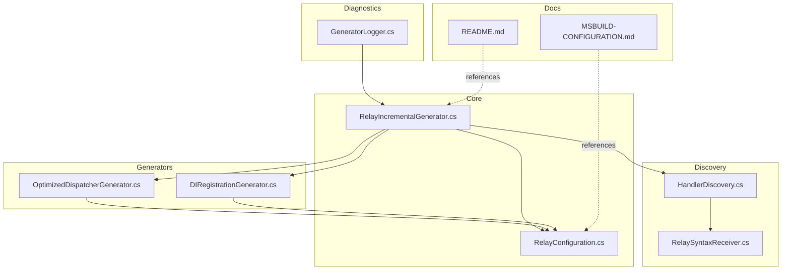
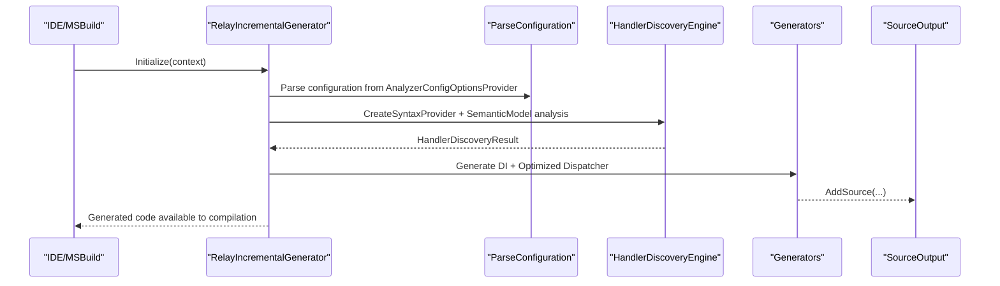
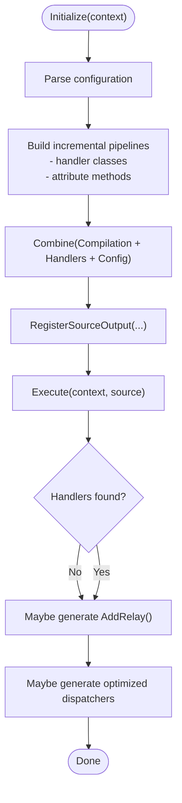
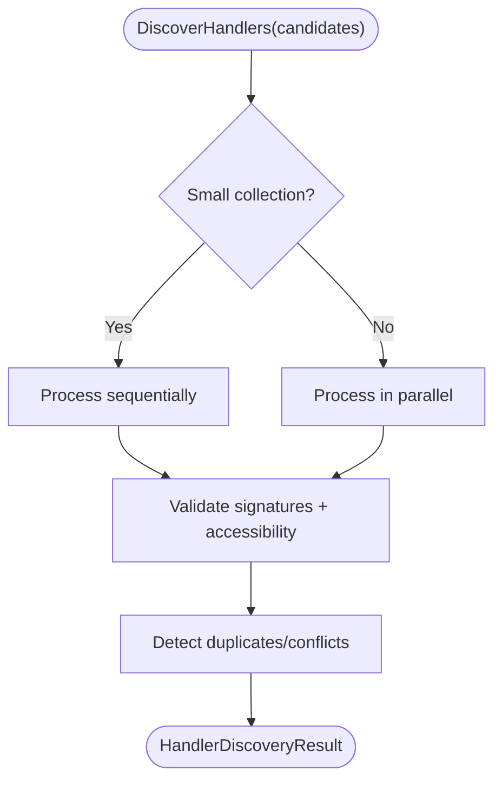
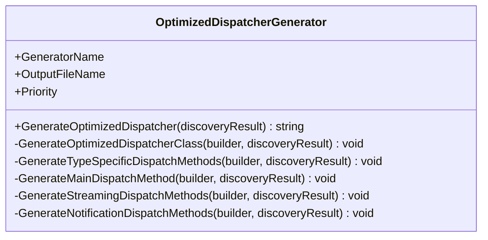
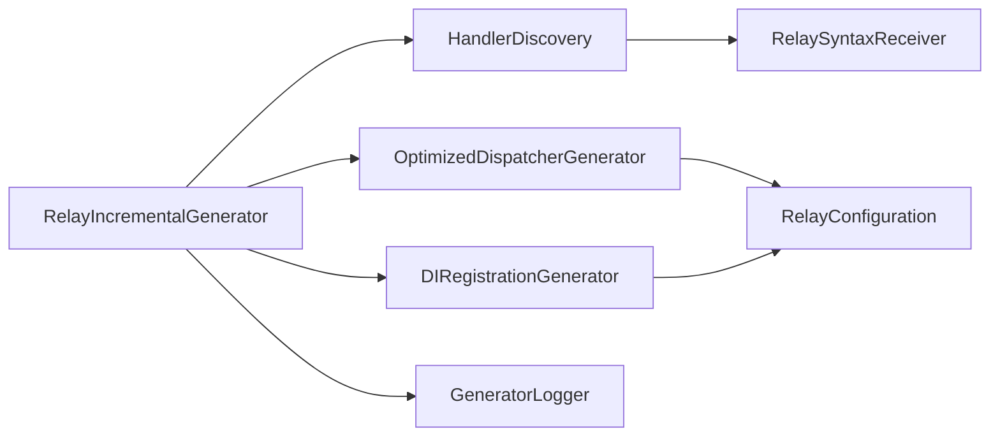

# Source Generator

<cite>
**Referenced Files in This Document**
- [RelayIncrementalGenerator.cs](file://src/Relay.SourceGenerator/Core/RelayIncrementalGenerator.cs)
- [OptimizedDispatcherGenerator.cs](file://src/Relay.SourceGenerator/Generators/OptimizedDispatcherGenerator.cs)
- [DIRegistrationGenerator.cs](file://src/Relay.SourceGenerator/Generators/DIRegistrationGenerator.cs)
- [HandlerDiscovery.cs](file://src/Relay.SourceGenerator/Discovery/HandlerDiscovery.cs)
- [RelaySyntaxReceiver.cs](file://src/Relay.SourceGenerator/Discovery/RelaySyntaxReceiver.cs)
- [README.md](file://src/Relay.SourceGenerator/README.md)
- [MSBUILD-CONFIGURATION.md](file://src/Relay.SourceGenerator/MSBUILD-CONFIGURATION.md)
- [ICodeGenerator.cs](file://src/Relay.SourceGenerator/Generators/ICodeGenerator.cs)
- [RelayConfiguration.cs](file://src/Relay.SourceGenerator/Configuration/RelayConfiguration.cs)
- [GeneratorLogger.cs](file://src/Relay.SourceGenerator/Diagnostics/GeneratorLogger.cs)
- [OptimizedDispatcherGeneratorBasicTests.cs](file://tests/Relay.SourceGenerator.Tests/OptimizedDispatcherGeneratorBasicTests.cs)
</cite>

## Table of Contents
1. [Introduction](#introduction)
2. [Project Structure](#project-structure)
3. [Core Components](#core-components)
4. [Architecture Overview](#architecture-overview)
5. [Detailed Component Analysis](#detailed-component-analysis)
6. [Dependency Analysis](#dependency-analysis)
7. [Performance Considerations](#performance-considerations)
8. [Troubleshooting Guide](#troubleshooting-guide)
9. [Conclusion](#conclusion)
10. [Appendices](#appendices)

## Introduction
This document explains the Source Generator feature in the Relay framework. It focuses on how the Roslyn-based source generator eliminates runtime reflection by generating optimized dispatcher code at compile time. It covers the implementation of the incremental generator, how it discovers handlers and notifications, and how it integrates with the DI pipeline and code generation pipeline. It also provides guidance on debugging generated code and interpreting analyzer diagnostics, with practical examples from the optimized dispatcher generator.

## Project Structure
The Relay Source Generator is organized into focused areas:
- Core: Incremental generator entry point and configuration parsing
- Generators: Code generators for DI registration, handler registry, optimized dispatchers, and others
- Discovery: Handler discovery and syntax receivers
- Diagnostics: Diagnostic reporting and logging
- Configuration: Generation options and value-based equality for incremental caching
- Tests: Behavioral tests for generators and discovery

**Diagram sources**
- [RelayIncrementalGenerator.cs](file://src/Relay.SourceGenerator/Core/RelayIncrementalGenerator.cs#L1-L120)
- [OptimizedDispatcherGenerator.cs](file://src/Relay.SourceGenerator/Generators/OptimizedDispatcherGenerator.cs#L1-L60)
- [DIRegistrationGenerator.cs](file://src/Relay.SourceGenerator/Generators/DIRegistrationGenerator.cs#L1-L60)
- [HandlerDiscovery.cs](file://src/Relay.SourceGenerator/Discovery/HandlerDiscovery.cs#L1-L60)
- [RelaySyntaxReceiver.cs](file://src/Relay.SourceGenerator/Discovery/RelaySyntaxReceiver.cs#L1-L60)
- [GeneratorLogger.cs](file://src/Relay.SourceGenerator/Diagnostics/GeneratorLogger.cs#L1-L60)
- [README.md](file://src/Relay.SourceGenerator/README.md#L1-L120)
- [MSBUILD-CONFIGURATION.md](file://src/Relay.SourceGenerator/MSBUILD-CONFIGURATION.md#L1-L120)

**Section sources**
- [README.md](file://src/Relay.SourceGenerator/README.md#L1-L135)
- [MSBUILD-CONFIGURATION.md](file://src/Relay.SourceGenerator/MSBUILD-CONFIGURATION.md#L1-L120)

## Core Components
- RelayIncrementalGenerator: The main incremental generator that orchestrates discovery, configuration parsing, and code generation. It registers source outputs for DI and optimized dispatchers and performs missing-reference checks.
- OptimizedDispatcherGenerator: Generates high-performance dispatcher code with specialized methods and pattern matching to avoid reflection.
- DIRegistrationGenerator: Produces DI registration code for handlers and dispatchers.
- HandlerDiscovery: Discovers handlers via syntax analysis and validates signatures and accessibility.
- RelaySyntaxReceiver: Collects candidate methods for legacy compatibility and tests.
- Configuration and Options: GenerationOptions and RelayConfiguration define and cache generator behavior for incremental builds.
- Diagnostics and Logging: GeneratorLogger reports debug/info/warnings/errors and performance metrics.

**Section sources**
- [RelayIncrementalGenerator.cs](file://src/Relay.SourceGenerator/Core/RelayIncrementalGenerator.cs#L1-L120)
- [OptimizedDispatcherGenerator.cs](file://src/Relay.SourceGenerator/Generators/OptimizedDispatcherGenerator.cs#L1-L60)
- [DIRegistrationGenerator.cs](file://src/Relay.SourceGenerator/Generators/DIRegistrationGenerator.cs#L1-L60)
- [HandlerDiscovery.cs](file://src/Relay.SourceGenerator/Discovery/HandlerDiscovery.cs#L1-L60)
- [RelaySyntaxReceiver.cs](file://src/Relay.SourceGenerator/Discovery/RelaySyntaxReceiver.cs#L1-L60)
- [ICodeGenerator.cs](file://src/Relay.SourceGenerator/Generators/ICodeGenerator.cs#L1-L167)
- [RelayConfiguration.cs](file://src/Relay.SourceGenerator/Configuration/RelayConfiguration.cs#L1-L84)
- [GeneratorLogger.cs](file://src/Relay.SourceGenerator/Diagnostics/GeneratorLogger.cs#L1-L83)

## Architecture Overview
The generator runs during compilation and uses Roslyn’s incremental pipeline to:
- Parse MSBuild configuration into GenerationOptions
- Discover handlers via syntax providers and semantic analysis
- Generate DI registration and optimized dispatchers
- Emit diagnostics for missing references and validation failures

**Diagram sources**
- [RelayIncrementalGenerator.cs](file://src/Relay.SourceGenerator/Core/RelayIncrementalGenerator.cs#L59-L120)
- [HandlerDiscovery.cs](file://src/Relay.SourceGenerator/Discovery/HandlerDiscovery.cs#L46-L120)
- [DIRegistrationGenerator.cs](file://src/Relay.SourceGenerator/Generators/DIRegistrationGenerator.cs#L99-L158)
- [OptimizedDispatcherGenerator.cs](file://src/Relay.SourceGenerator/Generators/OptimizedDispatcherGenerator.cs#L38-L120)

## Detailed Component Analysis

### RelayIncrementalGenerator
Responsibilities:
- Parses MSBuild configuration into RelayConfiguration with value-based equality for incremental caching
- Creates incremental pipelines for:
  - Class declarations implementing handler interfaces
  - Methods with Relay attributes (for missing reference detection)
- Executes generation and registers source outputs for DI and optimized dispatchers
- Emits diagnostics for missing Relay.Core reference when attributes are present

Key behaviors:
- Uses CreateSyntaxProvider with custom predicates to detect candidate classes and methods
- Applies value-based equality comparers to enable efficient incremental caching
- Generates DI registrations and optimized dispatchers based on GenerationOptions
- Falls back to complete fallback code when generation fails

**Diagram sources**
- [RelayIncrementalGenerator.cs](file://src/Relay.SourceGenerator/Core/RelayIncrementalGenerator.cs#L59-L120)
- [RelayIncrementalGenerator.cs](file://src/Relay.SourceGenerator/Core/RelayIncrementalGenerator.cs#L338-L454)

**Section sources**
- [RelayIncrementalGenerator.cs](file://src/Relay.SourceGenerator/Core/RelayIncrementalGenerator.cs#L59-L120)
- [RelayIncrementalGenerator.cs](file://src/Relay.SourceGenerator/Core/RelayIncrementalGenerator.cs#L178-L198)
- [RelayIncrementalGenerator.cs](file://src/Relay.SourceGenerator/Core/RelayIncrementalGenerator.cs#L338-L454)

### Handler Discovery Engine
Responsibilities:
- Discover handler methods from syntax nodes
- Validate signatures for request/notification/pipeline/endpoints
- Detect accessibility (private/internal/public) and report diagnostics
- Detect duplicate handlers/named conflicts
- Compute response types with caching

Notable features:
- Parallel processing for large collections with configurable degree of parallelism
- Thread-safe caches for response types and semantic models
- Early-exit predicates to avoid LINQ overhead on hot paths

**Diagram sources**
- [HandlerDiscovery.cs](file://src/Relay.SourceGenerator/Discovery/HandlerDiscovery.cs#L46-L120)
- [HandlerDiscovery.cs](file://src/Relay.SourceGenerator/Discovery/HandlerDiscovery.cs#L139-L224)
- [HandlerDiscovery.cs](file://src/Relay.SourceGenerator/Discovery/HandlerDiscovery.cs#L546-L601)

**Section sources**
- [HandlerDiscovery.cs](file://src/Relay.SourceGenerator/Discovery/HandlerDiscovery.cs#L46-L120)
- [HandlerDiscovery.cs](file://src/Relay.SourceGenerator/Discovery/HandlerDiscovery.cs#L139-L224)
- [HandlerDiscovery.cs](file://src/Relay.SourceGenerator/Discovery/HandlerDiscovery.cs#L546-L601)

### OptimizedDispatcherGenerator
Responsibilities:
- Generate specialized dispatcher methods for each request type
- Use pattern matching and aggressive inlining to avoid reflection
- Support named handlers and keyed services (.NET 8+)
- Generate streaming and notification dispatch methods

Key implementation patterns:
- Pattern matching switch expressions for O(1) type lookup
- Aggressive inlining via [MethodImpl(MethodImplOptions.AggressiveInlining)]
- Helper methods for named handler resolution with keyed service support
- Separate methods for requests with and without response types

**Diagram sources**
- [OptimizedDispatcherGenerator.cs](file://src/Relay.SourceGenerator/Generators/OptimizedDispatcherGenerator.cs#L1-L120)
- [OptimizedDispatcherGenerator.cs](file://src/Relay.SourceGenerator/Generators/OptimizedDispatcherGenerator.cs#L120-L220)
- [OptimizedDispatcherGenerator.cs](file://src/Relay.SourceGenerator/Generators/OptimizedDispatcherGenerator.cs#L345-L397)

Concrete examples from tests:
- Basic header comments and usings verification
- Aggressive inlining attribute presence
- Valid code generation for empty handlers

**Section sources**
- [OptimizedDispatcherGenerator.cs](file://src/Relay.SourceGenerator/Generators/OptimizedDispatcherGenerator.cs#L1-L120)
- [OptimizedDispatcherGenerator.cs](file://src/Relay.SourceGenerator/Generators/OptimizedDispatcherGenerator.cs#L120-L220)
- [OptimizedDispatcherGenerator.cs](file://src/Relay.SourceGenerator/Generators/OptimizedDispatcherGenerator.cs#L345-L397)
- [OptimizedDispatcherGeneratorBasicTests.cs](file://tests/Relay.SourceGenerator.Tests/OptimizedDispatcherGeneratorBasicTests.cs#L112-L195)

### DI Registration Generator
Responsibilities:
- Generate DI registration extension methods
- Register core services and dispatchers
- Register handler types with appropriate lifetimes
- Generate warmup filters for performance

Integration:
- Works alongside optimized dispatchers to wire up the DI container
- Uses GenerationOptions to control behavior

**Section sources**
- [DIRegistrationGenerator.cs](file://src/Relay.SourceGenerator/Generators/DIRegistrationGenerator.cs#L99-L158)
- [DIRegistrationGenerator.cs](file://src/Relay.SourceGenerator/Generators/DIRegistrationGenerator.cs#L163-L236)

### Syntax Receiver (Legacy Compatibility)
Responsibilities:
- Collect candidate methods with Relay attributes for legacy patterns
- Provide filtered candidates by attribute name

**Section sources**
- [RelaySyntaxReceiver.cs](file://src/Relay.SourceGenerator/Discovery/RelaySyntaxReceiver.cs#L1-L104)

## Dependency Analysis
- Core depends on Generators and Discovery for orchestration
- Generators depend on GenerationOptions and RelayConfiguration for behavior
- Discovery depends on Roslyn symbols and semantic models
- Diagnostics rely on IDiagnosticReporter and DiagnosticDescriptors
- Tests validate generator outputs and behaviors

**Diagram sources**
- [RelayIncrementalGenerator.cs](file://src/Relay.SourceGenerator/Core/RelayIncrementalGenerator.cs#L59-L120)
- [HandlerDiscovery.cs](file://src/Relay.SourceGenerator/Discovery/HandlerDiscovery.cs#L1-L60)
- [OptimizedDispatcherGenerator.cs](file://src/Relay.SourceGenerator/Generators/OptimizedDispatcherGenerator.cs#L1-L60)
- [DIRegistrationGenerator.cs](file://src/Relay.SourceGenerator/Generators/DIRegistrationGenerator.cs#L1-L60)
- [RelaySyntaxReceiver.cs](file://src/Relay.SourceGenerator/Discovery/RelaySyntaxReceiver.cs#L1-L60)
- [GeneratorLogger.cs](file://src/Relay.SourceGenerator/Diagnostics/GeneratorLogger.cs#L1-L60)

**Section sources**
- [ICodeGenerator.cs](file://src/Relay.SourceGenerator/Generators/ICodeGenerator.cs#L1-L167)
- [RelayConfiguration.cs](file://src/Relay.SourceGenerator/Configuration/RelayConfiguration.cs#L1-L84)

## Performance Considerations
- Aggressive caching: Semantic models, type lookups, response types
- Parallel processing: Fixed degree of parallelism for large collections
- StringBuilder pooling: Reduced allocations during code generation
- Early exits: Hot-path optimizations avoiding LINQ overhead
- Aggressive inlining: [MethodImpl(MethodImplOptions.AggressiveInlining)] on generated methods
- Value-based equality: Configuration equality for incremental caching

**Section sources**
- [README.md](file://src/Relay.SourceGenerator/README.md#L108-L135)
- [RelayIncrementalGenerator.cs](file://src/Relay.SourceGenerator/Core/RelayIncrementalGenerator.cs#L29-L58)
- [HandlerDiscovery.cs](file://src/Relay.SourceGenerator/Discovery/HandlerDiscovery.cs#L1-L60)

## Troubleshooting Guide
Common issues and resolutions:
- Missing Relay.Core reference: The generator detects methods with Relay attributes and reports a diagnostic if the reference is missing
- Private handlers: Private methods are flagged as invalid; handlers must be public or internal
- Duplicate handlers/named conflicts: Detected and reported with diagnostics
- Generator not running: Verify MSBuild properties are set correctly and rebuild cleanly
- Custom namespace not applied: Ensure property spelling is correct and rebuild
- Conditional configuration overrides: Check Directory.Build.props and per-project overrides

Debugging tips:
- Use GeneratorLogger to emit debug/info/warnings/errors and performance metrics
- Inspect generated code in the generated sources
- Review analyzer diagnostics for validation failures

**Section sources**
- [RelayIncrementalGenerator.cs](file://src/Relay.SourceGenerator/Core/RelayIncrementalGenerator.cs#L178-L198)
- [HandlerDiscovery.cs](file://src/Relay.SourceGenerator/Discovery/HandlerDiscovery.cs#L339-L463)
- [MSBUILD-CONFIGURATION.md](file://src/Relay.SourceGenerator/MSBUILD-CONFIGURATION.md#L299-L333)
- [GeneratorLogger.cs](file://src/Relay.SourceGenerator/Diagnostics/GeneratorLogger.cs#L1-L83)

## Conclusion
The Relay Source Generator transforms runtime reflection into compile-time code generation by:
- Discovering handlers and validating signatures incrementally
- Generating DI registration and optimized dispatchers with pattern matching and aggressive inlining
- Providing robust diagnostics and logging
- Supporting MSBuild configuration for fine-grained control

This approach yields high-performance dispatchers and streamlined DI setup, with clear diagnostics and incremental compilation behavior.

## Appendices

### How the Incremental Generator Discovers Handlers and Notifications
- Candidate class detection: Filters class declarations that implement handler interfaces
- Candidate method detection: Identifies methods with Relay attributes
- Semantic analysis: Resolves symbols and interface types to build HandlerClassInfo
- Generation: Emits DI registration and optimized dispatcher code based on options

**Section sources**
- [RelayIncrementalGenerator.cs](file://src/Relay.SourceGenerator/Core/RelayIncrementalGenerator.cs#L117-L177)
- [RelayIncrementalGenerator.cs](file://src/Relay.SourceGenerator/Core/RelayIncrementalGenerator.cs#L207-L315)

### Relationship Between Handler Discovery, Code Generation Pipeline, and DI Registration
- Discovery feeds HandlerDiscoveryResult to generators
- DIRegistrationGenerator produces AddRelay() and handler registrations
- OptimizedDispatcherGenerator produces high-performance dispatchers
- Both are controlled by GenerationOptions and RelayConfiguration

**Section sources**
- [ICodeGenerator.cs](file://src/Relay.SourceGenerator/Generators/ICodeGenerator.cs#L1-L167)
- [RelayConfiguration.cs](file://src/Relay.SourceGenerator/Configuration/RelayConfiguration.cs#L1-L84)
- [DIRegistrationGenerator.cs](file://src/Relay.SourceGenerator/Generators/DIRegistrationGenerator.cs#L99-L158)
- [OptimizedDispatcherGenerator.cs](file://src/Relay.SourceGenerator/Generators/OptimizedDispatcherGenerator.cs#L38-L120)

### Guidance on Debugging Generated Code and Interpreting Analyzer Diagnostics
- Use GeneratorLogger to log debug/info/warnings/errors and performance metrics
- Inspect generated files in the project’s generated sources
- Fix diagnostics reported by the generator (signature mismatches, accessibility, missing references)
- Adjust MSBuild properties for different build configurations

**Section sources**
- [GeneratorLogger.cs](file://src/Relay.SourceGenerator/Diagnostics/GeneratorLogger.cs#L1-L83)
- [MSBUILD-CONFIGURATION.md](file://src/Relay.SourceGenerator/MSBUILD-CONFIGURATION.md#L299-L333)