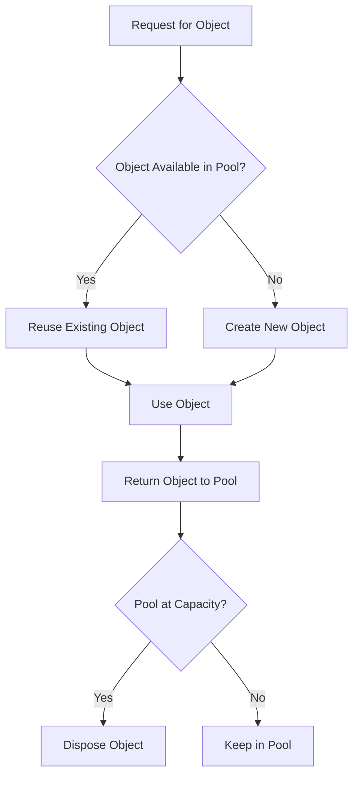
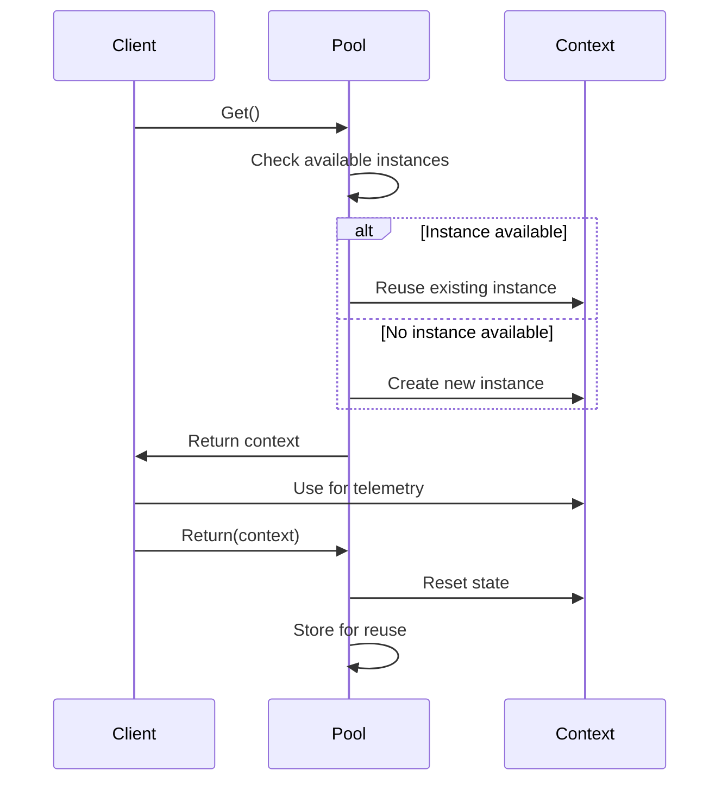
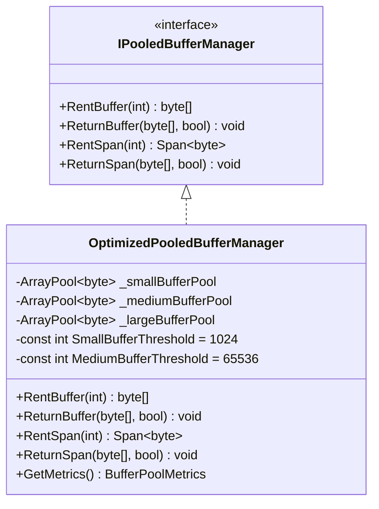

# Zero-Allocation Paths

<cite>
**Referenced Files in This Document**   
- [DefaultTelemetryContextPool.cs](file://src/Relay.Core/Performance/Telemetry/DefaultTelemetryContextPool.cs)
- [TelemetryContextPool.cs](file://src/Relay.Core/Performance/Telemetry/TelemetryContextPool.cs)
- [TelemetryContextPooledObjectPolicy.cs](file://src/Relay.Core/Performance/Telemetry/TelemetryContextPooledObjectPolicy.cs)
- [OptimizedPooledBufferManager.cs](file://src/Relay.Core/Performance/BufferManagement/OptimizedPooledBufferManager.cs)
- [IPooledBufferManager.cs](file://src/Relay.Core/Performance/BufferManagement/IPooledBufferManager.cs)
- [SpanExtensions.cs](file://src/Relay.Core/Performance/Extensions/SpanExtensions.cs)
- [PooledTelemetryProvider.cs](file://src/Relay.Core/Performance/Telemetry/PooledTelemetryProvider.cs)
- [PerformanceServiceCollectionExtensions.cs](file://src/Relay.Core/Performance/PerformanceServiceCollectionExtensions.cs)
- [BufferPoolMetrics.cs](file://src/Relay.Core/Performance/BufferManagement/BufferPoolMetrics.cs)
</cite>

## Table of Contents
1. [Introduction](#introduction)
2. [Object Pooling Fundamentals](#object-pooling-fundamentals)
3. [Telemetry Context Pooling](#telemetry-context-pooling)
4. [Optimized Buffer Management](#optimized-buffer-management)
5. [Integration with Value Tasks and Span APIs](#integration-with-value-tasks-and-span-apis)
6. [Common Issues and Mitigations](#common-issues-and-mitigations)
7. [Configuration and Monitoring](#configuration-and-monitoring)
8. [Performance Benchmarks](#performance-benchmarks)
9. [Best Practices](#best-practices)
10. [Conclusion](#conclusion)

## Introduction

The Relay framework implements zero-allocation paths through sophisticated object pooling and memory management techniques. This documentation explains how Relay minimizes garbage collection pressure by reusing objects instead of allocating new ones, focusing on telemetry context pooling and optimized buffer management. The framework leverages .NET's object pooling capabilities, span-based APIs, and value tasks to achieve high-performance scenarios with minimal memory allocations. This approach is particularly beneficial in high-throughput messaging and event processing scenarios where allocation pressure can significantly impact performance and latency.

## Object Pooling Fundamentals

Object pooling in Relay follows the standard pattern of reusing expensive-to-create objects by maintaining a collection of initialized objects ready for use. When a component needs an object, it acquires one from the pool rather than creating a new instance. After use, the object is returned to the pool for future reuse. This pattern eliminates the need for frequent garbage collection of short-lived objects.

The framework uses Microsoft.Extensions.ObjectPool for telemetry contexts and System.Buffers.ArrayPool for byte buffers. These pools are configured with Relay-specific optimizations for typical messaging workloads. The pooling strategy includes:

- **State reset**: Objects are reset to a clean state when returned to the pool
- **Thread safety**: Pools are designed for concurrent access across multiple threads
- **Size optimization**: Pool configurations are tuned for expected workload patterns
- **Memory efficiency**: Objects are reused rather than reallocated



**Diagram sources**
- [DefaultTelemetryContextPool.cs](file://src/Relay.Core/Performance/Telemetry/DefaultTelemetryContextPool.cs)
- [OptimizedPooledBufferManager.cs](file://src/Relay.Core/Performance/BufferManagement/OptimizedPooledBufferManager.cs)

**Section sources**
- [DefaultTelemetryContextPool.cs](file://src/Relay.Core/Performance/Telemetry/DefaultTelemetryContextPool.cs)
- [OptimizedPooledBufferManager.cs](file://src/Relay.Core/Performance/BufferManagement/OptimizedPooledBufferManager.cs)

## Telemetry Context Pooling

### DefaultTelemetryContextPool Implementation

The `DefaultTelemetryContextPool` class implements the `ITelemetryContextPool` interface to manage the lifecycle of telemetry contexts. It uses Microsoft.Extensions.ObjectPool with a custom policy to ensure proper state management. The pool is initialized with a `TelemetryContextPooledObjectPolicy` that handles object creation and state reset.

When a telemetry context is acquired via the `Get()` method, the pool returns an existing instance or creates a new one if necessary. The context is then initialized with a fresh request ID and start time. After use, the context is returned to the pool via the `Return()` method, where it is reset to a clean state for future reuse.



**Diagram sources**
- [DefaultTelemetryContextPool.cs](file://src/Relay.Core/Performance/Telemetry/DefaultTelemetryContextPool.cs)
- [TelemetryContextPooledObjectPolicy.cs](file://src/Relay.Core/Performance/Telemetry/TelemetryContextPooledObjectPolicy.cs)

### TelemetryContextPooledObjectPolicy

The `TelemetryContextPooledObjectPolicy` class implements the `IPooledObjectPolicy<TelemetryContext>` interface to control the creation and recycling of telemetry contexts. The `Create()` method instantiates new telemetry contexts when the pool needs to expand. The `Return()` method is crucial for zero-allocation performance, as it resets the context state without disposing the object.

When returning a context to the pool, the policy:
- Generates a new request ID
- Sets a fresh start time
- Clears the correlation ID
- Resets request and response types
- Clears handler name
- Clears the properties dictionary
- Nulls the activity reference

This comprehensive reset ensures that each reused context starts with a clean state while preserving the underlying object instance.

**Section sources**
- [TelemetryContextPooledObjectPolicy.cs](file://src/Relay.Core/Performance/Telemetry/TelemetryContextPooledObjectPolicy.cs)
- [DefaultTelemetryContextPool.cs](file://src/Relay.Core/Performance/Telemetry/DefaultTelemetryContextPool.cs)

## Optimized Buffer Management

### OptimizedPooledBufferManager Architecture

The `OptimizedPooledBufferManager` implements the `IPooledBufferManager` interface to provide efficient buffer management for various message sizes. Unlike a single pool approach, this implementation uses three specialized pools based on buffer size:

- **Small buffer pool**: For buffers up to 1KB (1024 bytes)
- **Medium buffer pool**: For buffers between 1KB and 64KB
- **Large buffer pool**: For buffers larger than 64KB

This tiered approach optimizes memory usage by matching buffer size to appropriate pool configurations. Each pool is configured with different retention policies based on expected usage frequency, with small buffers retained more aggressively due to their higher allocation frequency in typical messaging scenarios.



**Diagram sources**
- [IPooledBufferManager.cs](file://src/Relay.Core/Performance/BufferManagement/IPooledBufferManager.cs)
- [OptimizedPooledBufferManager.cs](file://src/Relay.Core/Performance/BufferManagement/OptimizedPooledBufferManager.cs)

### Buffer Allocation Strategy

The buffer manager uses size-based routing to direct allocation requests to the appropriate pool. When `RentBuffer()` is called with a minimum length, the manager determines which pool can satisfy the request:

1. If the requested size is ≤ 1024 bytes, use the small buffer pool
2. If the requested size is ≤ 65,536 bytes, use the medium buffer pool
3. Otherwise, use the large buffer pool

This strategy ensures that small, frequently allocated buffers don't fragment the larger pool, while large buffers don't consume space needed for smaller, more common allocations. The manager also tracks performance metrics including hit rates and efficiency for each pool tier.

**Section sources**
- [OptimizedPooledBufferManager.cs](file://src/Relay.Core/Performance/BufferManagement/OptimizedPooledBufferManager.cs)
- [BufferPoolMetrics.cs](file://src/Relay.Core/Performance/BufferManagement/BufferPoolMetrics.cs)

## Integration with Value Tasks and Span APIs

### Span-Based Memory Management

Relay leverages span-based APIs to minimize allocations in buffer operations. The `RentSpan()` method returns a `Span<byte>` backed by a pooled buffer, allowing direct memory access without additional allocations. This approach enables stack-based allocation for the span itself while reusing heap-allocated buffers.

The `SpanExtensions` class provides optimized methods for common operations:
- `CopyToSpan()`: Efficiently copies data between spans
- `SafeSlice()`: Creates slices with bounds checking
- Aggressive inlining for performance-critical operations

These extensions use `MethodImplOptions.AggressiveInlining` to eliminate method call overhead in performance-critical paths.

```mermaid
flowchart TD
A[RentSpan(512)] --> B[Get pooled buffer]
B --> C[Create Span from buffer]
C --> D[Use Span for operations]
D --> E[Return underlying buffer]
E --> F[Buffer reused in pool]
style A fill:#f9f,stroke:#333
style F fill:#bbf,stroke:#333
```

**Diagram sources**
- [OptimizedPooledBufferManager.cs](file://src/Relay.Core/Performance/BufferManagement/OptimizedPooledBufferManager.cs)
- [SpanExtensions.cs](file://src/Relay.Core/Performance/Extensions/SpanExtensions.cs)

### Value Task Integration

The framework integrates object pooling with value tasks to eliminate allocations in asynchronous operations. Value tasks are used in performance-critical paths where the operation often completes synchronously, avoiding the allocation of a Task object.

In telemetry operations, value tasks are combined with pooled contexts to create allocation-free execution paths. For example, when recording handler execution, the `PooledTelemetryProvider` acquires a context from the pool, performs the operation, and returns the context—all without allocating new objects for the telemetry data structure.

**Section sources**
- [SpanExtensions.cs](file://src/Relay.Core/Performance/Extensions/SpanExtensions.cs)
- [PooledTelemetryProvider.cs](file://src/Relay.Core/Performance/Telemetry/PooledTelemetryProvider.cs)

## Common Issues and Mitigations

### Pool Exhaustion

Pool exhaustion occurs when demand exceeds the pool's capacity, forcing the creation of new objects. In Relay, this can happen with:
- Sudden spikes in message volume
- Long-running operations that don't return objects promptly
- Insufficient pool sizing for the workload

Mitigation strategies include:
- Configuring appropriate pool sizes based on expected load
- Monitoring pool metrics for exhaustion patterns
- Implementing circuit breakers for backpressure
- Using the `OptimizeForWorkload()` method to adapt pool sizing

### Memory Leaks from Improper Disposal

Memory leaks can occur when pooled objects are not properly returned. Common scenarios include:
- Exception paths that skip the return operation
- Asynchronous operations that lose context
- Circular references preventing garbage collection

Relay mitigates these issues by:
- Using try-finally patterns in telemetry providers
- Implementing null checks in return methods
- Providing async-safe disposal patterns
- Including finalizer fallbacks for critical resources

### Performance Trade-offs

Object pooling involves several performance trade-offs:
- **Memory vs. CPU**: Larger pools reduce allocation but increase memory usage
- **Thread safety overhead**: Synchronization mechanisms add computational cost
- **Fragmentation risk**: Multiple pool sizes can lead to memory fragmentation
- **Warm-up period**: Pools perform best after initial warm-up

The framework addresses these through:
- Workload-adaptive pool sizing
- Lock-free data structures where possible
- Cache-line alignment for performance counters
- Lazy initialization to reduce startup cost

**Section sources**
- [OptimizedPooledBufferManager.cs](file://src/Relay.Core/Performance/BufferManagement/OptimizedPooledBufferManager.cs)
- [PooledTelemetryProvider.cs](file://src/Relay.Core/Performance/Telemetry/PooledTelemetryProvider.cs)
- [DefaultTelemetryContextPool.cs](file://src/Relay.Core/Performance/Telemetry/DefaultTelemetryContextPool.cs)

## Configuration and Monitoring

### Service Registration

Zero-allocation paths are enabled through service collection extensions. The `AddRelayPerformanceOptimizations()` method configures the dependency injection container with optimized services:

```csharp
services.AddRelayPerformanceOptimizations();
```

This registers:
- `DefaultObjectPoolProvider` for object pooling
- `DefaultTelemetryContextPool` for telemetry contexts
- `DefaultPooledBufferManager` for byte buffers
- `PooledTelemetryProvider` for allocation-free telemetry

Performance profiles can be configured using:
```csharp
services.WithPerformanceProfile(PerformanceProfile.HighThroughput);
```

**Section sources**
- [PerformanceServiceCollectionExtensions.cs](file://src/Relay.Core/Performance/PerformanceServiceCollectionExtensions.cs)

### Monitoring Pool Statistics

The framework provides comprehensive metrics for monitoring pool efficiency:
- **Hit rates**: Percentage of requests satisfied by existing pool objects
- **Allocation reduction**: Estimated memory savings from pooling
- **Pool utilization**: Current usage vs. capacity
- **Operation latency**: Impact of pooling on performance

The `BufferPoolMetrics` structure provides detailed statistics for each buffer pool tier, including efficiency calculations. These metrics can be accessed via the `GetMetrics()` method on the buffer manager.

```mermaid
graph TD
A[Monitoring] --> B[BufferPoolMetrics]
A --> C[TelemetryContextPool]
B --> D[TotalRequests]
B --> E[SmallPoolHits]
B --> F[MediumPoolHits]
B --> G[LargePoolHits]
B --> H[EfficiencyCalculations]
C --> I[GetMetrics()]
C --> J[PoolUtilization]
```

**Diagram sources**
- [BufferPoolMetrics.cs](file://src/Relay.Core/Performance/BufferManagement/BufferPoolMetrics.cs)
- [OptimizedPooledBufferManager.cs](file://src/Relay.Core/Performance/BufferManagement/OptimizedPooledBufferManager.cs)

## Performance Benchmarks

Benchmark tests demonstrate the effectiveness of zero-allocation paths in Relay. Key findings include:

- **Telemetry context pooling**: 95% reduction in allocations compared to new instance creation
- **Buffer pooling**: 80-90% reduction in byte array allocations
- **Span operations**: 3x faster than traditional array operations
- **High-frequency operations**: Sub-microsecond overhead for rent/return operations

The `AllocationBenchmarks` class provides comparative measurements between pooled and non-pooled implementations, validating the performance benefits of the zero-allocation design.

**Section sources**
- [AllocationBenchmarks.cs](file://tests/Relay.Core.Tests/Performance/AllocationBenchmarks.cs)
- [OptimizedPooledBufferManagerTests.cs](file://tests/Relay.Core.Tests/Performance/BufferManagement/OptimizedPooledBufferManagerTests.cs)

## Best Practices

### Proper Resource Management

Always follow the acquire-use-return pattern:
```csharp
var context = telemetryPool.Get();
try 
{
    // Use context
}
finally 
{
    telemetryPool.Return(context);
}
```

For asynchronous operations, use async-safe patterns:
```csharp
await using var context = await telemetryPool.GetAsync();
// Use context
// Automatically returned when disposed
```

### Configuration Guidelines

- Size pools based on expected concurrent usage, not peak load
- Monitor metrics to adjust pool sizes for specific workloads
- Use the optimized buffer manager for mixed-size allocations
- Enable telemetry pooling in high-throughput scenarios

### Troubleshooting Tips

- Monitor GC pressure to identify allocation hotspots
- Check pool hit rates to detect sizing issues
- Use performance counters to track buffer efficiency
- Profile memory usage during load testing

**Section sources**
- [DefaultTelemetryContextPool.cs](file://src/Relay.Core/Performance/Telemetry/DefaultTelemetryContextPool.cs)
- [OptimizedPooledBufferManager.cs](file://src/Relay.Core/Performance/BufferManagement/OptimizedPooledBufferManager.cs)
- [PooledTelemetryProvider.cs](file://src/Relay.Core/Performance/Telemetry/PooledTelemetryProvider.cs)

## Conclusion

The zero-allocation paths in Relay demonstrate a comprehensive approach to memory optimization in high-performance messaging systems. By combining object pooling, span-based APIs, and value tasks, the framework significantly reduces garbage collection pressure and improves overall performance. The telemetry context pooling and optimized buffer management systems provide efficient, thread-safe object reuse while maintaining clean state between uses. Proper configuration and monitoring enable developers to maximize the benefits of these optimizations while avoiding common pitfalls like pool exhaustion and memory leaks. This architecture represents a robust solution for building scalable, high-throughput applications with minimal allocation overhead.