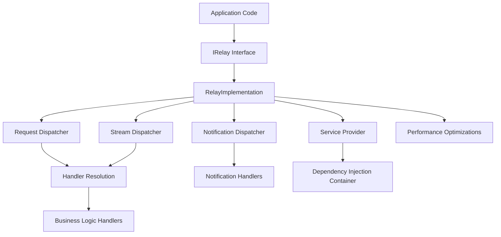
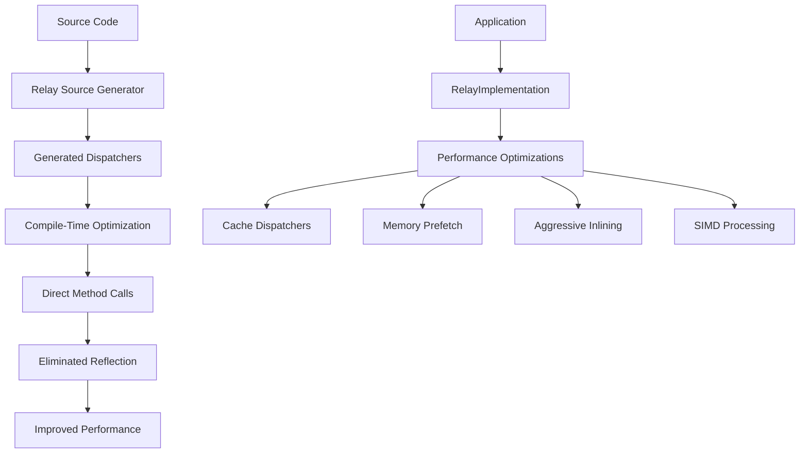
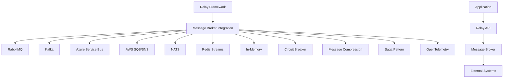
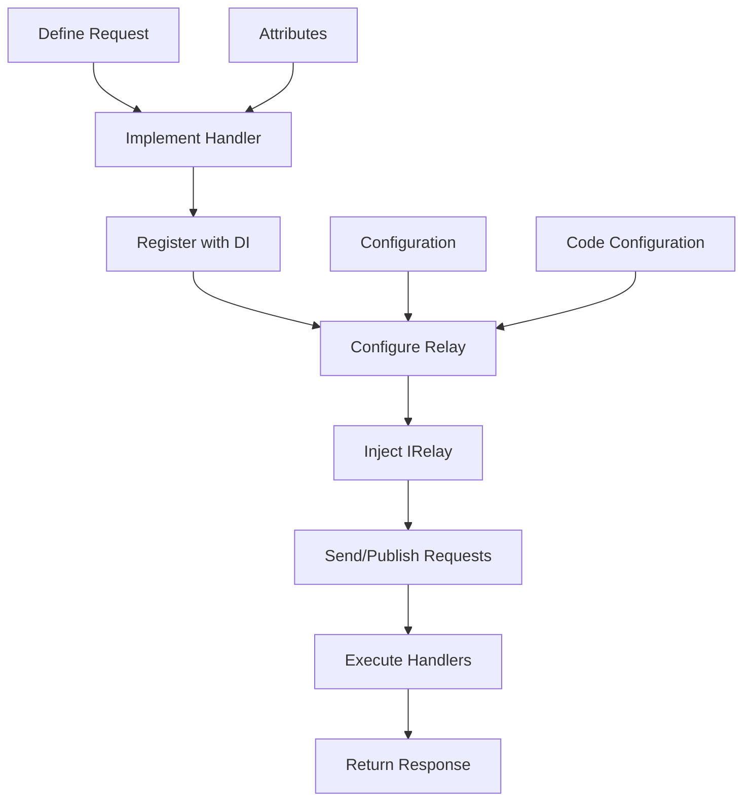
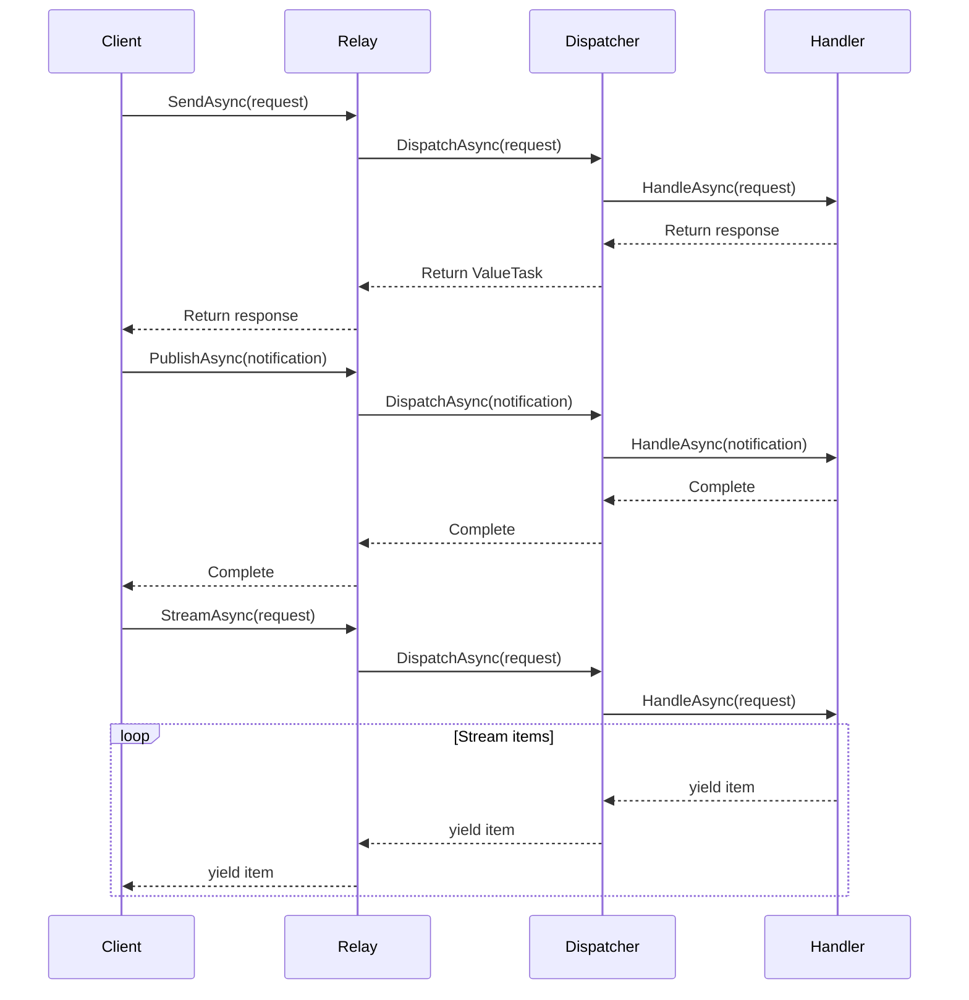

# Project Overview

<cite>
**Referenced Files in This Document**   
- [README.md](file://README.md)
- [Relay.csproj](file://src/Relay/Relay.csproj)
- [Relay.Core.csproj](file://src/Relay.Core/Relay.Core.csproj)
- [Relay.SourceGenerator.csproj](file://src/Relay.SourceGenerator/Relay.SourceGenerator.csproj)
- [Relay.MessageBroker.csproj](file://src/Relay.MessageBroker/Relay.MessageBroker.csproj)
- [RelayServiceCollectionExtensions.cs](file://src/Relay/RelayServiceCollectionExtensions.cs)
- [IRelay.cs](file://src/Relay.Core/Contracts/Core/IRelay.cs)
- [RelayImplementation.cs](file://src/Relay.Core/Implementation/Core/RelayImplementation.cs)
</cite>

## Table of Contents
1. [Introduction](#introduction)
2. [Core Architecture](#core-architecture)
3. [Source Generation and Performance](#source-generation-and-performance)
4. [Message Broker Integration](#message-broker-integration)
5. [AI-Powered Optimization](#ai-powered-optimization)
6. [Configuration and Usage](#configuration-and-usage)
7. [Data Flow and Processing](#data-flow-and-processing)
8. [Performance Profiles](#performance-profiles)
9. [Conclusion](#conclusion)

## Introduction

The Relay framework is a high-performance mediator implementation for .NET that leverages compile-time source generation to eliminate runtime reflection overhead. It provides a robust foundation for implementing CQRS (Command Query Responsibility Segregation) and event-driven architectures through its efficient request/response handling, notification publishing, and streaming capabilities.

Relay implements the mediator pattern with a focus on performance, scalability, and developer experience. The framework uses Roslyn source generators to create optimized dispatchers at compile time, resulting in direct method calls instead of reflection-based invocation. This approach enables Relay to achieve superior performance characteristics while maintaining type safety and compile-time validation.

The framework supports multiple messaging patterns including request/response, notification publishing with configurable strategies (sequential, parallel, parallel-when-all), and streaming via `IAsyncEnumerable<T>`. It integrates seamlessly with dependency injection containers and provides extensive configuration options for tuning behavior and performance characteristics.

**Section sources**
- [README.md](file://README.md#L1-L800)

## Core Architecture

The Relay framework is structured as a modular system with distinct components that work together to provide high-performance mediation capabilities. The architecture consists of several core components:

- **IRelay**: The primary interface for interacting with the mediator framework, providing methods for sending requests, publishing notifications, and streaming data
- **Dispatchers**: Components responsible for routing requests to appropriate handlers, including request dispatchers, stream dispatchers, and notification dispatchers
- **Source Generator**: A Roslyn-based source generator that creates optimized dispatcher implementations at compile time
- **Pipeline Behaviors**: Extensible cross-cutting concerns such as validation, caching, authorization, and retry policies
- **Configuration System**: A comprehensive options system for configuring framework behavior at both global and handler-specific levels

The core implementation follows a dependency injection pattern, with services registered through extension methods on `IServiceCollection`. The framework is designed to work with any DI container that supports Microsoft.Extensions.DependencyInjection abstractions.

**Diagram sources**
- [IRelay.cs](file://src/Relay.Core/Contracts/Core/IRelay.cs#L1-L49)
- [RelayImplementation.cs](file://src/Relay.Core/Implementation/Core/RelayImplementation.cs#L1-L349)

**Section sources**
- [IRelay.cs](file://src/Relay.Core/Contracts/Core/IRelay.cs#L1-L49)
- [RelayImplementation.cs](file://src/Relay.Core/Implementation/Core/RelayImplementation.cs#L1-L349)

## Source Generation and Performance

Relay's performance advantages stem from its use of compile-time source generation to eliminate runtime reflection. The framework includes a Roslyn source generator that analyzes handler registrations and generates optimized dispatcher code during compilation.

The source generator creates specialized dispatcher implementations that perform direct method calls to handlers, bypassing the need for reflection-based invocation. This results in significant performance improvements, particularly in high-throughput scenarios where the overhead of reflection would otherwise be substantial.

Key performance features include:

- **Compile-time dispatcher generation**: Eliminates runtime reflection by generating optimized dispatchers
- **ValueTask support**: Minimizes allocation overhead for asynchronous operations
- **Handler caching**: Improves handler lookup performance with configurable cache sizes
- **Zero-allocation hot paths**: Critical execution paths designed to minimize garbage collection pressure
- **SIMD batch processing**: Hardware-accelerated parallel request processing for 2-4x throughput improvement
- **AOT compilation support**: Native ahead-of-time compilation readiness with 30-50% faster startup times

The framework also includes performance profiles that allow developers to optimize for specific scenarios such as low memory usage, balanced performance, high throughput, or ultra-low latency requirements.

**Diagram sources**
- [Relay.SourceGenerator.csproj](file://src/Relay.SourceGenerator/Relay.SourceGenerator.csproj#L1-L97)
- [RelayImplementation.cs](file://src/Relay.Core/Implementation/Core/RelayImplementation.cs#L1-L349)

**Section sources**
- [Relay.SourceGenerator.csproj](file://src/Relay.SourceGenerator/Relay.SourceGenerator.csproj#L1-L97)
- [RelayImplementation.cs](file://src/Relay.Core/Implementation/Core/RelayImplementation.cs#L1-L349)

## Message Broker Integration

Relay provides comprehensive integration with message brokers to support distributed systems and event-driven architectures. The framework supports multiple broker implementations including RabbitMQ, Apache Kafka, Azure Service Bus, AWS SQS/SNS, NATS, and Redis Streams.

The message broker integration enables scenarios such as:

- **Distributed transaction orchestration**: Using the Saga pattern to coordinate operations across multiple services
- **Circuit breaker pattern**: Automatic failure detection and recovery with comprehensive telemetry
- **Message compression**: Reducing bandwidth usage through GZip, Deflate, and Brotli compression
- **OpenTelemetry integration**: Built-in distributed tracing and metrics for monitoring and observability

The integration is designed to work seamlessly with Relay's core mediation capabilities, allowing developers to publish messages to external brokers while maintaining the same programming model used for in-process notifications.

**Diagram sources**
- [Relay.MessageBroker.csproj](file://src/Relay.MessageBroker/Relay.MessageBroker.csproj#L1-L67)
- [README.md](file://README.md#L564-L700)

**Section sources**
- [Relay.MessageBroker.csproj](file://src/Relay.MessageBroker/Relay.MessageBroker.csproj#L1-L67)
- [README.md](file://README.md#L564-L700)

## AI-Powered Optimization

Relay incorporates AI-powered optimization features that leverage machine learning models to predict performance bottlenecks and suggest optimizations. These features are designed to help developers identify and resolve performance issues before they impact production systems.

The AI optimization engine analyzes code patterns, configuration settings, and runtime behavior to provide recommendations for improving performance, reliability, and resource utilization. It can detect suboptimal configurations, identify potential bottlenecks, and suggest alternative approaches based on historical data and best practices.

Key AI-powered features include:

- **Performance prediction**: Machine learning models that predict the impact of code changes on performance metrics
- **Bottleneck detection**: Automated identification of potential performance bottlenecks in handler implementations
- **Configuration optimization**: Recommendations for tuning performance profiles and configuration settings
- **Pattern recognition**: Detection of anti-patterns and suggestion of more efficient alternatives

These features are integrated into the development workflow through the Relay CLI tool, which provides commands for analyzing projects, generating optimization reports, and applying recommended changes.

**Section sources**
- [README.md](file://README.md#L42-L43)
- [RelayServiceCollectionExtensions.cs](file://src/Relay/RelayServiceCollectionExtensions.cs#L58-L74)

## Configuration and Usage

Relay provides a flexible configuration system that supports multiple approaches for setting up the framework. Configuration can be applied through code, configuration files, or a combination of both.

The framework offers several extension methods for registering services with the dependency injection container:

- `AddRelay()`: Registers core Relay services with generated dispatchers
- `AddRelayWithFeatures()`: Adds Relay with commonly used features like validation and exception handling
- `AddRelayWithAdvancedFeatures()`: Includes advanced capabilities such as AI optimization and performance monitoring
- `AddRelayForScenario()`: Configures Relay for specific scenarios like web APIs, high-performance systems, or microservices
- `AddRelayFromConfiguration()`: Loads configuration from appsettings.json or other configuration sources

Usage of the framework follows a consistent pattern across different scenarios:

1. Define requests and handlers using the appropriate interfaces
2. Register handlers and configure the framework through DI
3. Inject IRelay into application components
4. Use SendAsync, PublishAsync, or StreamAsync methods to interact with the mediator

The framework supports both imperative and attribute-based configuration, allowing developers to choose the approach that best fits their needs.

**Diagram sources**
- [RelayServiceCollectionExtensions.cs](file://src/Relay/RelayServiceCollectionExtensions.cs#L38-L255)
- [README.md](file://README.md#L87-L244)

**Section sources**
- [RelayServiceCollectionExtensions.cs](file://src/Relay/RelayServiceCollectionExtensions.cs#L38-L255)
- [README.md](file://README.md#L87-L244)

## Data Flow and Processing

The data flow in Relay follows a well-defined pattern that ensures efficient processing of requests, notifications, and streaming operations. The framework handles three primary types of operations:

1. **Request/Response**: A request is sent to the mediator, which routes it to the appropriate handler and returns a response
2. **Notification Publishing**: A notification is published to the mediator, which delivers it to all registered handlers
3. **Streaming**: A streaming request is processed, returning an IAsyncEnumerable<T> that can be consumed incrementally

For request/response operations, the flow begins with a call to SendAsync on the IRelay interface. The request is passed to the request dispatcher, which resolves the appropriate handler and invokes it. The handler executes the business logic and returns a response, which is then returned to the caller.

Notification publishing follows a similar pattern, with PublishAsync delivering the notification to all registered handlers. The framework supports multiple publishing strategies including sequential execution, parallel execution, and parallel execution with continuation on exceptions.

Streaming operations use a specialized dispatcher that returns an IAsyncEnumerable<T>, allowing consumers to process results incrementally without loading all data into memory at once.

**Diagram sources**
- [IRelay.cs](file://src/Relay.Core/Contracts/Core/IRelay.cs#L1-L49)
- [RelayImplementation.cs](file://src/Relay.Core/Implementation/Core/RelayImplementation.cs#L1-L349)

**Section sources**
- [IRelay.cs](file://src/Relay.Core/Contracts/Core/IRelay.cs#L1-L49)
- [RelayImplementation.cs](file://src/Relay.Core/Implementation/Core/RelayImplementation.cs#L1-L349)

## Performance Profiles

Relay offers four pre-configured performance profiles that allow developers to optimize the framework for specific scenarios:

- **LowMemory**: Optimized for containerized or serverless environments with minimal memory usage
- **Balanced**: Default profile providing a good balance of performance and resource utilization
- **HighThroughput**: Optimized for high-traffic APIs with maximum throughput
- **UltraLowLatency**: Designed for real-time systems requiring the lowest possible latency

Each profile configures various performance-related options such as dispatcher caching, handler caching, memory prefetching, and SIMD optimizations. Developers can also create custom configurations by directly setting performance options.

The performance profiles provide significant improvements in key metrics:

- **SIMD Batch Processing**: 2-4x throughput increase
- **Handler Cache**: 50-70% faster handler lookup
- **Memory Prefetch**: 10-30% latency reduction
- **AOT Compilation**: 30-50% faster startup
- **Zero Allocation**: Eliminates GC pressure on hot paths

These profiles can be applied using the WithPerformanceProfile extension method during service registration.

**Section sources**
- [README.md](file://README.md#L119-L170)
- [RelayImplementation.cs](file://src/Relay.Core/Implementation/Core/RelayImplementation.cs#L107-L154)

## Conclusion

The Relay framework represents a significant advancement in mediator pattern implementations for .NET, combining high-performance characteristics with developer-friendly features. By leveraging compile-time source generation, the framework eliminates the runtime reflection overhead that traditionally impacts mediator performance, enabling direct method calls and optimized dispatching.

The architecture supports a wide range of use cases from simple request/response scenarios to complex distributed systems with message broker integration and AI-powered optimization. The framework's modular design allows developers to include only the features they need while providing extensibility points for custom requirements.

With its comprehensive configuration system, multiple performance profiles, and support for modern .NET features like ValueTask and IAsyncEnumerable, Relay provides a robust foundation for building scalable, maintainable applications that follow CQRS and event-driven architectural patterns.