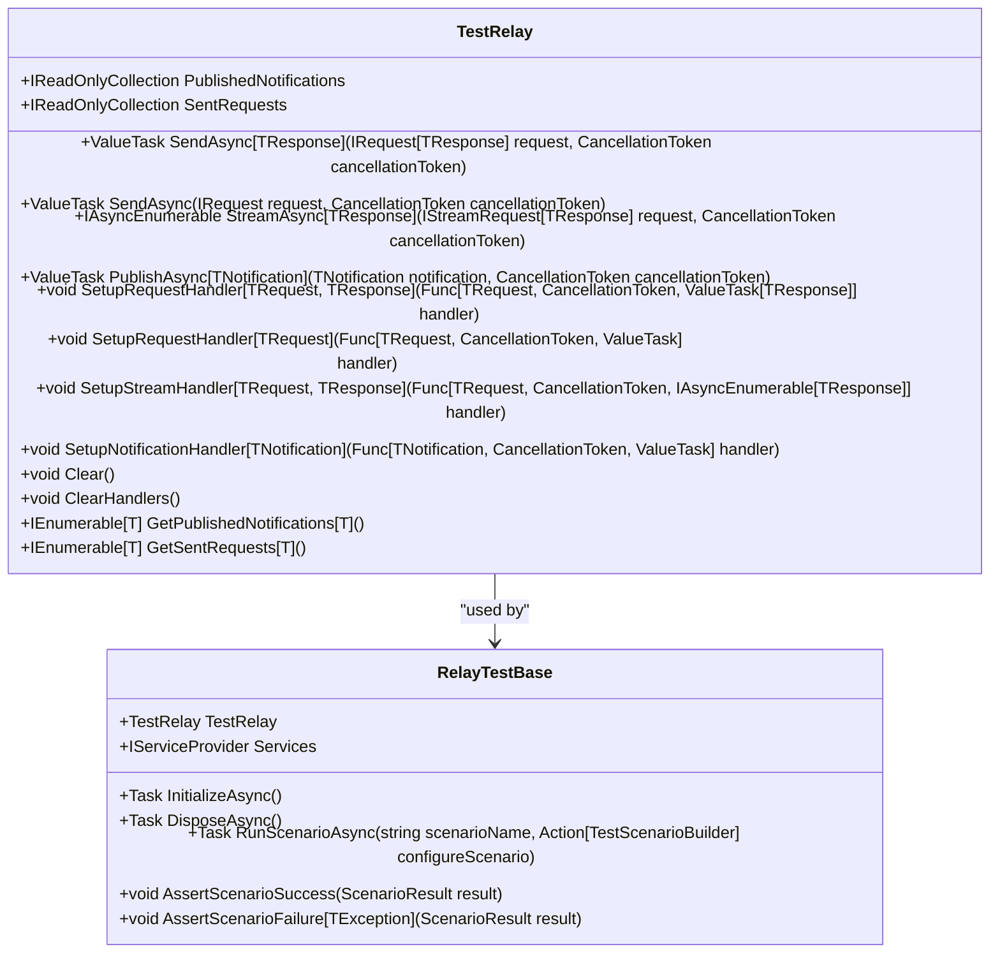
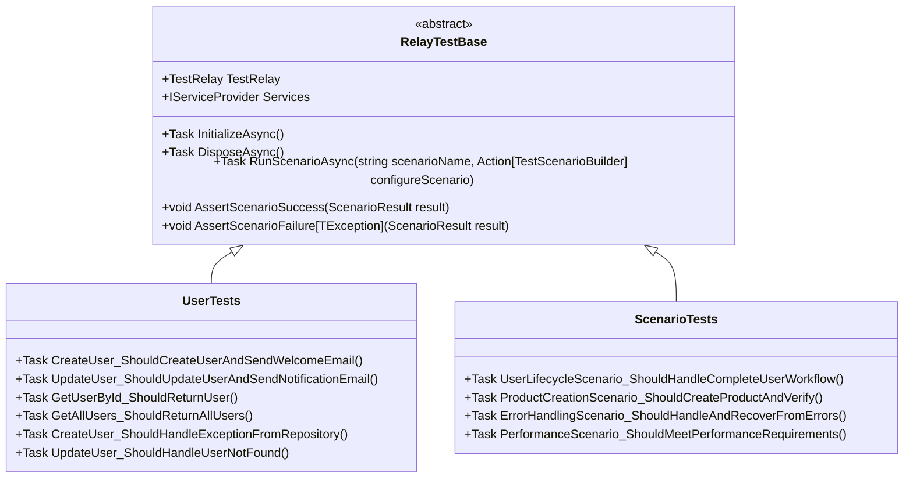
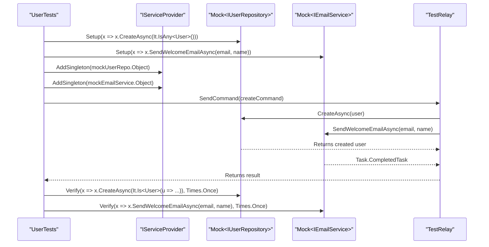
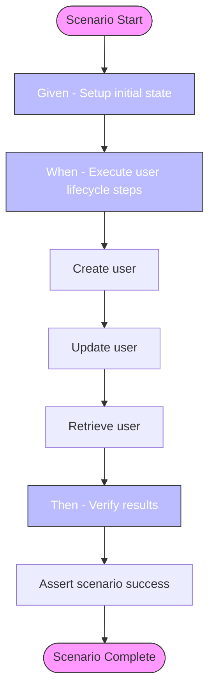
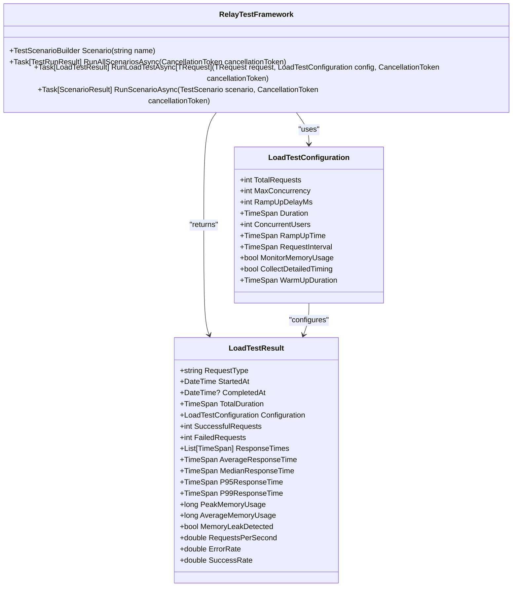
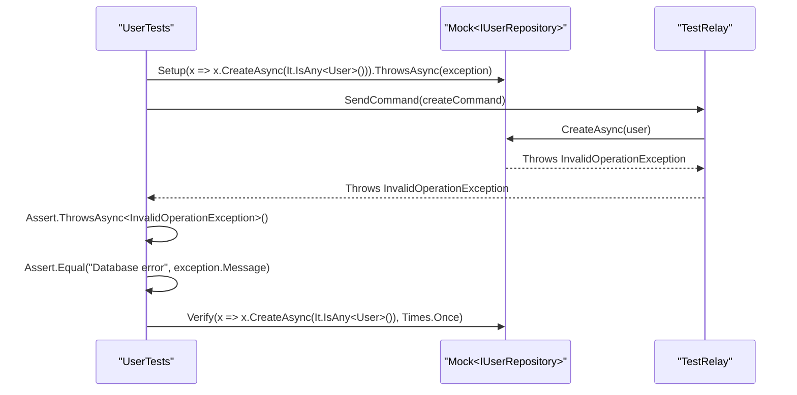
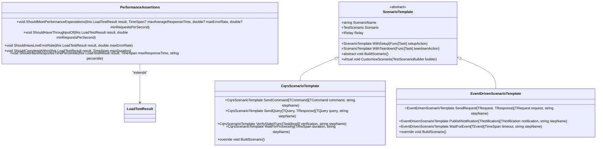

# Advanced Testing Sample

<cite>
**Referenced Files in This Document**   
- [Relay.Core.Testing.csproj](file://src/Relay.Core.Testing/Relay.Core.Testing.csproj)
- [README.md](file://src/Relay.Core.Testing/README.md)
- [TestRelay.cs](file://src/Relay.Core.Testing/Core/TestRelay.cs)
- [RelayTestBase.cs](file://src/Relay.Core.Testing/Core/RelayTestBase.cs)
- [RelayTestFramework.cs](file://src/Relay.Core.Testing/Core/RelayTestFramework.cs)
- [LoadTestConfiguration.cs](file://src/Relay.Core.Testing/Configuration/LoadTestConfiguration.cs)
- [LoadTestResult.cs](file://src/Relay.Core.Testing/Results/LoadTestResult.cs)
- [TestScenarioBuilder.cs](file://src/Relay.Core.Testing/Builders/TestScenarioBuilder.cs)
- [ScenarioTemplate.cs](file://src/Relay.Core.Testing/Scenarios/ScenarioTemplate.cs)
- [UserTests.cs](file://samples/Relay.Core.Testing.Sample/UserTests.cs)
- [ScenarioTests.cs](file://samples/Relay.Core.Testing.Sample/ScenarioTests.cs)
- [Program.cs](file://samples/Relay.Core.Testing.Sample/Program.cs)
- [README.md](file://samples/Relay.Core.Testing.Sample/README.md)
</cite>

## Table of Contents
1. [Introduction](#introduction)
2. [Core Testing Components](#core-testing-components)
3. [Test Organization and Structure](#test-organization-and-structure)
4. [Mocking and Dependency Management](#mocking-and-dependency-management)
5. [Scenario-Based Testing](#scenario-based-testing)
6. [Performance and Load Testing](#performance-and-load-testing)
7. [Error Handling and Recovery Testing](#error-handling-and-recovery-testing)
8. [Advanced Testing Utilities](#advanced-testing-utilities)
9. [Best Practices and Patterns](#best-practices-and-patterns)
10. [Conclusion](#conclusion)

## Introduction

The Relay.Core.Testing framework provides a comprehensive suite of tools for testing Relay-based applications, enabling developers to create robust, maintainable, and high-performance tests. This document explores the advanced testing capabilities demonstrated in the Relay.Core.Testing.Sample application, focusing on sophisticated testing patterns, scenario-based testing, performance validation, and error handling verification.

The framework supports multiple testing frameworks (xUnit, NUnit, MSTest) and offers specialized utilities for async testing, test isolation, dependency mocking, and performance profiling. The sample application showcases real-world testing scenarios, from basic unit tests to complex integration tests that validate complete workflows and system behavior under load.

**Section sources**
- [README.md](file://samples/Relay.Core.Testing.Sample/README.md#L1-L179)
- [Program.cs](file://samples/Relay.Core.Testing.Sample/Program.cs#L1-L20)

## Core Testing Components

The Relay.Core.Testing framework is built around several core components that work together to provide a seamless testing experience. At the heart of the framework is the `TestRelay` class, which implements the `IRelay` interface and provides test-specific functionality for capturing requests, notifications, and responses.

The `TestRelay` class maintains collections of sent requests and published notifications, allowing tests to verify that the correct messages were sent through the system. It also supports setting up custom handlers for specific request types, enabling precise control over test behavior and response generation.

**Diagram sources**
- [TestRelay.cs](file://src/Relay.Core.Testing/Core/TestRelay.cs#L1-L234)
- [RelayTestBase.cs](file://src/Relay.Core.Testing/Core/RelayTestBase.cs#L1-L178)

**Section sources**
- [TestRelay.cs](file://src/Relay.Core.Testing/Core/TestRelay.cs#L1-L234)
- [RelayTestBase.cs](file://src/Relay.Core.Testing/Core/RelayTestBase.cs#L1-L178)

## Test Organization and Structure

The Relay.Core.Testing framework promotes a structured approach to test organization through the use of base classes and inheritance hierarchies. The `RelayTestBase` class serves as the foundation for all tests, implementing `IAsyncLifetime` to ensure proper initialization and cleanup of test resources.

Tests are organized into logical groups based on functionality, with each test class inheriting from `RelayTestBase` and focusing on a specific domain area. The sample application demonstrates this pattern with test classes like `UserTests` and `ScenarioTests`, each containing multiple test methods that validate different aspects of the system.

The framework supports both xUnit and other testing frameworks through conditional compilation, allowing developers to choose their preferred testing approach. Test methods are typically annotated with framework-specific attributes like `[Fact]` or `[Test]` to indicate executable test cases.

**Diagram sources**
- [RelayTestBase.cs](file://src/Relay.Core.Testing/Core/RelayTestBase.cs#L1-L178)
- [UserTests.cs](file://samples/Relay.Core.Testing.Sample/UserTests.cs#L1-L254)
- [ScenarioTests.cs](file://samples/Relay.Core.Testing.Sample/ScenarioTests.cs#L1-L207)

**Section sources**
- [RelayTestBase.cs](file://src/Relay.Core.Testing/Core/RelayTestBase.cs#L1-L178)
- [UserTests.cs](file://samples/Relay.Core.Testing.Sample/UserTests.cs#L1-L254)
- [ScenarioTests.cs](file://samples/Relay.Core.Testing.Sample/ScenarioTests.cs#L1-L207)

## Mocking and Dependency Management

The Relay.Core.Testing framework provides robust support for dependency injection and mocking, allowing tests to isolate components and verify interactions. The `Services` property in `RelayTestBase` exposes an `IServiceProvider` that can be used to register mock implementations of dependencies.

The sample application demonstrates this approach by using Moq to create mock instances of repositories and services, which are then registered with the test's service provider. This enables tests to control the behavior of dependencies and verify that they are called with the expected parameters.

**Diagram sources**
- [UserTests.cs](file://samples/Relay.Core.Testing.Sample/UserTests.cs#L1-L254)
- [RelayTestBase.cs](file://src/Relay.Core.Testing/Core/RelayTestBase.cs#L1-L178)

**Section sources**
- [UserTests.cs](file://samples/Relay.Core.Testing.Sample/UserTests.cs#L1-L254)

## Scenario-Based Testing

The Relay.Core.Testing framework excels at scenario-based testing, allowing developers to define and execute complex workflows that span multiple operations and system components. The `RunScenarioAsync` method in `RelayTestBase` provides a fluent API for building test scenarios with clear separation of setup, execution, and verification steps.

Scenarios are constructed using the `TestScenarioBuilder` class, which supports various step types including sending requests, publishing notifications, verifying conditions, and waiting for asynchronous operations to complete. This approach makes tests more readable and maintainable by clearly expressing the intended workflow.

**Diagram sources**
- [ScenarioTests.cs](file://samples/Relay.Core.Testing.Sample/ScenarioTests.cs#L1-L207)
- [RelayTestBase.cs](file://src/Relay.Core.Testing/Core/RelayTestBase.cs#L1-L178)
- [TestScenarioBuilder.cs](file://src/Relay.Core.Testing/Builders/TestScenarioBuilder.cs#L1-L94)

**Section sources**
- [ScenarioTests.cs](file://samples/Relay.Core.Testing.Sample/ScenarioTests.cs#L1-L207)

## Performance and Load Testing

The Relay.Core.Testing framework includes comprehensive support for performance and load testing, enabling developers to validate system behavior under realistic conditions. The `LoadTestConfiguration` class provides a rich set of options for configuring load tests, including total requests, maximum concurrency, ramp-up time, and monitoring options.

The `RelayTestFramework` class exposes the `RunLoadTestAsync` method, which executes load tests against specified request types and returns detailed performance metrics. These metrics include response time percentiles (P95, P99), throughput (requests per second), error rates, and memory usage statistics.

**Diagram sources**
- [LoadTestConfiguration.cs](file://src/Relay.Core.Testing/Configuration/LoadTestConfiguration.cs#L1-L106)
- [LoadTestResult.cs](file://src/Relay.Core.Testing/Results/LoadTestResult.cs#L1-L45)
- [RelayTestFramework.cs](file://src/Relay.Core.Testing/Core/RelayTestFramework.cs#L31-L178)

**Section sources**
- [LoadTestConfiguration.cs](file://src/Relay.Core.Testing/Configuration/LoadTestConfiguration.cs#L1-L106)
- [LoadTestResult.cs](file://src/Relay.Core.Testing/Results/LoadTestResult.cs#L1-L45)

## Error Handling and Recovery Testing

The Relay.Core.Testing framework provides robust support for testing error conditions and recovery scenarios. Tests can verify that the system handles exceptions correctly, maintains data consistency, and provides appropriate error responses to clients.

The sample application demonstrates several error handling patterns, including testing repository exceptions, handling user not found scenarios, and validating error recovery mechanisms. The framework's assertion methods make it easy to verify that specific exception types are thrown and that error messages contain expected content.

**Diagram sources**
- [UserTests.cs](file://samples/Relay.Core.Testing.Sample/UserTests.cs#L1-L254)

**Section sources**
- [UserTests.cs](file://samples/Relay.Core.Testing.Sample/UserTests.cs#L1-L254)

## Advanced Testing Utilities

The Relay.Core.Testing framework includes a variety of advanced utilities that enhance the testing experience and enable sophisticated test scenarios. These utilities include performance assertions, scenario templates, and comprehensive assertion helpers.

The framework provides specialized assertion methods for validating performance characteristics, such as `ShouldMeetPerformanceExpectations`, `ShouldHaveThroughputOf`, and `ShouldCompleteWithin`. These methods make it easy to enforce performance requirements in tests and ensure that the system meets its SLAs.

**Diagram sources**
- [PerformanceAssertions.cs](file://src/Relay.Core.Testing/Assertions/PerformanceAssertions.cs#L173-L282)
- [ScenarioTemplate.cs](file://src/Relay.Core.Testing/Scenarios/ScenarioTemplate.cs#L1-L109)
- [CqrsScenarioTemplate.cs](file://src/Relay.Core.Testing/Scenarios/CqrsScenarioTemplate.cs#L67-L110)
- [EventDrivenScenarioTemplate.cs](file://src/Relay.Core.Testing/Scenarios/EventDrivenScenarioTemplate.cs#L103-L130)

**Section sources**
- [PerformanceAssertions.cs](file://src/Relay.Core.Testing/Assertions/PerformanceAssertions.cs#L173-L282)
- [ScenarioTemplate.cs](file://src/Relay.Core.Testing/Scenarios/ScenarioTemplate.cs#L1-L109)

## Best Practices and Patterns

The Relay.Core.Testing framework encourages several best practices and patterns that lead to more effective and maintainable tests. These include test isolation, clear naming conventions, scenario organization, and comprehensive error coverage.

Key patterns demonstrated in the sample application include:
- **Test Isolation**: Each test is independent with proper cleanup, ensuring that tests do not interfere with each other.
- **Mock Verification**: Exact behavior of dependencies is verified, ensuring that components interact correctly.
- **Scenario Organization**: Related operations are grouped into scenarios, making complex workflows easier to understand and maintain.
- **Error Coverage**: Both success and failure paths are tested, ensuring robust error handling.
- **Performance Awareness**: Performance requirements are included in tests, ensuring that the system meets its performance goals.
- **Maintainable Tests**: Clear naming and organization conventions make tests easy to read and understand.

The framework also supports advanced patterns like setup and teardown actions, custom scenario templates, and reusable test components, enabling teams to build a comprehensive testing library that can be shared across projects.

**Section sources**
- [README.md](file://samples/Relay.Core.Testing.Sample/README.md#L1-L179)

## Conclusion

The Relay.Core.Testing framework provides a powerful and flexible foundation for testing Relay-based applications. By combining robust mocking capabilities, scenario-based testing, performance validation, and comprehensive error handling, the framework enables developers to create high-quality tests that ensure system reliability and performance.

The sample application demonstrates how to effectively use these capabilities to test complex workflows, validate performance characteristics, and verify error recovery mechanisms. By following the patterns and best practices shown in the sample, teams can build a comprehensive test suite that provides confidence in their application's correctness and reliability.

The framework's support for multiple testing frameworks, extensible architecture, and rich feature set make it an excellent choice for teams looking to improve their testing practices and ensure the quality of their Relay-based applications.