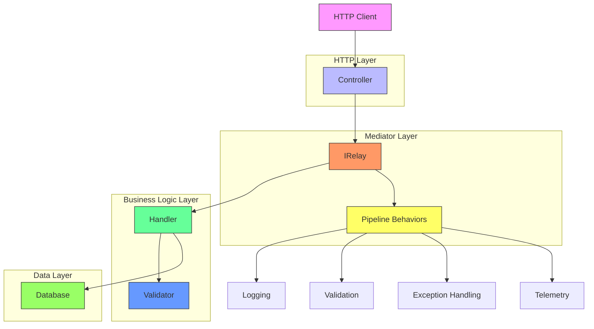
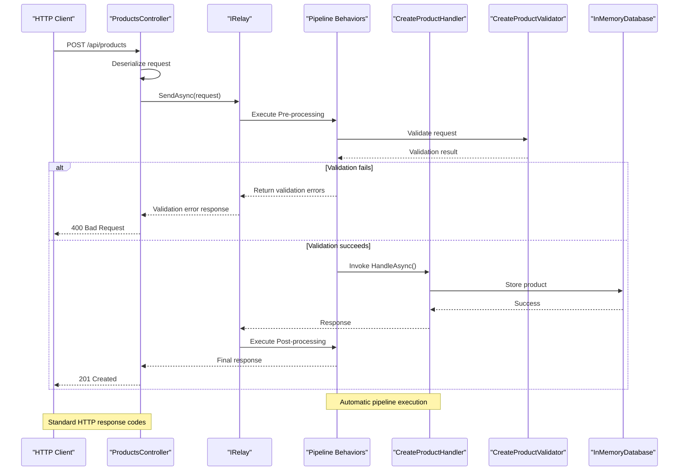
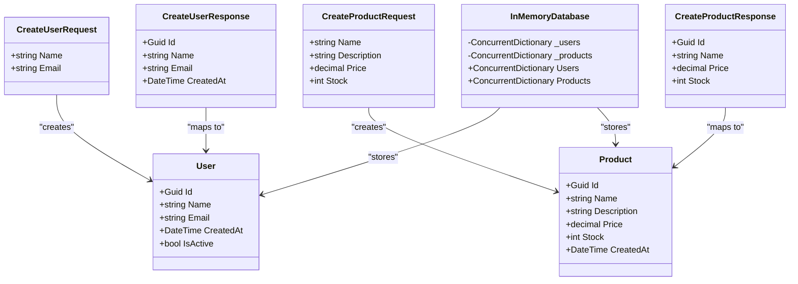
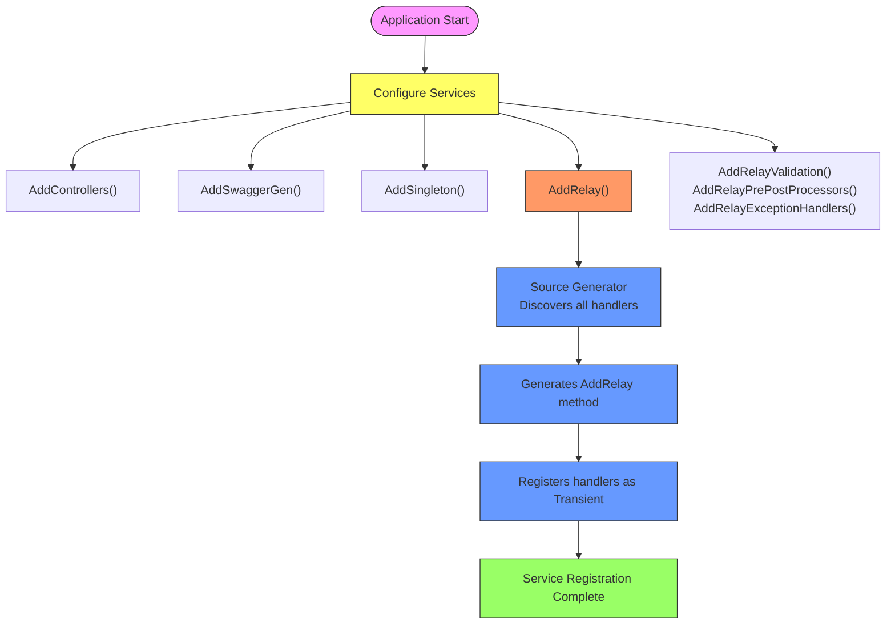

# Controller API Sample

<cite>
**Referenced Files in This Document**   
- [Program.cs](file://samples/Relay.ControllerApiSample/Program.cs)
- [ProductsController.cs](file://samples/Relay.ControllerApiSample/Controllers/ProductsController.cs)
- [UsersController.cs](file://samples/Relay.ControllerApiSample/Controllers/UsersController.cs)
- [CreateUserHandler.cs](file://samples/Relay.ControllerApiSample/Features/Users/CreateUserHandler.cs)
- [CreateProductHandler.cs](file://samples/Relay.ControllerApiSample/Features/Products/CreateProductHandler.cs)
- [CreateUserValidator.cs](file://samples/Relay.ControllerApiSample/Features/Users/CreateUserValidator.cs)
- [InMemoryDatabase.cs](file://samples/Relay.ControllerApiSample/Infrastructure/InMemoryDatabase.cs)
- [User.cs](file://samples/Relay.ControllerApiSample/Models/User.cs)
- [Product.cs](file://samples/Relay.ControllerApiSample/Models/Product.cs)
- [IRelay.cs](file://src/Relay.Core/Contracts/Core/IRelay.cs)
- [RelayServiceCollectionExtensions.cs](file://src/Relay.SourceGenerator/Generators/DIRegistrationGenerator.cs)
</cite>

## Table of Contents
1. [Introduction](#introduction)
2. [Architecture Overview](#architecture-overview)
3. [Core Components](#core-components)
4. [Request Flow and Invocation Relationships](#request-flow-and-invocation-relationships)
5. [Domain Model and Data Structures](#domain-model-and-data-structures)
6. [Configuration and Dependency Injection](#configuration-and-dependency-injection)
7. [Implementation Details](#implementation-details)
8. [Usage Patterns and Examples](#usage-patterns-and-examples)
9. [Common Issues and Solutions](#common-issues-and-solutions)
10. [Adapting to Existing Applications](#adapting-to-existing-applications)

## Introduction
The Controller API Sample demonstrates the integration of the Relay framework with traditional ASP.NET Core MVC controllers. This pattern combines the familiar controller-based architecture with Relay's mediator pattern, providing a clean separation of concerns while maintaining the benefits of modern request handling. The sample showcases how controllers act as HTTP entry points that delegate business logic to handlers through the IRelay interface, enabling testable, maintainable, and scalable API development.

## Architecture Overview



**Diagram sources**
- [ProductsController.cs](file://samples/Relay.ControllerApiSample/Controllers/ProductsController.cs)
- [CreateUserHandler.cs](file://samples/Relay.ControllerApiSample/Features/Users/CreateUserHandler.cs)
- [IRelay.cs](file://src/Relay.Core/Contracts/Core/IRelay.cs)

**Section sources**
- [README.md](file://samples/Relay.ControllerApiSample/README.md)
- [Program.cs](file://samples/Relay.ControllerApiSample/Program.cs)

## Core Components

### Controller Layer
The controller layer serves as the HTTP interface, handling routing, authentication, and response formatting. Controllers inject the IRelay interface to delegate request processing to appropriate handlers.

### Relay Mediator
The IRelay interface acts as the central mediator, responsible for routing requests to their corresponding handlers, executing pipeline behaviors, and managing the request lifecycle.

### Handler Layer
Handlers contain the business logic for specific operations. Each handler implements IRequestHandler<TRequest, TResponse> and is automatically registered via the source generator.

### Validation Layer
Validators implement IValidationRule<T> to enforce business rules before request processing, providing automatic validation within the pipeline.

**Section sources**
- [ProductsController.cs](file://samples/Relay.ControllerApiSample/Controllers/ProductsController.cs)
- [CreateUserHandler.cs](file://samples/Relay.ControllerApiSample/Features/Users/CreateUserHandler.cs)
- [CreateUserValidator.cs](file://samples/Relay.ControllerApiSample/Features/Users/CreateUserValidator.cs)

## Request Flow and Invocation Relationships



**Diagram sources**
- [ProductsController.cs](file://samples/Relay.ControllerApiSample/Controllers/ProductsController.cs)
- [CreateProductHandler.cs](file://samples/Relay.ControllerApiSample/Features/Products/CreateProductHandler.cs)
- [IRelay.cs](file://src/Relay.Core/Contracts/Core/IRelay.cs)

**Section sources**
- [ProductsController.cs](file://samples/Relay.ControllerApiSample/Controllers/ProductsController.cs)
- [CreateProductHandler.cs](file://samples/Relay.ControllerApiSample/Features/Products/CreateProductHandler.cs)

## Domain Model and Data Structures



**Diagram sources**
- [User.cs](file://samples/Relay.ControllerApiSample/Models/User.cs)
- [Product.cs](file://samples/Relay.ControllerApiSample/Models/Product.cs)
- [CreateUser.cs](file://samples/Relay.ControllerApiSample/Features/Users/CreateUser.cs)
- [CreateProduct.cs](file://samples/Relay.ControllerApiSample/Features/Products/CreateProduct.cs)
- [InMemoryDatabase.cs](file://samples/Relay.ControllerApiSample/Infrastructure/InMemoryDatabase.cs)

**Section sources**
- [User.cs](file://samples/Relay.ControllerApiSample/Models/User.cs)
- [Product.cs](file://samples/Relay.ControllerApiSample/Models/Product.cs)
- [InMemoryDatabase.cs](file://samples/Relay.ControllerApiSample/Infrastructure/InMemoryDatabase.cs)

## Configuration and Dependency Injection



**Diagram sources**
- [Program.cs](file://samples/Relay.ControllerApiSample/Program.cs)
- [RelayServiceCollectionExtensions.cs](file://src/Relay.SourceGenerator/Generators/DIRegistrationGenerator.cs)

**Section sources**
- [Program.cs](file://samples/Relay.ControllerApiSample/Program.cs)
- [RelayServiceCollectionExtensions.cs](file://src/Relay.SourceGenerator/Generators/DIRegistrationGenerator.cs)

## Implementation Details

### Controller Implementation
Controllers follow the standard ASP.NET Core pattern with dependency injection of IRelay and ILogger. The IRelay interface is used to send requests to handlers, maintaining separation between HTTP concerns and business logic.

### Handler Implementation
Handlers implement IRequestHandler<TRequest, TResponse> and contain the core business logic. They receive dependencies through constructor injection and return responses via ValueTask for optimal performance.

### Validation Implementation
Validators implement IValidationRule<T> and are automatically executed within the pipeline. They return validation errors as IEnumerable<string>, which are transformed into appropriate HTTP responses.

### Source Generator Integration
The Relay source generator automatically discovers handlers at compile-time and generates optimized registration code, eliminating runtime reflection and improving performance.

**Section sources**
- [ProductsController.cs](file://samples/Relay.ControllerApiSample/Controllers/ProductsController.cs)
- [CreateUserHandler.cs](file://samples/Relay.ControllerApiSample/Features/Users/CreateUserHandler.cs)
- [CreateUserValidator.cs](file://samples/Relay.ControllerApiSample/Features/Users/CreateUserValidator.cs)
- [RelayServiceCollectionExtensions.cs](file://src/Relay.SourceGenerator/Generators/DIRegistrationGenerator.cs)

## Usage Patterns and Examples

### Basic Request Handling
```csharp
[HttpPost]
public async Task<ActionResult<CreateUserResponse>> CreateUser(
    [FromBody] CreateUserRequest request,
    CancellationToken cancellationToken)
{
    var response = await _relay.SendAsync(request, cancellationToken);
    return CreatedAtAction(nameof(GetUser), new { id = response.Id }, response);
}
```

### Error Handling Pattern
```csharp
[HttpGet("{id:guid}")]
public async Task<ActionResult<GetUserResponse>> GetUser(Guid id, CancellationToken cancellationToken)
{
    var request = new GetUserRequest(id);
    var response = await _relay.SendAsync(request, cancellationToken);

    if (response == null)
    {
        return NotFound();
    }

    return Ok(response);
}
```

### Configuration Options
The following configuration options are available in appsettings.json:

| Configuration Key | Default Value | Description |
|-------------------|---------------|-------------|
| Relay:EnableDetailedErrors | true | Enables detailed error messages in responses |
| Relay:Timeout | "00:00:30" | Request timeout duration |
| Logging:LogLevel:Relay | Debug | Logging level for Relay framework components |

**Section sources**
- [UsersController.cs](file://samples/Relay.ControllerApiSample/Controllers/UsersController.cs)
- [ProductsController.cs](file://samples/Relay.ControllerApiSample/Controllers/ProductsController.cs)
- [appsettings.json](file://samples/Relay.ControllerApiSample/appsettings.json)

## Common Issues and Solutions

### Issue: Handler Not Found
**Symptom**: HandlerNotFoundException when sending requests
**Solution**: Ensure the handler class implements IRequestHandler<TRequest, TResponse> and is in a namespace scanned by the source generator

### Issue: Validation Not Executing
**Symptom**: Validation rules are not being applied
**Solution**: Verify that AddRelayValidation() is called in Program.cs and the validator implements IValidationRule<T>

### Issue: Dependency Injection Failures
**Symptom**: Service resolution errors during handler execution
**Solution**: Check that all dependencies are registered in the service container and have appropriate lifetimes

### Issue: Source Generator Not Running
**Symptom**: Handlers not automatically registered
**Solution**: Verify the project file includes the source generator as an analyzer reference

**Section sources**
- [README.md](file://samples/Relay.ControllerApiSample/README.md)
- [Program.cs](file://samples/Relay.ControllerApiSample/Program.cs)
- [RelayServiceCollectionExtensions.cs](file://src/Relay.SourceGenerator/Generators/DIRegistrationGenerator.cs)

## Adapting to Existing Applications

### Migration Strategy
1. **Incremental Adoption**: Start by integrating IRelay into existing controllers while keeping current business logic
2. **Handler Extraction**: Gradually move business logic from controllers to handlers
3. **Validation Integration**: Replace manual validation with Relay's validation pipeline
4. **Pipeline Enhancement**: Add cross-cutting concerns through pipeline behaviors

### Integration Patterns
- **Hybrid Approach**: Use both traditional service injection and IRelay for different operations
- **Feature Toggle**: Enable Relay for new features while maintaining legacy code
- **Boundary Layer**: Create adapter classes to bridge between existing services and Relay handlers

### Performance Considerations
- The source generator eliminates runtime reflection overhead
- ValueTask usage minimizes allocation for synchronous operations
- Pipeline behaviors are optimized for minimal performance impact

**Section sources**
- [README.md](file://samples/Relay.ControllerApiSample/README.md)
- [Program.cs](file://samples/Relay.ControllerApiSample/Program.cs)
- [RelayServiceCollectionExtensions.cs](file://src/Relay.SourceGenerator/Generators/DIRegistrationGenerator.cs)