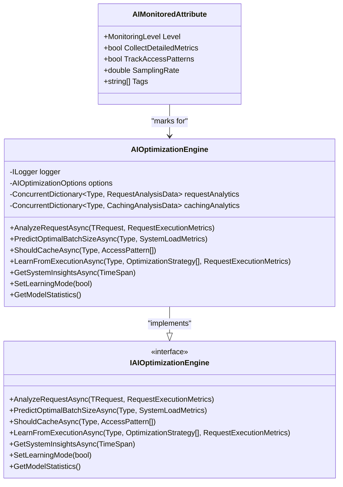
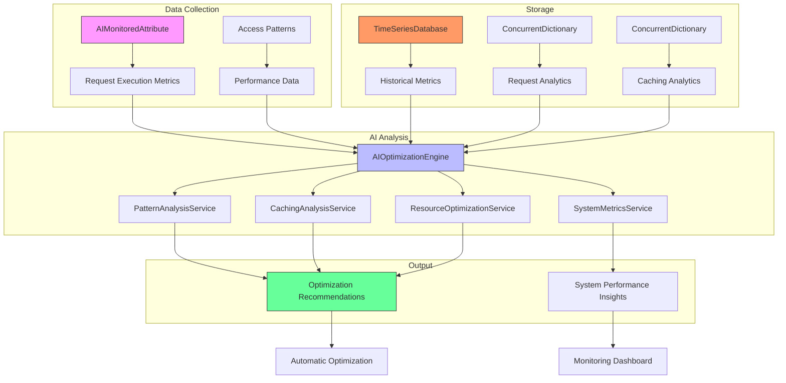
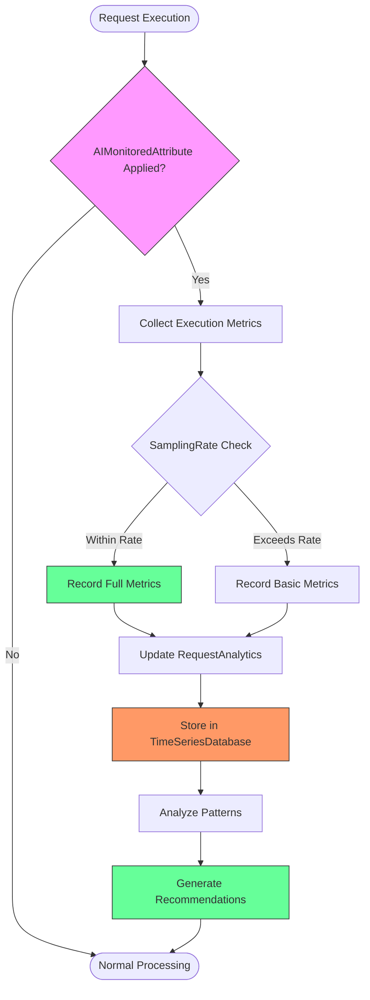
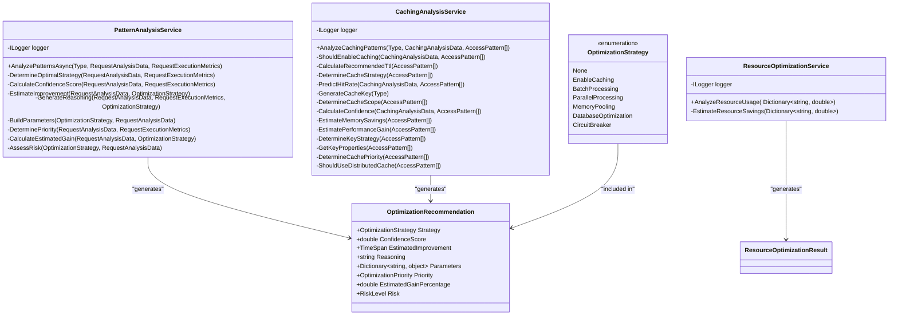
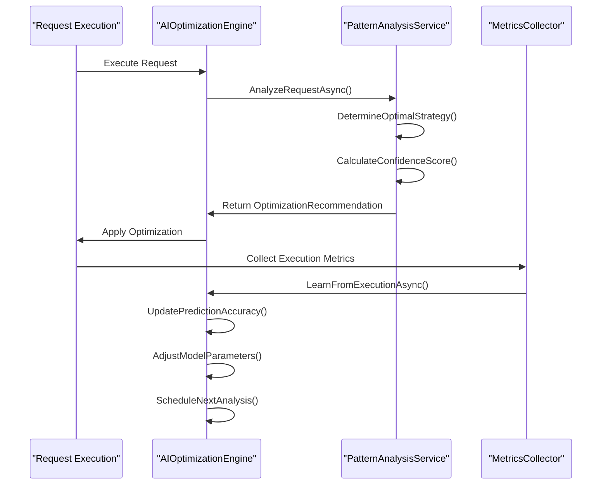
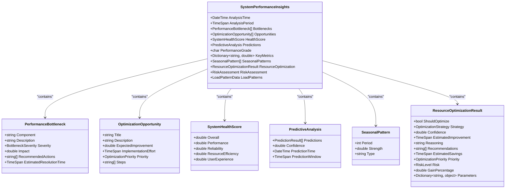

# AI Optimization Example

<cite>
**Referenced Files in This Document**   
- [AIMonitoredAttribute.cs](file://src/Relay.Core/Attributes/AIMonitoredAttribute.cs)
- [AIOptimizationEngine.cs](file://src/Relay.Core.AI/AI/Optimization/Engines/AIOptimizationEngine.cs)
- [IAIOptimizationEngine.cs](file://src/Relay.Core.AI/AI/Optimization/Core/IAIOptimizationEngine.cs)
- [AIOptimizationOptions.cs](file://src/Relay.Core.AI/AI/Optimization/Core/AIOptimizationOptions.cs)
- [PatternAnalysisService.cs](file://src/Relay.Core.AI/AI/Optimization/Services/PatternAnalysisService.cs)
- [CachingAnalysisService.cs](file://src/Relay.Core.AI/AI/Optimization/Services/CachingAnalysisService.cs)
- [ResourceOptimizationService.cs](file://src/Relay.Core.AI/AI/Optimization/Services/ResourceOptimizationService.cs)
- [SystemPerformanceInsights.cs](file://src/Relay.Core.AI/AI/Models/SystemPerformanceInsights.cs)
- [RequestExecutionMetrics.cs](file://src/Relay.Core.AI/AI/Models/RequestExecutionMetrics.cs)
- [OptimizationRecommendation.cs](file://src/Relay.Core.AI/AI/Models/OptimizationRecommendation.cs)
</cite>

## Table of Contents
1. [Introduction](#introduction)
2. [Core Components](#core-components)
3. [AI Optimization Architecture](#ai-optimization-architecture)
4. [Performance Data Collection](#performance-data-collection)
5. [AI Analysis and Optimization Strategies](#ai-analysis-and-optimization-strategies)
6. [Real-time Adaptation and Learning](#real-time-adaptation-and-learning)
7. [System-wide Performance Insights](#system-wide-performance-insights)
8. [Configuration and Tuning](#configuration-and-tuning)
9. [Common Issues and Best Practices](#common-issues-and-best-practices)
10. [Conclusion](#conclusion)

## Introduction

The Relay framework provides an advanced AI-powered optimization system that automatically improves application performance through machine learning. This system uses AI to analyze performance patterns, predict optimal configurations, and recommend or apply optimizations without manual intervention. The core of this system revolves around three key components: `AIMonitoredAttribute`, `AIOptimizedAttribute`, and `AIOptimizationEngine`, which work together to create a self-optimizing application infrastructure.

This documentation explains how Relay's AI optimization features work, from data collection to real-time adaptation. The system is designed to be accessible to beginners while providing sufficient depth for experienced developers to leverage AI for performance optimization. By automatically analyzing execution patterns and system metrics, Relay can identify optimization opportunities such as caching, batching, parallel processing, and resource allocation improvements.

**Section sources**
- [AIMonitoredAttribute.cs](file://src/Relay.Core/Attributes/AIMonitoredAttribute.cs)
- [AIOptimizationEngine.cs](file://src/Relay.Core.AI/AI/Optimization/Engines/AIOptimizationEngine.cs)

## Core Components

The AI optimization system in Relay consists of several interconnected components that work together to monitor, analyze, and optimize application performance. The primary components are the `AIMonitoredAttribute`, which marks request types for monitoring; the `AIOptimizationEngine`, which performs the AI analysis and generates recommendations; and various supporting services that handle specific optimization domains.

The `AIMonitoredAttribute` is applied to request types to enable AI-powered monitoring and optimization. When a request type is marked with this attribute, the system collects detailed execution metrics, access patterns, and performance data that feed into the AI analysis process. The `AIOptimizationEngine` serves as the central component that coordinates all optimization activities, implementing the `IAIOptimizationEngine` interface to provide a consistent API for optimization capabilities.

**Diagram sources**
- [AIMonitoredAttribute.cs](file://src/Relay.Core/Attributes/AIMonitoredAttribute.cs#L8-L35)
- [AIOptimizationEngine.cs](file://src/Relay.Core.AI/AI/Optimization/Engines/AIOptimizationEngine.cs#L20-L107)
- [IAIOptimizationEngine.cs](file://src/Relay.Core.AI/AI/Optimization/Core/IAIOptimizationEngine.cs#L12-L85)

**Section sources**
- [AIMonitoredAttribute.cs](file://src/Relay.Core/Attributes/AIMonitoredAttribute.cs#L8-L35)
- [AIOptimizationEngine.cs](file://src/Relay.Core.AI/AI/Optimization/Engines/AIOptimizationEngine.cs#L20-L107)
- [IAIOptimizationEngine.cs](file://src/Relay.Core.AI/AI/Optimization/Core/IAIOptimizationEngine.cs#L12-L85)

## AI Optimization Architecture

The AI optimization architecture in Relay follows a modular design with specialized services handling different aspects of performance analysis and optimization. The `AIOptimizationEngine` acts as a coordinator, delegating specific analysis tasks to dedicated services such as `PatternAnalysisService`, `CachingAnalysisService`, and `ResourceOptimizationService`. This separation of concerns allows for focused optimization strategies while maintaining a cohesive system.

The architecture follows a pipeline pattern where performance data flows from collection to analysis to recommendation and finally to application. The system uses a time-series database to store historical metrics, enabling trend analysis and predictive capabilities. Various timers trigger periodic operations: the model update timer refreshes the AI models at regular intervals, while the metrics collection timer gathers system-wide performance data for analysis.

**Diagram sources**
- [AIOptimizationEngine.cs](file://src/Relay.Core.AI/AI/Optimization/Engines/AIOptimizationEngine.cs#L28-L53)
- [PatternAnalysisService.cs](file://src/Relay.Core.AI/AI/Optimization/Services/PatternAnalysisService.cs#L16-L222)
- [CachingAnalysisService.cs](file://src/Relay.Core.AI/AI/Optimization/Services/CachingAnalysisService.cs#L12-L280)
- [ResourceOptimizationService.cs](file://src/Relay.Core.AI/AI/Optimization/Services/ResourceOptimizationService.cs#L11-L148)

**Section sources**
- [AIOptimizationEngine.cs](file://src/Relay.Core.AI/AI/Optimization/Engines/AIOptimizationEngine.cs#L28-L53)
- [PatternAnalysisService.cs](file://src/Relay.Core.AI/AI/Optimization/Services/PatternAnalysisService.cs#L16-L222)
- [CachingAnalysisService.cs](file://src/Relay.Core.AI/AI/Optimization/Services/CachingAnalysisService.cs#L12-L280)
- [ResourceOptimizationService.cs](file://src/Relay.Core.AI/AI/Optimization/Services/ResourceOptimizationService.cs#L11-L148)

## Performance Data Collection

Performance data collection is the foundation of Relay's AI optimization system. The `AIMonitoredAttribute` enables comprehensive metrics collection for designated request types, capturing execution patterns, resource usage, and access characteristics. The system collects various metrics including execution times, memory allocation, database calls, external API calls, and concurrency levels, which are used to identify optimization opportunities.

The data collection process is configurable through the `AIMonitoredAttribute` properties, allowing fine-tuning of what data is collected and at what frequency. The `SamplingRate` property controls the percentage of requests that are fully monitored, helping to balance performance overhead with data completeness. Detailed metrics collection can be enabled or disabled based on the monitoring level, with options ranging from basic to comprehensive monitoring.

**Diagram sources**
- [AIMonitoredAttribute.cs](file://src/Relay.Core/Attributes/AIMonitoredAttribute.cs#L14-L29)
- [AIOptimizationEngine.cs](file://src/Relay.Core.AI/AI/Optimization/Engines/AIOptimizationEngine.cs#L119-L122)
- [RequestExecutionMetrics.cs](file://src/Relay.Core.AI/AI/Models/RequestExecutionMetrics.cs#L10-L42)

**Section sources**
- [AIMonitoredAttribute.cs](file://src/Relay.Core/Attributes/AIMonitoredAttribute.cs#L14-L29)
- [AIOptimizationEngine.cs](file://src/Relay.Core.AI/AI/Optimization/Engines/AIOptimizationEngine.cs#L119-L122)
- [RequestExecutionMetrics.cs](file://src/Relay.Core.AI/AI/Models/RequestExecutionMetrics.cs#L10-L42)

## AI Analysis and Optimization Strategies

The AI analysis system in Relay employs multiple specialized services to identify and recommend optimization strategies based on collected performance data. The `PatternAnalysisService` examines request execution patterns to determine the most beneficial optimization approach, while the `CachingAnalysisService` evaluates caching opportunities and the `ResourceOptimizationService` analyzes system resource utilization.

The system supports several optimization strategies including caching, batching, parallel processing, memory pooling, database optimization, and circuit breaker implementation. Each strategy is evaluated based on its potential improvement, confidence score, and risk level. The AI engine considers multiple factors such as execution time, error rate, concurrency levels, and memory usage to determine the optimal strategy for each request type.

**Diagram sources**
- [OptimizationRecommendation.cs](file://src/Relay.Core.AI/AI/Models/OptimizationRecommendation.cs#L11-L27)
- [PatternAnalysisService.cs](file://src/Relay.Core.AI/AI/Optimization/Services/PatternAnalysisService.cs#L16-L222)
- [CachingAnalysisService.cs](file://src/Relay.Core.AI/AI/Optimization/Services/CachingAnalysisService.cs#L12-L280)
- [ResourceOptimizationService.cs](file://src/Relay.Core.AI/AI/Optimization/Services/ResourceOptimizationService.cs#L11-L148)

**Section sources**
- [PatternAnalysisService.cs](file://src/Relay.Core.AI/AI/Optimization/Services/PatternAnalysisService.cs#L16-L222)
- [CachingAnalysisService.cs](file://src/Relay.Core.AI/AI/Optimization/Services/CachingAnalysisService.cs#L12-L280)
- [ResourceOptimizationService.cs](file://src/Relay.Core.AI/AI/Optimization/Services/ResourceOptimizationService.cs#L11-L148)
- [OptimizationRecommendation.cs](file://src/Relay.Core.AI/AI/Models/OptimizationRecommendation.cs#L11-L27)

## Real-time Adaptation and Learning

Relay's AI optimization system features real-time adaptation capabilities that allow it to continuously improve its recommendations based on actual execution results. The `LearnFromExecutionAsync` method enables the system to validate its predictions against real-world outcomes, adjusting its models and strategies accordingly. This feedback loop is essential for maintaining accurate and effective optimization recommendations over time.

The learning process compares predicted optimization strategies with those actually applied and measures the resulting performance metrics. When predictions match outcomes, the system reinforces those patterns; when they differ, it adjusts its confidence levels and explores alternative strategies. The system also implements adaptive exploration, where it occasionally tries suboptimal strategies to discover potentially better approaches that might not be evident from historical data alone.

**Diagram sources**
- [AIOptimizationEngine.cs](file://src/Relay.Core.AI/AI/Optimization/Engines/AIOptimizationEngine.cs#L233-L257)
- [PatternAnalysisService.cs](file://src/Relay.Core.AI/AI/Optimization/Services/PatternAnalysisService.cs#L25-L64)

**Section sources**
- [AIOptimizationEngine.cs](file://src/Relay.Core.AI/AI/Optimization/Engines/AIOptimizationEngine.cs#L233-L257)
- [PatternAnalysisService.cs](file://src/Relay.Core.AI/AI/Optimization/Services/PatternAnalysisService.cs#L25-L64)

## System-wide Performance Insights

The AI optimization system provides comprehensive system-wide performance insights through the `GetSystemInsightsAsync` method, which aggregates data from multiple sources to generate a holistic view of application health and optimization opportunities. These insights include performance bottlenecks, optimization opportunities, system health scores, and predictive analysis of future load patterns.

The `SystemPerformanceInsights` class encapsulates these insights, providing structured data on bottlenecks, opportunities, health scores, and resource optimization recommendations. The system analyzes various metrics including CPU utilization, memory usage, error rates, and throughput to identify critical issues and suggest remediation steps. It also detects seasonal patterns in system metrics, allowing for proactive optimization based on predicted load changes.

**Diagram sources**
- [SystemPerformanceInsights.cs](file://src/Relay.Core.AI/AI/Models/SystemPerformanceInsights.cs#L12-L39)
- [AIOptimizationEngine.cs](file://src/Relay.Core.AI/AI/Optimization/Engines/AIOptimizationEngine.cs#L259-L289)

**Section sources**
- [SystemPerformanceInsights.cs](file://src/Relay.Core.AI/AI/Models/SystemPerformanceInsights.cs#L12-L39)
- [AIOptimizationEngine.cs](file://src/Relay.Core.AI/AI/Optimization/Engines/AIOptimizationEngine.cs#L259-L289)

## Configuration and Tuning

The AI optimization system in Relay is highly configurable through the `AIOptimizationOptions` class, which allows fine-tuning of various parameters that control the behavior of the optimization engine. These options include settings for model updates, batch processing, caching, confidence thresholds, and risk management, enabling administrators to balance optimization aggressiveness with system stability.

Key configuration options include the `MinConfidenceScore`, which determines the minimum confidence level required for applying optimizations; the `EnableAutomaticOptimization` flag, which controls whether optimizations are applied automatically or require manual approval; and the `MaxAutomaticOptimizationRisk` setting, which limits the risk level of automatically applied optimizations. The system also supports weighting of different metrics (performance, reliability, resource usage, and user experience) to align optimization priorities with business goals.

```mermaid
flowchart TD
A[AIOptimizationOptions] --> B[General Settings]
A --> C[Optimization Parameters]
A --> D[Risk Management]
A --> E[Metric Weights]
A --> F[Connection Monitoring]
B --> B1[Enabled: bool]
B --> B2[LearningEnabled: bool]
B --> B3[ModelUpdateInterval: TimeSpan]
C --> C1[DefaultBatchSize: int]
C --> C2[MaxBatchSize: int]
C --> C3[MinCacheTtl: TimeSpan]
C --> C4[MaxCacheTtl: TimeSpan]
C --> C5[MinConfidenceScore: double]
C --> C6[MinExecutionsForAnalysis: int]
D --> D1[EnableAutomaticOptimization: bool]
D --> D2[MaxAutomaticOptimizationRisk: RiskLevel]
D --> D3[EnableDecisionLogging: bool]
E --> E1[PerformanceWeight: double]
E --> E2[ReliabilityWeight: double]
E --> E3[ResourceWeight: double]
E --> E4[UserExperienceWeight: double]
F --> F1[MaxEstimatedHttpConnections: int]
F --> F2[MaxEstimatedDbConnections: int]
F --> F3[EstimatedMaxDbConnections: int]
F --> F4[EnableHttpConnectionReflection: bool]
style A fill:#bbf,stroke:#333
style B fill:#f96,stroke:#333
style C fill:#f96,stroke:#333
style D fill:#f96,stroke:#333
style E fill:#f96,stroke:#333
style F fill:#f96,stroke:#333
```

**Diagram sources**
- [AIOptimizationOptions.cs](file://src/Relay.Core.AI/AI/Optimization/Core/AIOptimizationOptions.cs#L8-L265)

**Section sources**
- [AIOptimizationOptions.cs](file://src/Relay.Core.AI/AI/Optimization/Core/AIOptimizationOptions.cs#L8-L265)

## Common Issues and Best Practices

Implementing AI-powered optimization requires careful consideration of several common issues and best practices. One of the primary challenges is the cold start problem, where the system lacks sufficient historical data to make accurate predictions when first deployed. To mitigate this, Relay uses heuristic-based defaults and gradually transitions to AI-driven recommendations as data accumulates.

Model accuracy is another critical concern, as inaccurate predictions can lead to suboptimal or even detrimental optimizations. The system addresses this through confidence scoring, where recommendations are only applied when confidence exceeds a configurable threshold. Additionally, the feedback loop through `LearnFromExecutionAsync` continuously improves model accuracy by comparing predictions with actual outcomes.

Balancing optimization with stability is essential, as aggressive optimizations can introduce instability. Relay's system includes multiple safeguards: risk assessment for each recommendation, configurable risk thresholds for automatic application, and the ability to disable automatic optimization entirely for manual review. The weighting system allows organizations to prioritize reliability over performance gains when needed.

Best practices for using the AI optimization system include:
- Starting with conservative confidence thresholds and gradually lowering them as model accuracy improves
- Monitoring the system during initial deployment to validate recommendations
- Regularly reviewing optimization outcomes to ensure alignment with business goals
- Using the system insights to identify systemic issues rather than just addressing symptoms
- Balancing automatic optimization with manual oversight, especially in production environments

**Section sources**
- [AIOptimizationEngine.cs](file://src/Relay.Core.AI/AI/Optimization/Engines/AIOptimizationEngine.cs#L158-L159)
- [AIOptimizationOptions.cs](file://src/Relay.Core.AI/AI/Optimization/Core/AIOptimizationOptions.cs#L49-L54)
- [PatternAnalysisService.cs](file://src/Relay.Core.AI/AI/Optimization/Services/PatternAnalysisService.cs#L97-L113)

## Conclusion

Relay's AI optimization system provides a comprehensive solution for automatically improving application performance through machine learning. By combining the `AIMonitoredAttribute` for targeted monitoring, the `AIOptimizationEngine` for centralized analysis, and specialized services for specific optimization domains, the system creates a powerful framework for self-optimizing applications.

The architecture balances automated optimization with safety controls, allowing organizations to benefit from AI-driven improvements while maintaining system stability. Through continuous learning and adaptation, the system becomes more effective over time, identifying optimization opportunities that might be missed through manual analysis.

For developers, the system reduces the need for manual performance tuning while providing valuable insights into application behavior. The configurable nature of the system allows it to be adapted to different environments and risk tolerances, making it suitable for both development and production use. By leveraging AI to handle routine optimization tasks, teams can focus on higher-level architectural improvements and feature development.