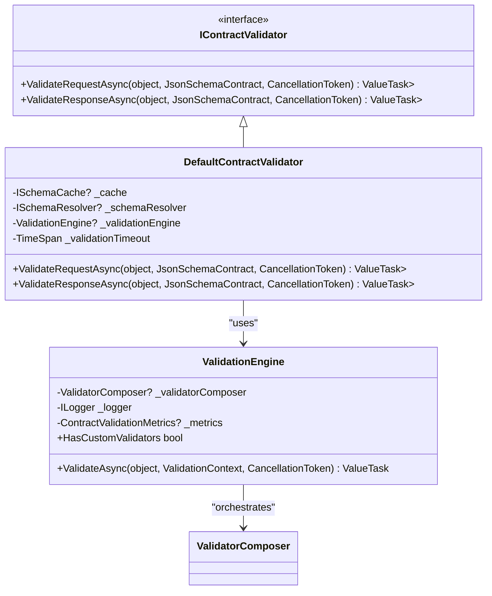
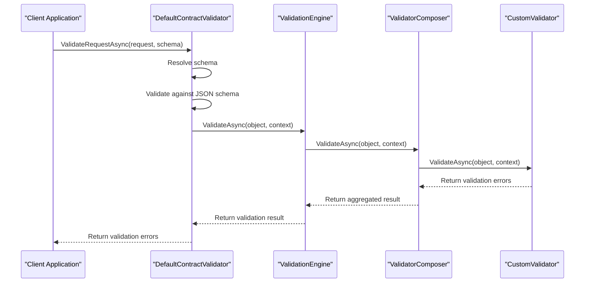
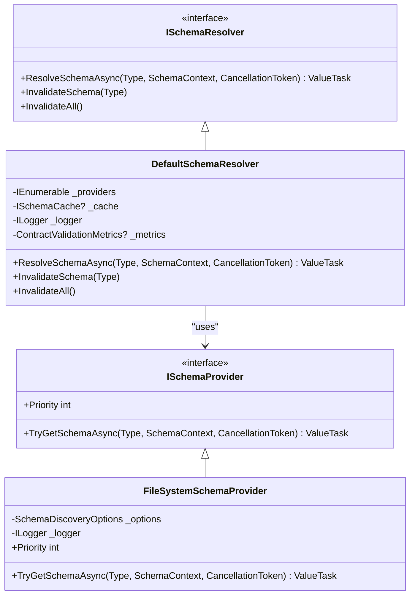
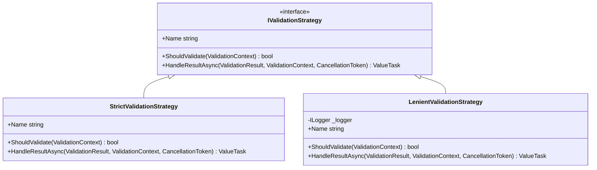
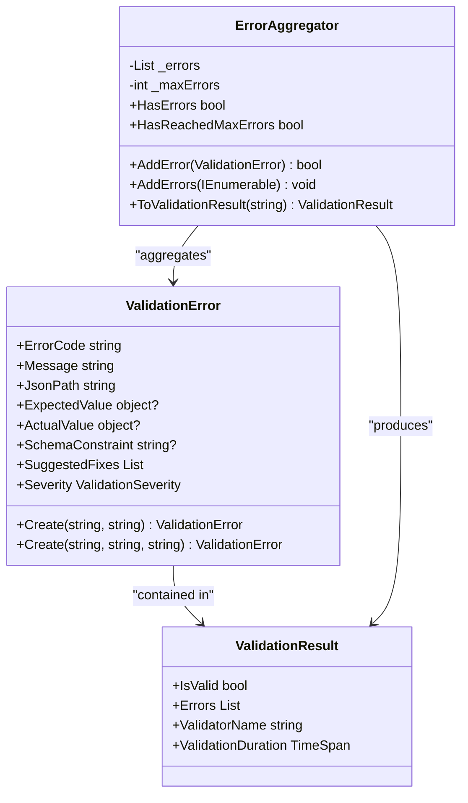
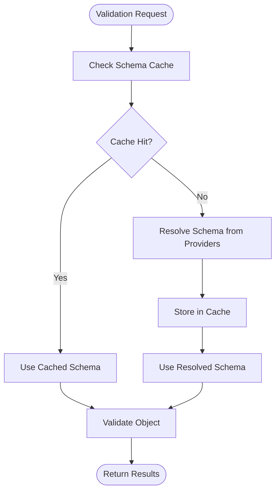
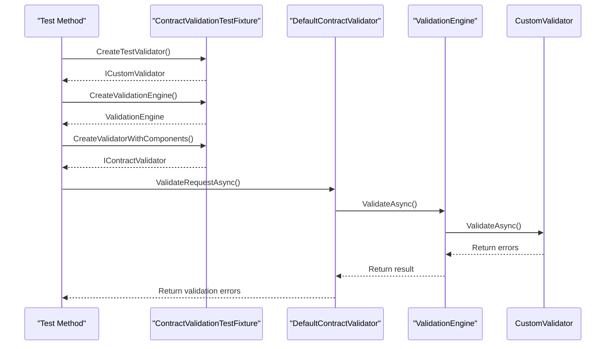

# Advanced Validation Example

<cite>
**Referenced Files in This Document**   
- [DefaultContractValidator.cs](file://src/Relay.Core/ContractValidation/DefaultContractValidator.cs)
- [ValidationEngine.cs](file://src/Relay.Core/ContractValidation/ValidationEngine.cs)
- [ValidatorComposer.cs](file://src/Relay.Core/ContractValidation/CustomValidators/ValidatorComposer.cs)
- [IContractValidator.cs](file://src/Relay.Core/ContractValidation/IContractValidator.cs)
- [ICustomValidator.cs](file://src/Relay.Core/ContractValidation/CustomValidators/ICustomValidator.cs)
- [IValidationStrategy.cs](file://src/Relay.Core/ContractValidation/Strategies/IValidationStrategy.cs)
- [DefaultSchemaResolver.cs](file://src/Relay.Core/ContractValidation/SchemaDiscovery/DefaultSchemaResolver.cs)
- [FileSystemSchemaProvider.cs](file://src/Relay.Core/ContractValidation/SchemaDiscovery/FileSystemSchemaProvider.cs)
- [ValidationContext.cs](file://src/Relay.Core/ContractValidation/Models/ValidationContext.cs)
- [ValidationError.cs](file://src/Relay.Core/ContractValidation/Models/ValidationError.cs)
- [ContractValidationTestFixture.cs](file://src/Relay.Core/ContractValidation/Testing/ContractValidationTestFixture.cs)
</cite>

## Table of Contents
1. [Introduction](#introduction)
2. [Core Validation Architecture](#core-validation-architecture)
3. [Custom Validators and Validation Engine](#custom-validators-and-validation-engine)
4. [Schema Discovery and Resolution](#schema-discovery-and-resolution)
5. [Validation Strategies](#validation-strategies)
6. [Error Handling and Reporting](#error-handling-and-reporting)
7. [Performance and Caching](#performance-and-caching)
8. [Testing and Integration](#testing-and-integration)
9. [Best Practices](#best-practices)
10. [Conclusion](#conclusion)

## Introduction

The Relay framework provides a comprehensive validation system for ensuring contract integrity in distributed systems. This document explores the advanced validation features, focusing on the integration of custom validators, schema discovery mechanisms, and flexible validation strategies. The system is designed to handle complex validation scenarios while maintaining performance and scalability.

The validation framework operates at multiple levels, combining JSON schema validation with custom business rule validation. It supports various schema discovery methods, including file system, embedded resources, and HTTP endpoints, allowing for flexible schema management in different deployment scenarios.

**Section sources**
- [DefaultContractValidator.cs](file://src/Relay.Core/ContractValidation/DefaultContractValidator.cs#L1-L50)
- [ValidationEngine.cs](file://src/Relay.Core/ContractValidation/ValidationEngine.cs#L1-L15)

## Core Validation Architecture

The validation architecture in Relay follows a modular design with clear separation of concerns. At its core is the `IContractValidator` interface, which defines the contract for validation operations. The `DefaultContractValidator` provides the primary implementation, orchestrating the validation process by coordinating schema validation and custom validator execution.

The validation process begins with schema discovery, where the system resolves the appropriate JSON schema for the given type and context. Once the schema is obtained, it is used for structural validation of the object. Concurrently, custom validators registered in the system are executed to enforce business-specific rules.

**Diagram sources**
- [IContractValidator.cs](file://src/Relay.Core/ContractValidation/IContractValidator.cs#L7-L31)
- [DefaultContractValidator.cs](file://src/Relay.Core/ContractValidation/DefaultContractValidator.cs#L22-L505)
- [ValidationEngine.cs](file://src/Relay.Core/ContractValidation/ValidationEngine.cs#L16-L163)
- [ValidatorComposer.cs](file://src/Relay.Core/ContractValidation/CustomValidators/ValidatorComposer.cs#L14-L102)

**Section sources**
- [DefaultContractValidator.cs](file://src/Relay.Core/ContractValidation/DefaultContractValidator.cs#L22-L505)
- [IContractValidator.cs](file://src/Relay.Core/ContractValidation/IContractValidator.cs#L7-L31)

## Custom Validators and Validation Engine

Custom validators in Relay allow developers to implement business-specific validation rules beyond what can be expressed in JSON schemas. The `ICustomValidator` interface defines the contract for custom validators, requiring implementations to specify their priority, determine applicability to types, and perform validation.

The `ValidationEngine` class orchestrates the execution of custom validators through the `ValidatorComposer`. Validators are executed in order of priority, with higher priority validators running first. The engine handles error aggregation and provides observability through logging and metrics.

**Diagram sources**
- [ValidationEngine.cs](file://src/Relay.Core/ContractValidation/ValidationEngine.cs#L48-L163)
- [ValidatorComposer.cs](file://src/Relay.Core/ContractValidation/CustomValidators/ValidatorComposer.cs#L35-L90)
- [ICustomValidator.cs](file://src/Relay.Core/ContractValidation/CustomValidators/ICustomValidator.cs#L12-L38)

**Section sources**
- [ValidationEngine.cs](file://src/Relay.Core/ContractValidation/ValidationEngine.cs#L48-L163)
- [ValidatorComposer.cs](file://src/Relay.Core/ContractValidation/CustomValidators/ValidatorComposer.cs#L35-L90)
- [ICustomValidator.cs](file://src/Relay.Core/ContractValidation/CustomValidators/ICustomValidator.cs#L12-L38)

## Schema Discovery and Resolution

The schema discovery system in Relay provides multiple mechanisms for locating and loading JSON schemas. The `ISchemaResolver` interface defines the contract for schema resolution, with the `DefaultSchemaResolver` providing the primary implementation that coordinates multiple schema providers.

Schema providers are prioritized and executed in order, with the system attempting to resolve schemas from each provider until one succeeds. Available providers include:
- `FileSystemSchemaProvider`: Loads schemas from the file system based on configurable naming conventions
- `EmbeddedResourceSchemaProvider`: Loads schemas from embedded resources in assemblies
- `HttpSchemaProvider`: Loads schemas from HTTP endpoints

**Diagram sources**
- [ISchemaResolver.cs](file://src/Relay.Core/ContractValidation/SchemaDiscovery/ISchemaResolver.cs#L8-L33)
- [DefaultSchemaResolver.cs](file://src/Relay.Core/ContractValidation/SchemaDiscovery/DefaultSchemaResolver.cs#L19-L410)
- [ISchemaProvider.cs](file://src/Relay.Core/ContractValidation/SchemaDiscovery/ISchemaProvider.cs#L8-L24)
- [FileSystemSchemaProvider.cs](file://src/Relay.Core/ContractValidation/SchemaDiscovery/FileSystemSchemaProvider.cs#L14-L112)

**Section sources**
- [DefaultSchemaResolver.cs](file://src/Relay.Core/ContractValidation/SchemaDiscovery/DefaultSchemaResolver.cs#L19-L410)
- [FileSystemSchemaProvider.cs](file://src/Relay.Core/ContractValidation/SchemaDiscovery/FileSystemSchemaProvider.cs#L14-L112)

## Validation Strategies

Relay supports different validation strategies through the `IValidationStrategy` interface, allowing for flexible handling of validation results based on the execution environment. The two primary strategies are:

- **StrictValidationStrategy**: Throws exceptions on validation failures, suitable for production environments where contract violations should halt execution
- **LenientValidationStrategy**: Logs warnings without throwing exceptions, suitable for development environments where contract violations should be visible but not halt execution

The strategy selection allows teams to adopt different validation behaviors across environments while maintaining consistent validation rules.

**Diagram sources**
- [IValidationStrategy.cs](file://src/Relay.Core/ContractValidation/Strategies/IValidationStrategy.cs#L7-L36)
- [StrictValidationStrategy.cs](file://src/Relay.Core/ContractValidation/Strategies/StrictValidationStrategy.cs#L13-L46)
- [LenientValidationStrategy.cs](file://src/Relay.Core/ContractValidation/Strategies/LenientValidationStrategy.cs#L13-L69)

**Section sources**
- [IValidationStrategy.cs](file://src/Relay.Core/ContractValidation/Strategies/IValidationStrategy.cs#L7-L36)
- [StrictValidationStrategy.cs](file://src/Relay.Core/ContractValidation/Strategies/StrictValidationStrategy.cs#L13-L46)
- [LenientValidationStrategy.cs](file://src/Relay.Core/ContractValidation/Strategies/LenientValidationStrategy.cs#L13-L69)

## Error Handling and Reporting

The validation system in Relay provides comprehensive error handling with detailed error information. The `ValidationError` class captures rich information about validation failures, including error codes, messages, JSON paths, expected and actual values, and severity levels.

Error aggregation is handled by the `ErrorAggregator` class, which collects validation errors from multiple sources and enforces limits on the number of errors returned. This prevents overwhelming clients with excessive error details while still providing sufficient information for debugging.

**Diagram sources**
- [ValidationError.cs](file://src/Relay.Core/ContractValidation/Models/ValidationError.cs#L9-L93)
- [ValidationResult.cs](file://src/Relay.Core/ContractValidation/Models/ValidationResult.cs#L9-L48)
- [ErrorAggregator.cs](file://src/Relay.Core/ContractValidation/ErrorReporting/ErrorAggregator.cs#L9-L102)

**Section sources**
- [ValidationError.cs](file://src/Relay.Core/ContractValidation/Models/ValidationError.cs#L9-L93)
- [ErrorAggregator.cs](file://src/Relay.Core/ContractValidation/ErrorReporting/ErrorAggregator.cs#L9-L102)

## Performance and Caching

The validation system incorporates several performance optimizations, with schema caching being a key feature. The `ISchemaCache` interface defines the contract for schema caching, with the `LruSchemaCache` providing a least-recently-used implementation.

Schema caching significantly improves performance by avoiding repeated file system or network operations for schema retrieval. The cache is integrated with the `DefaultSchemaResolver`, which checks the cache before attempting to resolve schemas from providers.

**Diagram sources**
- [ISchemaCache.cs](file://src/Relay.Core/ContractValidation/Caching/ISchemaCache.cs#L8-L27)
- [LruSchemaCache.cs](file://src/Relay.Core/ContractValidation/Caching/LruSchemaCache.cs#L10-L152)
- [DefaultSchemaResolver.cs](file://src/Relay.Core/ContractValidation/SchemaDiscovery/DefaultSchemaResolver.cs#L19-L410)

**Section sources**
- [DefaultSchemaResolver.cs](file://src/Relay.Core/ContractValidation/SchemaDiscovery/DefaultSchemaResolver.cs#L19-L410)
- [LruSchemaCache.cs](file://src/Relay.Core/ContractValidation/Caching/LruSchemaCache.cs#L10-L152)

## Testing and Integration

The validation framework includes comprehensive testing support through the `ContractValidationTestFixture` class, which provides utilities for creating test validators, schemas, and validation contexts. This facilitates unit testing of custom validators and integration testing of the complete validation pipeline.

Integration testing examples demonstrate how to test end-to-end validation scenarios, including schema discovery, custom validator execution, and error handling. The test fixture allows for easy configuration of validation components with test doubles and mock implementations.

**Diagram sources**
- [ContractValidationTestFixture.cs](file://src/Relay.Core/ContractValidation/Testing/ContractValidationTestFixture.cs#L37-L56)
- [DefaultContractValidator.cs](file://src/Relay.Core/ContractValidation/DefaultContractValidator.cs#L22-L505)
- [ValidationEngine.cs](file://src/Relay.Core/ContractValidation/ValidationEngine.cs#L48-L163)

**Section sources**
- [ContractValidationTestFixture.cs](file://src/Relay.Core/ContractValidation/Testing/ContractValidationTestFixture.cs#L37-L56)
- [DefaultContractValidatorEnhancedTests.cs](file://tests/Relay.Core.Tests/ContractValidation/DefaultContractValidatorEnhancedTests.cs#L21-L42)

## Best Practices

When implementing advanced validation in Relay, consider the following best practices:

1. **Separate concerns**: Use JSON schemas for structural validation and custom validators for business rules
2. **Prioritize validators**: Assign appropriate priorities to ensure critical validations run first
3. **Use descriptive error codes**: Implement a consistent error code system for easier troubleshooting
4. **Leverage caching**: Configure schema caching appropriately for your deployment environment
5. **Test thoroughly**: Use the test fixture to validate both individual components and integrated workflows
6. **Monitor performance**: Use the built-in metrics to identify potential performance bottlenecks
7. **Handle schema evolution**: Implement versioning strategies for backward compatibility

For distributed systems, consider implementing circuit breakers around external schema providers to prevent cascading failures. Also, ensure proper error handling in custom validators to prevent unhandled exceptions from disrupting the validation pipeline.

**Section sources**
- [DefaultContractValidator.cs](file://src/Relay.Core/ContractValidation/DefaultContractValidator.cs#L22-L505)
- [ValidationEngine.cs](file://src/Relay.Core/ContractValidation/ValidationEngine.cs#L48-L163)
- [ContractValidationTestFixture.cs](file://src/Relay.Core/ContractValidation/Testing/ContractValidationTestFixture.cs#L37-L56)

## Conclusion

The advanced validation features in Relay provide a robust foundation for ensuring contract integrity in complex distributed systems. By combining JSON schema validation with custom business rule validation, the system offers flexibility while maintaining performance and scalability.

The modular architecture allows for easy extension and customization, supporting various schema discovery methods, validation strategies, and error handling approaches. The comprehensive testing support ensures that validation logic can be thoroughly validated before deployment.

For enterprise-grade validation systems, the combination of strict validation in production with lenient validation in development environments provides an effective approach to catching contract violations early while maintaining system stability.

**Section sources**
- [DefaultContractValidator.cs](file://src/Relay.Core/ContractValidation/DefaultContractValidator.cs#L22-L505)
- [ValidationEngine.cs](file://src/Relay.Core/ContractValidation/ValidationEngine.cs#L48-L163)
- [IContractValidator.cs](file://src/Relay.Core/ContractValidation/IContractValidator.cs#L7-L31)