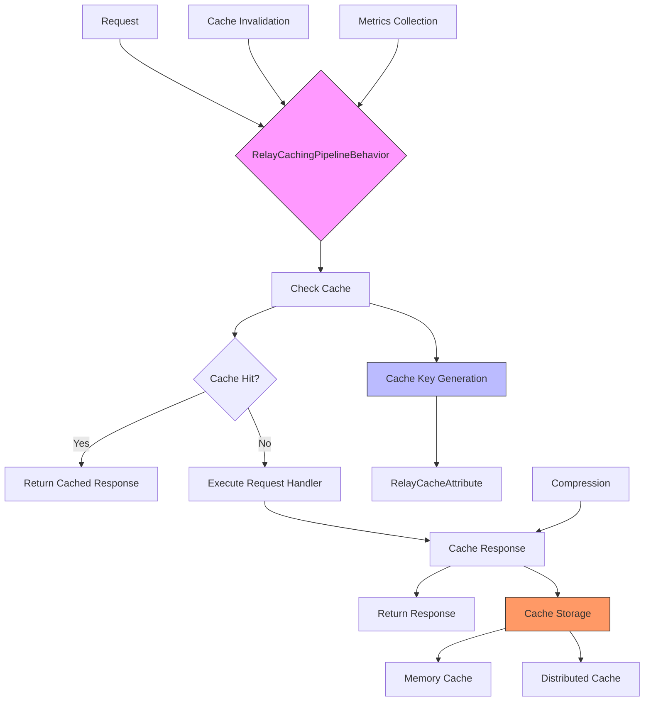
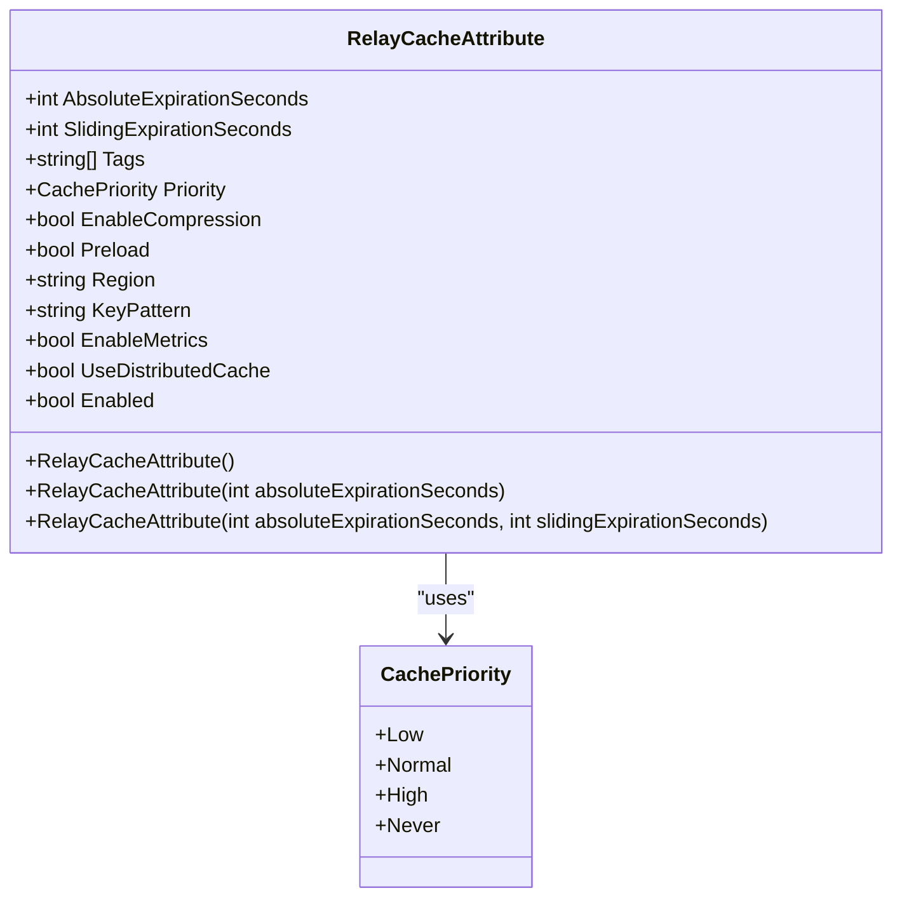
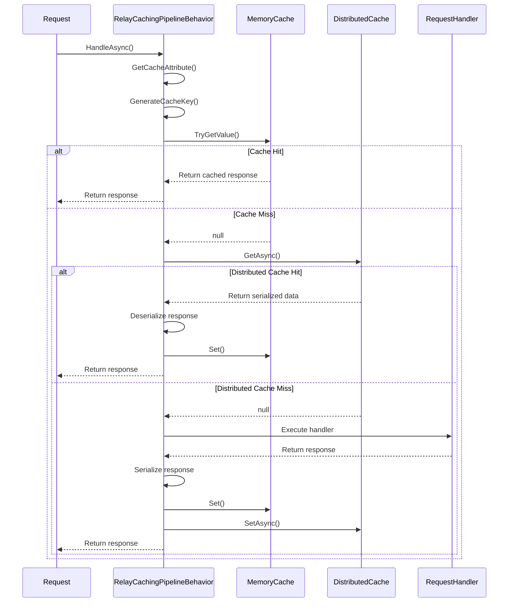
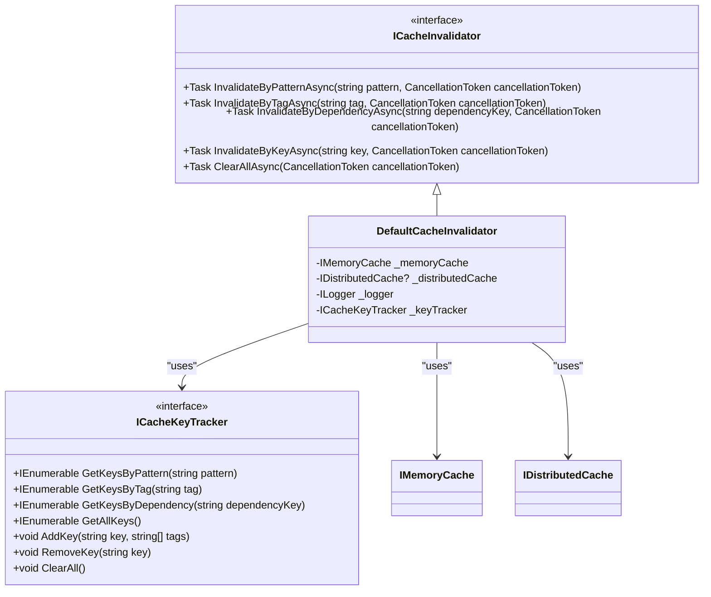
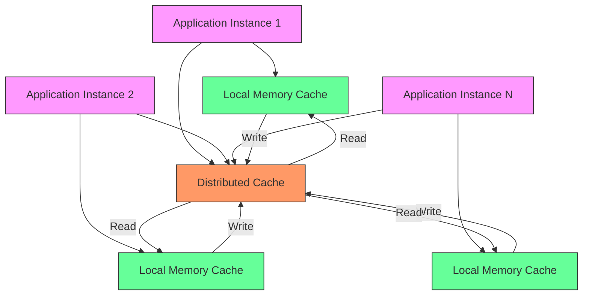
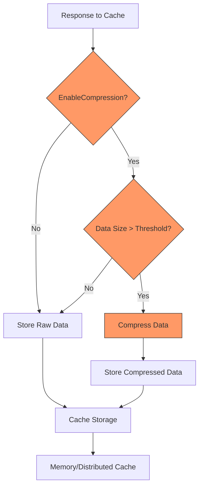
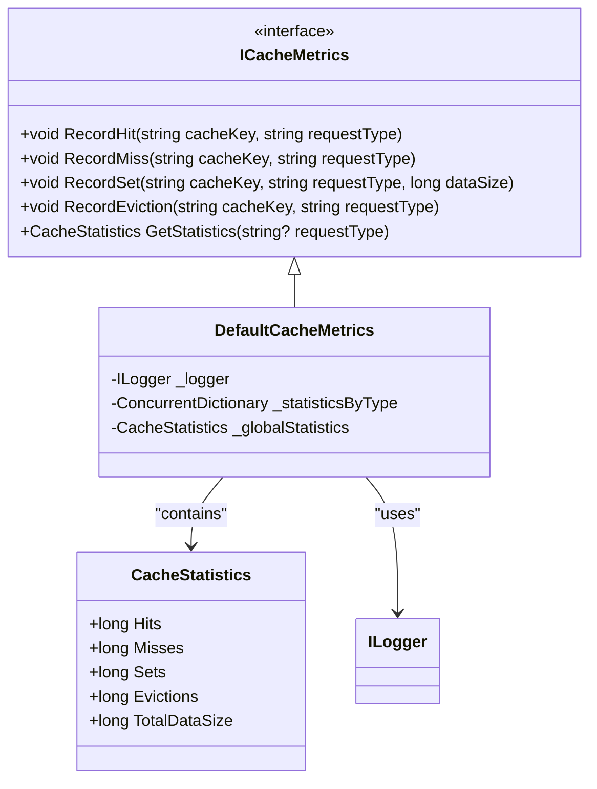
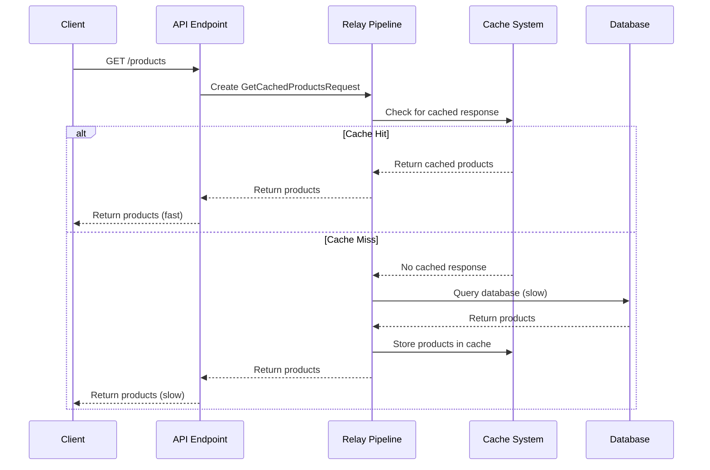
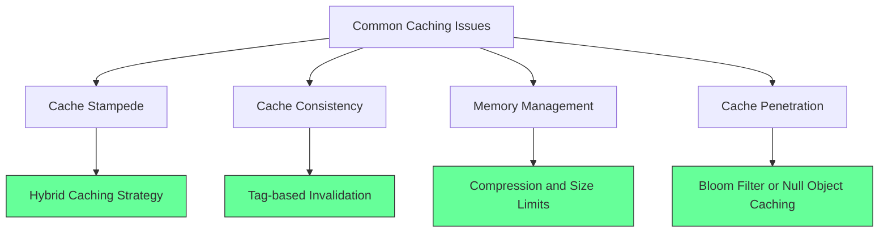

# Caching Example

<cite>
**Referenced Files in This Document**   
- [RelayCacheAttribute.cs](file://src/Relay.Core/Caching/Attributes/RelayCacheAttribute.cs)
- [RelayCachingPipelineBehavior.cs](file://src/Relay.Core/Caching/Behaviors/RelayCachingPipelineBehavior.cs)
- [DefaultCacheKeyGenerator.cs](file://src/Relay.Core/Caching/KeyGeneration/DefaultCacheKeyGenerator.cs)
- [DefaultCacheInvalidator.cs](file://src/Relay.Core/Caching/Invalidation/DefaultCacheInvalidator.cs)
- [JsonCacheSerializer.cs](file://src/Relay.Core/Caching/Serialization/JsonCacheSerializer.cs)
- [GetCachedProducts.cs](file://samples/Relay.MinimalApiSample/Features/Examples/05-Caching/GetCachedProducts.cs)
- [GetCachedProductsHandler.cs](file://samples/Relay.MinimalApiSample/Features/Examples/05-Caching/GetCachedProductsHandler.cs)
- [CachingOptions.cs](file://src/Relay.Core/Configuration/Options/Caching/CachingOptions.cs)
- [DefaultCacheMetrics.cs](file://src/Relay.Core/Caching/Metrics/DefaultCacheMetrics.cs)
</cite>

## Table of Contents
1. [Introduction](#introduction)
2. [Caching Architecture Overview](#caching-architecture-overview)
3. [Core Components](#core-components)
4. [Cache Configuration and Attributes](#cache-configuration-and-attributes)
5. [Cache Key Generation](#cache-key-generation)
6. [Response Storage and Retrieval](#response-storage-and-retrieval)
7. [Cache Invalidation Patterns](#cache-invalidation-patterns)
8. [Distributed Caching Integration](#distributed-caching-integration)
9. [Compression and Memory Management](#compression-and-memory-management)
10. [Metrics and Monitoring](#metrics-and-monitoring)
11. [Practical Implementation Examples](#practical-implementation-examples)
12. [Common Issues and Solutions](#common-issues-and-solutions)
13. [Best Practices](#best-practices)

## Introduction

The Relay caching system provides a comprehensive solution for response caching through its unified caching pipeline behavior. This document explains the implementation of response caching in the Relay framework, focusing on the relationship between the `RelayCacheAttribute`, cache key generation, and caching behavior. The system enables developers to optimize application performance by strategically caching responses while addressing common challenges such as cache stampede prevention, cache consistency, and memory management. The caching feature is designed to be accessible to beginners while providing sufficient technical depth for experienced developers to implement advanced caching strategies.

## Caching Architecture Overview

The Relay caching system follows a pipeline-based architecture that integrates seamlessly with request processing. The core components work together to provide a unified caching experience that supports both memory and distributed caching scenarios.



**Diagram sources**
- [RelayCachingPipelineBehavior.cs](file://src/Relay.Core/Caching/Behaviors/RelayCachingPipelineBehavior.cs)
- [RelayCacheAttribute.cs](file://src/Relay.Core/Caching/Attributes/RelayCacheAttribute.cs)

**Section sources**
- [RelayCachingPipelineBehavior.cs](file://src/Relay.Core/Caching/Behaviors/RelayCachingPipelineBehavior.cs)
- [RelayCacheAttribute.cs](file://src/Relay.Core/Caching/Attributes/RelayCacheAttribute.cs)

## Core Components

The Relay caching system consists of several core components that work together to provide a comprehensive caching solution. These components include the caching pipeline behavior, cache attribute, key generator, serializer, and invalidator. The `RelayCachingPipelineBehavior` serves as the central component that orchestrates the caching process, while the `RelayCacheAttribute` provides configuration for individual caching scenarios. The system is designed with extensibility in mind, allowing developers to customize various aspects of the caching behavior through dependency injection.

**Section sources**
- [RelayCachingPipelineBehavior.cs](file://src/Relay.Core/Caching/Behaviors/RelayCachingPipelineBehavior.cs)
- [RelayCacheAttribute.cs](file://src/Relay.Core/Caching/Attributes/RelayCacheAttribute.cs)
- [DefaultCacheKeyGenerator.cs](file://src/Relay.Core/Caching/KeyGeneration/DefaultCacheKeyGenerator.cs)

## Cache Configuration and Attributes

The `RelayCacheAttribute` class provides comprehensive configuration options for caching scenarios. This attribute replaces multiple specialized cache attributes and offers a unified interface for configuring cache behavior. The attribute supports various configuration options including absolute and sliding expiration times, cache tags for grouping and invalidation, cache priority settings, compression enablement, and distributed caching options.



**Diagram sources**
- [RelayCacheAttribute.cs](file://src/Relay.Core/Caching/Attributes/RelayCacheAttribute.cs)

**Section sources**
- [RelayCacheAttribute.cs](file://src/Relay.Core/Caching/Attributes/RelayCacheAttribute.cs)

## Cache Key Generation

The Relay caching system provides flexible cache key generation through the `ICacheKeyGenerator` interface and its default implementation `DefaultCacheKeyGenerator`. The key generation process supports both pattern-based and hash-based approaches, allowing developers to customize how cache keys are created based on their specific requirements. The system uses a configurable key pattern that can include placeholders for request type, request hash, and region, enabling logical grouping of cache entries.

```mermaid
flowchart TD
A[Generate Cache Key] --> B{Key Pattern Contains {RequestHash}?}
B --> |Yes| C[Generate Key with Hash]
B --> |No| D[Use Key Generator]
C --> E[Serialize Request to JSON]
E --> F[Compute SHA256 Hash]
F --> G[Take First 8 Characters]
G --> H[Format Key with Pattern]
D --> I[Delegate to ICacheKeyGenerator]
H --> J[Return Final Key]
I --> J
style C fill:#f96,stroke:#333
style D fill:#f96,stroke:#333
```

**Diagram sources**
- [RelayCachingPipelineBehavior.cs](file://src/Relay.Core/Caching/Behaviors/RelayCachingPipelineBehavior.cs)
- [DefaultCacheKeyGenerator.cs](file://src/Relay.Core/Caching/KeyGeneration/DefaultCacheKeyGenerator.cs)

**Section sources**
- [RelayCachingPipelineBehavior.cs](file://src/Relay.Core/Caching/Behaviors/RelayCachingPipelineBehavior.cs)
- [DefaultCacheKeyGenerator.cs](file://src/Relay.Core/Caching/KeyGeneration/DefaultCacheKeyGenerator.cs)

## Response Storage and Retrieval

The Relay caching system implements a multi-layered approach to response storage and retrieval, supporting both memory and distributed caching. The system first attempts to retrieve responses from the local memory cache for optimal performance, falling back to distributed cache when enabled and available. When storing responses, the system writes to both memory and distributed caches simultaneously, creating a hybrid caching strategy that maximizes performance while ensuring data availability across application instances.



**Diagram sources**
- [RelayCachingPipelineBehavior.cs](file://src/Relay.Core/Caching/Behaviors/RelayCachingPipelineBehavior.cs)

**Section sources**
- [RelayCachingPipelineBehavior.cs](file://src/Relay.Core/Caching/Behaviors/RelayCachingPipelineBehavior.cs)

## Cache Invalidation Patterns

The Relay caching system provides robust cache invalidation capabilities through the `ICacheInvalidator` interface and its `DefaultCacheInvalidator` implementation. The system supports multiple invalidation patterns including pattern-based invalidation, tag-based invalidation, dependency-based invalidation, and complete cache clearing. The `ICacheKeyTracker` interface tracks cache keys and their associated metadata, enabling efficient invalidation operations across large numbers of cache entries.



**Diagram sources**
- [DefaultCacheInvalidator.cs](file://src/Relay.Core/Caching/Invalidation/DefaultCacheInvalidator.cs)
- [ICacheInvalidator.cs](file://src/Relay.Core/Caching/Invalidation/ICacheInvalidator.cs)
- [ICacheKeyTracker.cs](file://src/Relay.Core/Caching/Invalidation/ICacheKeyTracker.cs)

**Section sources**
- [DefaultCacheInvalidator.cs](file://src/Relay.Core/Caching/Invalidation/DefaultCacheInvalidator.cs)
- [ICacheInvalidator.cs](file://src/Relay.Core/Caching/Invalidation/ICacheInvalidator.cs)
- [ICacheKeyTracker.cs](file://src/Relay.Core/Caching/Invalidation/ICacheKeyTracker.cs)

## Distributed Caching Integration

The Relay caching system seamlessly integrates with distributed caching providers through the `IDistributedCache` interface. The system supports hybrid caching strategies where frequently accessed data is stored in local memory cache while maintaining a copy in the distributed cache for consistency across application instances. The integration handles connection failures gracefully, ensuring that application performance is not compromised when the distributed cache is temporarily unavailable.



**Diagram sources**
- [RelayCachingPipelineBehavior.cs](file://src/Relay.Core/Caching/Behaviors/RelayCachingPipelineBehavior.cs)
- [DefaultCacheInvalidator.cs](file://src/Relay.Core/Caching/Invalidation/DefaultCacheInvalidator.cs)

**Section sources**
- [RelayCachingPipelineBehavior.cs](file://src/Relay.Core/Caching/Behaviors/RelayCachingPipelineBehavior.cs)
- [DefaultCacheInvalidator.cs](file://src/Relay.Core/Caching/Invalidation/DefaultCacheInvalidator.cs)

## Compression and Memory Management

The Relay caching system includes built-in compression capabilities to optimize memory usage and reduce storage requirements. The compression system is configurable through the `EnableCompression` property of the `RelayCacheAttribute` and uses the `ICacheCompressor` interface for extensibility. The system automatically applies compression based on data size thresholds, ensuring that compression overhead is only incurred when beneficial.



**Diagram sources**
- [RelayCachingPipelineBehavior.cs](file://src/Relay.Core/Caching/Behaviors/RelayCachingPipelineBehavior.cs)
- [GzipCacheCompressor.cs](file://src/Relay.Core/Caching/Compression/GzipCacheCompressor.cs)

**Section sources**
- [RelayCachingPipelineBehavior.cs](file://src/Relay.Core/Caching/Behaviors/RelayCachingPipelineBehavior.cs)
- [GzipCacheCompressor.cs](file://src/Relay.Core/Caching/Compression/GzipCacheCompressor.cs)

## Metrics and Monitoring

The Relay caching system includes comprehensive metrics collection through the `ICacheMetrics` interface and its `DefaultCacheMetrics` implementation. The metrics system tracks cache hits, misses, sets, evictions, and data sizes, providing valuable insights into cache performance and effectiveness. These metrics can be used to optimize cache configurations and identify potential issues with cache utilization.



**Diagram sources**
- [DefaultCacheMetrics.cs](file://src/Relay.Core/Caching/Metrics/DefaultCacheMetrics.cs)
- [ICacheMetrics.cs](file://src/Relay.Core/Caching/Metrics/ICacheMetrics.cs)

**Section sources**
- [DefaultCacheMetrics.cs](file://src/Relay.Core/Caching/Metrics/DefaultCacheMetrics.cs)
- [ICacheMetrics.cs](file://src/Relay.Core/Caching/Metrics/ICacheMetrics.cs)

## Practical Implementation Examples

The Relay caching system can be implemented in various scenarios to optimize application performance. The following example demonstrates how to use the caching feature in a typical request-response scenario:



**Diagram sources**
- [GetCachedProducts.cs](file://samples/Relay.MinimalApiSample/Features/Examples/05-Caching/GetCachedProducts.cs)
- [GetCachedProductsHandler.cs](file://samples/Relay.MinimalApiSample/Features/Examples/05-Caching/GetCachedProductsHandler.cs)

**Section sources**
- [GetCachedProducts.cs](file://samples/Relay.MinimalApiSample/Features/Examples/05-Caching/GetCachedProducts.cs)
- [GetCachedProductsHandler.cs](file://samples/Relay.MinimalApiSample/Features/Examples/05-Caching/GetCachedProductsHandler.cs)

## Common Issues and Solutions

The Relay caching system addresses several common caching challenges:

### Cache Stampede Prevention
The system prevents cache stampede by using a hybrid caching approach where the memory cache serves as a fast first layer, reducing the load on the distributed cache and backend systems during cache misses.

### Cache Consistency
Cache consistency is maintained through the invalidation system, which allows for targeted invalidation of cache entries based on patterns, tags, or dependencies, ensuring that stale data is removed promptly.

### Memory Management
The system manages memory efficiently through configurable cache priorities, expiration policies, and optional compression, preventing memory exhaustion in high-load scenarios.



**Section sources**
- [RelayCachingPipelineBehavior.cs](file://src/Relay.Core/Caching/Behaviors/RelayCachingPipelineBehavior.cs)
- [DefaultCacheInvalidator.cs](file://src/Relay.Core/Caching/Invalidation/DefaultCacheInvalidator.cs)

## Best Practices

When implementing caching with the Relay framework, consider the following best practices:

1. **Use appropriate expiration policies**: Choose between absolute and sliding expiration based on your data update frequency
2. **Leverage cache tags**: Use tags to group related cache entries for efficient invalidation
3. **Monitor cache hit ratio**: Regularly review metrics to ensure caching is effective
4. **Consider data size**: Enable compression for larger responses to optimize memory usage
5. **Use cache regions**: Organize cache entries into logical regions for better management
6. **Implement proper invalidation**: Establish clear invalidation strategies based on your data dependencies
7. **Test caching behavior**: Verify that caching works correctly in different scenarios, including cache misses and invalidation

These practices will help ensure that your caching implementation provides optimal performance benefits while maintaining data consistency and system stability.