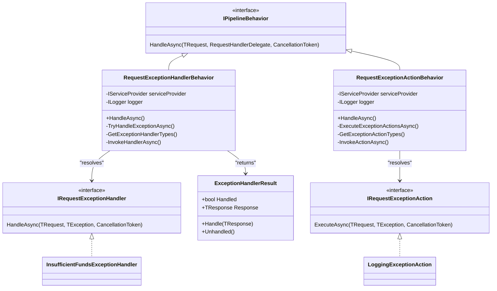
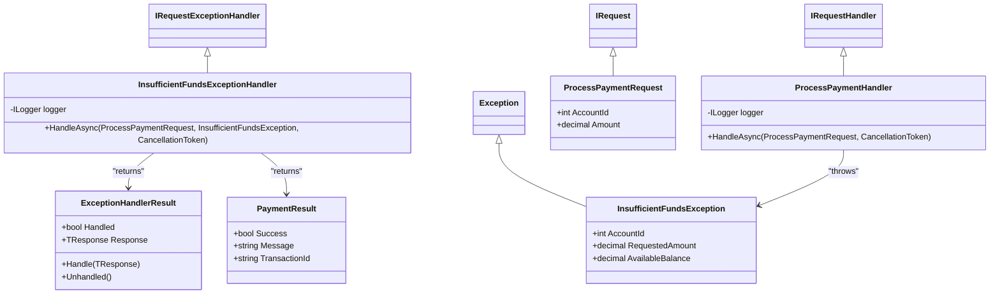
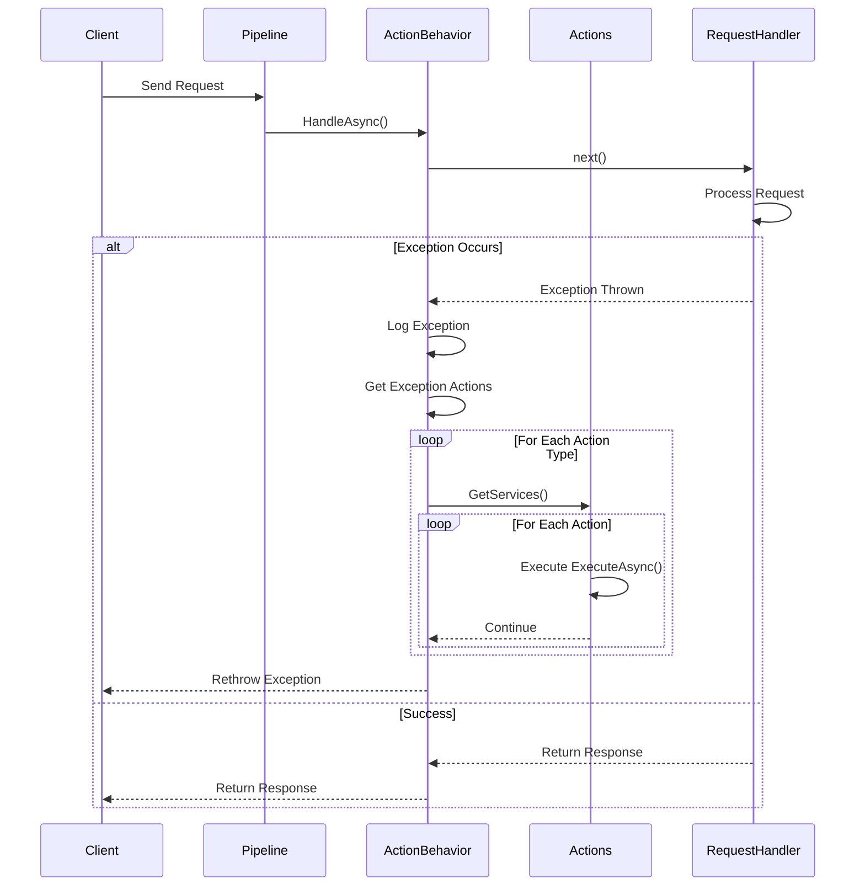
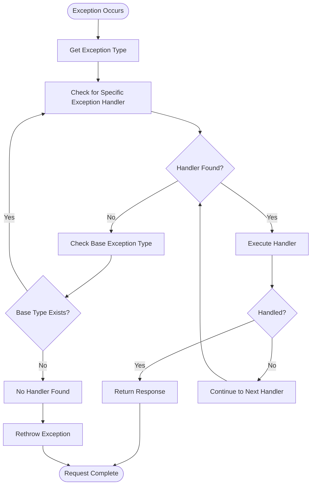
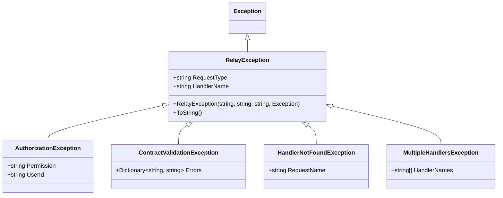

# Exception Handling Example

<cite>
**Referenced Files in This Document**   
- [RequestExceptionHandlerBehavior.cs](file://src/Relay.Core/Pipeline/Behaviors/RequestExceptionHandlerBehavior.cs)
- [IRequestExceptionHandler.cs](file://src/Relay.Core/Pipeline/Interfaces/IRequestExceptionHandler.cs)
- [IRequestExceptionAction.cs](file://src/Relay.Core/Pipeline/Interfaces/IRequestExceptionAction.cs)
- [RequestExceptionActionBehavior.cs](file://src/Relay.Core/Pipeline/Behaviors/RequestExceptionActionBehavior.cs)
- [InsufficientFundsExceptionHandler.cs](file://samples/Relay.MinimalApiSample/Features/Examples/03-ExceptionHandling/InsufficientFundsExceptionHandler.cs)
- [ProcessPaymentHandler.cs](file://samples/Relay.MinimalApiSample/Features/Examples/03-ExceptionHandling/ProcessPaymentHandler.cs)
- [ProcessPayment.cs](file://samples/Relay.MinimalApiSample/Features/Examples/03-ExceptionHandling/ProcessPayment.cs)
- [RelayException.cs](file://src/Relay.Core/Exceptions/RelayException.cs)
</cite>

## Table of Contents
1. [Introduction](#introduction)
2. [Core Exception Handling Architecture](#core-exception-handling-architecture)
3. [Centralized Exception Handling with Pipeline Behaviors](#centralized-exception-handling-with-pipeline-behaviors)
4. [Exception Handler Implementation](#exception-handler-implementation)
5. [Exception Action Implementation](#exception-action-implementation)
6. [Exception Hierarchy and Resolution](#exception-hierarchy-and-resolution)
7. [Error Response Pipeline](#error-response-pipeline)
8. [Security Considerations](#security-considerations)
9. [Logging and Monitoring](#logging-and-monitoring)
10. [Common Exception Types](#common-exception-types)
11. [Best Practices](#best-practices)
12. [Conclusion](#conclusion)

## Introduction

The Relay framework provides a robust exception handling mechanism through its pipeline behavior system, enabling centralized error management across applications. This documentation details how Relay implements exception handling using pipeline behaviors, focusing on the `RequestExceptionHandlerBehavior` and related components. The system allows developers to create resilient applications by providing consistent error handling, transformation, and response mechanisms.

The exception handling system in Relay is designed to be both flexible and comprehensive, supporting two primary patterns: exception handlers that can suppress exceptions and return fallback responses, and exception actions that perform side effects like logging or monitoring without suppressing the exception. This dual approach enables developers to implement sophisticated error management strategies while maintaining clean separation of concerns.

**Section sources**
- [RequestExceptionHandlerBehavior.cs](file://src/Relay.Core/Pipeline/Behaviors/RequestExceptionHandlerBehavior.cs)
- [IRequestExceptionHandler.cs](file://src/Relay.Core/Pipeline/Interfaces/IRequestExceptionHandler.cs)

## Core Exception Handling Architecture

The Relay exception handling system is built around the pipeline behavior pattern, where exception handling is implemented as a middleware layer in the request processing pipeline. The architecture consists of several key components that work together to provide comprehensive error management:



**Diagram sources**
- [RequestExceptionHandlerBehavior.cs](file://src/Relay.Core/Pipeline/Behaviors/RequestExceptionHandlerBehavior.cs)
- [RequestExceptionActionBehavior.cs](file://src/Relay.Core/Pipeline/Behaviors/RequestExceptionActionBehavior.cs)
- [IRequestExceptionHandler.cs](file://src/Relay.Core/Pipeline/Interfaces/IRequestExceptionHandler.cs)
- [IRequestExceptionAction.cs](file://src/Relay.Core/Pipeline/Interfaces/IRequestExceptionAction.cs)

**Section sources**
- [RequestExceptionHandlerBehavior.cs](file://src/Relay.Core/Pipeline/Behaviors/RequestExceptionHandlerBehavior.cs)
- [RequestExceptionActionBehavior.cs](file://src/Relay.Core/Pipeline/Behaviors/RequestExceptionActionBehavior.cs)

## Centralized Exception Handling with Pipeline Behaviors

Relay implements centralized exception handling through the `RequestExceptionHandlerBehavior` pipeline behavior, which acts as a global exception handler for the entire request processing pipeline. This behavior wraps the execution of subsequent pipeline stages and catches any exceptions that occur, providing a consistent mechanism for error handling across the application.

The `RequestExceptionHandlerBehavior` follows a systematic approach to exception handling:

1. **Exception Interception**: The behavior intercepts exceptions thrown during request processing by wrapping the pipeline execution in a try-catch block.
2. **Handler Resolution**: It resolves all registered exception handlers for the specific exception type and its inheritance hierarchy.
3. **Handler Execution**: It executes handlers in order of specificity, starting with the most specific exception type.
4. **Response Transformation**: If a handler successfully processes the exception, it returns a transformed response instead of propagating the exception.
5. **Exception Propagation**: If no handler processes the exception, it is rethrown to be handled by higher-level mechanisms.

```mermaid
sequenceDiagram
participant Client
participant Pipeline
participant Behavior
participant Handlers
participant RequestHandler
Client->>Pipeline : Send Request
Pipeline->>Behavior : HandleAsync()
Behavior->>RequestHandler : next()
RequestHandler->>RequestHandler : Process Request
alt Exception Occurs
RequestHandler-->>Behavior : Exception Thrown
Behavior->>Behavior : Log Exception
Behavior->>Behavior : Get Exception Handlers
loop For Each Handler Type
Behavior->>Handlers : GetServices()
loop For Each Handler
Handlers->>Handlers : Invoke HandleAsync()
alt Handled
Handlers-->>Behavior : Return Handled Result
Behavior-->>Client : Return Response
deactivate Behavior
else Not Handled
Handlers-->>Behavior : Continue
end
end
end
Behavior-->>Client : Rethrow Exception
else Success
RequestHandler-->>Behavior : Return Response
Behavior-->>Client : Return Response
end
```

**Diagram sources**
- [RequestExceptionHandlerBehavior.cs](file://src/Relay.Core/Pipeline/Behaviors/RequestExceptionHandlerBehavior.cs)
- [RequestExceptionActionBehavior.cs](file://src/Relay.Core/Pipeline/Behaviors/RequestExceptionActionBehavior.cs)

**Section sources**
- [RequestExceptionHandlerBehavior.cs](file://src/Relay.Core/Pipeline/Behaviors/RequestExceptionHandlerBehavior.cs)

## Exception Handler Implementation

Exception handlers in Relay implement the `IRequestExceptionHandler<TRequest, TResponse, TException>` interface, allowing them to intercept specific exception types and provide fallback responses. The implementation follows a clear pattern where handlers can either handle the exception (suppressing it and returning a response) or let it propagate to other handlers.

The `ExceptionHandlerResult<TResponse>` struct is central to the exception handling mechanism, providing a type-safe way to indicate whether an exception was handled and what response should be returned:



**Diagram sources**
- [IRequestExceptionHandler.cs](file://src/Relay.Core/Pipeline/Interfaces/IRequestExceptionHandler.cs)
- [InsufficientFundsExceptionHandler.cs](file://samples/Relay.MinimalApiSample/Features/Examples/03-ExceptionHandling/InsufficientFundsExceptionHandler.cs)
- [ProcessPaymentHandler.cs](file://samples/Relay.MinimalApiSample/Features/Examples/03-ExceptionHandling/ProcessPaymentHandler.cs)
- [ProcessPayment.cs](file://samples/Relay.MinimalApiSample/Features/Examples/03-ExceptionHandling/ProcessPayment.cs)

**Section sources**
- [IRequestExceptionHandler.cs](file://src/Relay.Core/Pipeline/Interfaces/IRequestExceptionHandler.cs)
- [InsufficientFundsExceptionHandler.cs](file://samples/Relay.MinimalApiSample/Features/Examples/03-ExceptionHandling/InsufficientFundsExceptionHandler.cs)

## Exception Action Implementation

While exception handlers can suppress exceptions and return responses, exception actions are designed for side effects like logging, monitoring, or notifications. The `IRequestExceptionAction<TRequest, TException>` interface defines actions that execute when specific exceptions occur but cannot suppress the exception.

The `RequestExceptionActionBehavior` executes all registered exception actions before rethrowing the exception, ensuring that important side effects occur regardless of whether the exception is ultimately handled:



**Diagram sources**
- [IRequestExceptionAction.cs](file://src/Relay.Core/Pipeline/Interfaces/IRequestExceptionAction.cs)
- [RequestExceptionActionBehavior.cs](file://src/Relay.Core/Pipeline/Behaviors/RequestExceptionActionBehavior.cs)

**Section sources**
- [IRequestExceptionAction.cs](file://src/Relay.Core/Pipeline/Interfaces/IRequestExceptionAction.cs)
- [RequestExceptionActionBehavior.cs](file://src/Relay.Core/Pipeline/Behaviors/RequestExceptionActionBehavior.cs)

## Exception Hierarchy and Resolution

Relay's exception handling system respects the exception inheritance hierarchy, allowing handlers to be registered for specific exception types or their base types. The `RequestExceptionHandlerBehavior` follows a specific resolution order to ensure the most appropriate handler is used:

1. **Specific to General**: Handlers are resolved starting with the most specific exception type and moving up the inheritance chain to more general types.
2. **First Match Wins**: The first handler that successfully handles the exception (returns `Handled`) stops the resolution process.
3. **Fallback to Base Types**: If no handler is found for the specific exception type, the system checks for handlers of base exception types.

This hierarchical approach enables developers to implement both specific and general exception handling strategies. For example, a specific `InsufficientFundsException` can be handled differently than a general `ValidationException`, while still allowing a fallback handler for all `Exception` types to catch unhandled cases.



**Diagram sources**
- [RequestExceptionHandlerBehavior.cs](file://src/Relay.Core/Pipeline/Behaviors/RequestExceptionHandlerBehavior.cs)

**Section sources**
- [RequestExceptionHandlerBehavior.cs](file://src/Relay.Core/Pipeline/Behaviors/RequestExceptionHandlerBehavior.cs)

## Error Response Pipeline

The error response pipeline in Relay ensures consistent error formatting and transformation across the application. When an exception is handled, the system transforms it into a standardized response format that can be returned to clients. This pipeline includes several key components:

- **Exception to Response Mapping**: Converts specific exceptions into appropriate response objects.
- **Error Message Formatting**: Ensures error messages are user-friendly and consistent.
- **Sensitive Data Protection**: Prevents exposure of sensitive information in error responses.
- **Response Enrichment**: Adds contextual information to error responses when appropriate.

The pipeline behavior system allows for multiple handlers to participate in the error response process, enabling complex error handling scenarios where different components can contribute to the final response.

**Section sources**
- [RequestExceptionHandlerBehavior.cs](file://src/Relay.Core/Pipeline/Behaviors/RequestExceptionHandlerBehavior.cs)
- [IRequestExceptionHandler.cs](file://src/Relay.Core/Pipeline/Interfaces/IRequestExceptionHandler.cs)

## Security Considerations

When implementing exception handling in Relay, several security considerations must be addressed to prevent information disclosure and ensure system integrity:

1. **Error Detail Exposure**: The framework provides mechanisms to control the level of detail exposed in error responses, preventing sensitive information from being revealed to clients.
2. **Exception Type Leakage**: By using the handler pattern, specific exception types can be transformed into generic error responses, preventing attackers from gaining insights into the system's internal structure.
3. **Input Validation Errors**: Validation exceptions are handled consistently to avoid revealing validation rules that could be exploited.
4. **Logging vs. Response**: Sensitive information can be logged for debugging purposes while being excluded from client responses.

The `RelayException` base class includes properties like `RequestType` and `HandlerName` that can be used for internal logging and diagnostics while being filtered out of external responses to maintain security.



**Diagram sources**
- [RelayException.cs](file://src/Relay.Core/Exceptions/RelayException.cs)

**Section sources**
- [RelayException.cs](file://src/Relay.Core/Exceptions/RelayException.cs)

## Logging and Monitoring

The exception handling system in Relay integrates seamlessly with logging and monitoring infrastructure. The `RequestExceptionHandlerBehavior` includes built-in logging capabilities that provide detailed information about exception handling events:

- **Debug Level**: Logs when an exception occurs and handlers are being checked.
- **Information Level**: Logs when an exception is successfully handled.
- **Warning Level**: Logs when specific business exceptions occur (e.g., insufficient funds).
- **Error Level**: Logs when exception handlers themselves fail.

Additionally, the `RequestExceptionActionBehavior` enables the implementation of monitoring actions that can send metrics to monitoring systems, trigger alerts, or update dashboards when specific exceptions occur.

**Section sources**
- [RequestExceptionHandlerBehavior.cs](file://src/Relay.Core/Pipeline/Behaviors/RequestExceptionHandlerBehavior.cs)
- [RequestExceptionActionBehavior.cs](file://src/Relay.Core/Pipeline/Behaviors/RequestExceptionActionBehavior.cs)

## Common Exception Types

The Relay framework defines several common exception types that are used throughout the system:

- **RelayException**: Base exception for all Relay framework errors.
- **HandlerNotFoundException**: Thrown when no handler is found for a request.
- **MultipleHandlersException**: Thrown when multiple handlers are found for a request.
- **AuthorizationException**: Thrown when authorization checks fail.
- **ContractValidationException**: Thrown when request validation fails.
- **RetryExhaustedException**: Thrown when retry policies are exhausted.
- **CircuitBreakerOpenException**: Thrown when a circuit breaker is open.
- **RateLimitExceededException**: Thrown when rate limits are exceeded.

These exception types follow a consistent pattern and can be handled using the same exception handling mechanisms, providing a uniform approach to error management across different scenarios.

**Section sources**
- [RelayException.cs](file://src/Relay.Core/Exceptions/RelayException.cs)
- [HandlerNotFoundException.cs](file://src/Relay.Core/Exceptions/HandlerNotFoundException.cs)
- [MultipleHandlersException.cs](file://src/Relay.Core/Exceptions/MultipleHandlersException.cs)

## Best Practices

When implementing exception handling in Relay applications, consider the following best practices:

1. **Use Specific Exception Handlers**: Implement handlers for specific exception types rather than catching general exceptions when possible.
2. **Provide Meaningful Fallbacks**: When handling exceptions, return meaningful fallback responses that maintain application usability.
3. **Log Sufficient Context**: Include sufficient context in logs to enable debugging while protecting sensitive information.
4. **Implement Monitoring Actions**: Use exception actions for monitoring and alerting rather than handling logic.
5. **Test Exception Scenarios**: Include tests for exception handling scenarios to ensure robustness.
6. **Follow Consistent Error Formats**: Maintain consistent error response formats across the application.
7. **Consider User Experience**: Design error responses with the end user experience in mind.

By following these practices, developers can create resilient applications that handle errors gracefully while maintaining security and usability.

## Conclusion

The Relay framework's exception handling system provides a powerful and flexible mechanism for managing errors in distributed applications. Through the use of pipeline behaviors, the system enables centralized exception handling that is both comprehensive and extensible. The distinction between exception handlers (which can suppress exceptions) and exception actions (which perform side effects) allows for sophisticated error management strategies that separate concerns effectively.

The hierarchical handler resolution, consistent error response pipeline, and integration with logging and monitoring systems make Relay's exception handling approach suitable for building resilient applications that can gracefully handle failures while maintaining security and usability. By leveraging these features, developers can create applications that are robust, maintainable, and provide excellent user experiences even in the face of errors.