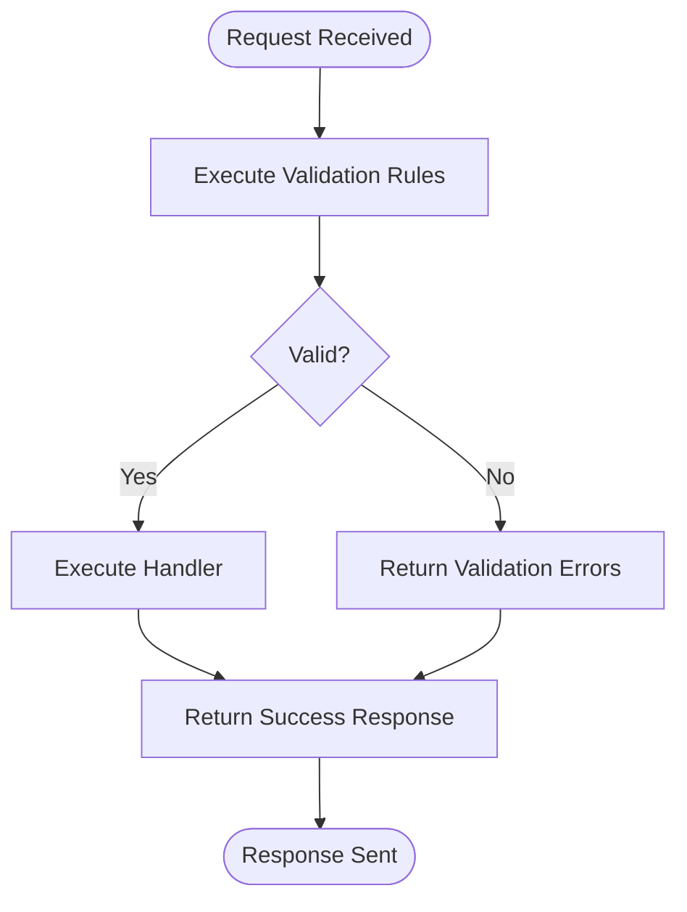
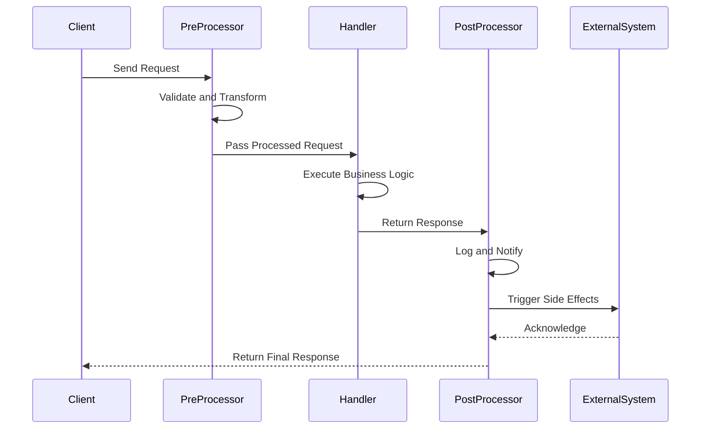
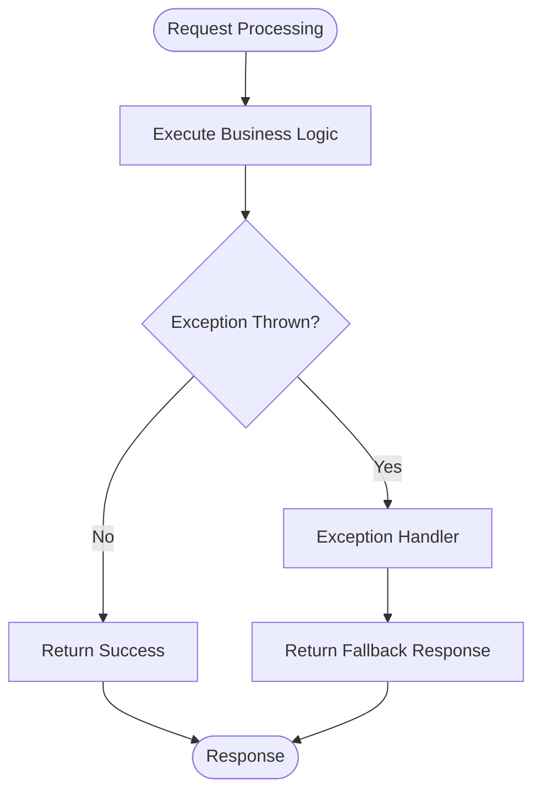
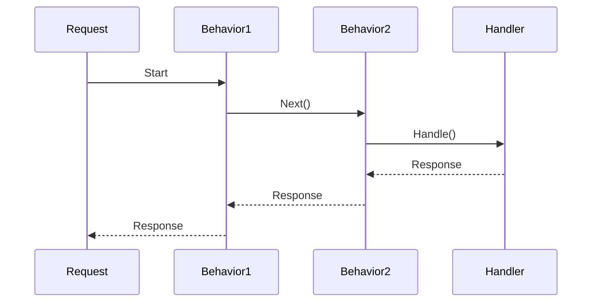
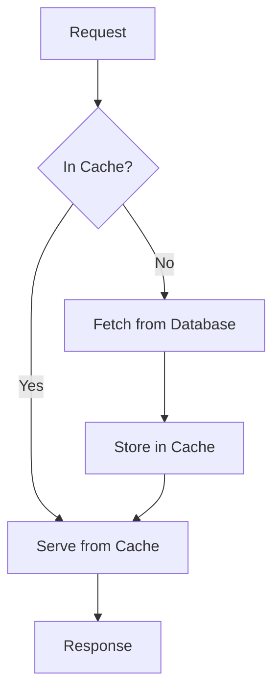
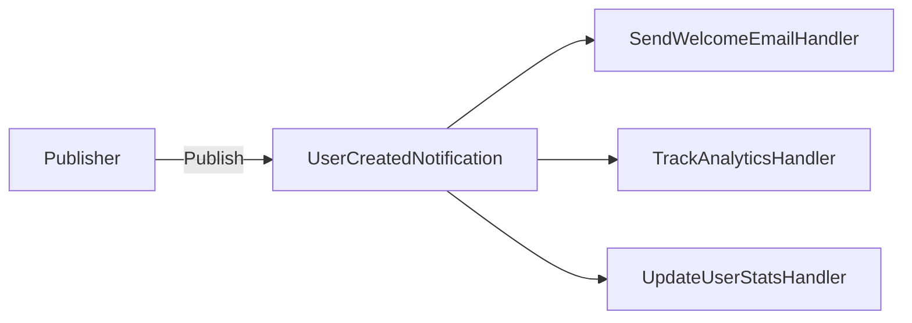
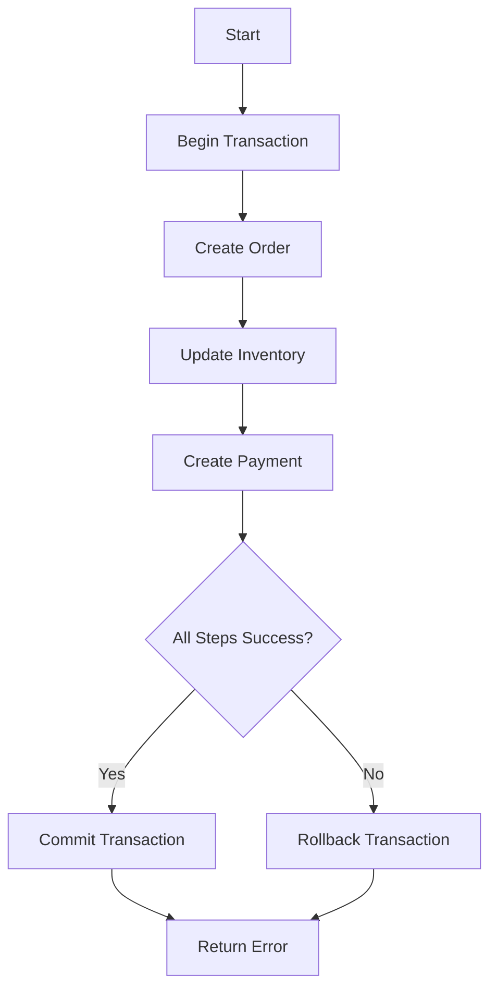
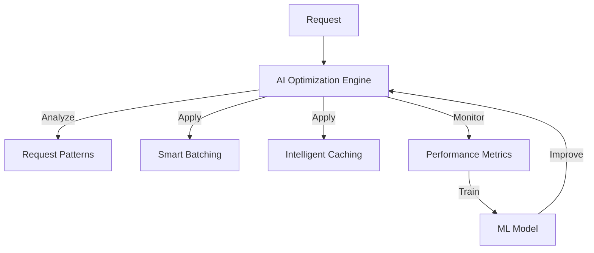
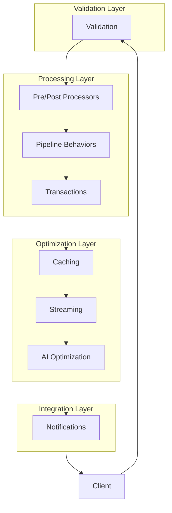

# Feature Examples Sample

<cite>
**Referenced Files in This Document**   
- [FEATURE_EXAMPLES.md](file://samples/Relay.MinimalApiSample/FEATURE_EXAMPLES.md)
- [README.md](file://samples/Relay.MinimalApiSample/Features/Examples/README.md)
- [RegisterUserValidator.cs](file://samples/Relay.MinimalApiSample/Features/Examples/01-Validation/RegisterUserValidator.cs)
- [RegisterUserHandler.cs](file://samples/Relay.MinimalApiSample/Features/Examples/01-Validation/RegisterUserHandler.cs)
- [CreateOrderPreProcessor.cs](file://samples/Relay.MinimalApiSample/Features/Examples/02-PrePostProcessors/CreateOrderPreProcessor.cs)
- [CreateOrderPostProcessor.cs](file://samples/Relay.MinimalApiSample/Features/Examples/02-PrePostProcessors/CreateOrderPostProcessor.cs)
- [InsufficientFundsExceptionHandler.cs](file://samples/Relay.MinimalApiSample/Features/Examples/03-ExceptionHandling/InsufficientFundsExceptionHandler.cs)
- [LoggingBehavior.cs](file://samples/Relay.MinimalApiSample/Features/Examples/04-PipelineBehaviors/LoggingBehavior.cs)
- [GetCachedProductsHandler.cs](file://samples/Relay.MinimalApiSample/Features/Examples/05-Caching/GetCachedProductsHandler.cs)
- [UserCreatedNotification.cs](file://samples/Relay.MinimalApiSample/Features/Examples/06-Notifications/UserCreatedNotification.cs)
- [StreamLogsHandler.cs](file://samples/Relay.MinimalApiSample/Features/Examples/07-Streaming/StreamLogsHandler.cs)
- [CreateOrderTransactionHandler.cs](file://samples/Relay.MinimalApiSample/Features/Examples/08-Transactions/CreateOrderTransactionHandler.cs)
- [ProductRecommendationHandler.cs](file://samples/Relay.MinimalApiSample/Features/Examples/09-AIOptimization/ProductRecommendationHandler.cs)
</cite>

## Table of Contents
1. [Introduction](#introduction)
2. [Validation](#validation)
3. [Pre/Post Processors](#prepost-processors)
4. [Exception Handling](#exception-handling)
5. [Pipeline Behaviors](#pipeline-behaviors)
6. [Caching](#caching)
7. [Notifications](#notifications)
8. [Streaming](#streaming)
9. [Transactions](#transactions)
10. [AI Optimization](#ai-optimization)
11. [Feature Integration Scenarios](#feature-integration-scenarios)
12. [Best Practices](#best-practices)

## Introduction

The Relay framework provides a comprehensive set of features for building robust, high-performance .NET applications. This document details the implementation of key features through practical examples from the Relay.MinimalApiSample project. Each feature is designed to address specific architectural concerns while maintaining simplicity and developer productivity.

The examples demonstrate how Relay's mediator pattern enables clean separation of concerns, allowing developers to focus on business logic while the framework handles cross-cutting concerns like validation, error handling, and performance optimization. The feature set spans from basic validation to advanced AI-powered optimization, providing a complete toolkit for modern application development.

**Section sources**
- [FEATURE_EXAMPLES.md](file://samples/Relay.MinimalApiSample/FEATURE_EXAMPLES.md)
- [README.md](file://samples/Relay.MinimalApiSample/Features/Examples/README.md)

## Validation

The validation feature provides automatic request validation before handlers execute. This ensures data integrity and provides comprehensive error messages to clients.

### Implementation Details
The validation system uses the `IValidationRule<T>` interface to define validation logic for specific request types. Validators are automatically executed in the pipeline before the request handler. The system supports both synchronous and asynchronous validation, allowing for complex validation scenarios including database lookups.

### Example: User Registration
The user registration example demonstrates comprehensive validation rules for username, email, password, and age fields. The `RegisterUserValidator` implements `IValidationRule<RegisterUserRequest>` and checks multiple conditions:
- Username must be 3-50 characters and alphanumeric
- Email must be valid format
- Password must meet complexity requirements
- Age must be between 18-120



**Diagram sources**
- [RegisterUserValidator.cs](file://samples/Relay.MinimalApiSample/Features/Examples/01-Validation/RegisterUserValidator.cs)

**Section sources**
- [RegisterUserValidator.cs](file://samples/Relay.MinimalApiSample/Features/Examples/01-Validation/RegisterUserValidator.cs)
- [RegisterUserHandler.cs](file://samples/Relay.MinimalApiSample/Features/Examples/01-Validation/RegisterUserHandler.cs)

## Pre/Post Processors

Pre and post processors enable cross-cutting concerns to be handled before and after request processing. This pattern is ideal for audit logging, data transformation, and other preprocessing tasks.

### Implementation Details
The system uses two interfaces:
- `IRequestPreProcessor<T>` for pre-processing
- `IRequestPostProcessor<T, TResult>` for post-processing

Processors are automatically discovered and executed in the pipeline. Multiple processors can be registered for the same request type, allowing for modular cross-cutting concerns.

### Example: Order Processing
The order processing example demonstrates both pre and post processors:
- **Pre-processor**: Validates stock availability and calculates final price
- **Post-processor**: Logs order creation and triggers notifications



**Diagram sources**
- [CreateOrderPreProcessor.cs](file://samples/Relay.MinimalApiSample/Features/Examples/02-PrePostProcessors/CreateOrderPreProcessor.cs)
- [CreateOrderPostProcessor.cs](file://samples/Relay.MinimalApiSample/Features/Examples/02-PrePostProcessors/CreateOrderPostProcessor.cs)

**Section sources**
- [CreateOrderPreProcessor.cs](file://samples/Relay.MinimalApiSample/Features/Examples/02-PrePostProcessors/CreateOrderPreProcessor.cs)
- [CreateOrderPostProcessor.cs](file://samples/Relay.MinimalApiSample/Features/Examples/02-PrePostProcessors/CreateOrderPostProcessor.cs)

## Exception Handling

The exception handling system provides graceful error management by converting exceptions into meaningful responses. This prevents unhandled exceptions from crashing the application and provides consistent error responses.

### Implementation Details
The system uses `IRequestExceptionHandler<TRequest, TResult, TException>` to handle specific exception types. Handlers can:
- Return fallback responses
- Log detailed error information
- Suppress exceptions
- Provide user-friendly error messages

### Example: Payment Processing
The payment processing example handles `InsufficientFundsException` by returning a graceful fallback response instead of failing the request. The handler provides a clear message about the insufficient balance while maintaining system stability.



**Diagram sources**
- [InsufficientFundsExceptionHandler.cs](file://samples/Relay.MinimalApiSample/Features/Examples/03-ExceptionHandling/InsufficientFundsExceptionHandler.cs)

**Section sources**
- [InsufficientFundsExceptionHandler.cs](file://samples/Relay.MinimalApiSample/Features/Examples/03-ExceptionHandling/InsufficientFundsExceptionHandler.cs)
- [ProcessPaymentHandler.cs](file://samples/Relay.MinimalApiSample/Features/Examples/03-ExceptionHandling/ProcessPaymentHandler.cs)

## Pipeline Behaviors

Pipeline behaviors provide a way to implement cross-cutting concerns that apply to all requests. These behaviors form a pipeline through which every request passes, enabling consistent handling of concerns like logging and performance monitoring.

### Implementation Details
Behaviors implement `IPipelineBehavior<TRequest, TResponse>` and wrap the request handling process. Multiple behaviors can be chained together, creating a pipeline of processing steps. Each behavior can execute code before and after the next behavior in the chain.

### Example: Request Logging
The logging behavior example demonstrates how to log request execution times. The behavior uses a stopwatch to measure execution time and logs both successful completions and failures with appropriate log levels.



**Diagram sources**
- [LoggingBehavior.cs](file://samples/Relay.MinimalApiSample/Features/Examples/04-PipelineBehaviors/LoggingBehavior.cs)

**Section sources**
- [LoggingBehavior.cs](file://samples/Relay.MinimalApiSample/Features/Examples/04-PipelineBehaviors/LoggingBehavior.cs)

## Caching

The caching system provides response caching to improve performance for read-heavy operations. It supports both in-memory and distributed caching with configurable time-to-live (TTL) settings.

### Implementation Details
Caching is implemented through the `[CacheResponse]` attribute or programmatically via configuration. The system automatically:
- Generates cache keys based on request parameters
- Stores responses with specified TTL
- Serves cached responses for subsequent requests
- Handles cache invalidation

### Example: Product List Caching
The product list example caches database results for 5 minutes. The first request retrieves data from the database (slow), while subsequent requests serve the data from cache (fast), significantly improving response times.



**Diagram sources**
- [GetCachedProductsHandler.cs](file://samples/Relay.MinimalApiSample/Features/Examples/05-Caching/GetCachedProductsHandler.cs)

**Section sources**
- [GetCachedProductsHandler.cs](file://samples/Relay.MinimalApiSample/Features/Examples/05-Caching/GetCachedProductsHandler.cs)
- [GetCachedProducts.cs](file://samples/Relay.MinimalApiSample/Features/Examples/05-Caching/GetCachedProducts.cs)

## Notifications

The notification system enables event-driven architecture by allowing events to be published and handled by multiple subscribers. This promotes loose coupling between components.

### Implementation Details
Notifications implement the `INotification` interface and can be handled by multiple handlers implementing `INotificationHandler<T>`. The system supports:
- Sequential or parallel execution
- Handler prioritization
- Multiple handlers per event
- Graceful error handling in handlers

### Example: User Creation
The user creation example publishes a `UserCreatedNotification` that triggers multiple actions:
- Send welcome email
- Track analytics
- Update user statistics

Each handler executes independently, ensuring that failure in one handler doesn't affect others.



**Diagram sources**
- [UserCreatedNotification.cs](file://samples/Relay.MinimalApiSample/Features/Examples/06-Notifications/UserCreatedNotification.cs)

**Section sources**
- [UserCreatedNotification.cs](file://samples/Relay.MinimalApiSample/Features/Examples/06-Notifications/UserCreatedNotification.cs)
- [SendWelcomeEmailHandler.cs](file://samples/Relay.MinimalApiSample/Features/Examples/06-Notifications/SendWelcomeEmailHandler.cs)
- [TrackAnalyticsHandler.cs](file://samples/Relay.MinimalApiSample/Features/Examples/06-Notifications/TrackAnalyticsHandler.cs)

## Streaming

The streaming feature enables efficient processing of large datasets through `IAsyncEnumerable<T>`. This allows for memory-efficient handling of large result sets and real-time data streaming.

### Implementation Details
Streaming requests implement `IStreamRequest<T>` and handlers implement `IStreamRequestHandler<TRequest, T>`. The system supports:
- Server-Sent Events (SSE)
- Backpressure handling
- Memory-efficient processing
- Real-time data delivery

### Example: Log Streaming
The log streaming example demonstrates how to stream log entries in real-time. The handler returns an `IAsyncEnumerable<LogEntry>` that can be consumed by the client as data becomes available, without loading all data into memory at once.

```mermaid
flowchart TD
Client --> |Connect| Server
Server --> |Open Stream| Database
Database --> |Stream Results| Server
loop Stream Data
Server --> |Send Chunk| Client
end
Client --> |Close| Server
```

**Section sources**
- [StreamLogsHandler.cs](file://samples/Relay.MinimalApiSample/Features/Examples/07-Streaming/StreamLogsHandler.cs)
- [StreamLogs.cs](file://samples/Relay.MinimalApiSample/Features/Examples/07-Streaming/StreamLogs.cs)

## Transactions

The transaction management system provides ACID guarantees for database operations. It ensures data consistency by automatically managing transactions around request handling.

### Implementation Details
Transactional requests implement `ITransactionalRequest<T>` and are automatically wrapped in a transaction. The system handles:
- Transaction creation
- Commit on success
- Rollback on failure
- Nested transactions
- Unit of work pattern

### Example: Order Creation
The order creation example demonstrates a transactional operation that:
- Creates an order record
- Updates inventory
- Creates a payment record

If any step fails, all changes are rolled back, maintaining data consistency.



**Section sources**
- [CreateOrderTransactionHandler.cs](file://samples/Relay.MinimalApiSample/Features/Examples/08-Transactions/CreateOrderTransactionHandler.cs)
- [CreateOrderTransaction.cs](file://samples/Relay.MinimalApiSample/Features/Examples/08-Transactions/CreateOrderTransaction.cs)

## AI Optimization

The AI optimization feature uses machine learning to automatically improve performance. It analyzes request patterns and applies optimizations like smart batching and intelligent caching.

### Implementation Details
The system uses `[AIOptimized]` and related attributes to enable AI-powered optimizations:
- Smart batching based on request patterns
- Intelligent caching with dynamic TTL
- Performance tracking for model training
- Risk assessment with confidence scoring

### Example: Product Recommendations
The product recommendation example demonstrates AI optimization with:
- Dynamic batching of similar requests
- Predictive caching based on access patterns
- Performance monitoring and model training
- Confidence scoring for optimization decisions



**Section sources**
- [ProductRecommendationHandler.cs](file://samples/Relay.MinimalApiSample/Features/Examples/09-AIOptimization/ProductRecommendationHandler.cs)
- [ProductRecommendation.cs](file://samples/Relay.MinimalApiSample/Features/Examples/09-AIOptimization/ProductRecommendation.cs)

## Feature Integration Scenarios

The Relay framework allows multiple features to be combined for complex scenarios. The following examples demonstrate how features work together.

### Scenario 1: Validated Transactional Operation
Combines validation, transactions, and exception handling:
1. Request validation ensures data integrity
2. Transaction ensures data consistency
3. Exception handling provides graceful degradation

### Scenario 2: Cached Streaming
Combines caching and streaming for large datasets:
1. Cache stores frequently accessed data
2. Streaming delivers data efficiently
3. Cache invalidation maintains freshness

### Scenario 3: AI-Optimized Notifications
Combines AI optimization and notifications:
1. AI predicts optimal notification batching
2. Multiple notifications are processed efficiently
3. Performance is continuously improved through learning



**Diagram sources**
- [FEATURE_EXAMPLES.md](file://samples/Relay.MinimalApiSample/FEATURE_EXAMPLES.md)

## Best Practices

### ✅ Do's
1. **Validation**: Create validators for every request to ensure data integrity
2. **Pre/Post Processors**: Use for cross-cutting concerns like audit logging
3. **Exception Handling**: Provide graceful degradation with meaningful fallbacks
4. **Pipeline Behaviors**: Implement common operations like logging and timing
5. **Caching**: Use for read-heavy operations to improve performance
6. **Notifications**: Leverage for event-driven architecture and loose coupling
7. **Streaming**: Prefer for large datasets to maintain memory efficiency
8. **Transactions**: Use for write operations requiring data consistency
9. **AI Optimization**: Enable for high-traffic, performance-critical handlers

### ❌ Don'ts
1. Avoid validation logic in handlers; keep it in dedicated validators
2. Don't use try-catch blocks everywhere; use exception handlers instead
3. Avoid caching write operations; caching is best for read operations
4. Don't use streaming for small datasets; it adds unnecessary complexity
5. Avoid transactions for read operations; they add overhead without benefit

**Section sources**
- [FEATURE_EXAMPLES.md](file://samples/Relay.MinimalApiSample/FEATURE_EXAMPLES.md)
- [README.md](file://samples/Relay.MinimalApiSample/Features/Examples/README.md)