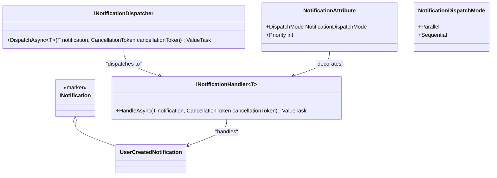
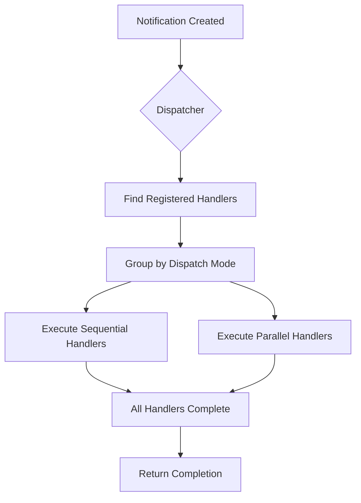
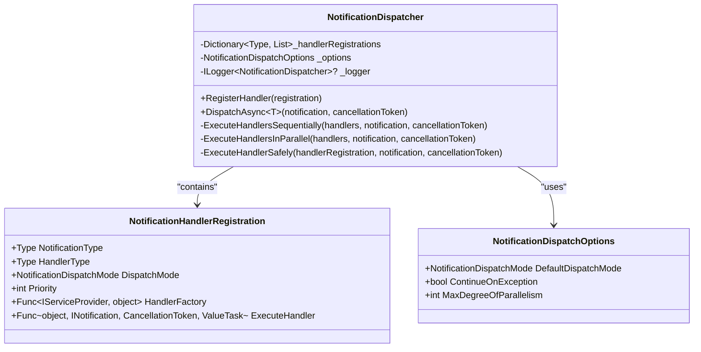
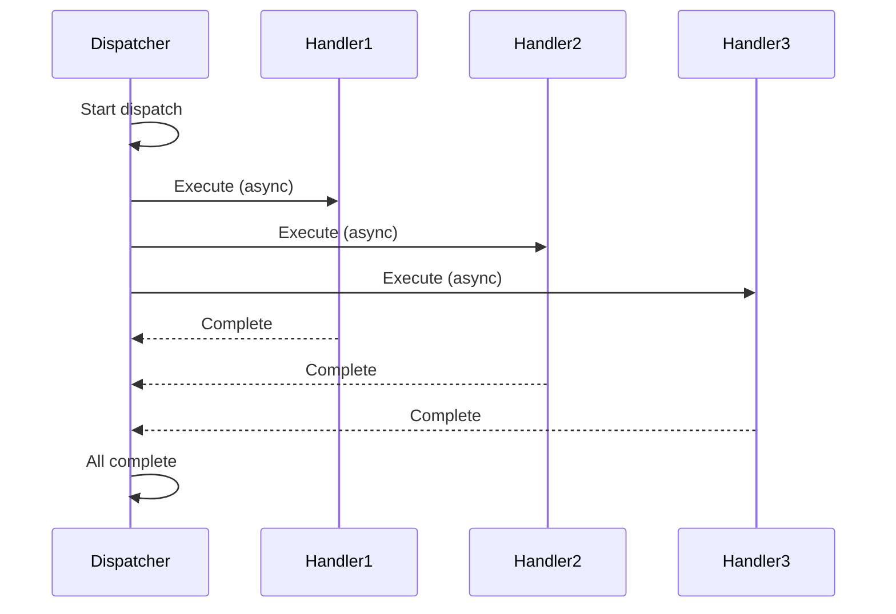
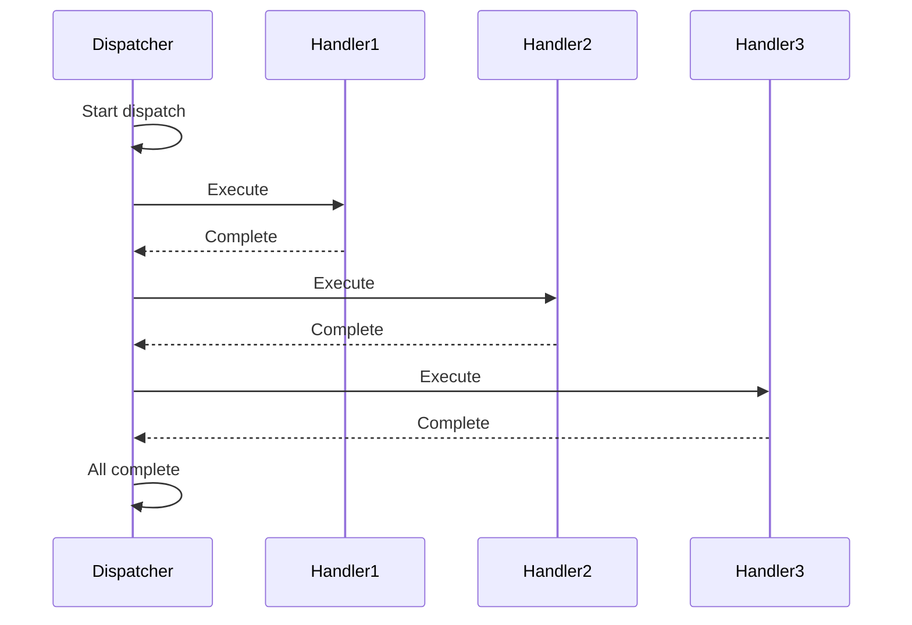
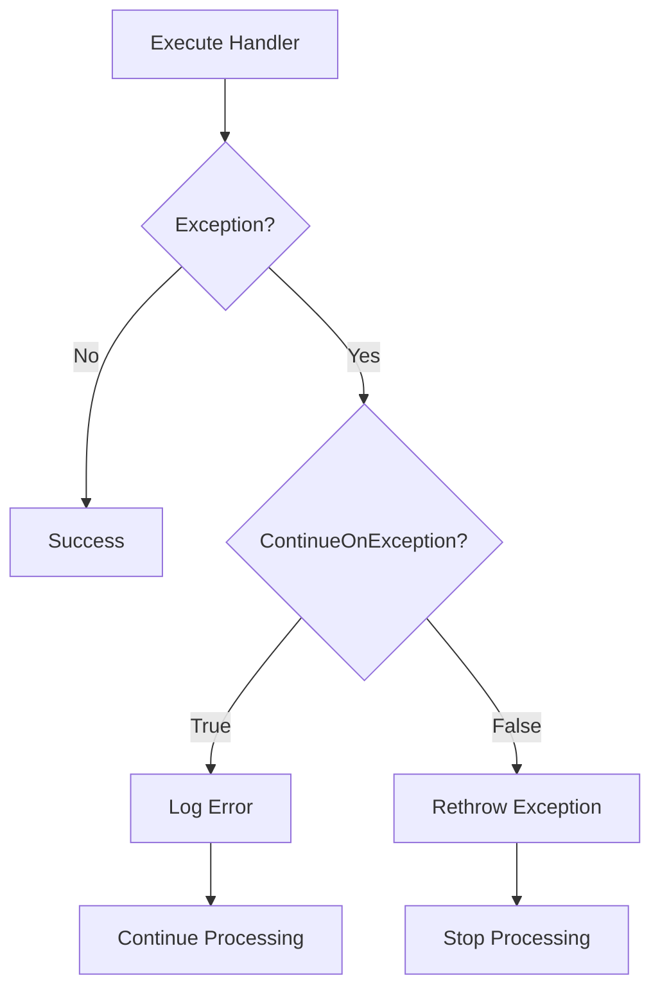
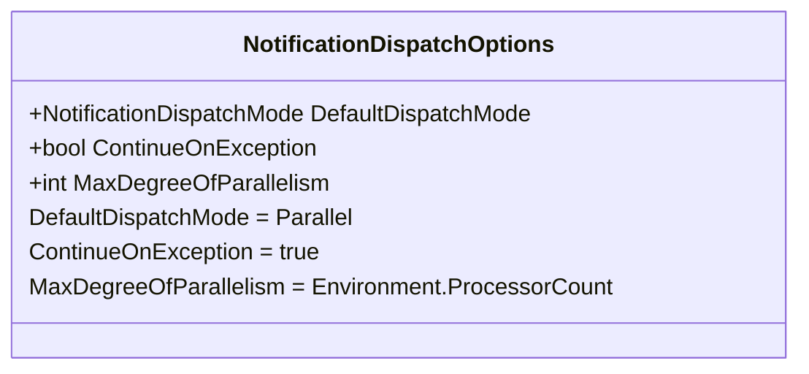
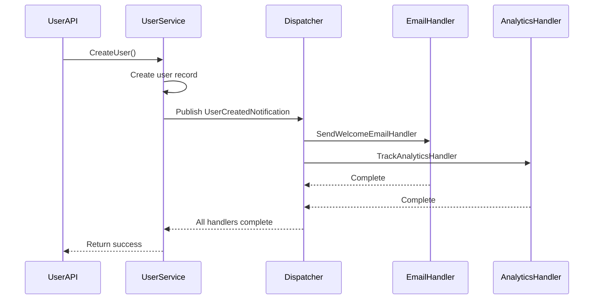

# Notifications Example

<cite>
**Referenced Files in This Document**   
- [UserCreatedNotification.cs](file://samples/Relay.MinimalApiSample/Features/Examples/06-Notifications/UserCreatedNotification.cs)
- [SendWelcomeEmailHandler.cs](file://samples/Relay.MinimalApiSample/Features/Examples/06-Notifications/SendWelcomeEmailHandler.cs)
- [TrackAnalyticsHandler.cs](file://samples/Relay.MinimalApiSample/Features/Examples/06-Notifications/TrackAnalyticsHandler.cs)
- [NotificationAttribute.cs](file://src/Relay.Core/Attributes/NotificationAttribute.cs)
- [NotificationDispatchMode.cs](file://src/Relay.Core/Attributes/NotificationDispatchMode.cs)
- [INotification.cs](file://src/Relay.Core/Contracts/Requests/INotification.cs)
- [INotificationDispatcher.cs](file://src/Relay.Core/Contracts/Dispatchers/INotificationDispatcher.cs)
- [NotificationDispatcher.cs](file://src/Relay.Core/Implementation/Dispatchers/NotificationDispatcher.cs)
- [BaseNotificationDispatcher.cs](file://src/Relay.Core/Implementation/Base/BaseNotificationDispatcher.cs)
- [NotificationDispatchOptions.cs](file://src/Relay.Core/Implementation/Configuration/NotificationDispatchOptions.cs)
- [NotificationHandlerRegistration.cs](file://src/Relay.Core/Implementation/Configuration/NotificationHandlerRegistration.cs)
</cite>

## Table of Contents
1. [Introduction](#introduction)
2. [Core Concepts](#core-concepts)
3. [Notification Implementation](#notification-implementation)
4. [Handler Registration and Dispatching](#handler-registration-and-dispatching)
5. [Dispatch Modes](#dispatch-modes)
6. [Error Handling and Recovery](#error-handling-and-recovery)
7. [Configuration Options](#configuration-options)
8. [Practical Example](#practical-example)
9. [Common Issues and Solutions](#common-issues-and-solutions)
10. [Conclusion](#conclusion)

## Introduction

The Relay framework provides a robust event-driven notifications system based on the publish-subscribe pattern. This document explains the implementation of notification handling in Relay, focusing on how multiple handlers can respond to the same notification through a flexible dispatch mechanism. The system enables developers to build decoupled, scalable applications where business events trigger multiple independent actions without tight coupling between components.

The notifications feature allows for reliable message processing with configurable dispatch modes, error handling strategies, and message delivery guarantees. This documentation provides both beginner-friendly explanations and technical depth for experienced developers building event-driven architectures.

## Core Concepts

The notification system in Relay is built around several key concepts that enable event-driven communication between application components:



**Diagram sources**
- [INotification.cs](file://src/Relay.Core/Contracts/Requests/INotification.cs)
- [INotificationDispatcher.cs](file://src/Relay.Core/Contracts/Dispatchers/INotificationDispatcher.cs)
- [NotificationAttribute.cs](file://src/Relay.Core/Attributes/NotificationAttribute.cs)
- [NotificationDispatchMode.cs](file://src/Relay.Core/Attributes/NotificationDispatchMode.cs)

**Section sources**
- [INotification.cs](file://src/Relay.Core/Contracts/Requests/INotification.cs#L1-L9)
- [INotificationDispatcher.cs](file://src/Relay.Core/Contracts/Dispatchers/INotificationDispatcher.cs#L1-L23)

### Notification Messages

Notifications in Relay are simple data transfer objects that implement the `INotification` interface. This marker interface identifies types that can be published to multiple handlers:

```csharp
public interface INotification
{
}
```

Notifications are typically implemented as records or classes containing the data relevant to the business event. For example:

```csharp
public record UserCreatedNotification(
    Guid UserId,
    string Username,
    string Email
) : INotification;
```

### Notification Handlers

Handlers are classes that implement the `INotificationHandler<T>` interface, where T is the specific notification type they handle. Each handler contains a single `HandleAsync` method that defines the action to take when the notification is received.

### Notification Dispatcher

The `INotificationDispatcher` interface defines the contract for dispatching notifications to their handlers:

```csharp
public interface INotificationDispatcher
{
    ValueTask DispatchAsync<TNotification>(TNotification notification, CancellationToken cancellationToken)
        where TNotification : INotification;
}
```

The dispatcher is responsible for finding all registered handlers for a given notification type and executing them according to the configured dispatch mode.

## Notification Implementation

The notification system in Relay uses attributes and code generation to create efficient dispatchers at compile time. The core implementation revolves around the `NotificationAttribute` which decorates handler methods to configure their behavior.



**Diagram sources**
- [NotificationDispatcher.cs](file://src/Relay.Core/Implementation/Dispatchers/NotificationDispatcher.cs#L1-L225)
- [BaseNotificationDispatcher.cs](file://src/Relay.Core/Implementation/Base/BaseNotificationDispatcher.cs#L1-L63)

**Section sources**
- [NotificationDispatcher.cs](file://src/Relay.Core/Implementation/Dispatchers/NotificationDispatcher.cs#L1-L225)
- [BaseNotificationDispatcher.cs](file://src/Relay.Core/Implementation/Base/BaseNotificationDispatcher.cs#L1-L63)

### Notification Attribute

The `NotificationAttribute` is applied to handler methods to configure how they process notifications:

```csharp
[AttributeUsage(AttributeTargets.Method)]
public class NotificationAttribute : Attribute
{
    public NotificationDispatchMode DispatchMode { get; set; } = NotificationDispatchMode.Parallel;
    
    public int Priority { get; set; } = 0;
}
```

This attribute allows configuration of two key properties:
- **DispatchMode**: Determines whether the handler executes in parallel or sequentially with other handlers
- **Priority**: Controls the execution order when multiple handlers use sequential dispatch

### Notification Dispatch Modes

Relay supports two dispatch modes through the `NotificationDispatchMode` enum:

```csharp
public enum NotificationDispatchMode
{
    /// Execute notification handlers in parallel
    Parallel,
    
    /// Execute notification handlers sequentially
    Sequential
}
```

These modes provide flexibility in how handlers are executed, allowing developers to choose the appropriate strategy based on their requirements for performance, ordering, and resource usage.

## Handler Registration and Dispatching

The notification dispatcher manages handler registration and execution through a registration system that collects handler metadata at startup and uses it to efficiently dispatch notifications.



**Diagram sources**
- [NotificationDispatcher.cs](file://src/Relay.Core/Implementation/Dispatchers/NotificationDispatcher.cs#L1-L225)
- [NotificationHandlerRegistration.cs](file://src/Relay.Core/Implementation/Configuration/NotificationHandlerRegistration.cs#L1-L43)
- [NotificationDispatchOptions.cs](file://src/Relay.Core/Implementation/Configuration/NotificationDispatchOptions.cs#L1-L25)

**Section sources**
- [NotificationDispatcher.cs](file://src/Relay.Core/Implementation/Dispatchers/NotificationDispatcher.cs#L1-L225)
- [NotificationHandlerRegistration.cs](file://src/Relay.Core/Implementation/Configuration/NotificationHandlerRegistration.cs#L1-L43)

### Handler Registration Process

When the application starts, the framework discovers all classes that implement `INotificationHandler<T>` and creates `NotificationHandlerRegistration` instances for each one. These registrations contain all the metadata needed to invoke the handler, including:

- The notification type being handled
- The handler type
- Dispatch mode configuration
- Priority level
- Factory function to create handler instances
- Execution function to invoke the handler method

The dispatcher stores these registrations in a dictionary keyed by notification type, enabling O(1) lookup when dispatching notifications.

### Dispatching Workflow

When a notification is dispatched, the system follows this workflow:

1. Validate the notification object
2. Look up all registered handlers for the notification type
3. Group handlers by dispatch mode (parallel vs sequential)
4. Execute sequential handlers first (in priority order)
5. Execute parallel handlers concurrently
6. Return a ValueTask representing completion of all handlers

The dispatcher also includes fallback logic to handle cases where no explicitly registered handlers exist but DI-registered handlers are available.

## Dispatch Modes

Relay provides two distinct dispatch modes that offer different trade-offs between performance and ordering guarantees.

### Parallel Dispatch Mode

The default dispatch mode in Relay is `Parallel`, which executes compatible handlers concurrently. This mode maximizes throughput and minimizes latency by allowing independent handlers to run simultaneously.



**Diagram sources**
- [NotificationDispatcher.cs](file://src/Relay.Core/Implementation/Dispatchers/NotificationDispatcher.cs#L140-L167)
- [NotificationDispatchMode.cs](file://src/Relay.Core/Attributes/NotificationDispatchMode.cs#L1-L18)

**Section sources**
- [NotificationDispatcher.cs](file://src/Relay.Core/Implementation/Dispatchers/NotificationDispatcher.cs#L140-L167)

Key characteristics of parallel dispatch:
- Handlers run concurrently using Task.WhenAll
- No guaranteed execution order between handlers
- Maximum performance and throughput
- Best for independent, non-blocking operations
- Uses Task.Factory.StartNew with Unwrap for immediate scheduling

### Sequential Dispatch Mode

The `Sequential` dispatch mode executes handlers one after another in a specific order. This mode provides ordering guarantees at the cost of reduced throughput.



**Diagram sources**
- [NotificationDispatcher.cs](file://src/Relay.Core/Implementation/Dispatchers/NotificationDispatcher.cs#L124-L134)
- [NotificationDispatchMode.cs](file://src/Relay.Core/Attributes/NotificationDispatchMode.cs#L1-L18)

**Section sources**
- [NotificationDispatcher.cs](file://src/Relay.Core/Implementation/Dispatchers/NotificationDispatcher.cs#L124-L134)

Key characteristics of sequential dispatch:
- Handlers execute in order of priority (higher priority first)
- Each handler must complete before the next begins
- Guaranteed execution order
- Lower throughput than parallel mode
- Necessary when handlers have dependencies or shared state

### Mixed Mode Dispatching

Relay supports a hybrid approach where different handlers for the same notification can use different dispatch modes. The dispatcher automatically groups handlers by mode and executes them appropriately:

1. Sequential handlers execute first (in priority order)
2. Parallel handlers execute concurrently afterward

This allows fine-grained control over performance and ordering requirements within the same notification system.

## Error Handling and Recovery

The notification system includes comprehensive error handling mechanisms to ensure reliable message processing and graceful recovery from failures.



**Diagram sources**
- [NotificationDispatcher.cs](file://src/Relay.Core/Implementation/Dispatchers/NotificationDispatcher.cs#L172-L201)
- [NotificationDispatchOptions.cs](file://src/Relay.Core/Implementation/Configuration/NotificationDispatchOptions.cs#L1-L25)

**Section sources**
- [NotificationDispatcher.cs](file://src/Relay.Core/Implementation/Dispatchers/NotificationDispatcher.cs#L172-L201)

### Exception Isolation

Each handler executes in isolation, meaning that an exception in one handler does not automatically prevent other handlers from executing. This is controlled by the `ContinueOnException` option in `NotificationDispatchOptions`:

```csharp
public class NotificationDispatchOptions
{
    public bool ContinueOnException { get; set; } = true;
}
```

When `ContinueOnException` is true (the default), exceptions in individual handlers are caught and logged, but processing continues with remaining handlers. When false, exceptions are rethrown, stopping further handler execution.

### Safe Execution Context

Each handler executes within its own dependency injection scope, created specifically for that handler invocation:

```csharp
using var scope = CreateScope();
var handler = handlerRegistration.HandlerFactory(scope.ServiceProvider);
```

This ensures that:
- Each handler gets fresh service instances
- Scoped services are properly disposed
- Memory leaks are prevented
- Cross-handler contamination is avoided

### Logging and Diagnostics

The dispatcher includes comprehensive logging at multiple levels:
- Debug: Handler registration and dispatch counts
- Information: Handler-specific business logging
- Trace: Detailed execution flow
- Error: Handler failures and exceptions

This provides visibility into the notification processing pipeline and aids in troubleshooting issues.

## Configuration Options

The notification system is highly configurable through the `NotificationDispatchOptions` class, which allows tuning of various behaviors.



**Diagram sources**
- [NotificationDispatchOptions.cs](file://src/Relay.Core/Implementation/Configuration/NotificationDispatchOptions.cs#L1-L25)

**Section sources**
- [NotificationDispatchOptions.cs](file://src/Relay.Core/Implementation/Configuration/NotificationDispatchOptions.cs#L1-L25)

### Default Dispatch Mode

The `DefaultDispatchMode` property sets the default dispatch behavior for handlers that don't explicitly specify a mode:

```csharp
public NotificationDispatchMode DefaultDispatchMode { get; set; } = NotificationDispatchMode.Parallel;
```

This allows applications to establish a default policy while still permitting overrides at the handler level.

### Continue on Exception

The `ContinueOnException` flag controls whether the dispatcher continues processing remaining handlers when one fails:

```csharp
public bool ContinueOnException { get; set; } = true;
```

Setting this to false makes the notification system fail-fast, which can be useful in scenarios where all handlers must succeed for business integrity.

### Maximum Degree of Parallelism

The `MaxDegreeOfParallelism` setting limits the number of concurrent handlers in parallel dispatch mode:

```csharp
public int MaxDegreeOfParallelism { get; set; } = Environment.ProcessorCount;
```

This prevents resource exhaustion when many handlers are registered and helps control system load.

## Practical Example

Let's examine a complete example from the Relay samples that demonstrates the notification system in action.



**Diagram sources**
- [UserCreatedNotification.cs](file://samples/Relay.MinimalApiSample/Features/Examples/06-Notifications/UserCreatedNotification.cs#L1-L13)
- [SendWelcomeEmailHandler.cs](file://samples/Relay.MinimalApiSample/Features/Examples/06-Notifications/SendWelcomeEmailHandler.cs#L1-L30)
- [TrackAnalyticsHandler.cs](file://samples/Relay.MinimalApiSample/Features/Examples/06-Notifications/TrackAnalyticsHandler.cs#L1-L30)

**Section sources**
- [UserCreatedNotification.cs](file://samples/Relay.MinimalApiSample/Features/Examples/06-Notifications/UserCreatedNotification.cs#L1-L13)
- [SendWelcomeEmailHandler.cs](file://samples/Relay.MinimalApiSample/Features/Examples/06-Notifications/SendWelcomeEmailHandler.cs#L1-L30)
- [TrackAnalyticsHandler.cs](file://samples/Relay.MinimalApiSample/Features/Examples/06-Notifications/TrackAnalyticsHandler.cs#L1-L30)

### User Created Notification

The example begins with a notification that represents a user creation event:

```csharp
public record UserCreatedNotification(
    Guid UserId,
    string Username,
    string Email
) : INotification;
```

This simple record carries the essential data needed by downstream handlers.

### Email Notification Handler

One handler sends a welcome email to the new user:

```csharp
public class SendWelcomeEmailHandler : INotificationHandler<UserCreatedNotification>
{
    private readonly ILogger<SendWelcomeEmailHandler> _logger;

    public SendWelcomeEmailHandler(ILogger<SendWelcomeEmailHandler> logger)
    {
        _logger = logger;
    }

    public async ValueTask HandleAsync(
        UserCreatedNotification notification,
        CancellationToken cancellationToken = default)
    {
        _logger.LogInformation(
            "NOTIFICATION HANDLER 1: Sending welcome email to {Email}",
            notification.Email);

        // Simulate email sending
        await Task.Delay(500, cancellationToken);

        _logger.LogInformation(
            "NOTIFICATION HANDLER 1: Welcome email sent successfully to {Username}",
            notification.Username);
    }
}
```

### Analytics Tracking Handler

Another handler tracks the user creation in analytics systems:

```csharp
public class TrackAnalyticsHandler : INotificationHandler<UserCreatedNotification>
{
    private readonly ILogger<TrackAnalyticsHandler> _logger;

    public TrackAnalyticsHandler(ILogger<TrackAnalyticsHandler> logger)
    {
        _logger = logger;
    }

    public async ValueTask HandleAsync(
        UserCreatedNotification notification,
        CancellationToken cancellationToken = default)
    {
        _logger.LogInformation(
            "NOTIFICATION HANDLER 2: Tracking analytics for user {UserId}",
            notification.UserId);

        // Simulate analytics tracking
        await Task.Delay(300, cancellationToken);

        _logger.LogInformation(
            "NOTIFICATION HANDLER 2: Analytics tracked for {Username}",
            notification.Username);
    }
}
```

### Execution Flow

When a user is created:
1. The service publishes a `UserCreatedNotification`
2. The dispatcher finds both registered handlers
3. Both handlers execute in parallel (default mode)
4. The email handler takes ~500ms to complete
5. The analytics handler takes ~300ms to complete
6. The dispatcher completes when both handlers finish
7. The original operation returns to the caller

This demonstrates how multiple independent concerns (email, analytics) can be notified of the same business event without tight coupling.

## Common Issues and Solutions

### Handler Ordering

**Issue**: Need to ensure handlers execute in a specific order.

**Solution**: Use sequential dispatch mode with priority levels:

```csharp
[Notification(DispatchMode = NotificationDispatchMode.Sequential, Priority = 1)]
public async ValueTask HandleAsync(UserCreatedNotification notification, CancellationToken ct)
{
    // High priority handler executes first
}

[Notification(DispatchMode = NotificationDispatchMode.Sequential, Priority = 0)]
public async ValueTask HandleAsync(UserCreatedNotification notification, CancellationToken ct)
{
    // Lower priority handler executes second
}
```

### Error Recovery

**Issue**: A handler fails and needs to be retried.

**Solution**: Implement retry logic within the handler or use the framework's resilience features:

```csharp
public async ValueTask HandleAsync(UserCreatedNotification notification, CancellationToken ct)
{
    var retryPolicy = Policy
        .Handle<Exception>()
        .WaitAndRetryAsync(3, i => TimeSpan.FromSeconds(i));
    
    await retryPolicy.ExecuteAsync(async () => {
        // Handler logic that might fail
    });
}
```

### Message Delivery Guarantees

**Issue**: Ensuring notifications are processed even if the system crashes.

**Solution**: Combine with outbox pattern for durable message storage:

1. Store notification in database transaction
2. Publish from outbox processor
3. Use message broker for reliable delivery
4. Implement idempotent handlers

### Performance Optimization

**Issue**: Many handlers causing performance bottlenecks.

**Solutions**:
- Use parallel dispatch for independent handlers
- Limit max degree of parallelism to prevent resource exhaustion
- Implement caching in handlers when appropriate
- Consider batching for high-frequency notifications

### Testing Strategies

**Recommendations**:
- Unit test individual handlers in isolation
- Integration test the dispatcher with real handlers
- Test error scenarios and exception handling
- Verify ordering with sequential dispatch
- Measure performance under load

## Conclusion

The Relay notifications system provides a powerful, flexible foundation for building event-driven architectures. By leveraging the publish-subscribe pattern with configurable dispatch modes, developers can create loosely coupled systems where business events trigger multiple independent actions.

Key advantages of the system include:
- Support for both parallel and sequential dispatch modes
- Fine-grained control over handler execution order through priority
- Comprehensive error handling with configurable recovery options
- High performance through optimized dispatching and code generation
- Clear separation of concerns between notification producers and consumers

The system balances ease of use for beginners with advanced capabilities for experienced developers, making it suitable for applications ranging from simple notification scenarios to complex event-driven microservices architectures. By understanding the core concepts of notification messages, handlers, dispatchers, and configuration options, developers can effectively leverage this powerful feature to build responsive, maintainable applications.