# Pipeline Behaviors Example

<cite>
**Referenced Files in This Document**   
- [IPipelineBehavior.cs](file://src/Relay.Core/Contracts/Pipeline/IPipelineBehavior.cs)
- [PipelineExecutor.cs](file://src/Relay.Core/Implementation/Core/PipelineExecutor.cs)
- [ServiceFactoryLoggingBehavior.cs](file://src/Relay.Core/Pipeline/Behaviors/ServiceFactoryLoggingBehavior.cs)
- [RetryPipelineBehavior.cs](file://src/Relay.Core/Retry/RetryPipelineBehavior.cs)
- [TransactionBehavior.cs](file://src/Relay.Core/Transactions/TransactionBehavior.cs)
- [ContractValidationPipelineBehavior.cs](file://src/Relay.Core/ContractValidation/ContractValidationPipelineBehavior.cs)
- [DistributedTracingPipelineBehavior.cs](file://src/Relay.Core/DistributedTracing/DistributedTracingPipelineBehavior.cs)
- [AuthorizationPipelineBehavior.cs](file://src/Relay.Core/Authorization/AuthorizationPipelineBehavior.cs)
</cite>

## Table of Contents
1. [Introduction](#introduction)
2. [Pipeline Behavior Interface](#pipeline-behavior-interface)
3. [Pipeline Execution Mechanism](#pipeline-execution-mechanism)
4. [Common Pipeline Behavior Implementations](#common-pipeline-behavior-implementations)
5. [Behavior Chaining and Ordering](#behavior-chaining-and-ordering)
6. [State Passing Between Behaviors](#state-passing-between-behaviors)
7. [Performance Considerations](#performance-considerations)
8. [Extending the Framework](#extending-the-framework)
9. [Troubleshooting Common Issues](#troubleshooting-common-issues)
10. [Conclusion](#conclusion)

## Introduction

Relay's execution pipeline provides a powerful mechanism for implementing cross-cutting concerns through pipeline behaviors. These behaviors allow developers to intercept and modify request processing without changing the core business logic. The pipeline architecture follows the decorator pattern, where each behavior wraps the next component in the chain, creating a layered processing model.

Pipeline behaviors are particularly useful for implementing common concerns such as logging, error handling, transaction management, and validation. They provide a clean separation of concerns and promote code reuse across different request handlers. This document explains the implementation details of custom pipeline behaviors, their relationship with the pipeline interface, and how multiple behaviors are chained together and executed in sequence.

The examples provided in this document are drawn from the Relay codebase, showcasing real implementations of common behaviors like logging, timing, and transaction management. The content is designed to be accessible to beginners while providing sufficient technical depth for experienced developers who want to extend the framework with custom cross-cutting concerns.

## Pipeline Behavior Interface

The foundation of Relay's pipeline behavior system is the `IPipelineBehavior<TRequest, TResponse>` interface, which defines the contract that all pipeline behaviors must implement. This interface provides a standardized way for behaviors to participate in the request processing pipeline.

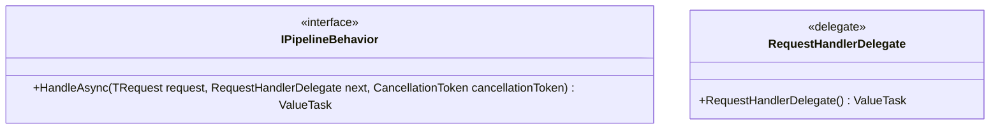

**Diagram sources**
- [IPipelineBehavior.cs](file://src/Relay.Core/Contracts/Pipeline/IPipelineBehavior.cs#L27-L37)

The `IPipelineBehavior` interface defines a single method, `HandleAsync`, which takes three parameters:
- `request`: The current request being processed
- `next`: A delegate representing the next component in the pipeline chain
- `cancellationToken`: A token for canceling the operation

The `RequestHandlerDelegate<TResponse>` is a delegate type that represents the next handler in the pipeline. This delegate-based approach enables the chaining mechanism, where each behavior can choose when and how to invoke the next component in the chain.

The generic nature of the interface allows behaviors to be strongly typed to specific request and response types, providing compile-time safety and enabling type-specific processing logic. This design also supports covariance and contravariance, allowing behaviors to be applied to related types.

**Section sources**
- [IPipelineBehavior.cs](file://src/Relay.Core/Contracts/Pipeline/IPipelineBehavior.cs#L27-L37)

## Pipeline Execution Mechanism

The execution of pipeline behaviors is orchestrated by the `PipelineExecutor` class, which is responsible for building and executing the behavior chain. The executor follows a specific execution order, ensuring that system modules execute first, followed by user-defined pipeline behaviors, and finally the request handler.

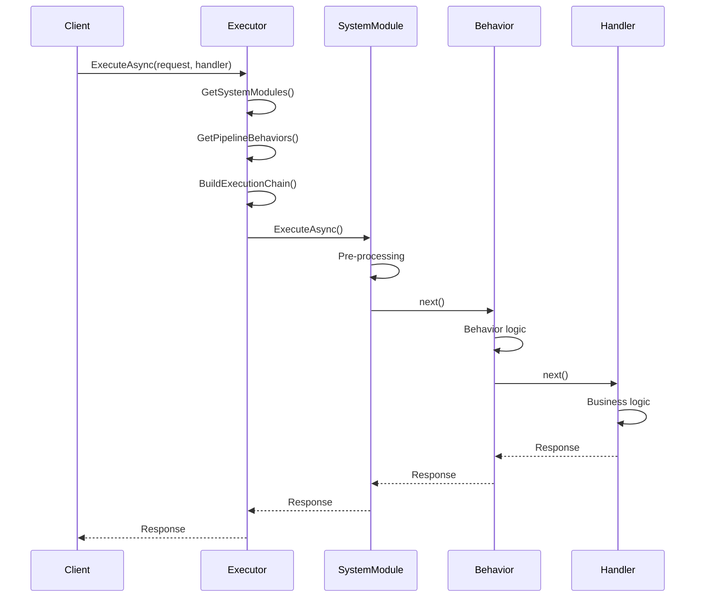

**Diagram sources**
- [PipelineExecutor.cs](file://src/Relay.Core/Implementation/Core/PipelineExecutor.cs#L32-L72)

The execution mechanism works as follows:

1. **System Module Collection**: The executor first retrieves all registered system modules and sorts them by their execution order.
2. **Behavior Collection**: It then collects all pipeline behaviors for the specific request/response type combination, de-duplicating behaviors by type while preserving order.
3. **Chain Construction**: The execution chain is built from the end backwards, starting with the final handler and wrapping each behavior around the previous next delegate.
4. **Reverse System Module Wrapping**: System modules are added in reverse order, ensuring they execute first in the pipeline.
5. **Chain Invocation**: The constructed chain is invoked, with each component executing its logic and optionally invoking the next component.

This approach creates a nested execution model where each behavior wraps the entire remaining chain, allowing for both pre-processing (before calling next) and post-processing (after calling next) logic.

The executor also handles important cross-cutting concerns such as cancellation token propagation and null argument validation, ensuring consistent behavior across all pipeline executions.

**Section sources**
- [PipelineExecutor.cs](file://src/Relay.Core/Implementation/Core/PipelineExecutor.cs#L32-L72)

## Common Pipeline Behavior Implementations

Relay provides several built-in pipeline behaviors that demonstrate common cross-cutting concerns. These implementations serve as excellent examples for creating custom behaviors.

### Logging Behavior

The `ServiceFactoryLoggingBehavior` demonstrates how to implement logging as a pipeline behavior. It uses the ServiceFactory pattern to resolve the logger at runtime, providing flexibility in service resolution.

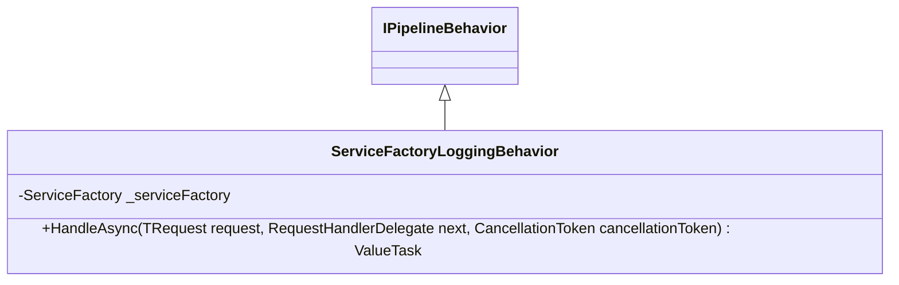

**Diagram sources**
- [ServiceFactoryLoggingBehavior.cs](file://src/Relay.Core/Pipeline/Behaviors/ServiceFactoryLoggingBehavior.cs#L25-L76)

This behavior shows several important patterns:
- Using ServiceFactory for dynamic service resolution
- Conditional service usage (checking if logger is available)
- Structured logging with request type information
- Exception handling with error logging

### Retry Behavior

The `RetryPipelineBehavior` implements retry logic with configurable strategies. It demonstrates how to handle transient failures and implement exponential backoff or other retry patterns.

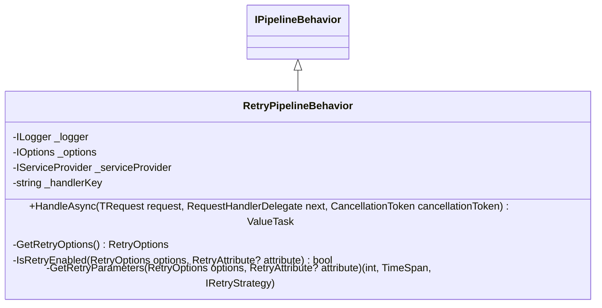

**Diagram sources**
- [RetryPipelineBehavior.cs](file://src/Relay.Core/Retry/RetryPipelineBehavior.cs#L20-L168)

Key features of this implementation:
- Configuration through options pattern
- Attribute-based override capability
- Support for multiple retry strategies
- Comprehensive logging of retry attempts
- Configurable behavior on retry exhaustion

### Transaction Behavior

The `TransactionBehavior` wraps request processing in a database transaction with comprehensive features. It demonstrates how to manage transaction state and handle transaction-specific concerns.

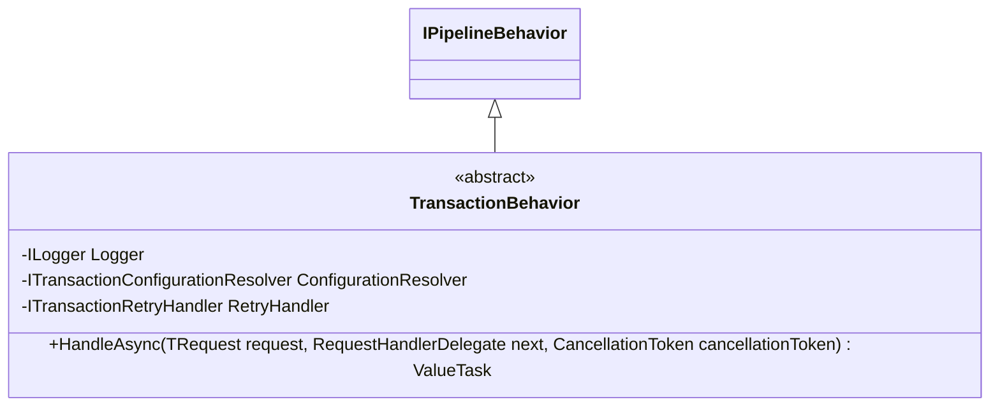

**Diagram sources**
- [TransactionBehavior.cs](file://src/Relay.Core/Transactions/TransactionBehavior.cs#L12-L33)

This behavior implements:
- Mandatory isolation level specification
- Transaction timeout enforcement
- Automatic retry on transient failures
- Transaction event hooks
- Nested transaction support
- Read-only transaction optimization

### Validation Behavior

The `ContractValidationPipelineBehavior` implements contract validation for requests and responses. It demonstrates how to validate data against schemas and handle validation results according to configurable strategies.

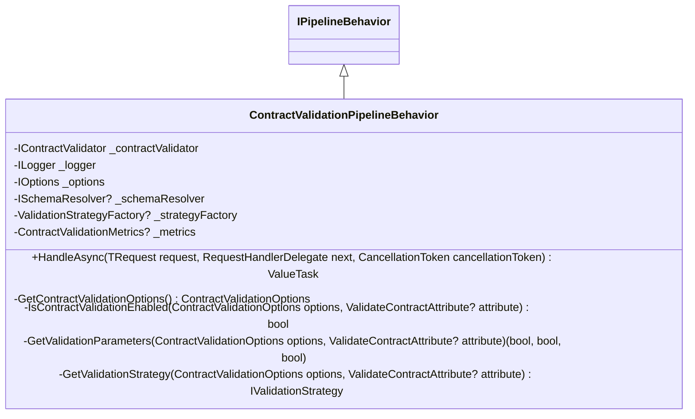

**Diagram sources**
- [ContractValidationPipelineBehavior.cs](file://src/Relay.Core/ContractValidation/ContractValidationPipelineBehavior.cs#L26-L441)

Key aspects of this implementation:
- Support for both request and response validation
- Configurable validation strategies (strict, lenient, etc.)
- Performance metrics collection
- Schema resolution through pluggable resolvers
- Detailed error reporting

### Authorization Behavior

The `AuthorizationPipelineBehavior` implements authorization checks before request processing. It demonstrates how to integrate security concerns into the pipeline.

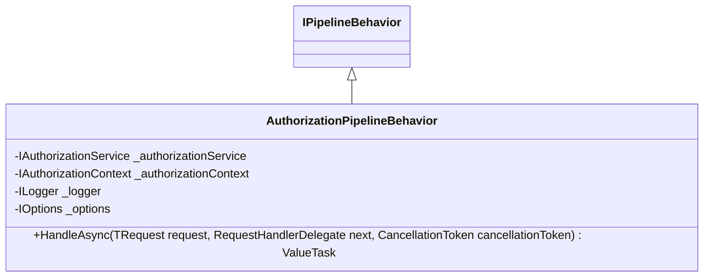

**Diagram sources**
- [AuthorizationPipelineBehavior.cs](file://src/Relay.Core/Authorization/AuthorizationPipelineBehavior.cs)

This behavior shows:
- Integration with external authorization services
- Context-based authorization decisions
- Early termination of pipeline on authorization failure
- Comprehensive logging of authorization decisions

**Section sources**
- [ServiceFactoryLoggingBehavior.cs](file://src/Relay.Core/Pipeline/Behaviors/ServiceFactoryLoggingBehavior.cs#L25-L76)
- [RetryPipelineBehavior.cs](file://src/Relay.Core/Retry/RetryPipelineBehavior.cs#L20-L168)
- [TransactionBehavior.cs](file://src/Relay.Core/Transactions/TransactionBehavior.cs#L12-L33)
- [ContractValidationPipelineBehavior.cs](file://src/Relay.Core/ContractValidation/ContractValidationPipelineBehavior.cs#L26-L441)
- [AuthorizationPipelineBehavior.cs](file://src/Relay.Core/Authorization/AuthorizationPipelineBehavior.cs)

## Behavior Chaining and Ordering

The chaining and ordering of pipeline behaviors is a critical aspect of the execution pipeline. Relay implements a sophisticated ordering mechanism that ensures behaviors execute in the correct sequence while handling edge cases like duplicate behaviors.

### Chaining Mechanism

The chaining mechanism builds a nested execution structure where each behavior wraps the next component in the chain. This is implemented in the `PipelineExecutor` class using delegate composition:

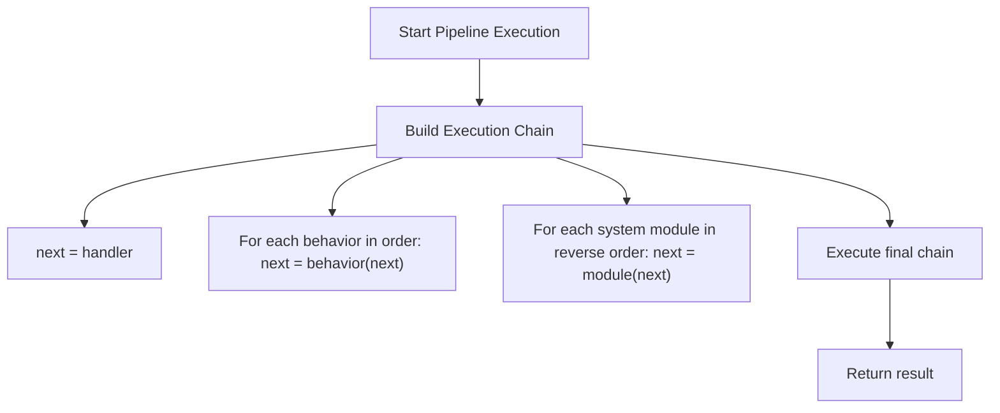

**Diagram sources**
- [PipelineExecutor.cs](file://src/Relay.Core/Implementation/Core/PipelineExecutor.cs#L53-L71)

The key aspects of the chaining mechanism are:
- **Backward Construction**: The chain is built from the end backwards, starting with the final handler
- **Delegate Wrapping**: Each behavior wraps the current next delegate, creating a nested structure
- **Order Preservation**: Behaviors are added in their registered order
- **System Module Priority**: System modules are added last (but execute first) to ensure they have priority

### Ordering Rules

Relay follows specific ordering rules to determine the execution sequence:

1. **System Modules First**: All system modules execute before user-defined pipeline behaviors
2. **System Module Order**: System modules are sorted by their Order property
3. **User Behavior Order**: User-defined behaviors execute in the order they are registered
4. **Type-based De-duplication**: If multiple behaviors of the same type are registered, only the last one is used

The de-duplication logic is implemented using LINQ's Aggregate method, which preserves the last occurrence of each behavior type:

```csharp
var pipelineBehaviors = GetPipelineBehaviors<TRequest, TResponse>()
    .Aggregate(new List<IPipelineBehavior<TRequest, TResponse>>(), (acc, b) =>
    {
        var idx = acc.FindIndex(existing => existing.GetType() == b.GetType());
        if (idx >= 0) acc[idx] = b; else acc.Add(b);
        return acc;
    });
```

This approach prevents accidental duplication of behaviors while allowing for configuration overrides.

### Execution Sequence

The complete execution sequence follows this pattern:

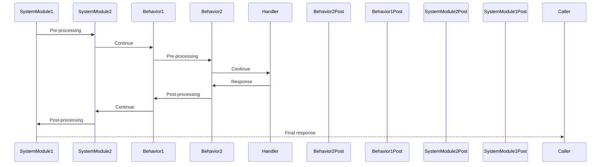

**Diagram sources**
- [PipelineExecutor.cs](file://src/Relay.Core/Implementation/Core/PipelineExecutor.cs#L41-L71)

The sequence shows the "onion" model of execution, where each layer wraps the inner layers. This allows for both pre-processing (on the way in) and post-processing (on the way out) at each level.

**Section sources**
- [PipelineExecutor.cs](file://src/Relay.Core/Implementation/Core/PipelineExecutor.cs#L41-L71)

## State Passing Between Behaviors

State passing between behaviors is a crucial aspect of pipeline design, enabling behaviors to share information and coordinate their actions. Relay provides several mechanisms for state management across the pipeline.

### Context Objects

The primary mechanism for state passing is through context objects that are accessible to all behaviors in the pipeline. These objects are typically passed as parameters or stored in the request context.

For example, the `ValidationContext` class in the contract validation behavior provides a structured way to pass validation-related information:

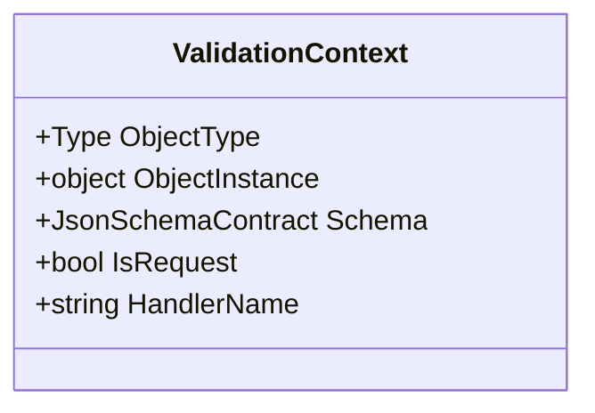

**Diagram sources**
- [ContractValidationPipelineBehavior.cs](file://src/Relay.Core/ContractValidation/ContractValidationPipelineBehavior.cs#L127-L134)

This context object allows different validation components to access consistent information about the validation operation.

### Activity and Telemetry

Distributed tracing uses the `Activity` class to pass contextual information across the pipeline and potentially across service boundaries:

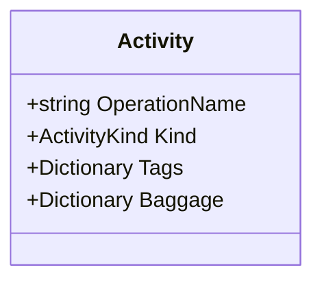

**Diagram sources**
- [ContractValidationPipelineBehavior.cs](file://src/Relay.Core/ContractValidation/ContractValidationPipelineBehavior.cs#L68-L75)

The Activity class provides:
- **Tags**: Key-value pairs for structured data
- **Baggage**: Distributed context that flows across service boundaries
- **Timing**: Automatic duration tracking
- **Hierarchy**: Parent-child relationships between operations

### Service Provider Scope

The `IServiceProvider` allows behaviors to resolve services that may maintain state across the pipeline execution. This is particularly useful for services that need to coordinate across multiple behaviors.

For example, a metrics collector service might be resolved by multiple behaviors to record different aspects of the execution:

```csharp
var metricsCollector = _serviceProvider.GetService<IMetricsCollector>();
metricsCollector.RecordRequestStarted(requestType);
// ... later in another behavior
metricsCollector.RecordRequestCompleted(requestType, duration);
```

### Cancellation Token

The `CancellationToken` serves as a standardized mechanism for signaling cancellation across all behaviors in the pipeline:

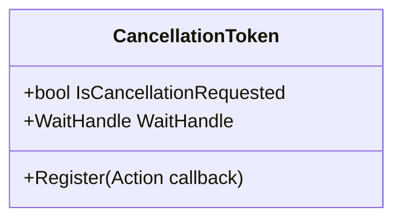

**Diagram sources**
- [PipelineExecutor.cs](file://src/Relay.Core/Implementation/Core/PipelineExecutor.cs#L39)

The cancellation token is passed through the entire pipeline, allowing any behavior to check for cancellation and respond appropriately.

### Request/Response Modification

Behaviors can also pass state by modifying the request or response objects themselves. This is particularly useful when the modifications are relevant to the business logic:

```csharp
// In a pre-processing behavior
request.CorrelationId = Guid.NewGuid();
request.Timestamp = DateTime.UtcNow;

// In a post-processing behavior  
response.RequestDuration = stopwatch.Elapsed;
response.ServerTime = DateTime.UtcNow;
```

This approach should be used judiciously, as it can make the data flow less explicit.

**Section sources**
- [ContractValidationPipelineBehavior.cs](file://src/Relay.Core/ContractValidation/ContractValidationPipelineBehavior.cs#L68-L75)
- [PipelineExecutor.cs](file://src/Relay.Core/Implementation/Core/PipelineExecutor.cs#L39)

## Performance Considerations

While pipeline behaviors provide powerful capabilities, they also introduce potential performance overhead. Understanding and mitigating this overhead is crucial for maintaining application performance.

### Overhead Sources

The primary sources of performance overhead in pipeline behaviors include:

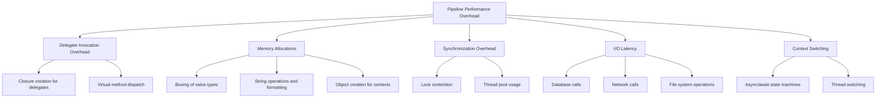

**Diagram sources**
- [PipelineExecutor.cs](file://src/Relay.Core/Implementation/Core/PipelineExecutor.cs)
- [ServiceFactoryLoggingBehavior.cs](file://src/Relay.Core/Pipeline/Behaviors/ServiceFactoryLoggingBehavior.cs)

### Optimization Strategies

Several strategies can be employed to minimize performance overhead:

#### 1. Behavior Registration Optimization

Register only necessary behaviors and avoid unnecessary duplication:

```csharp
// Good: Register only needed behaviors
services.AddSingleton<IPipelineBehavior<CreateOrderCommand, OrderResult>>(new LoggingBehavior());
services.AddSingleton<IPipelineBehavior<CreateOrderCommand, OrderResult>>(new ValidationBehavior());

// Avoid: Registering the same behavior type multiple times
services.AddSingleton<IPipelineBehavior<CreateOrderCommand, OrderResult>>(new LoggingBehavior());
services.AddSingleton<IPipelineBehavior<CreateOrderCommand, OrderResult>>(new LoggingBehavior()); // Duplicate
```

#### 2. Conditional Execution

Implement conditional logic to skip expensive operations when not needed:

```csharp
public async ValueTask<TResponse> HandleAsync(TRequest request, RequestHandlerDelegate<TResponse> next, CancellationToken cancellationToken)
{
    // Quick check to avoid expensive operations
    if (!ShouldExecute())
    {
        return await next();
    }
    
    // Expensive operations only when needed
    return await ExecuteWithOverhead(request, next, cancellationToken);
}
```

#### 3. Asynchronous Operations

Use asynchronous operations appropriately to avoid blocking threads:

```csharp
// Good: Use async/await for I/O operations
public async ValueTask<TResponse> HandleAsync(TRequest request, RequestHandlerDelegate<TResponse> next, CancellationToken cancellationToken)
{
    await LogRequestAsync(request, cancellationToken); // Non-blocking
    var response = await next();
    await LogResponseAsync(response, cancellationToken); // Non-blocking
    return response;
}

// Avoid: Blocking calls in async methods
public async ValueTask<TResponse> HandleAsync(TRequest request, RequestHandlerDelegate<TResponse> next, CancellationToken cancellationToken)
{
    LogRequest(request).Wait(); // Blocking!
    var response = await next();
    LogResponse(response).Wait(); // Blocking!
    return response;
}
```

#### 4. Object Pooling

Reuse objects to reduce garbage collection pressure:

```csharp
// Use pooled objects for frequently created instances
private static readonly ObjectPool<StringBuilder> StringBuilderPool = 
    new DefaultObjectPool<StringBuilder>(new StringBuilderPooledObjectPolicy());

public async ValueTask<TResponse> HandleAsync(TRequest request, RequestHandlerDelegate<TResponse> next, CancellationToken cancellationToken)
{
    var sb = StringBuilderPool.Get();
    try
    {
        sb.Append("Processing request: ");
        sb.Append(request.GetType().Name);
        _logger.LogInformation(sb.ToString());
        return await next();
    }
    finally
    {
        StringBuilderPool.Return(sb);
    }
}
```

#### 5. Caching

Cache expensive computations when possible:

```csharp
private static readonly ConcurrentDictionary<Type, bool> _validationCache = new();

public async ValueTask<TResponse> HandleAsync(TRequest request, RequestHandlerDelegate<TResponse> next, CancellationToken cancellationToken)
{
    var requestType = request.GetType();
    if (!_validationCache.GetOrAdd(requestType, type => ShouldValidate(type)))
    {
        return await next();
    }
    
    // Perform validation
    return await next();
}
```

### Performance Monitoring

Implement performance monitoring to identify bottlenecks:

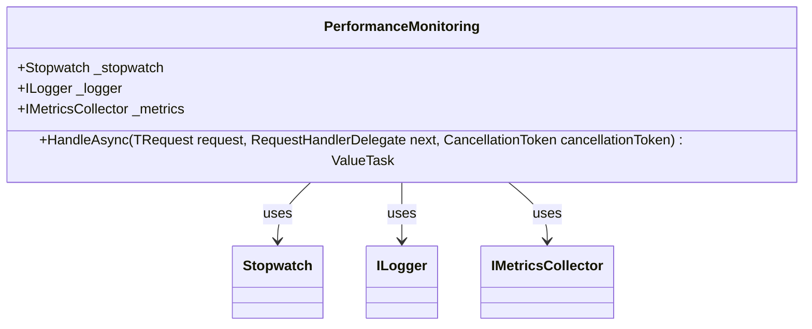

**Diagram sources**
- [ContractValidationPipelineBehavior.cs](file://src/Relay.Core/ContractValidation/ContractValidationPipelineBehavior.cs#L76-L202)

The contract validation behavior demonstrates comprehensive performance monitoring with:
- Overall execution timing
- Individual validation step timing
- Metrics collection
- Structured logging with duration information

**Section sources**
- [ContractValidationPipelineBehavior.cs](file://src/Relay.Core/ContractValidation/ContractValidationPipelineBehavior.cs#L76-L202)
- [ServiceFactoryLoggingBehavior.cs](file://src/Relay.Core/Pipeline/Behaviors/ServiceFactoryLoggingBehavior.cs)

## Extending the Framework

Extending the Relay framework with custom pipeline behaviors is straightforward and follows well-established patterns. This section provides guidance on creating effective custom behaviors.

### Creating Custom Behaviors

To create a custom pipeline behavior, implement the `IPipelineBehavior<TRequest, TResponse>` interface:

```csharp
public class CustomBehavior<TRequest, TResponse> : IPipelineBehavior<TRequest, TResponse>
{
    private readonly ILogger<CustomBehavior<TRequest, TResponse>> _logger;
    private readonly IService _dependency;

    public CustomBehavior(ILogger<CustomBehavior<TRequest, TResponse>> logger, IService dependency)
    {
        _logger = logger;
        _dependency = dependency;
    }

    public async ValueTask<TResponse> HandleAsync(TRequest request, RequestHandlerDelegate<TResponse> next, CancellationToken cancellationToken)
    {
        // Pre-processing logic
        _logger.LogInformation("Starting processing for {RequestType}", typeof(TRequest).Name);
        
        try
        {
            // Execute the next behavior or handler
            var response = await next();
            
            // Post-processing logic
            _logger.LogInformation("Completed processing for {RequestType}", typeof(TRequest).Name);
            
            return response;
        }
        catch (Exception ex)
        {
            _logger.LogError(ex, "Error processing {RequestType}", typeof(TRequest).Name);
            throw;
        }
    }
}
```

### Registration Patterns

Custom behaviors can be registered using various patterns:

#### 1. Direct Registration

Register the behavior directly for specific request/response types:

```csharp
services.AddSingleton<IPipelineBehavior<CreateOrderCommand, OrderResult>>(new CustomBehavior<CreateOrderCommand, OrderResult>());
```

#### 2. Generic Registration

Register a behavior for all requests of a certain type:

```csharp
services.AddTransient(typeof(IPipelineBehavior<,>), typeof(CustomBehavior<,>));
```

#### 3. Conditional Registration

Register behaviors conditionally based on configuration:

```csharp
if (configuration.GetValue<bool>("EnableCustomBehavior"))
{
    services.AddSingleton<IPipelineBehavior<,>>(new CustomBehavior<,>());
}
```

### Advanced Patterns

Several advanced patterns can enhance custom behavior implementations:

#### 1. Configuration-Driven Behavior

Create behaviors that adapt based on configuration:

```csharp
public class ConfigurableBehavior<TRequest, TResponse> : IPipelineBehavior<TRequest, TResponse>
{
    private readonly IOptions<BehaviorOptions> _options;
    
    public ConfigurableBehavior(IOptions<BehaviorOptions> options)
    {
        _options = options;
    }
    
    public async ValueTask<TResponse> HandleAsync(TRequest request, RequestHandlerDelegate<TResponse> next, CancellationToken cancellationToken)
    {
        var options = _options.Value.GetOptionsForRequest(request.GetType());
        
        if (options.Enabled)
        {
            // Apply behavior logic based on configuration
            await ApplyConfiguredBehavior(request, options, cancellationToken);
        }
        
        return await next();
    }
}
```

#### 2. Composite Behavior

Combine multiple behaviors into a single composite behavior:

```csharp
public class CompositeBehavior<TRequest, TResponse> : IPipelineBehavior<TRequest, TResponse>
{
    private readonly IEnumerable<IPipelineBehavior<TRequest, TResponse>> _behaviors;
    
    public CompositeBehavior(IEnumerable<IPipelineBehavior<TRequest, TResponse>> behaviors)
    {
        _behaviors = behaviors;
    }
    
    public async ValueTask<TResponse> HandleAsync(TRequest request, RequestHandlerDelegate<TResponse> next, CancellationToken cancellationToken)
    {
        RequestHandlerDelegate<TResponse> currentNext = next;
        
        // Wrap each behavior around the next delegate
        foreach (var behavior in _behaviors.Reverse())
        {
            var nextBehavior = behavior;
            var nextDelegate = currentNext;
            currentNext = () => nextBehavior.HandleAsync(request, nextDelegate, cancellationToken);
        }
        
        return await currentNext();
    }
}
```

#### 3. Aspect-Oriented Behavior

Create behaviors that apply to requests with specific attributes:

```csharp
public class AttributeBasedBehavior<TRequest, TResponse> : IPipelineBehavior<TRequest, TResponse>
{
    public async ValueTask<TResponse> HandleAsync(TRequest request, RequestHandlerDelegate<TResponse> next, CancellationToken cancellationToken)
    {
        var requestType = request.GetType();
        var auditAttribute = requestType.GetCustomAttribute<AuditAttribute>();
        
        if (auditAttribute != null)
        {
            // Apply auditing logic
            await AuditRequest(request, auditAttribute, cancellationToken);
        }
        
        return await next();
    }
}
```

### Best Practices

When creating custom pipeline behaviors, follow these best practices:

1. **Keep behaviors focused**: Each behavior should have a single responsibility
2. **Handle exceptions appropriately**: Either handle exceptions locally or let them propagate
3. **Respect cancellation**: Honor the cancellation token and propagate it to async operations
4. **Minimize side effects**: Avoid modifying the request or response unless necessary
5. **Use structured logging**: Include relevant context in log messages
6. **Consider performance**: Avoid expensive operations in the critical path
7. **Test thoroughly**: Include unit tests for both success and failure scenarios

**Section sources**
- [IPipelineBehavior.cs](file://src/Relay.Core/Contracts/Pipeline/IPipelineBehavior.cs#L27-L37)
- [PipelineExecutor.cs](file://src/Relay.Core/Implementation/Core/PipelineExecutor.cs)

## Troubleshooting Common Issues

When working with pipeline behaviors, several common issues may arise. This section addresses these issues and provides solutions.

### Behavior Not Executing

If a pipeline behavior is not executing, check the following:

1. **Registration**: Ensure the behavior is properly registered in the service container
2. **Generic Types**: Verify that the behavior's generic types match the request/response types
3. **Ordering**: Check if another behavior of the same type is overriding it
4. **Conditions**: Verify any conditional logic that might prevent execution

```csharp
// Debug registration
var behaviors = serviceProvider.GetServices<IPipelineBehavior<CreateOrderCommand, OrderResult>>();
foreach (var behavior in behaviors)
{
    Console.WriteLine($"Registered behavior: {behavior.GetType().Name}");
}
```

### Order of Execution Issues

When behaviors execute in an unexpected order:

1. **Check registration order**: Behaviors are executed in registration order
2. **Verify de-duplication**: Ensure you're not accidentally registering the same behavior type multiple times
3. **System modules**: Remember that system modules always execute first

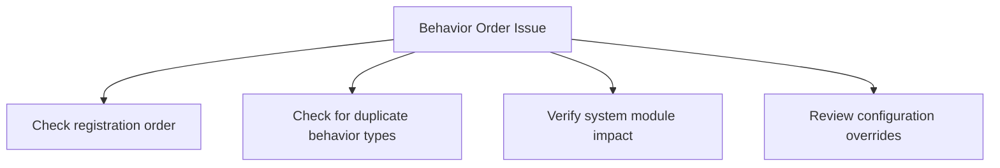

**Diagram sources**
- [PipelineExecutor.cs](file://src/Relay.Core/Implementation/Core/PipelineExecutor.cs#L44-L51)

### Performance Problems

If pipeline behaviors are causing performance issues:

1. **Profile the application**: Identify which behaviors are contributing most to latency
2. **Check for synchronous operations**: Ensure I/O operations are asynchronous
3. **Review logging**: Excessive logging can impact performance
4. **Verify caching**: Implement caching for expensive operations

```csharp
// Add performance logging
var stopwatch = Stopwatch.StartNew();
var result = await next();
stopwatch.Stop();
_logger.LogDebug("Behavior execution took {Duration}ms", stopwatch.ElapsedMilliseconds);
```

### State Sharing Problems

When behaviors need to share state:

1. **Use context objects**: Pass state through well-defined context objects
2. **Leverage activity baggage**: Use distributed tracing baggage for cross-cutting state
3. **Avoid static state**: Static state can cause issues in concurrent scenarios
4. **Consider service scope**: Use scoped services for state that should persist for the request

### Exception Handling Issues

For problems with exception handling:

1. **Ensure proper propagation**: Exceptions should propagate up the chain unless handled
2. **Check cancellation**: OperationCanceledException should be handled appropriately
3. **Verify logging**: Ensure exceptions are logged with sufficient context
4. **Test edge cases**: Test with various exception types and cancellation scenarios

```csharp
// Robust exception handling pattern
public async ValueTask<TResponse> HandleAsync(TRequest request, RequestHandlerDelegate<TResponse> next, CancellationToken cancellationToken)
{
    try
    {
        return await next();
    }
    catch (OperationCanceledException) when (cancellationToken.IsCancellationRequested)
    {
        // Properly handle cancellation
        _logger.LogInformation("Operation was cancelled");
        throw; // Re-throw to maintain cancellation semantics
    }
    catch (Exception ex)
    {
        _logger.LogError(ex, "Unexpected error in pipeline behavior");
        throw; // Re-throw to maintain error semantics
    }
}
```

**Section sources**
- [PipelineExecutor.cs](file://src/Relay.Core/Implementation/Core/PipelineExecutor.cs#L44-L51)
- [ServiceFactoryLoggingBehavior.cs](file://src/Relay.Core/Pipeline/Behaviors/ServiceFactoryLoggingBehavior.cs)

## Conclusion

Pipeline behaviors in Relay provide a powerful and flexible mechanism for implementing cross-cutting concerns in a clean, maintainable way. By understanding the interface contract, execution mechanism, and common implementation patterns, developers can effectively leverage this feature to enhance their applications.

The key takeaways from this document are:

1. **Standardized Interface**: The `IPipelineBehavior<TRequest, TResponse>` interface provides a consistent contract for all behaviors
2. **Chained Execution**: Behaviors are executed in a chained, onion-like pattern with well-defined ordering rules
3. **Rich Ecosystem**: Relay provides several built-in behaviors for common concerns like logging, retry, and validation
4. **Extensibility**: The framework is designed to be easily extended with custom behaviors
5. **Performance Awareness**: While powerful, behaviors should be implemented with performance considerations in mind

When implementing custom behaviors, focus on single responsibilities, proper error handling, and performance optimization. Leverage the existing patterns and best practices demonstrated in the built-in behaviors as a guide.

The pipeline behavior system exemplifies good software design principles, promoting separation of concerns, code reuse, and maintainability. By mastering this feature, developers can create more robust, observable, and maintainable applications.

**Section sources**
- [IPipelineBehavior.cs](file://src/Relay.Core/Contracts/Pipeline/IPipelineBehavior.cs)
- [PipelineExecutor.cs](file://src/Relay.Core/Implementation/Core/PipelineExecutor.cs)
- [ServiceFactoryLoggingBehavior.cs](file://src/Relay.Core/Pipeline/Behaviors/ServiceFactoryLoggingBehavior.cs)
- [RetryPipelineBehavior.cs](file://src/Relay.Core/Retry/RetryPipelineBehavior.cs)
- [TransactionBehavior.cs](file://src/Relay.Core/Transactions/TransactionBehavior.cs)
- [ContractValidationPipelineBehavior.cs](file://src/Relay.Core/ContractValidation/ContractValidationPipelineBehavior.cs)
- [AuthorizationPipelineBehavior.cs](file://src/Relay.Core/Authorization/AuthorizationPipelineBehavior.cs)