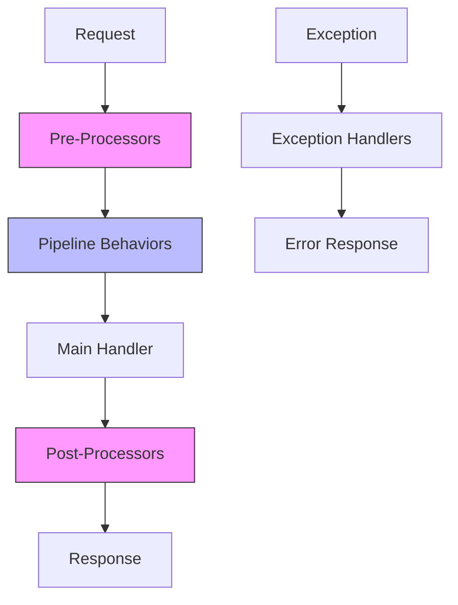
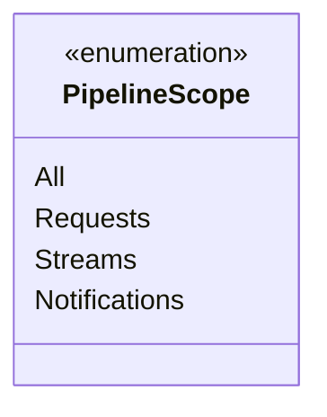
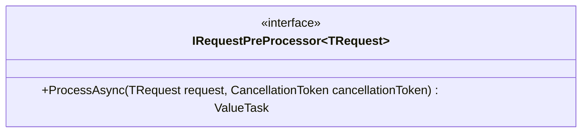
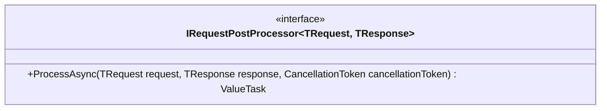
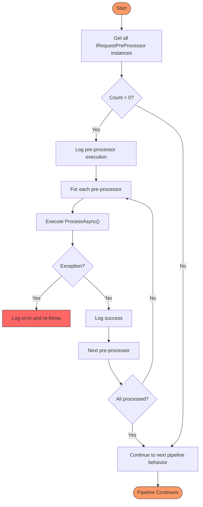
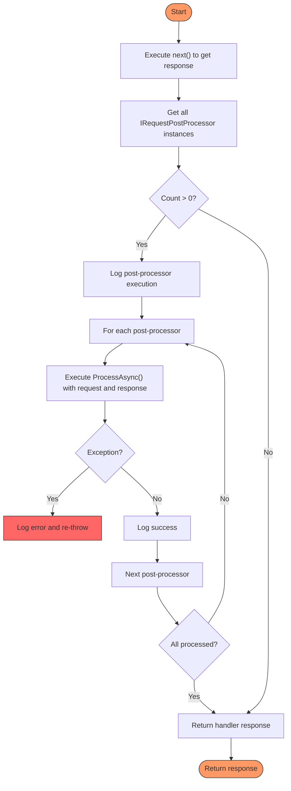
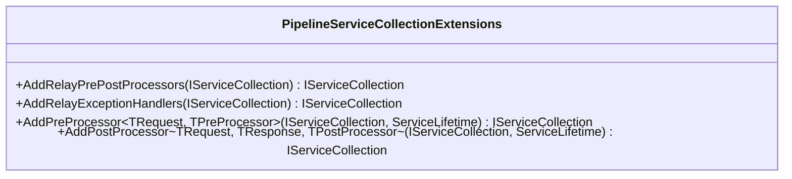
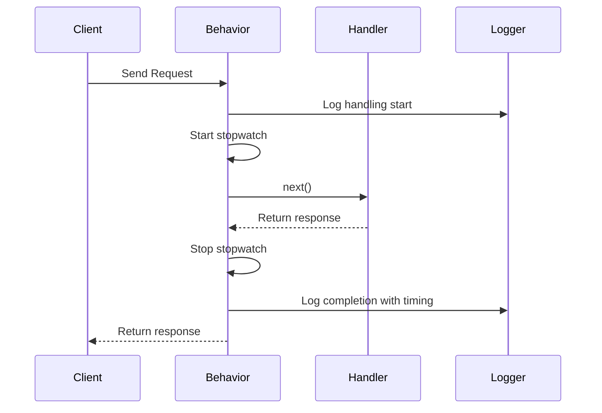
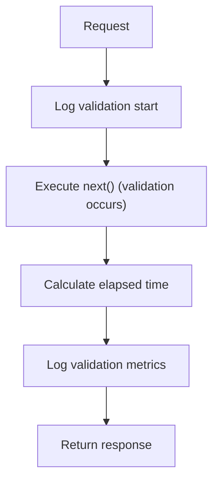
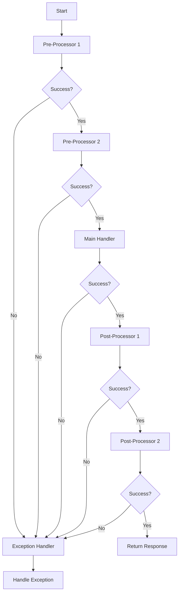

# Pre and Post Processors Example

<cite>
**Referenced Files in This Document**   
- [PipelineAttribute.cs](file://src/Relay.Core/Attributes/PipelineAttribute.cs)
- [IPipelineBehavior.cs](file://src/Relay.Core/Contracts/Pipeline/IPipelineBehavior.cs)
- [IRequestPreProcessor.cs](file://src/Relay.Core/Pipeline/Interfaces/IRequestPreProcessor.cs)
- [IRequestPostProcessor.cs](file://src/Relay.Core/Pipeline/Interfaces/IRequestPostProcessor.cs)
- [RequestPreProcessorBehavior.cs](file://src/Relay.Core/Pipeline/Behaviors/RequestPreProcessorBehavior.cs)
- [RequestPostProcessorBehavior.cs](file://src/Relay.Core/Pipeline/Behaviors/RequestPostProcessorBehavior.cs)
- [PipelineServiceCollectionExtensions.cs](file://src/Relay.Core/Pipeline/Extensions/PipelineServiceCollectionExtensions.cs)
- [LoggingBehavior.cs](file://samples/Relay.MinimalApiSample/Features/Examples/04-PipelineBehaviors/LoggingBehavior.cs)
- [ValidationMetricsBehavior.cs](file://samples/Relay.MinimalApiSample/Features/Examples/01-Validation/ValidationMetricsBehavior.cs)
- [Program.cs](file://samples/Relay.MinimalApiSample/Program.cs)
</cite>

## Table of Contents
1. [Introduction](#introduction)
2. [Core Architecture](#core-architecture)
3. [PipelineAttribute Implementation](#pipelineattribute-implementation)
4. [Pre and Post Processor Interfaces](#pre-and-post-processor-interfaces)
5. [Processor Execution Flow](#processor-execution-flow)
6. [Service Registration and Configuration](#service-registration-and-configuration)
7. [Practical Examples](#practical-examples)
8. [Common Use Cases](#common-use-cases)
9. [Processor Ordering and Exception Handling](#processor-ordering-and-exception-handling)
10. [Performance Considerations](#performance-considerations)
11. [Troubleshooting Guide](#troubleshooting-guide)
12. [Conclusion](#conclusion)

## Introduction
The Relay framework provides a comprehensive pipeline system for request processing that enables cross-cutting concerns through pre and post processors. This document explains the implementation of request preprocessing and postprocessing using Relay's pipeline behaviors, focusing on the invocation relationship between request handlers and processor behaviors. The system allows developers to implement logging, enrichment, validation, and response transformation logic that executes automatically before and after request handling. This guide provides detailed technical information accessible to beginners while offering sufficient depth for experienced developers implementing sophisticated cross-cutting concerns.

## Core Architecture
The Relay pipeline system is built on a middleware-like architecture where request processing flows through a chain of behaviors before reaching the actual handler. The core components work together to provide a flexible and extensible processing pipeline:



**Diagram sources**
- [IPipelineBehavior.cs](file://src/Relay.Core/Contracts/Pipeline/IPipelineBehavior.cs)
- [RequestPreProcessorBehavior.cs](file://src/Relay.Core/Pipeline/Behaviors/RequestPreProcessorBehavior.cs)
- [RequestPostProcessorBehavior.cs](file://src/Relay.Core/Pipeline/Behaviors/RequestPostProcessorBehavior.cs)

**Section sources**
- [IPipelineBehavior.cs](file://src/Relay.Core/Contracts/Pipeline/IPipelineBehavior.cs)
- [IStreamPipelineBehavior.cs](file://src/Relay.Core/Contracts/Pipeline/IStreamPipelineBehavior.cs)

## PipelineAttribute Implementation
The `PipelineAttribute` is used to register methods as pipeline behaviors in the execution pipeline. This attribute marks methods that should be included in the processing chain and controls their execution order and scope.

```csharp
[AttributeUsage(AttributeTargets.Method)]
public class PipelineAttribute : Attribute
{
    public int Order { get; set; } = 0;
    public PipelineScope Scope { get; set; } = PipelineScope.All;
}
```

The attribute has two key properties:
- **Order**: Determines the execution sequence of pipeline behaviors. Lower values execute first.
- **Scope**: Defines where the behavior applies (All, Requests, Streams, or Notifications).

The `PipelineScope` enum provides fine-grained control over where behaviors are applied:



**Diagram sources**
- [PipelineAttribute.cs](file://src/Relay.Core/Attributes/PipelineAttribute.cs)
- [PipelineScope.cs](file://src/Relay.Core/Attributes/PipelineScope.cs)

**Section sources**
- [PipelineAttribute.cs](file://src/Relay.Core/Attributes/PipelineAttribute.cs)
- [PipelineScope.cs](file://src/Relay.Core/Attributes/PipelineScope.cs)

## Pre and Post Processor Interfaces
The Relay framework defines specific interfaces for pre and post processors that enable separation of concerns and consistent implementation patterns.

### IRequestPreProcessor Interface
The `IRequestPreProcessor<TRequest>` interface defines the contract for request preprocessing. Pre-processors execute before the main handler and all pipeline behaviors, making them ideal for operations like logging, validation preparation, or request enrichment.



**Diagram sources**
- [IRequestPreProcessor.cs](file://src/Relay.Core/Pipeline/Interfaces/IRequestPreProcessor.cs)

### IRequestPostProcessor Interface
The `IRequestPostProcessor<TRequest, TResponse>` interface defines the contract for request postprocessing. Post-processors execute after the main handler and all pipeline behaviors complete successfully, but only if no exception was thrown during handler execution.



**Diagram sources**
- [IRequestPostProcessor.cs](file://src/Relay.Core/Pipeline/Interfaces/IRequestPostProcessor.cs)

**Section sources**
- [IRequestPreProcessor.cs](file://src/Relay.Core/Pipeline/Interfaces/IRequestPreProcessor.cs)
- [IRequestPostProcessor.cs](file://src/Relay.Core/Pipeline/Interfaces/IRequestPostProcessor.cs)

## Processor Execution Flow
The execution flow of pre and post processors follows a well-defined sequence that ensures consistent behavior across the application.

### Pre-Processor Execution
Pre-processors are executed through the `RequestPreProcessorBehavior<TRequest, TResponse>` class, which implements the `IPipelineBehavior<TRequest, TResponse>` interface. The behavior resolves all registered pre-processors from the service container and executes them in order before continuing with the pipeline.



**Diagram sources**
- [RequestPreProcessorBehavior.cs](file://src/Relay.Core/Pipeline/Behaviors/RequestPreProcessorBehavior.cs)

### Post-Processor Execution
Post-processors are executed through the `RequestPostProcessorBehavior<TRequest, TResponse>` class. Unlike pre-processors, post-processors execute after the handler completes successfully. The behavior first executes the handler to get the response, then processes all registered post-processors.



**Diagram sources**
- [RequestPostProcessorBehavior.cs](file://src/Relay.Core/Pipeline/Behaviors/RequestPostProcessorBehavior.cs)

**Section sources**
- [RequestPreProcessorBehavior.cs](file://src/Relay.Core/Pipeline/Behaviors/RequestPreProcessorBehavior.cs)
- [RequestPostProcessorBehavior.cs](file://src/Relay.Core/Pipeline/Behaviors/RequestPostProcessorBehavior.cs)

## Service Registration and Configuration
The Relay framework provides extension methods for registering pre and post processors in the service collection. These methods simplify the configuration process and ensure proper integration with the dependency injection system.

### Extension Methods
The `PipelineServiceCollectionExtensions` class provides several methods for configuring the pipeline:



**Diagram sources**
- [PipelineServiceCollectionExtensions.cs](file://src/Relay.Core/Pipeline/Extensions/PipelineServiceCollectionExtensions.cs)

### Registration Example
In the application startup, pre and post processors are registered using the extension methods:

```csharp
builder.Services
    .AddRelayValidation()
    .AddRelayPrePostProcessors()
    .AddRelayExceptionHandlers();

// Register specific pre-processor
builder.Services.AddTransient<IRequestPreProcessor<RegisterUserRequest>, ValidationPreProcessor>();

// Register specific post-processor  
builder.Services.AddTransient<IRequestPostProcessor<RegisterUserRequest, RegisterUserResponse>, ValidationPostProcessor>();
```

This configuration registers the pipeline behaviors as open generics, allowing them to work with any request and response types while registering specific processor implementations for particular request types.

**Section sources**
- [PipelineServiceCollectionExtensions.cs](file://src/Relay.Core/Pipeline/Extensions/PipelineServiceCollectionExtensions.cs)
- [Program.cs](file://samples/Relay.MinimalApiSample/Program.cs)

## Practical Examples
The Relay samples demonstrate practical implementations of pre and post processors for common use cases.

### Logging Behavior Example
The `LoggingBehavior<TRequest, TResponse>` is a pipeline behavior that logs all requests with timing information:



**Diagram sources**
- [LoggingBehavior.cs](file://samples/Relay.MinimalApiSample/Features/Examples/04-PipelineBehaviors/LoggingBehavior.cs)

### Validation Metrics Behavior
The `ValidationMetricsBehavior<TRequest, TResponse>` tracks validation performance metrics, demonstrating how validation integrates with pipeline behaviors:



**Diagram sources**
- [ValidationMetricsBehavior.cs](file://samples/Relay.MinimalApiSample/Features/Examples/01-Validation/ValidationMetricsBehavior.cs)

**Section sources**
- [LoggingBehavior.cs](file://samples/Relay.MinimalApiSample/Features/Examples/04-PipelineBehaviors/LoggingBehavior.cs)
- [ValidationMetricsBehavior.cs](file://samples/Relay.MinimalApiSample/Features/Examples/01-Validation/ValidationMetricsBehavior.cs)

## Common Use Cases
Pre and post processors are commonly used for implementing cross-cutting concerns that apply to multiple request handlers.

### Logging and Monitoring
Pre-processors can be used to log request details before processing, while post-processors can log response details and execution metrics. This enables comprehensive monitoring of request processing without cluttering handler logic.

### Request Enrichment
Pre-processors can enrich requests with additional data from external sources, such as:
- Adding user context from authentication tokens
- Fetching related data from databases or APIs
- Setting default values based on business rules

### Response Transformation
Post-processors can transform responses before they're returned to clients:
- Adding audit information
- Formatting dates or numbers according to user preferences
- Including related data that wasn't part of the original response

### Notification and Event Triggering
Post-processors are ideal for triggering notifications or publishing events after successful request processing:
- Sending welcome emails after user registration
- Publishing "order created" events
- Updating analytics systems

**Section sources**
- [Program.cs](file://samples/Relay.MinimalApiSample/Program.cs)
- [ValidationMetricsBehavior.cs](file://samples/Relay.MinimalApiSample/Features/Examples/01-Validation/ValidationMetricsBehavior.cs)

## Processor Ordering and Exception Handling
Understanding processor ordering and exception handling is crucial for reliable pipeline behavior.

### Ordering Rules
- Pre-processors execute in the order they are registered in the service container
- The `RequestPreProcessorBehavior` should be registered early in the pipeline to ensure pre-processors run before other behaviors
- The `RequestPostProcessorBehavior` should be registered late in the pipeline to ensure post-processors run after other behaviors
- The `Order` property in `PipelineAttribute` controls the sequence of pipeline behaviors

### Exception Handling
- If a pre-processor throws an exception, subsequent pre-processors and the main handler are not executed
- Post-processors only execute if the handler completes without throwing an exception
- Exceptions in post-processors propagate to the caller, potentially masking the original handler result
- Each processor should implement appropriate error handling and logging



**Section sources**
- [RequestPreProcessorBehavior.cs](file://src/Relay.Core/Pipeline/Behaviors/RequestPreProcessorBehavior.cs)
- [RequestPostProcessorBehavior.cs](file://src/Relay.Core/Pipeline/Behaviors/RequestPostProcessorBehavior.cs)

## Performance Considerations
While pre and post processors provide powerful capabilities, they can impact performance if not implemented carefully.

### Best Practices
- Keep processor logic lightweight to minimize processing overhead
- Use asynchronous methods (`ProcessAsync`) to avoid blocking threads
- Implement caching when processors perform expensive operations
- Consider batching operations when multiple processors perform similar tasks
- Monitor processor execution time to identify performance bottlenecks

### Optimization Strategies
- Register processors with appropriate service lifetimes (Transient, Scoped, or Singleton)
- Use conditional execution to skip processors when not needed
- Implement short-circuiting for processors that can determine early that no action is required
- Consider using pipeline behaviors instead of pre/post processors for cross-cutting concerns that apply to all requests

**Section sources**
- [RequestPreProcessorBehavior.cs](file://src/Relay.Core/Pipeline/Behaviors/RequestPreProcessorBehavior.cs)
- [RequestPostProcessorBehavior.cs](file://src/Relay.Core/Pipeline/Behaviors/RequestPostProcessorBehavior.cs)

## Troubleshooting Guide
Common issues and their solutions when working with pre and post processors.

### Common Issues
- **Processors not executing**: Ensure processors are registered in the service container and the pipeline behaviors are added via `AddRelayPrePostProcessors()`
- **Ordering problems**: Verify the registration order of processors and check if other pipeline behaviors are interfering
- **Exception masking**: Be careful with exception handling in post-processors as they can mask the original handler result
- **Performance degradation**: Monitor execution time and optimize processor logic if needed

### Debugging Tips
- Enable detailed logging to trace processor execution
- Use the `Order` property to control behavior sequence
- Test processors in isolation before integrating them into the pipeline
- Verify service registration using dependency injection diagnostics

**Section sources**
- [RequestPreProcessorBehavior.cs](file://src/Relay.Core/Pipeline/Behaviors/RequestPreProcessorBehavior.cs)
- [RequestPostProcessorBehavior.cs](file://src/Relay.Core/Pipeline/Behaviors/RequestPostProcessorBehavior.cs)
- [PipelineServiceCollectionExtensions.cs](file://src/Relay.Core/Pipeline/Extensions/PipelineServiceCollectionExtensions.cs)

## Conclusion
The pre and post processor system in Relay provides a powerful mechanism for implementing cross-cutting concerns in a clean and maintainable way. By leveraging the pipeline architecture, developers can separate concerns like logging, validation, enrichment, and notification from core business logic. The system's flexibility allows for both global behaviors applied to all requests and specific processors targeted at particular request types. Understanding the execution flow, proper registration, and performance implications enables developers to effectively use this feature to build robust and maintainable applications. The combination of interfaces, behaviors, and extension methods creates a cohesive system that enhances code organization while maintaining high performance and reliability.