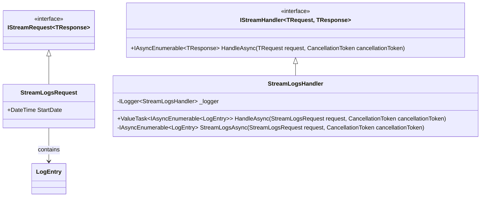
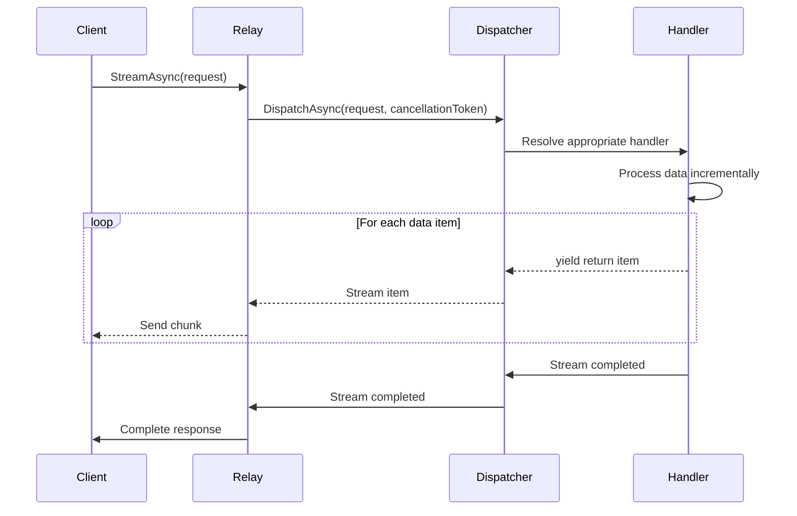
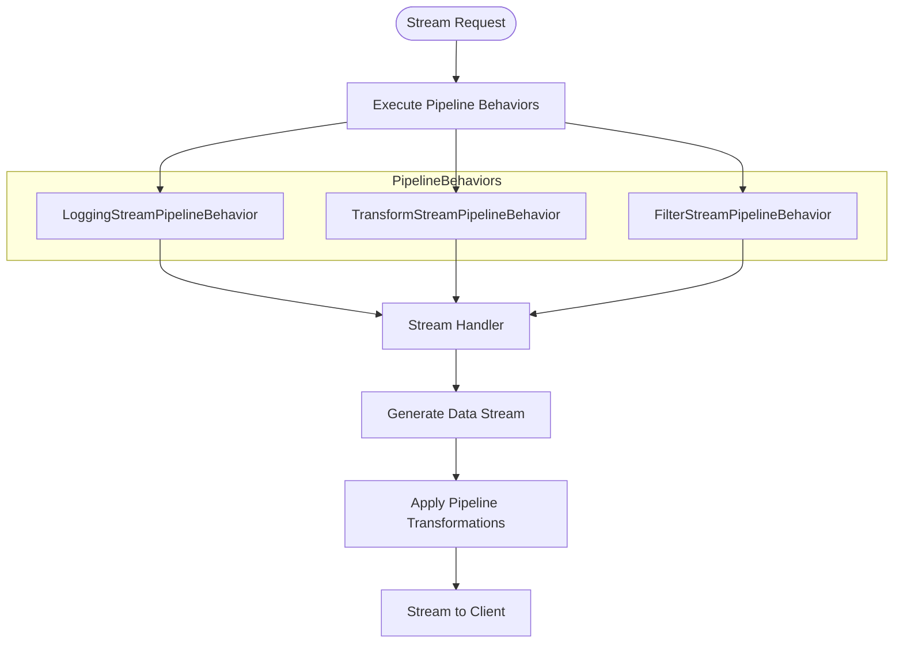
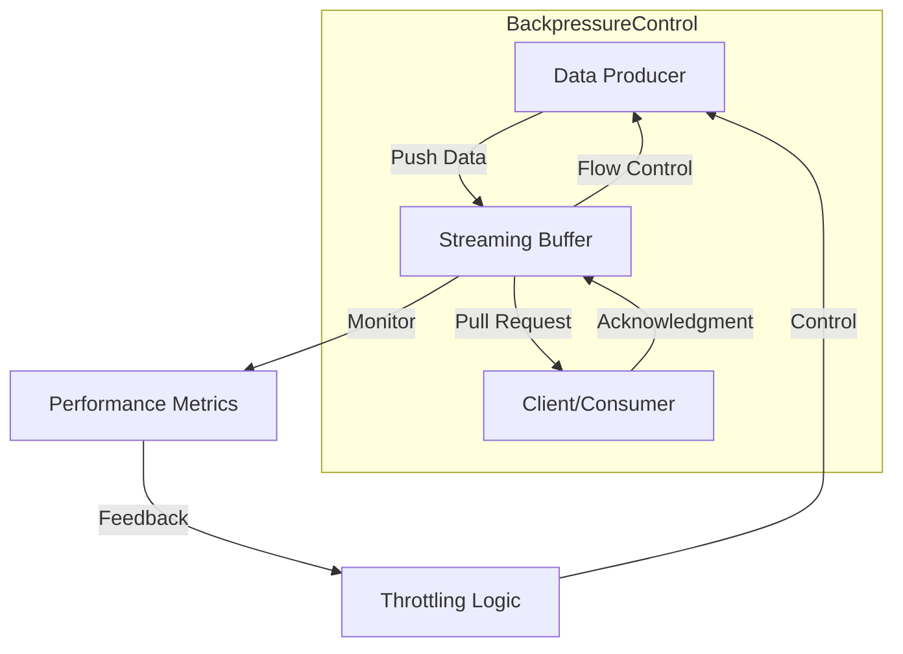
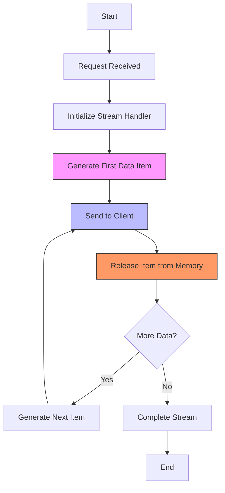
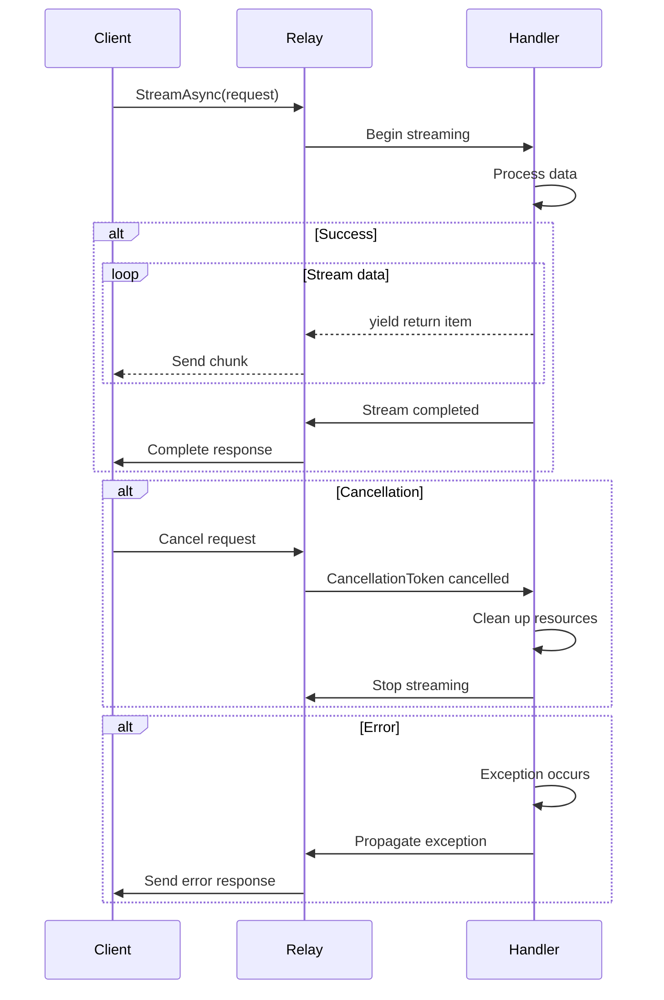

# Streaming Example

<cite>
**Referenced Files in This Document**   
- [StreamLogs.cs](file://samples/Relay.MinimalApiSample/Features/Examples/07-Streaming/StreamLogs.cs)
- [StreamLogsHandler.cs](file://samples/Relay.MinimalApiSample/Features/Examples/07-Streaming/StreamLogsHandler.cs)
- [StreamingTests.cs](file://tests/Relay.Core.Tests/Streaming/StreamingTests.cs)
- [StreamingPipelineTests.cs](file://tests/Relay.Core.Tests/Streaming/StreamingPipelineTests.cs)
- [IStreamDispatcher.cs](file://src/Relay.Core/Contracts/Dispatchers/IStreamDispatcher.cs)
- [StreamDispatcher.cs](file://src/Relay.Core/Implementation/Dispatchers/StreamDispatcher.cs)
- [BaseStreamDispatcher.cs](file://src/Relay.Core/Implementation/Base/BaseStreamDispatcher.cs)
- [IStreamRequest.cs](file://src/Relay.Core/Contracts/Requests/IStreamRequest.cs)
- [Program.cs](file://samples/Relay.MinimalApiSample/Program.cs)
</cite>

## Table of Contents
1. [Introduction](#introduction)
2. [Streaming Architecture Overview](#streaming-architecture-overview)
3. [Core Components](#core-components)
4. [Streaming Request-Handler Relationship](#streaming-request-handler-relationship)
5. [Stream Dispatcher Implementation](#stream-dispatcher-implementation)
6. [Pipeline Integration](#pipeline-integration)
7. [Backpressure Handling](#backpressure-handling)
8. [Memory Management](#memory-management)
9. [Error Recovery and Cancellation](#error-recovery-and-cancellation)
10. [Integration with Async Enumerables](#integration-with-async-enumerables)
11. [Practical Implementation Example](#practical-implementation-example)
12. [Best Practices](#best-practices)

## Introduction

The Relay framework provides robust streaming capabilities for efficiently handling large datasets and real-time data transmission. This document explains the implementation of streaming responses using Relay's streaming features, focusing on the relationship between stream requests, handlers, and dispatchers. The system is designed to process and transmit data incrementally to clients, enabling memory-efficient handling of large datasets while maintaining responsiveness.

Streaming in Relay leverages .NET's `IAsyncEnumerable<T>` pattern to provide a seamless experience for both producers and consumers of streaming data. This approach allows for backpressure handling, proper cancellation support, and integration with the framework's pipeline behaviors and telemetry systems.

**Section sources**
- [StreamLogs.cs](file://samples/Relay.MinimalApiSample/Features/Examples/07-Streaming/StreamLogs.cs)
- [StreamLogsHandler.cs](file://samples/Relay.MinimalApiSample/Features/Examples/07-Streaming/StreamLogsHandler.cs)
- [Program.cs](file://samples/Relay.MinimalApiSample/Program.cs)

## Streaming Architecture Overview

The streaming architecture in Relay follows a clean separation of concerns between requests, handlers, and dispatchers. The system is designed to handle large datasets efficiently by processing and transmitting data incrementally rather than buffering entire datasets in memory.

```mermaid
graph TD
Client[HTTP Client] --> |GET /api/examples/logs/stream| API[API Endpoint]
API --> |relay.StreamAsync()| Relay[Relay Service]
Relay --> |DispatchAsync()| Dispatcher[Stream Dispatcher]
Dispatcher --> |HandleAsync()| Handler[Stream Handler]
Handler --> |IAsyncEnumerable<T>| Data[Data Source]
Data --> |yield return| Handler
Handler --> |IAsyncEnumerable<T>| Dispatcher
Dispatcher --> |IAsyncEnumerable<T>| Relay
Relay --> |Results.Ok()| API
API --> |chunked response| Client
```

**Diagram sources**
- [IStreamDispatcher.cs](file://src/Relay.Core/Contracts/Dispatchers/IStreamDispatcher.cs)
- [StreamDispatcher.cs](file://src/Relay.Core/Implementation/Dispatchers/StreamDispatcher.cs)
- [StreamLogsHandler.cs](file://samples/Relay.MinimalApiSample/Features/Examples/07-Streaming/StreamLogsHandler.cs)

## Core Components

The streaming system in Relay consists of several core components that work together to provide efficient data streaming capabilities:

- **IStreamRequest<TResponse>**: Marker interface for streaming requests that return multiple responses
- **IStreamHandler<TRequest, TResponse>**: Interface for handlers that process streaming requests and return `IAsyncEnumerable<TResponse>`
- **IStreamDispatcher**: Interface for dispatching streaming requests to their handlers
- **StreamDispatcher**: Default implementation of the stream dispatcher
- **BaseStreamDispatcher**: Base class providing common functionality for stream dispatchers

These components work together to create a cohesive streaming system that can handle large datasets efficiently while providing proper error handling and cancellation support.

**Section sources**
- [IStreamRequest.cs](file://src/Relay.Core/Contracts/Requests/IStreamRequest.cs)
- [IStreamDispatcher.cs](file://src/Relay.Core/Contracts/Dispatchers/IStreamDispatcher.cs)
- [StreamDispatcher.cs](file://src/Relay.Core/Implementation/Dispatchers/StreamDispatcher.cs)
- [BaseStreamDispatcher.cs](file://src/Relay.Core/Implementation/Base/BaseStreamDispatcher.cs)

## Streaming Request-Handler Relationship

The relationship between streaming requests and handlers in Relay follows a clear pattern where requests define the contract and handlers implement the streaming logic. A streaming request implements the `IStreamRequest<TResponse>` interface, specifying the type of data that will be streamed.



**Diagram sources**
- [StreamLogs.cs](file://samples/Relay.MinimalApiSample/Features/Examples/07-Streaming/StreamLogs.cs)
- [StreamLogsHandler.cs](file://samples/Relay.MinimalApiSample/Features/Examples/07-Streaming/StreamLogsHandler.cs)
- [IStreamRequest.cs](file://src/Relay.Core/Contracts/Requests/IStreamRequest.cs)

## Stream Dispatcher Implementation

The stream dispatcher is responsible for routing streaming requests to their appropriate handlers. The `IStreamDispatcher` interface defines two methods for dispatching streaming requests: one for general dispatching and another for named handler dispatching.



The `StreamDispatcher` class provides a default implementation that integrates with the framework's pipeline system, allowing for cross-cutting concerns like logging, validation, and telemetry to be applied to streaming operations.

**Diagram sources**
- [IStreamDispatcher.cs](file://src/Relay.Core/Contracts/Dispatchers/IStreamDispatcher.cs)
- [StreamDispatcher.cs](file://src/Relay.Core/Implementation/Dispatchers/StreamDispatcher.cs)

## Pipeline Integration

Streaming operations in Relay integrate seamlessly with the framework's pipeline system, allowing for behaviors to be applied to streaming requests just as they are to regular requests. Pipeline behaviors for streaming implement the `IStreamPipelineBehavior<TRequest, TResponse>` interface and can modify, log, or transform the streaming data.



**Diagram sources**
- [StreamingPipelineTests.cs](file://tests/Relay.Core.Tests/Streaming/StreamingPipelineTests.cs)
- [StreamDispatcher.cs](file://src/Relay.Core/Implementation/Dispatchers/StreamDispatcher.cs)

## Backpressure Handling

Relay's streaming system includes comprehensive backpressure handling to prevent overwhelming clients or downstream systems. The framework uses `IAsyncEnumerable<T>` which naturally supports backpressure through its pull-based model - data is only generated when the consumer requests it.

The system also includes specialized components like `BackpressureStreamDispatcher` that can monitor and control the rate of data flow based on system conditions. This ensures that memory usage remains bounded even when processing large datasets.



**Diagram sources**
- [StreamingTests.cs](file://tests/Relay.Core.Tests/Streaming/StreamingTests.cs)
- [BackpressureStreamDispatcher.cs](file://src/Relay.Core/Implementation/Dispatchers/BackpressureStreamDispatcher.cs)

## Memory Management

One of the key advantages of Relay's streaming implementation is its efficient memory management. Unlike approaches that buffer entire datasets in memory, Relay's streaming system processes data incrementally, yielding items as they become available.

This approach ensures that memory usage remains constant regardless of the total dataset size. The system only keeps a small buffer of data in memory at any given time, making it suitable for handling very large datasets without risking out-of-memory conditions.



**Diagram sources**
- [StreamingTests.cs](file://tests/Relay.Core.Tests/Streaming/StreamingTests.cs)
- [StreamLogsHandler.cs](file://samples/Relay.MinimalApiSample/Features/Examples/07-Streaming/StreamLogsHandler.cs)

## Error Recovery and Cancellation

The streaming system in Relay provides robust error recovery and cancellation support. All streaming operations accept a `CancellationToken` which allows for graceful cancellation when clients disconnect or requests are aborted.

When an exception occurs during streaming, it is propagated to the client in a structured manner, allowing for proper error handling. The system also ensures that resources are properly cleaned up when streams are cancelled or encounter errors.



**Diagram sources**
- [StreamingTests.cs](file://tests/Relay.Core.Tests/Streaming/StreamingTests.cs)
- [StreamLogsHandler.cs](file://samples/Relay.MinimalApiSample/Features/Examples/07-Streaming/StreamLogsHandler.cs)

## Integration with Async Enumerables

Relay's streaming system is built on .NET's `IAsyncEnumerable<T>` pattern, providing a natural and efficient way to work with streaming data. This integration allows for seamless composition of streaming operations and leverages the framework's built-in support for asynchronous enumeration.

The use of `IAsyncEnumerable<T>` provides several benefits:
- Natural backpressure handling through pull-based consumption
- Efficient memory usage with incremental data generation
- Built-in support for cancellation via `CancellationToken`
- Seamless integration with LINQ operators for data transformation

```mermaid
classDiagram
class IAsyncEnumerable~T~ {
<<interface>>
+IAsyncEnumerator~T~ GetAsyncEnumerator(CancellationToken cancellationToken)
}
class IAsyncEnumerator~T~ {
<<interface>>
+ValueTask~bool~ MoveNextAsync()
+T Current {get}
}
class StreamLogsHandler {
+IAsyncEnumerable~LogEntry~ HandleAsync()
}
class Relay {
+IAsyncEnumerable~T~ StreamAsync~T~()
}
IAsyncEnumerable~LogEntry~ <|-- StreamLogsHandler
IAsyncEnumerable~T~ <|-- Relay
IAsyncEnumerable~T~ --> IAsyncEnumerator~T~
```

**Diagram sources**
- [StreamLogsHandler.cs](file://samples/Relay.MinimalApiSample/Features/Examples/07-Streaming/StreamLogsHandler.cs)
- [StreamingTests.cs](file://tests/Relay.Core.Tests/Streaming/StreamingTests.cs)

## Practical Implementation Example

The following example demonstrates how to implement a streaming feature in Relay, based on the log streaming example in the sample application:

```mermaid
flowchart TD
A[API Endpoint] --> B[Create Stream Request]
B --> C[Call relay.StreamAsync()]
C --> D[Dispatcher Routes Request]
D --> E[Stream Handler Processes Data]
E --> F{Apply Business Logic}
F --> G[Generate Data Items]
G --> H[Apply Pipeline Behaviors]
H --> I[Stream to Client]
I --> J{Client Connected?}
J --> |Yes| K[Continue Streaming]
J --> |No| L[Clean Up Resources]
K --> G
L --> M[End]
style A fill:#aaf,stroke:#333
style E fill:#faa,stroke:#333
style I fill:#afa,stroke:#333
```

The implementation follows these key steps:
1. Define a streaming request that implements `IStreamRequest<TResponse>`
2. Implement a handler that returns `IAsyncEnumerable<TResponse>`
3. Register the handler with the dependency injection container
4. Create an API endpoint that calls `relay.StreamAsync()`
5. Return the stream as an `IAsyncEnumerable<T>` response

**Diagram sources**
- [StreamLogs.cs](file://samples/Relay.MinimalApiSample/Features/Examples/07-Streaming/StreamLogs.cs)
- [StreamLogsHandler.cs](file://samples/Relay.MinimalApiSample/Features/Examples/07-Streaming/StreamLogsHandler.cs)
- [Program.cs](file://samples/Relay.MinimalApiSample/Program.cs)

## Best Practices

When implementing streaming features in Relay, consider the following best practices:

1. **Always respect cancellation tokens**: Check the cancellation token regularly and clean up resources when cancelled
2. **Use appropriate buffer sizes**: Configure buffering to balance performance and memory usage
3. **Implement proper error handling**: Ensure exceptions are properly propagated and logged
4. **Monitor performance metrics**: Track streaming performance to identify bottlenecks
5. **Test with large datasets**: Verify that memory usage remains bounded with large data volumes
6. **Consider client capabilities**: Be aware of client limitations when determining streaming rates
7. **Use pipeline behaviors appropriately**: Apply cross-cutting concerns like logging and validation
8. **Implement backpressure handling**: Ensure the system can handle slow consumers gracefully

Following these practices will help ensure that your streaming implementations are efficient, reliable, and maintainable.

**Section sources**
- [StreamingTests.cs](file://tests/Relay.Core.Tests/Streaming/StreamingTests.cs)
- [StreamingPipelineTests.cs](file://tests/Relay.Core.Tests/Streaming/StreamingPipelineTests.cs)
- [StreamLogsHandler.cs](file://samples/Relay.MinimalApiSample/Features/Examples/07-Streaming/StreamLogsHandler.cs)