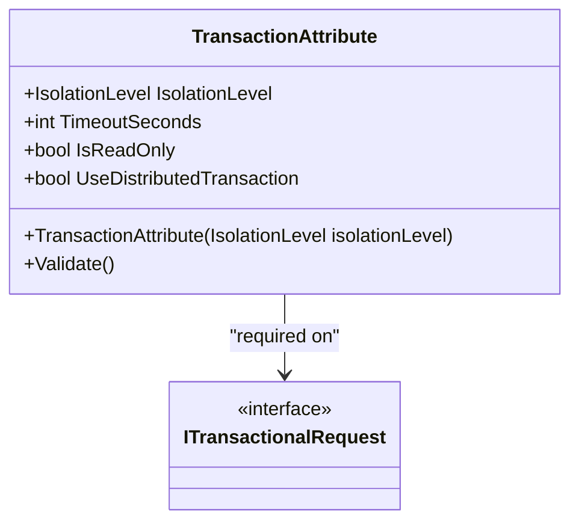
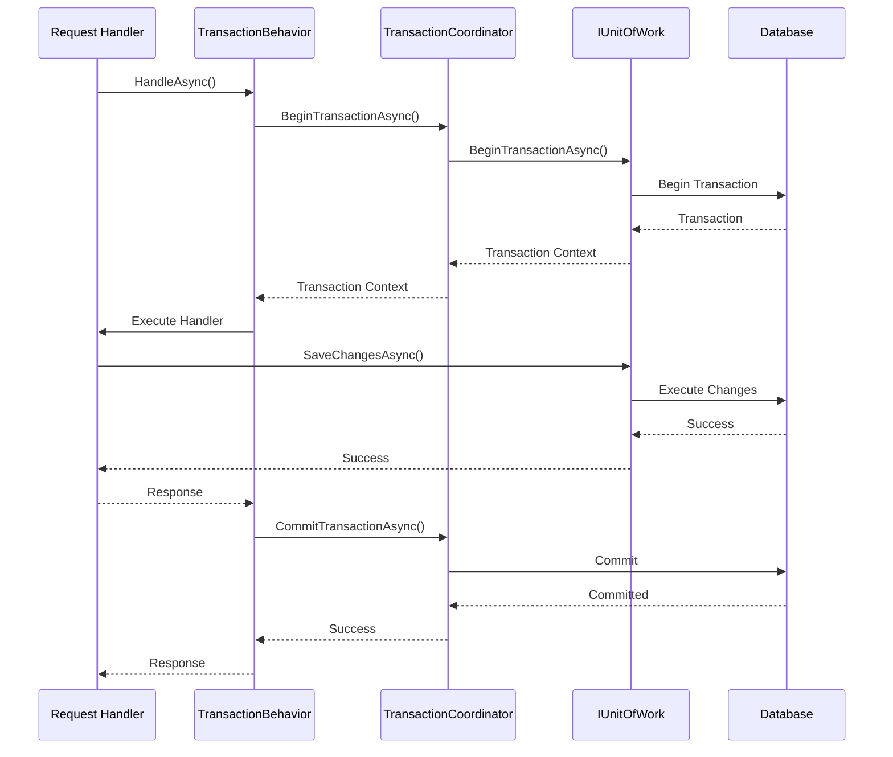
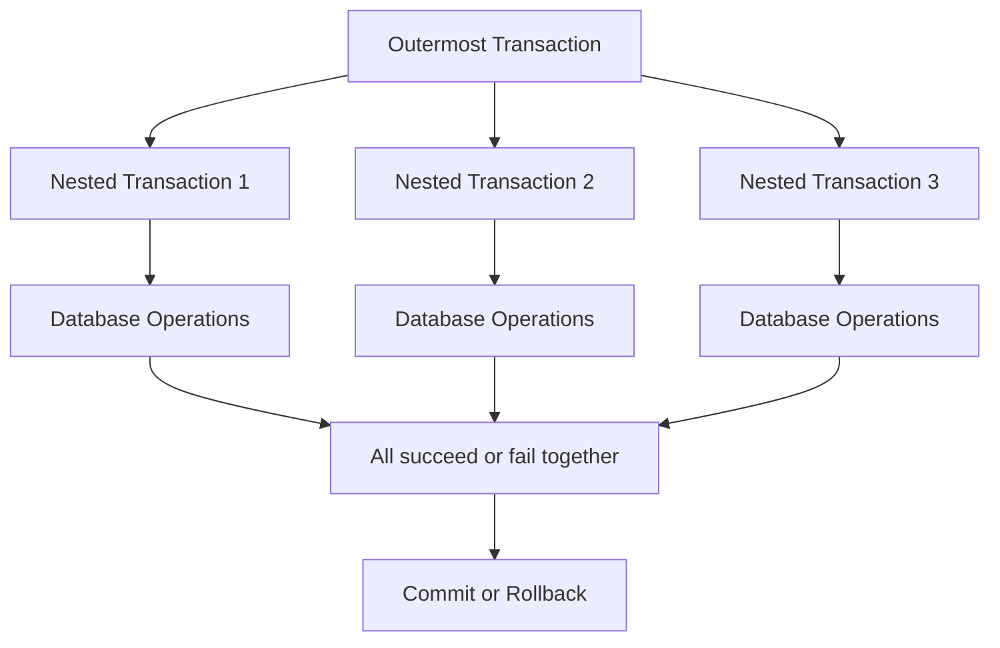
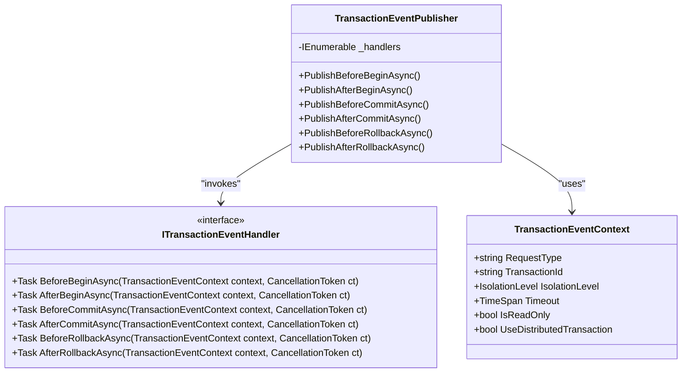
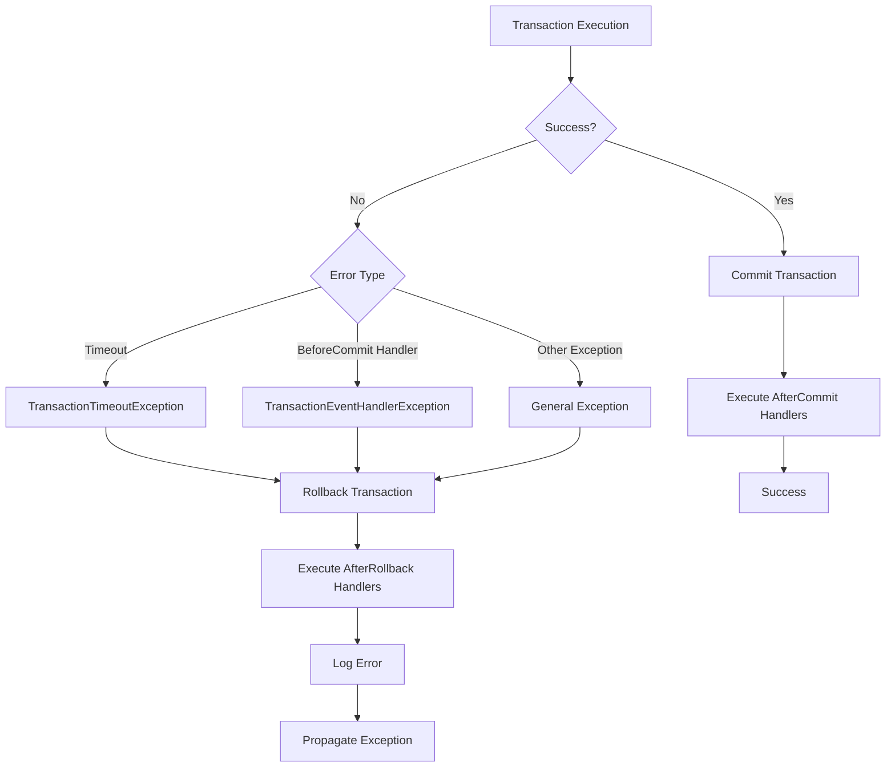
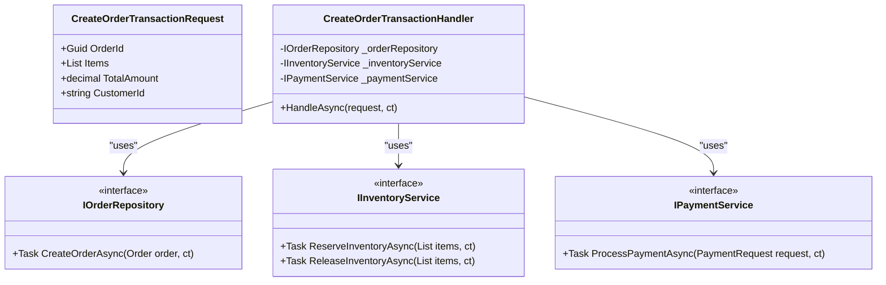

# Transactions Example

<cite>
**Referenced Files in This Document**   
- [TransactionAttribute.cs](file://src/Relay.Core/Transactions/TransactionAttribute.cs)
- [TransactionBehavior.cs](file://src/Relay.Core/Transactions/TransactionBehavior.cs)
- [TransactionCoordinator.cs](file://src/Relay.Core/Transactions/TransactionCoordinator.cs)
- [TransactionConfiguration.cs](file://src/Relay.Core/Transactions/TransactionConfiguration.cs)
- [TransactionConfigurationResolver.cs](file://src/Relay.Core/Transactions/TransactionConfigurationResolver.cs)
- [TransactionServiceCollectionExtensions.cs](file://src/Relay.Core/Transactions/TransactionServiceCollectionExtensions.cs)
- [OutermostTransactionStrategy.cs](file://src/Relay.Core/Transactions/Strategies/OutermostTransactionStrategy.cs)
- [NestedTransactionStrategy.cs](file://src/Relay.Core/Transactions/Strategies/NestedTransactionStrategy.cs)
- [CreateOrderTransaction.cs](file://samples/Relay.MinimalApiSample/Features/Examples/Transactions/CreateOrderTransaction.cs)
- [CreateOrderTransactionHandler.cs](file://samples/Relay.MinimalApiSample/Features/Examples/Transactions/CreateOrderTransactionHandler.cs)
</cite>

## Table of Contents
1. [Introduction](#introduction)
2. [Transaction Configuration](#transaction-configuration)
3. [Transaction Lifecycle Management](#transaction-lifecycle-management)
4. [Nested Transactions](#nested-transactions)
5. [Transaction Event Handling](#transaction-event-handling)
6. [Error Handling and Recovery](#error-handling-and-recovery)
7. [Practical Implementation Example](#practical-implementation-example)
8. [Best Practices](#best-practices)

## Introduction

The Relay transaction management system provides a comprehensive solution for ensuring data consistency in distributed applications. This document explains the implementation of database transactions using Relay's transaction management system, focusing on the relationship between the `TransactionAttribute`, transaction behavior, and underlying database transaction coordination.

The system automatically manages transaction boundaries, ensuring that transactions are properly started, committed, or rolled back based on request success or failure. It supports various database providers and provides features such as transaction isolation level control, timeout enforcement, and automatic retry on transient failures.

The transaction system is implemented as a pipeline behavior that wraps request handlers in database transactions. When a request implements `ITransactionalRequest`, the transaction behavior automatically manages the transaction lifecycle, providing ACID (Atomicity, Consistency, Isolation, Durability) guarantees for database operations.

**Section sources**
- [TransactionBehavior.cs](file://src/Relay.Core/Transactions/TransactionBehavior.cs#L15-L31)
- [TransactionAttribute.cs](file://src/Relay.Core/Transactions/TransactionAttribute.cs#L6-L22)

## Transaction Configuration

Transaction configuration in Relay is primarily managed through the `TransactionAttribute` class, which provides declarative configuration for transactional requests. This attribute is required on all types implementing `ITransactionalRequest` and must specify an explicit isolation level.

**Diagram sources**
- [TransactionAttribute.cs](file://src/Relay.Core/Transactions/TransactionAttribute.cs#L24-L119)
- [ITransactionalRequest.cs](file://src/Relay.Core/Transactions/ITransactionalRequest.cs)

The `TransactionAttribute` class provides several key configuration options:

- **IsolationLevel**: Must be explicitly specified and cannot be `IsolationLevel.Unspecified`. This ensures developers make conscious decisions about transaction isolation behavior.
- **TimeoutSeconds**: Configures transaction timeout in seconds (default: 30). Values of 0 or -1 disable timeout enforcement.
- **IsReadOnly**: Indicates whether the transaction is read-only, allowing database optimizations.
- **UseDistributedTransaction**: Enables distributed transaction coordination across multiple resources.

The `TransactionConfigurationResolver` class resolves transaction configuration from multiple sources following a precedence hierarchy:
1. `TransactionAttribute` on the request type
2. `TransactionRetryAttribute` on the request type
3. Default values from `TransactionOptions`

This configuration system ensures that all transactions have explicit, well-defined behavior while allowing flexibility through attribute-based configuration.

**Section sources**
- [TransactionAttribute.cs](file://src/Relay.Core/Transactions/TransactionAttribute.cs#L24-L119)
- [TransactionConfigurationResolver.cs](file://src/Relay.Core/Transactions/TransactionConfigurationResolver.cs#L26-L207)
- [TransactionConfiguration.cs](file://src/Relay.Core/Transactions/TransactionConfiguration.cs)

## Transaction Lifecycle Management

The transaction lifecycle in Relay is managed by the `TransactionCoordinator` class, which handles the complete transaction workflow from beginning to commit or rollback. The coordinator works in conjunction with the `TransactionBehavior` pipeline behavior to ensure proper transaction management.

**Diagram sources**
- [TransactionBehavior.cs](file://src/Relay.Core/Transactions/TransactionBehavior.cs#L49-L55)
- [TransactionCoordinator.cs](file://src/Relay.Core/Transactions/TransactionCoordinator.cs#L48-L309)
- [OutermostTransactionStrategy.cs](file://src/Relay.Core/Transactions/Strategies/OutermostTransactionStrategy.cs#L49-L228)

The transaction lifecycle follows these key steps:

1. **Transaction Beginning**: The `TransactionCoordinator.BeginTransactionAsync()` method starts a new transaction with the specified isolation level and configures timeout enforcement.

2. **Timeout Enforcement**: If a timeout is configured, a `CancellationTokenSource` is created to automatically cancel the transaction if it exceeds the specified duration.

3. **Request Execution**: The request handler executes within the transaction context, with all database operations participating in the same transaction.

4. **Commit or Rollback**: 
   - On success: The transaction is committed via `CommitTransactionAsync()`
   - On failure: The transaction is rolled back via `RollbackTransactionAsync()`
   - On timeout: A `TransactionTimeoutException` is thrown, triggering rollback

5. **Resource Cleanup**: All transaction resources are properly disposed of in the `finally` block to prevent resource leaks.

The system also supports transaction event hooks that allow custom logic to be executed at various points in the transaction lifecycle, such as before and after commit or rollback.

**Section sources**
- [TransactionCoordinator.cs](file://src/Relay.Core/Transactions/TransactionCoordinator.cs#L48-L309)
- [OutermostTransactionStrategy.cs](file://src/Relay.Core/Transactions/Strategies/OutermostTransactionStrategy.cs#L49-L228)

## Nested Transactions

Relay supports nested transactions through the `NestedTransactionStrategy` and `NestedTransactionManager` classes. This allows multiple transactional operations to be composed within a single outermost transaction, maintaining ACID properties across all operations.

**Diagram sources**
- [NestedTransactionStrategy.cs](file://src/Relay.Core/Transactions/Strategies/NestedTransactionStrategy.cs#L32-L102)
- [NestedTransactionManager.cs](file://src/Relay.Core/Transactions/NestedTransactionManager.cs)

Key aspects of nested transaction management:

- **Context Propagation**: The `NestedTransactionManager` maintains the current transaction context and makes it available to nested operations.

- **Configuration Validation**: Nested transactions must be compatible with the outer transaction's configuration (e.g., isolation level, read-only status).

- **Shared Transaction Context**: All nested transactions share the same underlying database transaction, ensuring atomicity.

- **Exception Propagation**: Exceptions in nested transactions propagate to the outer transaction, causing a complete rollback.

- **Lifecycle Coordination**: The `NestedTransactionManager` tracks nesting level and ensures proper entry and exit from nested transactions.

When a nested transaction is detected, the system reuses the existing transaction context rather than creating a new transaction. This ensures that all operations participate in the same atomic unit of work, maintaining data consistency across the entire operation chain.

**Section sources**
- [NestedTransactionStrategy.cs](file://src/Relay.Core/Transactions/Strategies/NestedTransactionStrategy.cs#L32-L102)
- [NestedTransactionManager.cs](file://src/Relay.Core/Transactions/NestedTransactionManager.cs)

## Transaction Event Handling

The Relay transaction system provides a comprehensive event handling mechanism that allows custom logic to be executed at various points in the transaction lifecycle. This is implemented through the `ITransactionEventHandler` interface and `TransactionEventPublisher` class.

**Diagram sources**
- [ITransactionEventHandler.cs](file://src/Relay.Core/Transactions/ITransactionEventHandler.cs)
- [TransactionEventPublisher.cs](file://src/Relay.Core/Transactions/TransactionEventPublisher.cs)
- [TransactionEventContext.cs](file://src/Relay.Core/Transactions/TransactionEventContext.cs)

The event handling system supports the following lifecycle events:

- **BeforeBegin**: Executed before the transaction begins, useful for pre-transaction setup.
- **AfterBegin**: Executed after the transaction begins, useful for initialization.
- **BeforeCommit**: Executed before commit; failures here cause transaction rollback.
- **AfterCommit**: Executed after successful commit, useful for post-processing.
- **BeforeRollback**: Executed before rollback, useful for cleanup.
- **AfterRollback**: Executed after rollback, useful for notification.

Event handlers are registered through dependency injection using the `AddTransactionEventHandler<THandler>()` method. Multiple handlers can be registered and they are executed in parallel for better performance. The system distinguishes between critical and non-critical handlers:
- `BeforeCommit` handler failures cause transaction rollback
- Other handler failures are logged but don't affect transaction outcome

This event system enables cross-cutting concerns like auditing, caching, and notification to be implemented in a clean, decoupled manner.

**Section sources**
- [ITransactionEventHandler.cs](file://src/Relay.Core/Transactions/ITransactionEventHandler.cs)
- [TransactionEventPublisher.cs](file://src/Relay.Core/Transactions/TransactionEventPublisher.cs)
- [TransactionServiceCollectionExtensions.cs](file://src/Relay.Core/Transactions/TransactionServiceCollectionExtensions.cs#L213-L308)

## Error Handling and Recovery

The Relay transaction system implements comprehensive error handling and recovery mechanisms to ensure data consistency and resilience in the face of failures.

**Diagram sources**
- [OutermostTransactionStrategy.cs](file://src/Relay.Core/Transactions/Strategies/OutermostTransactionStrategy.cs#L49-L228)
- [TransactionCoordinator.cs](file://src/Relay.Core/Transactions/TransactionCoordinator.cs#L208-L280)

Key error handling features include:

- **Timeout Handling**: Transactions that exceed their configured timeout are automatically rolled back and a `TransactionTimeoutException` is thrown. The system uses `CancellationTokenSource` with `CancelAfter()` to enforce timeouts.

- **Transient Error Recovery**: The system supports automatic retry on transient failures through the `TransactionRetryHandler` and `TransactionRetryPolicy`. This helps recover from temporary issues like connection timeouts or deadlocks.

- **Exception Classification**: The system distinguishes between different types of exceptions:
  - `TransactionTimeoutException`: Thrown when transaction exceeds timeout
  - `TransactionEventHandlerException`: Thrown when event handlers fail
  - `ReadOnlyTransactionViolationException`: Thrown when write operations are attempted in read-only transactions
  - `NestedTransactionException`: Thrown when nested transaction configuration is invalid

- **Rollback on Failure**: Any exception during transaction execution triggers a rollback, ensuring data consistency. The system ensures that rollback is attempted even if the original operation fails.

- **Comprehensive Logging**: All transaction operations and failures are logged with detailed diagnostic information, including transaction ID, request type, duration, and error details.

- **Metrics Collection**: The system collects metrics on transaction success, failure, and timeout rates, which can be used for monitoring and performance optimization.

The error handling system is designed to be resilient while maintaining data integrity, ensuring that applications can recover from failures without compromising data consistency.

**Section sources**
- [OutermostTransactionStrategy.cs](file://src/Relay.Core/Transactions/Strategies/OutermostTransactionStrategy.cs#L140-L228)
- [TransactionCoordinator.cs](file://src/Relay.Core/Transactions/TransactionCoordinator.cs#L123-L280)
- [TransactionException.cs](file://src/Relay.Core/Transactions/TransactionException.cs)

## Practical Implementation Example

The following example demonstrates the practical implementation of transactions in the Relay framework, showing how to configure and use transactions in a real-world scenario.

**Diagram sources**
- [CreateOrderTransaction.cs](file://samples/Relay.MinimalApiSample/Features/Examples/Transactions/CreateOrderTransaction.cs)
- [CreateOrderTransactionHandler.cs](file://samples/Relay.MinimalApiSample/Features/Examples/Transactions/CreateOrderTransactionHandler.cs)

The example shows a typical order processing workflow that requires multiple database operations and service calls to be executed atomically:

1. **Request Definition**: The `CreateOrderTransactionRequest` implements `ITransactionalRequest` and is decorated with the `Transaction` attribute specifying the isolation level and timeout.

2. **Handler Implementation**: The `CreateOrderTransactionHandler` performs multiple operations:
   - Reserve inventory items
   - Process payment
   - Create order record
   - Update customer order history

3. **Automatic Transaction Management**: The `TransactionBehavior` automatically wraps the entire handler execution in a transaction. If any step fails, the entire transaction is rolled back.

4. **Configuration**: The transaction is configured with `ReadCommitted` isolation level and a 30-second timeout, ensuring data consistency while preventing long-running transactions.

5. **Error Recovery**: If the payment processing fails, the inventory reservation is automatically released through transaction rollback, preventing inventory lock-up.

This example demonstrates how Relay's transaction system simplifies complex business operations by automatically managing transaction boundaries and ensuring data consistency across multiple operations.

**Section sources**
- [CreateOrderTransaction.cs](file://samples/Relay.MinimalApiSample/Features/Examples/Transactions/CreateOrderTransaction.cs)
- [CreateOrderTransactionHandler.cs](file://samples/Relay.MinimalApiSample/Features/Examples/Transactions/CreateOrderTransactionHandler.cs)
- [Program.cs](file://samples/Relay.MinimalApiSample/Program.cs#L273-L285)

## Best Practices

To effectively use Relay's transaction management system, follow these best practices:

### Transaction Configuration
- Always specify an explicit isolation level; avoid `IsolationLevel.Unspecified`
- Set appropriate timeouts to prevent long-running transactions from blocking resources
- Use read-only transactions for queries to enable database optimizations
- Consider the trade-offs between isolation levels and performance

### Performance Considerations
- Keep transactions as short as possible to minimize lock contention
- Avoid user interaction within transactions
- Batch multiple operations within a single transaction when appropriate
- Use connection pooling to reduce connection overhead

### Error Handling
- Implement proper exception handling and logging
- Use transaction event handlers for cross-cutting concerns
- Configure appropriate retry policies for transient failures
- Monitor transaction metrics to identify performance issues

### Distributed Transactions
- Use distributed transactions only when absolutely necessary
- Be aware of the performance overhead of distributed transactions
- Ensure all participating resources support distributed transactions
- Test distributed transaction scenarios thoroughly

### Testing
- Write unit tests for transactional code
- Test timeout scenarios
- Verify rollback behavior on failure
- Test nested transaction scenarios
- Validate transaction isolation behavior

By following these best practices, you can ensure that your applications maintain data consistency while achieving optimal performance and reliability.

**Section sources**
- [TransactionAttribute.cs](file://src/Relay.Core/Transactions/TransactionAttribute.cs)
- [TransactionOptions.cs](file://src/Relay.Core/Transactions/TransactionOptions.cs)
- [TransactionServiceCollectionExtensions.cs](file://src/Relay.Core/Transactions/TransactionServiceCollectionExtensions.cs)