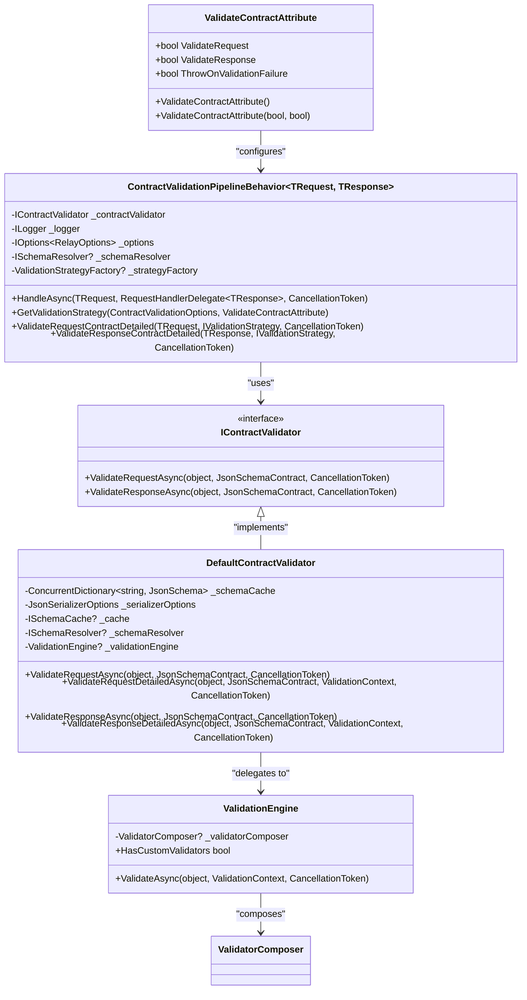
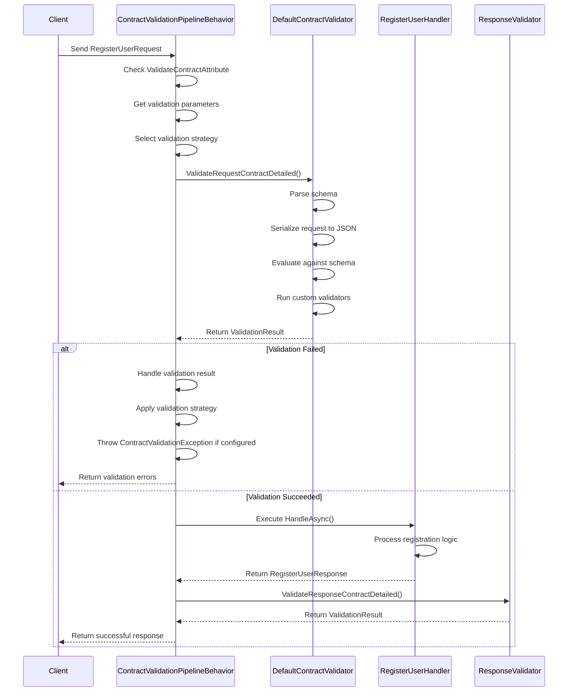
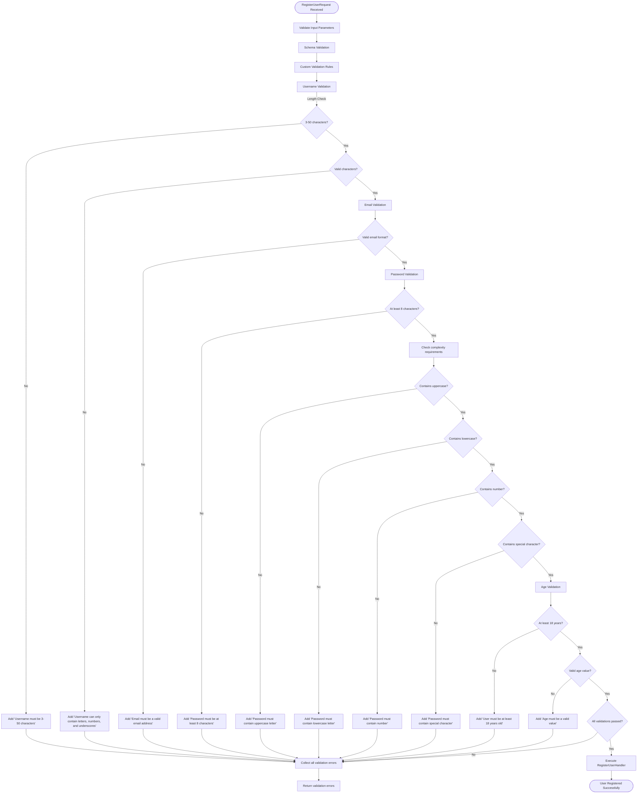
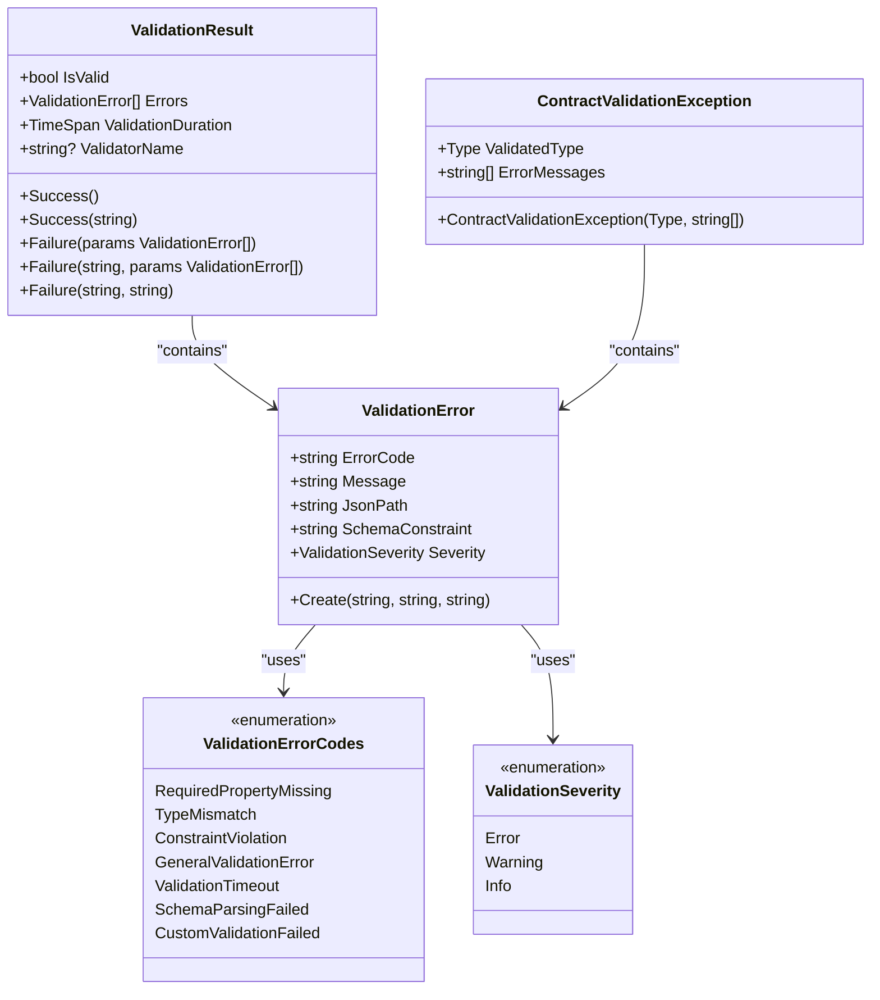
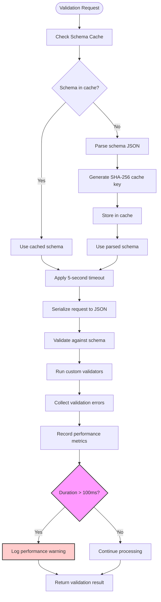
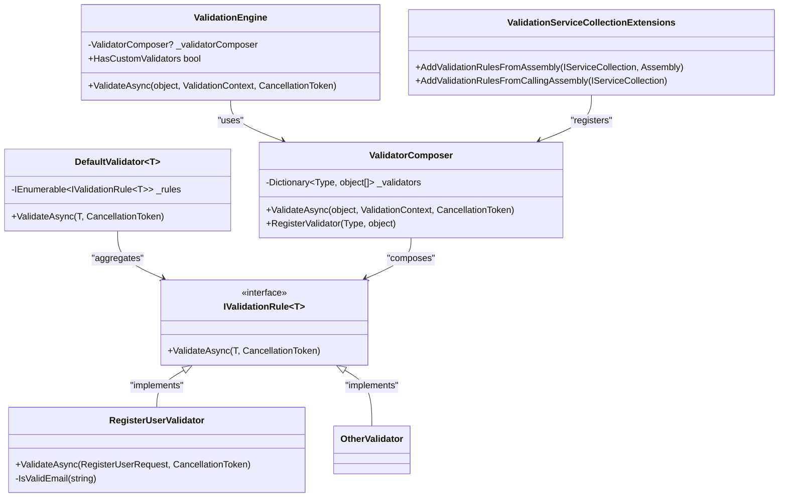
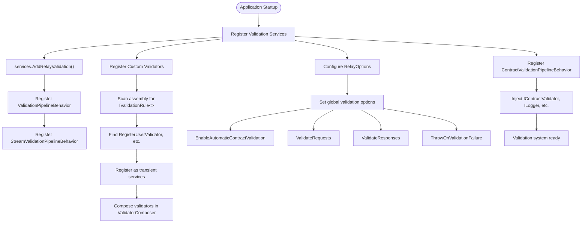

# Validation Example

<cite>
**Referenced Files in This Document**   
- [ValidateContractAttribute.cs](file://src/Relay.Core/ContractValidation/ValidateContractAttribute.cs)
- [ContractValidationPipelineBehavior.cs](file://src/Relay.Core/ContractValidation/ContractValidationPipelineBehavior.cs)
- [DefaultContractValidator.cs](file://src/Relay.Core/ContractValidation/DefaultContractValidator.cs)
- [IContractValidator.cs](file://src/Relay.Core/ContractValidation/IContractValidator.cs)
- [ValidationEngine.cs](file://src/Relay.Core/ContractValidation/ValidationEngine.cs)
- [RegisterUser.cs](file://samples/Relay.MinimalApiSample/Features/Examples/01-Validation/RegisterUser.cs)
- [RegisterUserHandler.cs](file://samples/Relay.MinimalApiSample/Features/Examples/01-Validation/RegisterUserHandler.cs)
- [RegisterUserValidator.cs](file://samples/Relay.MinimalApiSample/Features/Examples/01-Validation/RegisterUserValidator.cs)
- [ValidationServiceCollectionExtensions.cs](file://src/Relay.Core/Extensions/ValidationServiceCollectionExtensions.cs)
</cite>

## Table of Contents
1. [Introduction](#introduction)
2. [Core Validation Components](#core-validation-components)
3. [Validation Pipeline Integration](#validation-pipeline-integration)
4. [Request Validation Implementation](#request-validation-implementation)
5. [Error Handling and Reporting](#error-handling-and-reporting)
6. [Performance Considerations](#performance-considerations)
7. [Custom Validator Creation](#custom-validator-creation)
8. [Configuration and Setup](#configuration-and-setup)
9. [Conclusion](#conclusion)

## Introduction

The Relay framework provides a comprehensive contract validation system that ensures data integrity throughout the request-response lifecycle. This document explains the implementation of request validation using Relay's contract validation system, focusing on the relationship between the RegisterUser request, RegisterUserValidator, and RegisterUserHandler components. The validation system integrates seamlessly with the pipeline behavior to perform automatic validation, providing robust error reporting and performance monitoring capabilities.

The validation feature demonstrates how Relay enforces data contracts through a combination of schema validation and custom business rule validation. This approach ensures that all incoming requests meet specified requirements before being processed by handlers, reducing the risk of data inconsistencies and security vulnerabilities.

**Section sources**
- [RegisterUser.cs](file://samples/Relay.MinimalApiSample/Features/Examples/01-Validation/RegisterUser.cs)
- [RegisterUserHandler.cs](file://samples/Relay.MinimalApiSample/Features/Examples/01-Validation/RegisterUserHandler.cs)

## Core Validation Components

The Relay validation system consists of several key components that work together to provide comprehensive contract validation. The `ValidateContractAttribute` serves as the primary mechanism for enabling validation on specific requests or handlers. This attribute allows configuration of request validation, response validation, and failure behavior through its properties: `ValidateRequest`, `ValidateResponse`, and `ThrowOnValidationFailure`.

The `IContractValidator` interface defines the contract for validation implementations, specifying methods for validating both request and response contracts against JSON schemas. The `DefaultContractValidator` provides the default implementation using JsonSchema.Net, handling schema parsing, caching, and validation execution. This validator integrates with the `ValidationEngine` which orchestrates both schema validation and custom validators.

The `ContractValidationPipelineBehavior` acts as the integration point between the validation system and the request processing pipeline. It intercepts requests before they reach the handler, performs validation according to configured rules, and handles validation results based on the selected strategy. This behavior supports both request and response validation, with configurable timeout and performance monitoring.

**Diagram sources**
- [ValidateContractAttribute.cs](file://src/Relay.Core/ContractValidation/ValidateContractAttribute.cs)
- [IContractValidator.cs](file://src/Relay.Core/ContractValidation/IContractValidator.cs)
- [DefaultContractValidator.cs](file://src/Relay.Core/ContractValidation/DefaultContractValidator.cs)
- [ValidationEngine.cs](file://src/Relay.Core/ContractValidation/ValidationEngine.cs)
- [ContractValidationPipelineBehavior.cs](file://src/Relay.Core/ContractValidation/ContractValidationPipelineBehavior.cs)

**Section sources**
- [ValidateContractAttribute.cs](file://src/Relay.Core/ContractValidation/ValidateContractAttribute.cs)
- [IContractValidator.cs](file://src/Relay.Core/ContractValidation/IContractValidator.cs)
- [DefaultContractValidator.cs](file://src/Relay.Core/ContractValidation/DefaultContractValidator.cs)
- [ValidationEngine.cs](file://src/Relay.Core/ContractValidation/ValidationEngine.cs)

## Validation Pipeline Integration

The `ValidateContractAttribute` integrates with the pipeline behavior through the `ContractValidationPipelineBehavior` class, which is automatically injected into the request processing pipeline. When a request is processed, the pipeline behavior checks for the presence of the `ValidateContractAttribute` and applies validation according to the configured rules.

The integration follows a structured flow: first, the pipeline behavior determines whether validation is enabled based on global configuration and the presence of the `ValidateContractAttribute`. If validation is enabled, it retrieves the validation parameters and selects the appropriate validation strategy. The behavior then validates the request contract before allowing the handler to execute, and optionally validates the response contract afterward.

The pipeline behavior supports multiple validation strategies through the `ValidationStrategyFactory`, allowing different approaches to handling validation failures. The default strategy throws a `ContractValidationException` when validation fails, but custom strategies can be implemented to handle failures differently, such as logging warnings or returning partial results.

**Diagram sources**
- [ContractValidationPipelineBehavior.cs](file://src/Relay.Core/ContractValidation/ContractValidationPipelineBehavior.cs)
- [DefaultContractValidator.cs](file://src/Relay.Core/ContractValidation/DefaultContractValidator.cs)
- [RegisterUserHandler.cs](file://samples/Relay.MinimalApiSample/Features/Examples/01-Validation/RegisterUserHandler.cs)

**Section sources**
- [ContractValidationPipelineBehavior.cs](file://src/Relay.Core/ContractValidation/ContractValidationPipelineBehavior.cs)

## Request Validation Implementation

The request validation implementation demonstrates the relationship between the `RegisterUser` request, `RegisterUserValidator`, and `RegisterUserHandler` components. The `RegisterUserRequest` is a record type that defines the data contract for user registration, including required fields such as username, email, password, and age.

The `RegisterUserValidator` implements the `IValidationRule<RegisterUserRequest>` interface, providing custom business rule validation beyond basic schema validation. This validator enforces rules such as username length (3-50 characters), email format validation, password complexity requirements (minimum 8 characters with uppercase, lowercase, number, and special character), and age restrictions (minimum 18 years).

When a `RegisterUserRequest` is received, the validation system automatically invokes the `RegisterUserValidator` through the `ValidationEngine`. The validator processes the request and returns a collection of error messages for any violations. These errors are aggregated with any schema validation errors and presented as a comprehensive validation result.

**Diagram sources**
- [RegisterUser.cs](file://samples/Relay.MinimalApiSample/Features/Examples/01-Validation/RegisterUser.cs)
- [RegisterUserValidator.cs](file://samples/Relay.MinimalApiSample/Features/Examples/01-Validation/RegisterUserValidator.cs)
- [RegisterUserHandler.cs](file://samples/Relay.MinimalApiSample/Features/Examples/01-Validation/RegisterUserHandler.cs)

**Section sources**
- [RegisterUser.cs](file://samples/Relay.MinimalApiSample/Features/Examples/01-Validation/RegisterUser.cs)
- [RegisterUserValidator.cs](file://samples/Relay.MinimalApiSample/Features/Examples/01-Validation/RegisterUserValidator.cs)

## Error Handling and Reporting

The Relay validation system provides comprehensive error handling and reporting through the `ValidationResult` and `ValidationError` classes. When validation fails, the system returns detailed error information including error codes, messages, JSON paths, and schema constraints. The `ValidationError` class categorizes errors using specific error codes such as `RequiredPropertyMissing`, `TypeMismatch`, and `ConstraintViolation`, making it easier to identify the nature of validation failures.

The error reporting system supports both simple string-based errors and structured error objects with additional metadata. This allows clients to handle validation errors programmatically by examining error codes rather than parsing error messages. The system also includes performance monitoring, logging validation duration and error counts for observability.

In cases where validation times exceed 100ms, the system generates performance warnings to alert developers of potential bottlenecks. The `ContractValidationException` is thrown when validation fails and `ThrowOnValidationFailure` is set to true, containing all validation errors for the client to process.

**Diagram sources**
- [ValidationResult.cs](file://src/Relay.Core/ContractValidation/Models/ValidationResult.cs)
- [ValidationError.cs](file://src/Relay.Core/ContractValidation/Models/ValidationError.cs)
- [ContractValidationException.cs](file://src/Relay.Core/ContractValidation/ContractValidationException.cs)

**Section sources**
- [ValidationResult.cs](file://src/Relay.Core/ContractValidation/Models/ValidationResult.cs)
- [ValidationError.cs](file://src/Relay.Core/ContractValidation/Models/ValidationError.cs)

## Performance Considerations

The Relay validation system incorporates several performance optimizations to ensure efficient validation processing. The `DefaultContractValidator` implements schema caching using either the `ISchemaCache` interface or an internal `ConcurrentDictionary`, preventing repeated parsing of the same JSON schemas. Schema cache keys are generated using SHA-256 hashes of the schema JSON, ensuring uniqueness while avoiding collisions.

The validation process includes timeout protection with a default 5-second limit, preventing long-running validation operations from blocking the request pipeline. Performance metrics are automatically collected, including validation duration and error counts, which can be used to identify slow validation scenarios. The system logs warnings when validation exceeds 100ms, helping developers optimize problematic validations.

The `ValidationEngine` optimizes custom validator execution by composing validators through the `ValidatorComposer`, reducing the overhead of reflection-based discovery during request processing. The pipeline behavior also supports early cancellation through the `CancellationToken`, allowing validation to be aborted if the client disconnects or the request times out.

**Diagram sources**
- [DefaultContractValidator.cs](file://src/Relay.Core/ContractValidation/DefaultContractValidator.cs)
- [ContractValidationPipelineBehavior.cs](file://src/Relay.Core/ContractValidation/ContractValidationPipelineBehavior.cs)

**Section sources**
- [DefaultContractValidator.cs](file://src/Relay.Core/ContractValidation/DefaultContractValidator.cs)

## Custom Validator Creation

Creating custom validators in Relay involves implementing the `IValidationRule<T>` interface for specific request types. The `RegisterUserValidator` example demonstrates how to create a custom validator that enforces business rules beyond basic schema validation. Custom validators are automatically discovered and registered through the `AddValidationRulesFromAssembly` extension method, which scans assemblies for types implementing `IValidationRule<>`.

The validation system composes multiple validators for the same request type, allowing modular validation logic to be distributed across different classes. Each validator returns a collection of error messages, which are aggregated into a comprehensive validation result. The `ValidationEngine` coordinates the execution of all registered validators for a given request type.

Custom validators can access the full `ValidationContext`, providing information about the object being validated, its type, and any associated metadata. This context enables validators to make decisions based on runtime conditions and handler-specific requirements.

**Diagram sources**
- [RegisterUserValidator.cs](file://samples/Relay.MinimalApiSample/Features/Examples/01-Validation/RegisterUserValidator.cs)
- [ValidationServiceCollectionExtensions.cs](file://src/Relay.Core/Extensions/ValidationServiceCollectionExtensions.cs)
- [ValidatorComposer.cs](file://src/Relay.Core/Validation/ValidatorComposer.cs)

**Section sources**
- [RegisterUserValidator.cs](file://samples/Relay.MinimalApiSample/Features/Examples/01-Validation/RegisterUserValidator.cs)
- [ValidationServiceCollectionExtensions.cs](file://src/Relay.Core/Extensions/ValidationServiceCollectionExtensions.cs)

## Configuration and Setup

Configuring the validation system in Relay involves registering validation services and validators through the dependency injection container. The `AddRelayValidation` extension method registers the core validation pipeline behaviors, while `AddValidationRulesFromAssembly` or `AddValidationRulesFromCallingAssembly` automatically discovers and registers custom validators.

The validation behavior can be controlled globally through `RelayOptions` or on a per-request basis using the `ValidateContractAttribute`. Global options include `EnableAutomaticContractValidation`, `ValidateRequests`, `ValidateResponses`, and `ThrowOnValidationFailure`, which set the default behavior for all requests. The `ValidateContractAttribute` allows overriding these defaults for specific handlers or requests.

The system supports configuration of validation strategies, schema resolvers, and metrics collection through optional parameters in the `ContractValidationPipelineBehavior` constructor. This allows customization of validation behavior based on application requirements.

**Diagram sources**
- [ValidationServiceCollectionExtensions.cs](file://src/Relay.Core/Extensions/ValidationServiceCollectionExtensions.cs)
- [ContractValidationPipelineBehavior.cs](file://src/Relay.Core/ContractValidation/ContractValidationPipelineBehavior.cs)
- [RelayOptions.cs](file://src/Relay.Core/Configuration/Options/Core/RelayOptions.cs)

**Section sources**
- [ValidationServiceCollectionExtensions.cs](file://src/Relay.Core/Extensions/ValidationServiceCollectionExtensions.cs)

## Conclusion

The Relay contract validation system provides a robust, extensible framework for ensuring data integrity in distributed applications. By integrating validation into the request processing pipeline through the `ValidateContractAttribute` and `ContractValidationPipelineBehavior`, Relay ensures that all requests are validated before reaching business logic handlers.

The system combines schema-based validation with custom business rule validation, allowing comprehensive data validation that covers both structural and semantic requirements. The modular design enables easy extension through custom validators, while performance optimizations like schema caching and timeout protection ensure efficient validation processing.

For developers implementing validation in their applications, the key considerations are: using the `ValidateContractAttribute` to enable validation, implementing `IValidationRule<T>` for custom business rules, and configuring validation behavior through global options or attribute parameters. The comprehensive error reporting and performance monitoring features provide valuable insights for debugging and optimization.

The validation example demonstrates how these components work together to create a reliable, maintainable validation system that enhances application quality and security.